# PWD301 — Online Course Management Platform

> **MASTER PROJECT README / COMPLETE PROJECT KNOWLEDGE BASE / HUMAN-READABLE SOURCE OF TRUTH**

**Trạng thái nguồn tại thời điểm tạo README**

- Database chuẩn: **Microsoft SQL Server**, validated architecture có **71 bảng**.
- Business Rule Catalog: **73 rule IDs**.
- API catalog: **40 endpoints** (đường dẫn là `DERIVED API DESIGN` nếu không bị rubric khóa trực tiếp).
- Acceptance Criteria catalog: **28 tiêu chí chính**.
- Công nghệ bị khóa bởi môn/project: Python 3.11+, Flask, Flask-SQLAlchemy, Flask-WTF, Flask-Login, Flask-Migrate/Alembic, Jinja2, Bootstrap 5, AJAX/Fetch, JWT, SQL Server, Docker.
- Authentication split: Web/Jinja/AJAX dùng **session + CSRF**; REST API dùng **JWT**; JWT không được lưu trong `localStorage` cho Web UI.
- Rule video hiện hành: **`< 1 GB`**. Mốc `~2 GB` là `SUPERSEDED`.
- Assessment **không immutable hoàn toàn sau publish**: timing khóa sau publish; structure/assigned points khóa sau Student đầu tiên start; Question correction vẫn tiếp tục bằng QuestionRevision/correction/regrading.

---

## Table of Contents

README được tổ chức như một cuốn sách kỹ thuật. Phần I giải thích hệ thống theo thứ tự từ product → nghiệp vụ → kiến trúc → vận hành. Phần II nhúng các contract kỹ thuật chuẩn từ System Specification/Database Architecture để file này tự đứng độc lập.

1. Project Overview  
2. Project Background  
3. Course/Rubric Requirements  
4. Goals  
5. Non-Goals  
6. Technology Stack  
7. Architecture Principles  
8. System Architecture  
9. Actors  
10. Role Model  
11. Permission Model  
12. Authentication  
13. Authorization  
14. User Lifecycle  
15. Course Domain  
16. Lesson Domain  
17. Enrollment  
18. Prerequisites  
19. Progress  
20. Course Completion  
21. Question Bank  
22. Question Types  
23. Question Versioning  
24. Question Correction  
25. Assessment Engine  
26. Assessment Lifecycle  
27. Assessment Configuration  
28. Question Selection  
29. Blueprint Generation  
30. Attempt Lifecycle  
31. Stable Attempt Snapshot  
32. Timer  
33. Autosave  
34. Offline Recovery  
35. Single Active Tab  
36. Submission  
37. Grading  
38. Regrading  
39. Manual Essay Grading  
40. Result Release  
41. Notifications  
42. Email  
43. File Management  
44. File Security  
45. DOCX/PDF Import  
46. AI-generated Questions  
47. Gemini Integration  
48. AI Assistant  
49. RAG Architecture  
50. AI Security  
51. Audit  
52. Admin Sensitive Operations  
53. Delete / Archive / Restore  
54. Retention  
55. Data Anonymization  
56. Database Architecture  
57. Database Conventions  
58. Core Tables  
59. Relationships  
60. Constraints  
61. Indexing  
62. Concurrency  
63. Background Jobs  
64. Idempotency  
65. API Architecture  
66. AJAX  
67. Error Model  
68. Frontend Architecture  
69. Student UX  
70. Instructor UX  
71. Admin UX  
72. Security Architecture  
73. Threat Model  
74. Logging  
75. Monitoring  
76. Backup  
77. Restore  
78. Docker / Deployment  
79. Configuration  
80. Testing Strategy  
81. Acceptance Criteria  
82. Edge Cases  
83. Implementation Order  
84. Coding Agent Rules  
85. Non-Negotiable Invariants  
86. Architecture Decisions  
87. Superseded Decisions  
88. Open Issues  
89. Glossary  
90. Final System Summary  
91+. Embedded Canonical Technical Reference

---

# PHẦN I — PROJECT MANUAL

## 1. Project Overview

PWD301 là một **Online Course Management Platform / Learning Management System (LMS)** được mở rộng từ Topic 9 của môn PWD301 thành một hệ thống học trực tuyến có định hướng production-ready. Hệ thống phục vụ ba actor chính: **Student**, **Instructor**, **Admin**; thêm **System/Worker** như actor kỹ thuật chạy tác vụ nền.

Luồng cốt lõi của sản phẩm:

```text
Instructor tạo Course/Lesson/Question/Assessment
        ↓
Admin governance/review khi policy yêu cầu
        ↓
Student khám phá Course → kiểm tra prerequisite/capacity → enroll
        ↓
Student học Lesson → hệ thống ghi evidence → tính progress/completion
        ↓
Student làm Assessment → snapshot đề → autosave → submit/expire
        ↓
Auto grading + manual essay grading → AssessmentResult
        ↓
Progress / recommendation / analytics / notifications / AI explanation
```

Project không dừng ở CRUD Course đơn giản. Những phần khó đã được thiết kế rõ gồm Question versioning, Assessment snapshot, server-authoritative timer, offline autosave, single-active-tab lease, regrading sau correction, file quarantine, DOCX/PDF import, Gemini/RAG authorization, append-only audit, retention và recovery.

## 2. Project Background

Topic gốc của rubric chỉ yêu cầu Instructor tạo Course với Lesson có thứ tự, Student browse/enroll/progress, Markdown Lesson, simple multiple-choice quiz, ba role, REST API và AJAX. Trong quá trình Plan Mode, project được nâng cấp thành **Production-Ready Intelligent Online Learning Management Platform** nhưng vẫn giữ stack và scope môn học.

Hướng triển khai ưu tiên là **self-host**: Flask application, SQL Server, private file storage, background workers và ClamAV chạy trong hạ tầng do nhóm kiểm soát; Gemini inference gọi qua API từ backend. Không tự biến hệ thống thành microservices hay distributed architecture khi project 4–5 người/10 tuần không cần.

## 3. Course/Rubric Requirements

### 3.1 Yêu cầu học thuật bắt buộc

| Hạng mục | Yêu cầu chính thức |
|---|---|
| Framework | Flask, Python 3.11+ |
| Primary database | SQL Server |
| ORM | Flask-SQLAlchemy |
| Forms | Flask-WTF + CSRF + server-side validation |
| Authentication | Flask-Login |
| Authorization | RBAC tối thiểu 3 roles |
| REST API | Ít nhất 3 JSON endpoints có JWT |
| Dynamic UI | AJAX/Fetch ít nhất một feature |
| Templates | Jinja2 inheritance + Bootstrap 5 responsive |
| Migration | Flask-Migrate/Alembic |
| Demo data | Seed data |
| Deployment | Docker + docker-compose |
| AI usage | Dùng AI tool và duy trì AI usage log theo rubric |
| Source control | Git + README setup/run |
| Team | 4–5 sinh viên |
| Thời lượng môn | 10 tuần / 60 buổi |
| Presentation | 20 phút/nhóm |
| Trọng số project | 20% tổng điểm |

### 3.2 Topic 9 gốc

- Instructor tạo Course: name, description, ordered lessons.
- Student browse, enroll, track completion progress.
- Lesson content ở Markdown và có completion behavior.
- Simple quiz cuối Lesson với multiple choice và auto-grading.
- Admin approve Course; Instructor manage; Student learn.
- REST API course list/progress.
- AJAX để completion/quiz/progress cập nhật không reload toàn trang.

### 3.3 Phân biệt requirement và architecture choice

Rubric bắt Flask/SQL Server/Docker/RBAC/JWT/AJAX. Các cơ chế như `QuestionRevision`, `EnrollmentPeriod`, attempt snapshot, `ROWVERSION`, lease, background regrade, file quarantine và RAG authorization là **derived architecture** để đáp ứng business rule đã khóa, không phải rubric gốc.

## 4. Goals

1. Đáp ứng đầy đủ rubric và demo được trong phạm vi PWD301.
2. Có architecture đủ chắc để coding agent triển khai mà không tự bịa rule.
3. Bảo toàn historical integrity của learning/assessment data.
4. Không để client quyết định progress, timer, permission hoặc grading authority.
5. Có object-level authorization chứ không chỉ RBAC theo role.
6. File upload, AI/RAG và Admin actions phải fail-safe/fail-closed tại boundary quan trọng.
7. Hỗ trợ search/filter/pagination và background processing để không nghẽn request web.
8. Cho phép chỉnh sửa/correction nội dung hợp lý mà không rewrite bằng chứng Student từng thấy.
9. Tách source-of-truth data với cache/derived data.
10. Giữ implementation phù hợp project nhóm nhỏ: modular monolith, conventional relational model, không overengineer.

## 5. Non-Goals

Các mục sau **chủ động không thuộc MVP**, trừ khi source mới thay đổi scope:

- Local generative LLM serving làm chatbot chính.
- Video timestamp-aware chatbot / real-time Gemini video understanding.
- OCR scanned PDF, handwriting recognition, mathematical OCR.
- AI essay grading tự quyết định điểm.
- Complex Content Disarm & Reconstruction cho mọi file.
- Automatic video transcoding mặc định.
- Paper answer-sheet scanning.
- Offline exam engine hoàn toàn không cần server.
- Arbitrary ZIP/RAR upload.
- AI destructive Admin actions.
- Gemini/AI direct SQL hoặc shell access.
- Microservices, Kafka, Kubernetes, CQRS, event sourcing, distributed DB chỉ để “trông enterprise”.

## 6. Technology Stack

| Công nghệ | Vai trò |
|---|---|
| Python 3.11+ | Runtime/application language |
| Flask | Web/backend framework |
| Flask-SQLAlchemy | ORM với SQL Server |
| Flask-WTF | Form, CSRF, server-side validators |
| Flask-Login | Session authentication cho browser |
| Flask-Migrate / Alembic | Schema migration |
| Jinja2 | Server-rendered templates |
| Bootstrap 5 | Responsive base UI |
| JavaScript AJAX/Fetch | Dynamic interactions/autosave/search |
| JWT | REST API authentication |
| Microsoft SQL Server | Relational source of truth |
| Docker / docker-compose | Reproducible local/self-host deployment |
| Private file storage | Large file bytes, không nhét video/document blobs vào SQL core |
| ClamAV | Malware scanning cho upload pipeline |
| Gemini API | LLM inference cho capability AI cần mô hình sinh |
| Background worker | scan, parse, import, regrade, index, email, cleanup, analytics, backup tracking |

**Không expose Gemini API key cho frontend.** Browser gọi Flask; Flask mới gọi Gemini.

## 7. Architecture Principles

- **Correctness before convenience.** Historical evidence và security invariant không bị phá để code nhanh.
- **Backend is authority.** Auth, authorization, timing, recommendation candidate, file activation, AI tool permission đều do backend quyết định.
- **Relational first.** Core data normalized trong SQL Server; JSON chỉ dùng cho metadata/diff/diagnostics biến đổi có kiểm soát.
- **Minimal mutable history.** Mutable current rows + immutable revision/snapshot/history chỉ ở nơi business cần.
- **Fail closed.** Malware scan fail, authorization uncertainty, required audit failure hoặc expired deadline không tự động “cho qua”.
- **Short transactions.** Không giữ DB lock suốt thời gian Student làm bài.
- **Optimistic concurrency.** Stale editor bị reject thay vì silently overwrite.
- **Idempotent retries.** Submit/job/email/regrade retry không sinh duplicate logical result.
- **Private-by-default.** File storage path không public, AI retrieval có permission filter trước retrieval.
- **Derived cache is rebuildable.** Progress/dashboard cache không thay source of truth.

## 8. System Architecture

```text
                         Internet / Browser
                                │ HTTPS
                                ▼
                         Reverse Proxy (deploy)
                                │
                                ▼
                    Modular Monolithic Flask App
         ┌──────────────────────┼──────────────────────┐
         │                      │                      │
         ▼                      ▼                      ▼
     LMS Core              AI Gateway             File Service
         │                /    |    \                 │
         │            Scope   RAG   Safe Tools         │
         │                \    |    /                  │
         │                Policy Engine                │
         │                     │                        │
         ▼                     ▼                        ▼
    SQL Server             Gemini API            Private Storage
         │                                              │
         └────────────── Background Workers ────────────┘
             scan / import / regrade / index / email / cleanup
```

Kiến trúc backend là **modular monolith**: controllers/routes mỏng, service layer giữ transaction/business rules, authorization policy tách rõ, SQLAlchemy model/repository không được trở thành nơi chứa toàn bộ nghiệp vụ ẩn.

## 9. Actors

### Student

- Browse Course Catalog, xem Course detail.
- Enroll/leave khi prerequisite/capacity cho phép.
- Học Lesson, progress/completion.
- Làm Assessment, resume, autosave, submit.
- Xem result theo release policy, own progress, class aggregate anonymous comparison nếu được bật.
- Dùng AI Assistant trong phạm vi LMS và chỉ với own data/authorized content.

### Instructor

Instructor **đồng thời giữ Student role**. Ngoài các khả năng Student, Instructor có thể:

- Tạo/quản lý Course đang được giao.
- Lesson/resource upload, reorder.
- Question Bank, import DOCX/PDF, AI question drafts.
- Build/publish Assessment theo governance.
- Manual essay grading và course analytics.
- Export grade của Course mình đang quản lý.

### Admin

Admin giữ `ADMIN + INSTRUCTOR + STUDENT`, có governance system-wide nhưng không “all-powerful bypass” mọi rule:

- Role/account governance, Instructor approval.
- Course approval/reassignment/admin override.
- Aggregate monitoring, system health, backup/restore.
- Sensitive override phải reason/audit; action cực nhạy cảm cần fresh password + confirmation phrase + reason.
- Không impersonate User để hành động dưới identity người khác.

### Worker/System

Chỉ có narrow service authority để chạy scan/import/regrade/index/email/cleanup/analytics/backup; worker không được có quyền tùy ý tương đương Admin UI.

## 10. Role Model

Allowed combinations đã khóa:

```text
Student    = STUDENT
Instructor = INSTRUCTOR + STUDENT
Admin      = ADMIN + INSTRUCTOR + STUDENT
```

Role upgrade giữ **cùng User account**, email identity và learning history. Không tạo “Instructor account” mới khi Student được nâng role. Role combinations được service enforce; `user_roles` là N-N relational membership.

## 11. Permission Model

Permission được xác định theo hai lớp:

1. **RBAC**: User có role cần thiết không?
2. **Object-level authorization**: User có quyền trên đúng resource này không?

Ví dụ Instructor có role `INSTRUCTOR` nhưng không được sửa Course của Instructor khác. Sau reassignment, Instructor cũ mất quyền xem current Student details của Course. Admin có thể xem aggregate rộng nhưng khi xem detailed individual Student result phải có reason theo policy đã khóa.

Permission matrix chuẩn được nhúng ở Phần II; quy tắc quan trọng là **không dùng UUID khó đoán như security control**. Mọi route/service phải kiểm tra ownership/course membership/visibility.

## 12. Authentication

### 12.1 Email-only identity

- Email là login identifier duy nhất; không có username login.
- Email normalized và unique.
- Đổi email: request new email → token verification → verify new email → activate → invalidate pending requests → audit/notification.
- New email chưa verified không thay email active.

### 12.2 Web Session

Web/Jinja/AJAX dùng Flask-Login/session. Session có server-side metadata để revoke tức thời. Cookie phải có security flags phù hợp môi trường HTTPS; form/AJAX mutation dùng CSRF token.

### 12.3 REST JWT

REST API dùng JWT. Token lifecycle có grant/version/revocation metadata. Suspend hoặc security revocation làm session/JWT cũ không còn hợp lệ ngay, thay vì chờ JWT tự hết hạn.

### 12.4 Không dùng JWT localStorage cho Web AJAX

Website đã có session model nên AJAX gửi cookie session + CSRF. Không lưu JWT trong `localStorage`, tránh tạo thêm credential surface và XSS token theft path không cần thiết.

### 12.5 Password/Re-auth

Exact password hashing algorithm/cost chưa được User khóa; đây là deployment/security configuration, phải dùng strong password hashing được current library hỗ trợ và không lưu plaintext. Sensitive Admin action yêu cầu proof password mới đủ “fresh”; highest-risk action còn confirmation phrase + reason.

### 12.6 Suspension

Suspend phải trong một transaction:

```text
set user.status = SUSPENDED
increment auth_version
revoke active auth_sessions
revoke jwt_token_grants
write required audit
create security/notification event
commit
```

Nếu required audit không ghi được cho sensitive action, business mutation phải rollback.

## 13. Authorization

Authorization layer phải chống:

- Horizontal IDOR: Student A truy cập Attempt/File/Progress của Student B.
- Cross-Course Instructor access.
- Admin override không reason/audit.
- AI retrieval bypass permission.
- Soft-deleted/archived resource leakage.

Service nhận actor context từ authenticated backend; không nhận `user_id` do Gemini/client truyền rồi tin trực tiếp. Admin preview chỉ render perspective, không đổi actor identity và không tạo mutation dưới identity người khác.

## 14. User Lifecycle

```text
ACTIVE ──suspend──> SUSPENDED ──unsuspend──> ACTIVE
  │
  └─deactivate/delete request──> DEACTIVATED ──PII cleanup──> ANONYMIZED
```

- “Delete User” trước tiên deactivate, không cascade xóa history.
- Historical attempts/results được giữ nếu cần integrity; PII có thể anonymize.
- Role grant/revoke, suspension, email/security changes đều audit; User nhận notification phù hợp.
- Instructor role revoke không xóa Course; Course có thể tạm `owner = NULL` để Admin quản lý/reassign.

## 15. Course Domain

Course có:

- `course_code` globally unique.
- `title` globally unique.
- 0 hoặc 1 Instructor owner tại một thời điểm; bình thường là 1.
- optional maximum capacity; null = unlimited.
- lifecycle draft/review/published/archived/trash theo policy.
- configurable completion rules.
- prerequisites.

Published Course:

- minor edit có thể áp dụng trực tiếp.
- material edit cần Admin re-approval; derived database design dùng staging `course_change_requests` để không expose unapproved material change.

Course đã có Student khi “delete” không được phá learning history; nó biến mất khỏi discovery/new enrollment nhưng records historical cần thiết vẫn giữ. Course chưa từng có Student có thể hard-delete sau recovery window nếu không có important dependency.

## 16. Lesson Domain

- Lesson thuộc đúng một Course và có `position/order`.
- Instructor được reorder; thứ tự mới áp dụng cho mọi người nhưng completed Lessons vẫn completed.
- Lesson có learning content (Markdown/resources).
- Lesson chưa từng được học có thể hard-delete sau recovery window.
- Lesson đã được Student học thì hidden/remove khỏi active curriculum nhưng minimal historical record giữ.
- Material rewrite không bắt Student đã complete học lại.
- Course đã completed vẫn completed khi Instructor thêm Lesson mới; Lesson mới là **“Xem thêm”** cho existing cohort.
- **Relational Staging cho Bài học**: Thay vì lưu trữ cấu trúc bài học chờ duyệt trong JSON lỏng lẻo, bài học mới hoặc bài học sửa đổi cấu trúc lớn được lưu quan hệ trực tiếp trong bảng `lessons` với `status = 'PENDING_APPROVAL'` và liên kết qua `change_request_id` trỏ về `course_change_requests(id)`. Ràng buộc duy nhất vị trí được triển khai bằng Filtered Unique Index `uq_lessons_course_position_active` trên `(course_id, position) WHERE status IN ('ACTIVE', 'PUBLISHED')`. Nhờ đó, bài học đang chờ duyệt có thể giữ trước vị trí dự kiến mà không bị đụng độ (collision) với bài học đang live của khóa học. Khi Admin phê duyệt yêu cầu thay đổi, transaction sẽ hoán đổi/kích hoạt trạng thái sang `PUBLISHED` một cách nguyên tử.

## 17. Enrollment

Một Student-Course có **một logical Enrollment**. Re-enrollment không tạo identity hoàn toàn mới; architecture dùng `EnrollmentPeriod` để giữ từng giai đoạn học.

### Leave

- Student có thể leave.
- Period đóng, ghi `left_at`, bắt đầu 30-day detailed-retention window.
- Safe derived default: nếu còn AssessmentAttempt `IN_PROGRESS`, block leave đến khi attempt terminal để không tạo orphan/cancel ngầm.

### Re-enroll

- Dù quay lại trong 30 ngày, Student **restart active progress từ đầu**, không resume old progress.
- Tạo EnrollmentPeriod mới dưới cùng logical Enrollment.
- Prior completion summary vẫn có thể thỏa prerequisite.
- Nếu quay lại sau detailed purge, cũng restart; compact history vẫn giữ.

## 18. Prerequisites

Course prerequisite là N-N Course→Course.

- Student không hoàn thành prerequisite thì không enroll.
- Previous completion vẫn thỏa prerequisite dù Student re-enroll Course prerequisite để học lại.
- Cycle `A → B → C → A` bị cấm.
- Course đang là prerequisite của active Course khác không được archive/delete trước khi dependency được xử lý.

Cycle detection thực hiện service-side graph validation trong transaction/revalidation; self-prerequisite có DB check trực tiếp.

## 19. Progress

Source of truth:

- `LessonProgress` cho learning evidence/completion.
- `AssessmentResult` cho assessment outcome.
- `CourseCompletionSummary` cho completion durable history.

`Enrollment.current_progress_percent` hoặc analytics snapshot chỉ là **derived cache**. Student không được POST `progress=100`. Hệ thống có thể recompute nếu cache sai.

New Lesson behavior dùng effective boundary/period start thay vì snapshot toàn bộ Course per Student; đây là lý do database không phải clone curriculum graph cho từng enrollment.

## 20. Course Completion

Completion rules cấu hình per Course. Khi Student đã completed:

- completed status không bị revoke nếu completion requirements về sau chặt hơn.
- Lesson mới không làm Course quay lại incomplete; với Student cũ đó là optional/Xem thêm.
- Material rewrite của Lesson không xóa Lesson completion cũ.

Lesson completion cần **đồng thời** reasonable minimum time + evidence viewed most content. Exact threshold chưa khóa, nên là `CONFIGURABLE DEFAULT`, không được hardcode như confirmed business rule.

## 21. Question Bank

- Question thuộc đúng **một Course**.
- Optional liên kết một Lesson trong cùng Course.
- Search + multi-filter: course, lesson, type, difficulty, status, creator/provenance, usage, date…
- Server-side pagination/filter/sort; search input debounce.
- Duplicate Question tạo Question mới hoàn toàn độc lập.
- Question chưa dùng có thể edit in-place.
- Question đã used thì important edit tạo revision.

Delete:

- never-used: trash/recovery rồi hard-delete có thể.
- used in Assessment nhưng chưa có Student attempt: có thể remove references rồi hard-delete nếu không còn dependency.
- Student đã answer: remove khỏi active bank nhưng giữ Question/revisions tối thiểu cho history/regrade/audit.

## 22. Question Types

### Multiple choice

Correct selection phải **exact set**. Không partial credit. Chọn thiếu correct option hoặc chọn thêm wrong option → 0 cho câu đó.

### Short answer

- Có nhiều accepted answers.
- Default trim whitespace và ignore case.
- Có thể bật exact-match mode.

### Essay

- Manual Instructor grading trong MVP.
- Không AI essay grading tự quyết định điểm.

Question type không được đổi sau khi bất kỳ Student đã answer Question; nếu muốn type khác, tạo Question mới.

## 23. Question Versioning

`Question` là identity ổn định; `QuestionRevision` là business history.

- Unused Question: important edit có thể update current revision/in-place theo service.
- Used Question: important edit tạo `QuestionRevision` mới.
- Choices và accepted short answers **thuộc revision**, không dùng mutable shared choices.
- **Loại bỏ khóa ngoại vòng (Circular FK)**: Bảng `questions` không còn lưu con trỏ `current_revision_id`. Trạng thái active được quản lý bởi cờ `is_current BIT NOT NULL DEFAULT 0` trong `question_revisions` kết hợp Filtered Unique Index `uq_question_revisions_current (question_id) WHERE is_current = 1`. Thiết kế này xóa bỏ nguy cơ deadlock khi bootstrap question và bảo đảm pointer semantic integrity.
- **Định danh phương án bền vững (`choice_key`)**: Mỗi choice trong `question_revision_choices` có `choice_key` (chuỗi định danh logic duy nhất trong revision, ví dụ: 'A', 'B', 'C' hoặc stable UUID) được bảo toàn khi sao chép sang revision mới.
- Revision từng được Student thấy hoặc dùng grading giữ indefinite.
- `QuestionRevision.revision_no` khác `ROWVERSION`: một cái là business version, một cái là concurrency token.

Student chưa start Assessment resolve latest valid revision (`is_current = 1`) lúc start. Student đã start không bị thay snapshot.

## 24. Question Correction

### 24.1 Correct-answer-only correction

- Tạo revision/correction record mới (`is_current = 1` chuyển sang revision mới).
- Eligible submitted attempts được background regrade.
- **Đối soát Regrade chính xác qua `choice_key`**: Regrade worker so khớp lựa chọn của sinh viên (`attempt_choice_snapshots.choice_key`) với đáp án đúng của revision mới (`question_revision_choices.choice_key`), bảo đảm không bị lệch đáp án khi ID khóa chính của choice thay đổi qua từng revision.
- Preserve old score/new score, actor, reason, timestamp, source revision.
- Student được notification khi score thay đổi.
- Không rewrite question/choice snapshot hoặc answer Student đã submit.

### 24.2 Text/choices correction

- Student start trước correction vẫn thấy frozen snapshot cũ.
- Student start sau correction nhận latest revision (`is_current = 1`).
- Những attempts affected theo rule đã khóa nhận **full credit** cho changed question.
- Điều này áp dụng cả submitted attempts trước correction và active attempts đã start trước save, theo Plan Mode current rule.

### 24.3 Retention interaction

EnrollmentPeriod đã detailed-purge (hoặc Attempt đã được dọn sạch chi tiết theo cơ chế Skeleton Tombstone Purging `is_detail_purged = 1`) sau >30 ngày không rejoin **không còn future auto-regrade**. Compact completion/prerequisite history vẫn giữ nguyên vẹn.

## 25. Assessment Engine

Assessment là abstraction chung thay vì chỉ `Quiz`.

Types ban đầu:

- PRACTICE
- QUIZ
- MIDTERM
- FINAL
- PLACEMENT

Assessment hỗ trợ manual question selection, Question Bank, blueprint/matrix, imports và AI-generated approved questions trong cùng một Assessment.

## 26. Assessment Lifecycle

Khái niệm stored state và time-derived state phải tách nhau. Assessment có thể `DRAFT`, `PUBLISHED`, `CANCELLED`, `ARCHIVED`; “OPEN/CLOSED” có thể derive từ published status + server time + `open_at/close_at`.

Publish chạy preflight validation. Active Assessment phát hiện lỗi nghiêm trọng có thể cancel; attempts/history không xóa, in-progress attempt chuyển special cancellation terminal state.

## 27. Assessment Configuration

- `open_at`, `close_at`, `time_limit`.
- hard close boundary.
- configurable attempt limit.
- scoring policy: FIRST/LATEST/HIGHEST; derived schema cũng hỗ trợ AVERAGE như bounded option.
- passing threshold.
- optional practice vs required-for-course-completion.
- score release: immediate / after close / Instructor publish.
- correct-answer/explanation visibility: immediate / after close / after all attempts / never.
- question shuffle và choice shuffle.

### Assessment mutability matrix

| Giai đoạn | Duration Timing (`open_at`, `time_limit_minutes`) | Window Timing (`close_at`) | Structure/question set | Assigned points | Question correction |
|---|---|---|---|---|---|
| Draft | Có thể sửa | Có thể sửa | Có thể sửa | Có thể sửa | Có |
| Published nhưng chưa ai start | **Đóng băng tuyệt đối (Immutable)** | **Chỉ nới rộng về tương lai** (Forward extension only, ghi nhận audit event `ASSESSMENT_CLOSE_AT_EXTENDED`) | Có thể sửa nếu workflow cho phép và không phá preflight | Có thể sửa trước first start | Có qua QuestionRevision (`is_current = 1`) |
| Sau Student đầu tiên start | **Đóng băng tuyệt đối (Immutable)** | **Chỉ nới rộng về tương lai** (Forward extension only, ghi nhận audit event `ASSESSMENT_CLOSE_AT_EXTENDED`) | **Khóa add/remove/structure** | **Khóa** | **Vẫn cho phép** qua correction/regrade |

Rule “Published Assessment immutable hoàn toàn” là `SUPERSEDED`. Timing được phân tách chặt chẽ: **Duration timing** bị đóng băng nhằm giữ công bằng thi cử; **Window timing** (`close_at`) cho phép gia hạn nới rộng về tương lai khi gặp sự cố, nhưng nghiêm cấm rút ngắn. Cả hai điều kiện đều được bảo vệ bởi trigger SQL Server `trg_assessments_timing_immutable`.

## 28. Question Selection

Mỗi attempt có thể gồm:

- fixed/mandatory questions.
- manually assigned questions.
- random subset từ eligible pool.
- blueprint-selected questions.

Selection ưu tiên questions ít được dùng gần đây khi có thể, nhưng đây là preference, không phải prohibition reuse. Exact selected set và order phải persist vào Attempt snapshot.

## 29. Blueprint Generation

Blueprint rule có thể chỉ định:

```text
lesson/topic + difficulty + question type + count
```

Nếu Question Bank không đủ candidate:

- không silently lấy ít hơn.
- block completion/publish.
- báo shortage theo rule/category rõ để Instructor sửa blueprint hoặc bổ sung Question.

Preflight phải revalidate ở publish để tránh stale candidate assumptions.

## 30. Attempt Lifecycle

Luồng điển hình:

```text
start request
  ↓
validate enrollment/open window/attempt limit
  ↓
create attempt + snapshot
  ↓
IN_PROGRESS
  ├─ autosave / resume / lease heartbeat
  ├─ submit → PENDING_GRADING hoặc GRADED
  ├─ server deadline → EXPIRED/finalized
  └─ assessment cancellation → CANCELLED
```

Attempt được tạo on-demand trong transaction ngắn, không pre-generate hàng nghìn attempts.

## 31. Stable Attempt Snapshot

Snapshot là historical presentation truth. Mỗi `AttemptQuestion` lưu/trace:

- Question identity + QuestionRevision.
- rendered question text snapshot khi cần.
- exact question order.
- assigned points.
- choice text/content snapshot.
- exact choice order.

`AttemptChoiceSnapshot` bảo vệ evidence nếu Question Bank choices đổi sau đó. Later grading correction có thể làm score đổi nhưng **không sửa bằng chứng Student từng thấy/chọn**.

## 32. Timer

Server là authoritative clock.

```text
deadline_at = MIN(started_at + time_limit, close_at)
```

Browser chỉ display countdown. Client clock manipulation, refresh, tab crash hoặc offline không thay deadline server. Nếu Student start sát close, họ chỉ có phần thời gian còn lại đến `close_at`.

Timing config bị khóa sau publish, nên không có chuyện Instructor đổi 60 phút thành 30/90 phút giữa một bài đã publish. Cụ thể: `open_at` và `time_limit_minutes` bị đóng băng bất biến; `close_at` chỉ có thể được nới rộng về tương lai (forward extension) và bắt buộc ghi nhận audit event `ASSESSMENT_CLOSE_AT_EXTENDED`.

## 33. Autosave

- MCQ: save ngay khi selection change.
- Short answer/Essay: debounce khoảng **1–2 giây** sau inactivity.
- Save request mang `lease_token`, `lease_epoch`, `client_change_id` và monotonic `sequence_no` (hoặc `client_sequence`) để phân xử thứ tự/dedup/stale ordering.
- **Fencing bảo vệ Autosave**: Server kiểm tra đồng thời tính hợp lệ của `lease_token` và `lease_epoch`. Nếu `lease_epoch` trong request nhỏ hơn `assessment_attempts.lease_epoch` (do tab khác đã takeover) hoặc sequence cũ hơn câu trả lời hiện tại, server từ chối ngay với HTTP 409 Conflict (`STALE_LEASE_EPOCH` / `STALE_ANSWER`).
- Server response trả accepted version/timestamp để UI hiển thị trạng thái saved.

Current answer và optional answer event history tách nhau: `attempt_answers` là current source cho resume; `attempt_answer_events` phục vụ reconciliation/troubleshooting trong retention window.

## 34. Offline Recovery

Browser có thể giữ unsent answer changes temporary (ví dụ IndexedDB/local queue là implementation choice). Khi reconnect:

1. gửi lại theo change ID/sequence.
2. server dedupe duplicate request.
3. stale older sequence hoặc stale lease_epoch không được overwrite newer accepted answer.
4. request đến sau authoritative deadline bị reject/không tính.

Nếu hết giờ khi offline, server finalizes bằng answers **đã save thành công trước deadline**; local unsent data không được retroactively tính.

## 35. Single Active Tab

Một Attempt chỉ có tối đa một editor lease hợp lệ.

```text
Tab A acquire lease (lease_epoch = 1) → heartbeat định kỳ
Tab B mở cùng attempt → đọc cảnh báo, nút takeover
Tab B takeover khi lease hết hạn (hoặc user xác nhận):
  → atomic update: lease_token mới, lease_epoch = lease_epoch + 1 (epoch = 2)
Tab A gửi autosave/heartbeat với epoch = 1 → Server từ chối HTTP 409 STALE_LEASE_EPOCH
  → Tab A hiển thị cảnh báo session đã được chuyển sang tab khác và khóa input
→ Dữ liệu toàn vẹn: cùng Attempt ID, snapshot, answers, deadline, không bị ghi đè chéo
```

Database không giữ long-running row lock. Mỗi acquire/heartbeat/save/takeover là transaction ngắn. Lease token ngẫu nhiên dạng hash, scoped Attempt+owner và không log raw token. `lease_epoch` đóng vai trò fencing token phân xử race condition triệt để giữa các tab. `ROWVERSION`/conditional predicate phân xử race khi hai tab cùng cố gắng takeover đồng thời.

## 36. Submission

Submit phải idempotent.

- Client gửi `idempotency_key`.
- Transaction serialize terminal state.
- Nếu logical result đã tồn tại, retry trả cùng result/status.
- Không tạo duplicate `AssessmentResult`.
- Objective questions auto-grade; Essay pending manual grading.
- Sau terminal transition, lease không còn cho edit.

Hai submit đồng thời chỉ có một winner logic; unique/conditional protections là safety net.

## 37. Grading

### MCQ

So sánh exact selected choice set với current approved correct set theo correction policy; không partial.

### Short answer

Normalize theo revision configuration: trim, case-insensitive mặc định, multiple accepted; exact mode khi bật.

### Essay

Manual grading. `AssessmentResult` ở `PENDING_GRADING` đến khi required manual grades hoàn tất.

Points thuộc Assessment-question relationship/snapshot, không là fixed property của Question Bank Question.

## 38. Regrading

Regrade triggered chủ yếu bởi Question correction.

```text
approve correction
  ↓
create QuestionCorrection + RegradeJob
  ↓
worker tìm affected AttemptQuestion/Attempt
  ↓
filter retention-eligible periods & unpurged attempts (is_detail_purged = 0)
  ↓
claim RegradeItems idempotently
  ↓
calculate new grade qua persistent choice_key matching / full-credit policy
  ↓
append grade/result history
  ↓
update current result
  ↓
notify Student nếu score thay đổi
```

Job phải resumable, retry-safe, track pending/completed. Nếu fail giữa 2,431 attempts, không bắt buộc làm lại từ đầu và không double-adjust score. Worker đối soát chính xác giữa snapshot lựa chọn của thí sinh (`attempt_choice_snapshots.choice_key`) và đáp án được cập nhật trong `question_revision_choices.choice_key`, không dùng ID nội bộ nhằm đảm bảo an toàn tuyệt đối trước mọi đợt chỉnh sửa revision. Các bài làm đã bị dọn chi tiết (`is_detail_purged = 1`) sẽ tự động được bỏ qua khỏi luồng regrade mà không gây lỗi.

## 39. Manual Essay Grading

Instructor chỉ grade Student thuộc Course hiện đang quản lý. Admin override có governed path/reason.

Sửa manual essay grade sau khi đã chấm:

- được phép.
- preserve previous/new score, actor, time, reason.
- update result aggregation transactionally.
- notify nếu final result thay đổi theo policy.

Instructor bình thường chỉ xem final saved answer; detailed answer-change history dành troubleshooting/investigation, không phải routine UI.

## 40. Result Release

Score có thể:

- hiện ngay.
- sau close.
- khi Instructor publish result.

Correct answer/explanation visibility cấu hình độc lập. Nếu Essay chưa chấm, không giả Essay=0 rồi hiển thị final; hiển thị pending status.

Student có thể xem anonymized class aggregate như class average, không lộ peer individual identities/scores.

## 41. Notifications

Có in-app notification với read/unread.

Events quan trọng gồm role/status changes, assessment reminders, grading/regrade score changes, Course admin edit, security alerts, file rejection… Ordinary notification không giữ vô hạn; important security/audit fact nằm AuditLog.

Notification creation/email fan-out phải có dedupe key để worker retry không tạo duplicate visible event.

## 42. Email

- Important events có thể gửi email.
- User cấu hình optional categories.
- Mandatory security email không được disable.
- Email send failure **không rollback business action**; business transaction tạo delivery/outbox rồi worker retry.
- Không gửi secrets/raw token qua logs.

## 43. File Management

Tách:

- `FileBlob`: physical bytes identity/dedup hash.
- `FileAsset`: logical file identity/ownership.
- `FileRevision`: lifecycle từng version.
- `FileReference` tương đương domain links như lesson/question resources.

Identical bytes có thể share FileBlob theo SHA-256. Xóa một logical reference không xóa physical blob nếu reference khác còn dùng.

Replacement: new revision chỉ trở thành active khi pass security; old active giữ recovery khoảng 30 ngày trước cleanup nếu historical policy cho phép.

## 44. File Security

Mọi Instructor upload là **untrusted content** dù identity hợp lệ.

```text
Upload
 → metadata/size/signature validation
 → QUARANTINE
 → malware scan (ClamAV)
 → safe parsing / resource limits
 → content security
 → SAFE
 → logical activation
```

Scan unavailable/fail = blocked/pending, **không fail-open**.

Baseline limits:

| Loại | Giới hạn hiện hành |
|---|---:|
| Image | khoảng 10 MB |
| PDF | khoảng 50 MB |
| DOCX | khoảng 50 MB |
| PPTX | khoảng 100 MB |
| Video | **< 1 GB** |

Allowed MVP: `.pdf .docx .pptx .txt .md .mp4 .jpg .png .webp` theo server-side verification. Disallow executable/script formats và macro-enabled Office `.docm/.pptm`; arbitrary ZIP/RAR không thuộc MVP.

DOCX/PPTX/PDF parsing có decompression/resource-exhaustion limits (entry count, uncompressed size/compression ratio, time/CPU/RAM boundary theo implementation).

Student download chỉ qua application-controlled authorized route; direct storage path không public.

## 45. DOCX/PDF Import

Import luôn tạo **draft**, không publish trực tiếp.

Pipeline:

```text
safe FileRevision
 → import job
 → deterministic parsing/document grammar
 → intermediate representation
 → confidence score
 → confident items as draft
 → ambiguous/broken items flagged
 → Instructor review
 → keep/edit/reject
 → prepublish validation
```

DOCX được ưu tiên hơn PDF vì cấu trúc dễ parse ổn định. OCR scanned PDF không MVP. Images trong DOCX được extract → scan/security → attach đúng Question; unreadable image flag review.

No answer key → Question không có official answer. Có nút **AI suggest answer**, nhưng Instructor phải review + explicit confirm. Duplicate/near-duplicate chỉ flag, không auto merge.

## 46. AI-generated Questions

AI-generated Question không vào Question Bank trực tiếp.

- Generate drafts theo distribution: cognitive level/type/count khi Instructor yêu cầu.
- Instructor có thể keep/edit/reject từng item.
- Approval mới promote vào official Question Bank.
- Provenance giữ AI origin, model, timestamp, source; Instructor sửa mạnh vẫn không xóa provenance nguồn AI.

## 47. Gemini Integration

Gemini là external inference service, không phải authority nghiệp vụ.

Backend giữ:

- scope/policy.
- authorization.
- RAG source selection.
- recommendation candidate computation.
- rate limits/timeouts.
- file/security controls.

Gemini dùng cho natural-language generation/semantic tasks cần thiết. Backend-computable query (ví dụ progress, deadline) nên bypass Gemini.

API key chỉ ở backend secret/env; không embed frontend/source.

## 48. AI Assistant

AI chỉ LMS-scoped. Context hierarchy:

```text
LESSON context: current Lesson → current Course → global LMS
COURSE context: current Course → global LMS
GLOBAL context: authorized global LMS knowledge
```

AI có thể biết inaccessible Course **tồn tại** và recommend ở mức metadata phù hợp, nhưng không retrieve/expose detailed content nếu Student không authorized.

Recommendation states có thể gồm:

- AVAILABLE_NOW
- RECOMMENDED_NEXT
- DEFER_UNTIL_CURRENT_COMPLETE
- PREREQUISITE_REQUIRED
- RELATED_REFERENCE_ONLY

Backend dựa prerequisites/progress/results/weak topics/completed courses/metadata để chọn real candidates; Gemini chỉ giải thích.

## 49. RAG Architecture

SQL giữ source-of-truth metadata:

- KnowledgeDocument
- KnowledgeVersion
- KnowledgeChunk metadata
- source revision lineage
- index status / invalidation

Vector store/index technology chưa khóa và có thể replaceable. Authorization + valid version state nằm ở backend/SQL, không giao vector store làm authority.

Update content:

- old searchable version invalidated cho future retrieval theo lifecycle.
- new version active chỉ khi processing thành công.
- nếu processing fail, last valid version chỉ được fallback nếu nó **vẫn authorized và semantically valid**.
- deleted source stop retrieval ngay; physical recovery copy không đồng nghĩa searchable.
- archived Course excluded from AI retrieval cho tất cả, kể cả historical learner còn LMS access.

AI answer ghi source version/revision để debug/audit provenance.

## 50. AI Security

Security pipeline:

```text
Prompt
 → Authentication
 → Rate limit
 → Normalize
 → known injection checks
 → Scope classifier
 → Privacy/Safety policy
 → Backend Policy Engine
 → authorization-filtered RAG / safe tools
 → Gemini
 → Output Guard
 → User
```

Retrieved documents luôn là **untrusted data, not instructions**. Prompt injection detection không được coi là silver bullet; real security đến từ least privilege, object authorization và tool boundaries.

Student AI tool surface không có `execute_sql`, `get_any_user`, `change_role`, `delete_user`, shell. Current user ID lấy từ authenticated context, không cho Gemini tự truyền arbitrary `user_id`.

Raw AI chat content purge sau **5 phút inactivity**; timer reset khi User gửi new message. Minimal security/audit metadata có thể retain, raw conversation không retain cho audit. Personalized responses không shared/cache reuse; shared cache chỉ generic non-personalized answer.

## 51. Audit

Important Admin/Instructor actions dùng append-only `AuditEvent`:

- actor + actor role/context.
- target type/id.
- action.
- reason.
- timestamp.
- request/correlation ID.
- safe before/after metadata.

Không update/delete audit; correction tạo event mới. Không lưu password/hash, raw access token/JWT secret/session secret/API key hoặc unnecessary answer/chat content.

Sensitive/destructive action đã yêu cầu audit phải **fail transaction** nếu audit insert không persist reliably.

## 52. Admin Sensitive Operations

Sensitive tiers:

- normal governed Admin action: authorization + reason/audit khi required.
- highly sensitive: fresh password re-auth + typed exact confirmation phrase + mandatory reason + audit.

Ví dụ suspend User, destructive restore, high-risk administrative operation. Admin sửa Instructor-owned Course/Question/Assessment: allowed nhưng reason required, audit, Instructor notification.

Admin không impersonate. Safe preview chỉ đổi presentation perspective; actor vẫn Admin.

## 53. Delete / Archive / Restore

Không dùng broad `ON DELETE CASCADE` cho historical learning/assessment graph.

- Course/Lesson/Question/Assessment thường có trash/recovery khoảng 30 ngày khi applicable.
- Admin có thể restore trong recovery window.
- Unused disposable child data mới có thể cascade/hard-delete.
- Used Assessment với attempts: hide/archive, attempts/results/history giữ.
- Used Question answered: remove active bank, historical source/revisions giữ.
- User: deactivate/anonymize-first.
- Course prerequisite dependency có thể block archive/delete.

## 54. Retention

| Data | Active / operational | Sau leave/delete | Recovery / purge | Historical requirement |
|---|---|---|---|---|
| User | Active auth/profile | Deactivate | PII có thể anonymize | History/FKs giữ nếu cần |
| Course | Active/published | Archive/trash | ~30d nếu applicable | Student history preserved |
| Lesson | Active | Hidden/trash | Unused có thể hard-delete | Learned Lesson minimal history |
| EnrollmentPeriod | Active | LEFT | Detail purge sau >30d không rejoin | Logical Enrollment/events/summary giữ |
| LessonProgress | Active source | Retention eligible | purge theo period policy | completion summary giữ |
| Attempt/answers | Active/detail | retention eligible | Skeleton Tombstone Purge sau >30d: dọn child tables (`attempt_answers`, `attempt_answer_events`, `attempt_choice_snapshots`, `attempt_questions`), đánh dấu `is_detail_purged=1`, `detail_purged_at`; giữ parent attempt & results | purged attempt không future regrade; bảo toàn completion & audit integrity |
| QuestionRevision | Active/history | không dùng cleanup nếu unused | shown/graded giữ indefinitely | historical integrity |
| Score history | Current + history | giữ theo assessment history | không rewrite | old/new reason/actor/time |
| FileRevision | Safe/current | replacement recovery | ~30d target, ref-aware | minimal metadata nếu history cần |
| AI raw chat | transient | — | 5 min inactivity purge | raw chat không audit retain |
| Notification | operational | old low-value cleanup | configurable | security fact ở audit |
| Audit | append-only | — | có thể archive storage | không delete important audit |

## 55. Data Anonymization

User deletion/anonymization không phá assessment history. PII có thể thay bằng anonymized representation trong khi historical Attempt/Result/Audit relationship vẫn đủ integrity. Export/report phải không re-identify dữ liệu đã anonymize trái policy.

## 56. Database Architecture

Primary relational source of truth là Microsoft SQL Server. Validated schema có **71 tables**. Lý do dùng relational model:

- nhiều FK/ownership/lifecycle relationship rõ.
- cần unique/check constraints.
- cần transaction/concurrency.
- audit/history/regrade queryable.
- phù hợp Flask-SQLAlchemy + rubric.

Large binary files không lưu trực tiếp trong core SQL; SQL giữ metadata, private storage giữ bytes. External vector infrastructure nếu có chỉ phục vụ search; SQL metadata vẫn quyết định authorization/version.

## 57. Database Conventions

- Internal PK: `BIGINT IDENTITY`.
- Public API/URL ID cho entity quan trọng: `UNIQUEIDENTIFIER`, `NEWSEQUENTIALID()` theo validated DDL.
- Time: UTC `DATETIME2(3)`; application convert timezone display.
- Optimistic concurrency: SQL Server `ROWVERSION` trên mutable hot entities.
- Score/points: `DECIMAL`, không `FLOAT` cho important grade.
- Boolean: `BIT`.
- Unicode text: `NVARCHAR`.
- Enum-like states: bounded `VARCHAR/NVARCHAR` + checks/lookup strategy.
- JSON chỉ limited metadata/payload có validation; core business fields normalized.

## 58. Core Tables

Validated 71-table catalog:

- **`users`** — Tài khoản duy nhất cho Student/Instructor/Admin; email là định danh đăng nhập duy nhất.
- **`roles`** — Danh mục ba role hệ thống.
- **`user_roles`** — Quan hệ nhiều-nhiều User ↔ Role và nguồn gán quyền.
- **`auth_sessions`** — Session phía server cho web/Jinja/AJAX; cho phép revoke tức thì và theo dõi re-auth.
- **`jwt_token_grants`** — Theo dõi JWT/refresh grant cho REST API và revoke có kiểm soát.
- **`user_security_tokens`** — Token dùng một lần cho verify email, đổi email, reset password.
- **`instructor_applications`** — Yêu cầu Student trở thành Instructor; Admin duyệt/từ chối.
- **`security_events`** — Sự kiện bảo mật/abuse cần giữ dù raw AI chat hoặc session đã cleanup.
- **`courses`** — Course chính; có thể tạm không có Instructor owner; code và title đều unique.
- **`course_prerequisites`** — Quan hệ N-N Course yêu cầu Course khác hoàn thành trước.
- **`course_completion_rules`** — Cấu hình điều kiện hoàn thành Course theo mô hình đơn giản, không EAV.
- **`course_change_requests`** — Staging tối thiểu cho thay đổi material của Course đã published để Admin duyệt trước khi áp dụng.
- **`lessons`** — Lesson thuộc Course, có thứ tự, nội dung Markdown và ngưỡng hoàn thành tự động.
- **`enrollments`** — Một logical Enrollment duy nhất cho mỗi Student-Course; re-enroll tái sử dụng row và mở period mới.
- **`enrollment_periods`** — Phân đoạn các lần học bên dưới cùng logical Enrollment để reset khi re-enroll và purge đúng period.
- **`enrollment_events`** — Lịch sử nhỏ, append-only cho enroll/leave/re-enroll/completion/purge.
- **`lesson_progress`** — Source of truth cho tiến độ Lesson trong từng enrollment period.
- **`course_completion_summaries`** — Compact historical summary giữ sau detail purge và làm bằng chứng prerequisite.
- **`questions`** — Identity ổn định của một Question trong đúng một Course; nội dung nằm ở revision.
- **`question_revisions`** — Phiên bản nội dung/loại/đáp án semantics của Question. Choices/accepted answers thuộc revision.
- **`question_revision_choices`** — Choices immutable theo từng QuestionRevision; correct flag không bao giờ gửi trong Student attempt payload.
- **`question_revision_accepted_answers`** — Đáp án chấp nhận cho SHORT_ANSWER theo revision.
- **`question_provenance`** — Nguồn gốc Question/Revision: manual, import, AI-generated, duplicate; giữ traceability không phụ thuộc source record sống mãi.
- **`assessments`** — Định nghĩa bài đánh giá dùng chung engine; timing khóa ngay sau publish, structure/points khóa khi Student đầu tiên start.
- **`assessment_sections`** — Nhóm câu tùy chọn trong Assessment; hỗ trợ structure rõ nhưng không bắt buộc.
- **`assessment_question_assignments`** — Câu tĩnh được đưa trực tiếp vào Assessment; thường luôn xuất hiện.
- **`assessment_blueprints`** — Ma trận chọn câu tự động cho Assessment.
- **`assessment_blueprint_rules`** — Một dòng điều kiện ma trận: lesson/difficulty/type/count/points.
- **`assessment_question_pool`** — Pool candidate đã materialize/curate để randomize ổn định; ngăn pool tự thay đổi âm thầm sau first start.
- **`assessment_attempts`** — Một lượt làm bài cụ thể của Student, chứa timer authoritative, lease tab, submit idempotency và lifecycle.
- **`attempt_questions`** — Snapshot đầy đủ của câu mà Student thực sự thấy; không đổi khi QuestionRevision tương lai thay đổi.
- **`attempt_choice_snapshots`** — Snapshot lựa chọn đúng thứ tự Student thấy, không lưu is_correct.
- **`attempt_answers`** — Trạng thái answer hiện hành của từng AttemptQuestion; source of truth để resume nhanh.
- **`attempt_answer_choices`** — Lựa chọn hiện hành cho câu choice; junction AttemptAnswer ↔ AttemptChoiceSnapshot.
- **`attempt_answer_events`** — Log chi tiết từng thay đổi answer đã gửi/được chấp nhận, phục vụ resume/debug và retention 30 ngày.
- **`attempt_question_grades`** — Điểm hiện hành của từng AttemptQuestion, gồm auto/manual/full-credit correction.
- **`attempt_question_grade_history`** — Append-only lịch sử thay đổi điểm từng câu.
- **`assessment_results`** — Kết quả hiện hành của một Attempt; final score pending nếu còn Essay chưa chấm.
- **`assessment_result_history`** — Append-only lịch sử điểm tổng cũ/mới để Student xem lý do thay đổi.
- **`question_corrections`** — Business event khi Question đã dùng được chỉnh; phân biệt answer-only và content/choices để worker áp dụng policy đúng.
- **`regrade_jobs`** — Job chấm lại lớn, resumable/idempotent cho một correction.
- **`regrade_items`** — Per-attempt progress/idempotency cho regrade job.
- **`file_blobs`** — Đại diện file vật lý deduplicated theo SHA-256; nhiều logical assets/revisions có thể dùng chung.
- **`file_assets`** — Logical file identity trong LMS; lifecycle độc lập với blob vật lý, hỗ trợ replacement/recovery.
- **`file_revisions`** — Một lần upload/replacement của FileAsset; luôn quarantine trước khi active.
- **`file_scan_results`** — Kết quả từng bước validation/malware/parser security cho FileRevision.
- **`lesson_resources`** — Liên kết Lesson với logical FileAsset; quyền truy cập đi qua Lesson/Course.
- **`question_revision_resources`** — Ảnh/tệp đính kèm QuestionRevision, đặc biệt image extracted từ DOCX.
- **`document_import_jobs`** — Import DOCX/PDF → draft Assessment với confidence/review; không auto publish.
- **`import_questions`** — Intermediate parsed question record, chưa là Question Bank cho tới Instructor approve.
- **`import_duplicate_candidates`** — Cảnh báo duplicate/near-duplicate trong import hoặc Question Bank; không auto merge.
- **`import_question_resources`** — Ảnh extracted gắn với parsed question trước approval.
- **`ai_conversations`** — Phiên chat ngắn hạn; raw conversation tự xóa sau 5 phút inactivity.
- **`ai_messages`** — Raw user/assistant messages tạm thời trong conversation 5 phút.
- **`ai_requests`** — Metadata mỗi AI/backend routing request; giữ usage/security mà không cần raw prompt lâu dài.
- **`ai_generated_question_drafts`** — Draft câu hỏi do AI tạo; không vào Question Bank trước Instructor review.
- **`knowledge_documents`** — Logical source eligible for RAG metadata; authorization remains LMS source entity, not vector index.
- **`knowledge_versions`** — Process/activation state cho một version RAG; old version chỉ dùng nếu still valid/authorized.
- **`knowledge_chunks`** — Metadata chunk; embedding/vector payload nằm vector store riêng để không phụ thuộc SQL Server vector feature.
- **`ai_source_usages`** — Records source version/chunk metadata used by an AI answer/request without retaining raw conversation.
- **`notification_events`** — Business event fan-out source for in-app notification/email; dedupe retries via event_key.
- **`notifications`** — In-app notification per recipient với read/unread và retention.
- **`notification_preferences`** — User preferences cho optional email categories; mandatory security email không disable.
- **`email_deliveries`** — Outbox/retry record cho email; primary business transaction không rollback do external send fail.
- **`audit_events`** — Append-only authoritative audit cho hành động Admin/Instructor quan trọng và score/security-sensitive actions.
- **`background_jobs`** — Generic persistence cho queue/retry common mechanics; complex domain progress stays in regrade/import/version tables.
- **`system_alerts`** — Admin-facing alerts for suspicious/operational conditions.
- **`backup_runs`** — Metadata của backup tự động hằng ngày/manual và restore drills; không chứa backup bytes.
- **`grade_exports`** — Sensitive CSV/Excel export request/file lifecycle với giới hạn kích thước và expiry.
- **`analytics_snapshots`** — Derived/cache metrics cho Dashboard; source of truth vẫn normalized learning/assessment data.
- **`system_health_snapshots`** — Short-retention health metadata cho Admin Dashboard (DB/worker/ClamAV/Gemini/storage).

### 58.1 Tables theo DDL/domain

- **`001_identity.sql`**: `users`, `roles`, `user_roles`, `auth_sessions`, `jwt_token_grants`, `user_security_tokens`, `instructor_applications`, `security_events`
- **`002_course_learning.sql`**: `courses`, `course_prerequisites`, `course_completion_rules`, `course_change_requests`, `lessons`, `enrollments`, `enrollment_periods`, `enrollment_events`, `lesson_progress`, `course_completion_summaries`
- **`003_question_bank.sql`**: `questions`, `question_revisions`, `question_revision_choices`, `question_revision_accepted_answers`, `question_provenance`
- **`004_assessment.sql`**: `assessments`, `assessment_sections`, `assessment_question_assignments`, `assessment_blueprints`, `assessment_blueprint_rules`, `assessment_question_pool`
- **`005_attempt_regrade.sql`**: `assessment_attempts`, `attempt_questions`, `attempt_choice_snapshots`, `attempt_answers`, `attempt_answer_choices`, `attempt_answer_events`, `attempt_question_grades`, `attempt_question_grade_history`, `assessment_results`, `assessment_result_history`, `question_corrections`, `regrade_jobs`, `regrade_items`
- **`006_files_import.sql`**: `file_blobs`, `file_assets`, `file_revisions`, `file_scan_results`, `lesson_resources`, `question_revision_resources`, `document_import_jobs`, `import_questions`, `import_duplicate_candidates`, `import_question_resources`
- **`007_ai_rag.sql`**: `ai_conversations`, `ai_messages`, `ai_requests`, `ai_generated_question_drafts`, `knowledge_documents`, `knowledge_versions`, `knowledge_chunks`, `ai_source_usages`
- **`008_notification_audit.sql`**: `notification_events`, `notifications`, `notification_preferences`, `email_deliveries`, `audit_events`
- **`009_operations.sql`**: `background_jobs`, `system_alerts`, `backup_runs`, `grade_exports`, `analytics_snapshots`, `system_health_snapshots`


Full Data Dictionary với columns/PK/FK/check/index/delete/audit/concurrency/security của **mọi bảng** được nhúng nguyên nội dung chuẩn ở Phần II.

## 59. Relationships

Quan hệ trọng yếu:

```text
User N-N Role                     via user_roles
User 1-N Enrollment               (Student)
Course 1-N Lesson
Course N-N Course                 via course_prerequisites
User/Course 1-1 logical Enrollment + 1-N EnrollmentPeriod
EnrollmentPeriod 1-N LessonProgress
Course 1-N Question
Question 1-N QuestionRevision
QuestionRevision 1-N Choices / AcceptedAnswers
Course 1-N Assessment
Assessment N-N Question            via assignments/pool rules
AssessmentAttempt 1-N AttemptQuestion
AttemptQuestion 1-N ChoiceSnapshot
AttemptQuestion 1-1 current AttemptAnswer (+ event history)
AttemptQuestion 1-N GradeHistory / current grade
QuestionCorrection 1-N RegradeJobs/Items
FileAsset 1-N FileRevision → FileBlob
KnowledgeDocument 1-N KnowledgeVersion 1-N KnowledgeChunk
NotificationEvent 1-N Notification / EmailDelivery
User/Domain actions 1-N AuditEvent
```

FK delete semantics default `NO ACTION/service-managed` cho historical graph; cascade chỉ disposable child data.

## 60. Constraints

Major invariants phân lớp:

### DB-enforced

- unique normalized email.
- unique Course code/title.
- one logical Enrollment User-Course.
- one active EnrollmentPeriod boundary/filter as validated schema.
- one active QuestionRevision per Question (filtered unique index `uq_question_revisions_current` WHERE `is_current = 1`).
- one active FileRevision per FileAsset (filtered unique index `uq_file_revisions_current` WHERE `is_current = 1`).
- one active KnowledgeVersion per KnowledgeDocument (filtered unique index `uq_knowledge_versions_current` WHERE `is_current = 1`).
- unique active lesson position per Course (filtered unique index `uq_lessons_course_position_active` WHERE `status IN ('ACTIVE', 'PUBLISHED')`).
- bounded status/check values.
- append-only/critical immutability triggers nơi cần defense-in-depth:
  - `trg_assessments_timing_immutable`: Duration timing (`open_at`, `time_limit_minutes`) đóng băng tuyệt đối sau publish; Window timing (`close_at`) chỉ được phép nới rộng về tương lai.
  - `trg_question_choice_revision_lock`, `trg_question_accepted_answer_revision_lock`, `trg_question_type_lock_after_answered`: bảo vệ bất biến cho revision đã kích hoạt/sử dụng.

### Transaction-enforced

- capacity race.
- prerequisite eligibility + active enrollment creation.
- attempt number/limit.
- start snapshot.
- lease acquisition/takeover with `lease_epoch` increment.
- submit terminal transition.
- current file/RAG/question version activation.

### Service-enforced

- role combination closure.
- object authorization.
- material-change rules & relational lesson staging.
- lesson completion algorithm.
- blueprint shortage/preflight.
- correction semantics.

### Worker-enforced

- regrade (với persistent `choice_key` matching), file scan/process, import, RAG indexing, email retry, skeleton tombstone retention cleanup (`is_detail_purged = 1`), analytics, backup tracking.

## 61. Indexing

Không index mọi column. Index strategy tập trung vào query thật:

- User email/status/public ID.
- Course catalog code/title/status/owner.
- prerequisite reverse lookup.
- active enrollment and Student-Course lookup.
- Lesson order/progress và filtered unique active position (`uq_lessons_course_position_active`).
- Question Bank course/lesson/type/difficulty/status/usage/provenance và active revision (`uq_question_revisions_current`).
- Assessment course/status/open-close.
- Attempt Student/assessment/status/deadline và lease expiry.
- pending manual grading.
- regrade targeting Question/Revision → AttemptQuestion → Attempt/Period.
- unread notifications.
- audit actor/target/time.
- pending jobs/status/next retry.
- active file/knowledge versions (`uq_file_revisions_current`, `uq_knowledge_versions_current`).

Large tables dùng database-backed pagination/filter/sort. Dashboard analytics có snapshot/cache; search input debounce để tránh request mỗi keystroke.

## 62. Concurrency

Các race quan trọng và protection:

| Operation | Race | Protection |
|---|---|---|
| Email change/register | duplicate email | normalized UNIQUE + transaction |
| Enrollment | last seat | lock/serialize Course + re-check capacity + active-period unique |
| Lesson reorder / staging | two editors | `ROWVERSION` + reorder transaction + relational staging (`change_request_id`) + filtered unique active position |
| Question edit | stale editor | `ROWVERSION`; business revision when used (`is_current = 1`) |
| Assessment edit/publish | stale config / timing | `ROWVERSION` + trigger `trg_assessments_timing_immutable` (freeze duration, forward extension only for window) |
| Attempt start | double start/limit | transaction + unique attempt number/idempotency |
| Lease takeover | two tabs | conditional UPDATE + lease expiry/token + `lease_epoch` fence (HTTP 409 `STALE_LEASE_EPOCH`) |
| Answer save | duplicate/stale offline/cross-tab | `client_change_id` + sequence + lease_token + `lease_epoch` fence (HTTP 409 `STALE_ANSWER` / `STALE_LEASE_EPOCH`) + deadline |
| Submit | two POSTs | idempotency key + serialized terminal transition |
| Manual grade | two graders/edits | rowversion/history transaction |
| Regrade | retry/parallel worker | unique RegradeItem + claim status + `choice_key` matching |
| File activation | two worker completions | filtered unique active index (`is_current = 1`) + transaction |
| RAG activation | two index builds | filtered unique active version (`is_current = 1`) + transaction |

Optimistic concurrency không đồng nghĩa QuestionRevision. `ROWVERSION` chỉ detect stale write; revision là historical business object.

## 63. Background Jobs

Heavy work không chạy đồng bộ trong request web:

- malware scan.
- Office/PDF safe parsing.
- document import.
- regrading large batches.
- RAG indexing/invalidation.
- email delivery/retry.
- retention cleanup.
- analytics refresh.
- backup execution/tracking.

`background_jobs` cung cấp claim/status/retry/timing chung; domain phức tạp có table riêng (`regrade_jobs`, `document_import_jobs`, `email_deliveries`). Queue technology chưa khóa: chọn simplest compatible implementation, không ép Redis/Celery nếu repo không cần.

## 64. Idempotency

Operations cần retry-safe:

- Attempt start nếu client retry request.
- Answer save (`client_change_id`).
- Submit (`idempotency_key`).
- Regrade item (`job + attempt/item` unique boundary).
- Notification/email delivery dedupe.
- file scan/process activation.
- import job.
- RAG indexing activation.
- Admin backup operation request.

Idempotency không có nghĩa bỏ authorization/state checks; retry chỉ trả lại cùng logical outcome khi request tương đương.

## 65. API Architecture

API JSON là derived implementation design trên business rules. REST API authentication dùng JWT; Web AJAX có thể gọi cùng service contracts bằng session+CSRF. Response dùng public IDs, không expose internal IDs nếu không cần.

### 65.1 Endpoint overview

- `POST /api/auth/login`
- `POST /api/auth/logout`
- `POST /api/auth/email-change`
- `POST /api/auth/email-change/verify`
- `GET /api/courses`
- `POST /api/courses`
- `PATCH /api/courses/{course_id}`
- `POST /api/courses/{course_id}/publish-request`
- `POST /api/courses/{course_id}/archive`
- `POST /api/courses/{course_id}/enroll`
- `POST /api/courses/{course_id}/leave`
- `GET /api/courses/{course_id}/progress`
- `POST /api/lessons/{lesson_id}/activity`
- `POST /api/courses/{course_id}/questions`
- `PATCH /api/questions/{question_id}`
- `DELETE /api/questions/{question_id}`
- `POST /api/assessments`
- `PATCH /api/assessments/{assessment_id}`
- `POST /api/assessments/{assessment_id}/publish`
- `POST /api/assessments/{assessment_id}/attempts`
- `GET /api/attempts/{attempt_id}`
- `POST /api/attempts/{attempt_id}/lease`
- `POST /api/attempts/{attempt_id}/heartbeat`
- `PUT /api/attempts/{attempt_id}/answers/{attempt_question_id}`
- `POST /api/attempts/{attempt_id}/submit`
- `POST /api/attempts/{attempt_id}/grades/{attempt_question_id}`
- `POST /api/questions/{question_id}/corrections`
- `GET /api/regrade-jobs/{job_id}`
- `POST /api/files`
- `GET /api/files/{file_id}/download`
- `POST /api/imports`
- `PATCH /api/imports/{import_id}/questions/{item_id}`
- `POST /api/ai/questions/generate`
- `POST /api/ai/chat`
- `GET /api/notifications`
- `POST /api/notifications/{id}/read`
- `POST /api/admin/users/{user_id}/suspend`
- `POST /api/admin/courses/{course_id}/reassign`
- `POST /api/admin/backups`
- `POST /api/admin/backups/{backup_id}/restore`


Mỗi endpoint phải có authentication, object authorization, validation, state checks, stable error code, correlation ID, idempotency/rate-limit policy và side effects. Full 40-endpoint contract được nhúng ở Phần II.

## 66. AJAX

Browser AJAX:

- dùng Flask session cookie + CSRF token.
- không localStorage JWT.
- JSON response/error chuẩn.
- debounce search.
- immediate/debounced autosave theo answer type.
- show loading/saved/error/conflict state.
- retry chỉ với operation idempotent/retry-safe.
- stale `ROWVERSION` → conflict UI, không overwrite silent.
- lease conflict → second tab read-only/warning.

## 67. Error Model

API error response phải ổn định, không expose stack trace/secrets:

```json
{
  "error": {
    "code": "LEASE_CONFLICT",
    "message": "...",
    "fields": {},
    "correlation_id": "..."
  }
}
```

Categories chuẩn gồm:

- `VALIDATION_ERROR`
- `AUTHENTICATION_REQUIRED` / authentication failed
- `AUTHORIZATION_DENIED`
- `RESOURCE_NOT_FOUND`
- `CONFLICT`
- `STATE_VIOLATION`
- `LEASE_CONFLICT`
- `DEADLINE_EXPIRED`
- `IDEMPOTENCY_CONFLICT`
- `RATE_LIMITED`
- `EXTERNAL_SERVICE_UNAVAILABLE`
- `FILE_REJECTED`
- `INTERNAL_ERROR`

404/403 policy phải nhất quán để không leak resource existence khi security yêu cầu.

## 68. Frontend Architecture

Frontend dùng Jinja2 + Bootstrap 5 và AJAX/Fetch. Không invent một SPA framework nếu project không có requirement. UI phải có:

- base template inheritance.
- responsive pages.
- forms với server validation.
- loading/empty/error/conflict states.
- keyboard/focus/accessibility baseline.
- pagination/filter UI cho large lists.
- explicit save/autosave status.
- read-only second-tab state.

Visual branding/layout chi tiết chưa phải confirmed business rule; information architecture và behavior mới là normative.

## 69. Student UX

Main screens dự kiến:

```text
Dashboard
Course Catalog
Course Detail
My Learning
Lesson Page
Assessments
Assessment Attempt
Results
Progress
AI Assistant
Recommendations
Notifications/Profile
```

Student phải luôn biết: enrollment eligibility, prerequisite thiếu gì, progress source, Assessment availability/deadline, autosave state, pending grading, score-change reason, AI source/evidence khi phù hợp.

## 70. Instructor UX

```text
Dashboard
My Courses
Course Editor
Lesson Editor
Resource Upload
Question Bank
Assessment Builder
DOCX/PDF Import Review
AI Question Generator Review
Assessment Analytics
Student Analytics
Pending Essay Grading
Grade Export
```

Dashboard gồm enrollment count, progress/completion, average scores, pass rate, difficult questions, weak lessons/topics, pending grading, at-risk Students.

## 71. Admin UX

```text
Dashboard / System Health
Users / Roles / Instructor Approval
Course Approval / Reassignment
Security Center
AI Security Logs
Audit Logs
Storage Monitoring
Backup / Restore
Settings
```

Admin detailed Student result view yêu cầu reason. Sensitive actions phải có explicit UI confirmation flow, không chỉ một generic “Are you sure?”.

## 72. Security Architecture

Security là nhiều lớp:

- authentication + immediate revocation.
- RBAC + object-level authorization.
- CSRF protection cho cookie-auth mutations.
- output sanitization/CSP để giảm XSS.
- SQLAlchemy/parameterized query + no raw untrusted SQL.
- strict payload allowlist/mass-assignment protection.
- file quarantine/scanning/private routes.
- AI policy gateway + RAG auth filtering.
- append-only audit.
- rate limiting, timeout, retry policy.
- secrets outside source/container image.
- Docker least privilege/non-root where practical.

## 73. Threat Model

| Threat | Risk | Primary defense |
|---|---|---|
| Authentication bypass | account compromise | password/session/JWT validation + revocation |
| Session fixation | session takeover | rotate/regenerate session on auth boundary |
| CSRF | forged cookie-auth mutation | Flask-WTF/CSRF token + SameSite policy |
| XSS | token/data theft | sanitize Markdown/AI output + safe templates + CSP |
| IDOR | cross-user/course data leak | object-level permission on every resource |
| Privilege escalation | role/admin abuse | role closure + policy service + audit/re-auth |
| Mass assignment | privilege/state mutation | request schema allowlist |
| SQL injection | DB compromise | ORM/parameter binding; no AI direct SQL |
| Replay/duplicate submit | duplicate grading/results | idempotency + unique constraints |
| Race condition | overbook/overwrite/double lease | transaction + rowversion + conditional update |
| Malicious upload | malware/RCE/parser attack | quarantine + allowlist + scan + resource sandbox/limits |
| Path traversal/public storage | file leak | generated storage keys + controlled download route |
| Decompression bomb | resource exhaustion | archive entry/uncompressed/ratio/time limits |
| Prompt injection | AI policy bypass | docs-as-data + tool boundaries + backend policy |
| RAG data leakage | unauthorized content | permission filter before retrieval + version status |
| Audit tampering | cover tracks | append-only DB guard + least DB privilege |
| Soft-delete leakage | hidden historical exposure | every query/service honors lifecycle/authorization |
| Sensitive export leak | grade/PII disclosure | authorization, temporary/private export, cleanup |

## 74. Logging

Log đủ để troubleshoot nhưng không biến log thành data leak.

Nên log:

- request/correlation ID, route, status, latency.
- auth/security events.
- worker job failures/retries.
- Gemini timeout/error metadata.
- ClamAV/scanner status.
- storage/DB/backup health.
- slow request/job.

Không log raw password/token/API key/session secret, unnecessary Student answer content, hoặc raw AI chat ngoài retention.

## 75. Monitoring

Admin Dashboard/alerts theo dõi:

- storage free space/quota.
- SQL Server connectivity/health.
- worker queue/pending jobs.
- ClamAV status.
- Gemini availability/error/timeout.
- latest backup and failures.
- file/import/RAG processing backlog.
- recent errors/slow operations.
- suspicious failed login, dangerous upload, prompt injection attempts, rate-limit abuse.

## 76. Backup

- Automatic daily backups required.
- Admin can trigger manual backup.
- Backup integrity/restore capability tested periodically.
- Occasional restore drill in test environment.
- Backup metadata tracked (`backup_runs`).
- Exact retention/RPO/RTO numbers chưa locked; configure operationally.

## 77. Restore

Service failure có thể auto-restart; **database restore không bao giờ tự động overwrite live DB**.

Restore flow:

```text
Admin selects verified backup
→ fresh password re-auth
→ exact confirmation phrase
→ mandatory reason
→ required audit write
→ controlled restore workflow
```

Nếu audit precondition không persist, action không proceed.

## 78. Docker / Deployment

Production direction ưu tiên self-host. Logical services/container roles có thể gồm:

- reverse proxy.
- Flask web.
- worker.
- SQL Server.
- ClamAV private service.
- private storage volume.

Không expose Docker socket/ClamAV management port ra Internet. Containers chạy non-root/least privilege where practical, healthchecks, resource limits và pinned images/version strategy. Redis là optional implementation choice, không requirement correctness.

## 79. Configuration

| Setting | Secret? | Purpose |
|---|---:|---|
| DB connection/password | Yes | SQL Server access |
| Flask secret key | Yes | session/CSRF signing |
| JWT signing secret/key | Yes | REST auth |
| Gemini API key | Yes | backend AI call |
| File storage path | No | private storage root |
| Upload type/size limits | No | file policy |
| 30-day retention | No | enrollment/file recovery policy |
| Lesson min-time/view threshold | No | configurable completion tuning |
| Attempt lease duration/heartbeat | No | reliability tuning |
| JWT/session TTL | No/secret-adjacent | auth configuration |
| Rate limits | No | abuse/cost control |
| Worker concurrency/timeouts | No | resource safety |
| Storage warning/block thresholds | No | operations |

Secrets không commit Git, không bake Docker image, không đưa vào audit/log/client.

## 80. Testing Strategy

Test pyramid không chỉ unit test:

- **Unit:** business calculations, normalization, selection, grading.
- **Integration:** service + SQL Server + API + transaction.
- **DB invariant:** unique/check/trigger/FK/delete behavior.
- **API:** auth, schemas, error codes, idempotency.
- **Concurrency:** simultaneous enroll/start/lease/save/submit/edit/activation.
- **Security:** auth/authz/CSRF/XSS/file/RAG/audit.
- **File/import:** malicious/ambiguous/broken/duplicate cases.
- **AI/RAG:** authorization, invalidation, 5-minute cleanup, source trace.
- **E2E:** Student, Instructor, Admin critical journeys.

Tests phải chạy trên actual SQL Server dev/test trước deployment; static SQL review không thay runtime migration/integration test.

## 81. Acceptance Criteria

Critical criteria dùng Given/When/Then. Ví dụ:

```text
AC-ATTEMPT-002
Given: Attempt IN_PROGRESS và Tab A đang giữ lease hợp lệ.
When: Tab B cố save answer.
Then:
- request bị LEASE_CONFLICT;
- AttemptAnswer không đổi;
- không có active lease thứ hai.
```

```text
AC-REGRADE-001
Given: submitted eligible attempt dùng Question có correct-answer correction.
When: regrade worker xử lý.
Then:
- new grade tính theo latest approved correct answer;
- old/new grade history đều tồn tại;
- snapshot/Student answer không bị rewrite;
- notification tạo nếu result thay đổi.
```

Full {len(acceptance_ids)} acceptance criteria nhúng ở Phần II.

## 82. Edge Cases

Các edge case phải có explicit behavior:

1. Student start đúng close boundary → reject nếu server now không còn trong window.
2. `started_at + time_limit` vượt `close_at` → deadline là close_at.
3. Student offline qua deadline → chỉ answers saved trước deadline tính.
4. Late autosave sau deadline → reject/not count.
5. Duplicate answer-save retry → same change ID không duplicate mutation.
6. Older offline sequence tới sau newer → không overwrite.
7. Two tabs acquire lease → tối đa một winner.
8. Lease owner crash → expiry rồi takeover same Attempt.
9. Two submit requests → một logical result.
10. Question correction trong lúc Student đang làm → old snapshot giữ; correction policy/full credit áp dụng.
11. Two correction revisions liên tiếp → each correction has distinct lineage/job; worker idempotent.
12. Regrade queue tồn tại khi period purge → eligibility/filter/transaction tránh xử lý purged detail.
13. Student leave có active attempt → safe derived default block leave đến terminal.
14. Instructor role revoke giữa edit → next authorization check denies; Course/history giữ.
15. Course reassigned → previous Instructor mất current Student access.
16. File replacement scan fail → old safe revision vẫn active; new không activate.
17. Shared FileBlob một reference bị xóa → physical bytes giữ đến refcount/reference hết + recovery.
18. File/delete/archive khi RAG indexing → source invalidation wins; built vector không được activate unauthorized version.
19. Course archived → historical LMS access theo rule, nhưng RAG exclusion ngay.
20. Audit insert fail trong sensitive transaction → business mutation rollback.
21. Storage near full → alert rồi block new uploads khi critical, existing reads vẫn hoạt động nếu có thể.
22. Gemini unavailable → backend-answerable feature vẫn chạy; only Gemini-dependent capability degrade.
23. ClamAV unavailable → upload remains blocked/pending.
24. Admin attempts restore without fresh confirmation → reject.

## 83. Implementation Order

Dependency-based plan:

```text
Phase 0  Foundation/config/environment
Phase 1  SQL Server schema + migrations + safe seed
Phase 2  User/Auth/Session/JWT/RBAC
Phase 3  Course/Lesson/Enrollment/Progress
Phase 4  Question Bank + QuestionRevision
Phase 5  Assessment builder/config/preflight
Phase 6  Attempt snapshot/timer/lease/autosave/offline/submit
Phase 7  Grading + score history + regrading
Phase 8  File storage/security + DOCX/PDF import
Phase 9  Notification/email + audit/admin governance
Phase 10 AI/Gemini/RAG + recommendation explanation
Phase 11 Dashboards/search/pagination/performance
Phase 12 Security hardening/operations/backup
Phase 13 Full QA, E2E, demo/readiness
```

Không code UI lớn trước khi core transaction/database contracts đủ rõ; nhưng frontend/backend có thể tiến song song theo vertical slice khi contract đã khóa.

## 84. Coding Agent Rules

1. README này là human-readable central Source of Truth; khi cần exact field/constraint, dùng embedded canonical references trong chính file này.
2. Inspect existing repository-wide code trước khi thêm abstraction/dependency.
3. Reuse current libraries/modules; minimal correct change.
4. Không invent business rule hoặc tự “simplify” invariant.
5. Không bỏ validation/security/audit/accessibility/testing vì convenience.
6. Không đổi database invariant without explicit architectural reason + migration.
7. Service authorization phải object-level.
8. Mọi mutation nhạy cảm phải preserve audit/reason/re-auth policy.
9. Run relevant unit/integration/DB/security/concurrency tests; report checks không chạy được.
10. Migrations phải forward-safe, dữ liệu cũ/backfill/constraint rollout được cân nhắc.
11. Không localStorage JWT cho Web AJAX.
12. Không expose answer key trước configured visibility time.
13. Không trust client progress/timer/user_id/role/file MIME.
14. Không làm AI direct SQL hoặc dùng LLM output làm authorization decision.
15. Khi thấy ambiguity: search rule IDs → related feature/API/DB/test → chỉ sau đó mới classify unresolved.

## 85. Non-Negotiable Invariants

- Email-only login + unique normalized email.
- Web/Jinja/AJAX session auth; REST JWT; no JWT localStorage for web.
- Suspend blocks/revokes active sessions and JWT immediately.
- Allowed cumulative roles chỉ STUDENT; INSTRUCTOR+STUDENT; ADMIN+INSTRUCTOR+STUDENT.
- Object-level authorization mandatory.
- Course code/title unique; Course may temporarily have no owner.
- One logical Enrollment Student-Course; at most one active period.
- Prerequisite cycles forbidden; active prerequisite dependencies block archive/delete.
- Re-enroll restarts progress; prior completion summary remains valid.
- Lesson completion requires time + viewed-most evidence.
- Exposed/graded QuestionRevision retained; type cannot change after Student answer.
- MCQ exact correct set, no partial credit.
- Assessment timing immutable after publish.
- Assessment structure + assigned points immutable after first Student starts.
- Question correction still allowed through revision/regrade.
- Attempt snapshot historical evidence never rewritten.
- Server timer authoritative; hard close boundary.
- One active editor lease; stale takeover same Attempt.
- Offline late/stale answer cannot overwrite or bypass deadline.
- Submit idempotent.
- Manual essay final pending until grading complete.
- Score changes preserve old/new/reason/actor/time.
- Regrade resumable/idempotent; purged periods excluded.
- File upload fail-closed; macro formats forbidden; video **<1 GB**.
- Direct storage path not public; activation only safe revision.
- AI RAG only published authorized content; archived/deleted excluded.
- Retrieved docs are data, not instructions.
- Raw AI chat purge after 5 min inactivity.
- Important audit append-only; required-audit failure blocks sensitive mutation.
- DB restore requires explicit Admin action; never automatic overwrite.

## 86. Architecture Decisions

### Why BIGINT + UUID?

BIGINT FK/index nhỏ, đơn giản cho relational SQL Server; UUID public giảm accidental enumeration và tách external identifier khỏi internal key. UUID **không** thay authorization.

### Why session + JWT split?

Browser server-rendered app phù hợp session+CSRF; external REST clients dùng JWT. Không bắt browser giữ JWT không cần thiết. SQL-backed session/token version hỗ trợ immediate suspension revocation.

### Why QuestionRevision?

Question cần correction sau publish/use nhưng historical Student presentation phải còn. Revision cho phép latest knowledge và historical evidence cùng tồn tại.

### Why Attempt snapshot?

Assessment random/shuffle + Question correction khiến reference current Question không đủ. Snapshot chứng minh chính xác Student thấy gì, thứ tự gì, points nào.

### Why EnrollmentPeriod?

Business muốn một logical Enrollment nhưng re-enroll restart và 30-day purge theo từng lượt. Period giải quyết history/retention mà không event-source toàn hệ thống.

### Why server-authoritative timer?

Client clock dễ sửa, offline/refresh không đáng tin. Persist `deadline_at` giúp mọi request dùng cùng authority.

### Why lease instead of permanent lock?

Một DB transaction/row lock giữ 60 phút sẽ phá scalability/recovery. Expiring lease + heartbeat cho mutual exclusion ở application level nhưng tự giải phóng khi browser chết.

### Why background regrade?

Correction có thể ảnh hưởng hàng nghìn attempts. Sync trong Instructor Save làm timeout/partial failure. Durable resumable job tách user transaction khỏi heavy work.

### Why physical/logical file split?

Một physical blob có thể được nhiều logical resources tham chiếu; revision/replacement/recovery cần identity riêng. Điều này cho dedup mà không làm ownership/history lẫn lộn.

### Why versioned RAG knowledge?

Index build không atomic với content edit. Version states cho phép build → validate → activate; deleted/archived invalidation không phụ thuộc eventual vector cleanup.

### Why append-only audit?

Nếu audit sửa/xóa được, nó mất giá trị chứng cứ. Correction được ghi event mới thay vì rewrite event cũ.

### Why triggers only for critical invariants?

Service layer dễ đọc/maintain hơn cho business workflow; trigger chỉ defense-in-depth cho invariant lịch sử/khóa mà ORM/admin script không được bypass.

## 87. Superseded Decisions

| SUPERSEDED / older wording | Current authoritative rule |
|---|---|
| Video khoảng `2 GB` | Video **`< 1 GB`** |
| Published Assessment immutable hoàn toàn | Timing lock after publish; structure/points lock after first start; Question correction vẫn allowed |
| Leave Course rồi xóa toàn bộ history | Sau >30d có thể purge **detailed** period data; compact completion/prerequisite/history giữ |
| Answered Question hard-delete hoàn toàn | Remove active bank nhưng giữ minimal Question/revisions required for history/regrade/audit |
| Published Assessment pin old Question revision | Student chưa start resolve latest valid revision; started Attempt giữ snapshot |

Khi historical document còn wording cũ, phải label rõ `SUPERSEDED`; không propagate vào code.

## 88. Open Issues

Không còn blocking business-rule contradiction. Các điểm chưa khóa chỉ là tuning/implementation:

- exact Lesson min-time/view threshold.
- attempt lease/heartbeat duration.
- worker/queue technology.
- exact password hash cost, session/JWT TTL, rate limits.
- storage warning/quota default numbers.
- vector store technology.
- concrete backup retention/RPO/RTO.
- SQL Server runtime DDL/migration execution phải chạy ở dev/test environment.
- Mermaid renderer runtime validation có thể chạy trong CI/editor.

Safe defaults phải được label `CONFIGURABLE DEFAULT`/`DERIVED DESIGN`, không giả là User-confirmed.

## 89. Glossary

| Thuật ngữ | Nghĩa trong project |
|---|---|
| User | Một identity account duy nhất, có nhiều Role |
| Role | STUDENT / INSTRUCTOR / ADMIN membership |
| Course | Đơn vị khóa học, owner/prerequisite/completion policy |
| Lesson | Nội dung học ordered trong Course |
| Enrollment | Logical Student-Course relationship lâu dài |
| EnrollmentPeriod | Một giai đoạn học active/left cụ thể để restart/retention |
| LessonProgress | Evidence/time/completion cho Lesson trong period |
| Question | Identity của câu hỏi trong Question Bank |
| QuestionRevision | Phiên bản business immutable khi Question đã used |
| Assessment | Bài practice/quiz/midterm/final/placement có config |
| Attempt | Một lần Student nhận/đang làm/nộp Assessment |
| Snapshot | Bản cố định những gì Student thực sự nhận/thấy |
| Lease | Quyền edit Attempt có thời hạn cho một tab/session instance |
| Heartbeat | Request renew lease định kỳ |
| Regrade | Chấm lại historical eligible attempts sau correction |
| FileBlob | Physical bytes dedup identity |
| FileAsset | Logical file identity/ownership |
| FileRevision | Version lifecycle của logical file |
| RAG | Retrieval-Augmented Generation: retrieve evidence rồi Gemini trả lời |
| KnowledgeVersion | Version searchable của source content |
| AuditEvent | Append-only record của action quan trọng |
| RowVersion | SQL Server concurrency token, không phải QuestionRevision |
| Idempotency | Retry cùng logical operation không tạo duplicate effect |
| Derived cache | Dữ liệu tăng tốc có thể recompute từ source of truth |

## 90. Final System Summary

PWD301 hiện được định nghĩa như một LMS modular-monolith trên Flask/SQL Server, có governance rõ cho Course/Lesson/Enrollment, Question versioning và Assessment integrity, client-resilient attempt engine, background regrading, secure file ingestion, review-first document/AI question creation, LMS-scoped Gemini/RAG, append-only audit, retention và backup/restore policy.

Điểm cốt lõi không phải số lượng feature mà là **rõ authority và lịch sử**:

- backend quyết định quyền/timer/recommendation candidate/file activation;
- SQL Server bảo vệ relational invariants và history;
- Attempt snapshot bảo vệ sự thật Student từng thấy;
- QuestionRevision cho phép kiến thức được sửa mà không rewrite quá khứ;
- regrade cập nhật current grade nhưng giữ old/new history;
- file và RAG fail closed;
- AI không có direct privilege;
- Admin mạnh nhưng hành động nhạy cảm vẫn bị govern/audit;
- cached progress/analytics luôn rebuildable từ canonical data còn trong retention.

Một implementation được xem là đúng chỉ khi business rule + validation + authz + transaction/concurrency + persistence + side effects + failure behavior + security + tests + acceptance criteria đều khớp.

---

# PHẦN II — EMBEDDED CANONICAL TECHNICAL REFERENCE

Phần này nhúng các contract đã QA từ System Specification/Database Architecture để README **không phụ thuộc việc phải mở file khác**. Một số tên heading/field giữ English vì đó là contract kỹ thuật chuẩn. Những nội dung lặp lại giữa business/API/database/test là **traceability có chủ đích**, không phải nhiều business rule khác nhau.


## Phụ lục A — Business Rules & Major Features


### Nguồn chuẩn: `business/01_BUSINESS_RULE_CATALOG.md`

#### Business Rule Catalog

This catalog reuses stable rule IDs from the validated database traceability. Each row is normative unless explicitly marked derived. Enforcement may span DB, transaction, service, authorization and worker layers. See `../traceability/BUSINESS_RULE_TRACEABILITY.md` for feature/API/test chain.

This matrix is the implementation bridge. A backend change that touches a rule should update its listed service/tests if behavior changes.

| Rule ID | Business rule | Source/domain | Tables | Constraints | Service logic | Background job | Audit | Test cases |
|---|---|---|---|---|---|---|---|---|
| `AUTH-001` | Email là login identifier duy nhất và unique | `Identity` | users; user_security_tokens | UNIQUE email_normalized | verify token trước đổi email | — | email change audit | `T-AUTH-01..03` |
| `AUTH-002` | User role cumulative theo Student→Instructor→Admin | `Identity` | roles; user_roles | PK/UNIQUE pair | role service add/remove valid closure | — | role grant/revoke | `T-AUTH-04` |
| `AUTH-003` | Suspend revoke tất cả session/JWT ngay | `Auth` | users; auth_sessions; jwt_token_grants | status/auth_version | single transaction increment+revoke | — | security + audit + notification | `T-AUTH-05` |
| `AUTH-004` | Browser session, REST JWT | `Auth` | auth_sessions; jwt_token_grants | token/session uniqueness | separate middleware | — | security events | `T-AUTH-06` |
| `AUTH-005` | Sensitive Admin action reauth + phrase + reason | `Admin` | auth_sessions; audit_events | audit reason available | reauth freshness + exact phrase | — | mandatory audit | `T-AUTH-07` |
| `AUTH-006` | Admin không impersonate User | `Admin` | audit_events | actor stored true identity | preview mode preserves actor | — | audit | `T-AUTH-08` |
| `COURSE-001` | Course code unique | `Course` | courses | UNIQUE course_code_normalized | validation | — | create/update audit if sensitive | `T-COURSE-01` |
| `COURSE-002` | Course title unique | `Course` | courses | UNIQUE title_normalized | validation | — | — | `T-COURSE-02` |
| `COURSE-003` | Course có 0/1 owner Instructor | `Course` | courses; user_roles | FK owner | verify Instructor role | — | reassign audit | `T-COURSE-03` |
| `COURSE-004` | Instructor mất role không xóa Course | `Course` | courses; user_roles | owner nullable | revoke/reassign service | — | audit+notification | `T-COURSE-04` |
| `COURSE-005` | Prerequisite bắt buộc và không cycle | `Course` | course_prerequisites; course_completion_summaries | PK + self CHECK + FK | graph cycle/prerequisite eligibility | — | material change audit | `T-COURSE-05..07` |
| `COURSE-006` | Course prerequisite active block archive/delete | `Course` | course_prerequisites; courses | reverse FK | archive precheck transaction | — | audit | `T-COURSE-08` |
| `COURSE-007` | Optional capacity không overbook | `Enrollment` | courses; enrollments; enrollment_periods | capacity CHECK + active-period unique | lock Course then count | — | — | `T-ENROLL-01` |
| `ENROLL-001` | Một logical Enrollment User-Course | `Enrollment` | enrollments | UNIQUE student+course | upsert transaction | — | EnrollmentEvent | `T-ENROLL-02` |
| `ENROLL-002` | Re-enroll restart từ đầu nhưng cùng Enrollment | `Enrollment` | enrollments; enrollment_periods; enrollment_events | period unique/active filtered index | create new period, reset cache | — | event | `T-ENROLL-03` |
| `ENROLL-003` | Prior completed Course vẫn thỏa prerequisite | `Enrollment` | course_completion_summaries | UNIQUE user+course | prereq service reads summary | — | — | `T-ENROLL-04` |
| `ENROLL-004` | Leave >30d purge detail và ngừng future regrade | `Retention` | enrollment_periods; attempts; completion summaries | retention index | purge transaction | cleanup | EnrollmentEvent | `T-RET-01..03` |
| `LESSON-001` | Lesson reorder không mất completion | `Lesson` | lessons; lesson_progress | UNIQUE course+position | reorder transaction | — | audit | `T-LESSON-01` |
| `LESSON-002` | Lesson completion cần min time + viewed most | `Lesson` | lessons; lesson_progress | range CHECK | bounded heartbeat + compute | — | — | `T-LESSON-02` |
| `LESSON-003` | Lesson mới là Xem thêm cho existing period | `Lesson` | lessons; enrollment_periods | effective timestamp | progress computation compares start time | — | — | `T-LESSON-03` |
| `LESSON-004` | Material rewrite không bắt completed Student học lại | `Lesson` | lesson_progress | completed_at persisted | do not clear completion | — | audit material change | `T-LESSON-04` |
| `QBANK-001` | Question thuộc đúng một Course, Lesson optional | `Question` | questions; courses; lessons | FK | same-course lesson validation | — | — | `T-QB-01` |
| `QBANK-002` | Unused edit in-place; used important edit new revision | `Question` | questions; question_revisions | revision unique + immutability trigger | revision creation transaction | — | audit correction/edit | `T-QB-02` |
| `QBANK-003` | Choices/accepted answers versioned with revision | `Question` | question_revision_choices; question_revision_accepted_answers | FK/unique | revision activation | — | — | `T-QB-03` |
| `QBANK-004` | Type không đổi sau Student answer | `Question` | questions; question_revisions | critical trigger | service precheck | — | audit | `T-QB-04` |
| `QBANK-005` | Exposed/graded revision giữ indefinite | `Retention` | question_revisions | exposure flags | mark in attempt/grading transaction | cleanup excludes | — | `T-QB-05` |
| `QBANK-006` | Multiple-choice exact set, no partial | `Grading` | attempt_answer_choices; revision choices | — | grading exact set comparison | — | grade history if changed | `T-GRADE-01` |
| `QBANK-007` | Short answer multi accepted + normalized/exact mode | `Grading` | accepted answers; revision | UNIQUE normalized answer | grading normalization | — | — | `T-GRADE-02` |
| `ASSESS-001` | Timing config khóa sau publish | `Assessment` | assessments | critical trigger | publish service | — | audit | `T-ASSESS-01` |
| `ASSESS-002` | Structure khóa sau first start | `Assessment` | assessments; assignments; pool; sections; rules | critical triggers | first-start marker transaction | — | audit | `T-ASSESS-02` |
| `ASSESS-003` | Points khóa sau first start | `Assessment` | assignments; pool; rules | critical triggers | service | — | audit | `T-ASSESS-03` |
| `ASSESS-004` | Blueprint thiếu candidate block publish | `Assessment` | blueprints; rules; pool | positive checks | preflight revalidate | — | — | `T-ASSESS-04` |
| `ASSESS-005` | Student chưa start nhận latest revision | `Assessment` | questions; attempt_questions | current revision FK | resolve inside start transaction | — | — | `T-ASSESS-05` |
| `ASSESS-006` | Random attempt exact set/order được giữ | `Attempt` | attempt_questions; choice snapshots | unique positions | snapshot transaction | — | — | `T-ASSESS-06` |
| `ATTEMPT-001` | Attempt limit configurable | `Attempt` | assessment_attempts; assessments | unique attempt no | locked start count | — | — | `T-ATT-01` |
| `ATTEMPT-002` | Server authoritative deadline + hard close | `Attempt` | assessment_attempts | deadline/start CHECK | compute min(time limit, close) | expiry worker | — | `T-ATT-02` |
| `ATTEMPT-003` | Only first tab edits; stale takeover | `Attempt` | assessment_attempts; auth_sessions | lease fields | conditional lease acquire/heartbeat | — | security event optional | `T-ATT-03..05` |
| `ATTEMPT-004` | MC save immediate; text debounce; resume current answer | `Attempt` | attempt_answers; answer events | unique per question | autosave transaction | — | — | `T-ATT-06` |
| `ATTEMPT-005` | Offline old event cannot overwrite newer | `Attempt` | attempt_answer_events; attempt_answers | unique change ID | client sequence conditional update | — | — | `T-ATT-07` |
| `ATTEMPT-006` | After deadline only saved answers count | `Attempt` | attempts; answers | — | save checks deadline | expiry finalizer | — | `T-ATT-08` |
| `ATTEMPT-007` | Submit idempotent | `Attempt` | assessment_attempts; assessment_results | unique idempotency key / terminal row | serialized terminal transition | — | — | `T-ATT-09` |
| `GRADE-001` | Essay manual, final pending until complete | `Grading` | attempt_question_grades; results | status checks | manual grade/finalize transaction | — | grade history | `T-GRADE-03` |
| `GRADE-002` | Manual essay revision keeps old/new/reason/actor | `Grading` | grade history; result history | append PK | current+history transaction | — | AuditEvent | `T-GRADE-04` |
| `REGRADE-001` | Answer-only correction auto regrade eligible attempts | `Regrade` | corrections; regrade jobs/items; grades/results | unique correction/job/item | create correction atomically | regrade worker | score audit+notification | `T-REG-01` |
| `REGRADE-002` | Content/choices correction gives full credit to earlier attempts | `Regrade` | question_corrections; attempt_questions; grades | correction type | compare started_at/effective_at | regrade worker | history+notification | `T-REG-02` |
| `REGRADE-003` | Historical snapshot/answer never rewritten | `Regrade` | attempt_questions; answers; histories | snapshot design | grade only current grade rows | worker | history | `T-REG-03` |
| `REGRADE-004` | Regrade resumable/idempotent | `Regrade` | regrade_items | UNIQUE job+attempt | conditional claim | worker retry | job history | `T-REG-04` |
| `FILE-001` | Upload quarantine, fail-closed malware scan | `File` | file_revisions; scan_results | status CHECK/current-safe trigger | activation requires PASS set | file scan worker | security event | `T-FILE-01` |
| `FILE-002` | Macro Office forbidden + parser resource limits | `File` | file revision metadata | — | allowlist/size checks | isolated parser job | security event on suspicious | `T-FILE-02` |
| `FILE-003` | Physical dedup SHA-256 | `File` | file_blobs; file_revisions | UNIQUE sha256 | hash verify + insert/select | cleanup | — | `T-FILE-03` |
| `FILE-004` | Replacement only after safe; old recoverable ~30d | `File` | file_assets; file_revisions | current-safe trigger | atomic current swap | cleanup | audit | `T-FILE-04` |
| `FILE-005` | Authorized app route only | `File` | lesson/question resource links | FK | object permission check | — | security event on denied abuse | `T-FILE-05` |
| `IMPORT-001` | Import draft + ambiguous review | `Import` | document_import_jobs; import_questions | status/confidence checks | promotion only after review | import worker | provenance | `T-IMP-01` |
| `IMPORT-002` | No answer key remains unknown; AI suggestion needs confirm | `Import` | import_questions | confirmation fields | approval check | AI request | provenance/audit | `T-IMP-02` |
| `IMPORT-003` | Duplicate only flag, never auto merge | `Import` | import_duplicate_candidates | candidate CHECK | Instructor decision | parser/similarity job | — | `T-IMP-03` |
| `AI-001` | Student RAG only published authorized content | `AI` | knowledge_documents; versions | status/FK | permission prefilter | index worker | source usage | `T-AI-01` |
| `AI-002` | Archived/deleted source stops retrieval immediately | `AI` | knowledge_documents; versions | status/current pointer | archive/delete invalidation transaction | vector invalidation | source/audit | `T-AI-02` |
| `AI-003` | Raw chat purge after 5 min inactivity | `AI` | ai_conversations; messages | expiry index | user message resets expiry | cleanup worker | security metadata separate | `T-AI-03` |
| `AI-004` | Minimum user data; Student only own progress | `AI` | ai_requests metadata only | — | tool/policy permission envelope | — | security events | `T-AI-04` |
| `AI-005` | Backend computes recommendation; Gemini only explains | `AI` | course/progress sources | — | recommendation service | — | AIRequest metadata | `T-AI-05` |
| `AI-006` | Answer records source version/revision | `AI` | ai_source_usages; knowledge_versions | FK | retrieval pipeline | — | metadata trace | `T-AI-06` |
| `NOTIF-001` | In-app read/unread + important email | `Notification` | notification events; notifications; deliveries | unique dedupe | event fan-out | email worker | — | `T-NOTIF-01` |
| `NOTIF-002` | Email failure no rollback, retry idempotently | `Notification` | email_deliveries | unique delivery | business commit creates outbox | email worker | — | `T-NOTIF-02` |
| `NOTIF-003` | Mandatory security email cannot disable | `Notification` | notification_preferences | CHECK | preference service | — | — | `T-NOTIF-03` |
| `AUDIT-001` | Important audit append-only | `Audit` | audit_events | append-only trigger | — | archive maintenance only | self | `T-AUDIT-01` |
| `AUDIT-002` | Required audit failure blocks sensitive mutation | `Audit` | audit_events + domain table | — | same SQL transaction | — | audit | `T-AUDIT-02` |
| `AUDIT-003` | Admin edit Instructor content needs reason + notify | `Audit` | audit; notification events | — | admin override service | email/notification | AuditEvent | `T-AUDIT-03` |
| `DELETE-001` | No broad historical cascade | `Retention` | FK graph | NO ACTION default | explicit delete service | cleanup | audit | `T-DEL-01` |
| `DELETE-002` | Used Assessment/Question historical tombstone | `Retention` | status/deleted fields/revisions | FK prevents breakage | trash/archive rules | cleanup | audit | `T-DEL-02` |
| `OPS-001` | Large list server pagination/filter/sort | `Performance` | indexes across domain | indexes | repository query contracts | — | — | `T-PERF-01` |
| `OPS-002` | Heavy analytics/progress are derived caches | `Performance` | analytics snapshots; enrollment cache | — | recompute/invalidate | analytics worker | — | `T-PERF-02` |
| `OPS-003` | Large jobs timeout/retry/idempotent | `Operations` | background_jobs | unique/dedupe/status | claim lease | worker | system alerts | `T-OPS-01` |
| `OPS-004` | Daily backup + restore drill, restore explicit Admin | `Operations` | backup_runs | status checks | restore authorization | backup job | audit | `T-OPS-02` |

##### Traceability rule

A rule may require multiple enforcement layers. A blank SQL CHECK does not mean the rule is optional; it means the rule depends on transaction/authorization/worker context that ordinary relational constraints cannot safely express.


### Nguồn chuẩn: `business/02_USER_ACCOUNT_LIFECYCLE.md`

#### User Account Lifecycle

##### Confirmed rules
- Registration creates one email-unique User; no username login.
- Email change activates only after new-email verification.
- Role upgrade does not replace User or learning history.
- Suspension immediately blocks session/JWT via account/auth version and revocation.
- Deletion starts with deactivate; PII may later anonymize while historical references remain.

##### Primary persistence
`users`, `roles`, `user_roles`, `auth_sessions`, `jwt_token_grants`, `user_security_tokens`, `audit_events`, `notifications`.

##### Implementation obligations
- Validate state and object authorization before mutation.
- Use service-owned transaction boundaries; do not rely on UI validation.
- Emit audit/notification/job side effects only according to documented event policy.
- Preserve historical evidence instead of rewriting past records.

##### Failure semantics
State violations return a stable conflict/state error; authorization failures disclose no protected details; required-audit sensitive mutations roll back.

##### Tests
Trace to `../testing/03_BUSINESS_RULE_TEST_MATRIX.md`, domain-specific integration tests and `../testing/11_END_TO_END_SCENARIOS.md`.


### Nguồn chuẩn: `business/03_COURSE_MANAGEMENT.md`

#### Course Management

##### Confirmed rules
- Course code and title are globally unique.
- Course normally has one Instructor owner but owner may be temporarily null.
- Admin can reassign; prior owner loses current Student detail access.
- Minor published edits may appear directly; material changes require Admin re-approval.
- Course referenced as prerequisite by an active Course cannot be archived/deleted until dependency resolved.
- Course with students is hidden/archived rather than destructive-history deletion.

##### Primary persistence
`courses`, `course_prerequisites`, `course_change_requests`, `audit_events`, `notification_events`.

##### Implementation obligations
- Validate state and object authorization before mutation.
- Use service-owned transaction boundaries; do not rely on UI validation.
- Emit audit/notification/job side effects only according to documented event policy.
- Preserve historical evidence instead of rewriting past records.

##### Failure semantics
State violations return a stable conflict/state error; authorization failures disclose no protected details; required-audit sensitive mutations roll back.

##### Tests
Trace to `../testing/03_BUSINESS_RULE_TEST_MATRIX.md`, domain-specific integration tests and `../testing/11_END_TO_END_SCENARIOS.md`.


### Nguồn chuẩn: `business/04_LESSON_AND_PROGRESS.md`

#### Lesson and Progress

##### Confirmed rules
- Lesson order is mutable globally; prior completion remains.
- Completion requires meaningful minimum time and viewed-most evidence.
- Progress cache is derived; lesson_progress/results are authoritative.
- Material rewrite does not reset completed students.
- New lesson is optional Xem thêm for existing periods/completed learners.

##### Primary persistence
`lessons`, `lesson_progress`, `enrollments`, `enrollment_periods`, `course_completion_rules`.

##### Implementation obligations
- Validate state and object authorization before mutation.
- Use service-owned transaction boundaries; do not rely on UI validation.
- Emit audit/notification/job side effects only according to documented event policy.
- Preserve historical evidence instead of rewriting past records.

##### Failure semantics
State violations return a stable conflict/state error; authorization failures disclose no protected details; required-audit sensitive mutations roll back.

##### Tests
Trace to `../testing/03_BUSINESS_RULE_TEST_MATRIX.md`, domain-specific integration tests and `../testing/11_END_TO_END_SCENARIOS.md`.


### Nguồn chuẩn: `business/05_ENROLLMENT_AND_PREREQUISITES.md`

#### Enrollment and Prerequisites

##### Confirmed rules
- One logical Enrollment per Student/Course and at most one active period.
- Enroll checks Course availability, capacity and every prerequisite transactionally.
- Re-enroll restarts active progress but prior completion summary remains.
- Leave starts 30-day detailed-retention window.
- No rejoin after 30 days permits detail purge and excludes purged period from future regrade.
- Prerequisite graph cycles are forbidden.

##### Primary persistence
`enrollments`, `enrollment_periods`, `enrollment_events`, `course_completion_summaries`, `course_prerequisites`.

##### Implementation obligations
- Validate state and object authorization before mutation.
- Use service-owned transaction boundaries; do not rely on UI validation.
- Emit audit/notification/job side effects only according to documented event policy.
- Preserve historical evidence instead of rewriting past records.

##### Failure semantics
State violations return a stable conflict/state error; authorization failures disclose no protected details; required-audit sensitive mutations roll back.

##### Tests
Trace to `../testing/03_BUSINESS_RULE_TEST_MATRIX.md`, domain-specific integration tests and `../testing/11_END_TO_END_SCENARIOS.md`.


### Nguồn chuẩn: `business/06_QUESTION_BANK.md`

#### Question Bank

##### Confirmed rules
- Question belongs to exactly one Course and optional same-Course Lesson.
- Unused Question may edit in place; used important edits produce a new revision.
- Choices and accepted answers belong to revision.
- Question type locks after any Student answer.
- Duplicate creates independent Question.
- Deleted used Question leaves historical identity/revisions.

##### Primary persistence
`questions`, `question_revisions`, `question_revision_choices`, `question_revision_accepted_answers`, `question_provenance`.

##### Implementation obligations
- Validate state and object authorization before mutation.
- Use service-owned transaction boundaries; do not rely on UI validation.
- Emit audit/notification/job side effects only according to documented event policy.
- Preserve historical evidence instead of rewriting past records.

##### Failure semantics
State violations return a stable conflict/state error; authorization failures disclose no protected details; required-audit sensitive mutations roll back.

##### Tests
Trace to `../testing/03_BUSINESS_RULE_TEST_MATRIX.md`, domain-specific integration tests and `../testing/11_END_TO_END_SCENARIOS.md`.


### Nguồn chuẩn: `business/07_QUESTION_VERSIONING_AND_CORRECTION.md`

#### Question Versioning and Correction

##### Confirmed rules
- Student not yet started gets latest valid revision.
- Started Attempt keeps frozen snapshot.
- Correct-answer-only change triggers eligible automatic regrade.
- Text/choice change gives full-credit policy to affected earlier attempts and never rewrites snapshot.
- Every exposed/graded revision is retained indefinitely.

##### Primary persistence
`question_revisions`, `question_corrections`, `attempt_questions`, `regrade_jobs`, `regrade_items`.

##### Implementation obligations
- Validate state and object authorization before mutation.
- Use service-owned transaction boundaries; do not rely on UI validation.
- Emit audit/notification/job side effects only according to documented event policy.
- Preserve historical evidence instead of rewriting past records.

##### Failure semantics
State violations return a stable conflict/state error; authorization failures disclose no protected details; required-audit sensitive mutations roll back.

##### Tests
Trace to `../testing/03_BUSINESS_RULE_TEST_MATRIX.md`, domain-specific integration tests and `../testing/11_END_TO_END_SCENARIOS.md`.


### Nguồn chuẩn: `business/08_ASSESSMENT_ENGINE.md`

#### Assessment Engine

##### Confirmed rules
- Types practice/quiz/midterm/final/placement.
- Open/close/time limit, attempt limit, scoring/release/visibility/pass policies are configurable.
- Blueprint can filter lesson/topic/difficulty/type/count; shortage blocks publish.
- Mandatory/fixed and random pool selection can coexist; question and choice shuffle optional.
- Timing freezes after publish; structure and points freeze after first Student start.

##### Primary persistence
`assessments`, `assessment_sections`, `assessment_question_assignments`, `assessment_blueprints`, `assessment_blueprint_rules`, `assessment_question_pool`.

##### Implementation obligations
- Validate state and object authorization before mutation.
- Use service-owned transaction boundaries; do not rely on UI validation.
- Emit audit/notification/job side effects only according to documented event policy.
- Preserve historical evidence instead of rewriting past records.

##### Failure semantics
State violations return a stable conflict/state error; authorization failures disclose no protected details; required-audit sensitive mutations roll back.

##### Tests
Trace to `../testing/03_BUSINESS_RULE_TEST_MATRIX.md`, domain-specific integration tests and `../testing/11_END_TO_END_SCENARIOS.md`.


### Nguồn chuẩn: `business/09_ASSESSMENT_ATTEMPT.md`

#### Assessment Attempt

##### Confirmed rules
- Attempt generated on demand and freezes exact revision/text/choices/order/points.
- Deadline is server-authoritative min(start+limit, close).
- Only one live editor lease; stale owner takeover keeps same Attempt.
- MCQ saves immediately; text/essay debounced 1–2s.
- Late/offline stale writes cannot overwrite newer state or pass deadline.
- Submit retry returns same logical result.

##### Primary persistence
`assessment_attempts`, `attempt_questions`, `attempt_choice_snapshots`, `attempt_answers`, `attempt_answer_events`, `assessment_results`.

##### Implementation obligations
- Validate state and object authorization before mutation.
- Use service-owned transaction boundaries; do not rely on UI validation.
- Emit audit/notification/job side effects only according to documented event policy.
- Preserve historical evidence instead of rewriting past records.

##### Failure semantics
State violations return a stable conflict/state error; authorization failures disclose no protected details; required-audit sensitive mutations roll back.

##### Tests
Trace to `../testing/03_BUSINESS_RULE_TEST_MATRIX.md`, domain-specific integration tests and `../testing/11_END_TO_END_SCENARIOS.md`.


### Nguồn chuẩn: `business/10_GRADING_AND_REGRADING.md`

#### Grading and Regrading

##### Confirmed rules
- MCQ exact-set only; no partial credit.
- Short answer uses accepted answers with normalization unless exact mode.
- Essay manual; final may remain pending.
- Grade edits/history preserve old/new/reason/actor/time.
- Large regrade is background, resumable and idempotent.

##### Primary persistence
`attempt_question_grades`, `attempt_question_grade_history`, `assessment_results`, `assessment_result_history`, `regrade_jobs`, `regrade_items`.

##### Implementation obligations
- Validate state and object authorization before mutation.
- Use service-owned transaction boundaries; do not rely on UI validation.
- Emit audit/notification/job side effects only according to documented event policy.
- Preserve historical evidence instead of rewriting past records.

##### Failure semantics
State violations return a stable conflict/state error; authorization failures disclose no protected details; required-audit sensitive mutations roll back.

##### Tests
Trace to `../testing/03_BUSINESS_RULE_TEST_MATRIX.md`, domain-specific integration tests and `../testing/11_END_TO_END_SCENARIOS.md`.


### Nguồn chuẩn: `business/11_FILE_MANAGEMENT.md`

#### File Management

##### Confirmed rules
- Upload enters quarantine and is inaccessible until all required checks pass.
- Malware scanner failure/unavailable is fail-closed.
- Macro-enabled Office is forbidden; parser resource/decompression limits apply.
- Baseline sizes: image ~10 MB, PDF 50 MB, DOCX 50 MB, PPTX 100 MB, video < 1 GB.
- Blob dedup and logical asset/revision separation preserve references.
- Replacement activates only after checks; old revision recoverable ~30 days.

##### Primary persistence
`file_blobs`, `file_assets`, `file_revisions`, `file_scan_results`, `lesson_resources`, `question_revision_resources`.

##### Implementation obligations
- Validate state and object authorization before mutation.
- Use service-owned transaction boundaries; do not rely on UI validation.
- Emit audit/notification/job side effects only according to documented event policy.
- Preserve historical evidence instead of rewriting past records.

##### Failure semantics
State violations return a stable conflict/state error; authorization failures disclose no protected details; required-audit sensitive mutations roll back.

##### Tests
Trace to `../testing/03_BUSINESS_RULE_TEST_MATRIX.md`, domain-specific integration tests and `../testing/11_END_TO_END_SCENARIOS.md`.


### Nguồn chuẩn: `business/12_DOCX_PDF_IMPORT.md`

#### DOCX/PDF Import

##### Confirmed rules
- Import always creates draft/review workflow.
- High-confidence parsed questions may proceed to draft; ambiguous items are flagged.
- No answer key means no official answer; AI may suggest but Instructor must explicitly confirm.
- Images are extracted, security checked and linked; broken images flag review.
- Duplicates only warn; never auto-merge.

##### Primary persistence
`document_import_jobs`, `import_questions`, `import_duplicate_candidates`, `import_question_resources`, `ai_generated_question_drafts`.

##### Implementation obligations
- Validate state and object authorization before mutation.
- Use service-owned transaction boundaries; do not rely on UI validation.
- Emit audit/notification/job side effects only according to documented event policy.
- Preserve historical evidence instead of rewriting past records.

##### Failure semantics
State violations return a stable conflict/state error; authorization failures disclose no protected details; required-audit sensitive mutations roll back.

##### Tests
Trace to `../testing/03_BUSINESS_RULE_TEST_MATRIX.md`, domain-specific integration tests and `../testing/11_END_TO_END_SCENARIOS.md`.


### Nguồn chuẩn: `business/13_AI_GEMINI_RAG.md`

#### AI, Gemini and RAG

##### Confirmed rules
- AI is LMS-scoped; unrelated content is refused.
- Authorization filters before retrieval; Student gets published authorized content and own progress only.
- Retrieved documents are untrusted data, never instructions.
- Backend computes recommendation; Gemini only explains.
- Raw chat is purged after five minutes inactivity.
- Archived/deleted content is immediately excluded from RAG.

##### Primary persistence
`ai_conversations`, `ai_messages`, `ai_requests`, `knowledge_documents`, `knowledge_versions`, `knowledge_chunks`, `ai_source_usages`.

##### Implementation obligations
- Validate state and object authorization before mutation.
- Use service-owned transaction boundaries; do not rely on UI validation.
- Emit audit/notification/job side effects only according to documented event policy.
- Preserve historical evidence instead of rewriting past records.

##### Failure semantics
State violations return a stable conflict/state error; authorization failures disclose no protected details; required-audit sensitive mutations roll back.

##### Tests
Trace to `../testing/03_BUSINESS_RULE_TEST_MATRIX.md`, domain-specific integration tests and `../testing/11_END_TO_END_SCENARIOS.md`.


### Nguồn chuẩn: `business/14_NOTIFICATION_AND_EMAIL.md`

#### Notification and Email

##### Confirmed rules
- In-app notifications have read/unread.
- Important events can email; security categories cannot be disabled.
- Email failure never rolls back primary business action; outbox retry is idempotent.
- Assessment reminders, role/suspension and score-change notifications are supported.
- Low-value old notifications may clean up; audit facts remain separate.

##### Primary persistence
`notification_events`, `notifications`, `notification_preferences`, `email_deliveries`.

##### Implementation obligations
- Validate state and object authorization before mutation.
- Use service-owned transaction boundaries; do not rely on UI validation.
- Emit audit/notification/job side effects only according to documented event policy.
- Preserve historical evidence instead of rewriting past records.

##### Failure semantics
State violations return a stable conflict/state error; authorization failures disclose no protected details; required-audit sensitive mutations roll back.

##### Tests
Trace to `../testing/03_BUSINESS_RULE_TEST_MATRIX.md`, domain-specific integration tests and `../testing/11_END_TO_END_SCENARIOS.md`.

##### Notification event catalog
| Event | Recipient | In-app | Email | Mandatory? | Dedupe boundary | Retention |
|---|---|---:|---:|---|---|---|
| ACCOUNT_SUSPENDED | affected User | ✓ | ✓ | Security mandatory | event+recipient | ordinary UI cleanup; audit/security durable |
| ROLE_CHANGED | affected User | ✓ | ✓ | important | event+recipient | normal notification retention |
| ASSESSMENT_REMINDER | eligible Student | ✓ | configurable | optional category | assessment+student+reminder window | cleanup after usefulness |
| ASSESSMENT_GRADED | Student | ✓ | configurable | optional | result+recipient | normal |
| SCORE_CHANGED_AFTER_REGRADE | Student | ✓ | important | important | result history/version+recipient | normal; score history durable |
| COURSE_ADMIN_EDITED | Instructor owner | ✓ | important | important | audit/change+recipient | normal; audit durable |
| FILE_REJECTED | uploader/Instructor | ✓ | configurable | operational | file revision+recipient | normal |
| SYSTEM_SECURITY_ALERT | Admin | ✓ | configured mandatory path | security | alert+window | operations policy |

Retries use persisted `email_deliveries`; failure does not rollback the originating business action.


### Nguồn chuẩn: `business/15_AUDIT_AND_ADMIN_ACTIONS.md`

#### Audit and Admin Actions

##### Confirmed rules
- Important Admin/Instructor actions are append-only audit.
- Audit correction creates a new event; events are not edited/deleted.
- Required audit failure blocks sensitive/destructive action.
- Admin content override requires reason and Instructor notification.
- Extremely sensitive operations require password re-auth + phrase + reason.
- Admin cannot impersonate another User to act.

##### Primary persistence
`audit_events`, `auth_sessions`, `notification_events`, `security_events`.

##### Implementation obligations
- Validate state and object authorization before mutation.
- Use service-owned transaction boundaries; do not rely on UI validation.
- Emit audit/notification/job side effects only according to documented event policy.
- Preserve historical evidence instead of rewriting past records.

##### Failure semantics
State violations return a stable conflict/state error; authorization failures disclose no protected details; required-audit sensitive mutations roll back.

##### Tests
Trace to `../testing/03_BUSINESS_RULE_TEST_MATRIX.md`, domain-specific integration tests and `../testing/11_END_TO_END_SCENARIOS.md`.

##### Audit event catalog
| Event | Actor | Reason required | Re-auth | Phrase | Blocking if audit unavailable |
|---|---|---:|---:|---:|---:|
| USER_SUSPEND | Admin | ✓ | ✓ | ✓ | ✓ |
| USER_ROLE_CHANGE | Admin | ✓ | policy | policy | ✓ |
| COURSE_REASSIGN | Admin | ✓ | policy | — | ✓ |
| COURSE_ADMIN_EDIT | Admin | ✓ | policy | — | ✓ |
| QUESTION_CORRECTION | Instructor/Admin | ✓ | Admin override policy | — | ✓ for required audit |
| ASSESSMENT_PUBLISH | Instructor/Admin | as policy | — | — | ✓ when audit required |
| ASSESSMENT_CANCEL | Instructor/Admin | ✓ | policy | policy if destructive | ✓ |
| MANUAL_GRADE_CHANGE | Instructor/Admin | ✓ | Admin override policy | — | ✓ |
| FILE_DELETE | Instructor/Admin | ✓ for historical/sensitive | policy | policy | ✓ when destructive |
| DATA_RESTORE | Admin | ✓ | ✓ | ✓ | ✓ |
| BACKUP_TRIGGER | Admin | reason for manual | policy | — | ✓ when designated sensitive |

`before/after` metadata is allow-listed and redacted; secrets/raw tokens/passwords are forbidden.


### Nguồn chuẩn: `business/16_DATA_LIFECYCLE_RETENTION.md`

#### Data Lifecycle and Retention

##### Confirmed rules
- Use soft delete/trash/archive before hard delete where history exists.
- Course/Lesson/Question/Assessment have ~30-day recovery when applicable.
- Historical attempt/grade/revision evidence is not broad-cascade deleted.
- Enrollment detail may purge after 30 days without rejoin; compact completion summary remains.
- Important audit retained indefinitely; old audit may move archival storage.
- AI raw chat purged after five minutes inactivity.

##### Primary persistence
`enrollment_periods`, `course_completion_summaries`, `question_revisions`, `assessment_attempts`, `audit_events`, `ai_conversations`.

##### Implementation obligations
- Validate state and object authorization before mutation.
- Use service-owned transaction boundaries; do not rely on UI validation.
- Emit audit/notification/job side effects only according to documented event policy.
- Preserve historical evidence instead of rewriting past records.

##### Failure semantics
State violations return a stable conflict/state error; authorization failures disclose no protected details; required-audit sensitive mutations roll back.

##### Tests
Trace to `../testing/03_BUSINESS_RULE_TEST_MATRIX.md`, domain-specific integration tests and `../testing/11_END_TO_END_SCENARIOS.md`.


### Nguồn chuẩn: `business/17_MAJOR_FEATURE_SPECIFICATIONS.md`

#### Major Feature Specifications

These specs use the common WHAT/WHO/PRECONDITION/AUTH/ALGORITHM/TRANSACTION/DB/API/CONCURRENCY/FAILURE/SECURITY/AC/TEST contract.

##### Feature: Enroll in Course

###### Purpose
Define the complete implementation contract for Enroll in Course.

###### Actors
- Student

###### Preconditions
- Course exists and is published/enrollable
- Student account active

###### Authorization
- Actor is the Student being enrolled; no enrolling another user through Student endpoint

###### Inputs
- course public ID

###### Validation
- No active period already
- Course capacity available if set
- All prerequisites satisfied

###### Business Rules
- ENROLL-001..004
- COURSE-005..007

###### Algorithm
Resolve Course and logical Enrollment. In a transaction serialize capacity decision, re-check prerequisite completion summaries, create/reuse Enrollment, create one new active EnrollmentPeriod, reset active progress cache and append EnrollmentEvent.

###### Transaction
Single SQL transaction through EnrollmentService; no email/external call inside.

###### Database Reads
- courses
- course_prerequisites
- course_completion_summaries
- enrollments
- enrollment_periods

###### Database Writes
- enrollments/enrollment_periods
- enrollment_events

###### State Transition
No enrollment → ACTIVE period, or LEFT/DETAIL_PURGED → new ACTIVE period.

###### API Contract
POST /api/courses/{course_id}/enroll

###### Side Effects
- optional in-app event
- analytics invalidation

###### Concurrency
Capacity race must be serialized/locked; unique active-period invariant is final guard.

###### Idempotency
Already-active enrollment returns existing success or stable conflict without duplicate period.

###### Failure Cases
- prerequisite not met
- course full
- course archived/not enrollable
- concurrent conflict

###### Security
- Never trust client progress/prerequisite claims
- Object/course visibility before mutation

###### Edge Cases
- One remaining seat with two simultaneous requests
- Prior completion after prior re-enrollment

###### Acceptance Criteria
- Exactly one active period
- Progress restarts while durable completion summary remains

###### Required Tests
- T-ENROLL-*
- AC-ENROLL-001/002
- E2E-05..07

##### Feature: Leave and Re-enroll

###### Purpose
Define the complete implementation contract for Leave and Re-enroll.

###### Actors
- Student

###### Preconditions
- Active EnrollmentPeriod for leave; published/eligible Course for rejoin

###### Authorization
- Only own enrollment may be changed

###### Inputs
- course/enrollment public ID
- leave confirmation

###### Validation
- No already-closed active period
- Rejoin still satisfies capacity/prerequisites

###### Business Rules
- ENROLL-002..004

###### Algorithm
Leave closes period with `left_at` and retention deadline. Rejoin within or after retention never resumes active progress: create a new period/reset cache. Cleanup after >30 days without rejoin may purge detailed period data but keeps completion summary.

###### Transaction
Leave/rejoin each one transaction; cleanup separate idempotent worker.

###### Database Reads
- enrollments
- enrollment_periods
- course_completion_summaries

###### Database Writes
- enrollment_periods
- enrollment_events
- enrollments cache

###### State Transition
ACTIVE → LEFT → ACTIVE new period; LEFT → DETAIL_PURGED via cleanup.

###### API Contract
POST leave / POST enroll

###### Side Effects
- retention scheduling/eligibility
- event history

###### Concurrency
Unique active-period index prevents double rejoin.

###### Idempotency
Repeated leave/rejoin command is state-idempotent where semantics match.

###### Failure Cases
- no active period
- capacity/prereq fails on rejoin

###### Security
- Do not expose deleted detail after purge

###### Edge Cases
- Rejoin at day 29 vs cleanup race
- Cleanup queued while rejoin commits

###### Acceptance Criteria
- Rejoin wins by transaction eligibility; no active detail is purged accidentally

###### Required Tests
- T-RET-*
- AC-RET-001
- E2E-24..27

##### Feature: Publish Assessment

###### Purpose
Define the complete implementation contract for Publish Assessment.

###### Actors
- Instructor
- Admin override

###### Preconditions
- Assessment draft or publishable state
- All source Questions belong Course and are valid

###### Authorization
- Current Course manager; Admin override requires governed path

###### Inputs
- assessment ID
- row_version

###### Validation
- Blueprint candidate counts
- No missing official answer where required
- Positive points
- valid timing open<close and limit
- AI/import drafts approved

###### Business Rules
- ASSESS-001..004

###### Algorithm
Run prepublish validation, materialize/validate selection pool as designed, reject shortages with per-rule counts, then set published timestamps/status. Timing values become immutable at commit.

###### Transaction
One transaction for final validation + publish + audit/outbox.

###### Database Reads
- assessments
- assignments
- blueprints/rules/pool
- questions/revisions

###### Database Writes
- assessments
- audit/notification scheduling

###### State Transition
DRAFT → PUBLISHED.

###### API Contract
POST /api/assessments/{id}/publish

###### Side Effects
- audit
- reminder scheduling

###### Concurrency
ROWVERSION prevents stale publish; revalidate blueprint inside transaction.

###### Idempotency
Repeated publish of already-published same configuration returns state success or stable conflict without duplicate side effects.

###### Failure Cases
- blueprint shortage
- invalid timing
- unapproved/import draft
- stale editor

###### Security
- Never expose answer keys to Student because of publish serialization

###### Edge Cases
- Publish racing with Question update
- close time already passed

###### Acceptance Criteria
- Timing frozen immediately after successful publish
- Shortage blocks publish with explicit counts

###### Required Tests
- T-ASSESS-*
- AC-ASSESS-001
- E2E-12

##### Feature: Start Assessment Attempt

###### Purpose
Define the complete implementation contract for Start Assessment Attempt.

###### Actors
- Student

###### Preconditions
- Assessment published and currently open
- Student enrolled/eligible
- Attempt limit not exhausted

###### Authorization
- Actor starts only own Attempt

###### Inputs
- assessment ID
- optional idempotency/start request key

###### Validation
- server now within open/close
- attempt policy
- no invalid cancelled state

###### Business Rules
- ASSESS-005/006
- ATTEMPT-001/002

###### Algorithm
Inside a short transaction count/allocate attempt number, stamp first-start if necessary, compute `deadline_at=min(started_at+limit, close_at)`, resolve latest valid QuestionRevisions, select mandatory/random/blueprint questions, shuffle if configured, and persist immutable question/choice/points order snapshot.

###### Transaction
Single controlled transaction; no pre-generation of thousands of attempts.

###### Database Reads
- assessment config
- assignments/pool/blueprint
- questions/revisions
- enrollment/attempt count

###### Database Writes
- assessment_attempts
- attempt_questions
- attempt_choice_snapshots

###### State Transition
None → CREATED/IN_PROGRESS; first start locks assessment structure/points.

###### API Contract
POST /api/assessments/{id}/attempts

###### Side Effects
- usage counters may update
- first-start lock marker

###### Concurrency
Concurrent starts use attempt-number/limit uniqueness and row locks/conditional update.

###### Idempotency
Same start request key should not consume two attempts.

###### Failure Cases
- not open/closed
- attempt limit
- not enrolled
- blueprint inconsistency

###### Security
- Server chooses revisions/order; client cannot request easier questions

###### Edge Cases
- Start exactly at close
- Question corrected concurrently with start

###### Acceptance Criteria
- Snapshot is complete and stable
- Deadline never exceeds close

###### Required Tests
- T-ATT-01/02
- AC-ATTEMPT-001
- E2E-13

##### Feature: Acquire/Takeover Attempt Lease

###### Purpose
Define the complete implementation contract for Acquire/Takeover Attempt Lease.

###### Actors
- Student

###### Preconditions
- Attempt IN_PROGRESS and before deadline

###### Authorization
- Attempt owner only

###### Inputs
- tab_session_id
- existing lease token for heartbeat

###### Validation
- Attempt not terminal
- server time
- lease ownership/expiry

###### Business Rules
- ATTEMPT-003

###### Algorithm
Conditional UPDATE grants lease if no owner, same owner, or existing lease expired. Token is random and rotates on takeover. Heartbeat renews only matching current token. A valid other-tab lease returns conflict.

###### Transaction
Each request is a short transaction/conditional UPDATE; never hold a transaction between heartbeats.

###### Database Reads
- assessment_attempts

###### Database Writes
- lease owner/token/heartbeat/expiry/rowversion

###### State Transition
IN_PROGRESS remains; only edit-right metadata changes.

###### API Contract
POST lease / heartbeat

###### Side Effects
- optional security event for abuse threshold

###### Concurrency
The conditional predicate is the race arbiter; simultaneous acquisitions yield at most one winner.

###### Idempotency
Heartbeat retry with same valid token is safe.

###### Failure Cases
- valid lease held elsewhere
- deadline reached
- terminal state

###### Security
- Lease token is secret capability scoped to one Attempt and owner; do not log raw token

###### Edge Cases
- Network partition
- browser refresh
- two takeovers after expiry

###### Acceptance Criteria
- Second tab cannot edit while valid owner exists
- Expired owner cannot create permanent lock

###### Required Tests
- T-ATT-03..05
- AC-ATTEMPT-002/003
- E2E-14/15

##### Feature: Autosave Answer and Offline Reconcile

###### Purpose
Define the complete implementation contract for Autosave Answer and Offline Reconcile.

###### Actors
- Student

###### Preconditions
- IN_PROGRESS Attempt
- valid active lease
- server deadline not passed

###### Authorization
- Attempt owner and lease token

###### Inputs
- attempt question ID
- client_change_id
- client_sequence
- answer payload

###### Validation
- Question belongs snapshot
- payload matches question type
- sequence/dedupe/deadline

###### Business Rules
- ATTEMPT-004..006

###### Algorithm
Insert/dedupe AnswerEvent by client_change_id. If sequence is newer than current accepted sequence, update current AttemptAnswer and selected choices/text. If duplicate, return prior acceptance. If stale, preserve event if desired but never overwrite. Reject anything arriving after deadline.

###### Transaction
One transaction per save.

###### Database Reads
- assessment_attempts
- attempt_questions
- attempt_answers

###### Database Writes
- attempt_answer_events
- attempt_answers
- attempt_answer_choices

###### State Transition
Attempt remains IN_PROGRESS.

###### API Contract
PUT /api/attempts/{id}/answers/{attempt_question_id}

###### Side Effects
- UI saved-state response

###### Concurrency
Lease + deadline + monotonic conditional update protect concurrent/offline writes.

###### Idempotency
client_change_id is the retry key.

###### Failure Cases
- LEASE_CONFLICT
- DEADLINE_EXPIRED
- STALE_ANSWER
- invalid choice

###### Security
- Never accept choice IDs outside frozen snapshot

###### Edge Cases
- Old offline event arrives after newer event
- same request retry after lost response

###### Acceptance Criteria
- Newer answer survives stale arrival
- Accepted save has deterministic server timestamp/version

###### Required Tests
- T-ATT-06..08
- AC-AUTOSAVE-001
- AC-TIMER-001
- E2E-16..18

##### Feature: Submit Attempt

###### Purpose
Define the complete implementation contract for Submit Attempt.

###### Actors
- Student

###### Preconditions
- Attempt exists for actor; in-progress or expiration finalization path

###### Authorization
- Attempt owner

###### Inputs
- idempotency_key
- optional current lease token

###### Validation
- No inconsistent terminal state
- server deadline handling

###### Business Rules
- ATTEMPT-007
- GRADE-001

###### Algorithm
Serialize terminal transition. If result exists, return it. Otherwise freeze accepted answer state, grade MCQ/short answer, create per-question/current grades and one AssessmentResult. If manual essays remain, result is PENDING_GRADING; otherwise final/graded. Clear/ignore edit lease.

###### Transaction
One transaction for terminal state + grading current rows + result.

###### Database Reads
- attempt/answers/snapshots
- current correct answer revisions/policy

###### Database Writes
- attempt status/timestamps
- grades
- assessment_results
- histories when applicable

###### State Transition
IN_PROGRESS → SUBMITTED/PENDING_GRADING/GRADED or EXPIRED finalization.

###### API Contract
POST /api/attempts/{id}/submit

###### Side Effects
- notification according to release policy
- analytics invalidation

###### Concurrency
Concurrent submits converge through unique result/idempotency/terminal condition.

###### Idempotency
Required; retry returns same logical result.

###### Failure Cases
- terminal conflict
- invalid idempotency payload
- DB failure rolls back

###### Security
- Do not reveal hidden correct answers before visibility policy

###### Edge Cases
- Submit at exact deadline
- two simultaneous requests
- response lost after commit

###### Acceptance Criteria
- Exactly one logical result
- Retry returns same result

###### Required Tests
- T-ATT-09
- AC-SUBMIT-001
- E2E-19

##### Feature: Correct Used Question and Regrade

###### Purpose
Define the complete implementation contract for Correct Used Question and Regrade.

###### Actors
- Instructor
- Admin override

###### Preconditions
- Question has historical use
- New correction approved with reason

###### Authorization
- Current Course manager; Admin override governed/audited

###### Inputs
- new revision content/answer
- correction type
- reason
- row_version

###### Validation
- Question type lock
- revision validity
- classify answer-only vs content/choices

###### Business Rules
- QBANK-002..005
- REGRADE-001..004

###### Algorithm
Atomically create/activate new revision, create QuestionCorrection and RegradeJob. Worker enumerates eligible retained AttemptQuestions. Answer-only recomputes exact grade; content/choices applies full-credit rule to affected earlier attempts. Per item updates current grades/results and appends history; snapshots/answers never change.

###### Transaction
Correction creation transaction + independent per-RegradeItem transactions.

###### Database Reads
- questions/revisions
- attempt_questions
- enrollment_period eligibility

###### Database Writes
- question_corrections
- regrade_jobs/items
- grade/result histories

###### State Transition
Question current revision advances; attempts remain historical; grades may change.

###### API Contract
POST /api/questions/{id}/corrections

###### Side Effects
- required audit
- score-change notifications
- job progress

###### Concurrency
ROWVERSION prevents competing edits; unique regrade item ensures retry safety.

###### Idempotency
Correction/job ID and job+attempt unique item.

###### Failure Cases
- stale question edit
- purged detail excluded
- worker partial failure

###### Security
- History/audit contains no secret; authorization based on current Course manager

###### Edge Cases
- Two corrections while first regrade running
- Student leaves/purge race

###### Acceptance Criteria
- Historical snapshot unchanged
- Old/new score and reason preserved
- Job resumable

###### Required Tests
- T-REG-*
- AC-REGRADE-001/002
- E2E-21..23

##### Feature: Upload and Activate File

###### Purpose
Define the complete implementation contract for Upload and Activate File.

###### Actors
- Instructor
- Admin override

###### Preconditions
- Authorized Course/resource context

###### Authorization
- Current Course manager/Admin policy

###### Inputs
- multipart file
- logical resource context

###### Validation
- type/size/quota
- macro format block
- storage free space

###### Business Rules
- FILE-001..005

###### Algorithm
Stream into quarantine, calculate hash, create/reuse physical blob, create logical FileRevision in quarantine. Worker scans and resource-checks. Only PASS/safe processing may atomically activate revision; replacement demotes old active to recovery. Scanner unavailable never activates.

###### Transaction
Upload metadata transaction, worker processing transactions, activation transaction.

###### Database Reads
- course/quota
- existing blob/assets

###### Database Writes
- file_blobs/assets/revisions/scan_results
- background job

###### State Transition
QUARANTINED→SCANNING→PROCESSING→SAFE→ACTIVE or BLOCKED/REJECTED.

###### API Contract
POST /api/files

###### Side Effects
- security event on suspicious/reject
- processing job

###### Concurrency
Unique one-active-revision invariant + transactional swap handles replacements/races.

###### Idempotency
Hash/job dedupe; repeated activation converges.

###### Failure Cases
- quota/size/type reject
- scanner unavailable
- malware
- parser timeout

###### Security
- Private storage; generated keys; authorization route only

###### Edge Cases
- Same bytes concurrent upload
- replacement fails scan
- shared blob old reference

###### Acceptance Criteria
- Unsafe revision never downloadable
- Old active stays available if replacement fails

###### Required Tests
- T-FILE-*
- AC-FILE-001/002
- E2E-30/31

##### Feature: Import DOCX/PDF to Draft Assessment

###### Purpose
Define the complete implementation contract for Import DOCX/PDF to Draft Assessment.

###### Actors
- Instructor
- Admin override

###### Preconditions
- Input FileRevision SAFE/authorized

###### Authorization
- Current Course manager

###### Inputs
- file asset/revision
- target Course
- import options

###### Validation
- DOCX/PDF type
- resource limits
- same Course/source authorization

###### Business Rules
- IMPORT-001..003

###### Algorithm
Queue parser, extract text/questions/images under limits, create ImportQuestion items with confidence/answer-key state, flag ambiguity/broken images/duplicates. Instructor reviews keep/edit/reject; optional AI answer suggestion remains unapproved until explicit confirmation. Promote approved items to independent Questions/draft Assessment; never auto-publish.

###### Transaction
Job creates review records; each review action transactional; promotion transaction maintains provenance.

###### Database Reads
- file revision/course/question bank

###### Database Writes
- document_import_jobs
- import_questions
- duplicates/resources
- question provenance

###### State Transition
QUEUED→PROCESSING→REVIEW_REQUIRED→COMPLETED/FAILED.

###### API Contract
POST /api/imports + review endpoints

###### Side Effects
- worker
- AI request if requested

###### Concurrency
Job claim/idempotency and optimistic review state prevent duplicate promotion.

###### Idempotency
One import job key; promotion item has one accepted outcome.

###### Failure Cases
- parser failure
- broken image
- ambiguous item
- AI unavailable

###### Security
- Source document is untrusted data; extracted files re-use security pipeline

###### Edge Cases
- No answer key
- near duplicate existing Question
- partial parse success

###### Acceptance Criteria
- No unreviewed question enters Bank
- No AI suggestion becomes official without explicit confirm

###### Required Tests
- T-IMP-*
- AC-IMPORT-001
- E2E-10

##### Feature: AI/RAG Chat

###### Purpose
Define the complete implementation contract for AI/RAG Chat.

###### Actors
- Student
- Instructor
- Admin

###### Preconditions
- Active actor; request within LMS scope

###### Authorization
- Every retrieval/tool context uses current actor permissions

###### Inputs
- message
- conversation ID
- course/lesson context optional

###### Validation
- rate limit
- scope classification
- authorized source filter

###### Business Rules
- AI-001..006

###### Algorithm
Handle backend-answerable request locally when possible. For Gemini flow, build minimum context, prefilter eligible KnowledgeChunks by published/current authorization, wrap documents as untrusted evidence, call Gemini with timeout, validate/format answer, persist source usage and transient conversation, reset five-minute inactivity expiry.

###### Transaction
Avoid holding DB transaction across Gemini call; persist request metadata/source usage in bounded transactions.

###### Database Reads
- actor/course/progress permissions
- knowledge active versions/chunks

###### Database Writes
- ai_requests/source_usages
- short-lived conversation/messages

###### State Transition
Conversation expiry moves forward on User message; Knowledge lifecycle independent.

###### API Contract
POST /api/ai/chat

###### Side Effects
- usage/rate accounting
- security event on abuse threshold

###### Concurrency
No shared personalized cache; source version active pointer updated transactionally.

###### Idempotency
AI request ID can dedupe accidental retry if configured; backend reads are safe.

###### Failure Cases
- out of scope
- insufficient evidence
- Gemini timeout
- no authorized sources

###### Security
- Prompt injection defense; minimum data; no direct arbitrary SQL

###### Edge Cases
- Course archived during request
- version invalidated during indexing

###### Acceptance Criteria
- No unauthorized chunk appears
- Source versions recorded
- Raw chat purges after 5 min inactivity

###### Required Tests
- T-AI-*
- AC-AI-001/002
- E2E-32/33

##### Feature: Suspend Account

###### Purpose
Define the complete implementation contract for Suspend Account.

###### Actors
- Admin

###### Preconditions
- Target User exists; actor is active Admin

###### Authorization
- Fresh password re-auth; exact confirmation/reason according to sensitivity

###### Inputs
- target User ID
- reason
- confirmation phrase

###### Validation
- Cannot bypass own safety policies
- reason non-empty

###### Business Rules
- AUTH-003/005
- AUDIT-002

###### Algorithm
Within one transaction set suspended status/auth version, revoke all persisted sessions/JWT grants, insert required AuditEvent and notification event. Commit then email worker delivers mandatory notification. Middleware rejects stale credentials immediately.

###### Transaction
Required audit is in same transaction; notification/outbox local record can be included.

###### Database Reads
- users
- auth_sessions
- jwt grants

###### Database Writes
- user status/version
- session/token revoked_at
- audit_events
- notifications

###### State Transition
ACTIVE→SUSPENDED.

###### API Contract
POST /api/admin/users/{id}/suspend

###### Side Effects
- mandatory security notification
- security event

###### Concurrency
ROWVERSION/state condition prevents conflicting user updates.

###### Idempotency
Repeated suspend is state-idempotent and must not duplicate mandatory notification logical event.

###### Failure Cases
- reauth expired
- confirmation mismatch
- audit insert failure rolls entire mutation back

###### Security
- No secret in audit; cannot impersonate target

###### Edge Cases
- Target has active assessment; next authenticated call is blocked according to suspension rule

###### Acceptance Criteria
- All prior auth rejected after commit
- Audit exists or mutation does not commit

###### Required Tests
- T-AUTH-05/07
- AC-AUTH-002
- E2E-34/35

##### Feature: Restore Database Backup

###### Purpose
Define the complete implementation contract for Restore Database Backup.

###### Actors
- Admin

###### Preconditions
- Validated backup exists
- Maintenance/restore procedure ready

###### Authorization
- Admin + fresh password reauth + exact phrase + mandatory reason

###### Inputs
- backup ID
- reason
- confirmation

###### Validation
- backup integrity/compatibility
- explicit target/environment

###### Business Rules
- OPS-004
- AUTH-005
- AUDIT-002

###### Algorithm
Create controlled restore operation record/audit authorization. Stop/coordinate app as deployment procedure requires. Never automatically overwrite live DB. Execute restore only after explicit approved action, then health/integrity verification and record outcome. Prefer restore drill to non-production for routine validation.

###### Transaction
Authorization/audit transaction precedes external restore; actual restore is an operational workflow, not a normal web transaction.

###### Database Reads
- backup_runs
- audit metadata

###### Database Writes
- backup/operation status
- audit_events

###### State Transition
BackupRun/restore operation transitions through requested/running/completed/failed operational states.

###### API Contract
POST /api/admin/backups/{id}/restore

###### Side Effects
- maintenance alert
- post-restore health checks

###### Concurrency
One active restore operation per target/environment; operational lock outside request may be needed.

###### Idempotency
Operation ID dedupe; do not replay a completed restore blindly.

###### Failure Cases
- invalid backup
- reauth/phrase failure
- restore process failure
- verification failure

###### Security
- Highest-risk operation; secrets/backup path controlled; mandatory audit

###### Edge Cases
- Web process crashes after authorization but before restore
- partial restore handling follows SQL Server runbook

###### Acceptance Criteria
- No automatic overwrite
- Explicit confirmation/audit mandatory
- Outcome verified

###### Required Tests
- T-OPS-02
- AC-BACKUP-001
- E2E-36


## Phụ lục B — Authentication & Authorization


### Nguồn chuẩn: `authentication/01_AUTHENTICATION_ARCHITECTURE.md`

#### Authentication Architecture

Web UI and same-origin AJAX use Flask-Login/session + CSRF. REST API clients use JWT. Authentication proves identity; resource authorization remains a separate policy step. A User suspension or auth-version change invalidates both modes. Password/token/secret values are never logged or audited.

##### Trust boundaries
Browser session cookie: Secure/HttpOnly/SameSite; CSRF on state-changing web/AJAX requests. JWT: Authorization header only; no localStorage use for website AJAX.


### Nguồn chuẩn: `authentication/02_SESSION_AUTHENTICATION.md`

#### Session Authentication

##### Login
Normalize email, load User, generic failure for unknown/wrong password, verify active status, verify password hash, rotate session identifier, create/update `auth_sessions`, then establish Flask-Login identity.

##### Logout/revocation
Logout revokes current session. Suspension/password/security revocation can revoke all active sessions and increment auth version in one transaction.

##### Cookie/CSRF
Use Secure + HttpOnly + appropriate SameSite, session expiration/idle policy, CSRF token for forms and JSON AJAX. Never accept user/role IDs from the client as authority.


### Nguồn chuẩn: `authentication/03_JWT_AUTHENTICATION.md`

#### JWT Authentication

REST API JWTs are short-lived access credentials associated with a persisted grant/version strategy. Claims include opaque subject/public user ID, token identifier, issued/expiry times and authorization version; permissions are re-evaluated server-side. Suspended/deactivated User or stale auth version rejects immediately.

Refresh-token use is a **DERIVED ARCHITECTURE DESIGN** only if the implementation needs long-lived API sessions; refresh credentials must be revocable and stored/handled more strongly than access tokens. Website AJAX does not use this mechanism.


### Nguồn chuẩn: `authentication/04_EMAIL_VERIFICATION.md`

#### Email Verification

Flow: request new email → normalize and ensure uniqueness → create single-purpose expiring verification token → send email → verify token and current User state → atomically activate new email → invalidate older pending email-change tokens → increment auth/security version if policy requires → audit + notify. Token values are stored hashed, single-use and expiry-limited.


### Nguồn chuẩn: `authentication/05_PASSWORD_AND_REAUTHENTICATION.md`

#### Password and Reauthentication

Passwords use a current adaptive password hash supported by the approved Python stack; exact cost is configuration. Change/reset rotates relevant auth credentials and revokes sessions/tokens according to policy. Sensitive Admin action requires fresh password re-auth proof; extremely sensitive action additionally requires exact confirmation phrase and mandatory reason. Re-auth proof is short-lived and scoped, not a reusable password substitute.


### Nguồn chuẩn: `authentication/06_SESSION_TOKEN_REVOCATION.md`

#### Session and Token Revocation

Account suspension transaction: set User suspended → increment auth version/revocation epoch → revoke active `auth_sessions` → revoke active `jwt_token_grants` → write required audit/security event → enqueue mandatory notification. Middleware checks current account status/version so a missed per-token update cannot preserve access.


### Nguồn chuẩn: `authentication/07_AUTH_SECURITY_REQUIREMENTS.md`

#### Authentication Security Requirements

- Generic login/reset responses resist account enumeration.
- Session fixation prevented by identifier rotation after authentication/privilege change.
- CSRF on cookie-authenticated writes.
- Rate-limit repeated auth failures; record security events without secrets.
- Verification/reset tokens are random, hashed at rest, purpose-bound, expiring and one-use.
- Never put JWT/access token/session secret into logs, URLs or audit payload.
- Suspension is fail-closed across web/API.
- Authorization always follows authentication.


### Nguồn chuẩn: `authorization/01_RBAC_MODEL.md`

#### RBAC Model

Roles are cumulative capability markers, not complete authorization. Allowed role sets are exactly STUDENT; STUDENT+INSTRUCTOR; STUDENT+INSTRUCTOR+ADMIN. Service logic rejects invalid partial combinations. Ownership/enrollment/course relationship is checked after role evaluation. Role changes are audited/notified and never create a new User.


### Nguồn chuẩn: `authorization/02_PERMISSION_MATRIX.md`

#### Permission Matrix

Legend: ✓ allowed when object conditions pass; R reason required; — denied.

| Resource / Action | Student | Instructor owner/current manager | Other Instructor | Admin | Conditions |
|---|---:|---:|---:|---:|---|
| Course catalog view | ✓ | ✓ | ✓ | ✓ | Published/discoverable visibility |
| Course draft view | — | ✓ | — | ✓ | Owner/current manager or Admin |
| Course create | — | ✓ | ✓ | ✓ | Instructor role |
| Course update | — | ✓ | — | ✓ R | Admin override audited + reason + notify owner |
| Course publish request | — | ✓ | — | ✓ | Material change follows approval |
| Course archive/delete | — | ✓ | — | ✓ R | Prerequisite dependency/history rules |
| Lesson manage/reorder | — | ✓ | — | ✓ R | Same Course authorization |
| Enroll/leave self | ✓ | ✓ | ✓ | ✓ | As Student identity; prerequisite/capacity rules |
| Student progress view | Own | Managed Course | — | ✓ R for individual detail | Aggregate may be broader |
| Question Bank view/manage | — | ✓ | — | ✓ R | Question belongs managed Course |
| Assessment create/edit | — | ✓ | — | ✓ R | Timing/structure/point lock rules |
| Assessment attempt start | ✓ | ✓ | ✓ | ✓ | User enrolled/eligible; acts as self |
| Attempt view | Own | Managed Course final/detail policy | — | ✓ R | Active answers protect correct-answer data |
| Attempt answer save/submit | Own only | Own only | Own only | Own only | Valid lease/deadline |
| Essay grade | — | ✓ | — | ✓ R | Managed Course; grade history |
| Grade export | — | ✓ | — | ✓ | Managed Course; sensitive export |
| File resource download | Authorized learner | Managed Course | — | ✓ | App route authorization + safe active revision |
| File upload/manage | — | ✓ | — | ✓ R | Quota + security pipeline |
| Import/AI question review | — | ✓ | — | ✓ R | Managed Course |
| Student AI | Own authorized scope | Own-as-student | Own-as-student | Own-as-student | AI tools cannot bypass permissions |
| Instructor AI on Course | — | ✓ | — | ✓ | Current course authorization |
| Notification read | Own | Own | Own | Own | Recipient only |
| Audit read | — | Limited own relevant history if exposed | — | ✓ | Sensitive audit permission |
| User role/suspend | — | — | — | ✓ R | Sensitive action; reauth/audit/notify |
| Backup trigger/restore | — | — | — | ✓ R | Restore: reauth + phrase + reason + audit |


### Nguồn chuẩn: `authorization/03_RESOURCE_AUTHORIZATION_RULES.md`

#### Resource Authorization Rules

Every service starts from the authenticated actor and loads the requested resource by opaque public ID. It then checks status and relationship: current Course owner/manager, active enrollment, Attempt owner, Notification recipient, File reference visibility, or Admin override. Never authorize from a client-supplied course_id/user_id without joining/validating the actual resource. Previous ownership does not grant current Student detail access. Soft-deleted/archived state is part of authorization.


### Nguồn chuẩn: `authorization/04_ADMIN_PERMISSION_RULES.md`

#### Admin Permission Rules

Admin is powerful but not unrestricted-by-process. Direct edits to Instructor-owned Course/Question/Assessment require mandatory reason, required audit and Instructor notification. Detailed individual Student result viewing requires a reason. Extremely sensitive destructive/security/restore actions require fresh password re-authentication, exact confirmation phrase and reason. Admin may preview UI perspectives but cannot impersonate another User to perform actions.


### Nguồn chuẩn: `authorization/05_IDOR_PREVENTION.md`

#### IDOR Prevention

- Use opaque public UUID/GUID identifiers externally; this reduces guessability but is not authorization.
- For every object endpoint, resolve object then enforce actor-object relationship.
- Never expose sequential internal IDs as authorization evidence.
- Nested endpoints verify parent-child consistency (Question belongs Course, Attempt belongs Assessment, File reference belongs authorized resource).
- Return 404 vs 403 consistently to avoid protected-resource enumeration where appropriate.
- Add negative integration tests using valid IDs from another Student/Instructor/Course.


## Phụ lục C — Backend & API Contracts


### Nguồn chuẩn: `backend/01_BACKEND_ARCHITECTURE.md`

#### Backend Architecture

Use Flask application factory + Blueprints/modules, SQLAlchemy models, explicit policy/service layer and background workers. Routes parse/authenticate then call services. Services own state transitions, transaction boundaries and audit/event creation. Repositories/query helpers implement pagination/filter/index-aware access. External adapters isolate storage, ClamAV, Gemini and email.


### Nguồn chuẩn: `backend/02_MODULE_RESPONSIBILITIES.md`

#### Module Responsibilities

| Module | Responsibility |
|---|---|
| auth/users | identity, session/JWT, verification, roles/suspension |
| courses/learning | courses, lessons, prerequisites, enrollment/progress |
| questions | bank, revisions, choices/answers/provenance |
| assessments | builder, blueprint, publish/lock policies |
| attempts/grading | snapshot, lease, autosave, submit, grades/results |
| regrading | corrections, target selection, job/item application |
| files/imports | quarantine, blob/assets/revisions, parser review |
| ai | AI request policy, recommendations, RAG/chat lifecycle |
| notifications/audit | events, outbox, immutable audit |
| admin/operations | health, alerts, backups, exports, cleanup |


### Nguồn chuẩn: `backend/03_SERVICE_LAYER_RULES.md`

#### Service Layer Rules

Services accept authenticated actor/context, load real resources, authorize object relationship, validate state, execute the smallest DB transaction, write required audit in the same transaction when failure must block, persist domain/outbox/job records, then return DTOs. Never trust role, score, progress, correct-answer flags, ownership or state supplied by client.


### Nguồn chuẩn: `backend/04_TRANSACTION_BOUNDARIES.md`

#### Transaction Boundaries

Transactions protect enroll capacity, role/suspension revocation, email activation, lesson reorder, question revision activation, assessment publish/start snapshot, lease acquire/save/submit, manual grade/history, correction/job creation, file revision activation, RAG version activation and sensitive audit. External calls occur outside DB transaction using persisted job/outbox state unless atomicity requires only local metadata.


### Nguồn chuẩn: `backend/05_BACKGROUND_JOBS.md`

#### Background Jobs

Persist work before execution. Jobs cover malware scan/file processing, DOCX/PDF import, regrading, RAG indexing/invalidation, email delivery, retention cleanup, analytics refresh and backup tracking. Workers claim with bounded lease, update attempts/status, use idempotency/dedupe, exponential/bounded retry, timeout and terminal failure alert. Domain-specific job/item tables are used where rich progress is needed.


### Nguồn chuẩn: `backend/06_IDEMPOTENCY_AND_RETRY.md`

#### Idempotency and Retry

| Operation | Key / uniqueness boundary | Retry result | Expiry |
|---|---|---|---|
| Attempt start | optional client request key + attempt no/policy | same Attempt if semantic retry | bounded/request policy |
| Answer save | `client_change_id` within Attempt | original accepted/stale result | retained with answer-event policy |
| Attempt submit | idempotency key + one logical result/Attempt | same AssessmentResult | at least through terminal result lifetime |
| Regrade item | correction/job + Attempt unique | already-completed item observed | job/history retention |
| Notification fan-out | event + recipient + channel | no duplicate logical notification | event retention |
| Email delivery | notification/event + recipient + channel | continue same delivery attempts | delivery retention |
| File scan/process | FileRevision + scanner/processor version/job | same safe/rejected state | job lifecycle |
| Import job/item promotion | ImportJob/item identity | same promoted Question/result | import retention |
| RAG indexing/activation | KnowledgeVersion identity | same active/failed version state | knowledge retention |
| Backup/restore operation | operation UUID | do not repeat completed destructive action | operational retention |

A reused idempotency key with a materially different payload is a conflict, not a silent replay.


### Nguồn chuẩn: `backend/07_CONCURRENCY_CONTROL.md`

#### Concurrency Control

| Operation | Race | Protection |
|---|---|---|
| Email uniqueness/change | two Users activate same normalized email | unique DB constraint + activation transaction |
| Course capacity | last seat concurrent enroll | serialize/lock capacity decision + active enrollment uniqueness |
| Lesson reorder | two stale order edits | ROWVERSION + transaction updating complete ordered set |
| Question edit | concurrent revision/edit | ROWVERSION on mutable root + revision transaction |
| Assessment publish/edit | stale config/publish | ROWVERSION + publish state validation |
| Attempt start | two starts/attempt limit | attempt-number uniqueness + locked count/transaction |
| Attempt lease | two tabs acquire | conditional UPDATE on expiry/owner + random token |
| Answer save | concurrent/offline events | valid lease + client_change_id unique + monotonic client sequence |
| Submit | duplicate/concurrent submit | idempotency key + terminal/result uniqueness/serialized transition |
| Manual grade | concurrent graders | ROWVERSION + append history |
| Correction | competing edits | ROWVERSION/revision sequencing + correction transaction |
| Regrade | retry/multiple workers | unique job+attempt item + conditional claim/status |
| File activation | two revisions active | filtered unique index + transactional current swap |
| Knowledge activation | two versions active | filtered unique index + transactional activation/invalidation |

QuestionRevision is business history; ROWVERSION is optimistic concurrency and must not be conflated. No long-lived database locks are kept for the duration of an Assessment Attempt.


### Nguồn chuẩn: `backend/08_ERROR_HANDLING.md`

#### Error Handling

Controllers map domain exceptions to the API/HTML error model. Validation=400/422, unauthenticated=401, unauthorized=403/404 policy, missing=404, stale/state/lease/idempotency conflict=409, expired deadline=409/410 domain choice, rate limited=429, external dependency=503, unexpected=500 with correlation ID. Never leak stack traces, SQL, secrets or protected object details.


### Nguồn chuẩn: `api/01_API_ARCHITECTURE.md`

#### API Architecture

REST API is JSON, versioned by route prefix when implementation adopts versioning, and authenticated with JWT. Same-origin browser AJAX may use parallel JSON endpoints with Flask session + CSRF; it must not persist JWT in localStorage. Every endpoint uses object-level authorization, allow-listed input DTOs, standard errors, pagination for large lists and correlation IDs.

##### Conventions
- Public IDs are UUID/GUID strings; internal BIGINT IDs remain server-internal.
- Timestamps are ISO-8601 UTC.
- List responses: `items`, `page`/cursor, `page_size`, `total` when affordable, filters/sort echoed when useful.
- Write responses include current `row_version`/ETag-equivalent where optimistic concurrency applies.
- Sensitive fields (password hashes, token material, correct-answer flags before visibility policy, storage keys) never serialize.


### Nguồn chuẩn: `api/02_ENDPOINT_CATALOG.md`

#### Endpoint Catalog

Paths are **DERIVED API DESIGN** unless the path is required by rubric/source. Business behavior is normative; route naming may be adjusted consistently before implementation.

###### `POST /api/auth/login`
- **Purpose:** Create API authentication grant/token
- **Authentication:** Public
- **Authorization:** Valid active User
- **Request:** email, password
- **Validation:** schema + domain state + object relationship; reject unknown privileged fields (mass-assignment safe).
- **Success:** 200 token metadata
- **Errors:** AUTHENTICATION_FAILED / ACCOUNT_SUSPENDED; JSON error includes stable code, message, optional field errors, correlation ID.
- **Idempotency:** Request not retried blindly
- **Side effects:** security event on repeated failure
###### `POST /api/auth/logout`
- **Purpose:** Revoke current API grant
- **Authentication:** JWT
- **Authorization:** Current token owner
- **Request:** current token
- **Validation:** schema + domain state + object relationship; reject unknown privileged fields (mass-assignment safe).
- **Success:** 204
- **Errors:** AUTHENTICATION_REQUIRED; JSON error includes stable code, message, optional field errors, correlation ID.
- **Idempotency:** Idempotent
- **Side effects:** revoke token grant
###### `POST /api/auth/email-change`
- **Purpose:** Start new-email verification
- **Authentication:** JWT
- **Authorization:** Self
- **Request:** new_email
- **Validation:** schema + domain state + object relationship; reject unknown privileged fields (mass-assignment safe).
- **Success:** 202
- **Errors:** VALIDATION_ERROR / CONFLICT; JSON error includes stable code, message, optional field errors, correlation ID.
- **Idempotency:** Dedupe active request
- **Side effects:** verification email
###### `POST /api/auth/email-change/verify`
- **Purpose:** Verify and activate pending email
- **Authentication:** Public/signed token
- **Authorization:** Token owner/purpose
- **Request:** verification token
- **Validation:** schema + domain state + object relationship; reject unknown privileged fields (mass-assignment safe).
- **Success:** 200
- **Errors:** TOKEN_INVALID/EXPIRED / CONFLICT; JSON error includes stable code, message, optional field errors, correlation ID.
- **Idempotency:** Single-use
- **Side effects:** audit + notification; optional auth revocation
###### `GET /api/courses`
- **Purpose:** Course catalog
- **Authentication:** Optional/JWT
- **Authorization:** Published/discoverable
- **Request:** q, filters, page, sort
- **Validation:** schema + domain state + object relationship; reject unknown privileged fields (mass-assignment safe).
- **Success:** 200 paginated list
- **Errors:** VALIDATION_ERROR; JSON error includes stable code, message, optional field errors, correlation ID.
- **Idempotency:** Safe GET
- **Side effects:** —
###### `POST /api/courses`
- **Purpose:** Create Course
- **Authentication:** JWT
- **Authorization:** Instructor/Admin
- **Request:** course_code,title,description,capacity,...
- **Validation:** schema + domain state + object relationship; reject unknown privileged fields (mass-assignment safe).
- **Success:** 201 Course
- **Errors:** VALIDATION_ERROR / CONFLICT; JSON error includes stable code, message, optional field errors, correlation ID.
- **Idempotency:** client request key optional
- **Side effects:** audit as policy
###### `PATCH /api/courses/{course_id}`
- **Purpose:** Update Course
- **Authentication:** JWT
- **Authorization:** Current owner or Admin override
- **Request:** allowed mutable fields + row_version
- **Validation:** schema + domain state + object relationship; reject unknown privileged fields (mass-assignment safe).
- **Success:** 200 Course
- **Errors:** AUTHORIZATION_DENIED / CONFLICT / STATE_VIOLATION; JSON error includes stable code, message, optional field errors, correlation ID.
- **Idempotency:** conditional rowversion
- **Side effects:** material-change review/audit
###### `POST /api/courses/{course_id}/publish-request`
- **Purpose:** Submit Course for review/publish
- **Authentication:** JWT
- **Authorization:** Current owner
- **Request:** reason/change metadata if applicable
- **Validation:** schema + domain state + object relationship; reject unknown privileged fields (mass-assignment safe).
- **Success:** 202/200
- **Errors:** STATE_VIOLATION; JSON error includes stable code, message, optional field errors, correlation ID.
- **Idempotency:** State-idempotent
- **Side effects:** audit/notification
###### `POST /api/courses/{course_id}/archive`
- **Purpose:** Archive Course
- **Authentication:** JWT
- **Authorization:** Owner/Admin per policy
- **Request:** reason
- **Validation:** schema + domain state + object relationship; reject unknown privileged fields (mass-assignment safe).
- **Success:** 200
- **Errors:** PREREQUISITE_DEPENDENCY / CONFLICT; JSON error includes stable code, message, optional field errors, correlation ID.
- **Idempotency:** State-idempotent
- **Side effects:** audit/RAG invalidation
###### `POST /api/courses/{course_id}/enroll`
- **Purpose:** Enroll current Student
- **Authentication:** JWT
- **Authorization:** Self as Student
- **Request:** —
- **Validation:** schema + domain state + object relationship; reject unknown privileged fields (mass-assignment safe).
- **Success:** 201/200 Enrollment
- **Errors:** PREREQUISITE_NOT_MET / COURSE_FULL / CONFLICT; JSON error includes stable code, message, optional field errors, correlation ID.
- **Idempotency:** Idempotent for already-active enrollment
- **Side effects:** enrollment event
###### `POST /api/courses/{course_id}/leave`
- **Purpose:** Leave Course
- **Authentication:** JWT
- **Authorization:** Active enrollment owner
- **Request:** confirmation
- **Validation:** schema + domain state + object relationship; reject unknown privileged fields (mass-assignment safe).
- **Success:** 200
- **Errors:** STATE_VIOLATION; JSON error includes stable code, message, optional field errors, correlation ID.
- **Idempotency:** State-idempotent
- **Side effects:** start retention window
###### `GET /api/courses/{course_id}/progress`
- **Purpose:** Read own/authorized progress
- **Authentication:** JWT
- **Authorization:** Self or current manager/Admin-with-reason
- **Request:** —
- **Validation:** schema + domain state + object relationship; reject unknown privileged fields (mass-assignment safe).
- **Success:** 200 progress
- **Errors:** AUTHORIZATION_DENIED; JSON error includes stable code, message, optional field errors, correlation ID.
- **Idempotency:** Safe GET
- **Side effects:** —
###### `POST /api/lessons/{lesson_id}/activity`
- **Purpose:** Record bounded learning activity
- **Authentication:** Session/JWT
- **Authorization:** Authorized enrolled Student
- **Request:** view evidence/time delta/client event id
- **Validation:** schema + domain state + object relationship; reject unknown privileged fields (mass-assignment safe).
- **Success:** 200 progress
- **Errors:** VALIDATION_ERROR / AUTHORIZATION_DENIED; JSON error includes stable code, message, optional field errors, correlation ID.
- **Idempotency:** event/delta dedupe
- **Side effects:** may recompute completion
###### `POST /api/courses/{course_id}/questions`
- **Purpose:** Create Question
- **Authentication:** JWT
- **Authorization:** Current Course manager
- **Request:** type, content, choices/answers, provenance
- **Validation:** schema + domain state + object relationship; reject unknown privileged fields (mass-assignment safe).
- **Success:** 201 Question
- **Errors:** VALIDATION_ERROR; JSON error includes stable code, message, optional field errors, correlation ID.
- **Idempotency:** request key optional
- **Side effects:** —
###### `PATCH /api/questions/{question_id}`
- **Purpose:** Edit Question/revision
- **Authentication:** JWT
- **Authorization:** Current Course manager/Admin override
- **Request:** content/answers + row_version + reason if correction
- **Validation:** schema + domain state + object relationship; reject unknown privileged fields (mass-assignment safe).
- **Success:** 200 Question/revision
- **Errors:** TYPE_LOCKED / CONFLICT; JSON error includes stable code, message, optional field errors, correlation ID.
- **Idempotency:** conditional rowversion
- **Side effects:** correction/regrade if used
###### `DELETE /api/questions/{question_id}`
- **Purpose:** Trash/delete Question
- **Authentication:** JWT
- **Authorization:** Current manager/Admin
- **Request:** reason
- **Validation:** schema + domain state + object relationship; reject unknown privileged fields (mass-assignment safe).
- **Success:** 204/200
- **Errors:** HISTORY_REQUIRES_TOMBSTONE; JSON error includes stable code, message, optional field errors, correlation ID.
- **Idempotency:** State-idempotent
- **Side effects:** audit/cleanup policy
###### `POST /api/assessments`
- **Purpose:** Create draft Assessment
- **Authentication:** JWT
- **Authorization:** Current Course manager
- **Request:** type,title,config
- **Validation:** schema + domain state + object relationship; reject unknown privileged fields (mass-assignment safe).
- **Success:** 201 Assessment
- **Errors:** VALIDATION_ERROR; JSON error includes stable code, message, optional field errors, correlation ID.
- **Idempotency:** request key optional
- **Side effects:** —
###### `PATCH /api/assessments/{assessment_id}`
- **Purpose:** Edit draft/published-allowed config
- **Authentication:** JWT
- **Authorization:** Current Course manager/Admin override
- **Request:** mutable fields + row_version
- **Validation:** schema + domain state + object relationship; reject unknown privileged fields (mass-assignment safe).
- **Success:** 200 Assessment
- **Errors:** TIMING_LOCKED / STRUCTURE_LOCKED / POINTS_LOCKED; JSON error includes stable code, message, optional field errors, correlation ID.
- **Idempotency:** conditional rowversion
- **Side effects:** audit when sensitive
###### `POST /api/assessments/{assessment_id}/publish`
- **Purpose:** Validate and publish
- **Authentication:** JWT
- **Authorization:** Current Course manager
- **Request:** —
- **Validation:** schema + domain state + object relationship; reject unknown privileged fields (mass-assignment safe).
- **Success:** 200 Assessment
- **Errors:** BLUEPRINT_SHORTAGE / VALIDATION_ERROR; JSON error includes stable code, message, optional field errors, correlation ID.
- **Idempotency:** State-idempotent
- **Side effects:** audit + schedule reminders
###### `POST /api/assessments/{assessment_id}/attempts`
- **Purpose:** Start or return eligible Attempt
- **Authentication:** JWT
- **Authorization:** Enrolled eligible Student as self
- **Request:** optional idempotency key
- **Validation:** schema + domain state + object relationship; reject unknown privileged fields (mass-assignment safe).
- **Success:** 201/200 Attempt snapshot metadata
- **Errors:** NOT_OPEN / CLOSED / ATTEMPT_LIMIT / CONFLICT; JSON error includes stable code, message, optional field errors, correlation ID.
- **Idempotency:** Start key + uniqueness/attempt no
- **Side effects:** materialize snapshot
###### `GET /api/attempts/{attempt_id}`
- **Purpose:** Resume Attempt
- **Authentication:** JWT
- **Authorization:** Attempt owner/current authorized viewer
- **Request:** —
- **Validation:** schema + domain state + object relationship; reject unknown privileged fields (mass-assignment safe).
- **Success:** 200 snapshot/current answers
- **Errors:** AUTHORIZATION_DENIED; JSON error includes stable code, message, optional field errors, correlation ID.
- **Idempotency:** Safe GET
- **Side effects:** —
###### `POST /api/attempts/{attempt_id}/lease`
- **Purpose:** Acquire/take over edit lease
- **Authentication:** JWT
- **Authorization:** Attempt owner
- **Request:** tab_session_id
- **Validation:** schema + domain state + object relationship; reject unknown privileged fields (mass-assignment safe).
- **Success:** 200 lease token/expiry
- **Errors:** LEASE_CONFLICT / TERMINAL_STATE; JSON error includes stable code, message, optional field errors, correlation ID.
- **Idempotency:** conditional lease
- **Side effects:** —
###### `POST /api/attempts/{attempt_id}/heartbeat`
- **Purpose:** Renew lease
- **Authentication:** JWT
- **Authorization:** Attempt owner + current lease
- **Request:** lease_token
- **Validation:** schema + domain state + object relationship; reject unknown privileged fields (mass-assignment safe).
- **Success:** 200 new expiry
- **Errors:** LEASE_CONFLICT / DEADLINE_EXPIRED; JSON error includes stable code, message, optional field errors, correlation ID.
- **Idempotency:** Retry-safe for same lease
- **Side effects:** —
###### `PUT /api/attempts/{attempt_id}/answers/{attempt_question_id}`
- **Purpose:** Save answer
- **Authentication:** JWT
- **Authorization:** Attempt owner + valid lease
- **Request:** lease_token,client_change_id,client_sequence,answer
- **Validation:** schema + domain state + object relationship; reject unknown privileged fields (mass-assignment safe).
- **Success:** 200 saved version/timestamp
- **Errors:** LEASE_CONFLICT / DEADLINE_EXPIRED / STALE_ANSWER; JSON error includes stable code, message, optional field errors, correlation ID.
- **Idempotency:** client_change_id idempotent
- **Side effects:** answer event
###### `POST /api/attempts/{attempt_id}/submit`
- **Purpose:** Submit/finalize Attempt
- **Authentication:** JWT
- **Authorization:** Attempt owner
- **Request:** idempotency_key, lease token if still required
- **Validation:** schema + domain state + object relationship; reject unknown privileged fields (mass-assignment safe).
- **Success:** 200 result/pending status
- **Errors:** DEADLINE_EXPIRED handled by finalization / CONFLICT; JSON error includes stable code, message, optional field errors, correlation ID.
- **Idempotency:** Required idempotency
- **Side effects:** grade objective answers; result
###### `POST /api/attempts/{attempt_id}/grades/{attempt_question_id}`
- **Purpose:** Grade/revise essay
- **Authentication:** JWT
- **Authorization:** Current Course Instructor/Admin override
- **Request:** score,feedback,reason,row_version
- **Validation:** schema + domain state + object relationship; reject unknown privileged fields (mass-assignment safe).
- **Success:** 200 grade/result
- **Errors:** VALIDATION_ERROR / CONFLICT; JSON error includes stable code, message, optional field errors, correlation ID.
- **Idempotency:** conditional version
- **Side effects:** history + audit + notification when result changes
###### `POST /api/questions/{question_id}/corrections`
- **Purpose:** Approve correction
- **Authentication:** JWT
- **Authorization:** Current Course manager/Admin override
- **Request:** new revision,correction_type,reason
- **Validation:** schema + domain state + object relationship; reject unknown privileged fields (mass-assignment safe).
- **Success:** 202 correction/job
- **Errors:** VALIDATION_ERROR / CONFLICT; JSON error includes stable code, message, optional field errors, correlation ID.
- **Idempotency:** correction id unique
- **Side effects:** audit + regrade job
###### `GET /api/regrade-jobs/{job_id}`
- **Purpose:** Read regrade status
- **Authentication:** JWT
- **Authorization:** Current Course manager/Admin
- **Request:** —
- **Validation:** schema + domain state + object relationship; reject unknown privileged fields (mass-assignment safe).
- **Success:** 200 progress
- **Errors:** AUTHORIZATION_DENIED; JSON error includes stable code, message, optional field errors, correlation ID.
- **Idempotency:** Safe GET
- **Side effects:** —
###### `POST /api/files`
- **Purpose:** Upload logical file revision
- **Authentication:** Session/JWT
- **Authorization:** Authorized Instructor/Admin
- **Request:** multipart file + owner context
- **Validation:** schema + domain state + object relationship; reject unknown privileged fields (mass-assignment safe).
- **Success:** 202 quarantined asset/revision
- **Errors:** FILE_REJECTED / QUOTA_EXCEEDED; JSON error includes stable code, message, optional field errors, correlation ID.
- **Idempotency:** content hash/job dedupe
- **Side effects:** scan/process job
###### `GET /api/files/{file_id}/download`
- **Purpose:** Authorized file download
- **Authentication:** Session/JWT
- **Authorization:** Authorized resource viewer
- **Request:** —
- **Validation:** schema + domain state + object relationship; reject unknown privileged fields (mass-assignment safe).
- **Success:** stream/redirect through controlled route
- **Errors:** FILE_NOT_SAFE / AUTHORIZATION_DENIED; JSON error includes stable code, message, optional field errors, correlation ID.
- **Idempotency:** Safe GET
- **Side effects:** access policy
###### `POST /api/imports`
- **Purpose:** Start DOCX/PDF import
- **Authentication:** JWT
- **Authorization:** Current Course manager
- **Request:** safe file revision + target course
- **Validation:** schema + domain state + object relationship; reject unknown privileged fields (mass-assignment safe).
- **Success:** 202 ImportJob
- **Errors:** FILE_NOT_SAFE / VALIDATION_ERROR; JSON error includes stable code, message, optional field errors, correlation ID.
- **Idempotency:** one job key
- **Side effects:** import worker
###### `PATCH /api/imports/{import_id}/questions/{item_id}`
- **Purpose:** Review imported item
- **Authentication:** JWT
- **Authorization:** Current Course manager
- **Request:** keep/edit/reject, official answer confirmation
- **Validation:** schema + domain state + object relationship; reject unknown privileged fields (mass-assignment safe).
- **Success:** 200 item
- **Errors:** VALIDATION_ERROR; JSON error includes stable code, message, optional field errors, correlation ID.
- **Idempotency:** conditional state
- **Side effects:** provenance
###### `POST /api/ai/questions/generate`
- **Purpose:** Generate question drafts
- **Authentication:** JWT
- **Authorization:** Current Course manager
- **Request:** authorized sources, distribution, count
- **Validation:** schema + domain state + object relationship; reject unknown privileged fields (mass-assignment safe).
- **Success:** 202/200 drafts
- **Errors:** AI_UNAVAILABLE / RATE_LIMITED; JSON error includes stable code, message, optional field errors, correlation ID.
- **Idempotency:** request id/dedupe
- **Side effects:** AI usage/provenance
###### `POST /api/ai/chat`
- **Purpose:** LMS-scoped AI message
- **Authentication:** Session/JWT
- **Authorization:** Actor resource permissions
- **Request:** conversation_id,message,context target
- **Validation:** schema + domain state + object relationship; reject unknown privileged fields (mass-assignment safe).
- **Success:** 200 answer+sources
- **Errors:** OUT_OF_SCOPE / INSUFFICIENT_EVIDENCE / AI_UNAVAILABLE; JSON error includes stable code, message, optional field errors, correlation ID.
- **Idempotency:** request id
- **Side effects:** reset 5-min expiry; source usage
###### `GET /api/notifications`
- **Purpose:** List own notifications
- **Authentication:** JWT/session
- **Authorization:** Recipient only
- **Request:** page, unread filter
- **Validation:** schema + domain state + object relationship; reject unknown privileged fields (mass-assignment safe).
- **Success:** 200 list
- **Errors:** —; JSON error includes stable code, message, optional field errors, correlation ID.
- **Idempotency:** Safe GET
- **Side effects:** —
###### `POST /api/notifications/{id}/read`
- **Purpose:** Mark own notification read
- **Authentication:** JWT/session
- **Authorization:** Recipient only
- **Request:** —
- **Validation:** schema + domain state + object relationship; reject unknown privileged fields (mass-assignment safe).
- **Success:** 200/204
- **Errors:** AUTHORIZATION_DENIED; JSON error includes stable code, message, optional field errors, correlation ID.
- **Idempotency:** State-idempotent
- **Side effects:** —
###### `POST /api/admin/users/{user_id}/suspend`
- **Purpose:** Suspend account
- **Authentication:** JWT/session
- **Authorization:** Admin + reauth + reason/phrase policy
- **Request:** reason,confirmation
- **Validation:** schema + domain state + object relationship; reject unknown privileged fields (mass-assignment safe).
- **Success:** 200
- **Errors:** REAUTH_REQUIRED / CONFIRMATION_MISMATCH; JSON error includes stable code, message, optional field errors, correlation ID.
- **Idempotency:** State-idempotent
- **Side effects:** revoke all auth + audit + notify
###### `POST /api/admin/courses/{course_id}/reassign`
- **Purpose:** Reassign Course
- **Authentication:** JWT/session
- **Authorization:** Admin + reason
- **Request:** new_instructor_id,reason
- **Validation:** schema + domain state + object relationship; reject unknown privileged fields (mass-assignment safe).
- **Success:** 200
- **Errors:** INVALID_ROLE / CONFLICT; JSON error includes stable code, message, optional field errors, correlation ID.
- **Idempotency:** conditional rowversion
- **Side effects:** audit + notifications
###### `POST /api/admin/backups`
- **Purpose:** Trigger manual backup
- **Authentication:** JWT/session
- **Authorization:** Admin + sensitive policy
- **Request:** reason
- **Validation:** schema + domain state + object relationship; reject unknown privileged fields (mass-assignment safe).
- **Success:** 202 BackupRun
- **Errors:** REAUTH_REQUIRED; JSON error includes stable code, message, optional field errors, correlation ID.
- **Idempotency:** request id
- **Side effects:** audit/job
###### `POST /api/admin/backups/{backup_id}/restore`
- **Purpose:** Explicit restore workflow
- **Authentication:** Session preferred
- **Authorization:** Admin + fresh password + exact phrase + reason
- **Request:** reason,confirmation
- **Validation:** schema + domain state + object relationship; reject unknown privileged fields (mass-assignment safe).
- **Success:** 202/accepted controlled workflow
- **Errors:** REAUTH_REQUIRED / CONFIRMATION_MISMATCH; JSON error includes stable code, message, optional field errors, correlation ID.
- **Idempotency:** dedupe operation id
- **Side effects:** mandatory audit; never automatic overwrite


### Nguồn chuẩn: `api/03_AUTH_API.md`

#### Auth Api

This file expands the relevant entries from the endpoint catalog. Authorization is object-level and all mutations re-check current state inside the service transaction.

###### `POST /api/auth/login`
- **Purpose:** Create API authentication grant/token
- **Authentication:** Public
- **Authorization:** Valid active User
- **Request:** email, password
- **Validation:** schema + domain state + object relationship; reject unknown privileged fields (mass-assignment safe).
- **Success:** 200 token metadata
- **Errors:** AUTHENTICATION_FAILED / ACCOUNT_SUSPENDED; JSON error includes stable code, message, optional field errors, correlation ID.
- **Idempotency:** Request not retried blindly
- **Side effects:** security event on repeated failure

###### `POST /api/auth/logout`
- **Purpose:** Revoke current API grant
- **Authentication:** JWT
- **Authorization:** Current token owner
- **Request:** current token
- **Validation:** schema + domain state + object relationship; reject unknown privileged fields (mass-assignment safe).
- **Success:** 204
- **Errors:** AUTHENTICATION_REQUIRED; JSON error includes stable code, message, optional field errors, correlation ID.
- **Idempotency:** Idempotent
- **Side effects:** revoke token grant

###### `POST /api/auth/email-change`
- **Purpose:** Start new-email verification
- **Authentication:** JWT
- **Authorization:** Self
- **Request:** new_email
- **Validation:** schema + domain state + object relationship; reject unknown privileged fields (mass-assignment safe).
- **Success:** 202
- **Errors:** VALIDATION_ERROR / CONFLICT; JSON error includes stable code, message, optional field errors, correlation ID.
- **Idempotency:** Dedupe active request
- **Side effects:** verification email

###### `POST /api/auth/email-change/verify`
- **Purpose:** Verify and activate pending email
- **Authentication:** Public/signed token
- **Authorization:** Token owner/purpose
- **Request:** verification token
- **Validation:** schema + domain state + object relationship; reject unknown privileged fields (mass-assignment safe).
- **Success:** 200
- **Errors:** TOKEN_INVALID/EXPIRED / CONFLICT; JSON error includes stable code, message, optional field errors, correlation ID.
- **Idempotency:** Single-use
- **Side effects:** audit + notification; optional auth revocation


### Nguồn chuẩn: `api/04_COURSE_API.md`

#### Course Api

This file expands the relevant entries from the endpoint catalog. Authorization is object-level and all mutations re-check current state inside the service transaction.

###### `GET /api/courses`
- **Purpose:** Course catalog
- **Authentication:** Optional/JWT
- **Authorization:** Published/discoverable
- **Request:** q, filters, page, sort
- **Validation:** schema + domain state + object relationship; reject unknown privileged fields (mass-assignment safe).
- **Success:** 200 paginated list
- **Errors:** VALIDATION_ERROR; JSON error includes stable code, message, optional field errors, correlation ID.
- **Idempotency:** Safe GET
- **Side effects:** —

###### `POST /api/courses`
- **Purpose:** Create Course
- **Authentication:** JWT
- **Authorization:** Instructor/Admin
- **Request:** course_code,title,description,capacity,...
- **Validation:** schema + domain state + object relationship; reject unknown privileged fields (mass-assignment safe).
- **Success:** 201 Course
- **Errors:** VALIDATION_ERROR / CONFLICT; JSON error includes stable code, message, optional field errors, correlation ID.
- **Idempotency:** client request key optional
- **Side effects:** audit as policy

###### `PATCH /api/courses/{course_id}`
- **Purpose:** Update Course
- **Authentication:** JWT
- **Authorization:** Current owner or Admin override
- **Request:** allowed mutable fields + row_version
- **Validation:** schema + domain state + object relationship; reject unknown privileged fields (mass-assignment safe).
- **Success:** 200 Course
- **Errors:** AUTHORIZATION_DENIED / CONFLICT / STATE_VIOLATION; JSON error includes stable code, message, optional field errors, correlation ID.
- **Idempotency:** conditional rowversion
- **Side effects:** material-change review/audit

###### `POST /api/courses/{course_id}/publish-request`
- **Purpose:** Submit Course for review/publish
- **Authentication:** JWT
- **Authorization:** Current owner
- **Request:** reason/change metadata if applicable
- **Validation:** schema + domain state + object relationship; reject unknown privileged fields (mass-assignment safe).
- **Success:** 202/200
- **Errors:** STATE_VIOLATION; JSON error includes stable code, message, optional field errors, correlation ID.
- **Idempotency:** State-idempotent
- **Side effects:** audit/notification

###### `POST /api/courses/{course_id}/archive`
- **Purpose:** Archive Course
- **Authentication:** JWT
- **Authorization:** Owner/Admin per policy
- **Request:** reason
- **Validation:** schema + domain state + object relationship; reject unknown privileged fields (mass-assignment safe).
- **Success:** 200
- **Errors:** PREREQUISITE_DEPENDENCY / CONFLICT; JSON error includes stable code, message, optional field errors, correlation ID.
- **Idempotency:** State-idempotent
- **Side effects:** audit/RAG invalidation

###### `POST /api/courses/{course_id}/enroll`
- **Purpose:** Enroll current Student
- **Authentication:** JWT
- **Authorization:** Self as Student
- **Request:** —
- **Validation:** schema + domain state + object relationship; reject unknown privileged fields (mass-assignment safe).
- **Success:** 201/200 Enrollment
- **Errors:** PREREQUISITE_NOT_MET / COURSE_FULL / CONFLICT; JSON error includes stable code, message, optional field errors, correlation ID.
- **Idempotency:** Idempotent for already-active enrollment
- **Side effects:** enrollment event

###### `POST /api/courses/{course_id}/leave`
- **Purpose:** Leave Course
- **Authentication:** JWT
- **Authorization:** Active enrollment owner
- **Request:** confirmation
- **Validation:** schema + domain state + object relationship; reject unknown privileged fields (mass-assignment safe).
- **Success:** 200
- **Errors:** STATE_VIOLATION; JSON error includes stable code, message, optional field errors, correlation ID.
- **Idempotency:** State-idempotent
- **Side effects:** start retention window

###### `GET /api/courses/{course_id}/progress`
- **Purpose:** Read own/authorized progress
- **Authentication:** JWT
- **Authorization:** Self or current manager/Admin-with-reason
- **Request:** —
- **Validation:** schema + domain state + object relationship; reject unknown privileged fields (mass-assignment safe).
- **Success:** 200 progress
- **Errors:** AUTHORIZATION_DENIED; JSON error includes stable code, message, optional field errors, correlation ID.
- **Idempotency:** Safe GET
- **Side effects:** —

###### `POST /api/lessons/{lesson_id}/activity`
- **Purpose:** Record bounded learning activity
- **Authentication:** Session/JWT
- **Authorization:** Authorized enrolled Student
- **Request:** view evidence/time delta/client event id
- **Validation:** schema + domain state + object relationship; reject unknown privileged fields (mass-assignment safe).
- **Success:** 200 progress
- **Errors:** VALIDATION_ERROR / AUTHORIZATION_DENIED; JSON error includes stable code, message, optional field errors, correlation ID.
- **Idempotency:** event/delta dedupe
- **Side effects:** may recompute completion

###### `POST /api/courses/{course_id}/questions`
- **Purpose:** Create Question
- **Authentication:** JWT
- **Authorization:** Current Course manager
- **Request:** type, content, choices/answers, provenance
- **Validation:** schema + domain state + object relationship; reject unknown privileged fields (mass-assignment safe).
- **Success:** 201 Question
- **Errors:** VALIDATION_ERROR; JSON error includes stable code, message, optional field errors, correlation ID.
- **Idempotency:** request key optional
- **Side effects:** —


### Nguồn chuẩn: `api/05_ENROLLMENT_PROGRESS_API.md`

#### Enrollment Progress Api

This file expands the relevant entries from the endpoint catalog. Authorization is object-level and all mutations re-check current state inside the service transaction.

###### `POST /api/courses/{course_id}/enroll`
- **Purpose:** Enroll current Student
- **Authentication:** JWT
- **Authorization:** Self as Student
- **Request:** —
- **Validation:** schema + domain state + object relationship; reject unknown privileged fields (mass-assignment safe).
- **Success:** 201/200 Enrollment
- **Errors:** PREREQUISITE_NOT_MET / COURSE_FULL / CONFLICT; JSON error includes stable code, message, optional field errors, correlation ID.
- **Idempotency:** Idempotent for already-active enrollment
- **Side effects:** enrollment event

###### `POST /api/courses/{course_id}/leave`
- **Purpose:** Leave Course
- **Authentication:** JWT
- **Authorization:** Active enrollment owner
- **Request:** confirmation
- **Validation:** schema + domain state + object relationship; reject unknown privileged fields (mass-assignment safe).
- **Success:** 200
- **Errors:** STATE_VIOLATION; JSON error includes stable code, message, optional field errors, correlation ID.
- **Idempotency:** State-idempotent
- **Side effects:** start retention window

###### `GET /api/courses/{course_id}/progress`
- **Purpose:** Read own/authorized progress
- **Authentication:** JWT
- **Authorization:** Self or current manager/Admin-with-reason
- **Request:** —
- **Validation:** schema + domain state + object relationship; reject unknown privileged fields (mass-assignment safe).
- **Success:** 200 progress
- **Errors:** AUTHORIZATION_DENIED; JSON error includes stable code, message, optional field errors, correlation ID.
- **Idempotency:** Safe GET
- **Side effects:** —

###### `POST /api/lessons/{lesson_id}/activity`
- **Purpose:** Record bounded learning activity
- **Authentication:** Session/JWT
- **Authorization:** Authorized enrolled Student
- **Request:** view evidence/time delta/client event id
- **Validation:** schema + domain state + object relationship; reject unknown privileged fields (mass-assignment safe).
- **Success:** 200 progress
- **Errors:** VALIDATION_ERROR / AUTHORIZATION_DENIED; JSON error includes stable code, message, optional field errors, correlation ID.
- **Idempotency:** event/delta dedupe
- **Side effects:** may recompute completion


### Nguồn chuẩn: `api/06_QUESTION_BANK_API.md`

#### Question Bank Api

This file expands the relevant entries from the endpoint catalog. Authorization is object-level and all mutations re-check current state inside the service transaction.

###### `POST /api/courses/{course_id}/questions`
- **Purpose:** Create Question
- **Authentication:** JWT
- **Authorization:** Current Course manager
- **Request:** type, content, choices/answers, provenance
- **Validation:** schema + domain state + object relationship; reject unknown privileged fields (mass-assignment safe).
- **Success:** 201 Question
- **Errors:** VALIDATION_ERROR; JSON error includes stable code, message, optional field errors, correlation ID.
- **Idempotency:** request key optional
- **Side effects:** —

###### `PATCH /api/questions/{question_id}`
- **Purpose:** Edit Question/revision
- **Authentication:** JWT
- **Authorization:** Current Course manager/Admin override
- **Request:** content/answers + row_version + reason if correction
- **Validation:** schema + domain state + object relationship; reject unknown privileged fields (mass-assignment safe).
- **Success:** 200 Question/revision
- **Errors:** TYPE_LOCKED / CONFLICT; JSON error includes stable code, message, optional field errors, correlation ID.
- **Idempotency:** conditional rowversion
- **Side effects:** correction/regrade if used

###### `DELETE /api/questions/{question_id}`
- **Purpose:** Trash/delete Question
- **Authentication:** JWT
- **Authorization:** Current manager/Admin
- **Request:** reason
- **Validation:** schema + domain state + object relationship; reject unknown privileged fields (mass-assignment safe).
- **Success:** 204/200
- **Errors:** HISTORY_REQUIRES_TOMBSTONE; JSON error includes stable code, message, optional field errors, correlation ID.
- **Idempotency:** State-idempotent
- **Side effects:** audit/cleanup policy

###### `POST /api/questions/{question_id}/corrections`
- **Purpose:** Approve correction
- **Authentication:** JWT
- **Authorization:** Current Course manager/Admin override
- **Request:** new revision,correction_type,reason
- **Validation:** schema + domain state + object relationship; reject unknown privileged fields (mass-assignment safe).
- **Success:** 202 correction/job
- **Errors:** VALIDATION_ERROR / CONFLICT; JSON error includes stable code, message, optional field errors, correlation ID.
- **Idempotency:** correction id unique
- **Side effects:** audit + regrade job

###### `PATCH /api/imports/{import_id}/questions/{item_id}`
- **Purpose:** Review imported item
- **Authentication:** JWT
- **Authorization:** Current Course manager
- **Request:** keep/edit/reject, official answer confirmation
- **Validation:** schema + domain state + object relationship; reject unknown privileged fields (mass-assignment safe).
- **Success:** 200 item
- **Errors:** VALIDATION_ERROR; JSON error includes stable code, message, optional field errors, correlation ID.
- **Idempotency:** conditional state
- **Side effects:** provenance

###### `POST /api/ai/questions/generate`
- **Purpose:** Generate question drafts
- **Authentication:** JWT
- **Authorization:** Current Course manager
- **Request:** authorized sources, distribution, count
- **Validation:** schema + domain state + object relationship; reject unknown privileged fields (mass-assignment safe).
- **Success:** 202/200 drafts
- **Errors:** AI_UNAVAILABLE / RATE_LIMITED; JSON error includes stable code, message, optional field errors, correlation ID.
- **Idempotency:** request id/dedupe
- **Side effects:** AI usage/provenance


### Nguồn chuẩn: `api/07_ASSESSMENT_API.md`

#### Assessment Api

This file expands the relevant entries from the endpoint catalog. Authorization is object-level and all mutations re-check current state inside the service transaction.

###### `POST /api/assessments`
- **Purpose:** Create draft Assessment
- **Authentication:** JWT
- **Authorization:** Current Course manager
- **Request:** type,title,config
- **Validation:** schema + domain state + object relationship; reject unknown privileged fields (mass-assignment safe).
- **Success:** 201 Assessment
- **Errors:** VALIDATION_ERROR; JSON error includes stable code, message, optional field errors, correlation ID.
- **Idempotency:** request key optional
- **Side effects:** —

###### `PATCH /api/assessments/{assessment_id}`
- **Purpose:** Edit draft/published-allowed config
- **Authentication:** JWT
- **Authorization:** Current Course manager/Admin override
- **Request:** mutable fields + row_version
- **Validation:** schema + domain state + object relationship; reject unknown privileged fields (mass-assignment safe).
- **Success:** 200 Assessment
- **Errors:** TIMING_LOCKED / STRUCTURE_LOCKED / POINTS_LOCKED; JSON error includes stable code, message, optional field errors, correlation ID.
- **Idempotency:** conditional rowversion
- **Side effects:** audit when sensitive

###### `POST /api/assessments/{assessment_id}/publish`
- **Purpose:** Validate and publish
- **Authentication:** JWT
- **Authorization:** Current Course manager
- **Request:** —
- **Validation:** schema + domain state + object relationship; reject unknown privileged fields (mass-assignment safe).
- **Success:** 200 Assessment
- **Errors:** BLUEPRINT_SHORTAGE / VALIDATION_ERROR; JSON error includes stable code, message, optional field errors, correlation ID.
- **Idempotency:** State-idempotent
- **Side effects:** audit + schedule reminders

###### `POST /api/assessments/{assessment_id}/attempts`
- **Purpose:** Start or return eligible Attempt
- **Authentication:** JWT
- **Authorization:** Enrolled eligible Student as self
- **Request:** optional idempotency key
- **Validation:** schema + domain state + object relationship; reject unknown privileged fields (mass-assignment safe).
- **Success:** 201/200 Attempt snapshot metadata
- **Errors:** NOT_OPEN / CLOSED / ATTEMPT_LIMIT / CONFLICT; JSON error includes stable code, message, optional field errors, correlation ID.
- **Idempotency:** Start key + uniqueness/attempt no
- **Side effects:** materialize snapshot


### Nguồn chuẩn: `api/08_ATTEMPT_API.md`

#### Attempt Api

This file expands the relevant entries from the endpoint catalog. Authorization is object-level and all mutations re-check current state inside the service transaction.

###### `POST /api/assessments/{assessment_id}/attempts`
- **Purpose:** Start or return eligible Attempt
- **Authentication:** JWT
- **Authorization:** Enrolled eligible Student as self
- **Request:** optional idempotency key
- **Validation:** schema + domain state + object relationship; reject unknown privileged fields (mass-assignment safe).
- **Success:** 201/200 Attempt snapshot metadata
- **Errors:** NOT_OPEN / CLOSED / ATTEMPT_LIMIT / CONFLICT; JSON error includes stable code, message, optional field errors, correlation ID.
- **Idempotency:** Start key + uniqueness/attempt no
- **Side effects:** materialize snapshot

###### `GET /api/attempts/{attempt_id}`
- **Purpose:** Resume Attempt
- **Authentication:** JWT
- **Authorization:** Attempt owner/current authorized viewer
- **Request:** —
- **Validation:** schema + domain state + object relationship; reject unknown privileged fields (mass-assignment safe).
- **Success:** 200 snapshot/current answers
- **Errors:** AUTHORIZATION_DENIED; JSON error includes stable code, message, optional field errors, correlation ID.
- **Idempotency:** Safe GET
- **Side effects:** —

###### `POST /api/attempts/{attempt_id}/lease`
- **Purpose:** Acquire/take over edit lease
- **Authentication:** JWT
- **Authorization:** Attempt owner
- **Request:** tab_session_id
- **Validation:** schema + domain state + object relationship; reject unknown privileged fields (mass-assignment safe).
- **Success:** 200 lease token/expiry
- **Errors:** LEASE_CONFLICT / TERMINAL_STATE; JSON error includes stable code, message, optional field errors, correlation ID.
- **Idempotency:** conditional lease
- **Side effects:** —

###### `POST /api/attempts/{attempt_id}/heartbeat`
- **Purpose:** Renew lease
- **Authentication:** JWT
- **Authorization:** Attempt owner + current lease
- **Request:** lease_token
- **Validation:** schema + domain state + object relationship; reject unknown privileged fields (mass-assignment safe).
- **Success:** 200 new expiry
- **Errors:** LEASE_CONFLICT / DEADLINE_EXPIRED; JSON error includes stable code, message, optional field errors, correlation ID.
- **Idempotency:** Retry-safe for same lease
- **Side effects:** —

###### `PUT /api/attempts/{attempt_id}/answers/{attempt_question_id}`
- **Purpose:** Save answer
- **Authentication:** JWT
- **Authorization:** Attempt owner + valid lease
- **Request:** lease_token,client_change_id,client_sequence,answer
- **Validation:** schema + domain state + object relationship; reject unknown privileged fields (mass-assignment safe).
- **Success:** 200 saved version/timestamp
- **Errors:** LEASE_CONFLICT / DEADLINE_EXPIRED / STALE_ANSWER; JSON error includes stable code, message, optional field errors, correlation ID.
- **Idempotency:** client_change_id idempotent
- **Side effects:** answer event

###### `POST /api/attempts/{attempt_id}/submit`
- **Purpose:** Submit/finalize Attempt
- **Authentication:** JWT
- **Authorization:** Attempt owner
- **Request:** idempotency_key, lease token if still required
- **Validation:** schema + domain state + object relationship; reject unknown privileged fields (mass-assignment safe).
- **Success:** 200 result/pending status
- **Errors:** DEADLINE_EXPIRED handled by finalization / CONFLICT; JSON error includes stable code, message, optional field errors, correlation ID.
- **Idempotency:** Required idempotency
- **Side effects:** grade objective answers; result

###### `POST /api/attempts/{attempt_id}/grades/{attempt_question_id}`
- **Purpose:** Grade/revise essay
- **Authentication:** JWT
- **Authorization:** Current Course Instructor/Admin override
- **Request:** score,feedback,reason,row_version
- **Validation:** schema + domain state + object relationship; reject unknown privileged fields (mass-assignment safe).
- **Success:** 200 grade/result
- **Errors:** VALIDATION_ERROR / CONFLICT; JSON error includes stable code, message, optional field errors, correlation ID.
- **Idempotency:** conditional version
- **Side effects:** history + audit + notification when result changes

###### `GET /api/regrade-jobs/{job_id}`
- **Purpose:** Read regrade status
- **Authentication:** JWT
- **Authorization:** Current Course manager/Admin
- **Request:** —
- **Validation:** schema + domain state + object relationship; reject unknown privileged fields (mass-assignment safe).
- **Success:** 200 progress
- **Errors:** AUTHORIZATION_DENIED; JSON error includes stable code, message, optional field errors, correlation ID.
- **Idempotency:** Safe GET
- **Side effects:** —


### Nguồn chuẩn: `api/09_FILE_IMPORT_API.md`

#### File Import Api

This file expands the relevant entries from the endpoint catalog. Authorization is object-level and all mutations re-check current state inside the service transaction.

###### `POST /api/files`
- **Purpose:** Upload logical file revision
- **Authentication:** Session/JWT
- **Authorization:** Authorized Instructor/Admin
- **Request:** multipart file + owner context
- **Validation:** schema + domain state + object relationship; reject unknown privileged fields (mass-assignment safe).
- **Success:** 202 quarantined asset/revision
- **Errors:** FILE_REJECTED / QUOTA_EXCEEDED; JSON error includes stable code, message, optional field errors, correlation ID.
- **Idempotency:** content hash/job dedupe
- **Side effects:** scan/process job

###### `GET /api/files/{file_id}/download`
- **Purpose:** Authorized file download
- **Authentication:** Session/JWT
- **Authorization:** Authorized resource viewer
- **Request:** —
- **Validation:** schema + domain state + object relationship; reject unknown privileged fields (mass-assignment safe).
- **Success:** stream/redirect through controlled route
- **Errors:** FILE_NOT_SAFE / AUTHORIZATION_DENIED; JSON error includes stable code, message, optional field errors, correlation ID.
- **Idempotency:** Safe GET
- **Side effects:** access policy

###### `POST /api/imports`
- **Purpose:** Start DOCX/PDF import
- **Authentication:** JWT
- **Authorization:** Current Course manager
- **Request:** safe file revision + target course
- **Validation:** schema + domain state + object relationship; reject unknown privileged fields (mass-assignment safe).
- **Success:** 202 ImportJob
- **Errors:** FILE_NOT_SAFE / VALIDATION_ERROR; JSON error includes stable code, message, optional field errors, correlation ID.
- **Idempotency:** one job key
- **Side effects:** import worker

###### `PATCH /api/imports/{import_id}/questions/{item_id}`
- **Purpose:** Review imported item
- **Authentication:** JWT
- **Authorization:** Current Course manager
- **Request:** keep/edit/reject, official answer confirmation
- **Validation:** schema + domain state + object relationship; reject unknown privileged fields (mass-assignment safe).
- **Success:** 200 item
- **Errors:** VALIDATION_ERROR; JSON error includes stable code, message, optional field errors, correlation ID.
- **Idempotency:** conditional state
- **Side effects:** provenance


### Nguồn chuẩn: `api/10_AI_API.md`

#### Ai Api

This file expands the relevant entries from the endpoint catalog. Authorization is object-level and all mutations re-check current state inside the service transaction.

###### `POST /api/ai/questions/generate`
- **Purpose:** Generate question drafts
- **Authentication:** JWT
- **Authorization:** Current Course manager
- **Request:** authorized sources, distribution, count
- **Validation:** schema + domain state + object relationship; reject unknown privileged fields (mass-assignment safe).
- **Success:** 202/200 drafts
- **Errors:** AI_UNAVAILABLE / RATE_LIMITED; JSON error includes stable code, message, optional field errors, correlation ID.
- **Idempotency:** request id/dedupe
- **Side effects:** AI usage/provenance

###### `POST /api/ai/chat`
- **Purpose:** LMS-scoped AI message
- **Authentication:** Session/JWT
- **Authorization:** Actor resource permissions
- **Request:** conversation_id,message,context target
- **Validation:** schema + domain state + object relationship; reject unknown privileged fields (mass-assignment safe).
- **Success:** 200 answer+sources
- **Errors:** OUT_OF_SCOPE / INSUFFICIENT_EVIDENCE / AI_UNAVAILABLE; JSON error includes stable code, message, optional field errors, correlation ID.
- **Idempotency:** request id
- **Side effects:** reset 5-min expiry; source usage


### Nguồn chuẩn: `api/11_NOTIFICATION_API.md`

#### Notification Api

This file expands the relevant entries from the endpoint catalog. Authorization is object-level and all mutations re-check current state inside the service transaction.

###### `GET /api/notifications`
- **Purpose:** List own notifications
- **Authentication:** JWT/session
- **Authorization:** Recipient only
- **Request:** page, unread filter
- **Validation:** schema + domain state + object relationship; reject unknown privileged fields (mass-assignment safe).
- **Success:** 200 list
- **Errors:** —; JSON error includes stable code, message, optional field errors, correlation ID.
- **Idempotency:** Safe GET
- **Side effects:** —

###### `POST /api/notifications/{id}/read`
- **Purpose:** Mark own notification read
- **Authentication:** JWT/session
- **Authorization:** Recipient only
- **Request:** —
- **Validation:** schema + domain state + object relationship; reject unknown privileged fields (mass-assignment safe).
- **Success:** 200/204
- **Errors:** AUTHORIZATION_DENIED; JSON error includes stable code, message, optional field errors, correlation ID.
- **Idempotency:** State-idempotent
- **Side effects:** —


### Nguồn chuẩn: `api/12_ADMIN_API.md`

#### Admin Api

This file expands the relevant entries from the endpoint catalog. Authorization is object-level and all mutations re-check current state inside the service transaction.

###### `POST /api/admin/users/{user_id}/suspend`
- **Purpose:** Suspend account
- **Authentication:** JWT/session
- **Authorization:** Admin + reauth + reason/phrase policy
- **Request:** reason,confirmation
- **Validation:** schema + domain state + object relationship; reject unknown privileged fields (mass-assignment safe).
- **Success:** 200
- **Errors:** REAUTH_REQUIRED / CONFIRMATION_MISMATCH; JSON error includes stable code, message, optional field errors, correlation ID.
- **Idempotency:** State-idempotent
- **Side effects:** revoke all auth + audit + notify

###### `POST /api/admin/courses/{course_id}/reassign`
- **Purpose:** Reassign Course
- **Authentication:** JWT/session
- **Authorization:** Admin + reason
- **Request:** new_instructor_id,reason
- **Validation:** schema + domain state + object relationship; reject unknown privileged fields (mass-assignment safe).
- **Success:** 200
- **Errors:** INVALID_ROLE / CONFLICT; JSON error includes stable code, message, optional field errors, correlation ID.
- **Idempotency:** conditional rowversion
- **Side effects:** audit + notifications

###### `POST /api/admin/backups`
- **Purpose:** Trigger manual backup
- **Authentication:** JWT/session
- **Authorization:** Admin + sensitive policy
- **Request:** reason
- **Validation:** schema + domain state + object relationship; reject unknown privileged fields (mass-assignment safe).
- **Success:** 202 BackupRun
- **Errors:** REAUTH_REQUIRED; JSON error includes stable code, message, optional field errors, correlation ID.
- **Idempotency:** request id
- **Side effects:** audit/job

###### `POST /api/admin/backups/{backup_id}/restore`
- **Purpose:** Explicit restore workflow
- **Authentication:** Session preferred
- **Authorization:** Admin + fresh password + exact phrase + reason
- **Request:** reason,confirmation
- **Validation:** schema + domain state + object relationship; reject unknown privileged fields (mass-assignment safe).
- **Success:** 202/accepted controlled workflow
- **Errors:** REAUTH_REQUIRED / CONFIRMATION_MISMATCH; JSON error includes stable code, message, optional field errors, correlation ID.
- **Idempotency:** dedupe operation id
- **Side effects:** mandatory audit; never automatic overwrite


### Nguồn chuẩn: `api/13_REQUEST_RESPONSE_CONTRACTS.md`

#### Request / Response Contracts

##### Standard success
Resource responses expose public UUID/GUID, allowed fields, lifecycle status, timestamps and optional `row_version` token for optimistic concurrency. Internal IDs, storage keys, password/token material and hidden correct-answer metadata are omitted.

##### Pagination
`{ "items": [...], "page": 1, "page_size": 50, "total": 123 }` or a cursor form when query cost warrants it. Filters/sort are server allow-listed.

##### Attempt answer save
Request contains `lease_token`, `client_change_id` UUID, monotonically increasing `client_sequence`, and answer payload specific to question type. Response returns server accepted sequence/version and `saved_at`.

##### AI answer
Returns answer text, source references/version identifiers authorized for the actor, insufficiency/out-of-scope status when applicable, and no raw protected context.


### Nguồn chuẩn: `api/14_ERROR_MODEL.md`

#### API Error Model

```json
{
  "error": {
    "code": "LEASE_CONFLICT",
    "message": "This attempt is being edited in another active tab.",
    "field_errors": {},
    "correlation_id": "..."
  }
}
```

| Category | Typical HTTP | Notes |
|---|---:|---|
| VALIDATION_ERROR | 400/422 | field-safe details |
| AUTHENTICATION_REQUIRED | 401 | no secret detail |
| AUTHORIZATION_DENIED | 403/404 | enumeration-safe policy |
| RESOURCE_NOT_FOUND | 404 | opaque resource lookup |
| CONFLICT / STATE_VIOLATION | 409 | stale version, locked config |
| LEASE_CONFLICT | 409 | second active tab |
| DEADLINE_EXPIRED | 409/410 | server deadline wins |
| IDEMPOTENCY_CONFLICT | 409 | same key with different payload |
| RATE_LIMITED | 429 | retry metadata if safe |
| EXTERNAL_SERVICE_UNAVAILABLE | 503 | Gemini/scanner dependency policy |
| FILE_REJECTED | 400/422 | safe reason category |
| INTERNAL_ERROR | 500 | correlation ID only |


### Nguồn chuẩn: `api/15_API_AUTHORIZATION_MATRIX.md`

#### API Authorization Matrix

| Endpoint group | Student | Instructor | Admin | Object check |
|---|---|---|---|---|
| Auth self-service | Self | Self | Self | token/User owner |
| Course catalog | Published | Published + own drafts | All | lifecycle visibility |
| Course/Lesson writes | — | Current owner | Override with policy | course owner/current manager |
| Enrollment/Attempt writes | Self | Self-as-Student | Self-as-Student | authenticated Student owns enrollment/attempt |
| Question/Assessment writes | — | Current Course | Override with reason | resource→Course |
| Grade | — | Current Course | Override/reason | Attempt→Assessment→Course |
| Files | Authorized learner read | Current Course manage | Policy | logical reference/resource |
| Import/AI generation | — | Current Course | Policy | source and Course authorization |
| AI chat | Own authorized scope | role/context scope | role/context scope | prefilter every source |
| Notifications | Own | Own | Own | recipient ID |
| Admin ops | — | — | Required | reauth/reason/confirmation as action requires |


## Phụ lục D — Algorithms


### Nguồn chuẩn: `algorithms/01_COURSE_PROGRESS_ALGORITHM.md`

#### Course Progress Algorithm

**Source of truth:** `lesson_progress` plus required Assessment results/completion rules. `enrollments.current_progress_percent` is a recomputable cache.

1. Load current EnrollmentPeriod and Course completion rule.
2. Build required-learning baseline for that period. Lessons added later to an existing period are optional Xem thêm and do not reduce preserved progress/completed status.
3. Count required Lesson completions and required Assessment pass/completion conditions.
4. Compute bounded 0..100 percent according to configured weights/rule.
5. Never unset an already durable Course completion because lessons/rules later become stricter.
6. Update cache with rowversion; durable `course_completion_summaries` records prior completion.


### Nguồn chuẩn: `algorithms/02_LESSON_COMPLETION_ALGORITHM.md`

#### Lesson Completion Algorithm

Exact thresholds were not locked; use **CONFIGURABLE DEFAULTS**, not hardcoded business truth.

Inputs: bounded accumulated active-view seconds, content-view evidence ratio/sections, Lesson type, prior completion. Ignore implausible client deltas and duplicate activity IDs. Completion becomes true only when both configured minimum meaningful time and viewed-most threshold pass. Once completed, ordinary reorder/material rewrite does not clear completion. Server stores evidence summary and `completed_at`.


### Nguồn chuẩn: `algorithms/03_PREREQUISITE_EVALUATION.md`

#### Prerequisite Evaluation

For every direct prerequisite of target Course, load durable `course_completion_summaries` for Student. All required prerequisites must be satisfied. Prior completion continues to count after re-enrollment. Course prerequisite graph mutation runs cycle detection (DFS/topological reachability): adding A→B is rejected if B already reaches A. Archive/delete is blocked while active Course depends on it.


### Nguồn chuẩn: `algorithms/04_QUESTION_SELECTION_ALGORITHM.md`

#### Question Selection Algorithm

At Attempt start under transaction: include all mandatory assignments; resolve blueprint rules and eligible pool; verify enough candidates; prefer less-recently-used candidates when multiple satisfy; use cryptographically adequate/non-predictable randomized selection for fairness, not client randomness; materialize exact selected QuestionRevision, assigned points and question order into Attempt snapshot. Shuffle choices when enabled and persist exact order. Never regenerate on resume/takeover.


### Nguồn chuẩn: `algorithms/05_BLUEPRINT_GENERATION_ALGORITHM.md`

#### Blueprint Generation Algorithm

Each rule specifies lesson/topic/difficulty/type/count. Query only active/eligible Question candidates for the Assessment Course, exclude forbidden duplicates where policy dictates, validate mandatory overlap, then compute shortage per rule. Publish is blocked with explicit shortage report if any rule cannot be met. Generation may materialize a pool; actual Attempt selection still freezes exact snapshot.


### Nguồn chuẩn: `algorithms/06_ASSESSMENT_DEADLINE_ALGORITHM.md`

#### Assessment Deadline Algorithm

```text
assert published and now >= open_at and now < close_at
started_at = server_now
deadline_at = min(started_at + time_limit, close_at)
```

If no time limit, deadline is close_at (or configured non-timed behavior when close may be absent for practice). A Student starting near close only gets remaining time. Save/submit validity compares server time to persisted `deadline_at`; browser countdown is display only. Timing configuration is immutable after publish.


### Nguồn chuẩn: `algorithms/07_ATTEMPT_LEASE_ALGORITHM.md`

#### Attempt Lease Algorithm

Acquire uses conditional update: if no active lease, same tab owner, or `lease_expires_at <= now`, set owner/session, random lease token, heartbeat and new expiry. Second tab while lease valid gets `LEASE_CONFLICT`. Heartbeat validates token+owner+nonterminal attempt then extends expiry. Takeover is allowed only after stale expiry and keeps same Attempt/snapshot/deadline. Save requires current token. No DB transaction/row lock is held between requests. Lease duration is a **CONFIGURABLE DEFAULT** tuned by heartbeat/network tests.


### Nguồn chuẩn: `algorithms/08_AUTOSAVE_AND_OFFLINE_RECONCILIATION.md`

#### Autosave and Offline Reconciliation

Each client change has UUID `client_change_id` and monotonically increasing `client_sequence` per AttemptQuestion. Server transaction validates active Attempt, deadline, lease, payload type; inserts dedupe event; updates current answer only if incoming sequence is newer than stored accepted sequence. Duplicate change ID returns original acceptance. A stale offline event arriving after a newer answer is recorded but cannot overwrite current state. Any event received after deadline is rejected/not counted.


### Nguồn chuẩn: `algorithms/09_SUBMISSION_IDEMPOTENCY.md`

#### Submission Idempotency

Client supplies stable idempotency key. Transaction locks/conditionally updates Attempt terminal state. If result already exists for same key/Attempt, return it. If same key maps to different semantic payload, return conflict. First successful submit freezes current accepted answers, grades objective questions, creates one AssessmentResult/pending result and sets terminal timestamp/status. Concurrent submit requests converge to one logical result.


### Nguồn chuẩn: `algorithms/10_GRADING_ALGORITHM.md`

#### Grading Algorithm

##### Multiple choice
Compare selected Choice snapshot/source choice IDs as sets with current approved correct-answer rule. Credit only if exact sets equal; any missing/extra/wrong selection = zero.

##### Short answer
Normalize according to revision policy (trim/case-insensitive default) and compare against all accepted answers; exact mode bypasses normalization beyond explicitly defined handling.

##### Essay
Manual Instructor grade bounded 0..assigned points; final Assessment remains pending until all required manual grades exist. Any later grade change appends history with reason/actor/time.


### Nguồn chuẩn: `algorithms/11_REGRADING_ALGORITHM.md`

#### Regrading Algorithm

Correction transaction creates new QuestionRevision + `question_corrections` + regrade job. Worker pages affected `attempt_questions` by source Question/revision and retained eligibility. For answer-only correction, recompute grade against latest approved correct answer. For text/choice correction, apply full-credit policy to attempts started/submitted before correction effective time as locked. Never rewrite AttemptQuestion/AttemptAnswer evidence. Update current grade/result and append old/new history atomically per item; mark unique regrade item completed so retry is safe. Notify only meaningful score/result changes. Purged EnrollmentPeriod details are naturally absent/ineligible.


### Nguồn chuẩn: `algorithms/12_FILE_DEDUPLICATION.md`

#### File Deduplication

Stream upload to quarantine while computing SHA-256 and size; validate size/type before expensive parsing. Find/create `file_blobs` by content hash with uniqueness race handling. Create logical FileAsset/FileRevision referencing blob. Dedup never bypasses per-revision security state: logical revision must still satisfy policy/scanner provenance before activation. Physical bytes delete only when no logical revision references remain and recovery/history policy permits.


### Nguồn chuẩn: `algorithms/13_RETENTION_CLEANUP_ALGORITHM.md`

#### Retention Cleanup Algorithm

Worker selects only records whose explicit retention/recovery deadline passed. For EnrollmentPeriod left >30 days without rejoin, mark/detail-purge in small resumable batches: answer events/autosave and detailed attempt learning records allowed by policy; preserve compact completion/prerequisite/final summary. Never delete exposed QuestionRevision, important audit, or historical records still referenced. File blobs require zero logical references plus expired recovery. AI conversations/messages purge at five-minute inactivity expiry. Jobs are idempotent and record counts/errors.


### Nguồn chuẩn: `algorithms/14_COURSE_RECOMMENDATION_RULES.md`

#### Course Recommendation Rules

Backend—not Gemini—calculates candidates using prerequisites, prior completions, active progress/results and weak topics where available. Exclude courses the Student cannot validly enroll in unless recommendation semantics explicitly explain prerequisites; inaccessible Course existence/name may be recommended, but detailed unauthorized content is never retrieved. Rank using deterministic configurable scoring; Gemini receives only selected recommendation facts to explain why they fit.


## Phụ lục E — Workflows & State Machines


### Nguồn chuẩn: `workflows/01_USER_ACCOUNT_WORKFLOWS.md`

#### User Account Workflows

Registration: validate/normalize unique email → hash password → create User+STUDENT role → optional verification/notification. Login: generic lookup/verify → active check → rotate session/create grant. Email change: pending token → verify new address → atomic activation. Suspension: reauth Admin → confirm/reason → revoke session/JWT → audit → notify. Deactivation/anonymization preserves required history.


### Nguồn chuẩn: `workflows/02_COURSE_LIFECYCLE.md`

#### Course Lifecycle

Draft creation → Instructor content → review request → Admin approve/publish → minor edits or material-change re-review → archive/trash/recovery. Reassignment never deletes Course. Archive/delete precheck blocks active prerequisite dependency. Courses with Student history preserve historical records.


### Nguồn chuẩn: `workflows/03_ENROLLMENT_LIFECYCLE.md`

#### Enrollment Lifecycle

Enroll request → Course published/enrollable → capacity lock/check → prerequisite summary check → existing logical enrollment lookup → create/reactivate with new EnrollmentPeriod → initialize progress → success. Leave closes active period and starts 30-day retention. Rejoin creates new period/restarts progress. No rejoin >30 days allows detailed purge but keeps compact summary.


### Nguồn chuẩn: `workflows/04_QUESTION_LIFECYCLE.md`

#### Question Lifecycle

Create draft Question/revision → unused edits may update in place → first use/exposure locks historical revision semantics → future important edit creates new revision → correction type recorded → latest revision serves future starts → old revision retained if shown/graded → delete hides from active bank while historical revision remains. Type change is rejected once any Student answered.


### Nguồn chuẩn: `workflows/05_ASSESSMENT_LIFECYCLE.md`

#### Assessment Lifecycle

Draft → build assignments/blueprint/pool → prepublish validation → published. Publish freezes timing. Server time derives not-yet-open/open/closed display. First Attempt start stamps first-start state and freezes question structure/assigned points. Assessment may close naturally, be cancelled with attempts preserved, or later archive. Question corrections remain allowed through revision flow.


### Nguồn chuẩn: `workflows/06_ATTEMPT_LIFECYCLE.md`

#### Attempt Lifecycle

Eligibility/start transaction → snapshot materialization → in-progress + lease → save/resume/offline reconciliation → submit or server expiration → objective grading → pending manual grading if essay → graded/final result. Cancellation uses explicit terminal state. Lease takeover does not create new Attempt.


### Nguồn chuẩn: `workflows/07_FILE_LIFECYCLE.md`

#### File Lifecycle

Upload → metadata/size/type validation → quarantine → blob dedup → malware/resource checks → processing → SAFE revision → atomic activation/logical reference. Scan failure/unavailable remains blocked. Replacement creates a new revision; old active becomes recovery revision only after new passes. Deleted logical reference waits recovery and shared-blob reference checks before physical deletion.


### Nguồn chuẩn: `workflows/08_IMPORT_WORKFLOW.md`

#### Import Workflow

Select safe DOCX/PDF → queue import → parse bounded resources → extract/secure images → detect question blocks/confidence/answer key → create draft import items → flag ambiguity/broken image/duplicates → Instructor keep/edit/reject → optional AI answer suggestion → explicit confirmation → promote approved items to Question Bank/draft Assessment → prepublish validation.


### Nguồn chuẩn: `workflows/09_AI_KNOWLEDGE_LIFECYCLE.md`

#### AI Knowledge Lifecycle

Published authorized content change → create pending KnowledgeVersion → process/chunk/index → atomic activate if successful and source still valid → invalidate prior searchable version. Delete/archive immediately marks source non-retrievable and schedules index invalidation. Failed new processing may keep last valid authorized version only if it remains semantically/permission valid. AI answers record source version usage.


### Nguồn chuẩn: `workflows/10_REGRADING_WORKFLOW.md`

#### Regrading Workflow

Instructor edits used Question → classify answer-only vs content/choices → create new revision/correction + required audit → enqueue RegradeJob → worker enumerates retained eligible affected attempts → per-item recompute/full-credit → append grade/result histories → mark item → progress/resume on retry → notify Students whose score changed → job complete.


### Nguồn chuẩn: `workflows/11_NOTIFICATION_WORKFLOW.md`

#### Notification Workflow

Business transaction persists `notification_events`/in-app notification/outbox intent as appropriate → commit primary action → worker fan-out/email delivery → unique dedupe prevents duplicate recipient/channel → transient email failure retries → terminal failure logged/alerted without rolling back business action. User preferences apply only to optional categories.


### Nguồn chuẩn: `state-machines/ASSESSMENT_STATE_MACHINE.md`

#### Assessment State Machine

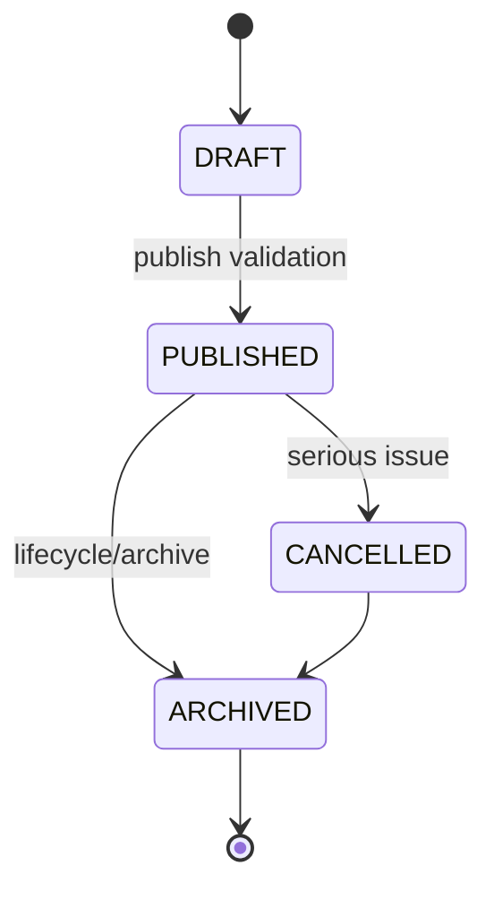
```mermaid
stateDiagram-v2
[*] --> DRAFT
DRAFT --> PUBLISHED: publish validation
PUBLISHED --> CANCELLED: serious issue
PUBLISHED --> ARCHIVED: lifecycle/archive
CANCELLED --> ARCHIVED
ARCHIVED --> [*]
```

##### Semantics
`NOT_YET_OPEN`, `OPEN`, `CLOSED` are preferably derived from PUBLISHED + server time + open_at/close_at, not redundant stored states.


### Nguồn chuẩn: `state-machines/ATTEMPT_STATE_MACHINE.md`

#### Assessment Attempt State Machine

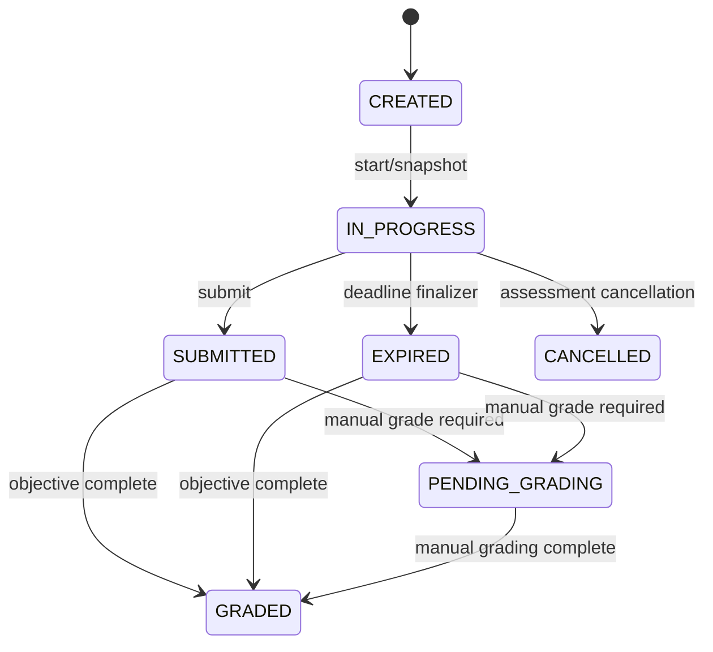
```mermaid
stateDiagram-v2
[*] --> CREATED
CREATED --> IN_PROGRESS: start/snapshot
IN_PROGRESS --> SUBMITTED: submit
IN_PROGRESS --> EXPIRED: deadline finalizer
IN_PROGRESS --> CANCELLED: assessment cancellation
SUBMITTED --> PENDING_GRADING: manual grade required
EXPIRED --> PENDING_GRADING: manual grade required
SUBMITTED --> GRADED: objective complete
EXPIRED --> GRADED: objective complete
PENDING_GRADING --> GRADED: manual grading complete
```

##### Semantics
Terminal transitions are idempotent. Lease state is separate expiring metadata.


### Nguồn chuẩn: `state-machines/COURSE_STATE_MACHINE.md`

#### Course State Machine

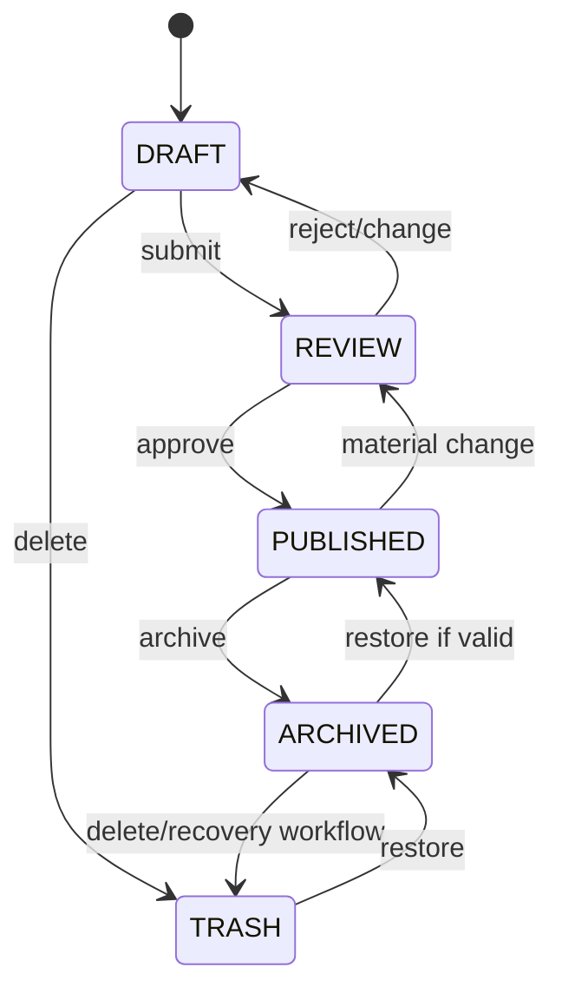
```mermaid
stateDiagram-v2
[*] --> DRAFT
DRAFT --> REVIEW: submit
REVIEW --> PUBLISHED: approve
REVIEW --> DRAFT: reject/change
PUBLISHED --> REVIEW: material change
PUBLISHED --> ARCHIVED: archive
ARCHIVED --> PUBLISHED: restore if valid
DRAFT --> TRASH: delete
ARCHIVED --> TRASH: delete/recovery workflow
TRASH --> ARCHIVED: restore
```

##### Semantics
OPEN/discoverable aspects depend on stored lifecycle/status; prerequisite references can block archive/delete.


### Nguồn chuẩn: `state-machines/ENROLLMENT_STATE_MACHINE.md`

#### Enrollment State Machine

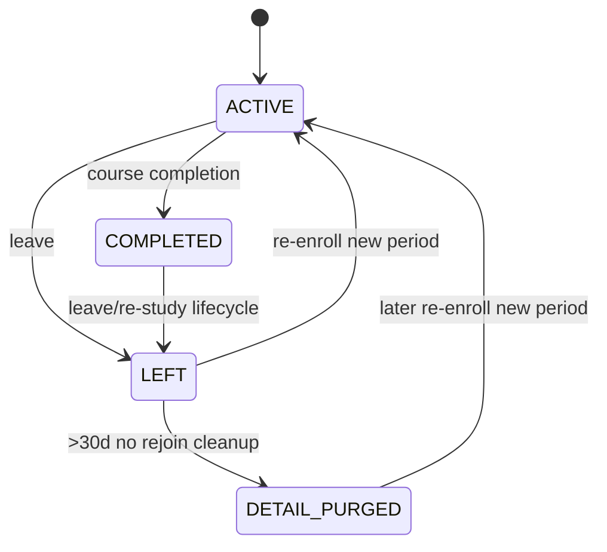
```mermaid
stateDiagram-v2
[*] --> ACTIVE
ACTIVE --> LEFT: leave
ACTIVE --> COMPLETED: course completion
COMPLETED --> LEFT: leave/re-study lifecycle
LEFT --> ACTIVE: re-enroll new period
LEFT --> DETAIL_PURGED: >30d no rejoin cleanup
DETAIL_PURGED --> ACTIVE: later re-enroll new period
```

##### Semantics
Logical Enrollment persists; each active/rejoin cycle is represented by EnrollmentPeriod.


### Nguồn chuẩn: `state-machines/FILE_STATE_MACHINE.md`

#### File Revision State Machine

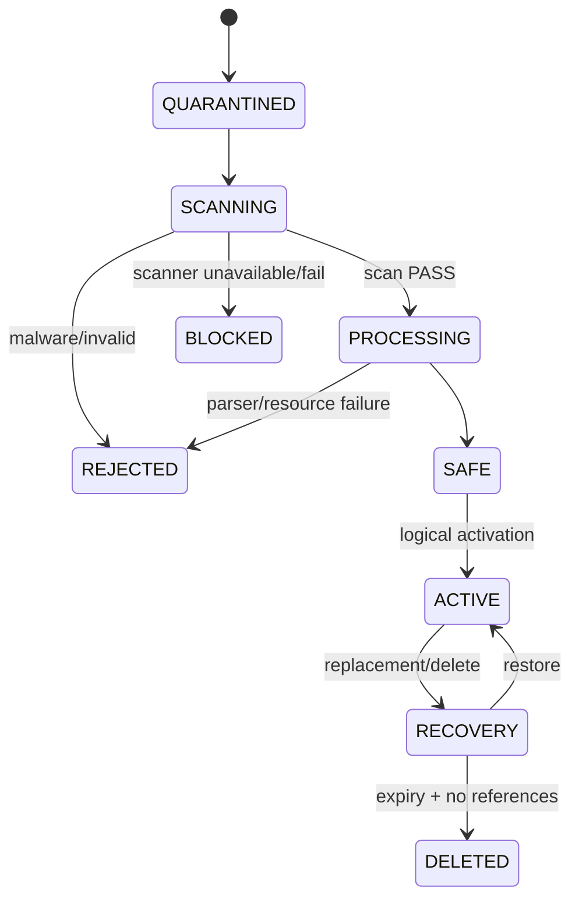
```mermaid
stateDiagram-v2
[*] --> QUARANTINED
QUARANTINED --> SCANNING
SCANNING --> PROCESSING: scan PASS
SCANNING --> REJECTED: malware/invalid
SCANNING --> BLOCKED: scanner unavailable/fail
PROCESSING --> SAFE
PROCESSING --> REJECTED: parser/resource failure
SAFE --> ACTIVE: logical activation
ACTIVE --> RECOVERY: replacement/delete
RECOVERY --> DELETED: expiry + no references
RECOVERY --> ACTIVE: restore
```

##### Semantics
A FileAsset has at most one ACTIVE revision; direct Student access requires safe/active and object authorization.


### Nguồn chuẩn: `state-machines/IMPORT_STATE_MACHINE.md`

#### Import Job State Machine

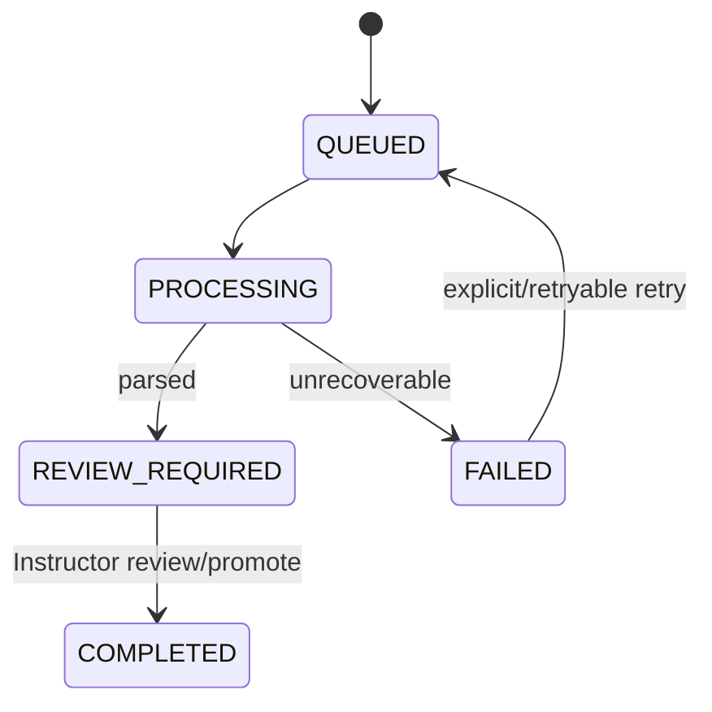
```mermaid
stateDiagram-v2
[*] --> QUEUED
QUEUED --> PROCESSING
PROCESSING --> REVIEW_REQUIRED: parsed
PROCESSING --> FAILED: unrecoverable
REVIEW_REQUIRED --> COMPLETED: Instructor review/promote
FAILED --> QUEUED: explicit/retryable retry
```

##### Semantics
Imported questions remain drafts until Instructor approval.


### Nguồn chuẩn: `state-machines/KNOWLEDGE_STATE_MACHINE.md`

#### Knowledge Version State Machine

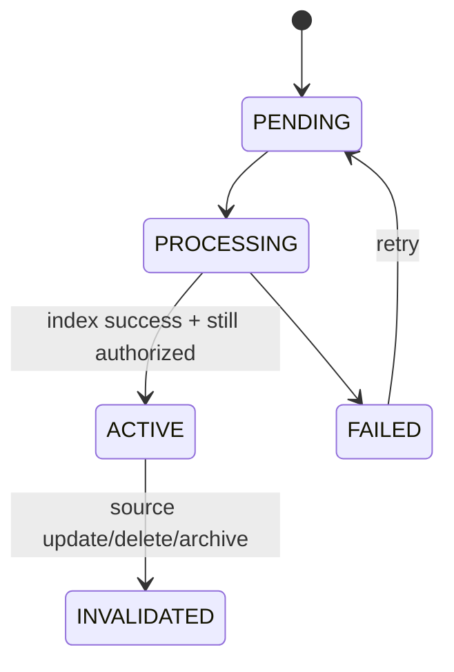
```mermaid
stateDiagram-v2
[*] --> PENDING
PENDING --> PROCESSING
PROCESSING --> ACTIVE: index success + still authorized
PROCESSING --> FAILED
ACTIVE --> INVALIDATED: source update/delete/archive
FAILED --> PENDING: retry
```

##### Semantics
Each KnowledgeDocument has at most one ACTIVE version. Deleted/archived source is immediately non-retrievable.


### Nguồn chuẩn: `state-machines/REGRADING_STATE_MACHINE.md`

#### Regrade Job State Machine

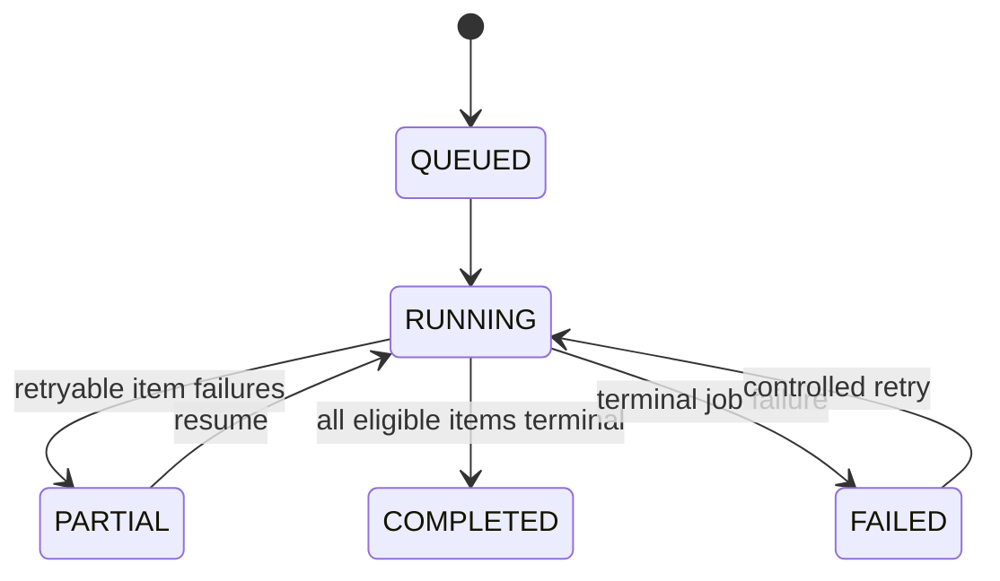
```mermaid
stateDiagram-v2
[*] --> QUEUED
QUEUED --> RUNNING
RUNNING --> PARTIAL: retryable item failures
PARTIAL --> RUNNING: resume
RUNNING --> COMPLETED: all eligible items terminal
RUNNING --> FAILED: terminal job failure
FAILED --> RUNNING: controlled retry
```

##### Semantics
Per-attempt RegradeItem uniqueness makes resume idempotent.


### Nguồn chuẩn: `state-machines/USER_STATE_MACHINE.md`

#### User State Machine

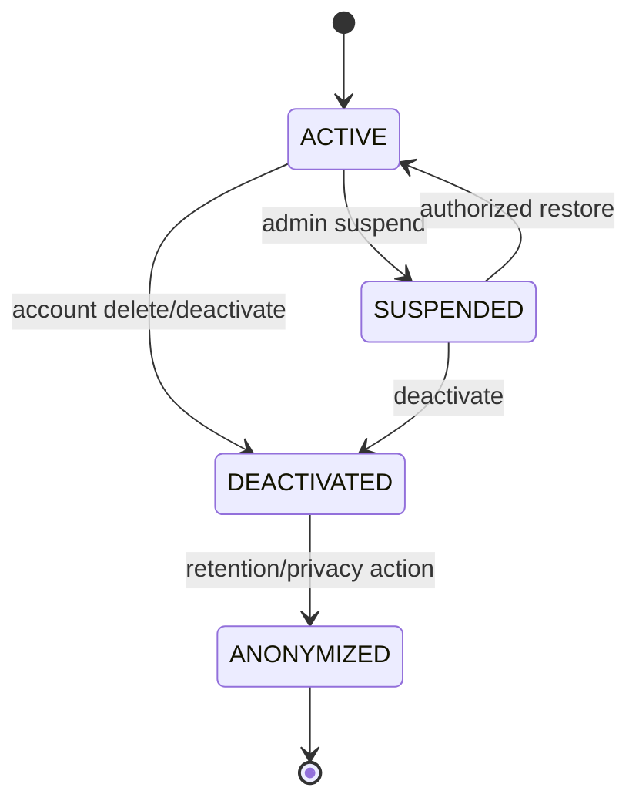
```mermaid
stateDiagram-v2
[*] --> ACTIVE
ACTIVE --> SUSPENDED: admin suspend
SUSPENDED --> ACTIVE: authorized restore
ACTIVE --> DEACTIVATED: account delete/deactivate
SUSPENDED --> DEACTIVATED: deactivate
DEACTIVATED --> ANONYMIZED: retention/privacy action
ANONYMIZED --> [*]
```

##### Semantics
Stored status; role set is separate. Suspension invalidates auth immediately.


## Phụ lục F — Frontend Behavior


### Nguồn chuẩn: `frontend/01_FRONTEND_INFORMATION_ARCHITECTURE.md`

#### Frontend Information Architecture

Public: catalog/course detail/login/register. Student: dashboard, my courses, lesson reader, assessments/attempts/results, notifications, AI assistant, profile. Instructor: owned courses, lesson/resources, Question Bank, assessment builder/import, grading, analytics/export. Admin: users/roles, course review, system health/alerts, audit, backup/recovery. Navigation hides unavailable actions but backend remains authoritative.


### Nguồn chuẩn: `frontend/02_STUDENT_UI_FLOWS.md`

#### Student UI Flows

Catalog → prerequisite/capacity-aware enroll → Course dashboard → ordered Lesson content → system-derived completion → Assessment availability → start/resume attempt → autosave/timer/lease UI → submit/pending grading/result → score-change notifications. Leaving Course warns about restart and 30-day detail retention. Archived Course historical LMS access is shown only if policy permits; AI retrieval remains disabled.


### Nguồn chuẩn: `frontend/03_INSTRUCTOR_UI_FLOWS.md`

#### Instructor UI Flows

Course create/edit → lessons/resources → Question Bank → manual/import/AI draft review → Assessment builder/blueprint validation → publish → monitor attempts → manual essay grading → correction/regrade status → dashboard/export. UI must visibly disable timing edits after publish and structure/point edits after first start rather than relying on backend rejection alone.


### Nguồn chuẩn: `frontend/04_ADMIN_UI_FLOWS.md`

#### Admin UI Flows

Course review/approval → user role/suspension/reassignment → reasoned override → audit/notification. System operations include storage/scanner/Gemini/worker/DB/backup health, alerts and manual backup/restore. Sensitive actions use a dedicated confirmation form requiring reauthentication, exact phrase and reason. No impersonation action exists.


### Nguồn chuẩn: `frontend/05_AJAX_INTERACTION_RULES.md`

#### AJAX Interaction Rules

Same-origin AJAX uses Flask session credentials and CSRF header/token. Search fields debounce. Mutations use JSON error model and represent 409 conflict/lease/stale version explicitly. Answer saves carry stable client change ID + monotonic sequence and current lease token. Retry only operations documented as idempotent. Never store JWT in localStorage for website flows.


### Nguồn chuẩn: `frontend/06_FORM_VALIDATION.md`

#### Form Validation

Flask-WTF performs CSRF and server validation for web forms. Client validation is usability only. Normalize email/course code/title where uniqueness applies; validate dates/ranges/types/files; revalidate state/authorization at transaction time. Field errors map to stable codes/messages without exposing sensitive internals. PRG is used for normal HTML form submissions where appropriate.


### Nguồn chuẩn: `frontend/07_LOADING_ERROR_EMPTY_STATES.md`

#### Loading, Error and Empty States

Every AJAX screen needs loading, empty, retryable error, validation error, permission/state conflict and success states. Long jobs show queued/running/progress/review-required/completed/failed with refresh/poll behavior. Attempt UI distinguishes offline, unsynced local edits, saved state, lease lost, deadline expired and submitted terminal state.


### Nguồn chuẩn: `frontend/08_ACCESSIBILITY_REQUIREMENTS.md`

#### Accessibility Requirements

Use semantic headings/forms/tables, keyboard-operable controls, visible focus, labels/error associations, sufficient contrast, non-color-only status, accessible modals, live-region announcements for autosave/validation where useful, and preserved focus after AJAX updates. Timers must not be the sole visual channel; assessment actions remain keyboard usable.


## Phụ lục G — Security


### Nguồn chuẩn: `security/01_THREAT_MODEL.md`

#### Threat Model

| Threat | Asset | Attack | Prevention | Detection | Test |
|---|---|---|---|---|---|
| Broken authentication | account/session | guessing, fixation | adaptive hash, generic errors, rotation, rate limits | security events | SEC-AUTH-01 |
| CSRF | cookie-auth writes | forged browser mutation | Flask-WTF/CSRF on web/AJAX | rejected-CSRF metrics | SEC-WEB-01 |
| XSS | users/session | malicious Markdown/AI output | sanitize rendered Markdown/AI HTML; CSP; escape templates | CSP/report/log | SEC-WEB-02 |
| IDOR | course/student/attempt | guess another public ID | object-level authorization every request | denied-access security event threshold | SEC-AUTHZ-01 |
| Privilege escalation | Admin/Instructor | forged role/owner fields | server role relations; allow-listed DTOs | audit/security events | SEC-AUTHZ-02 |
| SQL injection | DB | crafted query input | SQLAlchemy parameterization; allow-listed sort/filter | error/security monitoring | SEC-DB-01 |
| Mass assignment | grades/roles/state | privileged JSON fields | explicit request schemas | validation logs | SEC-API-01 |
| Replay/duplicate | submit/jobs/email | resend request | idempotency keys + unique boundaries | duplicate metrics | SEC-CONC-01 |
| Attempt takeover | active exam | second tab steals lease | expiring tokenized lease + conditional update | lease conflict | SEC-CONC-02 |
| Malicious upload | server/students | malware/macro/polyglot | quarantine, allowlist, ClamAV, fail closed | scan/security event | SEC-FILE-01 |
| Decompression bomb | CPU/RAM/disk | crafted Office/PDF | entry/uncompressed/ratio/time/memory limits | parser failure alert | SEC-FILE-02 |
| Path traversal/direct storage | file bytes | crafted filename/storage URL | generated storage key; app authorization route | denied/file anomaly | SEC-FILE-03 |
| Prompt injection | AI tools/data | document instructs model | data-not-instruction boundary; no direct SQL; allow-listed tools | prompt-abuse event | SEC-AI-01 |
| RAG leakage | course/student data | unauthorized chunks | authorization filter before retrieval; metadata policy | source-usage trace | SEC-AI-02 |
| Draft/archive leakage | content | stale index | publication/status filter + immediate invalidation | RAG QA | SEC-AI-03 |
| Cross-user AI leakage | personalized context | shared cache | no shared personalized cache | cache audit | SEC-AI-04 |
| Audit tampering | integrity | update/delete log | append-only DB control + restricted DB account | integrity review | SEC-AUDIT-01 |
| Sensitive log leakage | credentials/answers | excessive logging | redaction/schema logging | log review | SEC-LOG-01 |
| Export leakage | grade data | public/long-lived file | authorized generation, private storage, expiry | export audit | SEC-EXPORT-01 |
| Soft-delete leakage | historical data | query misses status | default scoped queries + authorization/status check | negative tests | SEC-DATA-01 |


### Nguồn chuẩn: `security/02_SECURITY_REQUIREMENTS.md`

#### Security Requirements

Security is defense-in-depth: authentication, object authorization, input validation, relational constraints/transactions, output encoding, audit, least privilege and operational monitoring. The application DB login must not be `sa`/db_owner for routine runtime. Migration/backup privileges are separated. Secrets are injected via environment/secret mechanism and excluded from source, images and logs.

High-risk fail-closed paths: suspended auth, required audit for sensitive action, file scan, assessment deadline/lease, RAG authorization.


### Nguồn chuẩn: `security/03_AUTHENTICATION_SECURITY.md`

#### Authentication Security

Follow `../authentication/07_AUTH_SECURITY_REQUIREMENTS.md`. Add brute-force/rate controls, password/token redaction, session rotation, generic account-recovery messages, verification token expiry/single use, and immediate revocation on suspension. Future MFA is compatible but not required by confirmed MVP.


### Nguồn chuẩn: `security/04_AUTHORIZATION_SECURITY.md`

#### Authorization Security

Check both role and concrete resource relation. Never rely on hidden UI. Admin overrides are explicit service paths with reason/audit; previous Instructor ownership confers no current Student detail permission. Nested object IDs are cross-validated. AI/file authorization uses the same domain rules rather than trusting model or storage layer.


### Nguồn chuẩn: `security/05_FILE_UPLOAD_SECURITY.md`

#### File Upload Security

Pipeline: metadata/size/type allowlist → generated storage name → quarantine → hash/dedup → malware scan → archive/parser resource checks → processing → safe → activation. Macro Office formats are rejected. Scanner unavailable/failure remains BLOCKED/PENDING. Baseline limits: image ~10 MB, PDF/DOCX 50 MB, PPTX 100 MB, video < 1 GB. Direct storage is private.


### Nguồn chuẩn: `security/06_AI_RAG_SECURITY.md`

#### AI/RAG Security

Authorization filter executes before retrieval. Chunk metadata carries source/Course/Lesson/resource/version/publication/status. Retrieved text is untrusted data and cannot redefine system/tool policy. Gemini gets minimum necessary context; no direct arbitrary SQL or unrestricted file tool exists. Personalized responses are not shared cache. Archived/deleted/draft content is filtered/inactivated immediately. Source versions used in an answer are recorded.


### Nguồn chuẩn: `security/07_AUDIT_SECURITY.md`

#### Audit Security

Important audit is append-only and written with real actor identity/context, target, action, reason, time and correlation ID. Do not store passwords, raw tokens, session secrets or unnecessary Student/AI content. Application runtime should have insert/read permissions needed for audit but no normal update/delete path. Sensitive business mutation and required AuditEvent share a DB transaction so audit persistence failure aborts the mutation.


### Nguồn chuẩn: `security/08_WEB_SECURITY.md`

#### Web Security

Use Jinja autoescaping, sanitize Markdown/AI rendered content, CSRF for cookie writes, Secure/HttpOnly/SameSite cookies, CSP/security headers, safe redirects, no secrets in URL, server-side form validation, bounded uploads, and standardized error pages. AJAX must handle 401/403/409/429 safely and not blindly replay non-idempotent actions.


### Nguồn chuẩn: `security/09_SECURITY_TEST_PLAN.md`

#### Security Test Plan

Required negative tests: cross-Student Attempt/Notification IDOR; other-Instructor Course/Student access; stale role after revoke; suspended session/JWT; CSRF missing/invalid; XSS in Markdown/AI; mass-assignment role/score/status; SQL injection filter/search; file malware/macro/bomb/path name; unsafe FileRevision download; prompt injection attempts; draft/archive/deleted RAG retrieval; audit update/delete; duplicate submit/replay; sensitive Admin action without reauth/reason/phrase; export authorization/expiry.


## Phụ lục H — Operations


### Nguồn chuẩn: `operations/01_DOCKER_AND_ENVIRONMENT.md`

#### Docker and Environment

Baseline containers/processes: Flask web, SQL Server, worker, ClamAV when enabled, private file volume/storage. Use non-root app image, pinned base/dependencies, health checks, resource limits and no Docker socket/privileged mode. SQL Server data and upload/backup paths are durable volumes; app secrets arrive at runtime. `docker-compose.yml` is appropriate for project deployment.


### Nguồn chuẩn: `operations/02_CONFIGURATION.md`

#### Configuration

##### Secrets
`SECRET_KEY`, JWT signing secret/key, DB credentials, Gemini API key, email credentials. Never commit.

##### Non-secret / configurable defaults
Environment, public base URL, upload type/size limits, storage quotas/warning thresholds, retention days (confirmed enrollment detail 30 days), AI chat inactivity 5 minutes, lease/heartbeat interval, autosave debounce 1–2 seconds, rate limits, parser time/resource limits, pagination sizes, email retry/timeouts. Thresholds not locked by Plan Mode remain tunable.


### Nguồn chuẩn: `operations/03_SECRET_MANAGEMENT.md`

#### Secret Management

Secrets must be outside Git and Docker image, injected by environment/secret store. Rotate DB/JWT/Gemini/email credentials without code changes. Logs/config diagnostics print only presence/source labels, never values. Separate development secrets from production. Compromised signing/Flask secret triggers explicit revocation/rotation procedure.


### Nguồn chuẩn: `operations/04_DATABASE_BACKUP_RESTORE.md`

#### Database Backup and Restore

Automatic daily backups plus Admin-triggered manual backup. Record start/end/status/location/verification metadata in `backup_runs`. Periodically test backup integrity and perform restore drill in non-production. Services may auto-restart after simple failure, but **database restore never automatically overwrites live DB**. Restore requires Admin fresh password re-authentication, exact confirmation phrase, mandatory reason and audit.


### Nguồn chuẩn: `operations/05_LOGGING_AND_MONITORING.md`

#### Logging and Monitoring

Log correlation ID, route/status/duration, safe actor/public resource identifiers, worker job lifecycle, security events, Gemini timeout/error category, ClamAV status, storage warnings, DB health, backup health and slow requests/jobs. Do not log passwords, tokens/secrets, unnecessary Student answer content, raw AI conversation beyond its transient storage requirement, or full sensitive exports.


### Nguồn chuẩn: `operations/06_SYSTEM_HEALTH.md`

#### System Health

Admin dashboard surfaces SQL Server connectivity, worker queue/jobs, storage free space/quota, ClamAV, Gemini dependency, last backup/verification, pending processing and recent errors. Health snapshots are operational/derived, not authoritative business history. Alerts cover repeated login failures, dangerous uploads, prompt injection/abuse, rate limits, low disk, backup failure and stuck jobs.


### Nguồn chuẩn: `operations/07_STORAGE_MANAGEMENT.md`

#### Storage Management

Apply per-Course/per-Instructor quotas; Admin can raise limits. Warn before critical free-space threshold; block new uploads when critically low rather than risking disk exhaustion. Physical blobs deduplicate and delete only when no logical references remain and recovery window expires. Secure exports and old file revisions have explicit cleanup.


### Nguồn chuẩn: `operations/08_FAILURE_RECOVERY.md`

#### Failure Recovery

Web request failure leaves transactions rolled back. Workers retry idempotently with bounded attempts/timeouts. Scanner outage leaves files blocked. Gemini outage disables only Gemini-dependent behavior; backend-computable features remain. Regrade/import/index jobs resume from persisted item/status. Browser crash is recovered through Attempt lease expiry/takeover. DB restore is manual-confirmed only.


## Phụ lục I — Testing & Acceptance


### Nguồn chuẩn: `testing/01_TEST_STRATEGY.md`

#### Test Strategy

Use layered testing: pure unit tests for algorithms/policies; model/constraint tests; service+SQL Server integration transactions; API auth/validation/error tests; concurrency races; security negative tests; worker retry/idempotency; and end-to-end actor workflows. Critical business rules must have at least one automated test and historical/concurrency rules need integration tests, not mocks only.


### Nguồn chuẩn: `testing/02_ACCEPTANCE_CRITERIA.md`

#### Acceptance Criteria

##### AC-AUTH-001
Given a valid active User, when web login succeeds, then session identifier rotates, Flask-Login identity is established and no JWT is stored in website localStorage.

##### AC-AUTH-002
Given a suspended User with active session/JWT, when suspension commits, then subsequent web/API requests are rejected and revocation/audit/notification exist.

##### AC-COURSE-001
Given Course A is an active prerequisite of B, when archive/delete A is requested, then mutation is rejected until dependency is resolved.

##### AC-ENROLL-001
Given one remaining Course seat and two concurrent eligible enroll requests, when both execute, then at most one new active enrollment period succeeds.

##### AC-ENROLL-002
Given Student leaves and re-enrolls within 30 days, then active learning restarts from beginning while prior completion summary remains unchanged.

##### AC-RET-001
Given no rejoin for >30 days, cleanup may purge detailed period data, future regrade excludes that period, and prerequisite/completion summary remains.

##### AC-LESSON-001
Given lesson completion already true, when lessons reorder or content is materially rewritten, then completion is not cleared.

##### AC-QREV-001
Given a Question has been used, when Instructor makes important edit, then a new QuestionRevision is created and old exposed revision remains readable to historical Attempt snapshot.

##### AC-ASSESS-001
Given Assessment is published, when timing edit is attempted, then DB/service rejects and original timing remains.

##### AC-ASSESS-002
Given first Student has started, when question add/remove or assigned-points change is attempted, then mutation is rejected.

##### AC-ATTEMPT-001
Given eligible Student starts Assessment, then exact selected revisions/choices/order/points are persisted once and resume returns identical snapshot.

##### AC-ATTEMPT-002
Given tab A owns valid lease, when tab B tries to save, then request is rejected and answer remains unchanged.

##### AC-ATTEMPT-003
Given tab A crashes and lease expires, when tab B takes over, then same Attempt/snapshot/answers/deadline continue.

##### AC-AUTOSAVE-001
Given newer sequence already saved, when older offline change arrives, then older event cannot overwrite current answer.

##### AC-TIMER-001
Given server deadline passed, when an unsent answer arrives, then it is rejected/not counted even if client shows earlier edit time.

##### AC-SUBMIT-001
Given two concurrent submit requests with same idempotency semantics, then exactly one logical result exists and both callers observe that result.

##### AC-GRADE-001
Given Essay remains ungraded, final result stays pending; after valid manual grade all required grading can finalize.

##### AC-REGRADE-001
Given correct-answer-only correction, eligible retained submitted attempts are regraded, old/new history persists and changed Students are notified.

##### AC-REGRADE-002
Given content/choice correction after prior starts, historical snapshots stay unchanged and affected earlier attempts receive full-credit correction policy.

##### AC-FILE-001
Given scanner unavailable or malware result not PASS, FileRevision cannot become active/downloadable by Student.

##### AC-FILE-002
Given identical bytes uploaded twice, logical assets may differ while one physical blob is reused without bypassing security state.

##### AC-IMPORT-001
Given ambiguous imported question/no answer key, it remains review-required/no official answer until Instructor explicitly confirms input or AI suggestion.

##### AC-AI-001
Given Student asks AI about unauthorized/draft/archived content, retrieval returns no protected chunks and answer does not reveal detailed content.

##### AC-AI-002
Given AI conversation inactive for >5 minutes, raw messages/conversation content are purged while permitted minimal security metadata may remain.

##### AC-NOTIF-001
Given email provider fails after business commit, primary action remains committed and delivery retries without duplicate logical notification.

##### AC-AUDIT-001
Given sensitive Admin mutation requires audit and audit insert fails, the business mutation is rolled back.

##### AC-ADMIN-001
Given Admin edits Instructor-owned content, reason is required, AuditEvent exists and Instructor notification is created.

##### AC-BACKUP-001
Given restore request without reauth/phrase/reason, restore is refused; no automatic restore overwrites live DB.


### Nguồn chuẩn: `testing/03_BUSINESS_RULE_TEST_MATRIX.md`

#### Business Rule Test Matrix

| Rule ID | Test ID | Unit | Integration | DB | Security | E2E |
|---|---|---:|---:|---:|---:|---:|
| `AUTH-001` | `T-AUTH-001` | ✓ | ✓ | ✓ | ✓ | critical flow |
| `AUTH-002` | `T-AUTH-002` | ✓ | ✓ | ✓ | ✓ | critical flow |
| `AUTH-003` | `T-AUTH-003` | ✓ | ✓ | ✓ | ✓ | critical flow |
| `AUTH-004` | `T-AUTH-004` | ✓ | ✓ | ✓ | ✓ | critical flow |
| `AUTH-005` | `T-AUTH-005` | ✓ | ✓ | ✓ | ✓ | critical flow |
| `AUTH-006` | `T-AUTH-006` | ✓ | ✓ | ✓ | ✓ | critical flow |
| `COURSE-001` | `T-COURSE-001` | ✓ | ✓ | ✓ | as applicable | critical flow |
| `COURSE-002` | `T-COURSE-002` | ✓ | ✓ | ✓ | as applicable | critical flow |
| `COURSE-003` | `T-COURSE-003` | ✓ | ✓ | ✓ | as applicable | critical flow |
| `COURSE-004` | `T-COURSE-004` | ✓ | ✓ | ✓ | as applicable | critical flow |
| `COURSE-005` | `T-COURSE-005` | ✓ | ✓ | ✓ | as applicable | critical flow |
| `COURSE-006` | `T-COURSE-006` | ✓ | ✓ | ✓ | as applicable | critical flow |
| `COURSE-007` | `T-COURSE-007` | ✓ | ✓ | ✓ | as applicable | critical flow |
| `ENROLL-001` | `T-ENROLL-001` | ✓ | ✓ | ✓ | as applicable | critical flow |
| `ENROLL-002` | `T-ENROLL-002` | ✓ | ✓ | ✓ | as applicable | critical flow |
| `ENROLL-003` | `T-ENROLL-003` | ✓ | ✓ | ✓ | as applicable | critical flow |
| `ENROLL-004` | `T-ENROLL-004` | ✓ | ✓ | ✓ | as applicable | critical flow |
| `LESSON-001` | `T-LESSON-001` | ✓ | ✓ | as applicable | as applicable | critical flow |
| `LESSON-002` | `T-LESSON-002` | ✓ | ✓ | as applicable | as applicable | critical flow |
| `LESSON-003` | `T-LESSON-003` | ✓ | ✓ | as applicable | as applicable | critical flow |
| `LESSON-004` | `T-LESSON-004` | ✓ | ✓ | as applicable | as applicable | critical flow |
| `QBANK-001` | `T-QB-001` | ✓ | ✓ | ✓ | as applicable | critical flow |
| `QBANK-002` | `T-QB-002` | ✓ | ✓ | ✓ | as applicable | critical flow |
| `QBANK-003` | `T-QB-003` | ✓ | ✓ | ✓ | as applicable | critical flow |
| `QBANK-004` | `T-QB-004` | ✓ | ✓ | ✓ | as applicable | critical flow |
| `QBANK-005` | `T-QB-005` | ✓ | ✓ | ✓ | as applicable | critical flow |
| `QBANK-006` | `T-QB-006` | ✓ | ✓ | ✓ | as applicable | critical flow |
| `QBANK-007` | `T-QB-007` | ✓ | ✓ | ✓ | as applicable | critical flow |
| `ASSESS-001` | `T-ASSESS-001` | ✓ | ✓ | ✓ | as applicable | critical flow |
| `ASSESS-002` | `T-ASSESS-002` | ✓ | ✓ | ✓ | as applicable | critical flow |
| `ASSESS-003` | `T-ASSESS-003` | ✓ | ✓ | ✓ | as applicable | critical flow |
| `ASSESS-004` | `T-ASSESS-004` | ✓ | ✓ | ✓ | as applicable | critical flow |
| `ASSESS-005` | `T-ASSESS-005` | ✓ | ✓ | ✓ | as applicable | critical flow |
| `ASSESS-006` | `T-ASSESS-006` | ✓ | ✓ | ✓ | as applicable | critical flow |
| `ATTEMPT-001` | `T-ATT-001` | ✓ | ✓ | ✓ | as applicable | critical flow |
| `ATTEMPT-002` | `T-ATT-002` | ✓ | ✓ | ✓ | as applicable | critical flow |
| `ATTEMPT-003` | `T-ATT-003` | ✓ | ✓ | ✓ | as applicable | critical flow |
| `ATTEMPT-004` | `T-ATT-004` | ✓ | ✓ | ✓ | as applicable | critical flow |
| `ATTEMPT-005` | `T-ATT-005` | ✓ | ✓ | ✓ | as applicable | critical flow |
| `ATTEMPT-006` | `T-ATT-006` | ✓ | ✓ | ✓ | as applicable | critical flow |
| `ATTEMPT-007` | `T-ATT-007` | ✓ | ✓ | ✓ | as applicable | critical flow |
| `GRADE-001` | `T-GRADE-001` | ✓ | ✓ | as applicable | as applicable | critical flow |
| `GRADE-002` | `T-GRADE-002` | ✓ | ✓ | as applicable | as applicable | critical flow |
| `REGRADE-001` | `T-REG-001` | ✓ | ✓ | as applicable | as applicable | critical flow |
| `REGRADE-002` | `T-REG-002` | ✓ | ✓ | as applicable | as applicable | critical flow |
| `REGRADE-003` | `T-REG-003` | ✓ | ✓ | as applicable | as applicable | critical flow |
| `REGRADE-004` | `T-REG-004` | ✓ | ✓ | as applicable | as applicable | critical flow |
| `FILE-001` | `T-FILE-001` | ✓ | ✓ | ✓ | ✓ | critical flow |
| `FILE-002` | `T-FILE-002` | ✓ | ✓ | ✓ | ✓ | critical flow |
| `FILE-003` | `T-FILE-003` | ✓ | ✓ | ✓ | ✓ | critical flow |
| `FILE-004` | `T-FILE-004` | ✓ | ✓ | ✓ | ✓ | critical flow |
| `FILE-005` | `T-FILE-005` | ✓ | ✓ | ✓ | ✓ | critical flow |
| `IMPORT-001` | `T-IMP-001` | ✓ | ✓ | as applicable | as applicable | critical flow |
| `IMPORT-002` | `T-IMP-002` | ✓ | ✓ | as applicable | as applicable | critical flow |
| `IMPORT-003` | `T-IMP-003` | ✓ | ✓ | as applicable | as applicable | critical flow |
| `AI-001` | `T-AI-001` | ✓ | ✓ | as applicable | ✓ | critical flow |
| `AI-002` | `T-AI-002` | ✓ | ✓ | as applicable | ✓ | critical flow |
| `AI-003` | `T-AI-003` | ✓ | ✓ | as applicable | ✓ | critical flow |
| `AI-004` | `T-AI-004` | ✓ | ✓ | as applicable | ✓ | critical flow |
| `AI-005` | `T-AI-005` | ✓ | ✓ | as applicable | ✓ | critical flow |
| `AI-006` | `T-AI-006` | ✓ | ✓ | as applicable | ✓ | critical flow |
| `NOTIF-001` | `T-NOTIF-001` | ✓ | ✓ | as applicable | as applicable | critical flow |
| `NOTIF-002` | `T-NOTIF-002` | ✓ | ✓ | as applicable | as applicable | critical flow |
| `NOTIF-003` | `T-NOTIF-003` | ✓ | ✓ | as applicable | as applicable | critical flow |
| `AUDIT-001` | `T-AUDIT-001` | ✓ | ✓ | ✓ | ✓ | critical flow |
| `AUDIT-002` | `T-AUDIT-002` | ✓ | ✓ | ✓ | ✓ | critical flow |
| `AUDIT-003` | `T-AUDIT-003` | ✓ | ✓ | ✓ | ✓ | critical flow |
| `DELETE-001` | `T-DEL-001` | ✓ | ✓ | as applicable | as applicable | critical flow |
| `DELETE-002` | `T-DEL-002` | ✓ | ✓ | as applicable | as applicable | critical flow |
| `OPS-001` | `T-OPS-001` | ✓ | ✓ | as applicable | as applicable | critical flow |
| `OPS-002` | `T-OPS-002` | ✓ | ✓ | as applicable | as applicable | critical flow |
| `OPS-003` | `T-OPS-003` | ✓ | ✓ | as applicable | as applicable | critical flow |
| `OPS-004` | `T-OPS-004` | ✓ | ✓ | as applicable | as applicable | critical flow |


### Nguồn chuẩn: `testing/04_API_TEST_PLAN.md`

#### API Test Plan

For every endpoint: success, missing/invalid input, unauthenticated, wrong role, wrong object ownership, not-found/enumeration policy, lifecycle conflict, serialization safe fields, pagination/filter bounds and correlation ID. Mutation tests include stale ROWVERSION, duplicate/retry behavior and side-effect outbox/audit expectations. Attempt endpoints add lease/deadline/offline sequence races.


### Nguồn chuẩn: `testing/05_DATABASE_TEST_PLAN.md`

#### Database Test Plan

Use the validated `database/DATABASE_INTEGRITY_TEST_PLAN.md` as primary DB suite. Run migrations from zero, downgrade/upgrade where safe, constraint/FK/index/trigger tests, unique active revision/version tests, no historical cascade tests and seed idempotency. SQL Server—not SQLite—is required for final integration because ROWVERSION/filtered indexes/triggers are engine-specific.


### Nguồn chuẩn: `testing/06_AUTH_TEST_PLAN.md`

#### Authentication Test Plan

Test login/logout, email normalization/uniqueness, password failure generic responses, session rotation/expiry, CSRF, JWT expiry/revocation/auth-version, email verification one-use/expiry, password reset/change revocation, role upgrade preservation, suspension immediate revoke, sensitive reauth freshness/phrase/reason. Include concurrent email-change uniqueness.


### Nguồn chuẩn: `testing/07_CONCURRENCY_TEST_PLAN.md`

#### Concurrency Test Plan

Run real concurrent transactions for: two enrolls for last seat; lesson reorder stale editor; simultaneous Question edits; publish vs edit; two Attempt starts/attempt-limit; two lease acquires; heartbeat vs takeover; stale offline answer vs newer answer; two submits; simultaneous manual grades; two corrections/regrade retries; FileAsset active revision swap; KnowledgeVersion active swap. Assert one valid final state and no silent overwrite.


### Nguồn chuẩn: `testing/08_SECURITY_TEST_PLAN.md`

#### Security Test Plan

Required negative tests: cross-Student Attempt/Notification IDOR; other-Instructor Course/Student access; stale role after revoke; suspended session/JWT; CSRF missing/invalid; XSS in Markdown/AI; mass-assignment role/score/status; SQL injection filter/search; file malware/macro/bomb/path name; unsafe FileRevision download; prompt injection attempts; draft/archive/deleted RAG retrieval; audit update/delete; duplicate submit/replay; sensitive Admin action without reauth/reason/phrase; export authorization/expiry.


### Nguồn chuẩn: `testing/09_FILE_IMPORT_TEST_PLAN.md`

#### File / Import Test Plan

Cover all allowed/banned formats and limits, video <1 GB boundary, malware PASS/FAIL/unavailable, archive bomb/resource timeout, duplicate blob race, shared blob deletion, unauthorized download, replacement scan failure preserving old active revision, recovery/restore, DOCX/PDF parser confidence, broken images, no answer key, AI suggestion confirmation, duplicate candidate flags and publish validation.


### Nguồn chuẩn: `testing/10_AI_RAG_TEST_PLAN.md`

#### AI/RAG Test Plan

Test LMS scope refusal, mixed prompt in-scope-only handling, published authorized retrieval, cross-Course/cross-Student denial, draft exclusion, archived exclusion, delete immediate invalidation, update/new-version activation and failed-version fallback only when old remains valid, prompt injection documents treated as data, source-version recording, personalized cache isolation, backend recommendation correctness and five-minute chat purge.


### Nguồn chuẩn: `testing/11_END_TO_END_SCENARIOS.md`

#### End-to-End Scenarios

Each scenario must run through browser/API/service/database as applicable and assert durable side effects.

##### E2E-01 — Student registration/login
Verify actor preconditions, authorization, primary state transition, failure branch, audit/notification/job side effects where required, and final persisted invariant. See business/API/algorithm docs for exact rules.

##### E2E-02 — Email change verification
Verify actor preconditions, authorization, primary state transition, failure branch, audit/notification/job side effects where required, and final persisted invariant. See business/API/algorithm docs for exact rules.

##### E2E-03 — Instructor creates Course
Verify actor preconditions, authorization, primary state transition, failure branch, audit/notification/job side effects where required, and final persisted invariant. See business/API/algorithm docs for exact rules.

##### E2E-04 — Admin approves/materially re-approves Course
Verify actor preconditions, authorization, primary state transition, failure branch, audit/notification/job side effects where required, and final persisted invariant. See business/API/algorithm docs for exact rules.

##### E2E-05 — Student enrolls
Verify actor preconditions, authorization, primary state transition, failure branch, audit/notification/job side effects where required, and final persisted invariant. See business/API/algorithm docs for exact rules.

##### E2E-06 — Prerequisite failure
Verify actor preconditions, authorization, primary state transition, failure branch, audit/notification/job side effects where required, and final persisted invariant. See business/API/algorithm docs for exact rules.

##### E2E-07 — Capacity race
Verify actor preconditions, authorization, primary state transition, failure branch, audit/notification/job side effects where required, and final persisted invariant. See business/API/algorithm docs for exact rules.

##### E2E-08 — Lesson completion
Verify actor preconditions, authorization, primary state transition, failure branch, audit/notification/job side effects where required, and final persisted invariant. See business/API/algorithm docs for exact rules.

##### E2E-09 — Instructor builds Question Bank
Verify actor preconditions, authorization, primary state transition, failure branch, audit/notification/job side effects where required, and final persisted invariant. See business/API/algorithm docs for exact rules.

##### E2E-10 — DOCX import
Verify actor preconditions, authorization, primary state transition, failure branch, audit/notification/job side effects where required, and final persisted invariant. See business/API/algorithm docs for exact rules.

##### E2E-11 — AI-generated Question review
Verify actor preconditions, authorization, primary state transition, failure branch, audit/notification/job side effects where required, and final persisted invariant. See business/API/algorithm docs for exact rules.

##### E2E-12 — Instructor publishes Assessment
Verify actor preconditions, authorization, primary state transition, failure branch, audit/notification/job side effects where required, and final persisted invariant. See business/API/algorithm docs for exact rules.

##### E2E-13 — Student starts Assessment
Verify actor preconditions, authorization, primary state transition, failure branch, audit/notification/job side effects where required, and final persisted invariant. See business/API/algorithm docs for exact rules.

##### E2E-14 — Second tab blocked
Verify actor preconditions, authorization, primary state transition, failure branch, audit/notification/job side effects where required, and final persisted invariant. See business/API/algorithm docs for exact rules.

##### E2E-15 — First tab crash and takeover
Verify actor preconditions, authorization, primary state transition, failure branch, audit/notification/job side effects where required, and final persisted invariant. See business/API/algorithm docs for exact rules.

##### E2E-16 — MCQ/text autosave
Verify actor preconditions, authorization, primary state transition, failure branch, audit/notification/job side effects where required, and final persisted invariant. See business/API/algorithm docs for exact rules.

##### E2E-17 — Offline reconnect with stale/newer answers
Verify actor preconditions, authorization, primary state transition, failure branch, audit/notification/job side effects where required, and final persisted invariant. See business/API/algorithm docs for exact rules.

##### E2E-18 — Hard closing deadline
Verify actor preconditions, authorization, primary state transition, failure branch, audit/notification/job side effects where required, and final persisted invariant. See business/API/algorithm docs for exact rules.

##### E2E-19 — Duplicate submit
Verify actor preconditions, authorization, primary state transition, failure branch, audit/notification/job side effects where required, and final persisted invariant. See business/API/algorithm docs for exact rules.

##### E2E-20 — Essay grading
Verify actor preconditions, authorization, primary state transition, failure branch, audit/notification/job side effects where required, and final persisted invariant. See business/API/algorithm docs for exact rules.

##### E2E-21 — Correct-answer correction
Verify actor preconditions, authorization, primary state transition, failure branch, audit/notification/job side effects where required, and final persisted invariant. See business/API/algorithm docs for exact rules.

##### E2E-22 — Content correction/full credit
Verify actor preconditions, authorization, primary state transition, failure branch, audit/notification/job side effects where required, and final persisted invariant. See business/API/algorithm docs for exact rules.

##### E2E-23 — Regrade notification
Verify actor preconditions, authorization, primary state transition, failure branch, audit/notification/job side effects where required, and final persisted invariant. See business/API/algorithm docs for exact rules.

##### E2E-24 — Student leaves Course
Verify actor preconditions, authorization, primary state transition, failure branch, audit/notification/job side effects where required, and final persisted invariant. See business/API/algorithm docs for exact rules.

##### E2E-25 — Rejoin within 30 days
Verify actor preconditions, authorization, primary state transition, failure branch, audit/notification/job side effects where required, and final persisted invariant. See business/API/algorithm docs for exact rules.

##### E2E-26 — No rejoin beyond 30 days
Verify actor preconditions, authorization, primary state transition, failure branch, audit/notification/job side effects where required, and final persisted invariant. See business/API/algorithm docs for exact rules.

##### E2E-27 — Detailed purge
Verify actor preconditions, authorization, primary state transition, failure branch, audit/notification/job side effects where required, and final persisted invariant. See business/API/algorithm docs for exact rules.

##### E2E-28 — Instructor role revoked
Verify actor preconditions, authorization, primary state transition, failure branch, audit/notification/job side effects where required, and final persisted invariant. See business/API/algorithm docs for exact rules.

##### E2E-29 — Course reassigned
Verify actor preconditions, authorization, primary state transition, failure branch, audit/notification/job side effects where required, and final persisted invariant. See business/API/algorithm docs for exact rules.

##### E2E-30 — Malware detection
Verify actor preconditions, authorization, primary state transition, failure branch, audit/notification/job side effects where required, and final persisted invariant. See business/API/algorithm docs for exact rules.

##### E2E-31 — File replacement scan failure/success
Verify actor preconditions, authorization, primary state transition, failure branch, audit/notification/job side effects where required, and final persisted invariant. See business/API/algorithm docs for exact rules.

##### E2E-32 — RAG knowledge update
Verify actor preconditions, authorization, primary state transition, failure branch, audit/notification/job side effects where required, and final persisted invariant. See business/API/algorithm docs for exact rules.

##### E2E-33 — Archived Course AI exclusion
Verify actor preconditions, authorization, primary state transition, failure branch, audit/notification/job side effects where required, and final persisted invariant. See business/API/algorithm docs for exact rules.

##### E2E-34 — Account suspension
Verify actor preconditions, authorization, primary state transition, failure branch, audit/notification/job side effects where required, and final persisted invariant. See business/API/algorithm docs for exact rules.

##### E2E-35 — Admin sensitive action
Verify actor preconditions, authorization, primary state transition, failure branch, audit/notification/job side effects where required, and final persisted invariant. See business/API/algorithm docs for exact rules.

##### E2E-36 — Backup + explicit restore flow
Verify actor preconditions, authorization, primary state transition, failure branch, audit/notification/job side effects where required, and final persisted invariant. See business/API/algorithm docs for exact rules.


## Phụ lục J — Implementation Contract


### Nguồn chuẩn: `implementation/01_PROJECT_STRUCTURE.md`

#### Project Structure

**DERIVED IMPLEMENTATION DESIGN** if repository does not already have an equivalent structure; existing repo conventions take precedence.

```text
app/
  auth/ users/ courses/ learning/ questions/ assessments/ attempts/ grading/
  files/ imports/ ai/ notifications/ admin/ api/
  services/ policies/ workers/ templates/ static/
migrations/
tests/
instance-or-private-storage/
```

Prefer reuse of existing modules/dependencies. Do not create duplicate service/repository abstractions when current code already supplies the responsibility.


### Nguồn chuẩn: `implementation/02_IMPLEMENTATION_ORDER.md`

#### Implementation Order

0. Foundation/config/app factory/logging/error model.
1. SQL Server models + migrations + reference/role seed.
2. User/Auth/RBAC/object authorization.
3. Course/Lesson/Enrollment/Progress.
4. Question Bank/QuestionRevision.
5. Assessment builder/publish/blueprint.
6. Attempt snapshot/timer/lease/autosave/offline/idempotent submit.
7. Grading/history/correction/regrading.
8. File security/storage/import.
9. Notifications/email/audit/admin.
10. AI/Gemini/RAG/recommendation.
11. Dashboards/search/export/performance.
12. Backup/health/security hardening.
13. Full concurrency/security/E2E QA and demo seed.

Each phase must preserve prior tests; do not postpone authorization/audit invariants to the end.


### Nguồn chuẩn: `implementation/03_MODULE_DEPENDENCY_MAP.md`

#### Module Dependency Map

```text
auth/users → policies
courses/learning → questions → assessments → attempts/grading → regrading
files → imports → questions/assessments
notifications/audit ← domain services
ai → policy + courses/learning + knowledge metadata
workers → domain services (not direct ad-hoc DB mutation)
admin → explicit governed service APIs
```

Avoid circular imports through service interfaces/application context. AI/file adapters depend on domain policy, never the reverse.


### Nguồn chuẩn: `implementation/04_CODING_AGENT_GUIDE.md`

#### Coding Agent Guide

Before changing code: search repository for existing implementation/dependencies; read the relevant business rule, invariant, workflow, algorithm, DB contract, API and tests. Reuse existing code first. Implement the smallest correct reversible change. Do not invent business rules, bypass audit/security, weaken validation, introduce JWT localStorage, replace SQL Server, or add distributed infrastructure without explicit need. Run targeted tests plus lint/type/build/migration checks available; report every unrun check.

When ambiguity remains after docs + code + traceability, classify it as confirmed/derived/configurable/assumption before choosing. Only genuine business-behavior ambiguity needs User decision.


### Nguồn chuẩn: `implementation/05_DEFINITION_OF_DONE.md`

#### Definition of Done

A feature is done only when: code follows existing structure; schema/migration is safe; server validation is present; object authorization is tested; state transition/transaction is correct; required audit/notifications/jobs are persisted; idempotency/concurrency are covered where applicable; errors/logging redact sensitive data; UI includes loading/error/empty/accessibility states; unit/integration/security/concurrency tests pass; docs/traceability are updated; no regression in relevant suite; any unrun checks are explicitly reported.


### Nguồn chuẩn: `implementation/06_NON_NEGOTIABLE_INVARIANTS.md`

#### Non-Negotiable Invariants

1. No JWT in localStorage for website AJAX.
2. Suspended/deactivated User cannot continue active session/JWT.
3. Role is not enough; authorize the concrete resource.
4. One active EnrollmentPeriod per Student/Course logical Enrollment; capacity/prerequisite are race-safe.
5. Prerequisite cycles forbidden; active dependency blocks archive/delete.
6. Exposed/graded QuestionRevision is historical and retained.
7. Question type cannot change after a Student has answered.
8. Attempt snapshot is immutable historical evidence.
9. Server time is authoritative; close time is hard boundary.
10. One active editing lease; stale owner takeover keeps same Attempt.
11. Late/stale offline answer cannot overwrite newer or pass deadline.
12. Submit is idempotent; one logical result.
13. Assessment timing locked after publish.
14. Assessment structure/assigned points locked after first Student start.
15. Legitimate Question corrections remain possible through revision/regrade.
16. Grade/result changes append history; historical answers/snapshots not rewritten.
17. Detail purge after >30 days no-rejoin excludes that period from future regrade but preserves compact completion/prerequisite summary.
18. Unsafe/unscanned files cannot activate; scanner failure is fail-closed; video <1 GB.
19. FileAsset has at most one ACTIVE revision; shared blob deletion respects references/recovery.
20. RAG retrieves only currently authorized published content; archived/deleted/draft excluded.
21. Raw AI chat content purges after five minutes inactivity.
22. Important audit is append-only; required-audit sensitive action fails if audit cannot persist.
23. Admin override is explicit, reasoned and notified where required; no impersonation.
24. No broad cascade deletion of historical learning/assessment data.


### Nguồn chuẩn: `implementation/07_MIGRATION_AND_SEED_PLAN.md`

#### Migration and Seed Plan

Use Flask-Migrate/Alembic targeting SQL Server; translate validated reference DDL in numeric dependency order. Prefer additive migration → backfill → validate → add constraint/index for upgrades. Seed only deterministic reference/demo-safe data: roles STUDENT/INSTRUCTOR/ADMIN, assessment type/config lookup values if represented as rows, safe notification/config categories and demo Course/User data only through development seed mechanism. Never seed hardcoded real passwords/tokens/API keys; demo password comes from explicit development setup and is not production credential.


### Nguồn chuẩn: `implementation/08_IMPLEMENTATION_CHECKLIST.md`

#### Implementation Checklist

- [ ] Inspect/reuse existing code and dependencies.
- [ ] Identify business Rule IDs and acceptance criteria.
- [ ] Update model/migration without weakening DB invariants.
- [ ] Implement object authorization + validation.
- [ ] Implement transaction and rowversion/lease/idempotency requirements.
- [ ] Add audit/notification/job outbox as required.
- [ ] Add safe serialization/error handling/log redaction.
- [ ] Implement UI states/accessibility if visible.
- [ ] Add unit/integration/DB/security/concurrency tests.
- [ ] Run relevant test/lint/type/migration/build checks.
- [ ] Update traceability/docs.
- [ ] Report unrun checks/remaining risk.


## Phụ lục K — Traceability


### Nguồn chuẩn: `traceability/API_FEATURE_TRACEABILITY.md`

#### API Feature Traceability

The authoritative endpoint list is `../api/02_ENDPOINT_CATALOG.md`. Endpoint groups map to features as follows: Auth→AUTH/USER; Courses/Lessons→COURSE/LESSON; enroll/progress→ENROLL/PROGRESS; Questions→QBANK/QREV; Assessments→ASSESS; Attempts/Grades/Regrade→ATTEMPT/GRADE/REGRADE; Files/Imports→FILE/IMPORT; AI→AI/RAG; Notifications→NOTIFY; Admin→RBAC/AUDIT/OPS. Every write calls the corresponding service rather than mutating tables directly.


### Nguồn chuẩn: `traceability/BUSINESS_RULE_TRACEABILITY.md`

#### Business Rule → Database Traceability

This matrix is the implementation bridge. A backend change that touches a rule should update its listed service/tests if behavior changes.

| Rule ID | Business rule | Source/domain | Tables | Constraints | Service logic | Background job | Audit | Test cases |
|---|---|---|---|---|---|---|---|---|
| `AUTH-001` | Email là login identifier duy nhất và unique | `Identity` | users; user_security_tokens | UNIQUE email_normalized | verify token trước đổi email | — | email change audit | `T-AUTH-01..03` |
| `AUTH-002` | User role cumulative theo Student→Instructor→Admin | `Identity` | roles; user_roles | PK/UNIQUE pair | role service add/remove valid closure | — | role grant/revoke | `T-AUTH-04` |
| `AUTH-003` | Suspend revoke tất cả session/JWT ngay | `Auth` | users; auth_sessions; jwt_token_grants | status/auth_version | single transaction increment+revoke | — | security + audit + notification | `T-AUTH-05` |
| `AUTH-004` | Browser session, REST JWT | `Auth` | auth_sessions; jwt_token_grants | token/session uniqueness | separate middleware | — | security events | `T-AUTH-06` |
| `AUTH-005` | Sensitive Admin action reauth + phrase + reason | `Admin` | auth_sessions; audit_events | audit reason available | reauth freshness + exact phrase | — | mandatory audit | `T-AUTH-07` |
| `AUTH-006` | Admin không impersonate User | `Admin` | audit_events | actor stored true identity | preview mode preserves actor | — | audit | `T-AUTH-08` |
| `COURSE-001` | Course code unique | `Course` | courses | UNIQUE course_code_normalized | validation | — | create/update audit if sensitive | `T-COURSE-01` |
| `COURSE-002` | Course title unique | `Course` | courses | UNIQUE title_normalized | validation | — | — | `T-COURSE-02` |
| `COURSE-003` | Course có 0/1 owner Instructor | `Course` | courses; user_roles | FK owner | verify Instructor role | — | reassign audit | `T-COURSE-03` |
| `COURSE-004` | Instructor mất role không xóa Course | `Course` | courses; user_roles | owner nullable | revoke/reassign service | — | audit+notification | `T-COURSE-04` |
| `COURSE-005` | Prerequisite bắt buộc và không cycle | `Course` | course_prerequisites; course_completion_summaries | PK + self CHECK + FK | graph cycle/prerequisite eligibility | — | material change audit | `T-COURSE-05..07` |
| `COURSE-006` | Course prerequisite active block archive/delete | `Course` | course_prerequisites; courses | reverse FK | archive precheck transaction | — | audit | `T-COURSE-08` |
| `COURSE-007` | Optional capacity không overbook | `Enrollment` | courses; enrollments; enrollment_periods | capacity CHECK + active-period unique | lock Course then count | — | — | `T-ENROLL-01` |
| `ENROLL-001` | Một logical Enrollment User-Course | `Enrollment` | enrollments | UNIQUE student+course | upsert transaction | — | EnrollmentEvent | `T-ENROLL-02` |
| `ENROLL-002` | Re-enroll restart từ đầu nhưng cùng Enrollment | `Enrollment` | enrollments; enrollment_periods; enrollment_events | period unique/active filtered index | create new period, reset cache | — | event | `T-ENROLL-03` |
| `ENROLL-003` | Prior completed Course vẫn thỏa prerequisite | `Enrollment` | course_completion_summaries | UNIQUE user+course | prereq service reads summary | — | — | `T-ENROLL-04` |
| `ENROLL-004` | Leave >30d purge detail và ngừng future regrade | `Retention` | enrollment_periods; attempts; completion summaries | retention index | purge transaction | cleanup | EnrollmentEvent | `T-RET-01..03` |
| `LESSON-001` | Lesson reorder không mất completion | `Lesson` | lessons; lesson_progress | UNIQUE course+position | reorder transaction | — | audit | `T-LESSON-01` |
| `LESSON-002` | Lesson completion cần min time + viewed most | `Lesson` | lessons; lesson_progress | range CHECK | bounded heartbeat + compute | — | — | `T-LESSON-02` |
| `LESSON-003` | Lesson mới là Xem thêm cho existing period | `Lesson` | lessons; enrollment_periods | effective timestamp | progress computation compares start time | — | — | `T-LESSON-03` |
| `LESSON-004` | Material rewrite không bắt completed Student học lại | `Lesson` | lesson_progress | completed_at persisted | do not clear completion | — | audit material change | `T-LESSON-04` |
| `QBANK-001` | Question thuộc đúng một Course, Lesson optional | `Question` | questions; courses; lessons | FK | same-course lesson validation | — | — | `T-QB-01` |
| `QBANK-002` | Unused edit in-place; used important edit new revision | `Question` | questions; question_revisions | revision unique + immutability trigger | revision creation transaction | — | audit correction/edit | `T-QB-02` |
| `QBANK-003` | Choices/accepted answers versioned with revision | `Question` | question_revision_choices; question_revision_accepted_answers | FK/unique | revision activation | — | — | `T-QB-03` |
| `QBANK-004` | Type không đổi sau Student answer | `Question` | questions; question_revisions | critical trigger | service precheck | — | audit | `T-QB-04` |
| `QBANK-005` | Exposed/graded revision giữ indefinite | `Retention` | question_revisions | exposure flags | mark in attempt/grading transaction | cleanup excludes | — | `T-QB-05` |
| `QBANK-006` | Multiple-choice exact set, no partial | `Grading` | attempt_answer_choices; revision choices | — | grading exact set comparison | — | grade history if changed | `T-GRADE-01` |
| `QBANK-007` | Short answer multi accepted + normalized/exact mode | `Grading` | accepted answers; revision | UNIQUE normalized answer | grading normalization | — | — | `T-GRADE-02` |
| `ASSESS-001` | Timing config khóa sau publish | `Assessment` | assessments | critical trigger | publish service | — | audit | `T-ASSESS-01` |
| `ASSESS-002` | Structure khóa sau first start | `Assessment` | assessments; assignments; pool; sections; rules | critical triggers | first-start marker transaction | — | audit | `T-ASSESS-02` |
| `ASSESS-003` | Points khóa sau first start | `Assessment` | assignments; pool; rules | critical triggers | service | — | audit | `T-ASSESS-03` |
| `ASSESS-004` | Blueprint thiếu candidate block publish | `Assessment` | blueprints; rules; pool | positive checks | preflight revalidate | — | — | `T-ASSESS-04` |
| `ASSESS-005` | Student chưa start nhận latest revision | `Assessment` | questions; attempt_questions | current revision FK | resolve inside start transaction | — | — | `T-ASSESS-05` |
| `ASSESS-006` | Random attempt exact set/order được giữ | `Attempt` | attempt_questions; choice snapshots | unique positions | snapshot transaction | — | — | `T-ASSESS-06` |
| `ATTEMPT-001` | Attempt limit configurable | `Attempt` | assessment_attempts; assessments | unique attempt no | locked start count | — | — | `T-ATT-01` |
| `ATTEMPT-002` | Server authoritative deadline + hard close | `Attempt` | assessment_attempts | deadline/start CHECK | compute min(time limit, close) | expiry worker | — | `T-ATT-02` |
| `ATTEMPT-003` | Only first tab edits; stale takeover | `Attempt` | assessment_attempts; auth_sessions | lease fields | conditional lease acquire/heartbeat | — | security event optional | `T-ATT-03..05` |
| `ATTEMPT-004` | MC save immediate; text debounce; resume current answer | `Attempt` | attempt_answers; answer events | unique per question | autosave transaction | — | — | `T-ATT-06` |
| `ATTEMPT-005` | Offline old event cannot overwrite newer | `Attempt` | attempt_answer_events; attempt_answers | unique change ID | client sequence conditional update | — | — | `T-ATT-07` |
| `ATTEMPT-006` | After deadline only saved answers count | `Attempt` | attempts; answers | — | save checks deadline | expiry finalizer | — | `T-ATT-08` |
| `ATTEMPT-007` | Submit idempotent | `Attempt` | assessment_attempts; assessment_results | unique idempotency key / terminal row | serialized terminal transition | — | — | `T-ATT-09` |
| `GRADE-001` | Essay manual, final pending until complete | `Grading` | attempt_question_grades; results | status checks | manual grade/finalize transaction | — | grade history | `T-GRADE-03` |
| `GRADE-002` | Manual essay revision keeps old/new/reason/actor | `Grading` | grade history; result history | append PK | current+history transaction | — | AuditEvent | `T-GRADE-04` |
| `REGRADE-001` | Answer-only correction auto regrade eligible attempts | `Regrade` | corrections; regrade jobs/items; grades/results | unique correction/job/item | create correction atomically | regrade worker | score audit+notification | `T-REG-01` |
| `REGRADE-002` | Content/choices correction gives full credit to earlier attempts | `Regrade` | question_corrections; attempt_questions; grades | correction type | compare started_at/effective_at | regrade worker | history+notification | `T-REG-02` |
| `REGRADE-003` | Historical snapshot/answer never rewritten | `Regrade` | attempt_questions; answers; histories | snapshot design | grade only current grade rows | worker | history | `T-REG-03` |
| `REGRADE-004` | Regrade resumable/idempotent | `Regrade` | regrade_items | UNIQUE job+attempt | conditional claim | worker retry | job history | `T-REG-04` |
| `FILE-001` | Upload quarantine, fail-closed malware scan | `File` | file_revisions; scan_results | status CHECK/current-safe trigger | activation requires PASS set | file scan worker | security event | `T-FILE-01` |
| `FILE-002` | Macro Office forbidden + parser resource limits | `File` | file revision metadata | — | allowlist/size checks | isolated parser job | security event on suspicious | `T-FILE-02` |
| `FILE-003` | Physical dedup SHA-256 | `File` | file_blobs; file_revisions | UNIQUE sha256 | hash verify + insert/select | cleanup | — | `T-FILE-03` |
| `FILE-004` | Replacement only after safe; old recoverable ~30d | `File` | file_assets; file_revisions | current-safe trigger | atomic current swap | cleanup | audit | `T-FILE-04` |
| `FILE-005` | Authorized app route only | `File` | lesson/question resource links | FK | object permission check | — | security event on denied abuse | `T-FILE-05` |
| `IMPORT-001` | Import draft + ambiguous review | `Import` | document_import_jobs; import_questions | status/confidence checks | promotion only after review | import worker | provenance | `T-IMP-01` |
| `IMPORT-002` | No answer key remains unknown; AI suggestion needs confirm | `Import` | import_questions | confirmation fields | approval check | AI request | provenance/audit | `T-IMP-02` |
| `IMPORT-003` | Duplicate only flag, never auto merge | `Import` | import_duplicate_candidates | candidate CHECK | Instructor decision | parser/similarity job | — | `T-IMP-03` |
| `AI-001` | Student RAG only published authorized content | `AI` | knowledge_documents; versions | status/FK | permission prefilter | index worker | source usage | `T-AI-01` |
| `AI-002` | Archived/deleted source stops retrieval immediately | `AI` | knowledge_documents; versions | status/current pointer | archive/delete invalidation transaction | vector invalidation | source/audit | `T-AI-02` |
| `AI-003` | Raw chat purge after 5 min inactivity | `AI` | ai_conversations; messages | expiry index | user message resets expiry | cleanup worker | security metadata separate | `T-AI-03` |
| `AI-004` | Minimum user data; Student only own progress | `AI` | ai_requests metadata only | — | tool/policy permission envelope | — | security events | `T-AI-04` |
| `AI-005` | Backend computes recommendation; Gemini only explains | `AI` | course/progress sources | — | recommendation service | — | AIRequest metadata | `T-AI-05` |
| `AI-006` | Answer records source version/revision | `AI` | ai_source_usages; knowledge_versions | FK | retrieval pipeline | — | metadata trace | `T-AI-06` |
| `NOTIF-001` | In-app read/unread + important email | `Notification` | notification events; notifications; deliveries | unique dedupe | event fan-out | email worker | — | `T-NOTIF-01` |
| `NOTIF-002` | Email failure no rollback, retry idempotently | `Notification` | email_deliveries | unique delivery | business commit creates outbox | email worker | — | `T-NOTIF-02` |
| `NOTIF-003` | Mandatory security email cannot disable | `Notification` | notification_preferences | CHECK | preference service | — | — | `T-NOTIF-03` |
| `AUDIT-001` | Important audit append-only | `Audit` | audit_events | append-only trigger | — | archive maintenance only | self | `T-AUDIT-01` |
| `AUDIT-002` | Required audit failure blocks sensitive mutation | `Audit` | audit_events + domain table | — | same SQL transaction | — | audit | `T-AUDIT-02` |
| `AUDIT-003` | Admin edit Instructor content needs reason + notify | `Audit` | audit; notification events | — | admin override service | email/notification | AuditEvent | `T-AUDIT-03` |
| `DELETE-001` | No broad historical cascade | `Retention` | FK graph | NO ACTION default | explicit delete service | cleanup | audit | `T-DEL-01` |
| `DELETE-002` | Used Assessment/Question historical tombstone | `Retention` | status/deleted fields/revisions | FK prevents breakage | trash/archive rules | cleanup | audit | `T-DEL-02` |
| `OPS-001` | Large list server pagination/filter/sort | `Performance` | indexes across domain | indexes | repository query contracts | — | — | `T-PERF-01` |
| `OPS-002` | Heavy analytics/progress are derived caches | `Performance` | analytics snapshots; enrollment cache | — | recompute/invalidate | analytics worker | — | `T-PERF-02` |
| `OPS-003` | Large jobs timeout/retry/idempotent | `Operations` | background_jobs | unique/dedupe/status | claim lease | worker | system alerts | `T-OPS-01` |
| `OPS-004` | Daily backup + restore drill, restore explicit Admin | `Operations` | backup_runs | status checks | restore authorization | backup job | audit | `T-OPS-02` |

##### Traceability rule

A rule may require multiple enforcement layers. A blank SQL CHECK does not mean the rule is optional; it means the rule depends on transaction/authorization/worker context that ordinary relational constraints cannot safely express.


##### System-spec chain
Each Rule ID should be read together with domain business file, API catalog, algorithm/workflow and test matrix. The DB traceability is preserved verbatim as the persistence/enforcement bridge.


### Nguồn chuẩn: `traceability/FEATURE_REQUIREMENT_MATRIX.md`

#### Feature Requirement Matrix

| Feature | Rules | Workflow/Algorithm | API group | Database | Acceptance/Test |
|---|---|---|---|---|---|
| Login/suspension | AUTH-001..006 | account/auth docs | Auth API | identity tables | AC-AUTH + auth/security |
| Course lifecycle | COURSE-001..007 | Course lifecycle/prerequisite | Course API | course/learning | AC-COURSE/ENROLL |
| Enrollment/progress | ENROLL/LESSON | enrollment/progress algorithms | Enrollment API | enrollment/progress | AC-ENROLL/LESSON |
| Question revision | QBANK | Question lifecycle/correction | Question API | question tables | AC-QREV |
| Assessment build/publish | ASSESS | selection/blueprint | Assessment API | assessment tables | AC-ASSESS |
| Attempt/autosave/submit | ATTEMPT | deadline/lease/autosave/submit | Attempt API | attempt tables | AC-ATTEMPT/AUTOSAVE/TIMER/SUBMIT |
| Grading/regrade | GRADE/REGRADE | grading/regrading | Attempt/Regrade API | grade/regrade | AC-GRADE/REGRADE |
| File/import | FILE/IMPORT | file/import workflows | File/Import API | files/import | AC-FILE/IMPORT |
| AI/RAG | AI | knowledge/recommendation | AI API | AI/RAG | AC-AI |
| Notification/audit | NOTIF/AUDIT | notification/admin | Notification/Admin API | notify/audit | AC-NOTIF/AUDIT/ADMIN |
| Retention/operations | DELETE/OPS | cleanup/backup | Admin/system | operations + history | AC-RET/BACKUP |


### Nguồn chuẩn: `traceability/TEST_TRACEABILITY.md`

#### Test Traceability

Critical Rule IDs map to `../testing/03_BUSINESS_RULE_TEST_MATRIX.md`; externally visible completion maps to `../testing/02_ACCEPTANCE_CRITERIA.md`; actor workflows map to `../testing/11_END_TO_END_SCENARIOS.md`. Database-specific invariants additionally map to `../database/DATABASE_INTEGRITY_TEST_PLAN.md`. A coding change is incomplete if it changes a rule without updating its relevant automated tests/acceptance mapping.


## Phụ lục L — Database Core Contract


### Nguồn chuẩn: `database/DATABASE_CONVENTIONS.md`

#### Architecture Overview

##### 1. Architectural objective

The schema is designed for a student project that is materially more capable than CRUD, without importing enterprise patterns that are not justified. The selected style is a **normalized relational core with explicit history at boundaries where history is a business requirement**.

The core principles are:

- relational normalization first;
- database-native PK/FK/unique/check where they can express the rule;
- short ACID transactions for cross-row invariants;
- service-layer authorization/business policy;
- optimistic concurrency for human editing;
- background jobs for slow/retryable work;
- snapshots only where historical evidence must not change;
- append-only histories only where the user explicitly requires traceability;
- private file bytes and external vector index separated from SQL relational state.

No global event sourcing, CQRS, EAV schema, distributed ID system, microservice split, or “generic everything table” is introduced.

##### 2. Physical database target

**Microsoft SQL Server** is the required primary database.

###### Keys

- `BIGINT IDENTITY(1,1)` is the physical PK for joins and clustered access.
- API-facing primary domain entities also have a `public_id UNIQUEIDENTIFIER`.
- UUIDs reduce casual enumeration but **never** replace authorization checks.

###### Time

All persisted lifecycle timestamps use `DATETIME2(3)` and are interpreted as UTC. The backend uses server/database time; UI converts to local timezone.

###### Optimistic concurrency

SQL Server `ROWVERSION` is used on mutable records such as:

- User status/profile;
- Course/Lesson;
- Enrollment;
- Assessment;
- Attempt;
- current answer;
- current grade/result;
- file asset/revision;
- AI conversation/version;
- notification/read state;
- background jobs.

A business revision number such as `question_revisions.revision_no` is a historical content version and has a completely different purpose.

##### 3. Authorization boundaries supported by schema

The DB provides relationships that the permission layer must evaluate:

- Course → owner Instructor;
- Lesson/Assessment/Question → Course;
- Enrollment → Student + Course;
- Attempt → Student + Assessment + EnrollmentPeriod;
- FileAsset → Course + Lesson/Question links;
- KnowledgeDocument → Course/Lesson source;
- Notification → recipient;
- Grade export → Course + requester.

The schema intentionally does **not** pretend that an FK alone is authorization. Every request must still perform deny-by-default permission checks.

##### 4. Historical consistency strategy

###### Question

`questions` is identity. `question_revisions` is historical content. A used revision is immutable.

###### Assessment

Assessment maps to Question identity, not a permanently pinned revision, because the confirmed rule says a Student who has not started receives the latest approved revision.

###### Attempt

At start time the system freezes:

- selected Question;
- revision source;
- exact rendered question text;
- exact choice text/order;
- question order;
- assigned points;
- deadline.

That Attempt snapshot is the evidence of what the Student actually experienced.

###### Corrections

- answer-only correction → regrade eligible submitted attempts against the new approved answer key;
- content/choice correction → eligible attempts started before the correction effective time receive full credit for that question;
- old answers and snapshots are never rewritten.

##### 5. Enrollment retention strategy

One `enrollments` row represents the logical User-Course relationship.

`enrollment_periods` separates each active learning period so re-enroll can restart from zero without overwriting previous detail. A period left for more than 30 days may have its detail purged. `course_completion_summaries` survives and protects:

- ever-completed status;
- prerequisite eligibility;
- final aggregate result if needed;
- completion date.

Purged periods are excluded from future regrading.

##### 6. File architecture

The schema intentionally separates:

- `file_blobs`: physical deduplicated bytes by SHA-256;
- `file_assets`: logical application-level file identity;
- `file_revisions`: each upload/replacement;
- `lesson_resources` / `question_revision_resources`: authorized logical references;
- `file_scan_results`: security evidence.

This allows two Lessons to reference identical bytes without coupling their lifecycle.

##### 7. AI/RAG architecture

SQL Server stores:

- source identity;
- source version;
- authorization metadata;
- indexing status;
- chunk → vector key mapping;
- AI request usage/security metadata;
- source version used by a response.

It does not need to be the vector store. Embeddings can be held by a replaceable vector component.

Raw AI chat is intentionally short-lived (5 minutes inactivity). Security/audit metadata excludes raw conversation text.

##### 8. Background processing

A small `background_jobs` table centralizes mechanics common to retryable work:

- claiming;
- retry count;
- next available time;
- lease expiry;
- dedupe key.

Complex domain workflows keep their own normalized state:

- `regrade_jobs` / `regrade_items`;
- `document_import_jobs` / `import_questions`;
- `knowledge_versions`;
- `email_deliveries`;
- `backup_runs`;
- `grade_exports`.

This is deliberately not a generic workflow engine.

##### 9. Derived/cache data

| Derived field/table | Source of truth | Recompute/invalidation |
|---|---|---|
| `enrollments.current_progress_percent` | LessonProgress + required AssessmentResult | recompute after completion/result/rule change |
| `questions.usage_count`, `last_used_at` | AttemptQuestion assignment | update when attempt generated; periodic repair possible |
| `analytics_snapshots` | normalized learning/assessment tables | refresh on event/schedule |
| file `reference_count` | FileRevision references | transactional update + reconciliation job |
| health snapshots | live health probes | short retention; not business truth |

##### 10. Delete philosophy

- Broad cascading delete is forbidden for historical learning/assessment data.
- CASCADE is only suitable for disposable children when their parent itself is legally hard-deletable.
- Soft-delete/trash + recovery is used for Course/Lesson/Question/Assessment where applicable.
- Historical tombstones remain for entities that Student activity referenced.
- User deletion begins with disable/deactivate; anonymization preserves foreign-key integrity.

##### 11. Availability and failure philosophy

- external email/Gemini/file scan work is not part of the same synchronous commit unless correctness requires it;
- unsafe file cannot be activated if the scanner is unavailable;
- email failure does not rollback the approved business action;
- regrade/import/indexing is resumable and idempotent;
- audit failure **does** block a sensitive action when that audit record is mandatory;
- database restore is always explicit Admin action.

##### 12. Table count and scope

The reference model has roughly seventy narrowly scoped relational tables. This number comes from historical, retry, security and import requirements, not from abstract layering. The implementation may omit a table only if the same business invariant is preserved and the decision is documented.


### Nguồn chuẩn: `database/DATABASE_INVARIANTS.md`

#### Constraints and Database Invariants

##### Enforcement taxonomy

- **DB-enforced**: FK, PK, unique, check, filtered unique index, critical trigger.
- **Transaction-enforced**: short transaction with locks/conditional updates.
- **Service-enforced**: multi-row/domain rule that SQL CHECK cannot express safely.
- **Worker-enforced**: background retry/idempotency/cleanup.
- **Authorization-enforced**: permission layer; schema only supplies relationships.

| ID | Invariant | DB protection | Transaction protection | Service / worker / authorization |
|---|---|---|---|---|
| AUTH-001 | Email unique | unique `users.email_normalized` | email change conditional update | verified token required |
| AUTH-002 | Valid cumulative role sets | unique UserRole pair | role grant/revoke transaction | service ensures Student ⊂ Instructor ⊂ Admin |
| AUTH-003 | Suspend kills access | user status/check + grant/session rows | increment `auth_version`, revoke rows atomically | every auth request checks user/status/version |
| AUTH-004 | Sensitive Admin action requires re-auth + phrase + reason | audit reason column | audit + mutation same transaction where DB-only | session `reauthenticated_at`, exact phrase check |
| AUTH-005 | No impersonation | actor FK/audit actor | — | preview never replaces authenticated identity |
| COURSE-001 | Course code/title unique | unique normalized constraints | — | normalize/display validation |
| COURSE-002 | Course owner is Instructor if non-null | FK to users | owner reassignment transaction | permission service verifies INSTRUCTOR role |
| COURSE-003 | Prerequisite not self | CHECK | — | cycle detection for multi-node graph |
| COURSE-004 | Prerequisite cycle forbidden | cannot express simple CHECK | serializable/lock affected Course graph where needed | graph traversal before insert |
| COURSE-005 | Active prerequisite blocks archive/delete | FK protects hard delete | archive check + status update transaction | service checks reverse dependency |
| COURSE-006 | Course capacity not exceeded | positive capacity CHECK | lock Course row and count ACTIVE periods before enrollment | enrollment service |
| COURSE-007 | One logical Enrollment/User/Course | UNIQUE student+course | upsert/re-enroll transaction | enrollment service |
| COURSE-008 | At most one ACTIVE period | filtered unique index | close old/open new transaction | service |
| COURSE-009 | Re-enroll restarts progress | period identity | create new period + set current pointer | do not copy LessonProgress |
| COURSE-010 | Completed history satisfies prerequisite | unique completion summary | completion transaction upserts summary | prerequisite query uses summary |
| LESSON-001 | Position unique in Course | UNIQUE course+position | reorder transaction | stale editors rejected |
| LESSON-002 | Completion requires time + view evidence | numeric CHECK bounds | bounded atomic progress update | service compares Lesson thresholds |
| LESSON-003 | New Lesson optional for existing period | timestamp field | — | required if period.started_at >= effective timestamp |
| QBANK-001 | Question belongs one Course | FK | — | optional Lesson must be same Course |
| QBANK-002 | Revision sequence unique | UNIQUE question+revision_no | lock Question when creating new revision | service increments max/current |
| QBANK-003 | Used revision content immutable | critical trigger | revision activation transaction | important edit creates new row |
| QBANK-004 | Choice belongs revision | FK | create revision + choices atomically | no shared mutable choices |
| QBANK-005 | Type cannot change after any Student answer | critical trigger on current revision pointer | activate revision transaction | service pre-check |
| QBANK-006 | Exact MC grading | — | grade transaction | service compares exact selected set |
| QBANK-007 | Exposed/graded revision retained | exposure/grading flags | marker set with Attempt/grading | cleanup worker excludes flagged revisions |
| ASSESS-001 | Timing immutable after publish | critical trigger | publish transaction | UI/service block |
| ASSESS-002 | Structure locked after first start | critical triggers on assignments/pool/sections/rules | first-start marker set before snapshot | service |
| ASSESS-003 | Points locked after first start | same structure triggers | — | service |
| ASSESS-004 | Blueprint shortage blocks publish | — | preflight/publish transaction revalidates | service reports shortage |
| ASSESS-005 | Question identity mapping uses latest revision at start | FK Question identity | resolve current revision inside start transaction | snapshot result |
| ATTEMPT-001 | Attempt limit | UNIQUE attempt number | lock Assessment/Student attempt scope and count | service |
| ATTEMPT-002 | Deadline server authoritative | data types/checks | compute once in start transaction | ignore client clock |
| ATTEMPT-003 | Attempt snapshot immutable | no correct flags stored | insert snapshot atomically | no update APIs for content/order |
| ATTEMPT-004 | One editor tab | lease fields | conditional acquire/takeover update | lease token required on save |
| ATTEMPT-005 | Stale tab cannot save | rowversion/lease state | save validates lease before update | reject 409/423 |
| ATTEMPT-006 | Old offline answer cannot overwrite newer | unique change UUID + sequence | conditional answer update | client syncs sequence on resume |
| ATTEMPT-007 | Submit idempotent | unique submission key | conditional terminal transition | terminal attempt returns same result |
| ATTEMPT-008 | After deadline no new answer accepted | — | compare DB/server time in save transaction | rejected event may be recorded |
| GRADE-001 | Essay manual grade before final result | grade status CHECK | result finalize transaction | pending-grade query |
| GRADE-002 | Post-result changes keep history | history tables | current grade/result + history in same transaction | reason required |
| REGRADE-001 | Answer-only correction regrades eligible attempts | correction/regrade unique constraints | per-item atomic grade update | resumable worker |
| REGRADE-002 | Content/choice correction full credit for earlier starters | correction type | compare attempt.started_at < effective_at | worker/current grading service |
| REGRADE-003 | Purged enrollment period excluded | `detail_purged_at` | target query snapshot | regrade worker skip reason |
| REGRADE-004 | Regrade retry cannot double-apply | UNIQUE job+attempt | item claim/status conditional | idempotent worker |
| FILE-001 | Unsafe file cannot become current | current-revision safe trigger | activation transaction | required scans all PASS |
| FILE-002 | Scanner error is fail-closed | scan status CHECK | — | file service never marks SAFE |
| FILE-003 | Blob dedup | unique SHA-256 | insert-or-select transaction | verify size/hash before reuse |
| FILE-004 | Shared blob not deleted early | FK/refcount metadata | cleanup checks live refs + recovery | cleanup worker |
| FILE-005 | Direct storage key is not authorization | — | — | download route checks authenticated Course/Lesson access |
| IMPORT-001 | Import never auto-publishes | Assessment status | promotion transaction only creates draft | Instructor approval |
| IMPORT-002 | AI suggested answer needs explicit confirm | confirmation metadata | promotion verifies confirmation | UI/service |
| AI-001 | Student RAG only authorized published sources | FK source scope/status | — | permission prefilter before vector retrieval |
| AI-002 | Archived/deleted source not retrievable | knowledge status/current version | invalidate transaction | vector invalidation worker + query filter |
| AI-003 | Raw chat expires after 5 min inactivity | `expires_at` index | new user message updates expiry | cleanup worker |
| AI-004 | Personalized cache not shared | no SQL shared cache | — | runtime cache key/policy; generic only |
| NOTIF-001 | Notification/email retry dedup | unique event+recipient/delivery key | outbox insert in business flow | worker retries |
| NOTIF-002 | Security email cannot disable | CHECK preference | — | service ignores optional preference for mandatory category |
| AUDIT-001 | Audit append-only | trigger + production permissions | — | correction is new event |
| AUDIT-002 | Sensitive action fails if audit fails | — | business mutation + AuditEvent same DB transaction | service |
| DELETE-001 | No broad cascade historical loss | FK NO ACTION by default | service-managed delete | retention policy |
| OPS-001 | Job claim retry safe | job rowversion/dedupe | conditional claim lease | idempotent handler |
| CONCUR-001 | Human stale editor cannot overwrite | ROWVERSION | conditional UPDATE | return conflict and require refresh |

##### Critical trigger rationale

Triggers are intentionally limited to invariants where an accidental bypass through a new service path would be dangerous:

1. Assessment timing immutability after publish.
2. Assessment structure/points lock after first start.
3. Used QuestionRevision/answer structures immutability.
4. Question type lock after first Student answer.
5. FileAsset cannot point to unsafe revision.
6. KnowledgeDocument cannot point to inactive version.
7. AuditEvent append-only.

Most business rules remain in explicit services because they require permissions, graph traversal, time, or cross-domain context and would become opaque/fragile if implemented as large triggers.

##### Foreign-key delete policy

Default: `NO ACTION`.

`SET NULL` is used only when the historical child remains meaningful without the current actor/optional owner, e.g. deleted/reassigned actor references.

`CASCADE` is intentionally rare. Even when a disposable child could cascade, implementation should still prefer explicit service deletion for high-value domains so recovery/history rules are visible.

##### Invariants not safely enforceable by CHECK alone

###### Course prerequisite cycle

Requires graph traversal. Service performs cycle test inside a transaction and blocks the edge if it creates a path back to the source Course.

###### Owner has Instructor role

FK only confirms that a User exists. Permission/role service verifies role set before assigning `owner_instructor_id`.

###### Question Lesson belongs to same Course

Two independent FKs cannot express same-parent equality without extra composite keys. Service validates `lesson.course_id == question.course_id`.

###### Attempt selected choice belongs to same AttemptQuestion

Service validates the selected ChoiceSnapshot parent before inserting `attempt_answer_choices`.

###### Points awarded <= assigned points

The max lives in another table. Grading transaction loads/locks AttemptQuestion and clamps/rejects out-of-range values.

###### Required scan set complete

Which security checks are required depends on file type/configuration. Activation service verifies the required set of PASS rows; a trigger additionally prevents current pointer to non-safe revision.

###### RAG authorization

Authorization is user/course/publication state dependent and must be evaluated by the permission/retrieval layer before chunks reach Gemini.


### Nguồn chuẩn: `database/RETENTION_MATRIX.md`

#### Retention, Delete and Restore Matrix

##### Principles

- **Trash/recovery** is not the same as archive.
- **Hard delete** is allowed only when the entity is disposable and has no historical dependency.
- **Historical retention** can preserve a minimal tombstone rather than full operational detail.
- Enrollment detail purge is the explicit exception that allows old former-student Attempt detail to disappear after 30 days.
- Audit records are not user-deletable.
- Physical file bytes and relational metadata have separate retention.
- Cleanup workers operate in small idempotent batches.

| Entity | Active retention | Soft delete / archive | Recovery | Hard delete | Historical retention | Anonymization | Notes |
|---|---|---|---|---|---|---|---|
| User | while account exists | deactivate/suspend first | account policy | normally no if history exists | identity tombstone | PII can anonymize | attempts/audit FK remain |
| UserRole | active role | remove row on revoke | no | yes junction row | AuditEvent records change | n/a | role history via audit |
| AuthSession | until expiry/revoke | revoke | no | after short security retention | SecurityEvent only | n/a | raw session key never stored |
| JWT grant | until expiry/revoke | revoke | no | after expiry retention | SecurityEvent where needed | n/a | auth_version also revokes globally |
| Security token | until consume/expire | n/a | no | short cleanup | action audit only | n/a | token stored hashed |
| InstructorApplication | through decision | status | no | rejected old record may archive | reviewed decision retained reasonably | user may anonymize | approval changes role |
| Course no Student history | active/trash | TRASH | ~30d | yes if no dependencies | optional audit only | n/a | prerequisite FK may block |
| Course with Student history | active → archive/trash | TRASH then ARCHIVED historical | ~30d restore | not in way that breaks history | retain minimal Course identity | owner user may anonymize | disappears from discovery |
| CoursePrerequisite | active relation | remove explicitly | n/a | yes relation | audit if material | n/a | active dependency blocks archive |
| CourseChangeRequest | until reviewed/applied | status | n/a | cleanup old staging | audit + applied source data remain | actor may anonymize | proposed JSON not permanent content source |
| Lesson unused | active/trash | TRASH | ~30d | yes | none required | n/a | only if no learning history |
| Lesson learned | active/hidden/trash | HIDDEN/TRASH→HISTORICAL | ~30d | keep minimal record | completion links/history | n/a | removed from new learners |
| Enrollment | long-lived User-Course identity | status LEFT/DETAIL_PURGED | re-enroll uses same row | generally no | keep logical relation + summary | user anonymization | unique User-Course |
| EnrollmentPeriod | active learning period | LEFT/PURGED | rejoin creates new period | header may retain compact | lifecycle dates | user via parent | period detail can purge |
| LessonProgress | while period active + 30d after leave | n/a | available during retention | yes after due when period purged | CourseCompletionSummary survives | user via parent | old detail no future regrade |
| CourseCompletionSummary | indefinite while prerequisite/history needed | n/a | n/a | only with complete user/history erasure policy | retain compact | user can anonymize | prerequisite proof |
| Question unused | active/trash | TRASH | ~30d | yes | none | n/a | if no refs |
| Question used no Student attempt | active/trash | TRASH | ~30d | yes after references removed | optional audit | n/a | remove from Assessment first |
| Question answered by Student | active/retired | RETIRED/TRASH | ~30d UI recovery | no destructive hard delete | minimal Question identity indefinitely | creator may anonymize | enables revision history |
| QuestionRevision never exposed/graded | draft/current | cleanup candidate | policy-defined | yes if not current/ref | none | n/a | cleanup only when safe |
| QuestionRevision exposed/graded | historical | no user delete | n/a | no | retain indefinitely | creator may anonymize | marker survives attempt purge |
| Question choices/accepted answers | with revision | n/a | n/a | only with deletable revision | same as parent revision | n/a | immutable historical answer structures |
| Assessment no attempts | active/trash | TRASH | ~30d | yes | audit | n/a | delete children safely |
| Assessment with attempts | active/archive/trash | ARCHIVED/TRASH | ~30d | no destructive hard delete | retain definition/tombstone | creator may anonymize | individual former-enrollment attempt detail may still purge |
| AssessmentAttempt active/retained | current period + former period retention | terminal status | no | after former period >30d purge rule | compact Course summary + revision exposure remains | Student can anonymize if record retained | purged attempt not regraded |
| AttemptQuestion/Choice snapshot | with Attempt | n/a | n/a | with eligible Attempt purge | QuestionRevision exposure marker remains | n/a | do not rewrite before purge |
| AttemptAnswer current | with Attempt | n/a | n/a | with eligible Attempt purge | aggregate summary only | n/a | final answer detail can disappear |
| AttemptAnswerEvent | short/detail retention | n/a | n/a | yes; high-volume cleanup | current answer/result before overall purge | n/a | debug/autosave only |
| Attempt grades/result | while detailed Attempt retained | n/a | n/a | can purge with old former period per final rule | compact final aggregate summary | Student can anonymize | post-result histories follow same detail policy |
| QuestionCorrection | long-term | status | n/a | normally no | revision/correction history | actor may anonymize | source of regrade policy |
| RegradeJob/Item | operational + audit horizon | completed/archive | retry | items may archive/cleanup after stable | correction + grade history remain if detail retained | n/a | purged periods skipped |
| FileBlob | while refs/recovery exist | DELETING | no content restore after physical delete | yes bytes when zero refs + recovery expired | minimal hash/size metadata if important | n/a | shared blob not deleted on one link removal |
| FileAsset | logical lifecycle | TRASH/HISTORICAL | ~30d where applicable | if no history/ref | metadata if historical | uploader may anonymize | current revision pointer |
| FileRevision active | active/replaced/recovery | RECOVERY | target ~30d | yes bytes/ref after safe cleanup | scan/minimal metadata if needed | uploader may anonymize | new replacement must be safe before swap |
| FileScanResult | security/operational horizon | n/a | n/a | low-value old detail may archive | malware/security fact survives SecurityEvent | n/a | fail-closed |
| DocumentImportJob/ImportQuestion | through review/promotion | terminal | no | diagnostics can cleanup | QuestionProvenance survives | reviewer may anonymize | never source of published question after promotion |
| AIConversation/AIMessage | active chat only | expire | no | **after 5 min inactivity** | none raw | user may anonymize metadata | raw content not audit |
| AIRequest | usage/security horizon | n/a | n/a | policy cleanup/aggregate | minimal metadata possible | user may anonymize | no raw prompt required |
| KnowledgeDocument/Version | while source valid | INVALIDATED | source restore may re-index | old chunks can delete | version/source trace metadata | n/a | archived Course never retrieve |
| KnowledgeChunk | active version | invalidated via parent | no | yes when old version cleanup | source version usage can remain | n/a | vector store deletion too |
| Notification ordinary | until read/expiry | n/a | no | yes after expiry | durable fact only if AuditEvent exists | recipient may anonymize | read/unread |
| EmailDelivery | retry + operational horizon | terminal | retry | cleanup after retention | event/audit remains | email snapshot PII cleanup | send failure no rollback |
| AuditEvent | indefinite/archival | archive storage only | n/a | not by application | retain indefinitely according to policy | actor User may be anonymized | append-only |
| BackgroundJob | through completion/retry | terminal | retry | cleanup after domain stable | domain job/history survives if needed | n/a | generic queue state only |
| SystemAlert | until resolved + operational horizon | resolved | no | old resolved can cleanup | critical source Security/Audit remains | n/a | Admin dashboard |
| BackupRun | backup retention horizon | terminal | n/a | metadata according to backup policy | enough to prove backup/restore drills | actor may anonymize | backup bytes external |
| GradeExport | until expiry | EXPIRED | regenerate | delete generated file promptly | export audit event retained | requester may anonymize | sensitive, no public URL |
| AnalyticsSnapshot | until stale | overwrite/cleanup | recompute | yes | none | aggregate | cache only |
| HealthSnapshot | short operational | cleanup | recompute | yes | alerts retain important failure | none | never store secrets |

##### 30-day Enrollment purge algorithm

Eligibility:
1. period status is LEFT;
2. `retention_due_at <= server_now`;
3. no active re-enrollment period needs to reuse old detail;
4. no in-flight business transaction is editing that period;
5. regrade items targeting the period are either complete/cancelled or will be marked `SKIPPED: DETAIL_PURGED`.

Within a controlled cleanup job:
- mark period as being purged/lock it;
- ensure `course_completion_summaries` contains required compact facts;
- delete answer events, current answers, answer choices, Attempt snapshots, grade histories/results and Attempts that policy allows;
- do **not** clear `question_revisions.was_student_exposed`;
- set `detail_purged_at`;
- append `EnrollmentEvent(DETAIL_PURGED)`;
- update logical Enrollment status if appropriate.

##### Trash recovery

For Course/Lesson/Question/Assessment:
- deletion creates `deleted_at`, `restore_until`, actor and TRASH status;
- discovery/API default scopes exclude TRASH;
- Admin can restore before `restore_until`;
- after recovery:
  - unused record may hard-delete;
  - historically referenced record transitions to archival/historical state.

##### User anonymization

Recommended transformation:
- set status `ANONYMIZED`;
- replace email with non-routable unique tombstone value;
- replace display name with anonymous label;
- clear avatar and optional profile PII;
- increment auth_version/revoke auth;
- preserve same User PK so attempts/results/audit remain referentially valid.

Never store a reusable original email in an audit JSON during anonymization.


### Nguồn chuẩn: `database/INDEX_STRATEGY.md`

#### Index and Performance Strategy

##### 1. Principles

1. Primary keys are clustered by default unless migration profiling shows a better choice.
2. Foreign keys that are frequent join/filter paths receive explicit nonclustered indexes when not already covered.
3. Filtered indexes are used for small active queues: unread notifications, active sessions, pending retention, job queues.
4. Pagination is server/database-backed. No route should load an unbounded Question Bank, Course Catalog, Attempt list, Audit Log or Notification list into the browser.
5. Avoid indexing large `NVARCHAR(MAX)`/JSON bodies. Search text requiring richer full-text behavior can later use SQL Server Full-Text Search; MVP filters rely on metadata + bounded text search.
6. Every extra index adds write cost. High-write tables such as `attempt_answer_events` and `background_jobs` intentionally have only the indexes needed for resume/cleanup/claim.
7. `ROWVERSION` is for conflict detection, not search.

##### 2. Pagination patterns

###### Course Catalog

Prefer stable keyset pagination for large data:

```sql
WHERE status = 'PUBLISHED'
  AND (title > @after_title OR (title = @after_title AND id > @after_id))
ORDER BY title, id
```

Offset pagination is acceptable for normal admin pages at project scale, but queries must always have a deterministic secondary order by PK.

###### Question Bank

Core filters:
- `course_id`;
- optional `lesson_id`;
- `difficulty`;
- current status;
- provenance;
- used/unused via `first_used_at`/usage metadata;
- current type by join to current active revision (`question_revisions.is_current = 1`).

If free-text content search becomes a bottleneck, add SQL Server Full-Text Search to current revision content rather than an unbounded `%LIKE%` scan.

###### Attempts / pending grading

Query by Assessment/Course + status + started/graded time. Pending essay grading uses the filtered `attempt_question_grades` index.

###### Audit

Append volume is write-heavy. Use composite indexes only for:
- chronological Admin page;
- actor history;
- target history;
- action type/time.

Old audit rows may move to archive storage; do not add dozens of ad-hoc audit indexes.

##### 3. Regrade target lookup

The worker starts from `attempt_questions.source_question_id`, joins Attempt → EnrollmentPeriod, and excludes `detail_purged_at IS NOT NULL`.

Expected shape:

```sql
SELECT aq.id, a.id
FROM attempt_questions aq
JOIN assessment_attempts a ON a.id = aq.attempt_id
JOIN enrollment_periods ep ON ep.id = a.enrollment_period_id
WHERE aq.source_question_id = @question_id
  AND ep.detail_purged_at IS NULL
  AND a.status IN ('SUBMITTED','EXPIRED','PENDING_GRADING','GRADED');
```

`ix_attempt_questions_source`, attempt status indexes and period status/retention indexes support this path.

##### 4. Analytics

Dashboard queries that scan many answers/attempts should not run synchronously on every page load. `analytics_snapshots` stores recomputable aggregates.

Invalidation strategy:
- enrollment/completion event → mark Course metrics stale or queue refresh;
- grading/regrade completion → refresh Assessment/Course metrics;
- Question correction → refresh difficult-question metrics after regrade;
- nightly reconciliation can repair missed invalidations.

##### 5. Progress cache

`enrollments.current_progress_percent` is a derived value.

Source of truth:
- `lesson_progress`;
- required `assessment_results`;
- `course_completion_rules`;
- Lesson effective-required timestamp.

Update after relevant transaction, but provide a recompute service. Never accept the percentage directly from browser input.

##### 6. Question usage counters

`questions.usage_count` and `last_used_at` are selection hints for “prefer less recently used questions.”

Source of truth: `attempt_questions`.

The Attempt start transaction increments these counters after successful snapshot generation. A maintenance query can recompute them, therefore a crash cannot corrupt grading.

##### 7. File dedup performance

`file_blobs.sha256` unique allows hash lookup before physical copy promotion. The application must still verify that the hash corresponds to the fully received bytes; never trust client-supplied hash alone.

##### 8. Queue performance

Worker queries use narrow indexes:
- status;
- `available_at` / `next_attempt_at`;
- priority;
- numeric PK.

Claim small batches, never `SELECT` the whole queue.

##### 9. Index inventory

| Table | Index | Columns | Type | Query supported | Reason |
|---|---|---|---|---|---|
| `users` | `ix_users_status` | `status, id` | NONCLUSTERED | status queues/lists | Matches leading filter/order columns; avoids full scans on expected high-volume path. |
| `user_roles` | `ix_user_roles_role` | `role_id, user_id` | NONCLUSTERED | user-scoped lookup | Matches leading filter/order columns; avoids full scans on expected high-volume path. |
| `auth_sessions` | `ix_auth_sessions_user_active` | `user_id, expires_at` | FILTERED | user-scoped lookup | Matches leading filter/order columns; avoids full scans on expected high-volume path. Filter keeps index small and write cost lower. |
| `jwt_token_grants` | `ix_jwt_user_active` | `user_id, expires_at` | FILTERED | user-scoped lookup | Matches leading filter/order columns; avoids full scans on expected high-volume path. Filter keeps index small and write cost lower. |
| `jwt_token_grants` | `ix_jwt_family` | `session_family_id, issued_at` | NONCLUSTERED | filter/pagination/lookup | Matches leading filter/order columns; avoids full scans on expected high-volume path. |
| `user_security_tokens` | `ix_security_tokens_user_purpose` | `user_id, purpose, expires_at` | NONCLUSTERED | user-scoped lookup | Matches leading filter/order columns; avoids full scans on expected high-volume path. |
| `instructor_applications` | `ix_instructor_app_status` | `status, created_at` | NONCLUSTERED | status queues/lists | Matches leading filter/order columns; avoids full scans on expected high-volume path. |
| `security_events` | `ix_security_events_type_time` | `event_type, created_at` | NONCLUSTERED | filter/pagination/lookup | Matches leading filter/order columns; avoids full scans on expected high-volume path. |
| `security_events` | `ix_security_events_user_time` | `user_id, created_at` | NONCLUSTERED | user-scoped lookup | Matches leading filter/order columns; avoids full scans on expected high-volume path. |
| `courses` | `ix_courses_catalog` | `status, category, difficulty, title` | NONCLUSTERED | Course Catalog | Matches leading filter/order columns; avoids full scans on expected high-volume path. |
| `courses` | `ix_courses_owner` | `owner_instructor_id, status` | NONCLUSTERED | filter/pagination/lookup | Matches leading filter/order columns; avoids full scans on expected high-volume path. |
| `course_prerequisites` | `ix_course_prereq_reverse` | `prerequisite_course_id, course_id` | NONCLUSTERED | filter/pagination/lookup | Matches leading filter/order columns; avoids full scans on expected high-volume path. |
| `course_change_requests` | `ix_course_changes_pending` | `status, created_at` | FILTERED | filter/pagination/lookup | Matches leading filter/order columns; avoids full scans on expected high-volume path. Filter keeps index small and write cost lower. |
| `course_change_requests` | `ix_course_changes_course` | `course_id, created_at` | NONCLUSTERED | filter/pagination/lookup | Matches leading filter/order columns; avoids full scans on expected high-volume path. |
| `lessons` | `ix_lessons_course_status_position` | `course_id, status, position` | NONCLUSTERED | status queues/lists | Matches leading filter/order columns; avoids full scans on expected high-volume path. |
| `enrollments` | `ix_enrollments_course_status` | `course_id, status, student_user_id` | NONCLUSTERED | status queues/lists | Matches leading filter/order columns; avoids full scans on expected high-volume path. |
| `enrollments` | `ix_enrollments_student_status` | `student_user_id, status, course_id` | NONCLUSTERED | status queues/lists | Matches leading filter/order columns; avoids full scans on expected high-volume path. |
| `enrollments` | `ix_enrollments_retention` | `detail_retention_due_at, status` | FILTERED | retention/cleanup batch | Matches leading filter/order columns; avoids full scans on expected high-volume path. Filter keeps index small and write cost lower. |
| `enrollment_periods` | `ix_enrollment_periods_retention` | `retention_due_at, status` | FILTERED | retention/cleanup batch | Matches leading filter/order columns; avoids full scans on expected high-volume path. Filter keeps index small and write cost lower. |
| `enrollment_periods` | `ix_enrollment_periods_enrollment` | `enrollment_id, period_no` | NONCLUSTERED | filter/pagination/lookup | Matches leading filter/order columns; avoids full scans on expected high-volume path. |
| `enrollment_periods` | `ux_enrollment_period_active` | `enrollment_id` | UNIQUE FILTERED | filter/pagination/lookup | Matches leading filter/order columns; avoids full scans on expected high-volume path. Filter keeps index small and write cost lower. |
| `enrollment_events` | `ix_enrollment_events_enrollment` | `enrollment_id, created_at` | NONCLUSTERED | filter/pagination/lookup | Matches leading filter/order columns; avoids full scans on expected high-volume path. |
| `lesson_progress` | `ix_lesson_progress_period_complete` | `enrollment_period_id, completed_at` | NONCLUSTERED | filter/pagination/lookup | Matches leading filter/order columns; avoids full scans on expected high-volume path. |
| `course_completion_summaries` | `ix_completion_summary_student` | `student_user_id, prerequisite_eligible, course_id` | NONCLUSTERED | filter/pagination/lookup | Matches leading filter/order columns; avoids full scans on expected high-volume path. |
| `questions` | `ix_questions_bank_filter` | `course_id, lesson_id, difficulty, status, id` | NONCLUSTERED | filter/pagination/lookup | Matches leading filter/order columns; avoids full scans on expected high-volume path. |
| `questions` | `ix_questions_usage` | `course_id, last_used_at, usage_count` | NONCLUSTERED | filter/pagination/lookup | Matches leading filter/order columns; avoids full scans on expected high-volume path. |
| `question_revisions` | `ix_question_revisions_question` | `question_id, revision_no` | NONCLUSTERED | filter/pagination/lookup | Matches leading filter/order columns; avoids full scans on expected high-volume path. |
| `question_revisions` | `ix_question_revisions_exposure` | `was_student_exposed, was_used_for_grading` | NONCLUSTERED | filter/pagination/lookup | Matches leading filter/order columns; avoids full scans on expected high-volume path. |
| `question_revision_choices` | `ix_question_choices_revision` | `question_revision_id, position` | NONCLUSTERED | filter/pagination/lookup | Matches leading filter/order columns; avoids full scans on expected high-volume path. |
| `question_revision_accepted_answers` | `ix_accepted_answers_revision` | `question_revision_id, position` | NONCLUSTERED | filter/pagination/lookup | Matches leading filter/order columns; avoids full scans on expected high-volume path. |
| `question_provenance` | `ix_question_provenance_question` | `question_id, created_at` | NONCLUSTERED | filter/pagination/lookup | Matches leading filter/order columns; avoids full scans on expected high-volume path. |
| `question_provenance` | `ix_question_provenance_source` | `source_type, created_at` | NONCLUSTERED | source/provenance lookup | Matches leading filter/order columns; avoids full scans on expected high-volume path. |
| `assessments` | `ix_assessments_course_status` | `course_id, status, open_at, close_at` | NONCLUSTERED | status queues/lists | Matches leading filter/order columns; avoids full scans on expected high-volume path. |
| `assessments` | `ix_assessments_pending_window` | `status, open_at, close_at` | NONCLUSTERED | filter/pagination/lookup | Matches leading filter/order columns; avoids full scans on expected high-volume path. |
| `assessment_sections` | `ix_assessment_sections` | `assessment_id, position` | NONCLUSTERED | filter/pagination/lookup | Matches leading filter/order columns; avoids full scans on expected high-volume path. |
| `assessment_question_assignments` | `ix_assessment_assignments_position` | `assessment_id, position` | NONCLUSTERED | filter/pagination/lookup | Matches leading filter/order columns; avoids full scans on expected high-volume path. |
| `assessment_blueprints` | `ix_blueprints_assessment` | `assessment_id, status` | NONCLUSTERED | filter/pagination/lookup | Matches leading filter/order columns; avoids full scans on expected high-volume path. |
| `assessment_blueprint_rules` | `ix_blueprint_rules_filter` | `blueprint_id, lesson_id, difficulty, question_type` | NONCLUSTERED | filter/pagination/lookup | Matches leading filter/order columns; avoids full scans on expected high-volume path. |
| `assessment_question_pool` | `ix_assessment_pool_rule` | `assessment_id, blueprint_rule_id, is_fixed, question_id` | NONCLUSTERED | filter/pagination/lookup | Matches leading filter/order columns; avoids full scans on expected high-volume path. |
| `assessment_attempts` | `ix_attempts_student_assessment` | `student_user_id, assessment_id, attempt_number` | NONCLUSTERED | attempt lookup/history | Matches leading filter/order columns; avoids full scans on expected high-volume path. |
| `assessment_attempts` | `ix_attempts_assessment_status` | `assessment_id, status, started_at` | NONCLUSTERED | attempt lookup/history | Matches leading filter/order columns; avoids full scans on expected high-volume path. |
| `assessment_attempts` | `ix_attempts_period_status` | `enrollment_period_id, status` | NONCLUSTERED | attempt lookup/history | Matches leading filter/order columns; avoids full scans on expected high-volume path. |
| `assessment_attempts` | `ix_attempts_lease_expiry` | `lease_expires_at, status` | FILTERED | retention/cleanup batch | Matches leading filter/order columns; avoids full scans on expected high-volume path. Filter keeps index small and write cost lower. |
| `assessment_attempts` | `ux_attempt_submit_key` | `submission_idempotency_key` | UNIQUE FILTERED | attempt lookup/history | Matches leading filter/order columns; avoids full scans on expected high-volume path. Filter keeps index small and write cost lower. |
| `attempt_questions` | `ix_attempt_questions_attempt` | `attempt_id, position` | NONCLUSTERED | attempt lookup/history | Matches leading filter/order columns; avoids full scans on expected high-volume path. |
| `attempt_questions` | `ix_attempt_questions_source` | `source_question_id, attempt_id` | NONCLUSTERED | attempt lookup/history | Matches leading filter/order columns; avoids full scans on expected high-volume path. |
| `attempt_questions` | `ix_attempt_questions_revision` | `source_question_revision_id, attempt_id` | NONCLUSTERED | attempt lookup/history | Matches leading filter/order columns; avoids full scans on expected high-volume path. |
| `attempt_choice_snapshots` | `ix_attempt_choice_question` | `attempt_question_id, position` | NONCLUSTERED | attempt lookup/history | Matches leading filter/order columns; avoids full scans on expected high-volume path. |
| `attempt_answers` | `ix_attempt_answers_saved` | `saved_at, attempt_question_id` | NONCLUSTERED | attempt lookup/history | Matches leading filter/order columns; avoids full scans on expected high-volume path. |
| `attempt_answer_choices` | `ix_attempt_answer_choices_choice` | `attempt_choice_snapshot_id, attempt_answer_id` | NONCLUSTERED | attempt lookup/history | Matches leading filter/order columns; avoids full scans on expected high-volume path. |
| `attempt_answer_events` | `ix_answer_events_question_time` | `attempt_question_id, received_at` | NONCLUSTERED | filter/pagination/lookup | Matches leading filter/order columns; avoids full scans on expected high-volume path. |
| `attempt_answer_events` | `ix_answer_events_cleanup` | `received_at, accepted` | NONCLUSTERED | retention/cleanup batch | Matches leading filter/order columns; avoids full scans on expected high-volume path. |
| `attempt_question_grades` | `ix_question_grades_pending` | `grading_status, graded_at` | FILTERED | filter/pagination/lookup | Matches leading filter/order columns; avoids full scans on expected high-volume path. Filter keeps index small and write cost lower. |
| `attempt_question_grade_history` | `ix_grade_history_question` | `attempt_question_id, created_at` | NONCLUSTERED | filter/pagination/lookup | Matches leading filter/order columns; avoids full scans on expected high-volume path. |
| `assessment_results` | `ix_results_status` | `status, released_at` | NONCLUSTERED | status queues/lists | Matches leading filter/order columns; avoids full scans on expected high-volume path. |
| `assessment_results` | `ix_results_percent` | `percent_score, attempt_id` | NONCLUSTERED | filter/pagination/lookup | Matches leading filter/order columns; avoids full scans on expected high-volume path. |
| `assessment_result_history` | `ix_result_history_attempt` | `attempt_id, created_at` | NONCLUSTERED | attempt lookup/history | Matches leading filter/order columns; avoids full scans on expected high-volume path. |
| `question_corrections` | `ix_question_corrections_question_time` | `question_id, effective_at` | NONCLUSTERED | filter/pagination/lookup | Matches leading filter/order columns; avoids full scans on expected high-volume path. |
| `question_corrections` | `ix_question_corrections_status` | `status, created_at` | NONCLUSTERED | status queues/lists | Matches leading filter/order columns; avoids full scans on expected high-volume path. |
| `regrade_jobs` | `ix_regrade_jobs_status` | `status, created_at` | NONCLUSTERED | regrade target/progress | Matches leading filter/order columns; avoids full scans on expected high-volume path. |
| `regrade_items` | `ix_regrade_items_claim` | `regrade_job_id, status, id` | NONCLUSTERED | worker claim queue | Matches leading filter/order columns; avoids full scans on expected high-volume path. |
| `regrade_items` | `ix_regrade_items_attempt` | `attempt_id, regrade_job_id` | NONCLUSTERED | regrade target/progress | Matches leading filter/order columns; avoids full scans on expected high-volume path. |
| `file_blobs` | `ix_file_blobs_status_ref` | `status, reference_count, created_at` | NONCLUSTERED | status queues/lists | Matches leading filter/order columns; avoids full scans on expected high-volume path. |
| `file_assets` | `ix_file_assets_course_status` | `course_id, status, asset_type` | NONCLUSTERED | status queues/lists | Matches leading filter/order columns; avoids full scans on expected high-volume path. |
| `file_revisions` | `ux_file_revisions_active` | `file_asset_id` | Filtered unique | current revision activation | Enforces one ACTIVE logical file revision per asset. |
| `file_revisions` | `ix_file_revisions_asset` | `file_asset_id, revision_no` | NONCLUSTERED | filter/pagination/lookup | Matches leading filter/order columns; avoids full scans on expected high-volume path. |
| `file_revisions` | `ix_file_revisions_processing` | `status, created_at` | NONCLUSTERED | filter/pagination/lookup | Matches leading filter/order columns; avoids full scans on expected high-volume path. |
| `file_revisions` | `ix_file_revisions_recovery` | `recovery_until, status` | FILTERED | filter/pagination/lookup | Matches leading filter/order columns; avoids full scans on expected high-volume path. Filter keeps index small and write cost lower. |
| `file_scan_results` | `ix_file_scan_revision_type` | `file_revision_id, scan_type, created_at` | NONCLUSTERED | filter/pagination/lookup | Matches leading filter/order columns; avoids full scans on expected high-volume path. |
| `file_scan_results` | `ix_file_scan_failures` | `status, created_at` | NONCLUSTERED | filter/pagination/lookup | Matches leading filter/order columns; avoids full scans on expected high-volume path. |
| `lesson_resources` | `ix_lesson_resources_lesson` | `lesson_id, position` | NONCLUSTERED | source/provenance lookup | Matches leading filter/order columns; avoids full scans on expected high-volume path. |
| `question_revision_resources` | `ix_question_resources_revision` | `question_revision_id, position` | NONCLUSTERED | source/provenance lookup | Matches leading filter/order columns; avoids full scans on expected high-volume path. |
| `document_import_jobs` | `ix_import_jobs_course_status` | `course_id, status, created_at` | NONCLUSTERED | status queues/lists | Matches leading filter/order columns; avoids full scans on expected high-volume path. |
| `document_import_jobs` | `ix_import_jobs_status` | `status, created_at` | NONCLUSTERED | status queues/lists | Matches leading filter/order columns; avoids full scans on expected high-volume path. |
| `import_questions` | `ix_import_questions_review` | `import_job_id, review_state, ordinal` | NONCLUSTERED | filter/pagination/lookup | Matches leading filter/order columns; avoids full scans on expected high-volume path. |
| `import_duplicate_candidates` | `ix_import_duplicates_question` | `import_question_id, decision` | NONCLUSTERED | filter/pagination/lookup | Matches leading filter/order columns; avoids full scans on expected high-volume path. |
| `import_question_resources` | `ix_import_question_resources` | `import_question_id, position` | NONCLUSTERED | source/provenance lookup | Matches leading filter/order columns; avoids full scans on expected high-volume path. |
| `ai_conversations` | `ix_ai_conversations_expiry` | `expires_at, status` | NONCLUSTERED | retention/cleanup batch | Matches leading filter/order columns; avoids full scans on expected high-volume path. |
| `ai_conversations` | `ix_ai_conversations_user` | `user_id, status, last_activity_at` | NONCLUSTERED | user-scoped lookup | Matches leading filter/order columns; avoids full scans on expected high-volume path. |
| `ai_messages` | `ix_ai_messages_conversation` | `conversation_id, sequence_no` | NONCLUSTERED | filter/pagination/lookup | Matches leading filter/order columns; avoids full scans on expected high-volume path. |
| `ai_requests` | `ix_ai_requests_user_time` | `user_id, created_at` | NONCLUSTERED | user-scoped lookup | Matches leading filter/order columns; avoids full scans on expected high-volume path. |
| `ai_requests` | `ix_ai_requests_status_time` | `status, created_at` | NONCLUSTERED | status queues/lists | Matches leading filter/order columns; avoids full scans on expected high-volume path. |
| `ai_generated_question_drafts` | `ix_ai_drafts_review` | `course_id, review_state, created_at` | NONCLUSTERED | filter/pagination/lookup | Matches leading filter/order columns; avoids full scans on expected high-volume path. |
| `knowledge_documents` | `ix_knowledge_docs_course_status` | `course_id, status, source_type` | NONCLUSTERED | status queues/lists | Matches leading filter/order columns; avoids full scans on expected high-volume path. |
| `knowledge_versions` | `ux_knowledge_versions_active` | `knowledge_document_id` | Filtered unique | RAG version activation | Enforces one ACTIVE searchable version per knowledge document. |
| `knowledge_versions` | `ix_knowledge_versions_doc` | `knowledge_document_id, version_no` | NONCLUSTERED | filter/pagination/lookup | Matches leading filter/order columns; avoids full scans on expected high-volume path. |
| `knowledge_versions` | `ix_knowledge_versions_status` | `status, created_at` | NONCLUSTERED | status queues/lists | Matches leading filter/order columns; avoids full scans on expected high-volume path. |
| `knowledge_chunks` | `ix_knowledge_chunks_version` | `knowledge_version_id, chunk_no` | NONCLUSTERED | filter/pagination/lookup | Matches leading filter/order columns; avoids full scans on expected high-volume path. |
| `ai_source_usages` | `ix_ai_source_request` | `ai_request_id, rank_no` | NONCLUSTERED | source/provenance lookup | Matches leading filter/order columns; avoids full scans on expected high-volume path. |
| `ai_source_usages` | `ix_ai_source_version` | `knowledge_version_id, created_at` | NONCLUSTERED | source/provenance lookup | Matches leading filter/order columns; avoids full scans on expected high-volume path. |
| `notification_events` | `ix_notification_events_type_time` | `event_type, created_at` | NONCLUSTERED | filter/pagination/lookup | Matches leading filter/order columns; avoids full scans on expected high-volume path. |
| `notifications` | `ix_notifications_user_unread` | `recipient_user_id, created_at` | FILTERED | recipient unread notifications | Matches leading filter/order columns; avoids full scans on expected high-volume path. Filter keeps index small and write cost lower. |
| `notifications` | `ix_notifications_expiry` | `expires_at, id` | FILTERED | retention/cleanup batch | Matches leading filter/order columns; avoids full scans on expected high-volume path. Filter keeps index small and write cost lower. |
| `email_deliveries` | `ix_email_delivery_queue` | `status, next_attempt_at, id` | NONCLUSTERED | worker claim queue | Matches leading filter/order columns; avoids full scans on expected high-volume path. |
| `email_deliveries` | `ix_email_delivery_event` | `notification_event_id, status` | NONCLUSTERED | filter/pagination/lookup | Matches leading filter/order columns; avoids full scans on expected high-volume path. |
| `audit_events` | `ix_audit_time` | `created_at, id` | NONCLUSTERED | Audit Log pagination/filter | Matches leading filter/order columns; avoids full scans on expected high-volume path. |
| `audit_events` | `ix_audit_actor_time` | `actor_user_id, created_at` | NONCLUSTERED | Audit Log pagination/filter | Matches leading filter/order columns; avoids full scans on expected high-volume path. |
| `audit_events` | `ix_audit_target` | `target_type, target_id, created_at` | NONCLUSTERED | Audit Log pagination/filter | Matches leading filter/order columns; avoids full scans on expected high-volume path. |
| `audit_events` | `ix_audit_action_time` | `action, created_at` | NONCLUSTERED | Audit Log pagination/filter | Matches leading filter/order columns; avoids full scans on expected high-volume path. |
| `background_jobs` | `ix_jobs_claim` | `status, available_at, priority, id` | NONCLUSTERED | worker claim queue | Matches leading filter/order columns; avoids full scans on expected high-volume path. |
| `background_jobs` | `ux_jobs_dedupe` | `job_type, dedupe_key` | UNIQUE FILTERED | filter/pagination/lookup | Matches leading filter/order columns; avoids full scans on expected high-volume path. Filter keeps index small and write cost lower. |
| `system_alerts` | `ix_system_alerts_open` | `status, severity, created_at` | NONCLUSTERED | filter/pagination/lookup | Matches leading filter/order columns; avoids full scans on expected high-volume path. |
| `system_alerts` | `ix_system_alerts_type` | `alert_type, created_at` | NONCLUSTERED | filter/pagination/lookup | Matches leading filter/order columns; avoids full scans on expected high-volume path. |
| `backup_runs` | `ix_backup_runs_time` | `started_at, status` | NONCLUSTERED | filter/pagination/lookup | Matches leading filter/order columns; avoids full scans on expected high-volume path. |
| `grade_exports` | `ix_grade_exports_user` | `requested_by_user_id, status, created_at` | NONCLUSTERED | user-scoped lookup | Matches leading filter/order columns; avoids full scans on expected high-volume path. |
| `grade_exports` | `ix_grade_exports_expiry` | `expires_at, status` | NONCLUSTERED | retention/cleanup batch | Matches leading filter/order columns; avoids full scans on expected high-volume path. |
| `analytics_snapshots` | `ix_analytics_scope_metric` | `scope_type, scope_id, metric_code, as_of_at` | NONCLUSTERED | filter/pagination/lookup | Matches leading filter/order columns; avoids full scans on expected high-volume path. |
| `system_health_snapshots` | `ix_health_component_time` | `component, created_at` | NONCLUSTERED | filter/pagination/lookup | Matches leading filter/order columns; avoids full scans on expected high-volume path. |

##### 10. Write-cost review

###### High-write tables

- `attempt_answers`;
- `attempt_answer_events`;
- `auth_sessions.last_seen_at`;
- `background_jobs`;
- `email_deliveries`;
- `lesson_progress`.

For these tables:
- avoid redundant single-column indexes already covered by composites;
- batch/limit session last-seen writes rather than writing every HTTP request;
- cleanup short-retention event rows in bounded batches;
- keep JSON payload small.

###### Moderate-write tables

Question revisions, attempts, grade histories and audit are append-heavy but not autosave-frequency. Indexes prioritize traceability and regrade queries.

###### Low-write/read-heavy tables

Courses, Lessons, Assessments, roles and completion rules can afford richer filter indexes.

##### 11. Query-review gate

Before adding a new index, capture:
1. the exact query;
2. estimated/actual plan;
3. rows read vs returned;
4. current index coverage;
5. write frequency of the table.

Do not create an index solely because a column “might be searched someday.”


### Nguồn chuẩn: `database/MIGRATION_STRATEGY.md`

#### 20 — MIGRATION STRATEGY

##### 1. Bối cảnh

Tại thời điểm thiết kế database architecture này, nguồn cung cấp không kèm một repository/schema production đang chạy cần bảo toàn. Vì vậy reference DDL được thiết kế như **greenfield target schema** cho PWD301, nhưng migration workflow vẫn phải theo Flask-Migrate/Alembic và tuyệt đối không dựa vào `db.create_all()` trong production.

> Classification: **ASSUMPTION — greenfield initial schema**. Nếu repository sau này cho thấy đã có dữ liệu/schema thật, áp dụng mục 8 “existing-schema adoption” trước khi migration.

---

##### 2. Nguyên tắc migration

1. **Alembic revision là source of deployment order**; các file `sql/*.sql` là reference architecture, không thay thế migration history.
2. Mỗi migration phải nhỏ, có thể review, có mục đích rõ.
3. Thay đổi phá dữ liệu phải tách thành nhiều bước: `expand → backfill → validate → constrain → cleanup`.
4. Không đổi tên/xóa cột production và thêm replacement trong cùng một bước nếu có data.
5. Không làm data backfill nặng trong request web.
6. Index lớn cần lên kế hoạch maintenance window nếu dữ liệu thật đã lớn.
7. Schema migration và application deploy phải tương thích theo rolling/forward-safe pattern ở mức hợp lý, dù project chạy một server.
8. Mọi migration release phải có backup/restore point trước thao tác phá hủy.
9. Không rollback database tự động bằng restore backup khi app deploy lỗi; Admin phải xác nhận restore theo business rule.

---

##### 3. Initial migration layout đề xuất

Có thể map reference SQL thành Alembic revisions theo domain:

```text
migrations/versions/
  0001_identity_auth.py
  0002_course_learning.py
  0003_question_bank.py
  0004_assessment_structure.py
  0005_attempt_grading_regrade.py
  0006_files_import.py
  0007_ai_rag.py
  0008_notification_audit.py
  0009_operations.py
  0010_cross_domain_constraints.py
  0011_indexes.py
  0012_critical_invariant_triggers.py
  0013_seed_system_roles.py
```

Không bắt buộc giữ đúng 13 revision; mục tiêu là reviewability và dependency order.

---

##### 4. Execution order

###### Phase 1 — Core tables

1. Identity/Auth
2. Course/Learning
3. Question Bank
4. Assessment Structure
5. Attempt/Grading/Regrade
6. Files/Import
7. AI/RAG
8. Notification/Audit
9. Operations

###### Phase 2 — Cross-domain pointers

Các pointer gây vòng dependency được thêm sau khi cả hai phía đã tồn tại, ví dụ:

- current avatar/file revision;
- current QuestionRevision;
- current EnrollmentPeriod;
- current FileRevision;
- current KnowledgeVersion;
- BackgroundJob links;
- correction/regrade lineage.

Reference: `sql/010_cross_domain_constraints.sql`.

###### Phase 3 — Index

Tạo nonclustered/filtered indexes sau tables/FKs.

Reference: `sql/011_indexes.sql`.

###### Phase 4 — Critical invariant triggers

Tạo trigger sau khi schema hoàn chỉnh.

Reference: `sql/012_critical_invariant_triggers.sql`.

---

##### 5. Seed strategy

Seed bắt buộc, idempotent:

###### Roles

```text
STUDENT
INSTRUCTOR
ADMIN
```

Role seed dùng stable code, không phụ thuộc ID cụ thể.

###### Demo data

Seed demo có thể gồm:

- 1 Admin;
- 2 Instructor;
- 5–20 Student;
- Course/Lesson;
- Question Bank;
- Assessment draft/published;
- sample Enrollment/Attempt.

Không seed:

- real password plaintext;
- real API key;
- real email credential;
- malware sample;
- production PII.

Password seed chỉ dùng hash của demo password đã document riêng cho development.

---

##### 6. Expand / Backfill / Contract patterns

##### 6.1 Thêm field bắt buộc

Không:

```text
ALTER TABLE ... ADD new_col NOT NULL
```

nếu table đã có rows mà không có safe default.

Làm:

1. add nullable;
2. deploy app ghi cả field mới;
3. backfill;
4. validate `NULL = 0 rows`;
5. add `NOT NULL`;
6. bỏ fallback cũ sau release sau.

##### 6.2 Đổi enum/state

Vì schema dùng constrained VARCHAR:

1. mở CHECK cho cả old + new state;
2. deploy code hiểu cả hai;
3. migrate data;
4. thu hẹp CHECK nếu cần.

##### 6.3 Đổi relationship

Ví dụ chuyển từ một FK cũ sang junction table:

1. tạo junction mới;
2. backfill;
3. dual read/write nếu cần;
4. validate row counts;
5. switch application;
6. remove legacy FK sau khi ổn định.

---

##### 7. Migration cho các feature nhạy cảm

##### 7.1 QuestionRevision rollout

Nếu legacy schema có `questions.content` + choices trực tiếp:

1. tạo `question_revisions`;
2. tạo choice/accepted answer revision tables;
3. tạo revision `1` từ Question hiện tại;
4. set `question_revisions.is_current = 1`;
5. map Assessment/Attempt theo source identity;
6. chỉ sau validate mới bỏ legacy mutable fields.

Không xóa old question data trước khi reconciliation hoàn tất.

##### 7.2 Attempt snapshot rollout

Nếu legacy attempt chỉ giữ `question_id/answer`:

1. tạo snapshot tables;
2. backfill snapshot từ revision khả dụng;
3. đánh dấu confidence/provenance nếu exact historical rendered content không thể tái tạo;
4. không giả vờ historical snapshot chính xác nếu legacy system không lưu.

##### 7.3 EnrollmentPeriod rollout

Nếu legacy có một Enrollment đơn:

1. mỗi Enrollment hiện tại tạo một period số 1;
2. map LessonProgress/Attempt vào period nếu xác định được;
3. set `current_period_id` cho active enrollment;
4. tạo summary từ completion/result hiện tại;
5. validate one active period/enrollment.

##### 7.4 File blob dedup rollout

Không dedup bằng filename. Chỉ sau khi SHA-256 được tính và file bytes đã xác nhận.

1. create FileBlob by hash;
2. attach revisions;
3. verify reference count query;
4. chỉ xóa legacy physical duplicate sau recovery/verification.

##### 7.5 RAG version rollout

1. create KnowledgeDocument/Version metadata;
2. index source current content;
3. activate version only after full processing;
4. then enable retrieval from new index.

---

##### 8. Existing-schema adoption — nếu repository sau này có schema/data

Trước migration:

1. export current Alembic heads/history;
2. dump INFORMATION_SCHEMA tables/columns/FKs/indexes;
3. count rows mỗi table;
4. identify orphan FKs / duplicate emails / duplicate Course codes;
5. map old model → target model;
6. classify every target field:
   - direct copy;
   - transform;
   - derived;
   - unavailable historical fact;
7. create dry-run migration trên database copy;
8. compare counts/checksums;
9. run integrity scenarios;
10. only then production apply.

###### Không được làm

- tự động drop table không nhận diện;
- silently merge duplicate Question;
- fabricate missing historical snapshots;
- truncate audit/history để “migration dễ hơn”.

---

##### 9. Constraint rollout strategy

Một số constraint có thể phát hiện legacy data xấu. Thứ tự:

1. query violations;
2. report/repair data;
3. add constraint;
4. run negative test.

Đặc biệt:

- unique normalized email;
- Course code/title unique;
- active Enrollment uniqueness;
- one ACTIVE FileRevision;
- one ACTIVE KnowledgeVersion;
- QuestionRevision immutability;
- Assessment timing/structure/points locking.

---

##### 10. Index rollout

###### Fresh database

Index có thể tạo trong initial migration.

###### Existing large database

Trước index:

- đo row count;
- estimate lock/write impact;
- loại duplicate/redundant index;
- tạo theo priority query-hot path;
- update statistics;
- kiểm tra execution plan sau deploy.

Không tạo index cho mọi column chỉ vì có filter UI.

---

##### 11. Trigger migration

Trigger chỉ dùng cho invariant khó chấp nhận bị bypass, không dùng làm hidden business service.

Khi deploy trigger:

1. test với ORM-generated SQL;
2. test multi-row UPDATE/DELETE;
3. test migration/backfill path;
4. maintenance migration cần session/context-specific bypass chỉ nếu được thiết kế/audit rõ — mặc định **không có bypass runtime**.

---

##### 12. Transaction isolation / SQL Server notes

- Dùng transaction ngắn.
- Không giữ database lock suốt thời gian Student làm bài.
- Lease là dữ liệu thời hạn + conditional update.
- Capacity/start-attempt hot race dùng transaction/appropriate locking hoặc serializable section nhỏ theo pseudocode.
- Khuyến nghị bật `READ_COMMITTED_SNAPSHOT` sau khi load/concurrency test để giảm reader-writer blocking, nhưng đây là **ADR/DB configuration**, không phải business rule.

---

##### 13. Release checklist cho mỗi migration

###### Before

- [ ] Migration reviewed.
- [ ] Backup metadata fresh.
- [ ] Backup restore test gần đây hợp lệ.
- [ ] Staging upgrade PASS.
- [ ] Estimated lock/data rewrite documented.
- [ ] App version compatibility checked.

###### During

- [ ] Maintenance/log correlation ID.
- [ ] Migration output captured.
- [ ] Disk free-space checked.
- [ ] No manual ad-hoc schema edits ngoài migration.

###### After

- [ ] `alembic current` đúng head.
- [ ] FK/check/index count expected.
- [ ] Smoke tests.
- [ ] Critical integrity tests.
- [ ] Background workers healthy.
- [ ] No unexpected long locks/errors.

---

##### 14. Rollback philosophy

###### Development/test

Có thể dùng Alembic downgrade khi migration thực sự reversible.

###### Production-like deployment

Ưu tiên:

1. stop/disable bad app path;
2. forward-fix schema/app;
3. restore DB từ backup **chỉ khi Admin xác nhận** và đã đánh giá data loss window.

Không tự động restore backup chỉ vì healthcheck fail.

---

##### 15. Migration acceptance criteria

Migration strategy đạt khi:

- fresh install tạo đúng target schema;
- seed idempotent;
- reference DDL và Alembic models không lệch;
- cross-domain FK order không circular-fail;
- historical data không bị cascade/drop ngầm;
- rollback/forward-fix plan tồn tại;
- migration tests trong `19_DATABASE_INTEGRITY_TEST_PLAN.md` PASS.


### Nguồn chuẩn: `database/ERD.md`

#### ERD

The diagrams intentionally omit most columns. Full columns and constraints are in the Data Dictionary.

##### 1. High-level domain ERD

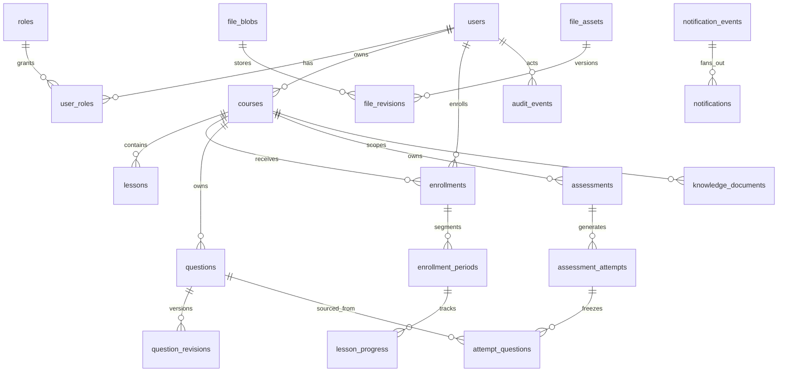
```mermaid
erDiagram
    users ||--o{ user_roles : has
    roles ||--o{ user_roles : grants
    users ||--o{ courses : owns
    courses ||--o{ lessons : contains
    users ||--o{ enrollments : enrolls
    courses ||--o{ enrollments : receives
    enrollments ||--o{ enrollment_periods : segments
    enrollment_periods ||--o{ lesson_progress : tracks
    courses ||--o{ questions : owns
    questions ||--o{ question_revisions : versions
    courses ||--o{ assessments : owns
    assessments ||--o{ assessment_attempts : generates
    assessment_attempts ||--o{ attempt_questions : freezes
    questions ||--o{ attempt_questions : sourced_from
    file_blobs ||--o{ file_revisions : stores
    file_assets ||--o{ file_revisions : versions
    courses ||--o{ knowledge_documents : scopes
    notification_events ||--o{ notifications : fans_out
    users ||--o{ audit_events : acts
```

##### 2. Identity / Auth ERD

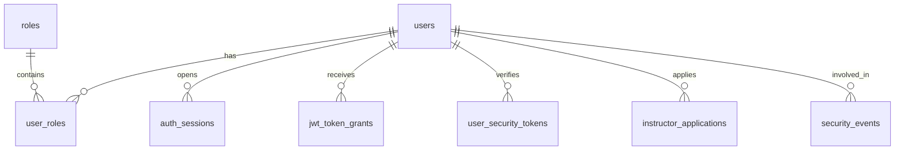
```mermaid
erDiagram
    users ||--o{ user_roles : has
    roles ||--o{ user_roles : contains
    users ||--o{ auth_sessions : opens
    users ||--o{ jwt_token_grants : receives
    users ||--o{ user_security_tokens : verifies
    users ||--o{ instructor_applications : applies
    users ||--o{ security_events : involved_in
```

##### 3. Course / Learning ERD

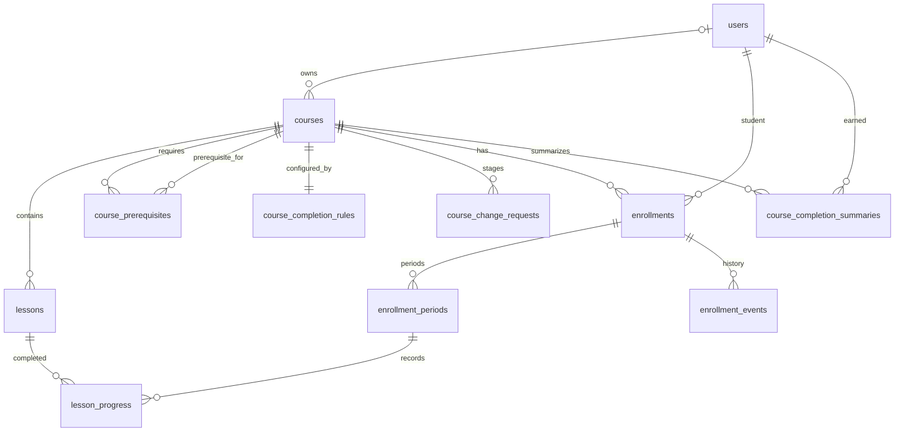
```mermaid
erDiagram
    users o|--o{ courses : owns
    courses ||--o{ lessons : contains
    courses ||--o{ course_prerequisites : requires
    courses ||--o{ course_prerequisites : prerequisite_for
    courses ||--|| course_completion_rules : configured_by
    courses ||--o{ course_change_requests : stages
    users ||--o{ enrollments : student
    courses ||--o{ enrollments : has
    enrollments ||--o{ enrollment_periods : periods
    enrollments ||--o{ enrollment_events : history
    enrollment_periods ||--o{ lesson_progress : records
    lessons ||--o{ lesson_progress : completed
    users ||--o{ course_completion_summaries : earned
    courses ||--o{ course_completion_summaries : summarizes
```

##### 4. Question Bank ERD

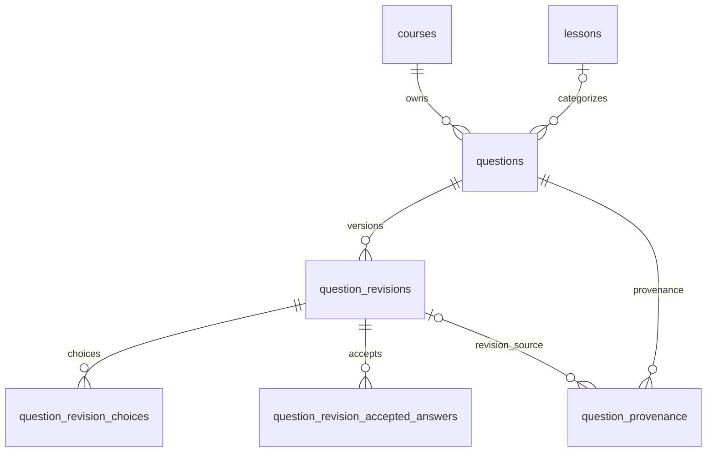
```mermaid
erDiagram
    courses ||--o{ questions : owns
    lessons o|--o{ questions : categorizes
    questions ||--o{ question_revisions : versions
    question_revisions ||--o{ question_revision_choices : choices
    question_revisions ||--o{ question_revision_accepted_answers : accepts
    questions ||--o{ question_provenance : provenance
    question_revisions o|--o{ question_provenance : revision_source
```

##### 5. Assessment Structure ERD

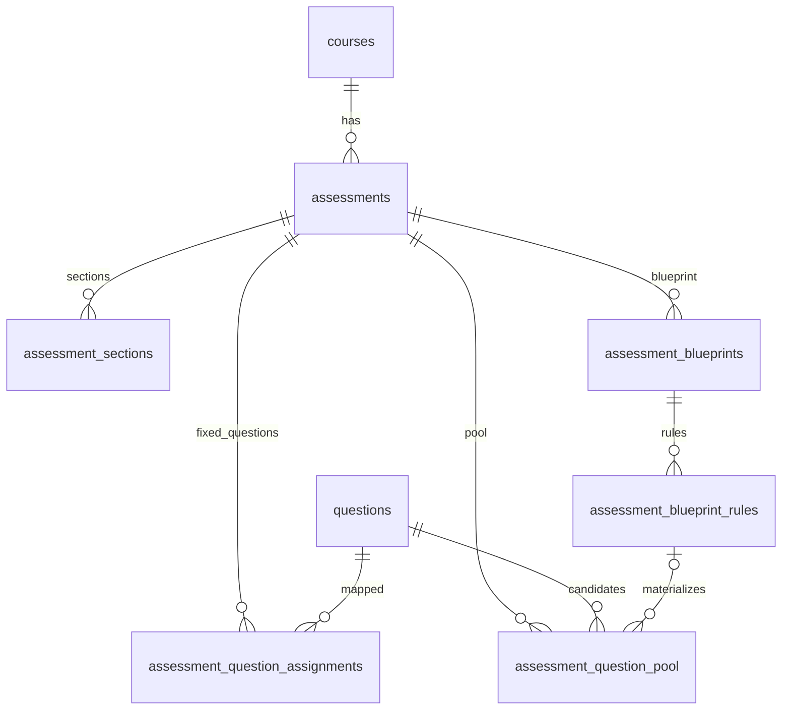
```mermaid
erDiagram
    courses ||--o{ assessments : has
    assessments ||--o{ assessment_sections : sections
    assessments ||--o{ assessment_question_assignments : fixed_questions
    questions ||--o{ assessment_question_assignments : mapped
    assessments ||--o{ assessment_blueprints : blueprint
    assessment_blueprints ||--o{ assessment_blueprint_rules : rules
    assessments ||--o{ assessment_question_pool : pool
    questions ||--o{ assessment_question_pool : candidates
    assessment_blueprint_rules o|--o{ assessment_question_pool : materializes
```

##### 6. Assessment Attempt / Grading ERD

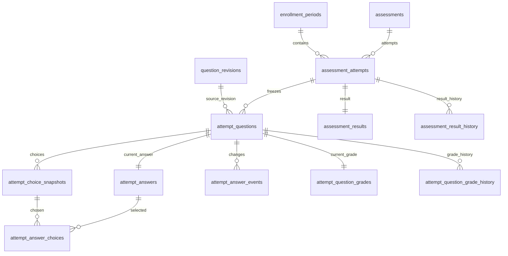
```mermaid
erDiagram
    assessments ||--o{ assessment_attempts : attempts
    enrollment_periods ||--o{ assessment_attempts : contains
    assessment_attempts ||--o{ attempt_questions : freezes
    question_revisions ||--o{ attempt_questions : source_revision
    attempt_questions ||--o{ attempt_choice_snapshots : choices
    attempt_questions ||--|| attempt_answers : current_answer
    attempt_answers ||--o{ attempt_answer_choices : selected
    attempt_choice_snapshots ||--o{ attempt_answer_choices : chosen
    attempt_questions ||--o{ attempt_answer_events : changes
    attempt_questions ||--|| attempt_question_grades : current_grade
    attempt_questions ||--o{ attempt_question_grade_history : grade_history
    assessment_attempts ||--|| assessment_results : result
    assessment_attempts ||--o{ assessment_result_history : result_history
```

##### 7. Correction / Regrade ERD

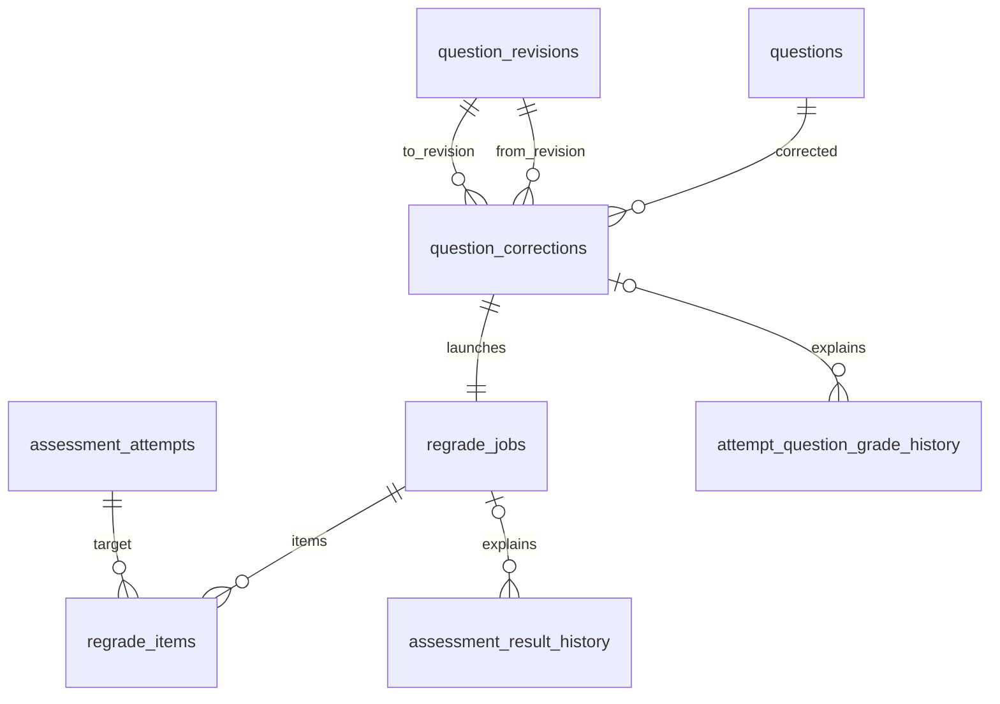
```mermaid
erDiagram
    questions ||--o{ question_corrections : corrected
    question_revisions ||--o{ question_corrections : from_revision
    question_revisions ||--o{ question_corrections : to_revision
    question_corrections ||--|| regrade_jobs : launches
    regrade_jobs ||--o{ regrade_items : items
    assessment_attempts ||--o{ regrade_items : target
    question_corrections o|--o{ attempt_question_grade_history : explains
    regrade_jobs o|--o{ assessment_result_history : explains
```

##### 8. File / Import ERD

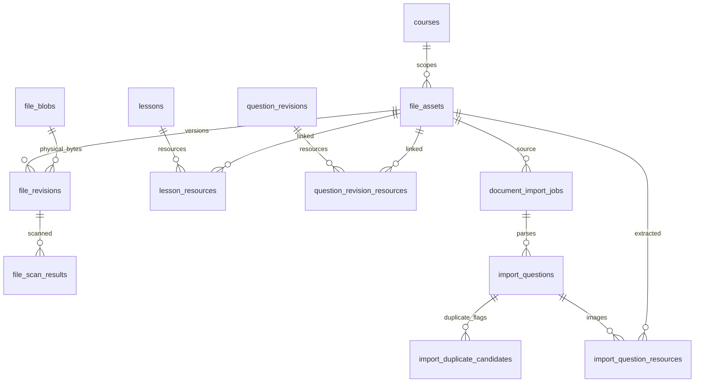
```mermaid
erDiagram
    courses ||--o{ file_assets : scopes
    file_assets ||--o{ file_revisions : versions
    file_blobs ||--o{ file_revisions : physical_bytes
    file_revisions ||--o{ file_scan_results : scanned
    lessons ||--o{ lesson_resources : resources
    file_assets ||--o{ lesson_resources : linked
    question_revisions ||--o{ question_revision_resources : resources
    file_assets ||--o{ question_revision_resources : linked
    file_assets ||--o{ document_import_jobs : source
    document_import_jobs ||--o{ import_questions : parses
    import_questions ||--o{ import_duplicate_candidates : duplicate_flags
    import_questions ||--o{ import_question_resources : images
    file_assets ||--o{ import_question_resources : extracted
```

##### 9. AI / RAG ERD

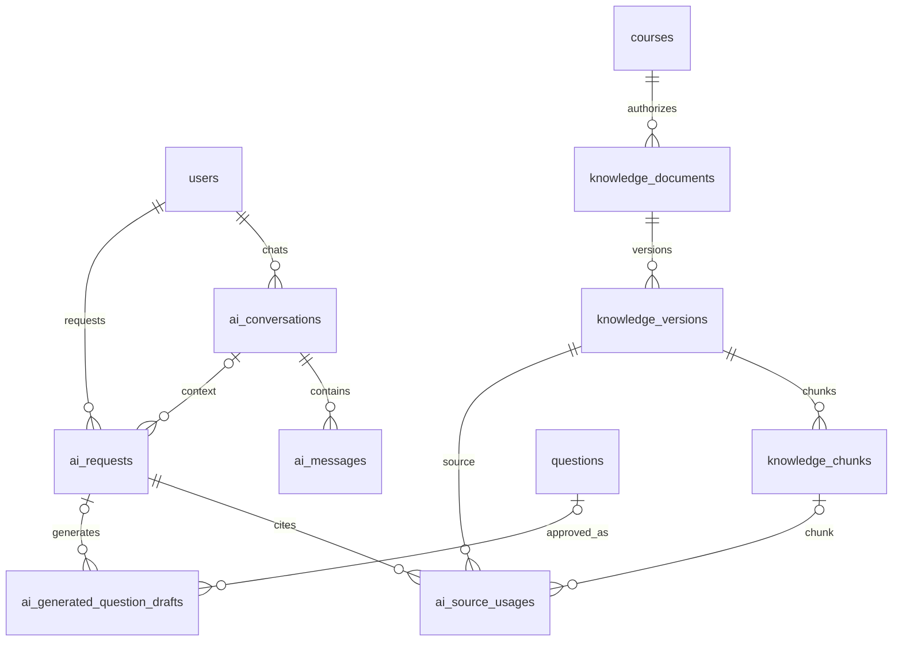
```mermaid
erDiagram
    users ||--o{ ai_conversations : chats
    ai_conversations ||--o{ ai_messages : contains
    users ||--o{ ai_requests : requests
    ai_conversations o|--o{ ai_requests : context
    courses ||--o{ knowledge_documents : authorizes
    knowledge_documents ||--o{ knowledge_versions : versions
    knowledge_versions ||--o{ knowledge_chunks : chunks
    ai_requests ||--o{ ai_source_usages : cites
    knowledge_versions ||--o{ ai_source_usages : source
    knowledge_chunks o|--o{ ai_source_usages : chunk
    ai_requests o|--o{ ai_generated_question_drafts : generates
    questions o|--o{ ai_generated_question_drafts : approved_as
```

##### 10. Notification / Audit / Operations ERD

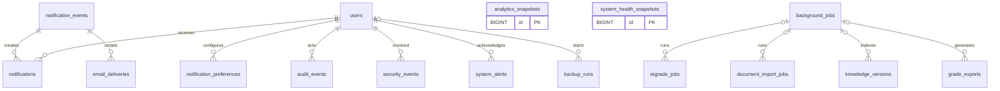
```mermaid
erDiagram
    notification_events ||--o{ notifications : creates
    notification_events ||--o{ email_deliveries : emails
    users ||--o{ notifications : receives
    users ||--o{ notification_preferences : configures
    users ||--o{ audit_events : acts
    users ||--o{ security_events : involved
    users ||--o{ system_alerts : acknowledges
    users o|--o{ backup_runs : starts
    analytics_snapshots {
        BIGINT id PK
    }
    system_health_snapshots {
        BIGINT id PK
    }
    background_jobs o|--o{ regrade_jobs : runs
    background_jobs o|--o{ document_import_jobs : runs
    background_jobs o|--o{ knowledge_versions : indexes
    background_jobs o|--o{ grade_exports : generates
```

##### 11. Physical relationship notes

- `users.avatar_file_asset_id`, `courses.thumbnail_file_asset_id`, current revision pointers and background-job pointers are deferred FKs to break DDL cycles.
- `audit_events.target_type/target_id` and `notification_events.target_type/target_id` are deliberately weak/polymorphic references because audit/notification history must survive target deletion. They are the exception, not the modeling default.
- Vector store `vector_key` is not an FK because embeddings are not stored in the primary SQL Server schema.


### Nguồn chuẩn: `database/DATA_DICTIONARY.md`

#### 04 DATA DICTIONARY IDENTITY

Database engine: **Microsoft SQL Server**. Timestamps are UTC `DATETIME2(3)` unless noted.

##### `users`

**Purpose**

Tài khoản duy nhất cho Student/Instructor/Admin; email là định danh đăng nhập duy nhất.

**Lifecycle**

ACTIVE → SUSPENDED/DEACTIVATED; có thể unsuspend về ACTIVE; khi xóa tài khoản theo chính sách thì deactivated trước, sau đó có thể ANONYMIZED.

###### Columns

| Column | Type | Nullable | Default / Computed | Description |
|---|---|---:|---|---|
| `id` | `BIGINT` | No | IDENTITY(1,1) | Khóa chính nội bộ |
| `public_id` | `UNIQUEIDENTIFIER` | No | `NEWSEQUENTIALID()` | ID công khai dùng trong URL/API; không thay thế kiểm tra quyền |
| `email` | `NVARCHAR(320)` | No |  | Email đăng nhập hiện hành |
| `email_normalized` | `NVARCHAR(320)` | No | `LOWER(LTRIM(RTRIM([email]))) PERSISTED` | Email chuẩn hóa để unique |
| `password_hash` | `NVARCHAR(255)` | No |  | Mật khẩu đã băm bằng thuật toán mạnh; không lưu plaintext |
| `display_name` | `NVARCHAR(150)` | No |  | Tên hiển thị |
| `avatar_file_asset_id` | `BIGINT` | Yes |  | File ảnh đại diện logic; FK được thêm sau khi tạo file_assets |
| `status` | `VARCHAR(24)` | No | `'ACTIVE'` | ACTIVE/SUSPENDED/DEACTIVATED/ANONYMIZED |
| `auth_version` | `INT` | No | `1` | Tăng khi cần vô hiệu hóa toàn bộ session/JWT |
| `email_verified_at` | `DATETIME2(3)` | Yes |  | Thời điểm email hiện tại được xác minh |
| `suspended_at` | `DATETIME2(3)` | Yes |  | Thời điểm suspend |
| `suspension_reason` | `NVARCHAR(500)` | Yes |  | Lý do suspend |
| `anonymized_at` | `DATETIME2(3)` | Yes |  | Thời điểm ẩn danh hóa PII |
| `created_at` | `DATETIME2(3)` | No | `SYSUTCDATETIME()` | Thời điểm tạo (UTC) |
| `updated_at` | `DATETIME2(3)` | No | `SYSUTCDATETIME()` | Thời điểm cập nhật cuối (UTC) |
| `row_version` | `ROWVERSION` | No |  | Token lạc quan phát hiện ghi đè đồng thời |

###### Primary Key

`id`

###### Foreign Keys

| Columns | References | ON DELETE | Notes |
|---|---|---|---|
| `avatar_file_asset_id` | `file_assets(id)` | `SET NULL` | Deferred cross-domain FK created in `010_cross_domain_constraints.sql`. |

###### Unique Constraints

- `UNIQUE (public_id)`
- `UNIQUE (email_normalized)`

###### Check Constraints

- `status IN ('ACTIVE','SUSPENDED','DEACTIVATED','ANONYMIZED')`
- `auth_version >= 1`

###### Indexes

| Index | Columns | Unique | Filter | Purpose |
|---|---|---:|---|---|
| `ix_users_status` | `status, id` | No | `` | Hỗ trợ truy vấn/filter/pagination chính của table. |

###### Relationships

- Quan hệ được xác định bởi các FK ở trên; hướng 1-N/N-N xem `03_ERD.md`.
- Các cross-domain pointer được tạo sau bằng DDL riêng để tránh vòng phụ thuộc lúc bootstrap.

###### Delete behavior

Không hard-delete nếu đã có lịch sử. PII có thể được ẩn danh; các FK lịch sử vẫn giữ user_id.

###### Audit behavior

Role/status/email/security changes phải audit; không ghi password_hash vào payload.

###### Concurrency

row_version cho cập nhật profile/trạng thái; suspend + auth_version increment trong một transaction.

###### Security / PII classification

PII + authentication-sensitive. Chỉ backend truy cập password_hash.

###### Important invariants

- email duy nhất sau normalize
- suspend phải làm auth_version thay đổi và revoke auth_sessions/JWT grants
- ANONYMIZED không được login

---

##### `roles`

**Purpose**

Danh mục ba role hệ thống.

**Lifecycle**

Seed cố định; hiếm khi thay đổi.

###### Columns

| Column | Type | Nullable | Default / Computed | Description |
|---|---|---:|---|---|
| `id` | `BIGINT` | No | IDENTITY(1,1) | Khóa chính nội bộ |
| `code` | `VARCHAR(32)` | No |  | STUDENT/INSTRUCTOR/ADMIN |
| `name` | `NVARCHAR(100)` | No |  | Tên hiển thị |
| `created_at` | `DATETIME2(3)` | No | `SYSUTCDATETIME()` | Thời điểm tạo (UTC) |

###### Primary Key

`id`

###### Foreign Keys

_None._

###### Unique Constraints

- `UNIQUE (code)`

###### Check Constraints

- `code IN ('STUDENT','INSTRUCTOR','ADMIN')`

###### Indexes

_None._

###### Relationships

- Quan hệ được xác định bởi các FK ở trên; hướng 1-N/N-N xem `03_ERD.md`.
- Các cross-domain pointer được tạo sau bằng DDL riêng để tránh vòng phụ thuộc lúc bootstrap.

###### Delete behavior

RESTRICT; không xóa role đang dùng.

###### Audit behavior

Thay đổi seed role là hành động quản trị đặc biệt.

###### Concurrency

Không cần optimistic lock riêng ngoài transaction thông thường.

###### Security / PII classification

Không PII.

###### Important invariants

- Chỉ ba role đã chốt trong MVP

---

##### `user_roles`

**Purpose**

Quan hệ nhiều-nhiều User ↔ Role và nguồn gán quyền.

**Lifecycle**

Thêm/bỏ role theo service quản trị.

###### Columns

| Column | Type | Nullable | Default / Computed | Description |
|---|---|---:|---|---|
| `user_id` | `BIGINT` | No |  | User |
| `role_id` | `BIGINT` | No |  | Role |
| `assigned_at` | `DATETIME2(3)` | No | `SYSUTCDATETIME()` | Thời điểm gán |
| `assigned_by_user_id` | `BIGINT` | Yes |  | Admin/người gán |
| `assignment_reason` | `NVARCHAR(500)` | Yes |  | Lý do gán/approve |

###### Primary Key

`user_id, role_id`

###### Foreign Keys

| Columns | References | ON DELETE | Notes |
|---|---|---|---|
| `user_id` | `users(id)` | `NO ACTION` |  |
| `role_id` | `roles(id)` | `NO ACTION` |  |
| `assigned_by_user_id` | `users(id)` | `SET NULL` |  |

###### Unique Constraints

_None._

###### Check Constraints

_None._

###### Indexes

| Index | Columns | Unique | Filter | Purpose |
|---|---|---:|---|---|
| `ix_user_roles_role` | `role_id, user_id` | No | `` | Hỗ trợ truy vấn/filter/pagination chính của table. |

###### Relationships

- Quan hệ được xác định bởi các FK ở trên; hướng 1-N/N-N xem `03_ERD.md`.
- Các cross-domain pointer được tạo sau bằng DDL riêng để tránh vòng phụ thuộc lúc bootstrap.

###### Delete behavior

Xóa junction row khi revoke role; lịch sử hành động nằm AuditEvent.

###### Audit behavior

Mọi grant/revoke phải audit và notification.

###### Concurrency

Không cần optimistic lock riêng ngoài transaction thông thường.

###### Security / PII classification

Authorization-critical.

###### Important invariants

- Tổ hợp hợp lệ: STUDENT; STUDENT+INSTRUCTOR; STUDENT+INSTRUCTOR+ADMIN
- Service phải tự thêm role cấp thấp khi grant role cấp cao

---

##### `auth_sessions`

**Purpose**

Session phía server cho web/Jinja/AJAX; cho phép revoke tức thì và theo dõi re-auth.

**Lifecycle**

Tạo khi login; revoke/logout/suspend; cleanup sau hết hạn.

###### Columns

| Column | Type | Nullable | Default / Computed | Description |
|---|---|---:|---|---|
| `id` | `BIGINT` | No | IDENTITY(1,1) | Khóa chính nội bộ |
| `session_key_hash` | `BINARY(32)` | No |  | SHA-256 của opaque session key; không lưu raw key |
| `user_id` | `BIGINT` | No |  | User sở hữu session |
| `auth_version` | `INT` | No |  | Bản auth_version tại lúc login |
| `created_at` | `DATETIME2(3)` | No | `SYSUTCDATETIME()` | UTC |
| `last_seen_at` | `DATETIME2(3)` | No | `SYSUTCDATETIME()` | Hoạt động gần nhất |
| `expires_at` | `DATETIME2(3)` | No |  | Hết hạn session |
| `revoked_at` | `DATETIME2(3)` | Yes |  | Thời điểm revoke |
| `reauthenticated_at` | `DATETIME2(3)` | Yes |  | Lần nhập lại password gần nhất cho hành động nhạy cảm |
| `ip_address` | `VARCHAR(45)` | Yes |  | IPv4/IPv6 quan sát được |
| `user_agent_hash` | `BINARY(32)` | Yes |  | Hash UA, giảm lưu PII kỹ thuật |
| `row_version` | `ROWVERSION` | No |  | Token lạc quan phát hiện ghi đè đồng thời |

###### Primary Key

`id`

###### Foreign Keys

| Columns | References | ON DELETE | Notes |
|---|---|---|---|
| `user_id` | `users(id)` | `NO ACTION` |  |

###### Unique Constraints

- `UNIQUE (session_key_hash)`

###### Check Constraints

- `expires_at > created_at`

###### Indexes

| Index | Columns | Unique | Filter | Purpose |
|---|---|---:|---|---|
| `ix_auth_sessions_user_active` | `user_id, expires_at` | No | `revoked_at IS NULL` | Hỗ trợ truy vấn/filter/pagination chính của table. |

###### Relationships

- Quan hệ được xác định bởi các FK ở trên; hướng 1-N/N-N xem `03_ERD.md`.
- Các cross-domain pointer được tạo sau bằng DDL riêng để tránh vòng phụ thuộc lúc bootstrap.

###### Delete behavior

Hard-delete sau retention bảo mật ngắn khi expired/revoked; audit quan trọng giữ riêng.

###### Audit behavior

Login/logout/revoke bất thường ghi security_event; không audit mọi heartbeat.

###### Concurrency

Revoke và reauth cập nhật bằng row_version/transaction.

###### Security / PII classification

Authentication-sensitive; raw cookie/session token không bao giờ lưu.

###### Important invariants

- Session chỉ hợp lệ nếu user ACTIVE, revoked_at NULL, expires_at > now và auth_version khớp users.auth_version

---

##### `jwt_token_grants`

**Purpose**

Theo dõi JWT/refresh grant cho REST API và revoke có kiểm soát.

**Lifecycle**

Issue → rotate/revoke/expire → cleanup.

###### Columns

| Column | Type | Nullable | Default / Computed | Description |
|---|---|---:|---|---|
| `id` | `BIGINT` | No | IDENTITY(1,1) | Khóa chính nội bộ |
| `jti` | `UNIQUEIDENTIFIER` | No |  | JWT ID |
| `user_id` | `BIGINT` | No |  | User |
| `session_family_id` | `UNIQUEIDENTIFIER` | No | `NEWID()` | Nhóm token/refresh chain |
| `auth_version` | `INT` | No |  | Bản auth_version khi phát hành |
| `token_type` | `VARCHAR(16)` | No |  | ACCESS/REFRESH |
| `issued_at` | `DATETIME2(3)` | No | `SYSUTCDATETIME()` | UTC |
| `expires_at` | `DATETIME2(3)` | No |  | Hạn token |
| `revoked_at` | `DATETIME2(3)` | Yes |  | Revoke |
| `replaced_by_jti` | `UNIQUEIDENTIFIER` | Yes |  | Refresh rotation kế tiếp |
| `token_hash` | `BINARY(32)` | Yes |  | Hash refresh token nếu token opaque/refresh secret cần lưu |

###### Primary Key

`id`

###### Foreign Keys

| Columns | References | ON DELETE | Notes |
|---|---|---|---|
| `user_id` | `users(id)` | `NO ACTION` |  |

###### Unique Constraints

- `UNIQUE (jti)`

###### Check Constraints

- `token_type IN ('ACCESS','REFRESH')`
- `expires_at > issued_at`

###### Indexes

| Index | Columns | Unique | Filter | Purpose |
|---|---|---:|---|---|
| `ix_jwt_user_active` | `user_id, expires_at` | No | `revoked_at IS NULL` | Hỗ trợ truy vấn/filter/pagination chính của table. |
| `ix_jwt_family` | `session_family_id, issued_at` | No | `` | Hỗ trợ truy vấn/filter/pagination chính của table. |

###### Relationships

- Quan hệ được xác định bởi các FK ở trên; hướng 1-N/N-N xem `03_ERD.md`.
- Các cross-domain pointer được tạo sau bằng DDL riêng để tránh vòng phụ thuộc lúc bootstrap.

###### Delete behavior

Cleanup sau expiry + security retention; security events tách riêng.

###### Audit behavior

Revoke family hoặc nghi ngờ replay ghi security_event.

###### Concurrency

Không cần optimistic lock riêng ngoài transaction thông thường.

###### Security / PII classification

Authentication-sensitive; không lưu raw bearer token.

###### Important invariants

- JWT hợp lệ cần signature + exp/nbf/iss/aud + grant chưa revoke + auth_version khớp user

---

##### `user_security_tokens`

**Purpose**

Token dùng một lần cho verify email, đổi email, reset password.

**Lifecycle**

Tạo → consume/expire → cleanup.

###### Columns

| Column | Type | Nullable | Default / Computed | Description |
|---|---|---:|---|---|
| `id` | `BIGINT` | No | IDENTITY(1,1) | Khóa chính nội bộ |
| `user_id` | `BIGINT` | No |  | User |
| `purpose` | `VARCHAR(32)` | No |  | EMAIL_VERIFY/EMAIL_CHANGE/PASSWORD_RESET |
| `token_hash` | `BINARY(32)` | No |  | Hash token một lần |
| `pending_email` | `NVARCHAR(320)` | Yes |  | Email mới khi EMAIL_CHANGE |
| `created_at` | `DATETIME2(3)` | No | `SYSUTCDATETIME()` | UTC |
| `expires_at` | `DATETIME2(3)` | No |  | Hạn token |
| `consumed_at` | `DATETIME2(3)` | Yes |  | Đã dùng |

###### Primary Key

`id`

###### Foreign Keys

| Columns | References | ON DELETE | Notes |
|---|---|---|---|
| `user_id` | `users(id)` | `NO ACTION` |  |

###### Unique Constraints

- `UNIQUE (token_hash)`

###### Check Constraints

- `purpose IN ('EMAIL_VERIFY','EMAIL_CHANGE','PASSWORD_RESET')`
- `expires_at > created_at`

###### Indexes

| Index | Columns | Unique | Filter | Purpose |
|---|---|---:|---|---|
| `ix_security_tokens_user_purpose` | `user_id, purpose, expires_at` | No | `` | Hỗ trợ truy vấn/filter/pagination chính của table. |

###### Relationships

- Quan hệ được xác định bởi các FK ở trên; hướng 1-N/N-N xem `03_ERD.md`.
- Các cross-domain pointer được tạo sau bằng DDL riêng để tránh vòng phụ thuộc lúc bootstrap.

###### Delete behavior

Hard-delete sau expiry/consume + retention ngắn.

###### Audit behavior

Không audit raw token; email/password change thành công phải audit.

###### Concurrency

Không cần optimistic lock riêng ngoài transaction thông thường.

###### Security / PII classification

Highly sensitive; chỉ hash token.

###### Important invariants

- EMAIL_CHANGE chỉ cập nhật users.email sau xác minh token hợp lệ

---

##### `instructor_applications`

**Purpose**

Yêu cầu Student trở thành Instructor; Admin duyệt/từ chối.

**Lifecycle**

PENDING → APPROVED/REJECTED/CANCELLED.

###### Columns

| Column | Type | Nullable | Default / Computed | Description |
|---|---|---:|---|---|
| `id` | `BIGINT` | No | IDENTITY(1,1) | Khóa chính nội bộ |
| `applicant_user_id` | `BIGINT` | No |  | User đăng ký |
| `status` | `VARCHAR(20)` | No | `'PENDING'` | PENDING/APPROVED/REJECTED/CANCELLED |
| `application_note` | `NVARCHAR(2000)` | Yes |  | Thông tin đăng ký |
| `reviewed_by_user_id` | `BIGINT` | Yes |  | Admin duyệt |
| `review_reason` | `NVARCHAR(1000)` | Yes |  | Lý do quyết định |
| `created_at` | `DATETIME2(3)` | No | `SYSUTCDATETIME()` | Thời điểm tạo (UTC) |
| `reviewed_at` | `DATETIME2(3)` | Yes |  | Thời điểm duyệt |
| `row_version` | `ROWVERSION` | No |  | Token lạc quan phát hiện ghi đè đồng thời |

###### Primary Key

`id`

###### Foreign Keys

| Columns | References | ON DELETE | Notes |
|---|---|---|---|
| `applicant_user_id` | `users(id)` | `NO ACTION` |  |
| `reviewed_by_user_id` | `users(id)` | `SET NULL` |  |

###### Unique Constraints

_None._

###### Check Constraints

- `status IN ('PENDING','APPROVED','REJECTED','CANCELLED')`

###### Indexes

| Index | Columns | Unique | Filter | Purpose |
|---|---|---:|---|---|
| `ix_instructor_app_status` | `status, created_at` | No | `` | Hỗ trợ truy vấn/filter/pagination chính của table. |

###### Relationships

- Quan hệ được xác định bởi các FK ở trên; hướng 1-N/N-N xem `03_ERD.md`.
- Các cross-domain pointer được tạo sau bằng DDL riêng để tránh vòng phụ thuộc lúc bootstrap.

###### Delete behavior

Không hard-delete quyết định đã review trong retention audit.

###### Audit behavior

Approve/reject bắt buộc audit.

###### Concurrency

row_version tránh hai Admin review chồng nhau.

###### Security / PII classification

Chứa dữ liệu hồ sơ nhẹ; Instructor role chỉ được grant qua service.

###### Important invariants

- APPROVED transaction phải tạo roles STUDENT+INSTRUCTOR nếu chưa có và notification

---

##### `security_events`

**Purpose**

Sự kiện bảo mật/abuse cần giữ dù raw AI chat hoặc session đã cleanup.

**Lifecycle**

Append; archive operationally khi rất cũ.

###### Columns

| Column | Type | Nullable | Default / Computed | Description |
|---|---|---:|---|---|
| `id` | `BIGINT` | No | IDENTITY(1,1) | Khóa chính nội bộ |
| `user_id` | `BIGINT` | Yes |  | User liên quan |
| `event_type` | `VARCHAR(64)` | No |  | FAILED_LOGIN/PROMPT_INJECTION/MALWARE/RATE_LIMIT/... |
| `severity` | `VARCHAR(16)` | No |  | INFO/WARN/HIGH/CRITICAL |
| `action_taken` | `VARCHAR(64)` | No |  | ALLOW/BLOCK/REVOKE/QUARANTINE/ALERT |
| `risk_score` | `DECIMAL(5,2)` | Yes |  | 0-100 |
| `input_hash` | `BINARY(32)` | Yes |  | Hash input khi cần đối chiếu, không raw content |
| `ip_address` | `VARCHAR(45)` | Yes |  | IP |
| `correlation_id` | `UNIQUEIDENTIFIER` | No | `NEWID()` | Liên kết request |
| `metadata_json` | `NVARCHAR(MAX)` | Yes |  | Metadata không chứa secret/raw sensitive text |
| `created_at` | `DATETIME2(3)` | No | `SYSUTCDATETIME()` | Thời điểm tạo (UTC) |

###### Primary Key

`id`

###### Foreign Keys

| Columns | References | ON DELETE | Notes |
|---|---|---|---|
| `user_id` | `users(id)` | `SET NULL` |  |

###### Unique Constraints

_None._

###### Check Constraints

- `severity IN ('INFO','WARN','HIGH','CRITICAL')`
- `action_taken IN ('ALLOW','BLOCK','REVOKE','QUARANTINE','ALERT')`
- `risk_score IS NULL OR (risk_score >= 0 AND risk_score <= 100)`
- `metadata_json IS NULL OR ISJSON(metadata_json)=1`

###### Indexes

| Index | Columns | Unique | Filter | Purpose |
|---|---|---:|---|---|
| `ix_security_events_type_time` | `event_type, created_at` | No | `` | Hỗ trợ truy vấn/filter/pagination chính của table. |
| `ix_security_events_user_time` | `user_id, created_at` | No | `` | Hỗ trợ truy vấn/filter/pagination chính của table. |

###### Relationships

- Quan hệ được xác định bởi các FK ở trên; hướng 1-N/N-N xem `03_ERD.md`.
- Các cross-domain pointer được tạo sau bằng DDL riêng để tránh vòng phụ thuộc lúc bootstrap.

###### Delete behavior

Không user-delete; có thể archive theo policy.

###### Audit behavior

Bản thân là security record; không chứa secret.

###### Concurrency

Không cần optimistic lock riêng ngoài transaction thông thường.

###### Security / PII classification

Security-sensitive; quyền xem Admin hạn chế.

###### Important invariants

- Không lưu raw password/JWT/API key/raw AI conversation

---
#### 05 DATA DICTIONARY COURSE

Database engine: **Microsoft SQL Server**. Timestamps are UTC `DATETIME2(3)` unless noted.

##### `courses`

**Purpose**

Course chính; có thể tạm không có Instructor owner; code và title đều unique.

**Lifecycle**

DRAFT → SUBMITTED_FOR_REVIEW → APPROVED → PUBLISHED; có thể ARCHIVED hoặc TRASH. Material change trên bản published đi qua course_change_requests.

###### Columns

| Column | Type | Nullable | Default / Computed | Description |
|---|---|---:|---|---|
| `id` | `BIGINT` | No | IDENTITY(1,1) | Khóa chính nội bộ |
| `public_id` | `UNIQUEIDENTIFIER` | No | `NEWSEQUENTIALID()` | ID công khai dùng trong URL/API; không thay thế kiểm tra quyền |
| `course_code` | `NVARCHAR(50)` | No |  | Mã Course |
| `course_code_normalized` | `NVARCHAR(50)` | No | `UPPER(LTRIM(RTRIM([course_code]))) PERSISTED` | Mã chuẩn hóa |
| `title` | `NVARCHAR(200)` | No |  | Tên Course |
| `title_normalized` | `NVARCHAR(200)` | No | `LOWER(LTRIM(RTRIM([title]))) PERSISTED` | Tên chuẩn hóa |
| `description` | `NVARCHAR(MAX)` | Yes |  | Mô tả |
| `category` | `NVARCHAR(100)` | Yes |  | Danh mục |
| `difficulty` | `VARCHAR(20)` | Yes |  | BEGINNER/INTERMEDIATE/ADVANCED |
| `owner_instructor_id` | `BIGINT` | Yes |  | Instructor hiện quản lý; có thể NULL tạm thời |
| `thumbnail_file_asset_id` | `BIGINT` | Yes |  | Ảnh Course; FK thêm sau khi file_assets tồn tại |
| `status` | `VARCHAR(32)` | No | `'DRAFT'` | DRAFT/SUBMITTED_FOR_REVIEW/APPROVED/PUBLISHED/ARCHIVED/TRASH |
| `capacity` | `INT` | Yes |  | Số Student tối đa; NULL = không giới hạn |
| `storage_quota_bytes` | `BIGINT` | Yes |  | Quota override per Course; NULL dùng mặc định |
| `published_at` | `DATETIME2(3)` | Yes |  | Lần publish hiện hành/đầu tiên tùy service |
| `approved_at` | `DATETIME2(3)` | Yes |  | Lần approve gần nhất |
| `approved_by_user_id` | `BIGINT` | Yes |  | Admin approve |
| `first_student_enrolled_at` | `DATETIME2(3)` | Yes |  | Marker lịch sử giúp delete policy |
| `created_at` | `DATETIME2(3)` | No | `SYSUTCDATETIME()` | Thời điểm tạo (UTC) |
| `updated_at` | `DATETIME2(3)` | No | `SYSUTCDATETIME()` | Thời điểm cập nhật cuối (UTC) |
| `row_version` | `ROWVERSION` | No |  | Token lạc quan phát hiện ghi đè đồng thời |
| `deleted_at` | `DATETIME2(3)` | Yes |  | Thời điểm đưa vào thùng rác |
| `restore_until` | `DATETIME2(3)` | Yes |  | Hạn khôi phục trước khi cleanup/historical transition |
| `deleted_by_user_id` | `BIGINT` | Yes |  | Người thực hiện xóa |

###### Primary Key

`id`

###### Foreign Keys

| Columns | References | ON DELETE | Notes |
|---|---|---|---|
| `owner_instructor_id` | `users(id)` | `NO ACTION` | User records with history are deactivated/anonymized rather than hard-deleted; reassignment/nulling is service-managed. |
| `approved_by_user_id` | `users(id)` | `NO ACTION` | Preserve approval actor history; anonymize User in place. |
| `deleted_by_user_id` | `users(id)` | `NO ACTION` | Preserve deletion actor history; anonymize User in place. |
| `thumbnail_file_asset_id` | `file_assets(id)` | `SET NULL` | Deferred cross-domain FK created in `010_cross_domain_constraints.sql`. |

###### Unique Constraints

- `UNIQUE (public_id)`
- `UNIQUE (course_code_normalized)`
- `UNIQUE (title_normalized)`

###### Check Constraints

- `status IN ('DRAFT','SUBMITTED_FOR_REVIEW','APPROVED','PUBLISHED','ARCHIVED','TRASH')`
- `difficulty IS NULL OR difficulty IN ('BEGINNER','INTERMEDIATE','ADVANCED')`
- `capacity IS NULL OR capacity > 0`
- `storage_quota_bytes IS NULL OR storage_quota_bytes > 0`

###### Indexes

| Index | Columns | Unique | Filter | Purpose |
|---|---|---:|---|---|
| `ix_courses_catalog` | `status, category, difficulty, title` | No | `` | Hỗ trợ truy vấn/filter/pagination chính của table. |
| `ix_courses_owner` | `owner_instructor_id, status` | No | `` | Hỗ trợ truy vấn/filter/pagination chính của table. |

###### Relationships

- Quan hệ được xác định bởi các FK ở trên; hướng 1-N/N-N xem `03_ERD.md`.
- Các cross-domain pointer được tạo sau bằng DDL riêng để tránh vòng phụ thuộc lúc bootstrap.

###### Delete behavior

Course chưa có lịch sử có thể hard-delete sau recovery. Course đã có Student: TRASH/ARCHIVED historical, không cascade attempts/progress.

###### Audit behavior

Publish/approve/archive/delete/reassign/material admin edit phải audit.

###### Concurrency

row_version; reorder/structural operations dùng transaction.

###### Security / PII classification

Authorization boundary theo owner_instructor_id + Admin override có reason/audit.

###### Important invariants

- Course code unique
- Course title unique
- owner nếu có phải đang có role INSTRUCTOR (service-enforced)
- Course làm prerequisite cho active course khác không được archive/delete

---

##### `course_prerequisites`

**Purpose**

Quan hệ N-N Course yêu cầu Course khác hoàn thành trước.

**Lifecycle**

Thêm/xóa khi Course chưa bị dependency lock.

###### Columns

| Column | Type | Nullable | Default / Computed | Description |
|---|---|---:|---|---|
| `course_id` | `BIGINT` | No |  | Course đích |
| `prerequisite_course_id` | `BIGINT` | No |  | Course bắt buộc hoàn thành |
| `created_by_user_id` | `BIGINT` | No |  | Người tạo |
| `created_at` | `DATETIME2(3)` | No | `SYSUTCDATETIME()` | Thời điểm tạo (UTC) |

###### Primary Key

`course_id, prerequisite_course_id`

###### Foreign Keys

| Columns | References | ON DELETE | Notes |
|---|---|---|---|
| `course_id` | `courses(id)` | `NO ACTION` |  |
| `prerequisite_course_id` | `courses(id)` | `NO ACTION` |  |
| `created_by_user_id` | `users(id)` | `NO ACTION` | Column is required; historical actor is preserved through User anonymization. |

###### Unique Constraints

_None._

###### Check Constraints

- `course_id <> prerequisite_course_id`

###### Indexes

| Index | Columns | Unique | Filter | Purpose |
|---|---|---:|---|---|
| `ix_course_prereq_reverse` | `prerequisite_course_id, course_id` | No | `` | Hỗ trợ truy vấn/filter/pagination chính của table. |

###### Relationships

- Quan hệ được xác định bởi các FK ở trên; hướng 1-N/N-N xem `03_ERD.md`.
- Các cross-domain pointer được tạo sau bằng DDL riêng để tránh vòng phụ thuộc lúc bootstrap.

###### Delete behavior

NO ACTION; hard delete Course bị chặn nếu còn dependency.

###### Audit behavior

Thay đổi prerequisite là material change và audit/reapproval.

###### Concurrency

Không cần optimistic lock riêng ngoài transaction thông thường.

###### Security / PII classification

Instructor owner/Admin.

###### Important invariants

- Không self-reference
- Không cycle; cycle detection service trong transaction
- Không archive/delete prerequisite đang phục vụ active Course

---

##### `course_completion_rules`

**Purpose**

Cấu hình điều kiện hoàn thành Course theo mô hình đơn giản, không EAV.

**Lifecycle**

Một row per Course; material change cần approval trên Course published.

###### Columns

| Column | Type | Nullable | Default / Computed | Description |
|---|---|---:|---|---|
| `course_id` | `BIGINT` | No |  | PK/FK Course |
| `require_all_required_lessons` | `BIT` | No | `1` | Phải hoàn thành tất cả Lesson bắt buộc |
| `require_required_assessments` | `BIT` | No | `1` | Phải đạt các Assessment đánh dấu required |
| `minimum_progress_percent` | `DECIMAL(5,2)` | Yes |  | Ngưỡng progress nếu cần |
| `updated_by_user_id` | `BIGINT` | Yes |  | Người chỉnh |
| `updated_at` | `DATETIME2(3)` | No | `SYSUTCDATETIME()` | Thời điểm cập nhật cuối (UTC) |
| `row_version` | `ROWVERSION` | No |  | Token lạc quan phát hiện ghi đè đồng thời |

###### Primary Key

`course_id`

###### Foreign Keys

| Columns | References | ON DELETE | Notes |
|---|---|---|---|
| `course_id` | `courses(id)` | `NO ACTION` |  |
| `updated_by_user_id` | `users(id)` | `SET NULL` |  |

###### Unique Constraints

_None._

###### Check Constraints

- `minimum_progress_percent IS NULL OR (minimum_progress_percent >= 0 AND minimum_progress_percent <= 100)`

###### Indexes

_None._

###### Relationships

- Quan hệ được xác định bởi các FK ở trên; hướng 1-N/N-N xem `03_ERD.md`.
- Các cross-domain pointer được tạo sau bằng DDL riêng để tránh vòng phụ thuộc lúc bootstrap.

###### Delete behavior

CASCADE chỉ khi Course chưa có lịch sử và hard-delete hợp lệ; lịch sử completion summary độc lập.

###### Audit behavior

Mọi material rule change audit.

###### Concurrency

row_version.

###### Security / PII classification

Instructor owner/Admin.

###### Important invariants

- Completed status trước đây không bị đảo ngược khi rule nghiêm hơn; summary là historical proof

---

##### `course_change_requests`

**Purpose**

Staging tối thiểu cho thay đổi material của Course đã published để Admin duyệt trước khi áp dụng.

**Lifecycle**

PENDING → APPROVED/REJECTED/CANCELLED; APPROVED → APPLIED trong transaction.

###### Columns

| Column | Type | Nullable | Default / Computed | Description |
|---|---|---:|---|---|
| `id` | `BIGINT` | No | IDENTITY(1,1) | Khóa chính nội bộ |
| `course_id` | `BIGINT` | No |  | Course |
| `requested_by_user_id` | `BIGINT` | No |  | Instructor/Admin tạo |
| `change_type` | `VARCHAR(32)` | No |  | COURSE_METADATA/LESSON_STRUCTURE/LESSON_CONTENT/COMPLETION_RULE/PREREQUISITE/OTHER |
| `target_type` | `VARCHAR(32)` | No |  | COURSE/LESSON/RULE/PREREQUISITE |
| `target_id` | `BIGINT` | Yes |  | ID target nếu có |
| `proposed_payload_json` | `NVARCHAR(MAX)` | No |  | Patch/proposed data; chỉ dùng staging, source of truth vẫn ở bảng chuẩn hóa |
| `status` | `VARCHAR(20)` | No | `'PENDING'` | PENDING/APPROVED/REJECTED/CANCELLED/APPLIED |
| `reviewed_by_user_id` | `BIGINT` | Yes |  | Admin |
| `review_reason` | `NVARCHAR(1000)` | Yes |  | Lý do |
| `created_at` | `DATETIME2(3)` | No | `SYSUTCDATETIME()` | Thời điểm tạo (UTC) |
| `reviewed_at` | `DATETIME2(3)` | Yes |  | UTC |
| `applied_at` | `DATETIME2(3)` | Yes |  | UTC |
| `row_version` | `ROWVERSION` | No |  | Token lạc quan phát hiện ghi đè đồng thời |

###### Primary Key

`id`

###### Foreign Keys

| Columns | References | ON DELETE | Notes |
|---|---|---|---|
| `course_id` | `courses(id)` | `NO ACTION` |  |
| `requested_by_user_id` | `users(id)` | `NO ACTION` |  |
| `reviewed_by_user_id` | `users(id)` | `SET NULL` |  |

###### Unique Constraints

_None._

###### Check Constraints

- `change_type IN ('COURSE_METADATA','LESSON_STRUCTURE','LESSON_CONTENT','COMPLETION_RULE','PREREQUISITE','OTHER')`
- `target_type IN ('COURSE','LESSON','RULE','PREREQUISITE')`
- `status IN ('PENDING','APPROVED','REJECTED','CANCELLED','APPLIED')`
- `ISJSON(proposed_payload_json)=1`

###### Indexes

| Index | Columns | Unique | Filter | Purpose |
|---|---|---:|---|---|
| `ix_course_changes_pending` | `status, created_at` | No | `status='PENDING'` | Hỗ trợ truy vấn/filter/pagination chính của table. |
| `ix_course_changes_course` | `course_id, created_at` | No | `` | Hỗ trợ truy vấn/filter/pagination chính của table. |

###### Relationships

- Quan hệ được xác định bởi các FK ở trên; hướng 1-N/N-N xem `03_ERD.md`.
- Các cross-domain pointer được tạo sau bằng DDL riêng để tránh vòng phụ thuộc lúc bootstrap.

###### Delete behavior

Giữ tối thiểu trong audit retention; không dùng làm historical content snapshot dài hạn.

###### Audit behavior

Review/apply bắt buộc audit.

###### Concurrency

row_version + conditional transition.

###### Security / PII classification

Payload có thể chứa nội dung học liệu; chỉ owner/Admin.

###### Important invariants

- Không áp dụng material change vào published data trước APPROVED
- Minor edit không cần row này nhưng vẫn audit khi quan trọng

---

##### `lessons`

**Purpose**

Lesson thuộc Course, có thứ tự, nội dung Markdown và ngưỡng hoàn thành tự động.

**Lifecycle**

DRAFT → PUBLISHED; có thể HIDDEN/TRASH; Lesson có học sử sau recovery trở thành HISTORICAL thay vì hard delete.

###### Columns

| Column | Type | Nullable | Default / Computed | Description |
|---|---|---:|---|---|
| `id` | `BIGINT` | No | IDENTITY(1,1) | Khóa chính nội bộ |
| `public_id` | `UNIQUEIDENTIFIER` | No | `NEWSEQUENTIALID()` | ID công khai dùng trong URL/API; không thay thế kiểm tra quyền |
| `course_id` | `BIGINT` | No |  | Course |
| `title` | `NVARCHAR(200)` | No |  | Tên Lesson |
| `summary` | `NVARCHAR(1000)` | Yes |  | Tóm tắt |
| `markdown_content` | `NVARCHAR(MAX)` | No |  | Markdown source; render phải sanitize |
| `position` | `INT` | No |  | Thứ tự trong Course |
| `estimated_duration_minutes` | `INT` | Yes |  | Ước lượng |
| `minimum_completion_seconds` | `INT` | No | `30` | Thời gian tối thiểu để được complete |
| `viewed_fraction_required` | `DECIMAL(5,4)` | No | `0.8000` | Tỷ lệ nội dung cần xem, 0..1 |
| `required_for_periods_starting_at` | `DATETIME2(3)` | Yes |  | Enrollment period bắt đầu trước mốc này xem Lesson mới như 'Xem thêm' |
| `status` | `VARCHAR(20)` | No | `'DRAFT'` | DRAFT/ACTIVE/PUBLISHED/PENDING_APPROVAL/ARCHIVED/HIDDEN/TRASH/HISTORICAL |
| `change_request_id` | `BIGINT` | Yes |  | CourseChangeRequest liên kết khi lesson đang ở relational staging chờ duyệt |
| `published_at` | `DATETIME2(3)` | Yes |  | UTC |
| `created_at` | `DATETIME2(3)` | No | `SYSUTCDATETIME()` | Thời điểm tạo (UTC) |
| `updated_at` | `DATETIME2(3)` | No | `SYSUTCDATETIME()` | Thời điểm cập nhật cuối (UTC) |
| `row_version` | `ROWVERSION` | No |  | Token lạc quan phát hiện ghi đè đồng thời |
| `deleted_at` | `DATETIME2(3)` | Yes |  | Thời điểm đưa vào thùng rác |
| `restore_until` | `DATETIME2(3)` | Yes |  | Hạn khôi phục trước khi cleanup/historical transition |
| `deleted_by_user_id` | `BIGINT` | Yes |  | Người thực hiện xóa |

###### Primary Key

`id`

###### Foreign Keys

| Columns | References | ON DELETE | Notes |
|---|---|---|---|
| `course_id` | `courses(id)` | `NO ACTION` |  |
| `change_request_id` | `course_change_requests(id)` | `SET NULL` | Liên kết relational staging với change request |
| `deleted_by_user_id` | `users(id)` | `SET NULL` |  |

###### Unique Constraints

- `UNIQUE (public_id)`
- *(Vị trí bài học được bảo đảm duy nhất cho các bài active/published qua Filtered Unique Index `uq_lessons_course_position_active`)*

###### Check Constraints

- `position > 0`
- `estimated_duration_minutes IS NULL OR estimated_duration_minutes > 0`
- `minimum_completion_seconds >= 0`
- `viewed_fraction_required >= 0 AND viewed_fraction_required <= 1`
- `status IN ('DRAFT','ACTIVE','PUBLISHED','PENDING_APPROVAL','ARCHIVED','HIDDEN','TRASH','HISTORICAL')`

###### Indexes

| Index | Columns | Unique | Filter | Purpose |
|---|---|---:|---|---|
| `ix_lessons_course_status_position` | `course_id, status, position` | No | `` | Hỗ trợ truy vấn/filter/pagination chính của table. |
| `uq_lessons_course_position_active` | `course_id, position` | Yes | `WHERE status IN ('ACTIVE', 'PUBLISHED')` | Đảm bảo duy nhất vị trí cho bài học active/published; cho phép staged lessons giữ vị trí dự kiến. |

###### Relationships

- Quan hệ được xác định bởi các FK ở trên; hướng 1-N/N-N xem `03_ERD.md`.
- Các cross-domain pointer được tạo sau bằng DDL riêng để tránh vòng phụ thuộc lúc bootstrap.

###### Delete behavior

Không cascade LessonProgress lịch sử. Unused Lesson có thể hard-delete sau recovery.

###### Audit behavior

Reorder/material edit/delete audit; material edit của published Course qua approval.

###### Concurrency

row_version; reorder toàn Course trong transaction với temporary positions/locking.

###### Security / PII classification

Markdown untrusted; output phải sanitize + CSP.

###### Important invariants

- Completed Student không bị uncomplete do rewrite
- Lesson mới không làm existing period tụt progress: required_for_periods_starting_at quyết định eligibility

---

##### `enrollments`

**Purpose**

Một logical Enrollment duy nhất cho mỗi Student-Course; re-enroll tái sử dụng row và mở period mới.

**Lifecycle**

ACTIVE ↔ LEFT qua re-enroll; COMPLETED là current cycle; RETENTION_PENDING/DETAIL_PURGED phản ánh cleanup chi tiết của period cũ.

###### Columns

| Column | Type | Nullable | Default / Computed | Description |
|---|---|---:|---|---|
| `id` | `BIGINT` | No | IDENTITY(1,1) | Khóa chính nội bộ |
| `public_id` | `UNIQUEIDENTIFIER` | No | `NEWSEQUENTIALID()` | ID công khai dùng trong URL/API; không thay thế kiểm tra quyền |
| `student_user_id` | `BIGINT` | No |  | Student |
| `course_id` | `BIGINT` | No |  | Course |
| `status` | `VARCHAR(24)` | No | `'ACTIVE'` | ACTIVE/LEFT/COMPLETED/RETENTION_PENDING/DETAIL_PURGED |
| `current_period_id` | `BIGINT` | Yes |  | Period hiện hành; FK deferred sau enrollment_periods |
| `current_progress_percent` | `DECIMAL(5,2)` | No | `0` | Cache derived; không phải source of truth |
| `enrolled_at` | `DATETIME2(3)` | No | `SYSUTCDATETIME()` | Lần enroll/re-enroll hiện hành |
| `left_at` | `DATETIME2(3)` | Yes |  | Lần rời gần nhất |
| `completed_at` | `DATETIME2(3)` | Yes |  | Lần current cycle hoàn thành |
| `detail_retention_due_at` | `DATETIME2(3)` | Yes |  | Mốc cleanup detail của period đã rời |
| `created_at` | `DATETIME2(3)` | No | `SYSUTCDATETIME()` | Thời điểm tạo (UTC) |
| `updated_at` | `DATETIME2(3)` | No | `SYSUTCDATETIME()` | Thời điểm cập nhật cuối (UTC) |
| `row_version` | `ROWVERSION` | No |  | Token lạc quan phát hiện ghi đè đồng thời |

###### Primary Key

`id`

###### Foreign Keys

| Columns | References | ON DELETE | Notes |
|---|---|---|---|
| `student_user_id` | `users(id)` | `NO ACTION` |  |
| `course_id` | `courses(id)` | `NO ACTION` |  |
| `current_period_id` | `enrollment_periods(id)` | `SET NULL` | Deferred cross-domain FK created in `010_cross_domain_constraints.sql`. |

###### Unique Constraints

- `UNIQUE (public_id)`
- `UNIQUE (student_user_id, course_id)`

###### Check Constraints

- `status IN ('ACTIVE','LEFT','COMPLETED','RETENTION_PENDING','DETAIL_PURGED')`
- `current_progress_percent >= 0 AND current_progress_percent <= 100`

###### Indexes

| Index | Columns | Unique | Filter | Purpose |
|---|---|---:|---|---|
| `ix_enrollments_course_status` | `course_id, status, student_user_id` | No | `` | Hỗ trợ truy vấn/filter/pagination chính của table. |
| `ix_enrollments_student_status` | `student_user_id, status, course_id` | No | `` | Hỗ trợ truy vấn/filter/pagination chính của table. |
| `ix_enrollments_retention` | `detail_retention_due_at, status` | No | `detail_retention_due_at IS NOT NULL` | Hỗ trợ truy vấn/filter/pagination chính của table. |

###### Relationships

- Quan hệ được xác định bởi các FK ở trên; hướng 1-N/N-N xem `03_ERD.md`.
- Các cross-domain pointer được tạo sau bằng DDL riêng để tránh vòng phụ thuộc lúc bootstrap.

###### Delete behavior

Không hard-delete logical Enrollment nếu có compact summary/history.

###### Audit behavior

Enroll/leave/re-enroll/completion chủ yếu qua enrollment_events; admin changes audit.

###### Concurrency

row_version; enroll/re-enroll/capacity trong transaction khóa Course row.

###### Security / PII classification

Student data; Instructor chỉ Course mình quản lý.

###### Important invariants

- Unique Student-Course
- Chỉ một active period
- current_progress_percent là cache, recompute từ LessonProgress/AssessmentResult

---

##### `enrollment_periods`

**Purpose**

Phân đoạn các lần học bên dưới cùng logical Enrollment để reset khi re-enroll và purge đúng period.

**Lifecycle**

ACTIVE → LEFT/COMPLETED; LEFT → PURGED sau 30 ngày nếu không cần giữ detail. Re-enroll tạo period_no mới nhưng cùng Enrollment.

###### Columns

| Column | Type | Nullable | Default / Computed | Description |
|---|---|---:|---|---|
| `id` | `BIGINT` | No | IDENTITY(1,1) | Khóa chính nội bộ |
| `enrollment_id` | `BIGINT` | No |  | Logical Enrollment |
| `period_no` | `INT` | No |  | 1,2,3... |
| `started_at` | `DATETIME2(3)` | No | `SYSUTCDATETIME()` | Bắt đầu period |
| `left_at` | `DATETIME2(3)` | Yes |  | Rời period |
| `completed_at` | `DATETIME2(3)` | Yes |  | Hoàn thành trong period |
| `retention_due_at` | `DATETIME2(3)` | Yes |  | left_at + 30 ngày nếu không rejoin |
| `detail_purged_at` | `DATETIME2(3)` | Yes |  | Đã xóa dữ liệu chi tiết |
| `status` | `VARCHAR(20)` | No | `'ACTIVE'` | ACTIVE/LEFT/COMPLETED/PURGED |
| `created_at` | `DATETIME2(3)` | No | `SYSUTCDATETIME()` | Thời điểm tạo (UTC) |

###### Primary Key

`id`

###### Foreign Keys

| Columns | References | ON DELETE | Notes |
|---|---|---|---|
| `enrollment_id` | `enrollments(id)` | `NO ACTION` |  |

###### Unique Constraints

- `UNIQUE (enrollment_id, period_no)`

###### Check Constraints

- `period_no > 0`
- `status IN ('ACTIVE','LEFT','COMPLETED','PURGED')`

###### Indexes

| Index | Columns | Unique | Filter | Purpose |
|---|---|---:|---|---|
| `ix_enrollment_periods_retention` | `retention_due_at, status` | No | `retention_due_at IS NOT NULL` | Hỗ trợ truy vấn/filter/pagination chính của table. |
| `ix_enrollment_periods_enrollment` | `enrollment_id, period_no` | No | `` | Hỗ trợ truy vấn/filter/pagination chính của table. |
| `ux_enrollment_period_active` | `enrollment_id` | Yes | `status='ACTIVE'` | Hỗ trợ truy vấn/filter/pagination chính của table. |

###### Relationships

- Quan hệ được xác định bởi các FK ở trên; hướng 1-N/N-N xem `03_ERD.md`.
- Các cross-domain pointer được tạo sau bằng DDL riêng để tránh vòng phụ thuộc lúc bootstrap.

###### Delete behavior

Period header có thể giữ lâu dài hoặc compact; detail child có thể purge.

###### Audit behavior

Lifecycle facts quan trọng phản chiếu trong enrollment_events.

###### Concurrency

Không cần optimistic lock riêng ngoài transaction thông thường.

###### Security / PII classification

Learning history.

###### Important invariants

- Tối đa một ACTIVE period/enrollment (service + filtered unique index đề xuất)
- Re-enroll luôn period mới/reset progress

---

##### `enrollment_events`

**Purpose**

Lịch sử nhỏ, append-only cho enroll/leave/re-enroll/completion/purge.

**Lifecycle**

Append-only.

###### Columns

| Column | Type | Nullable | Default / Computed | Description |
|---|---|---:|---|---|
| `id` | `BIGINT` | No | IDENTITY(1,1) | Khóa chính nội bộ |
| `enrollment_id` | `BIGINT` | No |  | Enrollment |
| `period_id` | `BIGINT` | Yes |  | Period liên quan |
| `event_type` | `VARCHAR(24)` | No |  | ENROLLED/LEFT/REENROLLED/COMPLETED/DETAIL_PURGED |
| `actor_user_id` | `BIGINT` | Yes |  | Ai gây sự kiện |
| `reason` | `NVARCHAR(500)` | Yes |  | Lý do nếu có |
| `created_at` | `DATETIME2(3)` | No | `SYSUTCDATETIME()` | Thời điểm tạo (UTC) |

###### Primary Key

`id`

###### Foreign Keys

| Columns | References | ON DELETE | Notes |
|---|---|---|---|
| `enrollment_id` | `enrollments(id)` | `NO ACTION` |  |
| `period_id` | `enrollment_periods(id)` | `SET NULL` |  |
| `actor_user_id` | `users(id)` | `SET NULL` |  |

###### Unique Constraints

_None._

###### Check Constraints

- `event_type IN ('ENROLLED','LEFT','REENROLLED','COMPLETED','DETAIL_PURGED')`

###### Indexes

| Index | Columns | Unique | Filter | Purpose |
|---|---|---:|---|---|
| `ix_enrollment_events_enrollment` | `enrollment_id, created_at` | No | `` | Hỗ trợ truy vấn/filter/pagination chính của table. |

###### Relationships

- Quan hệ được xác định bởi các FK ở trên; hướng 1-N/N-N xem `03_ERD.md`.
- Các cross-domain pointer được tạo sau bằng DDL riêng để tránh vòng phụ thuộc lúc bootstrap.

###### Delete behavior

Giữ compact history; không phụ thuộc detail purge.

###### Audit behavior

Business history, không thay AuditEvent cho sensitive admin action.

###### Concurrency

Không cần optimistic lock riêng ngoài transaction thông thường.

###### Security / PII classification

Learning history.

###### Important invariants

- Không update existing event

---

##### `lesson_progress`

**Purpose**

Source of truth cho tiến độ Lesson trong từng enrollment period.

**Lifecycle**

Tạo khi bắt đầu học; cộng dần; completed_at một chiều trong period.

###### Columns

| Column | Type | Nullable | Default / Computed | Description |
|---|---|---:|---|---|
| `id` | `BIGINT` | No | IDENTITY(1,1) | Khóa chính nội bộ |
| `enrollment_period_id` | `BIGINT` | No |  | Period |
| `lesson_id` | `BIGINT` | No |  | Lesson |
| `seconds_spent` | `INT` | No | `0` | Thời gian server chấp nhận |
| `max_view_fraction` | `DECIMAL(5,4)` | No | `0` | Tỷ lệ lớn nhất quan sát được |
| `last_activity_at` | `DATETIME2(3)` | Yes |  | Heartbeat/view gần nhất |
| `completed_at` | `DATETIME2(3)` | Yes |  | Đạt điều kiện completion |
| `completion_rule_snapshot_json` | `NVARCHAR(MAX)` | Yes |  | Ngưỡng tối thiểu tại lúc complete để giải thích lịch sử |
| `updated_at` | `DATETIME2(3)` | No | `SYSUTCDATETIME()` | Thời điểm cập nhật cuối (UTC) |
| `row_version` | `ROWVERSION` | No |  | Token lạc quan phát hiện ghi đè đồng thời |

###### Primary Key

`id`

###### Foreign Keys

| Columns | References | ON DELETE | Notes |
|---|---|---|---|
| `enrollment_period_id` | `enrollment_periods(id)` | `NO ACTION` |  |
| `lesson_id` | `lessons(id)` | `NO ACTION` |  |

###### Unique Constraints

- `UNIQUE (enrollment_period_id, lesson_id)`

###### Check Constraints

- `seconds_spent >= 0`
- `max_view_fraction >= 0 AND max_view_fraction <= 1`
- `completion_rule_snapshot_json IS NULL OR ISJSON(completion_rule_snapshot_json)=1`

###### Indexes

| Index | Columns | Unique | Filter | Purpose |
|---|---|---:|---|---|
| `ix_lesson_progress_period_complete` | `enrollment_period_id, completed_at` | No | `` | Hỗ trợ truy vấn/filter/pagination chính của table. |

###### Relationships

- Quan hệ được xác định bởi các FK ở trên; hướng 1-N/N-N xem `03_ERD.md`.
- Các cross-domain pointer được tạo sau bằng DDL riêng để tránh vòng phụ thuộc lúc bootstrap.

###### Delete behavior

Purge theo enrollment period retention; completed Course proof nằm summary.

###### Audit behavior

Không audit mỗi heartbeat; completion có event/derived log nếu cần.

###### Concurrency

row_version/atomic bounded increments để tránh multi-tab overcount.

###### Security / PII classification

Student learning data.

###### Important invariants

- Client không được gửi trực tiếp completed=true; server xét seconds_spent + max_view_fraction
- Rewrite Lesson không xóa completed_at

---

##### `course_completion_summaries`

**Purpose**

Compact historical summary giữ sau detail purge và làm bằng chứng prerequisite.

**Lifecycle**

Upsert khi completion/result quan trọng; tồn tại sau detail purge.

###### Columns

| Column | Type | Nullable | Default / Computed | Description |
|---|---|---:|---|---|
| `id` | `BIGINT` | No | IDENTITY(1,1) | Khóa chính nội bộ |
| `student_user_id` | `BIGINT` | No |  | Student |
| `course_id` | `BIGINT` | No |  | Course |
| `ever_completed` | `BIT` | No | `0` | Đã từng complete |
| `first_completed_at` | `DATETIME2(3)` | Yes |  | Lần complete đầu |
| `latest_completed_at` | `DATETIME2(3)` | Yes |  | Lần complete gần nhất |
| `final_aggregate_score` | `DECIMAL(9,4)` | Yes |  | Kết quả tổng hợp cuối cần giữ |
| `prerequisite_eligible` | `BIT` | No | `0` | Có thỏa prerequisite lịch sử |
| `source_period_id` | `BIGINT` | Yes |  | Period tạo summary gần nhất |
| `updated_at` | `DATETIME2(3)` | No | `SYSUTCDATETIME()` | UTC |
| `row_version` | `ROWVERSION` | No |  | Token lạc quan phát hiện ghi đè đồng thời |

###### Primary Key

`id`

###### Foreign Keys

| Columns | References | ON DELETE | Notes |
|---|---|---|---|
| `student_user_id` | `users(id)` | `NO ACTION` |  |
| `course_id` | `courses(id)` | `NO ACTION` |  |
| `source_period_id` | `enrollment_periods(id)` | `SET NULL` |  |

###### Unique Constraints

- `UNIQUE (student_user_id, course_id)`

###### Check Constraints

- `final_aggregate_score IS NULL OR final_aggregate_score >= 0`

###### Indexes

| Index | Columns | Unique | Filter | Purpose |
|---|---|---:|---|---|
| `ix_completion_summary_student` | `student_user_id, prerequisite_eligible, course_id` | No | `` | Hỗ trợ truy vấn/filter/pagination chính của table. |

###### Relationships

- Quan hệ được xác định bởi các FK ở trên; hướng 1-N/N-N xem `03_ERD.md`.
- Các cross-domain pointer được tạo sau bằng DDL riêng để tránh vòng phụ thuộc lúc bootstrap.

###### Delete behavior

Không xóa chỉ vì Student leave; anonymization giữ user FK đã anonymized.

###### Audit behavior

Điểm tổng thay đổi do nghiệp vụ quan trọng cần score/audit history ở nguồn.

###### Concurrency

row_version.

###### Security / PII classification

Historical learning result.

###### Important invariants

- ever_completed không tự trở về 0 do rule Course thay đổi hoặc re-enroll
- prerequisite eligibility vẫn giữ nếu prior completion hợp lệ

---
#### 06 DATA DICTIONARY QUESTION BANK

Database engine: **Microsoft SQL Server**. Timestamps are UTC `DATETIME2(3)` unless noted.

##### `questions`

**Purpose**

Identity ổn định của một Question trong đúng một Course; nội dung nằm ở revision.

**Lifecycle**

DRAFT → ACTIVE; có thể RETIRED/TRASH. Unused có thể hard-delete sau recovery.

###### Columns

| Column | Type | Nullable | Default / Computed | Description |
|---|---|---:|---|---|
| `id` | `BIGINT` | No | IDENTITY(1,1) | Khóa chính nội bộ |
| `public_id` | `UNIQUEIDENTIFIER` | No | `NEWSEQUENTIALID()` | ID công khai dùng trong URL/API; không thay thế kiểm tra quyền |
| `course_id` | `BIGINT` | No |  | Course |
| `lesson_id` | `BIGINT` | Yes |  | Lesson tùy chọn |
| `creator_user_id` | `BIGINT` | Yes |  | Người tạo |
| `difficulty` | `VARCHAR(20)` | No |  | REMEMBER/UNDERSTAND/APPLY hoặc mức tương đương |
| `learning_objective` | `NVARCHAR(500)` | Yes |  | Mục tiêu học tập |
| `status` | `VARCHAR(20)` | No | `'DRAFT'` | DRAFT/ACTIVE/RETIRED/TRASH |
| `first_used_at` | `DATETIME2(3)` | Yes |  | Lần đầu được đưa vào Assessment/pool |
| `first_answered_at` | `DATETIME2(3)` | Yes |  | Lần đầu Student trả lời; từ đây type không được đổi |
| `usage_count` | `BIGINT` | No | `0` | Cache số lần được gán vào Attempt |
| `last_used_at` | `DATETIME2(3)` | Yes |  | Cache phục vụ ưu tiên ít dùng |
| `created_at` | `DATETIME2(3)` | No | `SYSUTCDATETIME()` | Thời điểm tạo (UTC) |
| `updated_at` | `DATETIME2(3)` | No | `SYSUTCDATETIME()` | Thời điểm cập nhật cuối (UTC) |
| `row_version` | `ROWVERSION` | No |  | Token lạc quan phát hiện ghi đè đồng thời |
| `deleted_at` | `DATETIME2(3)` | Yes |  | Thời điểm đưa vào thùng rác |
| `restore_until` | `DATETIME2(3)` | Yes |  | Hạn khôi phục trước khi cleanup/historical transition |
| `deleted_by_user_id` | `BIGINT` | Yes |  | Người thực hiện xóa |

###### Primary Key

`id`

###### Foreign Keys

| Columns | References | ON DELETE | Notes |
|---|---|---|---|
| `course_id` | `courses(id)` | `NO ACTION` |  |
| `lesson_id` | `lessons(id)` | `SET NULL` |  |
| `creator_user_id` | `users(id)` | `NO ACTION` | Preserve creator linkage; User is anonymized in place when required. |
| `deleted_by_user_id` | `users(id)` | `NO ACTION` | Preserve deletion actor linkage. |

###### Unique Constraints

- `UNIQUE (public_id)`

###### Check Constraints

- `difficulty IN ('REMEMBER','UNDERSTAND','APPLY')`
- `status IN ('DRAFT','ACTIVE','RETIRED','TRASH')`
- `usage_count >= 0`

###### Indexes

| Index | Columns | Unique | Filter | Purpose |
|---|---|---:|---|---|
| `ix_questions_bank_filter` | `course_id, lesson_id, difficulty, status, id` | No | `` | Hỗ trợ truy vấn/filter/pagination chính của table. |
| `ix_questions_usage` | `course_id, last_used_at, usage_count` | No | `` | Hỗ trợ truy vấn/filter/pagination chính của table. |

###### Relationships

- Quan hệ được xác định bởi các FK ở trên; hướng 1-N/N-N xem `03_ERD.md`.
- Các cross-domain pointer được tạo sau bằng DDL riêng để tránh vòng phụ thuộc lúc bootstrap.

###### Delete behavior

Đã có Student answer: không hard-delete source identity/revisions cần grading/audit; chỉ RETIRED sau recovery.

###### Audit behavior

Important edit/delete/provenance changes audit.

###### Concurrency

row_version; revision creation transaction khóa Question.

###### Security / PII classification

Instructor owner Course/Admin.

###### Important invariants

- Thuộc đúng một Course
- lesson nếu có phải thuộc cùng course (service)
- Quản lý active revision thông qua cờ is_current=1 và filtered unique index uq_question_revisions_current trên question_revisions (loại bỏ circular foreign key)
- type không đổi sau first_answered_at

---

##### `question_revisions`

**Purpose**

Phiên bản nội dung/loại/đáp án semantics của Question. Choices/accepted answers thuộc revision.

**Lifecycle**

Unused Question có thể edit current revision in-place theo service; sau first_used_at, important edit tạo revision_no mới. Revision exposed/graded giữ vô thời hạn.

###### Columns

| Column | Type | Nullable | Default / Computed | Description |
|---|---|---:|---|---|
| `id` | `BIGINT` | No | IDENTITY(1,1) | Khóa chính nội bộ |
| `question_id` | `BIGINT` | No |  | Question |
| `revision_no` | `INT` | No |  | Tăng tuần tự |
| `is_current` | `BIT` | No | `0` | Đánh dấu revision active hiện hành; duy nhất 1 revision active trên mỗi question qua Filtered Unique Index |
| `question_type` | `VARCHAR(24)` | No |  | SINGLE_CHOICE/MULTIPLE_CHOICE/TRUE_FALSE/SHORT_ANSWER/ESSAY |
| `content` | `NVARCHAR(MAX)` | No |  | Nội dung câu hỏi |
| `explanation` | `NVARCHAR(MAX)` | Yes |  | Lời giải/giải thích |
| `short_answer_match_mode` | `VARCHAR(16)` | Yes |  | NORMALIZED/EXACT |
| `change_type` | `VARCHAR(24)` | No | `'EDIT'` | INITIAL/EDIT/ANSWER_ONLY/CONTENT_OR_CHOICES |
| `change_reason` | `NVARCHAR(1000)` | Yes |  | Lý do chỉnh sửa/correction |
| `created_by_user_id` | `BIGINT` | Yes |  | Người tạo revision |
| `approved_by_user_id` | `BIGINT` | Yes |  | Người xác nhận nếu từ AI/import |
| `approved_at` | `DATETIME2(3)` | Yes |  | UTC |
| `was_student_exposed` | `BIT` | No | `0` | Đã từng Student thấy |
| `was_used_for_grading` | `BIT` | No | `0` | Đã dùng để grading |
| `created_at` | `DATETIME2(3)` | No | `SYSUTCDATETIME()` | Thời điểm tạo (UTC) |

###### Primary Key

`id`

###### Foreign Keys

| Columns | References | ON DELETE | Notes |
|---|---|---|---|
| `question_id` | `questions(id)` | `NO ACTION` |  |
| `created_by_user_id` | `users(id)` | `NO ACTION` | Preserve revision provenance. |
| `approved_by_user_id` | `users(id)` | `NO ACTION` | Preserve approval provenance. |

###### Unique Constraints

- `UNIQUE (question_id, revision_no)`

###### Check Constraints

- `revision_no > 0`
- `question_type IN ('SINGLE_CHOICE','MULTIPLE_CHOICE','TRUE_FALSE','SHORT_ANSWER','ESSAY')`
- `short_answer_match_mode IS NULL OR short_answer_match_mode IN ('NORMALIZED','EXACT')`
- `change_type IN ('INITIAL','EDIT','ANSWER_ONLY','CONTENT_OR_CHOICES')`

###### Indexes

| Index | Columns | Unique | Filter | Purpose |
|---|---|---:|---|---|
| `ix_question_revisions_question` | `question_id, revision_no` | No | `` | Hỗ trợ truy vấn/filter/pagination chính của table. |
| `uq_question_revisions_current` | `question_id` | Yes | `WHERE is_current = 1` | Đảm bảo mỗi câu hỏi chỉ có tối đa một revision active. |
| `ix_question_revisions_exposure` | `was_student_exposed, was_used_for_grading` | No | `` | Hỗ trợ truy vấn/filter/pagination chính của table. |

###### Relationships

- Quan hệ được xác định bởi các FK ở trên; hướng 1-N/N-N xem `03_ERD.md`.
- Các cross-domain pointer được tạo sau bằng DDL riêng để tránh vòng phụ thuộc lúc bootstrap.

###### Delete behavior

Chỉ cleanup revision chưa từng exposed/graded và không current sau policy. Exposed/graded không hard-delete.

###### Audit behavior

Correction reason/actor/time là business history; AuditEvent cho sensitive admin/instructor corrections.

###### Concurrency

Không cần optimistic lock riêng ngoài transaction thông thường.

###### Security / PII classification

Correct answer data không serialize cho Student trước policy release.

###### Important invariants

- revision_no monotonic per question
- Type change bị chặn nếu questions.first_answered_at không NULL
- ANSWER_ONLY chỉ thay answer key, không content/choice text

---

##### `question_revision_choices`

**Purpose**

Choices immutable theo từng QuestionRevision; correct flag không bao giờ gửi trong Student attempt payload.

**Lifecycle**

Tạo cùng revision; không mutate khi revision đã exposed/graded.

###### Columns

| Column | Type | Nullable | Default / Computed | Description |
|---|---|---:|---|---|
| `id` | `BIGINT` | No | IDENTITY(1,1) | Khóa chính nội bộ |
| `question_revision_id` | `BIGINT` | No |  | Revision |
| `choice_key` | `UNIQUEIDENTIFIER` | No | `NEWID()` | ID ổn định trong revision |
| `content` | `NVARCHAR(MAX)` | No |  | Nội dung lựa chọn |
| `is_correct` | `BIT` | No | `0` | Thuộc đáp án đúng |
| `position` | `INT` | No |  | Thứ tự chuẩn |
| `is_fixed_position` | `BIT` | No | `0` | Không shuffle nếu bật |

###### Primary Key

`id`

###### Foreign Keys

| Columns | References | ON DELETE | Notes |
|---|---|---|---|
| `question_revision_id` | `question_revisions(id)` | `NO ACTION` |  |

###### Unique Constraints

- `UNIQUE (question_revision_id, choice_key)`
- `UNIQUE (question_revision_id, position)`

###### Check Constraints

- `position > 0`

###### Indexes

| Index | Columns | Unique | Filter | Purpose |
|---|---|---:|---|---|
| `ix_question_choices_revision` | `question_revision_id, position` | No | `` | Hỗ trợ truy vấn/filter/pagination chính của table. |

###### Relationships

- Quan hệ được xác định bởi các FK ở trên; hướng 1-N/N-N xem `03_ERD.md`.
- Các cross-domain pointer được tạo sau bằng DDL riêng để tránh vòng phụ thuộc lúc bootstrap.

###### Delete behavior

CASCADE chỉ khi revision được phép hard-delete; exposed revision thì giữ.

###### Audit behavior

Thông qua QuestionRevision/AuditEvent.

###### Concurrency

Không cần optimistic lock riêng ngoài transaction thông thường.

###### Security / PII classification

is_correct rất nhạy cảm trong exam context.

###### Important invariants

- Choice thuộc đúng revision
- Single-choice/TF phải có đúng 1 correct; multiple-choice >=1 correct (service preflight)

---

##### `question_revision_accepted_answers`

**Purpose**

Đáp án chấp nhận cho SHORT_ANSWER theo revision.

**Lifecycle**

Theo revision.

###### Columns

| Column | Type | Nullable | Default / Computed | Description |
|---|---|---:|---|---|
| `id` | `BIGINT` | No | IDENTITY(1,1) | Khóa chính nội bộ |
| `question_revision_id` | `BIGINT` | No |  | Revision |
| `answer_text` | `NVARCHAR(1000)` | No |  | Đáp án gốc |
| `answer_normalized` | `NVARCHAR(1000)` | No |  | Trim + lowercase cho NORMALIZED; service tính |
| `position` | `INT` | No | `1` | Thứ tự hiển thị/quản trị |

###### Primary Key

`id`

###### Foreign Keys

| Columns | References | ON DELETE | Notes |
|---|---|---|---|
| `question_revision_id` | `question_revisions(id)` | `NO ACTION` |  |

###### Unique Constraints

- `UNIQUE (question_revision_id, answer_normalized)`

###### Check Constraints

- `position > 0`

###### Indexes

| Index | Columns | Unique | Filter | Purpose |
|---|---|---:|---|---|
| `ix_accepted_answers_revision` | `question_revision_id, position` | No | `` | Hỗ trợ truy vấn/filter/pagination chính của table. |

###### Relationships

- Quan hệ được xác định bởi các FK ở trên; hướng 1-N/N-N xem `03_ERD.md`.
- Các cross-domain pointer được tạo sau bằng DDL riêng để tránh vòng phụ thuộc lúc bootstrap.

###### Delete behavior

Theo revision retention.

###### Audit behavior

Thông qua revision.

###### Concurrency

Không cần optimistic lock riêng ngoài transaction thông thường.

###### Security / PII classification

Answer key; không expose trước policy.

###### Important invariants

- Chỉ dùng cho SHORT_ANSWER
- EXACT mode so sánh answer_text; NORMALIZED dùng answer_normalized

---

##### `question_provenance`

**Purpose**

Nguồn gốc Question/Revision: manual, import, AI-generated, duplicate; giữ traceability không phụ thuộc source record sống mãi.

**Lifecycle**

Append thêm provenance khi cần; không rewrite AI origin dù Instructor sửa mạnh.

###### Columns

| Column | Type | Nullable | Default / Computed | Description |
|---|---|---:|---|---|
| `id` | `BIGINT` | No | IDENTITY(1,1) | Khóa chính nội bộ |
| `question_id` | `BIGINT` | No |  | Question |
| `question_revision_id` | `BIGINT` | Yes |  | Revision cụ thể |
| `source_type` | `VARCHAR(24)` | No |  | MANUAL/IMPORT/AI_GENERATED/DUPLICATED |
| `source_ref_type` | `VARCHAR(32)` | Yes |  | Tên loại nguồn |
| `source_ref_id` | `BIGINT` | Yes |  | ID nguồn nếu còn |
| `source_question_id` | `BIGINT` | Yes |  | Question gốc nếu DUPLICATED |
| `ai_model` | `NVARCHAR(100)` | Yes |  | Model tạo/gợi ý |
| `generated_at` | `DATETIME2(3)` | Yes |  | UTC |
| `approved_by_user_id` | `BIGINT` | Yes |  | Instructor approve |
| `approved_at` | `DATETIME2(3)` | Yes |  | UTC |
| `notes` | `NVARCHAR(1000)` | Yes |  | Metadata provenance ngắn |
| `created_at` | `DATETIME2(3)` | No | `SYSUTCDATETIME()` | Thời điểm tạo (UTC) |

###### Primary Key

`id`

###### Foreign Keys

| Columns | References | ON DELETE | Notes |
|---|---|---|---|
| `question_id` | `questions(id)` | `NO ACTION` |  |
| `question_revision_id` | `question_revisions(id)` | `SET NULL` |  |
| `source_question_id` | `questions(id)` | `SET NULL` |  |
| `approved_by_user_id` | `users(id)` | `SET NULL` |  |

###### Unique Constraints

_None._

###### Check Constraints

- `source_type IN ('MANUAL','IMPORT','AI_GENERATED','DUPLICATED')`

###### Indexes

| Index | Columns | Unique | Filter | Purpose |
|---|---|---:|---|---|
| `ix_question_provenance_question` | `question_id, created_at` | No | `` | Hỗ trợ truy vấn/filter/pagination chính của table. |
| `ix_question_provenance_source` | `source_type, created_at` | No | `` | Hỗ trợ truy vấn/filter/pagination chính của table. |

###### Relationships

- Quan hệ được xác định bởi các FK ở trên; hướng 1-N/N-N xem `03_ERD.md`.
- Các cross-domain pointer được tạo sau bằng DDL riêng để tránh vòng phụ thuộc lúc bootstrap.

###### Delete behavior

Giữ cùng historical Question; source_ref có thể orphan hợp lệ.

###### Audit behavior

Approval AI/import audit riêng khi quan trọng.

###### Concurrency

Không cần optimistic lock riêng ngoài transaction thông thường.

###### Security / PII classification

Không chứa raw prompt; chỉ metadata nguồn.

###### Important invariants

- AI-generated draft chỉ tạo Question sau explicit Instructor approval

---
#### 07 DATA DICTIONARY ASSESSMENT

Database engine: **Microsoft SQL Server**. Timestamps are UTC `DATETIME2(3)` unless noted.

##### `assessments`

**Purpose**

Định nghĩa bài đánh giá dùng chung engine; timing khóa ngay sau publish, structure/points khóa khi Student đầu tiên start.

**Lifecycle**

DRAFT → PUBLISHED; open/closed được derive từ server time + open_at/close_at; có thể CANCELLED/ARCHIVED/TRASH.

###### Columns

| Column | Type | Nullable | Default / Computed | Description |
|---|---|---:|---|---|
| `id` | `BIGINT` | No | IDENTITY(1,1) | Khóa chính nội bộ |
| `public_id` | `UNIQUEIDENTIFIER` | No | `NEWSEQUENTIALID()` | ID công khai dùng trong URL/API; không thay thế kiểm tra quyền |
| `course_id` | `BIGINT` | No |  | Course |
| `creator_user_id` | `BIGINT` | Yes |  | Instructor/Admin |
| `title` | `NVARCHAR(200)` | No |  | Tên Assessment |
| `description` | `NVARCHAR(MAX)` | Yes |  | Mô tả |
| `assessment_type` | `VARCHAR(20)` | No |  | PRACTICE/QUIZ/MIDTERM/FINAL/PLACEMENT |
| `status` | `VARCHAR(20)` | No | `'DRAFT'` | DRAFT/PUBLISHED/CANCELLED/ARCHIVED/TRASH |
| `open_at` | `DATETIME2(3)` | Yes |  | Giờ mở |
| `close_at` | `DATETIME2(3)` | Yes |  | Giờ đóng cứng |
| `time_limit_minutes` | `INT` | Yes |  | Giới hạn thời gian |
| `attempt_limit` | `INT` | Yes |  | NULL = không giới hạn |
| `scoring_policy` | `VARCHAR(20)` | No | `'HIGHEST'` | FIRST/LATEST/HIGHEST/AVERAGE |
| `passing_percent` | `DECIMAL(5,2)` | Yes |  | Ngưỡng đạt |
| `is_required_for_completion` | `BIT` | No | `0` | Có ảnh hưởng Course completion |
| `shuffle_questions` | `BIT` | No | `0` | Trộn câu |
| `shuffle_choices` | `BIT` | No | `0` | Trộn choice mặc định |
| `score_release_policy` | `VARCHAR(24)` | No | `'IMMEDIATE'` | IMMEDIATE/AFTER_CLOSE/INSTRUCTOR_RELEASE |
| `answer_visibility_policy` | `VARCHAR(32)` | No | `'AFTER_CLOSE'` | IMMEDIATE/AFTER_CLOSE/AFTER_ALL_ATTEMPTS/NEVER |
| `random_question_count` | `INT` | Yes |  | Tổng số câu chọn ngẫu nhiên nếu dùng pool |
| `published_at` | `DATETIME2(3)` | Yes |  | Mốc publish đầu tiên; một khi đã set thì không được clear/đổi, và timing immutable từ mốc này |
| `first_attempt_started_at` | `DATETIME2(3)` | Yes |  | Marker khóa structure/points |
| `cancelled_at` | `DATETIME2(3)` | Yes |  | UTC |
| `cancel_reason` | `NVARCHAR(1000)` | Yes |  | Lý do hủy |
| `created_at` | `DATETIME2(3)` | No | `SYSUTCDATETIME()` | Thời điểm tạo (UTC) |
| `updated_at` | `DATETIME2(3)` | No | `SYSUTCDATETIME()` | Thời điểm cập nhật cuối (UTC) |
| `row_version` | `ROWVERSION` | No |  | Token lạc quan phát hiện ghi đè đồng thời |
| `deleted_at` | `DATETIME2(3)` | Yes |  | Thời điểm đưa vào thùng rác |
| `restore_until` | `DATETIME2(3)` | Yes |  | Hạn khôi phục trước khi cleanup/historical transition |
| `deleted_by_user_id` | `BIGINT` | Yes |  | Người thực hiện xóa |

###### Primary Key

`id`

###### Foreign Keys

| Columns | References | ON DELETE | Notes |
|---|---|---|---|
| `course_id` | `courses(id)` | `NO ACTION` |  |
| `creator_user_id` | `users(id)` | `NO ACTION` | Preserve creator history; User is anonymized in place when required. |
| `deleted_by_user_id` | `users(id)` | `NO ACTION` | Preserve deletion actor history. |

###### Unique Constraints

- `UNIQUE (public_id)`

###### Check Constraints

- `assessment_type IN ('PRACTICE','QUIZ','MIDTERM','FINAL','PLACEMENT')`
- `status IN ('DRAFT','PUBLISHED','CANCELLED','ARCHIVED','TRASH')`
- `time_limit_minutes IS NULL OR time_limit_minutes > 0`
- `attempt_limit IS NULL OR attempt_limit > 0`
- `scoring_policy IN ('FIRST','LATEST','HIGHEST','AVERAGE')`
- `passing_percent IS NULL OR (passing_percent >= 0 AND passing_percent <= 100)`
- `score_release_policy IN ('IMMEDIATE','AFTER_CLOSE','INSTRUCTOR_RELEASE')`
- `answer_visibility_policy IN ('IMMEDIATE','AFTER_CLOSE','AFTER_ALL_ATTEMPTS','NEVER')`
- `random_question_count IS NULL OR random_question_count > 0`
- `open_at IS NULL OR close_at IS NULL OR open_at < close_at`

###### Indexes

| Index | Columns | Unique | Filter | Purpose |
|---|---|---:|---|---|
| `ix_assessments_course_status` | `course_id, status, open_at, close_at` | No | `` | Hỗ trợ truy vấn/filter/pagination chính của table. |
| `ix_assessments_pending_window` | `status, open_at, close_at` | No | `` | Hỗ trợ truy vấn/filter/pagination chính của table. |

###### Relationships

- Quan hệ được xác định bởi các FK ở trên; hướng 1-N/N-N xem `03_ERD.md`.
- Các cross-domain pointer được tạo sau bằng DDL riêng để tránh vòng phụ thuộc lúc bootstrap.

###### Delete behavior

No-attempt có thể hard-delete sau recovery. Có attempts: archive/historical, không cascade.

###### Audit behavior

Publish/cancel/delete/timing config before publish/material edits audit.

###### Concurrency

row_version; publish/start dùng transaction; critical locks enforced by triggers + service.

###### Security / PII classification

Instructor owner Course/Admin. Student chỉ thấy published + authorized fields.

###### Important invariants

- `published_at` là write-once marker; sau khi set không được clear/đổi và không update open_at/close_at/time_limit
- `first_attempt_started_at` là write-once marker; sau khi set không được clear/đổi và không thay structure/points
- Close là hard boundary

---

##### `assessment_sections`

**Purpose**

Nhóm câu tùy chọn trong Assessment; hỗ trợ structure rõ nhưng không bắt buộc.

**Lifecycle**

Editable trước first start; sau đó structure locked.

###### Columns

| Column | Type | Nullable | Default / Computed | Description |
|---|---|---:|---|---|
| `id` | `BIGINT` | No | IDENTITY(1,1) | Khóa chính nội bộ |
| `assessment_id` | `BIGINT` | No |  | Assessment |
| `title` | `NVARCHAR(200)` | Yes |  | Tên section |
| `position` | `INT` | No |  | Thứ tự |
| `instructions` | `NVARCHAR(MAX)` | Yes |  | Hướng dẫn |

###### Primary Key

`id`

###### Foreign Keys

| Columns | References | ON DELETE | Notes |
|---|---|---|---|
| `assessment_id` | `assessments(id)` | `NO ACTION` |  |

###### Unique Constraints

- `UNIQUE (assessment_id, position)`

###### Check Constraints

- `position > 0`

###### Indexes

| Index | Columns | Unique | Filter | Purpose |
|---|---|---:|---|---|
| `ix_assessment_sections` | `assessment_id, position` | No | `` | Hỗ trợ truy vấn/filter/pagination chính của table. |

###### Relationships

- Quan hệ được xác định bởi các FK ở trên; hướng 1-N/N-N xem `03_ERD.md`.
- Các cross-domain pointer được tạo sau bằng DDL riêng để tránh vòng phụ thuộc lúc bootstrap.

###### Delete behavior

CASCADE chỉ khi Assessment chưa có attempt và được hard-delete; service chặn thay đổi sau first start.

###### Audit behavior

Structural change audit khi published/pre-start.

###### Concurrency

Không cần optimistic lock riêng ngoài transaction thông thường.

###### Security / PII classification

Instructor/Admin.

###### Important invariants

- Không insert/delete/reorder sau assessments.first_attempt_started_at

---

##### `assessment_question_assignments`

**Purpose**

Câu tĩnh được đưa trực tiếp vào Assessment; thường luôn xuất hiện.

**Lifecycle**

Editable đến first start; sau đó immutable structure/points.

###### Columns

| Column | Type | Nullable | Default / Computed | Description |
|---|---|---:|---|---|
| `id` | `BIGINT` | No | IDENTITY(1,1) | Khóa chính nội bộ |
| `assessment_id` | `BIGINT` | No |  | Assessment |
| `section_id` | `BIGINT` | Yes |  | Section |
| `question_id` | `BIGINT` | No |  | Question identity; Attempt sẽ resolve latest current revision tại start |
| `position` | `INT` | No |  | Vị trí chuẩn |
| `points` | `DECIMAL(9,4)` | No |  | Điểm của câu trong Assessment |
| `is_mandatory` | `BIT` | No | `1` | Bắt buộc xuất hiện |
| `shuffle_choices_override` | `BIT` | Yes |  | NULL dùng Assessment default |
| `source_type` | `VARCHAR(20)` | No | `'BANK'` | MANUAL/BANK/IMPORT/AI |
| `created_at` | `DATETIME2(3)` | No | `SYSUTCDATETIME()` | Thời điểm tạo (UTC) |

###### Primary Key

`id`

###### Foreign Keys

| Columns | References | ON DELETE | Notes |
|---|---|---|---|
| `assessment_id` | `assessments(id)` | `NO ACTION` |  |
| `section_id` | `assessment_sections(id)` | `SET NULL` |  |
| `question_id` | `questions(id)` | `NO ACTION` |  |

###### Unique Constraints

- `UNIQUE (assessment_id, question_id)`

###### Check Constraints

- `position > 0`
- `points > 0`
- `source_type IN ('MANUAL','BANK','IMPORT','AI')`

###### Indexes

| Index | Columns | Unique | Filter | Purpose |
|---|---|---:|---|---|
| `ix_assessment_assignments_position` | `assessment_id, position` | No | `` | Hỗ trợ truy vấn/filter/pagination chính của table. |

###### Relationships

- Quan hệ được xác định bởi các FK ở trên; hướng 1-N/N-N xem `03_ERD.md`.
- Các cross-domain pointer được tạo sau bằng DDL riêng để tránh vòng phụ thuộc lúc bootstrap.

###### Delete behavior

Không xóa sau first start; trước đó application-managed.

###### Audit behavior

Add/remove/points change sau publish-prestart audit.

###### Concurrency

Không cần optimistic lock riêng ngoài transaction thông thường.

###### Security / PII classification

Instructor owner/Admin.

###### Important invariants

- Question phải thuộc same Course
- Question revision không pin ở đây theo latest-revision rule
- points locked after first start

---

##### `assessment_blueprints`

**Purpose**

Ma trận chọn câu tự động cho Assessment.

**Lifecycle**

DRAFT → READY; FROZEN khi first attempt start/materialization locked.

###### Columns

| Column | Type | Nullable | Default / Computed | Description |
|---|---|---:|---|---|
| `id` | `BIGINT` | No | IDENTITY(1,1) | Khóa chính nội bộ |
| `assessment_id` | `BIGINT` | No |  | Assessment |
| `name` | `NVARCHAR(200)` | No |  | Tên blueprint |
| `status` | `VARCHAR(16)` | No | `'DRAFT'` | DRAFT/READY/FROZEN |
| `created_at` | `DATETIME2(3)` | No | `SYSUTCDATETIME()` | Thời điểm tạo (UTC) |
| `updated_at` | `DATETIME2(3)` | No | `SYSUTCDATETIME()` | Thời điểm cập nhật cuối (UTC) |
| `row_version` | `ROWVERSION` | No |  | Token lạc quan phát hiện ghi đè đồng thời |

###### Primary Key

`id`

###### Foreign Keys

| Columns | References | ON DELETE | Notes |
|---|---|---|---|
| `assessment_id` | `assessments(id)` | `NO ACTION` |  |

###### Unique Constraints

- `UNIQUE (assessment_id, name)`

###### Check Constraints

- `status IN ('DRAFT','READY','FROZEN')`

###### Indexes

| Index | Columns | Unique | Filter | Purpose |
|---|---|---:|---|---|
| `ix_blueprints_assessment` | `assessment_id, status` | No | `` | Hỗ trợ truy vấn/filter/pagination chính của table. |

###### Relationships

- Quan hệ được xác định bởi các FK ở trên; hướng 1-N/N-N xem `03_ERD.md`.
- Các cross-domain pointer được tạo sau bằng DDL riêng để tránh vòng phụ thuộc lúc bootstrap.

###### Delete behavior

Editable/delete trước first start; giữ khi attempts tồn tại.

###### Audit behavior

Blueprint structural changes audit.

###### Concurrency

row_version.

###### Security / PII classification

Instructor/Admin.

###### Important invariants

- Không thay rule sau first start

---

##### `assessment_blueprint_rules`

**Purpose**

Một dòng điều kiện ma trận: lesson/difficulty/type/count/points.

**Lifecycle**

Theo blueprint; frozen sau first start.

###### Columns

| Column | Type | Nullable | Default / Computed | Description |
|---|---|---:|---|---|
| `id` | `BIGINT` | No | IDENTITY(1,1) | Khóa chính nội bộ |
| `blueprint_id` | `BIGINT` | No |  | Blueprint |
| `section_id` | `BIGINT` | Yes |  | Section |
| `lesson_id` | `BIGINT` | Yes |  | Lesson filter |
| `difficulty` | `VARCHAR(20)` | Yes |  | Difficulty filter |
| `question_type` | `VARCHAR(24)` | Yes |  | Type filter |
| `question_count` | `INT` | No |  | Số cần lấy |
| `points_each` | `DECIMAL(9,4)` | No |  | Điểm mỗi câu |
| `position` | `INT` | No | `1` | Thứ tự rule |

###### Primary Key

`id`

###### Foreign Keys

| Columns | References | ON DELETE | Notes |
|---|---|---|---|
| `blueprint_id` | `assessment_blueprints(id)` | `NO ACTION` |  |
| `section_id` | `assessment_sections(id)` | `SET NULL` |  |
| `lesson_id` | `lessons(id)` | `SET NULL` |  |

###### Unique Constraints

- `UNIQUE (blueprint_id, position)`

###### Check Constraints

- `question_count > 0`
- `points_each > 0`
- `position > 0`
- `difficulty IS NULL OR difficulty IN ('REMEMBER','UNDERSTAND','APPLY')`
- `question_type IS NULL OR question_type IN ('SINGLE_CHOICE','MULTIPLE_CHOICE','TRUE_FALSE','SHORT_ANSWER','ESSAY')`

###### Indexes

| Index | Columns | Unique | Filter | Purpose |
|---|---|---:|---|---|
| `ix_blueprint_rules_filter` | `blueprint_id, lesson_id, difficulty, question_type` | No | `` | Hỗ trợ truy vấn/filter/pagination chính của table. |

###### Relationships

- Quan hệ được xác định bởi các FK ở trên; hướng 1-N/N-N xem `03_ERD.md`.
- Các cross-domain pointer được tạo sau bằng DDL riêng để tránh vòng phụ thuộc lúc bootstrap.

###### Delete behavior

CASCADE khi blueprint disposable; historical attempts không reference rule trực tiếp bắt buộc.

###### Audit behavior

Structural changes audit.

###### Concurrency

Không cần optimistic lock riêng ngoài transaction thông thường.

###### Security / PII classification

Instructor/Admin.

###### Important invariants

- Preflight phải chứng minh đủ candidate trước publish
- points/count locked after first start

---

##### `assessment_question_pool`

**Purpose**

Pool candidate đã materialize/curate để randomize ổn định; ngăn pool tự thay đổi âm thầm sau first start.

**Lifecycle**

Materialize/refresh trước first start; frozen sau first start.

###### Columns

| Column | Type | Nullable | Default / Computed | Description |
|---|---|---:|---|---|
| `id` | `BIGINT` | No | IDENTITY(1,1) | Khóa chính nội bộ |
| `assessment_id` | `BIGINT` | No |  | Assessment |
| `blueprint_rule_id` | `BIGINT` | Yes |  | Rule nguồn |
| `question_id` | `BIGINT` | No |  | Question identity |
| `points` | `DECIMAL(9,4)` | No |  | Điểm nếu được chọn |
| `is_fixed` | `BIT` | No | `0` | Nếu 1 thì luôn chọn |
| `position_hint` | `INT` | Yes |  | Gợi ý order nếu không shuffle |
| `selection_source` | `VARCHAR(20)` | No | `'BLUEPRINT'` | BLUEPRINT/MANUAL_POOL/IMPORT/AI |
| `created_at` | `DATETIME2(3)` | No | `SYSUTCDATETIME()` | Thời điểm tạo (UTC) |

###### Primary Key

`id`

###### Foreign Keys

| Columns | References | ON DELETE | Notes |
|---|---|---|---|
| `assessment_id` | `assessments(id)` | `NO ACTION` |  |
| `blueprint_rule_id` | `assessment_blueprint_rules(id)` | `SET NULL` |  |
| `question_id` | `questions(id)` | `NO ACTION` |  |

###### Unique Constraints

- `UNIQUE (assessment_id, question_id)`

###### Check Constraints

- `points > 0`
- `position_hint IS NULL OR position_hint > 0`
- `selection_source IN ('BLUEPRINT','MANUAL_POOL','IMPORT','AI')`

###### Indexes

| Index | Columns | Unique | Filter | Purpose |
|---|---|---:|---|---|
| `ix_assessment_pool_rule` | `assessment_id, blueprint_rule_id, is_fixed, question_id` | No | `` | Hỗ trợ truy vấn/filter/pagination chính của table. |

###### Relationships

- Quan hệ được xác định bởi các FK ở trên; hướng 1-N/N-N xem `03_ERD.md`.
- Các cross-domain pointer được tạo sau bằng DDL riêng để tránh vòng phụ thuộc lúc bootstrap.

###### Delete behavior

Không add/remove/points change sau first start.

###### Audit behavior

Pool refresh/add/remove audit khi published.

###### Concurrency

Không cần optimistic lock riêng ngoài transaction thông thường.

###### Security / PII classification

Instructor/Admin.

###### Important invariants

- Question phải thuộc same Course
- Pool shortage block publish/finalization
- Future Attempt chọn trong frozen pool nhưng resolve latest valid QuestionRevision

---
#### 08 DATA DICTIONARY ATTEMPT REGRADING

Database engine: **Microsoft SQL Server**. Timestamps are UTC `DATETIME2(3)` unless noted.

##### `assessment_attempts`

**Purpose**

Một lượt làm bài cụ thể của Student, chứa timer authoritative, lease tab, submit idempotency và lifecycle.

**Lifecycle**

CREATED → IN_PROGRESS → SUBMITTED/EXPIRED → PENDING_GRADING/GRADED; Assessment cancel có thể → CANCELLED.

###### Columns

| Column | Type | Nullable | Default / Computed | Description |
|---|---|---:|---|---|
| `id` | `BIGINT` | No | IDENTITY(1,1) | Khóa chính nội bộ |
| `public_id` | `UNIQUEIDENTIFIER` | No | `NEWSEQUENTIALID()` | ID công khai dùng trong URL/API; không thay thế kiểm tra quyền |
| `assessment_id` | `BIGINT` | No |  | Assessment |
| `enrollment_period_id` | `BIGINT` | No |  | Period học hiện hành |
| `student_user_id` | `BIGINT` | No |  | Student |
| `attempt_number` | `INT` | No |  | Lần làm 1..N |
| `status` | `VARCHAR(28)` | No |  | CREATED/IN_PROGRESS/SUBMITTED/EXPIRED/CANCELLED/PENDING_GRADING/GRADED |
| `started_at` | `DATETIME2(3)` | Yes |  | Server start |
| `deadline_at` | `DATETIME2(3)` | Yes |  | min(start+time_limit, close_at) |
| `submitted_at` | `DATETIME2(3)` | Yes |  | Submit client/server |
| `finalized_at` | `DATETIME2(3)` | Yes |  | Server finalize |
| `graded_at` | `DATETIME2(3)` | Yes |  | Final grading complete |
| `submission_idempotency_key` | `UNIQUEIDENTIFIER` | Yes |  | Key lần submit đầu; retry trả same result |
| `editor_session_id` | `BIGINT` | Yes |  | Auth session đang giữ quyền edit |
| `lease_token_hash` | `BINARY(32)` | Yes |  | Hash lease token, không lưu raw |
| `lease_acquired_at` | `DATETIME2(3)` | Yes |  | UTC |
| `lease_expires_at` | `DATETIME2(3)` | Yes |  | UTC |
| `last_heartbeat_at` | `DATETIME2(3)` | Yes |  | UTC |
| `lease_epoch` | `INT` | No | `1` | Thế hệ lease hiện hành, tăng mỗi lần takeover để phân xử multi-tab race & fence autosave |
| `is_detail_purged` | `BIT` | No | `0` | Đánh dấu attempt đã được dọn sạch các bảng con chi tiết (answers, events, snapshots) theo chính sách retention |
| `detail_purged_at` | `DATETIME2(3)` | Yes |  | Thời điểm thực hiện skeleton tombstone purging |
| `cancel_reason` | `NVARCHAR(1000)` | Yes |  | Nếu cancelled |
| `created_at` | `DATETIME2(3)` | No | `SYSUTCDATETIME()` | Thời điểm tạo (UTC) |
| `updated_at` | `DATETIME2(3)` | No | `SYSUTCDATETIME()` | Thời điểm cập nhật cuối (UTC) |
| `row_version` | `ROWVERSION` | No |  | Token lạc quan phát hiện ghi đè đồng thời |

###### Primary Key

`id`

###### Foreign Keys

| Columns | References | ON DELETE | Notes |
|---|---|---|---|
| `assessment_id` | `assessments(id)` | `NO ACTION` |  |
| `enrollment_period_id` | `enrollment_periods(id)` | `NO ACTION` |  |
| `student_user_id` | `users(id)` | `NO ACTION` |  |
| `editor_session_id` | `auth_sessions(id)` | `SET NULL` |  |

###### Unique Constraints

- `UNIQUE (public_id)`
- `UNIQUE (assessment_id, student_user_id, attempt_number)`

###### Check Constraints

- `attempt_number > 0`
- `status IN ('CREATED','IN_PROGRESS','SUBMITTED','EXPIRED','CANCELLED','PENDING_GRADING','GRADED')`
- `deadline_at IS NULL OR started_at IS NULL OR deadline_at >= started_at`

###### Indexes

| Index | Columns | Unique | Filter | Purpose |
|---|---|---:|---|---|
| `ix_attempts_student_assessment` | `student_user_id, assessment_id, attempt_number` | No | `` | Hỗ trợ truy vấn/filter/pagination chính của table. |
| `ix_attempts_assessment_status` | `assessment_id, status, started_at` | No | `` | Hỗ trợ truy vấn/filter/pagination chính của table. |
| `ix_attempts_period_status` | `enrollment_period_id, status` | No | `` | Hỗ trợ truy vấn/filter/pagination chính của table. |
| `ix_attempts_lease_expiry` | `lease_expires_at, status` | No | `status='IN_PROGRESS'` | Hỗ trợ truy vấn/filter/pagination chính của table. |
| `ux_attempt_submit_key` | `submission_idempotency_key` | Yes | `submission_idempotency_key IS NOT NULL` | Hỗ trợ truy vấn/filter/pagination chính của table. |

###### Relationships

- Quan hệ được xác định bởi các FK ở trên; hướng 1-N/N-N xem `03_ERD.md`.
- Các cross-domain pointer được tạo sau bằng DDL riêng để tránh vòng phụ thuộc lúc bootstrap.

###### Delete behavior

Detailed attempt có thể purge sau Enrollment period retention >30 ngày; nếu còn trong retention/history thì không cascade-delete. Assessment itself vẫn giữ historical integrity.

###### Audit behavior

Không audit mọi autosave; submit/manual grade/regrade/cancel quan trọng được lưu domain history.

###### Concurrency

row_version + short transaction. Lease dùng expiry/heartbeat, không giữ DB row lock dài hạn.

###### Security / PII classification

Student-sensitive; ownership phải khớp authenticated user.

###### Important invariants

- Server time authoritative
- Attempt count/limit transaction-safe
- Only one active editor lease
- submit idempotent
- deadline never extended by client clock

---

##### `attempt_questions`

**Purpose**

Snapshot đầy đủ của câu mà Student thực sự thấy; không đổi khi QuestionRevision tương lai thay đổi.

**Lifecycle**

Insert atomic khi start Attempt; immutable ngoại trừ marker correction metadata.

###### Columns

| Column | Type | Nullable | Default / Computed | Description |
|---|---|---:|---|---|
| `id` | `BIGINT` | No | IDENTITY(1,1) | Khóa chính nội bộ |
| `attempt_id` | `BIGINT` | No |  | Attempt |
| `source_question_id` | `BIGINT` | No |  | Question identity |
| `source_question_revision_id` | `BIGINT` | No |  | Revision hiển thị ban đầu |
| `section_id` | `BIGINT` | Yes |  | Section source |
| `position` | `INT` | No |  | Thứ tự thật trong Attempt |
| `question_type_snapshot` | `VARCHAR(24)` | No |  | Type student saw |
| `content_snapshot` | `NVARCHAR(MAX)` | No |  | Question text snapshot |
| `explanation_snapshot` | `NVARCHAR(MAX)` | Yes |  | Explanation snapshot để reveal đúng historical content |
| `points_assigned` | `DECIMAL(9,4)` | No |  | Điểm cố định trong Attempt |
| `choice_shuffle_applied` | `BIT` | No | `0` | Có shuffle choices |
| `question_changed_after_start_at` | `DATETIME2(3)` | Yes |  | Mốc content correction gây full credit |
| `created_at` | `DATETIME2(3)` | No | `SYSUTCDATETIME()` | Thời điểm tạo (UTC) |

###### Primary Key

`id`

###### Foreign Keys

| Columns | References | ON DELETE | Notes |
|---|---|---|---|
| `attempt_id` | `assessment_attempts(id)` | `NO ACTION` |  |
| `source_question_id` | `questions(id)` | `NO ACTION` |  |
| `source_question_revision_id` | `question_revisions(id)` | `NO ACTION` |  |
| `section_id` | `assessment_sections(id)` | `SET NULL` |  |

###### Unique Constraints

- `UNIQUE (attempt_id, position)`
- `UNIQUE (attempt_id, source_question_id)`

###### Check Constraints

- `position > 0`
- `points_assigned > 0`
- `question_type_snapshot IN ('SINGLE_CHOICE','MULTIPLE_CHOICE','TRUE_FALSE','SHORT_ANSWER','ESSAY')`

###### Indexes

| Index | Columns | Unique | Filter | Purpose |
|---|---|---:|---|---|
| `ix_attempt_questions_attempt` | `attempt_id, position` | No | `` | Hỗ trợ truy vấn/filter/pagination chính của table. |
| `ix_attempt_questions_source` | `source_question_id, attempt_id` | No | `` | Hỗ trợ truy vấn/filter/pagination chính của table. |
| `ix_attempt_questions_revision` | `source_question_revision_id, attempt_id` | No | `` | Hỗ trợ truy vấn/filter/pagination chính của table. |

###### Relationships

- Quan hệ được xác định bởi các FK ở trên; hướng 1-N/N-N xem `03_ERD.md`.
- Các cross-domain pointer được tạo sau bằng DDL riêng để tránh vòng phụ thuộc lúc bootstrap.

###### Delete behavior

Theo retention của Attempt; source QuestionRevision vẫn có marker was_student_exposed để giữ lịch sử ngay cả sau purge.

###### Audit behavior

Snapshot itself là evidence; không update content/order.

###### Concurrency

Không cần optimistic lock riêng ngoài transaction thông thường.

###### Security / PII classification

Không chứa correct answer flag; explanation chỉ API reveal khi policy cho phép.

###### Important invariants

- Snapshot order/content/points không đổi
- source revision marked was_student_exposed=1 trong same transaction

---

##### `attempt_choice_snapshots`

**Purpose**

Snapshot lựa chọn đúng thứ tự Student thấy, không lưu is_correct.

**Lifecycle**

Insert cùng Attempt snapshot; immutable.

###### Columns

| Column | Type | Nullable | Default / Computed | Description |
|---|---|---:|---|---|
| `id` | `BIGINT` | No | IDENTITY(1,1) | Khóa chính nội bộ |
| `attempt_question_id` | `BIGINT` | No |  | AttemptQuestion |
| `source_choice_id` | `BIGINT` | Yes |  | Choice revision source |
| `choice_key_snapshot` | `UNIQUEIDENTIFIER` | No |  | Key choice snapshot |
| `content_snapshot` | `NVARCHAR(MAX)` | No |  | Choice text |
| `position` | `INT` | No |  | Thứ tự Student thấy |
| `created_at` | `DATETIME2(3)` | No | `SYSUTCDATETIME()` | Thời điểm tạo (UTC) |

###### Primary Key

`id`

###### Foreign Keys

| Columns | References | ON DELETE | Notes |
|---|---|---|---|
| `attempt_question_id` | `attempt_questions(id)` | `NO ACTION` |  |
| `source_choice_id` | `question_revision_choices(id)` | `SET NULL` |  |

###### Unique Constraints

- `UNIQUE (attempt_question_id, position)`
- `UNIQUE (attempt_question_id, choice_key_snapshot)`

###### Check Constraints

- `position > 0`

###### Indexes

| Index | Columns | Unique | Filter | Purpose |
|---|---|---:|---|---|
| `ix_attempt_choice_question` | `attempt_question_id, position` | No | `` | Hỗ trợ truy vấn/filter/pagination chính của table. |

###### Relationships

- Quan hệ được xác định bởi các FK ở trên; hướng 1-N/N-N xem `03_ERD.md`.
- Các cross-domain pointer được tạo sau bằng DDL riêng để tránh vòng phụ thuộc lúc bootstrap.

###### Delete behavior

Theo Attempt retention.

###### Audit behavior

Historical evidence; no mutation.

###### Concurrency

Không cần optimistic lock riêng ngoài transaction thông thường.

###### Security / PII classification

Không lưu correct flag để giảm nguy cơ leak.

###### Important invariants

- Choice order không đổi khi resume

---

##### `attempt_answers`

**Purpose**

Trạng thái answer hiện hành của từng AttemptQuestion; source of truth để resume nhanh.

**Lifecycle**

Upsert khi autosave; final state giữ đến purge.

###### Columns

| Column | Type | Nullable | Default / Computed | Description |
|---|---|---:|---|---|
| `id` | `BIGINT` | No | IDENTITY(1,1) | Khóa chính nội bộ |
| `attempt_question_id` | `BIGINT` | No |  | Question |
| `answer_text` | `NVARCHAR(MAX)` | Yes |  | Short answer/essay hiện hành |
| `answer_version` | `BIGINT` | No | `0` | Server version tăng mỗi accepted save |
| `last_client_sequence` | `BIGINT` | No | `0` | Sequence client cuối được áp dụng |
| `last_change_id` | `UNIQUEIDENTIFIER` | Yes |  | Change UUID cuối để dedupe |
| `saved_at` | `DATETIME2(3)` | Yes |  | Server ACK time |
| `row_version` | `ROWVERSION` | No |  | Token lạc quan phát hiện ghi đè đồng thời |

###### Primary Key

`id`

###### Foreign Keys

| Columns | References | ON DELETE | Notes |
|---|---|---|---|
| `attempt_question_id` | `attempt_questions(id)` | `NO ACTION` |  |

###### Unique Constraints

- `UNIQUE (attempt_question_id)`

###### Check Constraints

- `answer_version >= 0`
- `last_client_sequence >= 0`

###### Indexes

| Index | Columns | Unique | Filter | Purpose |
|---|---|---:|---|---|
| `ix_attempt_answers_saved` | `saved_at, attempt_question_id` | No | `` | Hỗ trợ truy vấn/filter/pagination chính của table. |

###### Relationships

- Quan hệ được xác định bởi các FK ở trên; hướng 1-N/N-N xem `03_ERD.md`.
- Các cross-domain pointer được tạo sau bằng DDL riêng để tránh vòng phụ thuộc lúc bootstrap.

###### Delete behavior

Purge theo Attempt retention.

###### Audit behavior

Chi tiết save history ở attempt_answer_events; không AuditEvent từng lần.

###### Concurrency

Conditional update theo row_version + client_sequence + lease validation.

###### Security / PII classification

Student answer sensitive.

###### Important invariants

- Old offline change có sequence <= current không được overwrite newer answer
- Server ACK trước deadline mới hợp lệ để grading

---

##### `attempt_answer_choices`

**Purpose**

Lựa chọn hiện hành cho câu choice; junction AttemptAnswer ↔ AttemptChoiceSnapshot.

**Lifecycle**

Replace atomically cùng answer save.

###### Columns

| Column | Type | Nullable | Default / Computed | Description |
|---|---|---:|---|---|
| `attempt_answer_id` | `BIGINT` | No |  | AttemptAnswer |
| `attempt_choice_snapshot_id` | `BIGINT` | No |  | Selected snapshot |

###### Primary Key

`attempt_answer_id, attempt_choice_snapshot_id`

###### Foreign Keys

| Columns | References | ON DELETE | Notes |
|---|---|---|---|
| `attempt_answer_id` | `attempt_answers(id)` | `NO ACTION` |  |
| `attempt_choice_snapshot_id` | `attempt_choice_snapshots(id)` | `NO ACTION` |  |

###### Unique Constraints

_None._

###### Check Constraints

_None._

###### Indexes

| Index | Columns | Unique | Filter | Purpose |
|---|---|---:|---|---|
| `ix_attempt_answer_choices_choice` | `attempt_choice_snapshot_id, attempt_answer_id` | No | `` | Hỗ trợ truy vấn/filter/pagination chính của table. |

###### Relationships

- Quan hệ được xác định bởi các FK ở trên; hướng 1-N/N-N xem `03_ERD.md`.
- Các cross-domain pointer được tạo sau bằng DDL riêng để tránh vòng phụ thuộc lúc bootstrap.

###### Delete behavior

CASCADE only when answer detail purge.

###### Audit behavior

Event payload giữ historical selection changes trong retention.

###### Concurrency

Không cần optimistic lock riêng ngoài transaction thông thường.

###### Security / PII classification

Student answer sensitive.

###### Important invariants

- Selected choice phải thuộc cùng AttemptQuestion (service/transaction check)

---

##### `attempt_answer_events`

**Purpose**

Log chi tiết từng thay đổi answer đã gửi/được chấp nhận, phục vụ resume/debug và retention 30 ngày.

**Lifecycle**

Append; cleanup theo detailed retention/autosave policy.

###### Columns

| Column | Type | Nullable | Default / Computed | Description |
|---|---|---:|---|---|
| `id` | `BIGINT` | No | IDENTITY(1,1) | Khóa chính nội bộ |
| `attempt_question_id` | `BIGINT` | No |  | Question |
| `change_id` | `UNIQUEIDENTIFIER` | No |  | Client idempotency UUID |
| `client_sequence` | `BIGINT` | No |  | Monotonic per question/client synced state |
| `server_answer_version` | `BIGINT` | Yes |  | Version nếu accepted |
| `payload_json` | `NVARCHAR(MAX)` | No |  | Snapshot selection/text của change; detail retention |
| `received_at` | `DATETIME2(3)` | No | `SYSUTCDATETIME()` | Server receive |
| `accepted` | `BIT` | No | `0` | Có áp dụng vào current answer |
| `rejection_reason` | `VARCHAR(40)` | Yes |  | STALE/LEASE_INVALID/AFTER_DEADLINE/INVALID_PAYLOAD |

###### Primary Key

`id`

###### Foreign Keys

| Columns | References | ON DELETE | Notes |
|---|---|---|---|
| `attempt_question_id` | `attempt_questions(id)` | `NO ACTION` |  |

###### Unique Constraints

- `UNIQUE (attempt_question_id, change_id)`

###### Check Constraints

- `client_sequence >= 0`
- `payload_json IS NOT NULL AND ISJSON(payload_json)=1`
- `rejection_reason IS NULL OR rejection_reason IN ('STALE','LEASE_INVALID','AFTER_DEADLINE','INVALID_PAYLOAD')`

###### Indexes

| Index | Columns | Unique | Filter | Purpose |
|---|---|---:|---|---|
| `ix_answer_events_question_time` | `attempt_question_id, received_at` | No | `` | Hỗ trợ truy vấn/filter/pagination chính của table. |
| `ix_answer_events_cleanup` | `received_at, accepted` | No | `` | Hỗ trợ truy vấn/filter/pagination chính của table. |

###### Relationships

- Quan hệ được xác định bởi các FK ở trên; hướng 1-N/N-N xem `03_ERD.md`.
- Các cross-domain pointer được tạo sau bằng DDL riêng để tránh vòng phụ thuộc lúc bootstrap.

###### Delete behavior

Có thể hard-delete sau retention; current final answer/result giữ theo policy.

###### Audit behavior

Không thay AuditEvent; high-volume technical history.

###### Concurrency

Không cần optimistic lock riêng ngoài transaction thông thường.

###### Security / PII classification

Có thể chứa raw answer text, nên retention ngắn và quyền xem hạn chế.

###### Important invariants

- Retry same change_id không double apply
- Rejected event không update current answer

---

##### `attempt_question_grades`

**Purpose**

Điểm hiện hành của từng AttemptQuestion, gồm auto/manual/full-credit correction.

**Lifecycle**

PENDING → graded; regrade/manual revise update current row và append history.

###### Columns

| Column | Type | Nullable | Default / Computed | Description |
|---|---|---:|---|---|
| `attempt_question_id` | `BIGINT` | No |  | PK/FK |
| `awarded_points` | `DECIMAL(9,4)` | No | `0` | Điểm hiện tại |
| `grading_status` | `VARCHAR(20)` | No |  | PENDING/AUTO_GRADED/MANUAL_GRADED/FULL_CREDIT |
| `grading_rule` | `VARCHAR(32)` | No |  | ORIGINAL/ANSWER_CORRECTION/CONTENT_FULL_CREDIT/MANUAL |
| `graded_against_revision_id` | `BIGINT` | Yes |  | Revision answer key dùng để grading |
| `graded_by_user_id` | `BIGINT` | Yes |  | Instructor cho manual |
| `graded_at` | `DATETIME2(3)` | Yes |  | UTC |
| `manual_reason` | `NVARCHAR(1000)` | Yes |  | Lý do chỉnh manual |
| `row_version` | `ROWVERSION` | No |  | Token lạc quan phát hiện ghi đè đồng thời |

###### Primary Key

`attempt_question_id`

###### Foreign Keys

| Columns | References | ON DELETE | Notes |
|---|---|---|---|
| `attempt_question_id` | `attempt_questions(id)` | `NO ACTION` |  |
| `graded_against_revision_id` | `question_revisions(id)` | `SET NULL` |  |
| `graded_by_user_id` | `users(id)` | `SET NULL` |  |

###### Unique Constraints

_None._

###### Check Constraints

- `awarded_points >= 0`
- `grading_status IN ('PENDING','AUTO_GRADED','MANUAL_GRADED','FULL_CREDIT')`
- `grading_rule IN ('ORIGINAL','ANSWER_CORRECTION','CONTENT_FULL_CREDIT','MANUAL')`

###### Indexes

| Index | Columns | Unique | Filter | Purpose |
|---|---|---:|---|---|
| `ix_question_grades_pending` | `grading_status, graded_at` | No | `grading_status='PENDING'` | Hỗ trợ truy vấn/filter/pagination chính của table. |

###### Relationships

- Quan hệ được xác định bởi các FK ở trên; hướng 1-N/N-N xem `03_ERD.md`.
- Các cross-domain pointer được tạo sau bằng DDL riêng để tránh vòng phụ thuộc lúc bootstrap.

###### Delete behavior

Theo Attempt retention.

###### Audit behavior

Mọi post-result grade change append history; manual changes reason required.

###### Concurrency

row_version; manual/regrade update conditional để không mất change.

###### Security / PII classification

Sensitive grade data.

###### Important invariants

- awarded_points <= attempt_questions.points_assigned (service/check via join)
- Essay pending đến Instructor grade

---

##### `attempt_question_grade_history`

**Purpose**

Append-only lịch sử thay đổi điểm từng câu.

**Lifecycle**

Append-only.

###### Columns

| Column | Type | Nullable | Default / Computed | Description |
|---|---|---:|---|---|
| `id` | `BIGINT` | No | IDENTITY(1,1) | Khóa chính nội bộ |
| `attempt_question_id` | `BIGINT` | No |  | Question |
| `old_points` | `DECIMAL(9,4)` | Yes |  | Điểm trước |
| `new_points` | `DECIMAL(9,4)` | No |  | Điểm sau |
| `reason_code` | `VARCHAR(32)` | No |  | INITIAL/AUTO_REGRADE/FULL_CREDIT/MANUAL_REVISION |
| `reason` | `NVARCHAR(1000)` | Yes |  | Lý do chi tiết |
| `actor_user_id` | `BIGINT` | Yes |  | Actor nếu human |
| `question_correction_id` | `BIGINT` | Yes |  | Correction nguồn; FK deferred |
| `created_at` | `DATETIME2(3)` | No | `SYSUTCDATETIME()` | Thời điểm tạo (UTC) |

###### Primary Key

`id`

###### Foreign Keys

| Columns | References | ON DELETE | Notes |
|---|---|---|---|
| `attempt_question_id` | `attempt_questions(id)` | `NO ACTION` |  |
| `actor_user_id` | `users(id)` | `SET NULL` |  |
| `question_correction_id` | `question_corrections(id)` | `SET NULL` | Deferred cross-domain FK created in `010_cross_domain_constraints.sql`. |

###### Unique Constraints

_None._

###### Check Constraints

- `new_points >= 0`
- `reason_code IN ('INITIAL','AUTO_REGRADE','FULL_CREDIT','MANUAL_REVISION')`

###### Indexes

| Index | Columns | Unique | Filter | Purpose |
|---|---|---:|---|---|
| `ix_grade_history_question` | `attempt_question_id, created_at` | No | `` | Hỗ trợ truy vấn/filter/pagination chính của table. |

###### Relationships

- Quan hệ được xác định bởi các FK ở trên; hướng 1-N/N-N xem `03_ERD.md`.
- Các cross-domain pointer được tạo sau bằng DDL riêng để tránh vòng phụ thuộc lúc bootstrap.

###### Delete behavior

Theo Attempt detailed retention, trừ khi cần giữ score history lâu hơn; aggregate result history có thể giữ compact.

###### Audit behavior

Domain-specific grade audit; AuditEvent thêm cho admin/instructor sensitive manual action.

###### Concurrency

Không cần optimistic lock riêng ngoài transaction thông thường.

###### Security / PII classification

Sensitive score history.

###### Important invariants

- Không update/delete entries trong active retention

---

##### `assessment_results`

**Purpose**

Kết quả hiện hành của một Attempt; final score pending nếu còn Essay chưa chấm.

**Lifecycle**

PENDING → FINAL → RELEASED (release có thể đồng thời final nếu immediate). Regrade update current score + history.

###### Columns

| Column | Type | Nullable | Default / Computed | Description |
|---|---|---:|---|---|
| `attempt_id` | `BIGINT` | No |  | PK/FK |
| `raw_score` | `DECIMAL(12,4)` | No | `0` | Tổng điểm hiện hành |
| `max_score` | `DECIMAL(12,4)` | No |  | Tổng điểm tối đa snapshot |
| `percent_score` | `DECIMAL(7,4)` | Yes |  | 0..100 |
| `passed` | `BIT` | Yes |  | Đạt ngưỡng |
| `status` | `VARCHAR(20)` | No | `'PENDING'` | PENDING/FINAL/RELEASED |
| `released_at` | `DATETIME2(3)` | Yes |  | Student được xem |
| `graded_at` | `DATETIME2(3)` | Yes |  | Final grade time |
| `updated_at` | `DATETIME2(3)` | No | `SYSUTCDATETIME()` | Thời điểm cập nhật cuối (UTC) |
| `row_version` | `ROWVERSION` | No |  | Token lạc quan phát hiện ghi đè đồng thời |

###### Primary Key

`attempt_id`

###### Foreign Keys

| Columns | References | ON DELETE | Notes |
|---|---|---|---|
| `attempt_id` | `assessment_attempts(id)` | `NO ACTION` |  |

###### Unique Constraints

_None._

###### Check Constraints

- `raw_score >= 0`
- `max_score > 0`
- `percent_score IS NULL OR (percent_score >= 0 AND percent_score <= 100)`
- `status IN ('PENDING','FINAL','RELEASED')`

###### Indexes

| Index | Columns | Unique | Filter | Purpose |
|---|---|---:|---|---|
| `ix_results_status` | `status, released_at` | No | `` | Hỗ trợ truy vấn/filter/pagination chính của table. |
| `ix_results_percent` | `percent_score, attempt_id` | No | `` | Hỗ trợ truy vấn/filter/pagination chính của table. |

###### Relationships

- Quan hệ được xác định bởi các FK ở trên; hướng 1-N/N-N xem `03_ERD.md`.
- Các cross-domain pointer được tạo sau bằng DDL riêng để tránh vòng phụ thuộc lúc bootstrap.

###### Delete behavior

Theo Attempt retention; compact Course summary giữ nếu detail purge.

###### Audit behavior

Mọi post-result score change append result history.

###### Concurrency

row_version; recompute aggregate trong same transaction với grade change item.

###### Security / PII classification

Student grade sensitive.

###### Important invariants

- Không FINAL nếu còn required manual grading pending
- Release policy service-enforced

---

##### `assessment_result_history`

**Purpose**

Append-only lịch sử điểm tổng cũ/mới để Student xem lý do thay đổi.

**Lifecycle**

Append-only.

###### Columns

| Column | Type | Nullable | Default / Computed | Description |
|---|---|---:|---|---|
| `id` | `BIGINT` | No | IDENTITY(1,1) | Khóa chính nội bộ |
| `attempt_id` | `BIGINT` | No |  | Attempt |
| `old_score` | `DECIMAL(12,4)` | Yes |  | Trước |
| `new_score` | `DECIMAL(12,4)` | No |  | Sau |
| `old_percent` | `DECIMAL(7,4)` | Yes |  | Trước % |
| `new_percent` | `DECIMAL(7,4)` | Yes |  | Sau % |
| `reason_code` | `VARCHAR(32)` | No |  | INITIAL/REGRADE/MANUAL/CORRECTION |
| `reason` | `NVARCHAR(1000)` | No |  | Lý do hiển thị phù hợp |
| `actor_user_id` | `BIGINT` | Yes |  | Actor human nếu có |
| `regrade_job_id` | `BIGINT` | Yes |  | Job nguồn; FK deferred |
| `created_at` | `DATETIME2(3)` | No | `SYSUTCDATETIME()` | Thời điểm tạo (UTC) |

###### Primary Key

`id`

###### Foreign Keys

| Columns | References | ON DELETE | Notes |
|---|---|---|---|
| `attempt_id` | `assessment_attempts(id)` | `NO ACTION` |  |
| `actor_user_id` | `users(id)` | `SET NULL` |  |
| `regrade_job_id` | `regrade_jobs(id)` | `SET NULL` | Deferred cross-domain FK created in `010_cross_domain_constraints.sql`. |

###### Unique Constraints

_None._

###### Check Constraints

- `new_score >= 0`
- `reason_code IN ('INITIAL','REGRADE','MANUAL','CORRECTION')`

###### Indexes

| Index | Columns | Unique | Filter | Purpose |
|---|---|---:|---|---|
| `ix_result_history_attempt` | `attempt_id, created_at` | No | `` | Hỗ trợ truy vấn/filter/pagination chính của table. |

###### Relationships

- Quan hệ được xác định bởi các FK ở trên; hướng 1-N/N-N xem `03_ERD.md`.
- Các cross-domain pointer được tạo sau bằng DDL riêng để tránh vòng phụ thuộc lúc bootstrap.

###### Delete behavior

Có thể purge cùng detailed Attempt theo final retention rule; compact summary giữ tổng cần thiết.

###### Audit behavior

Student có thể xem reason; admin/instructor action đồng thời AuditEvent.

###### Concurrency

Không cần optimistic lock riêng ngoài transaction thông thường.

###### Security / PII classification

Sensitive score history.

###### Important invariants

- Không rewrite old history

---

##### `question_corrections`

**Purpose**

Business event khi Question đã dùng được chỉnh; phân biệt answer-only và content/choices để worker áp dụng policy đúng.

**Lifecycle**

PENDING → RUNNING → APPLIED/FAILED; correction mới có thể supersede older pending job theo service.

###### Columns

| Column | Type | Nullable | Default / Computed | Description |
|---|---|---:|---|---|
| `id` | `BIGINT` | No | IDENTITY(1,1) | Khóa chính nội bộ |
| `question_id` | `BIGINT` | No |  | Question |
| `from_revision_id` | `BIGINT` | No |  | Revision cũ |
| `to_revision_id` | `BIGINT` | No |  | Revision mới |
| `correction_type` | `VARCHAR(24)` | No |  | ANSWER_ONLY/CONTENT_OR_CHOICES |
| `effective_at` | `DATETIME2(3)` | No | `SYSUTCDATETIME()` | Thời điểm Instructor Save |
| `reason` | `NVARCHAR(1000)` | No |  | Lý do bắt buộc |
| `actor_user_id` | `BIGINT` | No |  | Instructor/Admin |
| `status` | `VARCHAR(20)` | No | `'PENDING'` | PENDING/RUNNING/APPLIED/FAILED/SUPERSEDED |
| `created_at` | `DATETIME2(3)` | No | `SYSUTCDATETIME()` | Thời điểm tạo (UTC) |

###### Primary Key

`id`

###### Foreign Keys

| Columns | References | ON DELETE | Notes |
|---|---|---|---|
| `question_id` | `questions(id)` | `NO ACTION` |  |
| `from_revision_id` | `question_revisions(id)` | `NO ACTION` |  |
| `to_revision_id` | `question_revisions(id)` | `NO ACTION` |  |
| `actor_user_id` | `users(id)` | `NO ACTION` |  |

###### Unique Constraints

- `UNIQUE (to_revision_id)`

###### Check Constraints

- `correction_type IN ('ANSWER_ONLY','CONTENT_OR_CHOICES')`
- `status IN ('PENDING','RUNNING','APPLIED','FAILED','SUPERSEDED')`

###### Indexes

| Index | Columns | Unique | Filter | Purpose |
|---|---|---:|---|---|
| `ix_question_corrections_question_time` | `question_id, effective_at` | No | `` | Hỗ trợ truy vấn/filter/pagination chính của table. |
| `ix_question_corrections_status` | `status, created_at` | No | `` | Hỗ trợ truy vấn/filter/pagination chính của table. |

###### Relationships

- Quan hệ được xác định bởi các FK ở trên; hướng 1-N/N-N xem `03_ERD.md`.
- Các cross-domain pointer được tạo sau bằng DDL riêng để tránh vòng phụ thuộc lúc bootstrap.

###### Delete behavior

Giữ lâu dài cùng revision history.

###### Audit behavior

Reason/actor/time bắt buộc; AuditEvent.

###### Concurrency

Không cần optimistic lock riêng ngoài transaction thông thường.

###### Security / PII classification

Instructor/Admin only.

###### Important invariants

- ANSWER_ONLY không đổi content/choices
- CONTENT_OR_CHOICES full-credit cho eligible attempts started trước effective_at
- Historical snapshot không rewrite

---

##### `regrade_jobs`

**Purpose**

Job chấm lại lớn, resumable/idempotent cho một correction.

**Lifecycle**

QUEUED → RUNNING/PARTIAL → COMPLETED; retry từ PARTIAL/FAILED.

###### Columns

| Column | Type | Nullable | Default / Computed | Description |
|---|---|---:|---|---|
| `id` | `BIGINT` | No | IDENTITY(1,1) | Khóa chính nội bộ |
| `question_correction_id` | `BIGINT` | No |  | Correction |
| `background_job_id` | `BIGINT` | Yes |  | Optional link tới generic job; nullable để domain history sống lâu hơn operational job |
| `status` | `VARCHAR(20)` | No | `'QUEUED'` | QUEUED/RUNNING/PARTIAL/COMPLETED/FAILED/CANCELLED |
| `total_items` | `INT` | No | `0` | Số attempts mục tiêu |
| `processed_items` | `INT` | No | `0` | Đã xử lý |
| `changed_results` | `INT` | No | `0` | Số result đổi |
| `started_at` | `DATETIME2(3)` | Yes |  | UTC |
| `completed_at` | `DATETIME2(3)` | Yes |  | UTC |
| `last_error` | `NVARCHAR(2000)` | Yes |  | Lỗi cuối |
| `created_at` | `DATETIME2(3)` | No | `SYSUTCDATETIME()` | Thời điểm tạo (UTC) |
| `row_version` | `ROWVERSION` | No |  | Token lạc quan phát hiện ghi đè đồng thời |

###### Primary Key

`id`

###### Foreign Keys

| Columns | References | ON DELETE | Notes |
|---|---|---|---|
| `question_correction_id` | `question_corrections(id)` | `NO ACTION` |  |
| `background_job_id` | `background_jobs(id)` | `SET NULL` | Deferred cross-domain FK created in `010_cross_domain_constraints.sql`. |

###### Unique Constraints

- `UNIQUE (question_correction_id)`

###### Check Constraints

- `status IN ('QUEUED','RUNNING','PARTIAL','COMPLETED','FAILED','CANCELLED')`
- `total_items >= 0`
- `processed_items >= 0`
- `changed_results >= 0`

###### Indexes

| Index | Columns | Unique | Filter | Purpose |
|---|---|---:|---|---|
| `ix_regrade_jobs_status` | `status, created_at` | No | `` | Hỗ trợ truy vấn/filter/pagination chính của table. |

###### Relationships

- Quan hệ được xác định bởi các FK ở trên; hướng 1-N/N-N xem `03_ERD.md`.
- Các cross-domain pointer được tạo sau bằng DDL riêng để tránh vòng phụ thuộc lúc bootstrap.

###### Delete behavior

Giữ cùng correction trong historical retention; có thể archive.

###### Audit behavior

Job lifecycle operational; correction actor audited.

###### Concurrency

row_version; worker claim bằng conditional update.

###### Security / PII classification

Không expose arbitrary Student details ngoài authorized admin/instructor views.

###### Important invariants

- Một correction tối đa một logical regrade job
- Eligible attempts exclude enrollment periods detail_purged_at != NULL

---

##### `regrade_items`

**Purpose**

Per-attempt progress/idempotency cho regrade job.

**Lifecycle**

PENDING → PROCESSING → COMPLETED/SKIPPED/FAILED; retry FAILED/expired PROCESSING.

###### Columns

| Column | Type | Nullable | Default / Computed | Description |
|---|---|---:|---|---|
| `id` | `BIGINT` | No | IDENTITY(1,1) | Khóa chính nội bộ |
| `regrade_job_id` | `BIGINT` | No |  | Job |
| `attempt_id` | `BIGINT` | No |  | Attempt |
| `status` | `VARCHAR(16)` | No | `'PENDING'` | PENDING/PROCESSING/COMPLETED/SKIPPED/FAILED |
| `old_score` | `DECIMAL(12,4)` | Yes |  | Score trước |
| `new_score` | `DECIMAL(12,4)` | Yes |  | Score sau |
| `skip_reason` | `VARCHAR(40)` | Yes |  | DETAIL_PURGED/NOT_AFFECTED/CANCELLED |
| `attempt_count` | `INT` | No | `0` | Retry count |
| `processed_at` | `DATETIME2(3)` | Yes |  | UTC |
| `last_error` | `NVARCHAR(2000)` | Yes |  | Lỗi |
| `row_version` | `ROWVERSION` | No |  | Token lạc quan phát hiện ghi đè đồng thời |

###### Primary Key

`id`

###### Foreign Keys

| Columns | References | ON DELETE | Notes |
|---|---|---|---|
| `regrade_job_id` | `regrade_jobs(id)` | `NO ACTION` |  |
| `attempt_id` | `assessment_attempts(id)` | `NO ACTION` |  |

###### Unique Constraints

- `UNIQUE (regrade_job_id, attempt_id)`

###### Check Constraints

- `status IN ('PENDING','PROCESSING','COMPLETED','SKIPPED','FAILED')`
- `skip_reason IS NULL OR skip_reason IN ('DETAIL_PURGED','NOT_AFFECTED','CANCELLED')`
- `attempt_count >= 0`

###### Indexes

| Index | Columns | Unique | Filter | Purpose |
|---|---|---:|---|---|
| `ix_regrade_items_claim` | `regrade_job_id, status, id` | No | `` | Hỗ trợ truy vấn/filter/pagination chính của table. |
| `ix_regrade_items_attempt` | `attempt_id, regrade_job_id` | No | `` | Hỗ trợ truy vấn/filter/pagination chính của table. |

###### Relationships

- Quan hệ được xác định bởi các FK ở trên; hướng 1-N/N-N xem `03_ERD.md`.
- Các cross-domain pointer được tạo sau bằng DDL riêng để tránh vòng phụ thuộc lúc bootstrap.

###### Delete behavior

Theo regrade job retention; không là source of truth của final grade.

###### Audit behavior

Operational; score history tables là business history.

###### Concurrency

row_version/claim token prevents double processing.

###### Security / PII classification

Sensitive because links Student attempt; limited access.

###### Important invariants

- Unique job+attempt makes regrade idempotent
- Worker writes score/history atomically per item

---
#### 09 DATA DICTIONARY FILES IMPORT

Database engine: **Microsoft SQL Server**. Timestamps are UTC `DATETIME2(3)` unless noted.

##### `file_blobs`

**Purpose**

Đại diện file vật lý deduplicated theo SHA-256; nhiều logical assets/revisions có thể dùng chung.

**Lifecycle**

PRESENT → DELETING → DELETED khi refcount 0 + recovery expired + history permits.

###### Columns

| Column | Type | Nullable | Default / Computed | Description |
|---|---|---:|---|---|
| `id` | `BIGINT` | No | IDENTITY(1,1) | Khóa chính nội bộ |
| `sha256` | `BINARY(32)` | No |  | SHA-256 content |
| `size_bytes` | `BIGINT` | No |  | Dung lượng vật lý |
| `detected_mime_type` | `NVARCHAR(150)` | No |  | MIME server detect |
| `storage_key` | `NVARCHAR(500)` | No |  | Key/path private trong storage |
| `status` | `VARCHAR(20)` | No | `'PRESENT'` | PRESENT/DELETING/DELETED |
| `reference_count` | `INT` | No | `0` | Cache số FileRevision đang reference |
| `created_at` | `DATETIME2(3)` | No | `SYSUTCDATETIME()` | Thời điểm tạo (UTC) |
| `deleted_at` | `DATETIME2(3)` | Yes |  | Physical delete time |

###### Primary Key

`id`

###### Foreign Keys

_None._

###### Unique Constraints

- `UNIQUE (sha256)`
- `UNIQUE (storage_key)`

###### Check Constraints

- `size_bytes > 0`
- `status IN ('PRESENT','DELETING','DELETED')`
- `reference_count >= 0`

###### Indexes

| Index | Columns | Unique | Filter | Purpose |
|---|---|---:|---|---|
| `ix_file_blobs_status_ref` | `status, reference_count, created_at` | No | `` | Hỗ trợ truy vấn/filter/pagination chính của table. |

###### Relationships

- Quan hệ được xác định bởi các FK ở trên; hướng 1-N/N-N xem `03_ERD.md`.
- Các cross-domain pointer được tạo sau bằng DDL riêng để tránh vòng phụ thuộc lúc bootstrap.

###### Delete behavior

Physical bytes xóa; minimal metadata row có thể giữ nếu historically important.

###### Audit behavior

Physical cleanup operational; suspicious hash/malware event security log.

###### Concurrency

Dedup insert dùng unique sha256 + retry; reference_count cập nhật transactionally hoặc recompute.

###### Security / PII classification

storage_key không public; không dựa vào key để authorize.

###### Important invariants

- Không xóa physical blob khi còn FileRevision reference active/recovery
- Same sha256 dùng chung blob

---

##### `file_assets`

**Purpose**

Logical file identity trong LMS; lifecycle độc lập với blob vật lý, hỗ trợ replacement/recovery.

**Lifecycle**

PENDING asset → activate security-cleared revision → ACTIVE; replace giữ same asset/current_revision thay; trash/recovery.

###### Columns

| Column | Type | Nullable | Default / Computed | Description |
|---|---|---:|---|---|
| `id` | `BIGINT` | No | IDENTITY(1,1) | Khóa chính nội bộ |
| `public_id` | `UNIQUEIDENTIFIER` | No | `NEWSEQUENTIALID()` | ID công khai dùng trong URL/API; không thay thế kiểm tra quyền |
| `course_id` | `BIGINT` | No |  | Course boundary |
| `created_by_user_id` | `BIGINT` | No |  | Uploader |
| `asset_type` | `VARCHAR(24)` | No |  | RESOURCE/QUESTION_IMAGE/COURSE_IMAGE/IMPORT_SOURCE/EXPORT/OTHER |
| `display_name` | `NVARCHAR(255)` | No |  | Tên hiển thị |
| `status` | `VARCHAR(20)` | No | `'PENDING'` | PENDING/ACTIVE/REPLACED/TRASH/HISTORICAL |
| `retention_until` | `DATETIME2(3)` | Yes |  | Mốc cleanup logical asset |
| `created_at` | `DATETIME2(3)` | No | `SYSUTCDATETIME()` | Thời điểm tạo (UTC) |
| `updated_at` | `DATETIME2(3)` | No | `SYSUTCDATETIME()` | Thời điểm cập nhật cuối (UTC) |
| `row_version` | `ROWVERSION` | No |  | Token lạc quan phát hiện ghi đè đồng thời |
| `deleted_at` | `DATETIME2(3)` | Yes |  | Thời điểm đưa vào thùng rác |
| `restore_until` | `DATETIME2(3)` | Yes |  | Hạn khôi phục trước khi cleanup/historical transition |
| `deleted_by_user_id` | `BIGINT` | Yes |  | Người thực hiện xóa |

###### Primary Key

`id`

###### Foreign Keys

| Columns | References | ON DELETE | Notes |
|---|---|---|---|
| `course_id` | `courses(id)` | `NO ACTION` |  |
| `created_by_user_id` | `users(id)` | `NO ACTION` |  |
| `deleted_by_user_id` | `users(id)` | `SET NULL` |  |

###### Unique Constraints

- `UNIQUE (public_id)`

###### Check Constraints

- `asset_type IN ('RESOURCE','QUESTION_IMAGE','COURSE_IMAGE','IMPORT_SOURCE','EXPORT','OTHER')`
- `status IN ('PENDING','ACTIVE','REPLACED','TRASH','HISTORICAL')`

###### Indexes

| Index | Columns | Unique | Filter | Purpose |
|---|---|---:|---|---|
| `ix_file_assets_course_status` | `course_id, status, asset_type` | No | `` | Hỗ trợ truy vấn/filter/pagination chính của table. |

###### Relationships

- Quan hệ được xác định bởi các FK ở trên; hướng 1-N/N-N xem `03_ERD.md`.
- Các cross-domain pointer được tạo sau bằng DDL riêng để tránh vòng phụ thuộc lúc bootstrap.

###### Delete behavior

Logical ref remove không xóa blob nếu asset khác dùng. Historical metadata giữ khi cần.

###### Audit behavior

Replace/delete/admin restore audit khi important.

###### Concurrency

row_version; replacement activation compare expected current_revision.

###### Security / PII classification

Authorization theo Course + logical references; direct storage path không public.

###### Important invariants

- Quản lý active revision thông qua cờ `is_current = 1` và filtered unique index `uq_file_revisions_current` trên `file_revisions` (loại bỏ circular foreign key)
- Quota tính logical usage theo policy, physical dedup không thay authorization

---

##### `file_revisions`

**Purpose**

Một lần upload/replacement của FileAsset; luôn quarantine trước khi active.

**Lifecycle**

QUARANTINED → VALIDATING → SCANNING → SAFE → ACTIVE; fail → REJECTED. Replacement: old ACTIVE → RECOVERY/REPLACED → DELETED.

###### Columns

| Column | Type | Nullable | Default / Computed | Description |
|---|---|---:|---|---|
| `id` | `BIGINT` | No | IDENTITY(1,1) | Khóa chính nội bộ |
| `file_asset_id` | `BIGINT` | No |  | Asset |
| `revision_no` | `INT` | No |  | Tăng tuần tự |
| `is_current` | `BIT` | No | `0` | Đánh dấu revision active hiện hành; duy nhất 1 revision active trên mỗi file asset qua Filtered Unique Index |
| `blob_id` | `BIGINT` | Yes |  | Physical blob sau validation/dedup |
| `original_filename` | `NVARCHAR(255)` | No |  | Tên file người dùng gửi |
| `declared_mime_type` | `NVARCHAR(150)` | Yes |  | Client MIME |
| `detected_mime_type` | `NVARCHAR(150)` | Yes |  | Server detect |
| `size_bytes` | `BIGINT` | No |  | Upload size |
| `status` | `VARCHAR(24)` | No | `'QUARANTINED'` | QUARANTINED/VALIDATING/SCANNING/SAFE/ACTIVE/REJECTED/REPLACED/RECOVERY/DELETED |
| `uploaded_by_user_id` | `BIGINT` | No |  | Uploader |
| `quarantine_key` | `NVARCHAR(500)` | Yes |  | Vị trí private tạm |
| `security_checks_completed_at` | `DATETIME2(3)` | Yes |  | UTC |
| `activated_at` | `DATETIME2(3)` | Yes |  | UTC |
| `replaced_at` | `DATETIME2(3)` | Yes |  | UTC |
| `recovery_until` | `DATETIME2(3)` | Yes |  | Giữ bản cũ ~30 ngày |
| `rejection_reason` | `NVARCHAR(1000)` | Yes |  | Lý do reject |
| `created_at` | `DATETIME2(3)` | No | `SYSUTCDATETIME()` | Thời điểm tạo (UTC) |
| `row_version` | `ROWVERSION` | No |  | Token lạc quan phát hiện ghi đè đồng thời |

###### Primary Key

`id`

###### Foreign Keys

| Columns | References | ON DELETE | Notes |
|---|---|---|---|
| `file_asset_id` | `file_assets(id)` | `NO ACTION` |  |
| `blob_id` | `file_blobs(id)` | `SET NULL` |  |
| `uploaded_by_user_id` | `users(id)` | `NO ACTION` |  |

###### Unique Constraints

- `UNIQUE (file_asset_id, revision_no)`

###### Check Constraints

- `revision_no > 0`
- `size_bytes > 0`
- `status IN ('QUARANTINED','VALIDATING','SCANNING','SAFE','ACTIVE','REJECTED','REPLACED','RECOVERY','DELETED')`

###### Indexes

| Index | Columns | Unique | Filter | Purpose |
|---|---|---:|---|---|
| `ux_file_revisions_active` | `file_asset_id` | Yes | `status = 'ACTIVE'` | DB-enforce tối đa một revision ACTIVE cho mỗi logical file asset. |
| `uq_file_revisions_current` | `file_asset_id` | Yes | `WHERE is_current = 1` | Đảm bảo mỗi file asset chỉ có tối đa một revision active. |
| `ix_file_revisions_asset` | `file_asset_id, revision_no` | No | `` | Hỗ trợ truy vấn/filter/pagination chính của table. |
| `ix_file_revisions_processing` | `status, created_at` | No | `` | Hỗ trợ truy vấn/filter/pagination chính của table. |
| `ix_file_revisions_recovery` | `recovery_until, status` | No | `recovery_until IS NOT NULL` | Hỗ trợ truy vấn/filter/pagination chính của table. |

###### Relationships

- Quan hệ được xác định bởi các FK ở trên; hướng 1-N/N-N xem `03_ERD.md`.
- Các cross-domain pointer được tạo sau bằng DDL riêng để tránh vòng phụ thuộc lúc bootstrap.

###### Delete behavior

Quarantine rejected cleaned quickly; old safe revision kept recovery then blob ref removed.

###### Audit behavior

Replacement/reject/malware significant events audit/security event.

###### Concurrency

row_version; filtered unique index chỉ cho tối đa một ACTIVE revision/asset; service transaction đổi current pointer atomically.

###### Security / PII classification

Untrusted until all checks pass; macro-enabled Office rejected; parser resource limits.

###### Important invariants

- Scan unavailable/fail không được ACTIVE
- Video <1GB; image~10MB PDF/DOCX~50MB PPTX~100MB enforced service before processing

---

##### `file_scan_results`

**Purpose**

Kết quả từng bước validation/malware/parser security cho FileRevision.

**Lifecycle**

Append result per scan attempt; latest/required PASS set controls activation.

###### Columns

| Column | Type | Nullable | Default / Computed | Description |
|---|---|---:|---|---|
| `id` | `BIGINT` | No | IDENTITY(1,1) | Khóa chính nội bộ |
| `file_revision_id` | `BIGINT` | No |  | Revision |
| `scan_type` | `VARCHAR(24)` | No |  | FILE_VALIDATION/MALWARE/STRUCTURE/RESOURCE_LIMIT/CONTENT_SECURITY |
| `engine` | `NVARCHAR(100)` | No |  | ClamAV/parser/... |
| `engine_version` | `NVARCHAR(100)` | Yes |  | Version/signature |
| `status` | `VARCHAR(16)` | No |  | PASS/FAIL/ERROR |
| `details_json` | `NVARCHAR(MAX)` | Yes |  | Diagnostics sanitized |
| `started_at` | `DATETIME2(3)` | Yes |  | UTC |
| `completed_at` | `DATETIME2(3)` | Yes |  | UTC |
| `created_at` | `DATETIME2(3)` | No | `SYSUTCDATETIME()` | Thời điểm tạo (UTC) |

###### Primary Key

`id`

###### Foreign Keys

| Columns | References | ON DELETE | Notes |
|---|---|---|---|
| `file_revision_id` | `file_revisions(id)` | `NO ACTION` |  |

###### Unique Constraints

_None._

###### Check Constraints

- `scan_type IN ('FILE_VALIDATION','MALWARE','STRUCTURE','RESOURCE_LIMIT','CONTENT_SECURITY')`
- `status IN ('PASS','FAIL','ERROR')`
- `details_json IS NULL OR ISJSON(details_json)=1`

###### Indexes

| Index | Columns | Unique | Filter | Purpose |
|---|---|---:|---|---|
| `ix_file_scan_revision_type` | `file_revision_id, scan_type, created_at` | No | `` | Hỗ trợ truy vấn/filter/pagination chính của table. |
| `ix_file_scan_failures` | `status, created_at` | No | `` | Hỗ trợ truy vấn/filter/pagination chính của table. |

###### Relationships

- Quan hệ được xác định bởi các FK ở trên; hướng 1-N/N-N xem `03_ERD.md`.
- Các cross-domain pointer được tạo sau bằng DDL riêng để tránh vòng phụ thuộc lúc bootstrap.

###### Delete behavior

Giữ đủ cho file security audit; old low-value detail có thể archive.

###### Audit behavior

Malware/high-risk result tạo security_event.

###### Concurrency

Không cần optimistic lock riêng ngoài transaction thông thường.

###### Security / PII classification

Không lưu raw malicious content.

###### Important invariants

- Required scan ERROR được coi fail-closed, không safe

---

##### `lesson_resources`

**Purpose**

Liên kết Lesson với logical FileAsset; quyền truy cập đi qua Lesson/Course.

**Lifecycle**

Active while Lesson references asset.

###### Columns

| Column | Type | Nullable | Default / Computed | Description |
|---|---|---:|---|---|
| `id` | `BIGINT` | No | IDENTITY(1,1) | Khóa chính nội bộ |
| `lesson_id` | `BIGINT` | No |  | Lesson |
| `file_asset_id` | `BIGINT` | No |  | Asset |
| `position` | `INT` | No | `1` | Thứ tự |
| `label` | `NVARCHAR(255)` | Yes |  | Nhãn |
| `is_required` | `BIT` | No | `0` | Resource bắt buộc |
| `created_at` | `DATETIME2(3)` | No | `SYSUTCDATETIME()` | Thời điểm tạo (UTC) |

###### Primary Key

`id`

###### Foreign Keys

| Columns | References | ON DELETE | Notes |
|---|---|---|---|
| `lesson_id` | `lessons(id)` | `NO ACTION` |  |
| `file_asset_id` | `file_assets(id)` | `NO ACTION` |  |

###### Unique Constraints

- `UNIQUE (lesson_id, file_asset_id)`
- `UNIQUE (lesson_id, position)`

###### Check Constraints

- `position > 0`

###### Indexes

| Index | Columns | Unique | Filter | Purpose |
|---|---|---:|---|---|
| `ix_lesson_resources_lesson` | `lesson_id, position` | No | `` | Hỗ trợ truy vấn/filter/pagination chính của table. |

###### Relationships

- Quan hệ được xác định bởi các FK ở trên; hướng 1-N/N-N xem `03_ERD.md`.
- Các cross-domain pointer được tạo sau bằng DDL riêng để tránh vòng phụ thuộc lúc bootstrap.

###### Delete behavior

Remove link only; asset/blob cleanup separate.

###### Audit behavior

Resource replace/remove significant edit audit.

###### Concurrency

Không cần optimistic lock riêng ngoài transaction thông thường.

###### Security / PII classification

Download service verifies enrollment/lesson authorization + asset safe status.

###### Important invariants

- file_asset.course_id phải cùng lesson.course_id (service)

---

##### `question_revision_resources`

**Purpose**

Ảnh/tệp đính kèm QuestionRevision, đặc biệt image extracted từ DOCX.

**Lifecycle**

Theo revision retention.

###### Columns

| Column | Type | Nullable | Default / Computed | Description |
|---|---|---:|---|---|
| `id` | `BIGINT` | No | IDENTITY(1,1) | Khóa chính nội bộ |
| `question_revision_id` | `BIGINT` | No |  | Revision |
| `file_asset_id` | `BIGINT` | No |  | Asset |
| `position` | `INT` | No | `1` | Thứ tự |
| `resource_role` | `VARCHAR(20)` | No | `'IMAGE'` | IMAGE/ATTACHMENT |
| `created_at` | `DATETIME2(3)` | No | `SYSUTCDATETIME()` | Thời điểm tạo (UTC) |

###### Primary Key

`id`

###### Foreign Keys

| Columns | References | ON DELETE | Notes |
|---|---|---|---|
| `question_revision_id` | `question_revisions(id)` | `NO ACTION` |  |
| `file_asset_id` | `file_assets(id)` | `NO ACTION` |  |

###### Unique Constraints

- `UNIQUE (question_revision_id, file_asset_id)`

###### Check Constraints

- `position > 0`
- `resource_role IN ('IMAGE','ATTACHMENT')`

###### Indexes

| Index | Columns | Unique | Filter | Purpose |
|---|---|---:|---|---|
| `ix_question_resources_revision` | `question_revision_id, position` | No | `` | Hỗ trợ truy vấn/filter/pagination chính của table. |

###### Relationships

- Quan hệ được xác định bởi các FK ở trên; hướng 1-N/N-N xem `03_ERD.md`.
- Các cross-domain pointer được tạo sau bằng DDL riêng để tránh vòng phụ thuộc lúc bootstrap.

###### Delete behavior

Link giữ nếu revision historical; blob dedup cleanup độc lập.

###### Audit behavior

Import provenance handles source.

###### Concurrency

Không cần optimistic lock riêng ngoài transaction thông thường.

###### Security / PII classification

Student chỉ access asset khi attempt/course authorizes.

###### Important invariants

- Asset phải safe/active trước Question draft được approve/publish

---

##### `document_import_jobs`

**Purpose**

Import DOCX/PDF → draft Assessment với confidence/review; không auto publish.

**Lifecycle**

QUEUED → PROCESSING → REVIEW_REQUIRED/COMPLETED; fail safe. Instructor review required before publish.

###### Columns

| Column | Type | Nullable | Default / Computed | Description |
|---|---|---:|---|---|
| `id` | `BIGINT` | No | IDENTITY(1,1) | Khóa chính nội bộ |
| `public_id` | `UNIQUEIDENTIFIER` | No | `NEWSEQUENTIALID()` | ID công khai dùng trong URL/API; không thay thế kiểm tra quyền |
| `course_id` | `BIGINT` | No |  | Course |
| `source_file_asset_id` | `BIGINT` | No |  | DOCX/PDF source |
| `requested_by_user_id` | `BIGINT` | No |  | Instructor |
| `draft_assessment_id` | `BIGINT` | Yes |  | Assessment draft tạo ra |
| `background_job_id` | `BIGINT` | Yes |  | Optional link tới generic job; nullable để import history không phụ thuộc retention của operational queue |
| `document_type` | `VARCHAR(8)` | No |  | DOCX/PDF |
| `status` | `VARCHAR(24)` | No | `'QUEUED'` | QUEUED/PROCESSING/REVIEW_REQUIRED/COMPLETED/FAILED/CANCELLED |
| `parser_version` | `NVARCHAR(100)` | No |  | Parser version |
| `question_count` | `INT` | No | `0` | Detected |
| `review_required_count` | `INT` | No | `0` | Ambiguous |
| `started_at` | `DATETIME2(3)` | Yes |  | UTC |
| `completed_at` | `DATETIME2(3)` | Yes |  | UTC |
| `last_error` | `NVARCHAR(2000)` | Yes |  | Lỗi |
| `created_at` | `DATETIME2(3)` | No | `SYSUTCDATETIME()` | Thời điểm tạo (UTC) |
| `row_version` | `ROWVERSION` | No |  | Token lạc quan phát hiện ghi đè đồng thời |

###### Primary Key

`id`

###### Foreign Keys

| Columns | References | ON DELETE | Notes |
|---|---|---|---|
| `course_id` | `courses(id)` | `NO ACTION` |  |
| `source_file_asset_id` | `file_assets(id)` | `NO ACTION` |  |
| `requested_by_user_id` | `users(id)` | `NO ACTION` |  |
| `draft_assessment_id` | `assessments(id)` | `SET NULL` |  |
| `background_job_id` | `background_jobs(id)` | `SET NULL` | Deferred cross-domain FK created in `010_cross_domain_constraints.sql`. |

###### Unique Constraints

- `UNIQUE (public_id)`

###### Check Constraints

- `document_type IN ('DOCX','PDF')`
- `status IN ('QUEUED','PROCESSING','REVIEW_REQUIRED','COMPLETED','FAILED','CANCELLED')`
- `question_count >= 0`
- `review_required_count >= 0`

###### Indexes

| Index | Columns | Unique | Filter | Purpose |
|---|---|---:|---|---|
| `ix_import_jobs_course_status` | `course_id, status, created_at` | No | `` | Hỗ trợ truy vấn/filter/pagination chính của table. |
| `ix_import_jobs_status` | `status, created_at` | No | `` | Hỗ trợ truy vấn/filter/pagination chính của table. |

###### Relationships

- Quan hệ được xác định bởi các FK ở trên; hướng 1-N/N-N xem `03_ERD.md`.
- Các cross-domain pointer được tạo sau bằng DDL riêng để tránh vòng phụ thuộc lúc bootstrap.

###### Delete behavior

Import diagnostics có thể cleanup sau accepted content stabilized; provenance on Question remains.

###### Audit behavior

Approve imported content provenance; import execution operational.

###### Concurrency

row_version; worker claim via generic job.

###### Security / PII classification

Source file phải SAFE trước parse; parser timeout/resource limits.

###### Important invariants

- Scanned PDF OCR không MVP
- Import chỉ tạo draft
- Broken image flags related question review

---

##### `import_questions`

**Purpose**

Intermediate parsed question record, chưa là Question Bank cho tới Instructor approve.

**Lifecycle**

Parsed → review → ACCEPTED/REJECTED/EDITED. ACCEPTED creates Question/Revision/Provenance.

###### Columns

| Column | Type | Nullable | Default / Computed | Description |
|---|---|---:|---|---|
| `id` | `BIGINT` | No | IDENTITY(1,1) | Khóa chính nội bộ |
| `import_job_id` | `BIGINT` | No |  | Job |
| `ordinal` | `INT` | No |  | Vị trí trong doc |
| `detected_type` | `VARCHAR(24)` | Yes |  | Type |
| `content_text` | `NVARCHAR(MAX)` | No |  | Parsed content |
| `choices_json` | `NVARCHAR(MAX)` | Yes |  | Choices draft |
| `detected_answer_json` | `NVARCHAR(MAX)` | Yes |  | Answer from document |
| `explanation_text` | `NVARCHAR(MAX)` | Yes |  | Explanation |
| `confidence_score` | `DECIMAL(5,4)` | No |  | 0..1 |
| `diagnostics_json` | `NVARCHAR(MAX)` | Yes |  | Parser diagnostics |
| `review_state` | `VARCHAR(20)` | No | `'READY'` | READY/NEEDS_REVIEW/INVALID/ACCEPTED/REJECTED/EDITED |
| `has_broken_resource` | `BIT` | No | `0` | Image/resource lỗi |
| `ai_suggested_answer_json` | `NVARCHAR(MAX)` | Yes |  | Optional AI suggestion; không official |
| `ai_suggestion_model` | `NVARCHAR(100)` | Yes |  | Model |
| `ai_suggestion_confirmed_at` | `DATETIME2(3)` | Yes |  | Instructor accept suggestion |
| `ai_suggestion_confirmed_by` | `BIGINT` | Yes |  | Instructor |
| `approved_question_id` | `BIGINT` | Yes |  | Question tạo sau review |
| `created_at` | `DATETIME2(3)` | No | `SYSUTCDATETIME()` | Thời điểm tạo (UTC) |
| `updated_at` | `DATETIME2(3)` | No | `SYSUTCDATETIME()` | Thời điểm cập nhật cuối (UTC) |
| `row_version` | `ROWVERSION` | No |  | Token lạc quan phát hiện ghi đè đồng thời |

###### Primary Key

`id`

###### Foreign Keys

| Columns | References | ON DELETE | Notes |
|---|---|---|---|
| `import_job_id` | `document_import_jobs(id)` | `NO ACTION` |  |
| `ai_suggestion_confirmed_by` | `users(id)` | `SET NULL` |  |
| `approved_question_id` | `questions(id)` | `SET NULL` |  |

###### Unique Constraints

- `UNIQUE (import_job_id, ordinal)`

###### Check Constraints

- `ordinal > 0`
- `confidence_score >= 0 AND confidence_score <= 1`
- `review_state IN ('READY','NEEDS_REVIEW','INVALID','ACCEPTED','REJECTED','EDITED')`
- `choices_json IS NULL OR ISJSON(choices_json)=1`
- `detected_answer_json IS NULL OR ISJSON(detected_answer_json)=1`
- `diagnostics_json IS NULL OR ISJSON(diagnostics_json)=1`
- `ai_suggested_answer_json IS NULL OR ISJSON(ai_suggested_answer_json)=1`

###### Indexes

| Index | Columns | Unique | Filter | Purpose |
|---|---|---:|---|---|
| `ix_import_questions_review` | `import_job_id, review_state, ordinal` | No | `` | Hỗ trợ truy vấn/filter/pagination chính của table. |

###### Relationships

- Quan hệ được xác định bởi các FK ở trên; hướng 1-N/N-N xem `03_ERD.md`.
- Các cross-domain pointer được tạo sau bằng DDL riêng để tránh vòng phụ thuộc lúc bootstrap.

###### Delete behavior

Có thể cleanup sau provenance retained and recovery window.

###### Audit behavior

AI suggestion confirmation and approval trace via provenance/AuditEvent.

###### Concurrency

row_version để tránh concurrent review overwrite.

###### Security / PII classification

AI suggestion never official until explicit confirm; content untrusted until sanitized/validated.

###### Important invariants

- No answer key => official answer remains unknown until Instructor input/confirmation
- Broken resource cannot READY publish

---

##### `import_duplicate_candidates`

**Purpose**

Cảnh báo duplicate/near-duplicate trong import hoặc Question Bank; không auto merge.

**Lifecycle**

PENDING → decision. Advisory only.

###### Columns

| Column | Type | Nullable | Default / Computed | Description |
|---|---|---:|---|---|
| `id` | `BIGINT` | No | IDENTITY(1,1) | Khóa chính nội bộ |
| `import_question_id` | `BIGINT` | No |  | Parsed question |
| `candidate_import_question_id` | `BIGINT` | Yes |  | Duplicate trong cùng import |
| `candidate_question_id` | `BIGINT` | Yes |  | Question Bank candidate |
| `similarity_score` | `DECIMAL(5,4)` | No |  | 0..1 |
| `decision` | `VARCHAR(16)` | No | `'PENDING'` | PENDING/KEEP/IGNORE/REJECT |
| `decided_by_user_id` | `BIGINT` | Yes |  | Instructor |
| `decided_at` | `DATETIME2(3)` | Yes |  | UTC |
| `created_at` | `DATETIME2(3)` | No | `SYSUTCDATETIME()` | Thời điểm tạo (UTC) |

###### Primary Key

`id`

###### Foreign Keys

| Columns | References | ON DELETE | Notes |
|---|---|---|---|
| `import_question_id` | `import_questions(id)` | `NO ACTION` |  |
| `candidate_import_question_id` | `import_questions(id)` | `SET NULL` |  |
| `candidate_question_id` | `questions(id)` | `SET NULL` |  |
| `decided_by_user_id` | `users(id)` | `SET NULL` |  |

###### Unique Constraints

_None._

###### Check Constraints

- `similarity_score >= 0 AND similarity_score <= 1`
- `decision IN ('PENDING','KEEP','IGNORE','REJECT')`
- `(candidate_import_question_id IS NOT NULL OR candidate_question_id IS NOT NULL)`

###### Indexes

| Index | Columns | Unique | Filter | Purpose |
|---|---|---:|---|---|
| `ix_import_duplicates_question` | `import_question_id, decision` | No | `` | Hỗ trợ truy vấn/filter/pagination chính của table. |

###### Relationships

- Quan hệ được xác định bởi các FK ở trên; hướng 1-N/N-N xem `03_ERD.md`.
- Các cross-domain pointer được tạo sau bằng DDL riêng để tránh vòng phụ thuộc lúc bootstrap.

###### Delete behavior

Cleanup với import diagnostics.

###### Audit behavior

Không cần full AuditEvent trừ admin override; decision trace trong row.

###### Concurrency

Không cần optimistic lock riêng ngoài transaction thông thường.

###### Security / PII classification

No sensitive data beyond question linkage.

###### Important invariants

- Không tự merge

---

##### `import_question_resources`

**Purpose**

Ảnh extracted gắn với parsed question trước approval.

**Lifecycle**

Extracted → scan → READY/BROKEN. Khi approve tạo question_revision_resources.

###### Columns

| Column | Type | Nullable | Default / Computed | Description |
|---|---|---:|---|---|
| `id` | `BIGINT` | No | IDENTITY(1,1) | Khóa chính nội bộ |
| `import_question_id` | `BIGINT` | No |  | Parsed question |
| `file_asset_id` | `BIGINT` | No |  | Extracted image asset |
| `position` | `INT` | No | `1` | Thứ tự |
| `status` | `VARCHAR(16)` | No | `'READY'` | READY/BROKEN/REJECTED |
| `created_at` | `DATETIME2(3)` | No | `SYSUTCDATETIME()` | Thời điểm tạo (UTC) |

###### Primary Key

`id`

###### Foreign Keys

| Columns | References | ON DELETE | Notes |
|---|---|---|---|
| `import_question_id` | `import_questions(id)` | `NO ACTION` |  |
| `file_asset_id` | `file_assets(id)` | `NO ACTION` |  |

###### Unique Constraints

- `UNIQUE (import_question_id, file_asset_id)`

###### Check Constraints

- `position > 0`
- `status IN ('READY','BROKEN','REJECTED')`

###### Indexes

| Index | Columns | Unique | Filter | Purpose |
|---|---|---:|---|---|
| `ix_import_question_resources` | `import_question_id, position` | No | `` | Hỗ trợ truy vấn/filter/pagination chính của table. |

###### Relationships

- Quan hệ được xác định bởi các FK ở trên; hướng 1-N/N-N xem `03_ERD.md`.
- Các cross-domain pointer được tạo sau bằng DDL riêng để tránh vòng phụ thuộc lúc bootstrap.

###### Delete behavior

Cleanup sau promotion/rejection nếu không còn logical ref.

###### Audit behavior

Security scan separate.

###### Concurrency

Không cần optimistic lock riêng ngoài transaction thông thường.

###### Security / PII classification

Asset phải safe trước READY.

###### Important invariants

- BROKEN forces import_question NEEDS_REVIEW

---
#### 10 DATA DICTIONARY AI RAG

Database engine: **Microsoft SQL Server**. Timestamps are UTC `DATETIME2(3)` unless noted.

##### `ai_conversations`

**Purpose**

Phiên chat ngắn hạn; raw conversation tự xóa sau 5 phút inactivity.

**Lifecycle**

ACTIVE; mỗi user message reset expiry; >5 phút → EXPIRED → raw message cleanup/DELETED.

###### Columns

| Column | Type | Nullable | Default / Computed | Description |
|---|---|---:|---|---|
| `id` | `BIGINT` | No | IDENTITY(1,1) | Khóa chính nội bộ |
| `public_id` | `UNIQUEIDENTIFIER` | No | `NEWSEQUENTIALID()` | ID công khai dùng trong URL/API; không thay thế kiểm tra quyền |
| `user_id` | `BIGINT` | No |  | User |
| `context_type` | `VARCHAR(16)` | No |  | GLOBAL/COURSE/LESSON |
| `course_id` | `BIGINT` | Yes |  | Context Course |
| `lesson_id` | `BIGINT` | Yes |  | Context Lesson |
| `last_activity_at` | `DATETIME2(3)` | No | `SYSUTCDATETIME()` | Tin nhắn user gần nhất |
| `expires_at` | `DATETIME2(3)` | No |  | last user activity + 5 phút |
| `status` | `VARCHAR(16)` | No | `'ACTIVE'` | ACTIVE/EXPIRED/DELETED |
| `created_at` | `DATETIME2(3)` | No | `SYSUTCDATETIME()` | Thời điểm tạo (UTC) |
| `row_version` | `ROWVERSION` | No |  | Token lạc quan phát hiện ghi đè đồng thời |

###### Primary Key

`id`

###### Foreign Keys

| Columns | References | ON DELETE | Notes |
|---|---|---|---|
| `user_id` | `users(id)` | `NO ACTION` |  |
| `course_id` | `courses(id)` | `SET NULL` |  |
| `lesson_id` | `lessons(id)` | `SET NULL` |  |

###### Unique Constraints

- `UNIQUE (public_id)`

###### Check Constraints

- `context_type IN ('GLOBAL','COURSE','LESSON')`
- `status IN ('ACTIVE','EXPIRED','DELETED')`
- `expires_at > created_at`

###### Indexes

| Index | Columns | Unique | Filter | Purpose |
|---|---|---:|---|---|
| `ix_ai_conversations_expiry` | `expires_at, status` | No | `` | Hỗ trợ truy vấn/filter/pagination chính của table. |
| `ix_ai_conversations_user` | `user_id, status, last_activity_at` | No | `` | Hỗ trợ truy vấn/filter/pagination chính của table. |

###### Relationships

- Quan hệ được xác định bởi các FK ở trên; hướng 1-N/N-N xem `03_ERD.md`.
- Các cross-domain pointer được tạo sau bằng DDL riêng để tránh vòng phụ thuộc lúc bootstrap.

###### Delete behavior

Raw conversation hard-delete/clear sau 5 phút; security metadata tách ai_requests/security_events.

###### Audit behavior

Không giữ raw content để audit.

###### Concurrency

row_version; update expiry conditional.

###### Security / PII classification

Raw chat may contain PII; strict short retention.

###### Important invariants

- 5-minute inactivity based on user messages
- No raw chat retention beyond policy except brief cleanup latency

---

##### `ai_messages`

**Purpose**

Raw user/assistant messages tạm thời trong conversation 5 phút.

**Lifecycle**

Tồn tại tối đa conversation retention.

###### Columns

| Column | Type | Nullable | Default / Computed | Description |
|---|---|---:|---|---|
| `id` | `BIGINT` | No | IDENTITY(1,1) | Khóa chính nội bộ |
| `conversation_id` | `BIGINT` | No |  | Conversation |
| `sender` | `VARCHAR(12)` | No |  | USER/ASSISTANT |
| `content` | `NVARCHAR(MAX)` | No |  | Raw content temporary |
| `sequence_no` | `INT` | No |  | Order |
| `created_at` | `DATETIME2(3)` | No | `SYSUTCDATETIME()` | Thời điểm tạo (UTC) |

###### Primary Key

`id`

###### Foreign Keys

| Columns | References | ON DELETE | Notes |
|---|---|---|---|
| `conversation_id` | `ai_conversations(id)` | `NO ACTION` |  |

###### Unique Constraints

- `UNIQUE (conversation_id, sequence_no)`

###### Check Constraints

- `sender IN ('USER','ASSISTANT')`
- `sequence_no > 0`

###### Indexes

| Index | Columns | Unique | Filter | Purpose |
|---|---|---:|---|---|
| `ix_ai_messages_conversation` | `conversation_id, sequence_no` | No | `` | Hỗ trợ truy vấn/filter/pagination chính của table. |

###### Relationships

- Quan hệ được xác định bởi các FK ở trên; hướng 1-N/N-N xem `03_ERD.md`.
- Các cross-domain pointer được tạo sau bằng DDL riêng để tránh vòng phụ thuộc lúc bootstrap.

###### Delete behavior

Hard-delete khi conversation expires.

###### Audit behavior

Không dùng làm audit.

###### Concurrency

Không cần optimistic lock riêng ngoài transaction thông thường.

###### Security / PII classification

Sensitive; minimum access.

###### Important invariants

- Cleanup worker must remove raw content after 5-minute inactivity

---

##### `ai_requests`

**Purpose**

Metadata mỗi AI/backend routing request; giữ usage/security mà không cần raw prompt lâu dài.

**Lifecycle**

Append metadata; aggregate/archive later.

###### Columns

| Column | Type | Nullable | Default / Computed | Description |
|---|---|---:|---|---|
| `id` | `BIGINT` | No | IDENTITY(1,1) | Khóa chính nội bộ |
| `request_id` | `UNIQUEIDENTIFIER` | No | `NEWID()` | Correlation public |
| `conversation_id` | `BIGINT` | Yes |  | Conversation nếu chat |
| `user_id` | `BIGINT` | No |  | Caller |
| `route_type` | `VARCHAR(24)` | No |  | BACKEND_ONLY/GEMINI/RAG/CLASSIFIER |
| `model_name` | `NVARCHAR(100)` | Yes |  | Model nếu external |
| `prompt_hash` | `BINARY(32)` | Yes |  | Hash normalized prompt |
| `scope_decision` | `VARCHAR(16)` | Yes |  | IN_SCOPE/OUT_OF_SCOPE/MIXED/AMBIGUOUS |
| `authorization_scope_hash` | `BINARY(32)` | Yes |  | Hash access envelope để debug/cache safety |
| `input_token_count` | `INT` | Yes |  | Usage |
| `output_token_count` | `INT` | Yes |  | Usage |
| `latency_ms` | `INT` | Yes |  | Latency |
| `status` | `VARCHAR(20)` | No |  | SUCCEEDED/REFUSED/FAILED/TIMEOUT/BYPASSED |
| `error_code` | `VARCHAR(64)` | Yes |  | Sanitized |
| `created_at` | `DATETIME2(3)` | No | `SYSUTCDATETIME()` | Thời điểm tạo (UTC) |

###### Primary Key

`id`

###### Foreign Keys

| Columns | References | ON DELETE | Notes |
|---|---|---|---|
| `conversation_id` | `ai_conversations(id)` | `SET NULL` |  |
| `user_id` | `users(id)` | `NO ACTION` |  |

###### Unique Constraints

- `UNIQUE (request_id)`

###### Check Constraints

- `route_type IN ('BACKEND_ONLY','GEMINI','RAG','CLASSIFIER')`
- `scope_decision IS NULL OR scope_decision IN ('IN_SCOPE','OUT_OF_SCOPE','MIXED','AMBIGUOUS')`
- `status IN ('SUCCEEDED','REFUSED','FAILED','TIMEOUT','BYPASSED')`
- `input_token_count IS NULL OR input_token_count >= 0`
- `output_token_count IS NULL OR output_token_count >= 0`
- `latency_ms IS NULL OR latency_ms >= 0`

###### Indexes

| Index | Columns | Unique | Filter | Purpose |
|---|---|---:|---|---|
| `ix_ai_requests_user_time` | `user_id, created_at` | No | `` | Hỗ trợ truy vấn/filter/pagination chính của table. |
| `ix_ai_requests_status_time` | `status, created_at` | No | `` | Hỗ trợ truy vấn/filter/pagination chính của table. |

###### Relationships

- Quan hệ được xác định bởi các FK ở trên; hướng 1-N/N-N xem `03_ERD.md`.
- Các cross-domain pointer được tạo sau bằng DDL riêng để tránh vòng phụ thuộc lúc bootstrap.

###### Delete behavior

May retain longer than raw chat because no raw text; follow privacy policy.

###### Audit behavior

Security events link by correlation/hash, not raw content.

###### Concurrency

Không cần optimistic lock riêng ngoài transaction thông thường.

###### Security / PII classification

May be sensitive metadata; no full prompt/response stored.

###### Important invariants

- Backend-computable request may be BYPASSED without Gemini
- Personalized response never enters shared cache

---

##### `ai_generated_question_drafts`

**Purpose**

Draft câu hỏi do AI tạo; không vào Question Bank trước Instructor review.

**Lifecycle**

PENDING → keep/edit/reject/approve. APPROVED creates Question+Revision+Provenance.

###### Columns

| Column | Type | Nullable | Default / Computed | Description |
|---|---|---:|---|---|
| `id` | `BIGINT` | No | IDENTITY(1,1) | Khóa chính nội bộ |
| `course_id` | `BIGINT` | No |  | Course |
| `lesson_id` | `BIGINT` | Yes |  | Lesson source |
| `requested_by_user_id` | `BIGINT` | No |  | Instructor |
| `ai_request_id` | `BIGINT` | Yes |  | Request metadata |
| `ordinal` | `INT` | No |  | Order |
| `question_type` | `VARCHAR(24)` | No |  | Requested/generated type |
| `difficulty` | `VARCHAR(20)` | No |  | REMEMBER/UNDERSTAND/APPLY |
| `content` | `NVARCHAR(MAX)` | No |  | Draft |
| `choices_json` | `NVARCHAR(MAX)` | Yes |  | Draft choices |
| `answer_json` | `NVARCHAR(MAX)` | Yes |  | Draft answer |
| `explanation` | `NVARCHAR(MAX)` | Yes |  | Draft explanation |
| `review_state` | `VARCHAR(16)` | No | `'PENDING'` | PENDING/KEPT/EDITED/REJECTED/APPROVED |
| `approved_question_id` | `BIGINT` | Yes |  | Question sau approve |
| `reviewed_by_user_id` | `BIGINT` | Yes |  | Instructor |
| `reviewed_at` | `DATETIME2(3)` | Yes |  | UTC |
| `created_at` | `DATETIME2(3)` | No | `SYSUTCDATETIME()` | Thời điểm tạo (UTC) |
| `updated_at` | `DATETIME2(3)` | No | `SYSUTCDATETIME()` | Thời điểm cập nhật cuối (UTC) |
| `row_version` | `ROWVERSION` | No |  | Token lạc quan phát hiện ghi đè đồng thời |

###### Primary Key

`id`

###### Foreign Keys

| Columns | References | ON DELETE | Notes |
|---|---|---|---|
| `course_id` | `courses(id)` | `NO ACTION` |  |
| `lesson_id` | `lessons(id)` | `SET NULL` |  |
| `requested_by_user_id` | `users(id)` | `NO ACTION` |  |
| `ai_request_id` | `ai_requests(id)` | `SET NULL` |  |
| `approved_question_id` | `questions(id)` | `SET NULL` |  |
| `reviewed_by_user_id` | `users(id)` | `SET NULL` |  |

###### Unique Constraints

_None._

###### Check Constraints

- `ordinal > 0`
- `question_type IN ('SINGLE_CHOICE','MULTIPLE_CHOICE','TRUE_FALSE','SHORT_ANSWER','ESSAY')`
- `difficulty IN ('REMEMBER','UNDERSTAND','APPLY')`
- `review_state IN ('PENDING','KEPT','EDITED','REJECTED','APPROVED')`
- `choices_json IS NULL OR ISJSON(choices_json)=1`
- `answer_json IS NULL OR ISJSON(answer_json)=1`

###### Indexes

| Index | Columns | Unique | Filter | Purpose |
|---|---|---:|---|---|
| `ix_ai_drafts_review` | `course_id, review_state, created_at` | No | `` | Hỗ trợ truy vấn/filter/pagination chính của table. |

###### Relationships

- Quan hệ được xác định bởi các FK ở trên; hướng 1-N/N-N xem `03_ERD.md`.
- Các cross-domain pointer được tạo sau bằng DDL riêng để tránh vòng phụ thuộc lúc bootstrap.

###### Delete behavior

Rejected drafts may cleanup after short retention; provenance retained for approved question.

###### Audit behavior

Approval/AI origin captured by question_provenance.

###### Concurrency

row_version.

###### Security / PII classification

Educational content draft, not Student-visible.

###### Important invariants

- Never auto-insert to Question Bank

---

##### `knowledge_documents`

**Purpose**

Logical source eligible for RAG metadata; authorization remains LMS source entity, not vector index.

**Lifecycle**

ACTIVE; source edit creates new version and invalidates old searchable version; source delete/archive disables retrieval immediately.

###### Columns

| Column | Type | Nullable | Default / Computed | Description |
|---|---|---:|---|---|
| `id` | `BIGINT` | No | IDENTITY(1,1) | Khóa chính nội bộ |
| `public_id` | `UNIQUEIDENTIFIER` | No | `NEWSEQUENTIALID()` | ID công khai dùng trong URL/API; không thay thế kiểm tra quyền |
| `course_id` | `BIGINT` | No |  | Course |
| `lesson_id` | `BIGINT` | Yes |  | Lesson source |
| `source_type` | `VARCHAR(24)` | No |  | LESSON/FILE/FAQ/POLICY |
| `source_entity_id` | `BIGINT` | No |  | ID source entity |
| `status` | `VARCHAR(20)` | No | `'ACTIVE'` | ACTIVE/INVALIDATED/DELETED |
| `created_at` | `DATETIME2(3)` | No | `SYSUTCDATETIME()` | Thời điểm tạo (UTC) |
| `updated_at` | `DATETIME2(3)` | No | `SYSUTCDATETIME()` | Thời điểm cập nhật cuối (UTC) |
| `row_version` | `ROWVERSION` | No |  | Token lạc quan phát hiện ghi đè đồng thời |

###### Primary Key

`id`

###### Foreign Keys

| Columns | References | ON DELETE | Notes |
|---|---|---|---|
| `course_id` | `courses(id)` | `NO ACTION` |  |
| `lesson_id` | `lessons(id)` | `SET NULL` |  |

###### Unique Constraints

- `UNIQUE (public_id)`
- `UNIQUE (source_type, source_entity_id)`

###### Check Constraints

- `source_type IN ('LESSON','FILE','FAQ','POLICY')`
- `status IN ('ACTIVE','INVALIDATED','DELETED')`

###### Indexes

| Index | Columns | Unique | Filter | Purpose |
|---|---|---:|---|---|
| `ix_knowledge_docs_course_status` | `course_id, status, source_type` | No | `` | Hỗ trợ truy vấn/filter/pagination chính của table. |

###### Relationships

- Quan hệ được xác định bởi các FK ở trên; hướng 1-N/N-N xem `03_ERD.md`.
- Các cross-domain pointer được tạo sau bằng DDL riêng để tránh vòng phụ thuộc lúc bootstrap.

###### Delete behavior

Logical metadata may remain tombstoned; vector entries must be removed/disabled.

###### Audit behavior

Index invalidation operational; source content edit audit at source.

###### Concurrency

row_version; activation compare current version.

###### Security / PII classification

RAG retrieval must prefilter by published/authorized Course/Lesson + active status.

###### Important invariants

- Archived Course excluded from retrieval
- Deleted source stops retrieval immediately even if physical file recovery exists
- Quản lý active version thông qua cờ `is_current = 1` và filtered unique index `uq_knowledge_versions_current` trên `knowledge_versions` (loại bỏ circular foreign key)

---

##### `knowledge_versions`

**Purpose**

Process/activation state cho một version RAG; old version chỉ dùng nếu still valid/authorized.

**Lifecycle**

PENDING → PROCESSING → ACTIVE; previous ACTIVE → INVALIDATED. FAILED không active.

###### Columns

| Column | Type | Nullable | Default / Computed | Description |
|---|---|---:|---|---|
| `id` | `BIGINT` | No | IDENTITY(1,1) | Khóa chính nội bộ |
| `knowledge_document_id` | `BIGINT` | No |  | Document |
| `version_no` | `INT` | No |  | Sequence |
| `is_current` | `BIT` | No | `0` | Đánh dấu version active hiện hành; duy nhất 1 version active trên mỗi document qua Filtered Unique Index |
| `source_revision_type` | `VARCHAR(32)` | Yes |  | LESSON_VERSION/FILE_REVISION/QUESTION_REVISION/OTHER |
| `source_revision_id` | `BIGINT` | Yes |  | Source revision id |
| `content_hash` | `BINARY(32)` | No |  | Hash extracted text |
| `status` | `VARCHAR(20)` | No | `'PENDING'` | PENDING/PROCESSING/ACTIVE/INVALIDATED/FAILED |
| `vector_namespace` | `NVARCHAR(200)` | Yes |  | Vector store namespace |
| `background_job_id` | `BIGINT` | Yes |  | Generic job; FK deferred |
| `activated_at` | `DATETIME2(3)` | Yes |  | UTC |
| `invalidated_at` | `DATETIME2(3)` | Yes |  | UTC |
| `last_error` | `NVARCHAR(2000)` | Yes |  | Sanitized |
| `created_at` | `DATETIME2(3)` | No | `SYSUTCDATETIME()` | Thời điểm tạo (UTC) |
| `row_version` | `ROWVERSION` | No |  | Token lạc quan phát hiện ghi đè đồng thời |

###### Primary Key

`id`

###### Foreign Keys

| Columns | References | ON DELETE | Notes |
|---|---|---|---|
| `knowledge_document_id` | `knowledge_documents(id)` | `NO ACTION` |  |
| `background_job_id` | `background_jobs(id)` | `SET NULL` | Deferred cross-domain FK created in `010_cross_domain_constraints.sql`. |

###### Unique Constraints

- `UNIQUE (knowledge_document_id, version_no)`

###### Check Constraints

- `version_no > 0`
- `status IN ('PENDING','PROCESSING','ACTIVE','INVALIDATED','FAILED')`

###### Indexes

| Index | Columns | Unique | Filter | Purpose |
|---|---|---:|---|---|
| `ux_knowledge_versions_active` | `knowledge_document_id` | Yes | `status = 'ACTIVE'` | DB-enforce tối đa một knowledge version ACTIVE cho mỗi document. |
| `uq_knowledge_versions_current` | `knowledge_document_id` | Yes | `WHERE is_current = 1` | Đảm bảo mỗi knowledge document chỉ có tối đa một version active. |
| `ix_knowledge_versions_doc` | `knowledge_document_id, version_no` | No | `` | Hỗ trợ truy vấn/filter/pagination chính của table. |
| `ix_knowledge_versions_status` | `status, created_at` | No | `` | Hỗ trợ truy vấn/filter/pagination chính của table. |

###### Relationships

- Quan hệ được xác định bởi các FK ở trên; hướng 1-N/N-N xem `03_ERD.md`.
- Các cross-domain pointer được tạo sau bằng DDL riêng để tránh vòng phụ thuộc lúc bootstrap.

###### Delete behavior

Old invalidated metadata may archive; source version linkage retained enough for answer provenance.

###### Audit behavior

Operational.

###### Concurrency

row_version; filtered unique index chỉ cho tối đa một ACTIVE version/document; activation transaction đổi current pointer atomically.

###### Security / PII classification

No raw secret; extracted content may be sensitive only within course authorization.

###### Important invariants

- New version active only after successful processing
- If fail, last valid version may stay active only if source still authorized/not archived/deleted

---

##### `knowledge_chunks`

**Purpose**

Metadata chunk; embedding/vector payload nằm vector store riêng để không phụ thuộc SQL Server vector feature.

**Lifecycle**

Created during indexing; invalidated logically with version; vector key deleted/disabled on invalidation.

###### Columns

| Column | Type | Nullable | Default / Computed | Description |
|---|---|---:|---|---|
| `id` | `BIGINT` | No | IDENTITY(1,1) | Khóa chính nội bộ |
| `knowledge_version_id` | `BIGINT` | No |  | Version |
| `chunk_no` | `INT` | No |  | Order |
| `text_hash` | `BINARY(32)` | No |  | Hash chunk |
| `vector_key` | `NVARCHAR(300)` | No |  | ID trong vector store |
| `token_count` | `INT` | Yes |  | Approx tokens |
| `metadata_json` | `NVARCHAR(MAX)` | Yes |  | Metadata retrieval không chứa unauthorized PII |
| `created_at` | `DATETIME2(3)` | No | `SYSUTCDATETIME()` | Thời điểm tạo (UTC) |

###### Primary Key

`id`

###### Foreign Keys

| Columns | References | ON DELETE | Notes |
|---|---|---|---|
| `knowledge_version_id` | `knowledge_versions(id)` | `NO ACTION` |  |

###### Unique Constraints

- `UNIQUE (knowledge_version_id, chunk_no)`
- `UNIQUE (vector_key)`

###### Check Constraints

- `chunk_no > 0`
- `token_count IS NULL OR token_count >= 0`
- `metadata_json IS NULL OR ISJSON(metadata_json)=1`

###### Indexes

| Index | Columns | Unique | Filter | Purpose |
|---|---|---:|---|---|
| `ix_knowledge_chunks_version` | `knowledge_version_id, chunk_no` | No | `` | Hỗ trợ truy vấn/filter/pagination chính của table. |

###### Relationships

- Quan hệ được xác định bởi các FK ở trên; hướng 1-N/N-N xem `03_ERD.md`.
- Các cross-domain pointer được tạo sau bằng DDL riêng để tránh vòng phụ thuộc lúc bootstrap.

###### Delete behavior

Can hard-delete chunks when version historical metadata no longer needs chunk-level detail; source usage may keep version id.

###### Audit behavior

No.

###### Concurrency

Không cần optimistic lock riêng ngoài transaction thông thường.

###### Security / PII classification

Chunk retrieval requires authorization before/vector filter; retrieved content treated as data, never instruction.

###### Important invariants

- Vector result must map back to ACTIVE authorized knowledge version

---

##### `ai_source_usages`

**Purpose**

Records source version/chunk metadata used by an AI answer/request without retaining raw conversation.

**Lifecycle**

Append metadata per request; may outlive raw chat.

###### Columns

| Column | Type | Nullable | Default / Computed | Description |
|---|---|---:|---|---|
| `id` | `BIGINT` | No | IDENTITY(1,1) | Khóa chính nội bộ |
| `ai_request_id` | `BIGINT` | No |  | AI request |
| `knowledge_version_id` | `BIGINT` | No |  | Source version |
| `knowledge_chunk_id` | `BIGINT` | Yes |  | Chunk |
| `rank_no` | `INT` | Yes |  | Retrieval rank |
| `relevance_score` | `DECIMAL(8,6)` | Yes |  | Similarity/relevance |
| `created_at` | `DATETIME2(3)` | No | `SYSUTCDATETIME()` | Thời điểm tạo (UTC) |

###### Primary Key

`id`

###### Foreign Keys

| Columns | References | ON DELETE | Notes |
|---|---|---|---|
| `ai_request_id` | `ai_requests(id)` | `NO ACTION` |  |
| `knowledge_version_id` | `knowledge_versions(id)` | `NO ACTION` |  |
| `knowledge_chunk_id` | `knowledge_chunks(id)` | `SET NULL` |  |

###### Unique Constraints

- `UNIQUE (ai_request_id, knowledge_version_id, knowledge_chunk_id)`

###### Check Constraints

- `rank_no IS NULL OR rank_no > 0`

###### Indexes

| Index | Columns | Unique | Filter | Purpose |
|---|---|---:|---|---|
| `ix_ai_source_request` | `ai_request_id, rank_no` | No | `` | Hỗ trợ truy vấn/filter/pagination chính của table. |
| `ix_ai_source_version` | `knowledge_version_id, created_at` | No | `` | Hỗ trợ truy vấn/filter/pagination chính của table. |

###### Relationships

- Quan hệ được xác định bởi các FK ở trên; hướng 1-N/N-N xem `03_ERD.md`.
- Các cross-domain pointer được tạo sau bằng DDL riêng để tránh vòng phụ thuộc lúc bootstrap.

###### Delete behavior

Retain as debug/audit metadata per privacy policy; no raw source text duplicated.

###### Audit behavior

Supports traceability of AI answer source.

###### Concurrency

Không cần optimistic lock riêng ngoài transaction thông thường.

###### Security / PII classification

Can reveal what course source was used; Admin/debug access limited.

###### Important invariants

- Only sources authorized for caller may be recorded/used

---
#### 11 DATA DICTIONARY NOTIFICATION AUDIT OPERATIONS

Database engine: **Microsoft SQL Server**. Timestamps are UTC `DATETIME2(3)` unless noted.

##### `notification_events`

**Purpose**

Business event fan-out source for in-app notification/email; dedupe retries via event_key.

**Lifecycle**

Append; fan-out to notifications/email deliveries.

###### Columns

| Column | Type | Nullable | Default / Computed | Description |
|---|---|---:|---|---|
| `id` | `BIGINT` | No | IDENTITY(1,1) | Khóa chính nội bộ |
| `event_key` | `UNIQUEIDENTIFIER` | No | `NEWID()` | Stable idempotency event key |
| `event_type` | `VARCHAR(64)` | No |  | SCORE_CHANGED/ROLE_CHANGED/ASSESSMENT_REMINDER/... |
| `actor_user_id` | `BIGINT` | Yes |  | Actor nếu có |
| `target_type` | `VARCHAR(32)` | Yes |  | COURSE/ASSESSMENT/ATTEMPT/USER/QUESTION/SYSTEM |
| `target_id` | `BIGINT` | Yes |  | Target id |
| `correlation_id` | `UNIQUEIDENTIFIER` | Yes |  | Request/job correlation |
| `payload_json` | `NVARCHAR(MAX)` | Yes |  | Template data sanitized |
| `created_at` | `DATETIME2(3)` | No | `SYSUTCDATETIME()` | Thời điểm tạo (UTC) |

###### Primary Key

`id`

###### Foreign Keys

| Columns | References | ON DELETE | Notes |
|---|---|---|---|
| `actor_user_id` | `users(id)` | `SET NULL` |  |

###### Unique Constraints

- `UNIQUE (event_key)`

###### Check Constraints

- `payload_json IS NULL OR ISJSON(payload_json)=1`

###### Indexes

| Index | Columns | Unique | Filter | Purpose |
|---|---|---:|---|---|
| `ix_notification_events_type_time` | `event_type, created_at` | No | `` | Hỗ trợ truy vấn/filter/pagination chính của table. |

###### Relationships

- Quan hệ được xác định bởi các FK ở trên; hướng 1-N/N-N xem `03_ERD.md`.
- Các cross-domain pointer được tạo sau bằng DDL riêng để tránh vòng phụ thuộc lúc bootstrap.

###### Delete behavior

Operational cleanup allowed after child deliveries aged out if AuditEvent retains durable security facts.

###### Audit behavior

Not equivalent to AuditEvent.

###### Concurrency

Không cần optimistic lock riêng ngoài transaction thông thường.

###### Security / PII classification

Payload must not include password/token/raw sensitive answer.

###### Important invariants

- Producer reuses same event_key on retry to avoid duplicate fan-out

---

##### `notifications`

**Purpose**

In-app notification per recipient với read/unread và retention.

**Lifecycle**

Unread → read; cleanup ordinary notifications after expiry.

###### Columns

| Column | Type | Nullable | Default / Computed | Description |
|---|---|---:|---|---|
| `id` | `BIGINT` | No | IDENTITY(1,1) | Khóa chính nội bộ |
| `public_id` | `UNIQUEIDENTIFIER` | No | `NEWSEQUENTIALID()` | ID công khai dùng trong URL/API; không thay thế kiểm tra quyền |
| `notification_event_id` | `BIGINT` | No |  | Event |
| `recipient_user_id` | `BIGINT` | No |  | Recipient |
| `category` | `VARCHAR(32)` | No |  | SECURITY/COURSE/ASSESSMENT/GRADE/SYSTEM |
| `title` | `NVARCHAR(250)` | No |  | Title |
| `body` | `NVARCHAR(2000)` | No |  | Body |
| `read_at` | `DATETIME2(3)` | Yes |  | Read time |
| `expires_at` | `DATETIME2(3)` | Yes |  | Cleanup low-value |
| `created_at` | `DATETIME2(3)` | No | `SYSUTCDATETIME()` | Thời điểm tạo (UTC) |
| `row_version` | `ROWVERSION` | No |  | Token lạc quan phát hiện ghi đè đồng thời |

###### Primary Key

`id`

###### Foreign Keys

| Columns | References | ON DELETE | Notes |
|---|---|---|---|
| `notification_event_id` | `notification_events(id)` | `NO ACTION` |  |
| `recipient_user_id` | `users(id)` | `NO ACTION` |  |

###### Unique Constraints

- `UNIQUE (notification_event_id, recipient_user_id)`

###### Check Constraints

- `category IN ('SECURITY','COURSE','ASSESSMENT','GRADE','SYSTEM')`

###### Indexes

| Index | Columns | Unique | Filter | Purpose |
|---|---|---:|---|---|
| `ix_notifications_user_unread` | `recipient_user_id, created_at` | No | `read_at IS NULL` | Hỗ trợ truy vấn/filter/pagination chính của table. |
| `ix_notifications_expiry` | `expires_at, id` | No | `expires_at IS NOT NULL` | Hỗ trợ truy vấn/filter/pagination chính của table. |

###### Relationships

- Quan hệ được xác định bởi các FK ở trên; hướng 1-N/N-N xem `03_ERD.md`.
- Các cross-domain pointer được tạo sau bằng DDL riêng để tránh vòng phụ thuộc lúc bootstrap.

###### Delete behavior

Low-value hard-delete after expiry; security fact remains Audit/SecurityEvent.

###### Audit behavior

No audit for marking read.

###### Concurrency

row_version for read update; idempotent event+recipient unique.

###### Security / PII classification

Recipient-only; Admin cannot browse arbitrary content without reason where sensitive.

###### Important invariants

- Score/role/suspension notifications created when required

---

##### `notification_preferences`

**Purpose**

User preferences cho optional email categories; mandatory security email không disable.

**Lifecycle**

Upsert preferences.

###### Columns

| Column | Type | Nullable | Default / Computed | Description |
|---|---|---:|---|---|
| `user_id` | `BIGINT` | No |  | User |
| `category` | `VARCHAR(32)` | No |  | COURSE/ASSESSMENT/GRADE/MARKETING/SECURITY |
| `email_enabled` | `BIT` | No |  | Enable email |
| `updated_at` | `DATETIME2(3)` | No | `SYSUTCDATETIME()` | UTC |
| `row_version` | `ROWVERSION` | No |  | Token lạc quan phát hiện ghi đè đồng thời |

###### Primary Key

`user_id, category`

###### Foreign Keys

| Columns | References | ON DELETE | Notes |
|---|---|---|---|
| `user_id` | `users(id)` | `NO ACTION` |  |

###### Unique Constraints

_None._

###### Check Constraints

- `category IN ('COURSE','ASSESSMENT','GRADE','MARKETING','SECURITY')`
- `category <> 'SECURITY' OR email_enabled = 1`

###### Indexes

_None._

###### Relationships

- Quan hệ được xác định bởi các FK ở trên; hướng 1-N/N-N xem `03_ERD.md`.
- Các cross-domain pointer được tạo sau bằng DDL riêng để tránh vòng phụ thuộc lúc bootstrap.

###### Delete behavior

Can delete with account anonymization if no need.

###### Audit behavior

Security category change attempt may log if blocked.

###### Concurrency

row_version.

###### Security / PII classification

Preference data low sensitivity.

###### Important invariants

- SECURITY.email_enabled must remain 1 (DB check via composite logic/service; DDL trigger/check where possible)

---

##### `email_deliveries`

**Purpose**

Outbox/retry record cho email; primary business transaction không rollback do external send fail.

**Lifecycle**

PENDING → SENDING → SENT; fail → retry/FAILED.

###### Columns

| Column | Type | Nullable | Default / Computed | Description |
|---|---|---:|---|---|
| `id` | `BIGINT` | No | IDENTITY(1,1) | Khóa chính nội bộ |
| `notification_event_id` | `BIGINT` | No |  | Event |
| `recipient_user_id` | `BIGINT` | Yes |  | User |
| `recipient_email_snapshot` | `NVARCHAR(320)` | No |  | Email destination snapshot |
| `template_code` | `VARCHAR(64)` | No |  | Template |
| `dedupe_key` | `UNIQUEIDENTIFIER` | No |  | Stable delivery idempotency key |
| `status` | `VARCHAR(20)` | No | `'PENDING'` | PENDING/SENDING/SENT/FAILED/CANCELLED |
| `attempt_count` | `INT` | No | `0` | Retries |
| `next_attempt_at` | `DATETIME2(3)` | Yes |  | Retry time |
| `sent_at` | `DATETIME2(3)` | Yes |  | UTC |
| `last_error` | `NVARCHAR(2000)` | Yes |  | Sanitized |
| `created_at` | `DATETIME2(3)` | No | `SYSUTCDATETIME()` | Thời điểm tạo (UTC) |
| `row_version` | `ROWVERSION` | No |  | Token lạc quan phát hiện ghi đè đồng thời |

###### Primary Key

`id`

###### Foreign Keys

| Columns | References | ON DELETE | Notes |
|---|---|---|---|
| `notification_event_id` | `notification_events(id)` | `NO ACTION` |  |
| `recipient_user_id` | `users(id)` | `SET NULL` |  |

###### Unique Constraints

- `UNIQUE (dedupe_key)`
- `UNIQUE (notification_event_id, recipient_email_snapshot, template_code)`

###### Check Constraints

- `status IN ('PENDING','SENDING','SENT','FAILED','CANCELLED')`
- `attempt_count >= 0`

###### Indexes

| Index | Columns | Unique | Filter | Purpose |
|---|---|---:|---|---|
| `ix_email_delivery_queue` | `status, next_attempt_at, id` | No | `` | Hỗ trợ truy vấn/filter/pagination chính của table. |
| `ix_email_delivery_event` | `notification_event_id, status` | No | `` | Hỗ trợ truy vấn/filter/pagination chính của table. |

###### Relationships

- Quan hệ được xác định bởi các FK ở trên; hướng 1-N/N-N xem `03_ERD.md`.
- Các cross-domain pointer được tạo sau bằng DDL riêng để tránh vòng phụ thuộc lúc bootstrap.

###### Delete behavior

Operational retention after delivery; security event remains audit if needed.

###### Audit behavior

Email send failure not business rollback.

###### Concurrency

row_version + worker claim conditional.

###### Security / PII classification

Email address PII; no sensitive body stored here.

###### Important invariants

- Retry cannot duplicate logical email
- Mandatory security email ignores optional preference

---

##### `audit_events`

**Purpose**

Append-only authoritative audit cho hành động Admin/Instructor quan trọng và score/security-sensitive actions.

**Lifecycle**

Append-only; very old data may move to archival storage.

###### Columns

| Column | Type | Nullable | Default / Computed | Description |
|---|---|---:|---|---|
| `id` | `BIGINT` | No | IDENTITY(1,1) | Khóa chính nội bộ |
| `event_id` | `UNIQUEIDENTIFIER` | No | `NEWID()` | Public/correlation id |
| `actor_user_id` | `BIGINT` | Yes |  | Actor |
| `actor_roles_snapshot` | `NVARCHAR(200)` | No |  | Roles at action time |
| `action` | `VARCHAR(80)` | No |  | Action code |
| `target_type` | `VARCHAR(40)` | No |  | Target type |
| `target_id` | `BIGINT` | Yes |  | Target internal id |
| `reason` | `NVARCHAR(1000)` | Yes |  | Reason; required for sensitive actions |
| `before_json` | `NVARCHAR(MAX)` | Yes |  | Redacted before metadata |
| `after_json` | `NVARCHAR(MAX)` | Yes |  | Redacted after metadata |
| `request_id` | `UNIQUEIDENTIFIER` | Yes |  | Request correlation |
| `ip_address` | `VARCHAR(45)` | Yes |  | IP |
| `performed_as_admin` | `BIT` | No | `0` | Admin override/edit context |
| `created_at` | `DATETIME2(3)` | No | `SYSUTCDATETIME()` | Thời điểm tạo (UTC) |

###### Primary Key

`id`

###### Foreign Keys

| Columns | References | ON DELETE | Notes |
|---|---|---|---|
| `actor_user_id` | `users(id)` | `SET NULL` |  |

###### Unique Constraints

- `UNIQUE (event_id)`

###### Check Constraints

- `before_json IS NULL OR ISJSON(before_json)=1`
- `after_json IS NULL OR ISJSON(after_json)=1`

###### Indexes

| Index | Columns | Unique | Filter | Purpose |
|---|---|---:|---|---|
| `ix_audit_time` | `created_at, id` | No | `` | Hỗ trợ truy vấn/filter/pagination chính của table. |
| `ix_audit_actor_time` | `actor_user_id, created_at` | No | `` | Hỗ trợ truy vấn/filter/pagination chính của table. |
| `ix_audit_target` | `target_type, target_id, created_at` | No | `` | Hỗ trợ truy vấn/filter/pagination chính của table. |
| `ix_audit_action_time` | `action, created_at` | No | `` | Hỗ trợ truy vấn/filter/pagination chính của table. |

###### Relationships

- Quan hệ được xác định bởi các FK ở trên; hướng 1-N/N-N xem `03_ERD.md`.
- Các cross-domain pointer được tạo sau bằng DDL riêng để tránh vòng phụ thuộc lúc bootstrap.

###### Delete behavior

App principal không có UPDATE/DELETE. Archive chỉ bằng privileged maintenance path.

###### Audit behavior

Self-auditing; correction tạo new event.

###### Concurrency

Không cần optimistic lock riêng ngoài transaction thông thường.

###### Security / PII classification

Sensitive; redaction mandatory. Never password_hash/token/API key/raw answer bodies unless explicit minimal evidence.

###### Important invariants

- Sensitive/destructive action must fail if required audit insert cannot commit
- No impersonation; actor is true authenticated admin/instructor

---

##### `background_jobs`

**Purpose**

Generic persistence cho queue/retry common mechanics; complex domain progress stays in regrade/import/version tables.

**Lifecycle**

QUEUED → RUNNING → SUCCEEDED; failures retry by available_at until FAILED.

###### Columns

| Column | Type | Nullable | Default / Computed | Description |
|---|---|---:|---|---|
| `id` | `BIGINT` | No | IDENTITY(1,1) | Khóa chính nội bộ |
| `job_key` | `UNIQUEIDENTIFIER` | No | `NEWID()` | Public job key |
| `job_type` | `VARCHAR(48)` | No |  | FILE_SCAN/IMPORT/REGRADE/KNOWLEDGE_INDEX/EMAIL/CLEANUP/ANALYTICS/BACKUP/EXPORT |
| `dedupe_key` | `NVARCHAR(200)` | Yes |  | Optional business idempotency key |
| `status` | `VARCHAR(20)` | No | `'QUEUED'` | QUEUED/RUNNING/SUCCEEDED/FAILED/CANCELLED |
| `priority` | `INT` | No | `100` | Queue priority |
| `attempt_count` | `INT` | No | `0` | Retries |
| `max_attempts` | `INT` | No | `5` | Max retries |
| `available_at` | `DATETIME2(3)` | No | `SYSUTCDATETIME()` | Earliest run |
| `claimed_at` | `DATETIME2(3)` | Yes |  | Worker claim |
| `lease_expires_at` | `DATETIME2(3)` | Yes |  | Worker claim lease |
| `completed_at` | `DATETIME2(3)` | Yes |  | UTC |
| `payload_json` | `NVARCHAR(MAX)` | Yes |  | Small sanitized args; no giant document/raw secret |
| `last_error` | `NVARCHAR(2000)` | Yes |  | Sanitized |
| `created_at` | `DATETIME2(3)` | No | `SYSUTCDATETIME()` | Thời điểm tạo (UTC) |
| `row_version` | `ROWVERSION` | No |  | Token lạc quan phát hiện ghi đè đồng thời |

###### Primary Key

`id`

###### Foreign Keys

_None._

###### Unique Constraints

- `UNIQUE (job_key)`

###### Check Constraints

- `job_type IN ('FILE_SCAN','IMPORT','REGRADE','KNOWLEDGE_INDEX','EMAIL','CLEANUP','ANALYTICS','BACKUP','EXPORT')`
- `status IN ('QUEUED','RUNNING','SUCCEEDED','FAILED','CANCELLED')`
- `priority >= 0`
- `attempt_count >= 0`
- `max_attempts > 0`
- `payload_json IS NULL OR ISJSON(payload_json)=1`

###### Indexes

| Index | Columns | Unique | Filter | Purpose |
|---|---|---:|---|---|
| `ix_jobs_claim` | `status, available_at, priority, id` | No | `` | Hỗ trợ truy vấn/filter/pagination chính của table. |
| `ux_jobs_dedupe` | `job_type, dedupe_key` | Yes | `dedupe_key IS NOT NULL` | Hỗ trợ truy vấn/filter/pagination chính của table. |

###### Relationships

- Quan hệ được xác định bởi các FK ở trên; hướng 1-N/N-N xem `03_ERD.md`.
- Các cross-domain pointer được tạo sau bằng DDL riêng để tránh vòng phụ thuộc lúc bootstrap.

###### Delete behavior

Operational history cleanup allowed; domain history remains.

###### Audit behavior

Operational, not AuditEvent.

###### Concurrency

row_version + claimed lease; stale RUNNING can be reclaimed safely by idempotent handler.

###### Security / PII classification

Payload minimal/no secrets.

###### Important invariants

- Handlers idempotent
- Generic table handles queue mechanics only; domain-specific state stays normalized

---

##### `system_alerts`

**Purpose**

Admin-facing alerts for suspicious/operational conditions.

**Lifecycle**

OPEN → ACKNOWLEDGED → RESOLVED.

###### Columns

| Column | Type | Nullable | Default / Computed | Description |
|---|---|---:|---|---|
| `id` | `BIGINT` | No | IDENTITY(1,1) | Khóa chính nội bộ |
| `alert_type` | `VARCHAR(48)` | No |  | LOW_STORAGE/BACKUP_FAILED/MALWARE/PROMPT_INJECTION/SERVICE_DOWN/... |
| `severity` | `VARCHAR(16)` | No |  | INFO/WARN/HIGH/CRITICAL |
| `status` | `VARCHAR(16)` | No | `'OPEN'` | OPEN/ACKNOWLEDGED/RESOLVED |
| `source_type` | `VARCHAR(32)` | Yes |  | SECURITY_EVENT/JOB/HEALTH/FILE/OTHER |
| `source_id` | `BIGINT` | Yes |  | Source id |
| `message` | `NVARCHAR(2000)` | No |  | Safe admin message |
| `acknowledged_by_user_id` | `BIGINT` | Yes |  | Admin |
| `acknowledged_at` | `DATETIME2(3)` | Yes |  | UTC |
| `resolved_at` | `DATETIME2(3)` | Yes |  | UTC |
| `created_at` | `DATETIME2(3)` | No | `SYSUTCDATETIME()` | Thời điểm tạo (UTC) |
| `row_version` | `ROWVERSION` | No |  | Token lạc quan phát hiện ghi đè đồng thời |

###### Primary Key

`id`

###### Foreign Keys

| Columns | References | ON DELETE | Notes |
|---|---|---|---|
| `acknowledged_by_user_id` | `users(id)` | `SET NULL` |  |

###### Unique Constraints

_None._

###### Check Constraints

- `severity IN ('INFO','WARN','HIGH','CRITICAL')`
- `status IN ('OPEN','ACKNOWLEDGED','RESOLVED')`

###### Indexes

| Index | Columns | Unique | Filter | Purpose |
|---|---|---:|---|---|
| `ix_system_alerts_open` | `status, severity, created_at` | No | `` | Hỗ trợ truy vấn/filter/pagination chính của table. |
| `ix_system_alerts_type` | `alert_type, created_at` | No | `` | Hỗ trợ truy vấn/filter/pagination chính của table. |

###### Relationships

- Quan hệ được xác định bởi các FK ở trên; hướng 1-N/N-N xem `03_ERD.md`.
- Các cross-domain pointer được tạo sau bằng DDL riêng để tránh vòng phụ thuộc lúc bootstrap.

###### Delete behavior

Operational cleanup after retention; underlying audit/security facts keep as needed.

###### Audit behavior

Ack/resolution not necessarily security audit unless critical.

###### Concurrency

row_version.

###### Security / PII classification

Admin-only.

###### Important invariants

- Low disk may block upload via service independent of UI alert acknowledgment

---

##### `backup_runs`

**Purpose**

Metadata của backup tự động hằng ngày/manual và restore drills; không chứa backup bytes.

**Lifecycle**

RUNNING → SUCCEEDED/FAILED; verification/drill update metadata.

###### Columns

| Column | Type | Nullable | Default / Computed | Description |
|---|---|---:|---|---|
| `id` | `BIGINT` | No | IDENTITY(1,1) | Khóa chính nội bộ |
| `backup_type` | `VARCHAR(20)` | No |  | AUTOMATIC/MANUAL/RESTORE_DRILL |
| `status` | `VARCHAR(20)` | No | `'RUNNING'` | RUNNING/SUCCEEDED/FAILED |
| `started_by_user_id` | `BIGINT` | Yes |  | Admin nếu manual |
| `storage_location` | `NVARCHAR(500)` | No |  | Logical backup destination, no secret |
| `database_backup_name` | `NVARCHAR(255)` | Yes |  | DB backup artifact |
| `file_manifest_name` | `NVARCHAR(255)` | Yes |  | Files manifest |
| `started_at` | `DATETIME2(3)` | No | `SYSUTCDATETIME()` | UTC |
| `completed_at` | `DATETIME2(3)` | Yes |  | UTC |
| `verified_at` | `DATETIME2(3)` | Yes |  | Integrity check |
| `restore_tested_at` | `DATETIME2(3)` | Yes |  | Restore drill |
| `last_error` | `NVARCHAR(2000)` | Yes |  | Sanitized |

###### Primary Key

`id`

###### Foreign Keys

| Columns | References | ON DELETE | Notes |
|---|---|---|---|
| `started_by_user_id` | `users(id)` | `SET NULL` |  |

###### Unique Constraints

_None._

###### Check Constraints

- `backup_type IN ('AUTOMATIC','MANUAL','RESTORE_DRILL')`
- `status IN ('RUNNING','SUCCEEDED','FAILED')`

###### Indexes

| Index | Columns | Unique | Filter | Purpose |
|---|---|---:|---|---|
| `ix_backup_runs_time` | `started_at, status` | No | `` | Hỗ trợ truy vấn/filter/pagination chính của table. |

###### Relationships

- Quan hệ được xác định bởi các FK ở trên; hướng 1-N/N-N xem `03_ERD.md`.
- Các cross-domain pointer được tạo sau bằng DDL riêng để tránh vòng phụ thuộc lúc bootstrap.

###### Delete behavior

Retain operationally according to backup policy; never treat Docker volume as backup.

###### Audit behavior

Manual backup/restore action audit. Restore database requires explicit Admin confirmation and separate audit.

###### Concurrency

Không cần optimistic lock riêng ngoài transaction thông thường.

###### Security / PII classification

Location metadata only; credentials/secrets not stored.

###### Important invariants

- No automatic live DB restore from backup
- Daily automatic schedule tracked

---

##### `grade_exports`

**Purpose**

Sensitive CSV/Excel export request/file lifecycle với giới hạn kích thước và expiry.

**Lifecycle**

QUEUED → PROCESSING → READY → EXPIRED; failed retry as controlled job.

###### Columns

| Column | Type | Nullable | Default / Computed | Description |
|---|---|---:|---|---|
| `id` | `BIGINT` | No | IDENTITY(1,1) | Khóa chính nội bộ |
| `public_id` | `UNIQUEIDENTIFIER` | No | `NEWSEQUENTIALID()` | ID công khai dùng trong URL/API; không thay thế kiểm tra quyền |
| `course_id` | `BIGINT` | No |  | Course |
| `requested_by_user_id` | `BIGINT` | No |  | Instructor/Admin |
| `background_job_id` | `BIGINT` | Yes |  | Job; FK deferred |
| `file_asset_id` | `BIGINT` | Yes |  | Generated sensitive asset |
| `filters_json` | `NVARCHAR(MAX)` | No |  | Applied filters |
| `status` | `VARCHAR(20)` | No | `'QUEUED'` | QUEUED/PROCESSING/READY/FAILED/EXPIRED |
| `row_count` | `INT` | Yes |  | Rows exported |
| `expires_at` | `DATETIME2(3)` | No |  | Auto-delete generated file |
| `completed_at` | `DATETIME2(3)` | Yes |  | UTC |
| `created_at` | `DATETIME2(3)` | No | `SYSUTCDATETIME()` | Thời điểm tạo (UTC) |
| `row_version` | `ROWVERSION` | No |  | Token lạc quan phát hiện ghi đè đồng thời |

###### Primary Key

`id`

###### Foreign Keys

| Columns | References | ON DELETE | Notes |
|---|---|---|---|
| `course_id` | `courses(id)` | `NO ACTION` |  |
| `requested_by_user_id` | `users(id)` | `NO ACTION` |  |
| `file_asset_id` | `file_assets(id)` | `SET NULL` |  |
| `background_job_id` | `background_jobs(id)` | `SET NULL` | Deferred cross-domain FK created in `010_cross_domain_constraints.sql`. |

###### Unique Constraints

- `UNIQUE (public_id)`

###### Check Constraints

- `filters_json IS NOT NULL AND ISJSON(filters_json)=1`
- `status IN ('QUEUED','PROCESSING','READY','FAILED','EXPIRED')`
- `row_count IS NULL OR row_count >= 0`

###### Indexes

| Index | Columns | Unique | Filter | Purpose |
|---|---|---:|---|---|
| `ix_grade_exports_user` | `requested_by_user_id, status, created_at` | No | `` | Hỗ trợ truy vấn/filter/pagination chính của table. |
| `ix_grade_exports_expiry` | `expires_at, status` | No | `` | Hỗ trợ truy vấn/filter/pagination chính của table. |

###### Relationships

- Quan hệ được xác định bởi các FK ở trên; hướng 1-N/N-N xem `03_ERD.md`.
- Các cross-domain pointer được tạo sau bằng DDL riêng để tránh vòng phụ thuộc lúc bootstrap.

###### Delete behavior

Generated file deleted at expires_at; export metadata short retention.

###### Audit behavior

Export request is sensitive action; audit who exported which Course/filter scope.

###### Concurrency

row_version.

###### Security / PII classification

Sensitive; download authorized requester/admin; never public URL.

###### Important invariants

- Size/row limits enforced before/while build

---

##### `analytics_snapshots`

**Purpose**

Derived/cache metrics cho Dashboard; source of truth vẫn normalized learning/assessment data.

**Lifecycle**

Recomputed/replace cache; not historical truth unless specifically retained.

###### Columns

| Column | Type | Nullable | Default / Computed | Description |
|---|---|---:|---|---|
| `id` | `BIGINT` | No | IDENTITY(1,1) | Khóa chính nội bộ |
| `scope_type` | `VARCHAR(16)` | No |  | SYSTEM/COURSE/ASSESSMENT |
| `scope_id` | `BIGINT` | Yes |  | Course/Assessment id |
| `metric_code` | `VARCHAR(64)` | No |  | Metric |
| `value_number` | `DECIMAL(18,6)` | Yes |  | Numeric metric |
| `value_json` | `NVARCHAR(MAX)` | Yes |  | Structured aggregate |
| `as_of_at` | `DATETIME2(3)` | No |  | Data timestamp |
| `expires_at` | `DATETIME2(3)` | Yes |  | Refresh deadline |
| `created_at` | `DATETIME2(3)` | No | `SYSUTCDATETIME()` | Thời điểm tạo (UTC) |

###### Primary Key

`id`

###### Foreign Keys

_None._

###### Unique Constraints

_None._

###### Check Constraints

- `scope_type IN ('SYSTEM','COURSE','ASSESSMENT')`
- `value_json IS NULL OR ISJSON(value_json)=1`

###### Indexes

| Index | Columns | Unique | Filter | Purpose |
|---|---|---:|---|---|
| `ix_analytics_scope_metric` | `scope_type, scope_id, metric_code, as_of_at` | No | `` | Hỗ trợ truy vấn/filter/pagination chính của table. |

###### Relationships

- Quan hệ được xác định bởi các FK ở trên; hướng 1-N/N-N xem `03_ERD.md`.
- Các cross-domain pointer được tạo sau bằng DDL riêng để tránh vòng phụ thuộc lúc bootstrap.

###### Delete behavior

Safe to cleanup/recompute.

###### Audit behavior

No.

###### Concurrency

Không cần optimistic lock riêng ngoài transaction thông thường.

###### Security / PII classification

Aggregates; individual details not stored here by default.

###### Important invariants

- Derived values must be recomputable

---

##### `system_health_snapshots`

**Purpose**

Short-retention health metadata cho Admin Dashboard (DB/worker/ClamAV/Gemini/storage).

**Lifecycle**

Append periodic snapshots; short retention.

###### Columns

| Column | Type | Nullable | Default / Computed | Description |
|---|---|---:|---|---|
| `id` | `BIGINT` | No | IDENTITY(1,1) | Khóa chính nội bộ |
| `component` | `VARCHAR(32)` | No |  | WEB/DB/WORKER/CLAMAV/GEMINI/STORAGE/BACKUP |
| `status` | `VARCHAR(16)` | No |  | HEALTHY/DEGRADED/DOWN/UNKNOWN |
| `latency_ms` | `INT` | Yes |  | Observed latency |
| `details_json` | `NVARCHAR(MAX)` | Yes |  | Sanitized health metadata |
| `created_at` | `DATETIME2(3)` | No | `SYSUTCDATETIME()` | Thời điểm tạo (UTC) |

###### Primary Key

`id`

###### Foreign Keys

_None._

###### Unique Constraints

_None._

###### Check Constraints

- `component IN ('WEB','DB','WORKER','CLAMAV','GEMINI','STORAGE','BACKUP')`
- `status IN ('HEALTHY','DEGRADED','DOWN','UNKNOWN')`
- `latency_ms IS NULL OR latency_ms >= 0`
- `details_json IS NULL OR ISJSON(details_json)=1`

###### Indexes

| Index | Columns | Unique | Filter | Purpose |
|---|---|---:|---|---|
| `ix_health_component_time` | `component, created_at` | No | `` | Hỗ trợ truy vấn/filter/pagination chính của table. |

###### Relationships

- Quan hệ được xác định bởi các FK ở trên; hướng 1-N/N-N xem `03_ERD.md`.
- Các cross-domain pointer được tạo sau bằng DDL riêng để tránh vòng phụ thuộc lúc bootstrap.

###### Delete behavior

Cleanup old snapshots; durable failures create system_alert/security/audit as appropriate.

###### Audit behavior

No.

###### Concurrency

Không cần optimistic lock riêng ngoài transaction thông thường.

###### Security / PII classification

Admin-only; details must not expose secrets.

###### Important invariants

- Operational telemetry is not business source of truth

---


### Nguồn chuẩn: `database/DATABASE_INTEGRITY_TEST_PLAN.md`

#### 19 — DATABASE INTEGRITY TEST PLAN

> Mục tiêu: chứng minh schema + service transaction + worker + permission layer bảo toàn dữ liệu trước lỗi nghiệp vụ, retry, race condition, retention và thao tác phá hoại.
>
> Database engine mục tiêu: **Microsoft SQL Server**. ORM/migration mục tiêu: Flask-SQLAlchemy + Alembic/Flask-Migrate.

---

##### 1. Phạm vi và nguyên tắc

Test plan này không chỉ kiểm tra CRUD. Mỗi test quan trọng phải chứng minh ít nhất một trong các thuộc tính:

- **Correctness** — dữ liệu cuối cùng đúng theo business rule.
- **Historical integrity** — không rewrite những gì Student thực sự thấy/chọn.
- **Idempotency** — retry không tạo duplicate hoặc cộng/trừ điểm hai lần.
- **Concurrency safety** — hai request đồng thời không phá invariant.
- **Authorization support** — schema có đủ ownership/relationship để service kiểm tra object-level permission.
- **Retention safety** — cleanup không phá prerequisite, summary, audit hoặc dữ liệu còn phải chấm lại.
- **Recoverability** — soft-delete/recovery hoạt động đúng.
- **Fail closed** — lỗi audit/file scan/timing không vô tình mở quyền hoặc phát hành dữ liệu chưa an toàn.

###### 1.1 Môi trường test

Tối thiểu có:

1. SQL Server test container/database riêng.
2. Migration chạy từ database rỗng đến head.
3. Seed role `STUDENT`, `INSTRUCTOR`, `ADMIN`.
4. Test service sử dụng transaction thật, không mock database cho integration test.
5. Worker test có thể chạy synchronous/test mode nhưng phải dùng cùng idempotency logic production.
6. Clock/time provider có thể cố định thời gian trong test để kiểm tra deadline.

###### 1.2 Quy ước mức test

| Mức | Ý nghĩa |
|---|---|
| `DB` | Constraint/index/trigger/FK trực tiếp trên SQL Server |
| `MODEL` | SQLAlchemy mapping và validation cơ bản |
| `SERVICE` | Nghiệp vụ + transaction boundary |
| `CONCURRENCY` | Hai hoặc nhiều transaction song song |
| `WORKER` | Job retry/resume/idempotency |
| `AUTHZ` | Permission/object ownership |
| `RETENTION` | Cleanup/purge/archive/anonymization |
| `MIGRATION` | Upgrade/downgrade/constraint rollout |

---

##### 2. Identity / Authentication / Role

| ID | Mức | Scenario | Kết quả bắt buộc |
|---|---|---|---|
| AUTH-T001 | DB | Tạo hai User cùng normalized email | Unique constraint từ chối record thứ hai |
| AUTH-T002 | SERVICE | Đổi email sang email chưa verify | `users.email` cũ vẫn active; token pending giữ email mới |
| AUTH-T003 | SERVICE | Verify email token hợp lệ một lần | Email đổi atomically; token consumed; audit/notification nếu policy yêu cầu |
| AUTH-T004 | SERVICE | Reuse email verification token | Bị từ chối; không đổi dữ liệu |
| AUTH-T005 | DB/SERVICE | Gán role `INSTRUCTOR` nhưng thiếu `STUDENT` | Service tự gán bộ role hợp lệ hoặc từ chối; không để tổ hợp role bất hợp lệ |
| AUTH-T006 | DB/SERVICE | Gán `ADMIN` | Kết quả cuối phải có `ADMIN+INSTRUCTOR+STUDENT` |
| AUTH-T007 | SERVICE | Student → Instructor | Cùng `users.id`; Enrollment/Attempt cũ không đổi owner |
| AUTH-T008 | SERVICE | Suspend User đang login web | Mọi `auth_sessions` active bị revoke/invalid; request tiếp theo bị block |
| AUTH-T009 | SERVICE | Suspend User còn JWT | Token cũ bị invalid theo auth/token version hoặc revocation grant |
| AUTH-T010 | SERVICE | Unsuspend User | Không tự phục hồi session/token cũ; user phải authenticate lại |
| AUTH-T011 | AUTHZ | Student gọi API Admin | 403; không mutation |
| AUTH-T012 | AUTHZ | Instructor sửa Course của Instructor khác | 403; object ownership được kiểm tra |
| AUTH-T013 | SERVICE | Sensitive Admin action thiếu re-auth | Bị từ chối |
| AUTH-T014 | SERVICE | Re-auth đúng nhưng confirmation phrase sai | Bị từ chối |
| AUTH-T015 | SERVICE | Re-auth + phrase đúng nhưng thiếu reason | Bị từ chối |
| AUTH-T016 | SERVICE | Audit insert fail trong sensitive action | Toàn transaction rollback; target không đổi |

---

##### 3. Course / Lesson / Enrollment / Prerequisite

| ID | Mức | Scenario | Kết quả bắt buộc |
|---|---|---|---|
| COURSE-T001 | DB | Trùng `course_code` | Reject |
| COURSE-T002 | DB | Trùng Course title theo policy global unique | Reject |
| COURSE-T003 | SERVICE | Revoke Instructor owner | Course tồn tại; owner có thể `NULL`; Student access không tự mất |
| COURSE-T004 | SERVICE | Reassign Course | Owner mới có quyền; owner cũ mất quyền current student data; audit có history |
| COURSE-T005 | DB | Prerequisite A → A | Reject |
| COURSE-T006 | SERVICE | Tạo A→B, B→C, C→A | Detect cycle trước commit và reject |
| COURSE-T007 | SERVICE | Archive Course A đang prerequisite của active Course B | Block và báo dependency |
| COURSE-T008 | CONCURRENCY | Hai Student cùng chiếm slot cuối của Course capacity | Chỉ một enrollment thành công |
| COURSE-T009 | DB | Hai active Enrollment logic cho cùng User-Course | Unique/invariant ngăn duplicate |
| COURSE-T010 | SERVICE | Student chưa đạt prerequisite enroll | Reject |
| COURSE-T011 | SERVICE | Student đã có completion summary rồi re-enroll prerequisite course | Eligibility cũ vẫn được giữ |
| COURSE-T012 | SERVICE | Leave Course | Enrollment chuyển lifecycle; tạo event/period retention; không hard-delete ngay |
| COURSE-T013 | SERVICE | Re-enroll trong 30 ngày | Cùng logical Enrollment, period/lifecycle mới; progress active reset từ đầu |
| COURSE-T014 | RETENTION | Không rejoin >30 ngày | Detailed learning data của period được purge theo policy; compact summary còn |
| COURSE-T015 | RETENTION | Regrade job chạy sau period đã purge | Period đã purge không được chọn làm regrade target |
| COURSE-T016 | SERVICE | Student leave khi có active AssessmentAttempt | Áp dụng safe assumption trong ADR: block leave tới khi attempt terminal; không orphan attempt |
| COURSE-T017 | SERVICE | Instructor thêm Lesson mới | Existing enrollment baseline không tụt progress; Lesson mới optional/Xem thêm theo effective rule |
| COURSE-T018 | SERVICE | Student đã complete Course, thêm Lesson mới | CourseCompletionSummary vẫn completed |
| COURSE-T019 | SERVICE | Reorder Lessons | Position mới áp dụng; LessonProgress completed không reset |
| COURSE-T020 | SERVICE | Material rewrite Lesson | Student đã completed vẫn completed |
| COURSE-T021 | SERVICE | Delete Lesson đã có history | Hidden/tombstone; historical linkage còn |
| COURSE-T022 | SERVICE | Delete unused Lesson sau recovery | Hard delete allowed khi không dependent history |

---

##### 4. Question Bank / Revision

| ID | Mức | Scenario | Kết quả bắt buộc |
|---|---|---|---|
| QBANK-T001 | SERVICE | Sửa Question chưa từng dùng | Có thể update in-place, không bắt buộc tạo revision mới |
| QBANK-T002 | SERVICE | Sửa Question đã dùng | Tạo `question_revisions` mới; revision cũ không mutate |
| QBANK-T003 | DB | Sửa text trực tiếp của revision đã từng dùng/shown | Trigger/guard từ chối |
| QBANK-T004 | DB | Sửa choice thuộc revision đã used | Reject; phải revision mới |
| QBANK-T005 | DB | Sửa accepted short answer của used revision | Reject; phải revision mới |
| QBANK-T006 | DB/SERVICE | Đổi question type sau khi có Student answer | Reject |
| QBANK-T007 | SERVICE | Duplicate Question | Tạo Question identity mới độc lập |
| QBANK-T008 | SERVICE | Delete unused Question | Trash/recovery rồi hard delete nếu không reference |
| QBANK-T009 | SERVICE | Delete Question đã dùng nhưng chưa attempt | Chỉ hard-delete nếu gỡ mọi mapping và không remaining reference |
| QBANK-T010 | SERVICE | Delete Question đã có Student answer | Hide/tombstone Question; revision dùng grading retained |
| QBANK-T011 | RETENTION | Cleanup unused draft revision | Chỉ xóa revision chưa từng shown/graded và không source lineage cần thiết |
| QBANK-T012 | DB | MC choice correct set rỗng | Publish/preflight block |
| QBANK-T013 | SERVICE | MC answer chọn thiếu/nhầm choice | 0 điểm — exact set match only |
| QBANK-T014 | SERVICE | Short answer ` Flask ` vs accepted `flask` default mode | Match sau trim/case fold |
| QBANK-T015 | SERVICE | Short answer exact mode khác case | Không match |

---

##### 5. Assessment Structure / Publish

| ID | Mức | Scenario | Kết quả bắt buộc |
|---|---|---|---|
| ASSESS-T001 | SERVICE | Publish Assessment không có câu | Block |
| ASSESS-T002 | SERVICE | Publish có MC thiếu correct answer | Block |
| ASSESS-T003 | SERVICE | Publish blueprint thiếu candidate | Block + shortage diagnostics |
| ASSESS-T004 | SERVICE | Publish có AI/import draft chưa approved | Block |
| ASSESS-T005 | SERVICE | Publish với `open_at >= close_at` | Block |
| ASSESS-T006 | DB/TRIGGER | Sửa `open_at/close_at/time_limit` sau publish | Reject |
| ASSESS-T007 | SERVICE | Chưa có Student start, sửa structure | Allowed theo lifecycle/preflight |
| ASSESS-T008 | DB/TRIGGER | Sau first start, thêm/xóa assignment/pool/fixed question | Reject |
| ASSESS-T009 | DB/TRIGGER | Sau first start, đổi points mapping | Reject |
| ASSESS-T010 | SERVICE | Question Bank có revision mới trước Student start | Attempt mới resolve latest valid revision |
| ASSESS-T011 | SERVICE | Student đã start trước revision mới | AttemptQuestion snapshot không đổi |
| ASSESS-T012 | SERVICE | Cùng Assessment random 30/100 cho 2 Student | Mỗi attempt lưu exact selected set + order |
| ASSESS-T013 | SERVICE | Shuffle choices | Snapshot order stable qua reload |
| ASSESS-T014 | SERVICE | Mandatory fixed question | Có trong mọi generated attempt |
| ASSESS-T015 | SERVICE | Close 10:00, start 09:40, limit 60m | `deadline_at = 10:00` |
| ASSESS-T016 | SERVICE | Attempt limit reached | Start mới reject |
| ASSESS-T017 | SERVICE | Cancel active Assessment | Attempts/history retained, in-progress → cancellation terminal state |

---

##### 6. AssessmentAttempt / Autosave / Lease / Submit

| ID | Mức | Scenario | Kết quả bắt buộc |
|---|---|---|---|
| ATTEMPT-T001 | CONCURRENCY | Hai request `start` cùng lúc cùng Student+Assessment | Chỉ một attempt number được tạo; request kia nhận existing/consistent result |
| ATTEMPT-T002 | SERVICE | Reload trang | Không regenerate questions/order |
| ATTEMPT-T003 | CONCURRENCY | Tab A và B acquire editing lease đồng thời | Chỉ một thắng |
| ATTEMPT-T004 | SERVICE | Tab B khi A lease còn valid | Block editing + warning |
| ATTEMPT-T005 | SERVICE | A crash, lease hết hạn, B takeover | B nhận lease mới trên cùng attempt |
| ATTEMPT-T006 | SERVICE | Old tab A gửi heartbeat sau B takeover | Reject stale lease token |
| ATTEMPT-T007 | SERVICE | MC answer change | Current answer update + answer event nếu policy bật |
| ATTEMPT-T008 | SERVICE | Same autosave request retry | Không duplicate semantic effect; sequence/idempotency xử lý an toàn |
| ATTEMPT-T009 | SERVICE | Offline old answer đến sau newer answer | Không overwrite newer server version |
| ATTEMPT-T010 | CONCURRENCY | Autosave và submit đồng thời | Final state có answer hợp lệ trước submit/deadline; post-submit save reject |
| ATTEMPT-T011 | SERVICE | Answer tới sau `deadline_at` | Không được tính dù client timestamp trước deadline |
| ATTEMPT-T012 | WORKER/SERVICE | Student offline tới sau deadline | Server finalize bằng answers đã ACK trước deadline |
| ATTEMPT-T013 | CONCURRENCY | Submit hai request cùng lúc | Một terminal result; request khác trả cùng result |
| ATTEMPT-T014 | SERVICE | Retry submit sau network timeout | Trả existing result, không grade lần 2 |
| ATTEMPT-T015 | SERVICE | Student sửa clock máy | Không thay deadline server |
| ATTEMPT-T016 | SERVICE | Assessment có essay | Result `PENDING_GRADING` cho tới manual grade đủ |
| ATTEMPT-T017 | SERVICE | Manual essay grade revision | Old/new grade history + actor/reason/time |
| ATTEMPT-T018 | RETENTION | Autosave events hết retention | Current/final answer/history bắt buộc theo period policy được giữ hoặc purge đúng rule |

---

##### 7. Question Correction / Full Credit / Regrading

| ID | Mức | Scenario | Kết quả bắt buộc |
|---|---|---|---|
| REGRADE-T001 | SERVICE | Chỉ correct answer thay đổi | Tạo correction type ANSWER_ONLY + regrade job |
| REGRADE-T002 | WORKER | Regrade 1.000 attempts | Job chạy background, progress track |
| REGRADE-T003 | WORKER | Worker crash ở item 400 | Resume từ pending; 1–399 không double-apply |
| REGRADE-T004 | SERVICE | Regrade đổi tổng score | Current result đổi; result history lưu old/new/reason/source |
| REGRADE-T005 | SERVICE | Score không đổi | Không gửi notification “đổi điểm” nếu không có delta; vẫn có technical regrade result nếu cần |
| REGRADE-T006 | SERVICE | Question text/choices thay đổi lúc Student đang làm | Frozen snapshot giữ nguyên; question grade policy full-credit theo correction cutoff |
| REGRADE-T007 | SERVICE | Question text/choices thay đổi sau Student submit | Eligible submitted attempt được full credit câu đó |
| REGRADE-T008 | SERVICE | Student start sau correction save | Nhận revision mới và chấm bình thường, không hưởng blanket full-credit cũ |
| REGRADE-T009 | WORKER | Hai correction liên tiếp | Job 2 dùng correction revision/version ordering; không overwrite bằng kết quả stale job 1 |
| REGRADE-T010 | CONCURRENCY | Correction mới trong khi old regrade running | Conditional version check / stale detection; final score phản ánh correction mới nhất |
| REGRADE-T011 | RETENTION | Enrollment period purged trước job selection | Không nằm trong target set |
| REGRADE-T012 | RETENTION/WORKER | Purge cố chạy khi regrade item còn pending | Purge phải skip/defer period hoặc job target phải atomically exclude trước purge |

---

##### 8. File / Blob / Quarantine / Replacement

| ID | Mức | Scenario | Kết quả bắt buộc |
|---|---|---|---|
| FILE-T001 | SERVICE | Upload `.docm`/`.pptm` | Reject trước publish/use |
| FILE-T002 | SERVICE | Client MIME giả | Detected MIME/signature quyết định policy |
| FILE-T003 | SERVICE | Image >10MB / PDF-DOCX >50MB / PPTX >100MB / video >=1GB | Reject theo configured limits |
| FILE-T004 | WORKER | ClamAV unavailable | Revision vẫn blocked/pending; không SAFE |
| FILE-T005 | WORKER | Malware detected | REJECTED + security event; Student không access |
| FILE-T006 | WORKER | DOCX/PPTX decompression bomb | Abort theo uncompressed/resource/time limits |
| FILE-T007 | DB | Hai `ACTIVE` revisions cho cùng FileAsset | Filtered unique index reject |
| FILE-T008 | SERVICE | Hai upload content hash giống nhau | Có thể dùng chung `file_blobs`; logical authorization độc lập |
| FILE-T009 | SERVICE | Delete một logical ref của shared blob | Blob không xóa nếu còn ref khác |
| FILE-T010 | SERVICE | Replace file bằng revision mới chưa scan xong | Old revision vẫn current/active |
| FILE-T011 | SERVICE | Replacement scan fail | Old revision tiếp tục active; new rejected |
| FILE-T012 | SERVICE | Replacement scan pass | Current pointer switch atomically; old → recovery |
| FILE-T013 | RETENTION | Recovery hết hạn nhưng blob còn referenced | Không physical delete |
| FILE-T014 | AUTHZ | Student biết storage key nhưng không authorized course | Download route deny; storage path không public |
| FILE-T015 | SERVICE | Low disk critical | Upload new blocked; system alert generated |

---

##### 9. DOCX/PDF Import / AI Question Draft

| ID | Mức | Scenario | Kết quả bắt buộc |
|---|---|---|---|
| IMPORT-T001 | WORKER | 100 questions, 92 confident, 8 ambiguous | 92 draft-ready; 8 flagged review |
| IMPORT-T002 | SERVICE | No answer key | Official answer remains unknown |
| IMPORT-T003 | SERVICE | AI suggest answer | Suggestion not official until Instructor confirms |
| IMPORT-T004 | SERVICE | Instructor confirms suggestion | Official answer created; AI provenance retained |
| IMPORT-T005 | SERVICE | Broken extracted image | Related import question `review_required`; not silently ready |
| IMPORT-T006 | SERVICE | Duplicate within import | Candidate warning only; no auto-merge |
| IMPORT-T007 | SERVICE | Near duplicate existing Question Bank | Warning only; Instructor decides |
| IMPORT-T008 | SERVICE | Import completes | Creates draft assessment/question drafts, never auto-publish |
| IMPORT-T009 | WORKER | Parser timeout | Job fail safely; no partially active data |
| IMPORT-T010 | CONCURRENCY | Course owner changed while import running | Finalization re-checks current permission/ownership before attaching/publishing |

---

##### 10. AI / RAG / Chat retention

| ID | Mức | Scenario | Kết quả bắt buộc |
|---|---|---|---|
| AI-T001 | AUTHZ | Student asks content from inaccessible Course | May recommend course metadata; no detailed chunks retrieved |
| AI-T002 | AUTHZ | Draft/review Course content exists in index candidate | Retrieval filter excludes it |
| AI-T003 | AUTHZ | Student requests peer score | Deny; only own data |
| AI-T004 | SERVICE | Backend-answerable progress query | No Gemini call required |
| AI-T005 | SERVICE | Gemini unavailable | Backend-only feature still returns |
| AI-T006 | SERVICE | Retrieved document contains prompt-injection text | Treated as data; no authorization/tool elevation |
| AI-T007 | RETENTION | Last user message >5 minutes | Raw `ai_messages`/conversation content cleanup; minimal security event may remain |
| AI-T008 | RETENTION | User sends message at minute 4 | Inactivity expiry reset from latest user message |
| AI-T009 | SERVICE | Personalized response cache request | Not shared/reused across users |
| AI-T010 | SERVICE | Generic nonpersonalized cache | May reuse only within safe key/version policy |
| AI-T011 | SERVICE | Source document updated | Old searchable version invalidated; new not active until processing succeeds |
| AI-T012 | SERVICE | Source document deleted while indexing | Retrieval disabled immediately; pending/new version cannot activate |
| AI-T013 | SERVICE | Course archived | Knowledge document excluded even if old ACTIVE vector data physically exists |
| AI-T014 | DB | Two ACTIVE knowledge versions same document | Filtered unique index rejects |
| AI-T015 | SERVICE | New version processing fails | Old version only remains usable if source still authorized/valid |
| AI-T016 | SERVICE | AI answer produced | Source version/chunk provenance recorded without storing unnecessary private prompt forever |

---

##### 11. Notification / Email / Audit

| ID | Mức | Scenario | Kết quả bắt buộc |
|---|---|---|---|
| NOTIF-T001 | SERVICE | Score changed by regrade | In-app notification created with reason/source |
| NOTIF-T002 | WORKER | Email send timeout then retry | One logical delivery; retry count increments; no duplicate business action |
| NOTIF-T003 | DB/SERVICE | User tries disable mandatory SECURITY email | Reject/force enabled |
| NOTIF-T004 | SERVICE | Email failure after Instructor approval | Approval remains committed; delivery retry later |
| AUDIT-T001 | DB | `UPDATE audit_events` | Trigger/permission rejects |
| AUDIT-T002 | DB | `DELETE audit_events` | Reject |
| AUDIT-T003 | SERVICE | Correct wrong audit fact | New corrective event; original remains |
| AUDIT-T004 | SERVICE | Admin edits Instructor content | reason required + audit + Instructor notification |
| AUDIT-T005 | SERVICE | Admin detailed Student view without reason | Reject/require reason per policy |
| AUDIT-T006 | SECURITY | Attempt to log password/JWT/raw secret | Sanitization/redaction test ensures not persisted |
| AUDIT-T007 | CONCURRENCY | Business mutation + audit in same transaction fails at audit insert | Business mutation rollback |

---

##### 12. Delete / Restore / Anonymization

| ID | Mức | Scenario | Kết quả bắt buộc |
|---|---|---|---|
| DELETE-T001 | SERVICE | Delete Course with Student history | Hidden/trash/archive semantics; attempts/results not cascade-deleted |
| DELETE-T002 | SERVICE | Delete unused Course after recovery | Hard delete allowed if no protected dependency |
| DELETE-T003 | SERVICE | Restore within recovery | Record/linkage restored consistently |
| DELETE-T004 | SERVICE | Restore document while Course archived | File may restore physically/logically but RAG remains non-retrievable while Course archived |
| DELETE-T005 | SERVICE | User delete request | First deactivate; PII anonymize only according policy; history FK remains valid |
| DELETE-T006 | RETENTION | Audit old | Never delete; may archive storage |
| DELETE-T007 | DB | Parent delete with historical child | `NO ACTION`/service guard prevents cascade loss |
| DELETE-T008 | SERVICE | Hard-delete Question revision that was graded | Reject |

---

##### 13. Migration tests

| ID | Scenario | Kết quả bắt buộc |
|---|---|---|
| MIG-T001 | Fresh `alembic upgrade head` | Tạo toàn schema không lỗi |
| MIG-T002 | Run migrations twice | Lần hai no-op, không duplicate object |
| MIG-T003 | Seed roles twice | Idempotent |
| MIG-T004 | Create data then upgrade new nullable column | Data cũ giữ nguyên |
| MIG-T005 | Backfill → enforce NOT NULL | Constraint chỉ bật sau khi data hợp lệ |
| MIG-T006 | Add large index | Có kế hoạch maintenance/lock phù hợp; test staging |
| MIG-T007 | Trigger creation order | Bảng/index tồn tại trước trigger |
| MIG-T008 | Cross-domain FK script | Không circular bootstrap failure |
| MIG-T009 | Downgrade destructive migration | Chỉ chạy trong dev/test; production rollback dùng forward-fix/backup plan |

---

##### 14. Performance / query plan tests

Các query sau phải được đo trên seed dữ liệu đủ lớn (ví dụ 10k Question, 100k Attempt/Answer, 1M audit/event rows nếu có thể generate):

1. Course Catalog search/filter/pagination.
2. Question Bank multi-filter + search + usage.
3. Enrollment list theo Course/status.
4. Student attempt list.
5. Pending essay grading.
6. Notification unread list.
7. Audit list theo time/actor/target/action.
8. Regrade target lookup theo `question_id/revision/correction cutoff`.
9. Retention scan `left/retention_until`.
10. File recovery cleanup.
11. Knowledge indexing pending queue.
12. Instructor dashboard aggregate/cache read.

Acceptance guideline cho project:

- không scan toàn bộ bảng do thiếu index ở query nóng;
- pagination phải server-side;
- query plan phải dùng index hợp lý khi selectivity đủ;
- tránh N+1 ở ORM;
- write path autosave không bị quá nhiều secondary index không cần thiết.

---

##### 15. Race-condition harness bắt buộc

Dùng ít nhất 2 connection/transaction độc lập và barrier để ép interleaving:

###### RACE-001 — Enrollment capacity last slot

```text
T1 read capacity available
T2 read capacity available
T1 enroll
T2 enroll
COMMIT both attempt
```

Expected: chỉ một thành công.

###### RACE-002 — Attempt lease

```text
Tab A acquire
Tab B acquire concurrently
```

Expected: đúng một owner token.

###### RACE-003 — Double submit

```text
POST submit A
POST submit B
```

Expected: một `assessment_results` logical result và cùng response semantic.

###### RACE-004 — Concurrent Question edit

Hai editor gửi cùng `row_version`; transaction đầu commit, transaction sau nhận stale conflict.

###### RACE-005 — Correction vs regrade

Correction 2 được commit khi Job correction 1 đang chạy; Job 1 không được ghi score dựa trên version stale sau Job 2.

###### RACE-006 — File activation

Hai worker cố activate hai file revisions cùng asset; filtered unique index + transaction chỉ cho một ACTIVE.

###### RACE-007 — Knowledge activation

Hai index jobs hoàn tất gần đồng thời; chỉ một ACTIVE version/document.

---

##### 16. Data-integrity scenario checklist cuối

Mỗi scenario phải PASS trước production/demo candidate:

- [ ] Instructor sửa correct answer sau Student submit.
- [ ] Instructor sửa text/choices khi Student đang làm.
- [ ] Hai tab cùng mở attempt.
- [ ] Tab A crash, tab B takeover.
- [ ] Student offline tới sau deadline.
- [ ] Student retry submit.
- [ ] Instructor bị revoke role.
- [ ] Course mất owner.
- [ ] Student leave Course.
- [ ] Student rejoin trong 30 ngày nhưng restart từ đầu.
- [ ] Student không rejoin >30 ngày và detailed purge.
- [ ] Regrade sau detailed purge không chọn period đã purge.
- [ ] Question delete sau khi đã dùng.
- [ ] Assessment delete sau khi có attempts.
- [ ] User anonymize.
- [ ] File malware scan fail.
- [ ] File replacement scan fail.
- [ ] Course archived.
- [ ] RAG indexing đồng thời Course archive/delete.
- [ ] AI chat inactivity >5 phút.
- [ ] Admin edit Instructor Course.
- [ ] Audit insert fail trong sensitive action.
- [ ] Concurrent Instructor edits.
- [ ] Blueprint shortage.
- [ ] Timing edit attempt sau publish.
- [ ] Assessment add/remove question sau first start.
- [ ] Assessment points edit sau first start.
- [ ] Storage dedup shared blob delete.
- [ ] Account suspend giữa active attempt.
- [ ] Role revoke giữa active Instructor edit.

---

##### 17. Exit criteria

Database integrity test suite được xem là đạt khi:

1. tất cả DB constraints/triggers quan trọng có negative test;
2. tất cả transaction pseudocode trong `16_CONCURRENCY_AND_TRANSACTIONS.md` có integration test tương ứng;
3. race-condition tests chạy lặp nhiều lần không tạo invariant violation;
4. worker retry test chứng minh idempotency;
5. retention test chứng minh không phá completion/prerequisite summary;
6. security test chứng minh soft-deleted/archived/unauthorized data không bị query nhầm;
7. migration fresh install PASS;
8. test report lưu cùng release candidate.


## Phụ lục M — Canonical SQL Server DDL


### SQL source: `docs/database/PWD301_DATABASE_ARCHITECTURE/sql/001_identity.sql`

```sql
/*
PWD301 Database Architecture — Reference DDL
Engine: Microsoft SQL Server
All DATETIME2 values are UTC by application convention.
This is reference architecture, not evidence that migrations have been executed.
*/
SET XACT_ABORT ON;
GO

CREATE TABLE users (
    id BIGINT IDENTITY(1,1) NOT NULL,
    public_id UNIQUEIDENTIFIER NOT NULL DEFAULT (NEWSEQUENTIALID()),
    email NVARCHAR(320) NOT NULL,
    email_normalized AS LOWER(LTRIM(RTRIM([email]))) PERSISTED,
    password_hash NVARCHAR(255) NOT NULL,
    display_name NVARCHAR(150) NOT NULL,
    avatar_file_asset_id BIGINT NULL,
    status VARCHAR(24) NOT NULL DEFAULT ('ACTIVE'),
    auth_version INT NOT NULL DEFAULT (1),
    email_verified_at DATETIME2(3) NULL,
    suspended_at DATETIME2(3) NULL,
    suspension_reason NVARCHAR(500) NULL,
    anonymized_at DATETIME2(3) NULL,
    created_at DATETIME2(3) NOT NULL DEFAULT (SYSUTCDATETIME()),
    updated_at DATETIME2(3) NOT NULL DEFAULT (SYSUTCDATETIME()),
    row_version ROWVERSION,
    CONSTRAINT pk_users PRIMARY KEY (id),
    CONSTRAINT uq_users_public_id_1 UNIQUE (public_id),
    CONSTRAINT uq_users_email_normalized_2 UNIQUE (email_normalized),
    CONSTRAINT ck_users_1 CHECK (status IN ('ACTIVE','SUSPENDED','DEACTIVATED','ANONYMIZED')),
    CONSTRAINT ck_users_2 CHECK (auth_version >= 1)
);
GO

CREATE TABLE roles (
    id BIGINT IDENTITY(1,1) NOT NULL,
    code VARCHAR(32) NOT NULL,
    name NVARCHAR(100) NOT NULL,
    created_at DATETIME2(3) NOT NULL DEFAULT (SYSUTCDATETIME()),
    CONSTRAINT pk_roles PRIMARY KEY (id),
    CONSTRAINT uq_roles_code_1 UNIQUE (code),
    CONSTRAINT ck_roles_1 CHECK (code IN ('STUDENT','INSTRUCTOR','ADMIN'))
);
GO

CREATE TABLE user_roles (
    user_id BIGINT NOT NULL,
    role_id BIGINT NOT NULL,
    assigned_at DATETIME2(3) NOT NULL DEFAULT (SYSUTCDATETIME()),
    assigned_by_user_id BIGINT NULL,
    assignment_reason NVARCHAR(500) NULL,
    CONSTRAINT pk_user_roles PRIMARY KEY (user_id, role_id),
    CONSTRAINT fk_user_roles_user_id FOREIGN KEY (user_id) REFERENCES users (id),
    CONSTRAINT fk_user_roles_role_id FOREIGN KEY (role_id) REFERENCES roles (id),
    CONSTRAINT fk_user_roles_assigned_by_user_id FOREIGN KEY (assigned_by_user_id) REFERENCES users (id) ON DELETE SET NULL
);
GO

CREATE TABLE auth_sessions (
    id BIGINT IDENTITY(1,1) NOT NULL,
    session_key_hash BINARY(32) NOT NULL,
    user_id BIGINT NOT NULL,
    auth_version INT NOT NULL,
    created_at DATETIME2(3) NOT NULL DEFAULT (SYSUTCDATETIME()),
    last_seen_at DATETIME2(3) NOT NULL DEFAULT (SYSUTCDATETIME()),
    expires_at DATETIME2(3) NOT NULL,
    revoked_at DATETIME2(3) NULL,
    reauthenticated_at DATETIME2(3) NULL,
    ip_address VARCHAR(45) NULL,
    user_agent_hash BINARY(32) NULL,
    row_version ROWVERSION,
    CONSTRAINT pk_auth_sessions PRIMARY KEY (id),
    CONSTRAINT uq_auth_sessions_session_key_hash_1 UNIQUE (session_key_hash),
    CONSTRAINT ck_auth_sessions_1 CHECK (expires_at > created_at),
    CONSTRAINT fk_auth_sessions_user_id FOREIGN KEY (user_id) REFERENCES users (id)
);
GO

CREATE TABLE jwt_token_grants (
    id BIGINT IDENTITY(1,1) NOT NULL,
    jti UNIQUEIDENTIFIER NOT NULL,
    user_id BIGINT NOT NULL,
    session_family_id UNIQUEIDENTIFIER NOT NULL DEFAULT (NEWID()),
    auth_version INT NOT NULL,
    token_type VARCHAR(16) NOT NULL,
    issued_at DATETIME2(3) NOT NULL DEFAULT (SYSUTCDATETIME()),
    expires_at DATETIME2(3) NOT NULL,
    revoked_at DATETIME2(3) NULL,
    replaced_by_jti UNIQUEIDENTIFIER NULL,
    token_hash BINARY(32) NULL,
    CONSTRAINT pk_jwt_token_grants PRIMARY KEY (id),
    CONSTRAINT uq_jwt_token_grants_jti_1 UNIQUE (jti),
    CONSTRAINT ck_jwt_token_grants_1 CHECK (token_type IN ('ACCESS','REFRESH')),
    CONSTRAINT ck_jwt_token_grants_2 CHECK (expires_at > issued_at),
    CONSTRAINT fk_jwt_token_grants_user_id FOREIGN KEY (user_id) REFERENCES users (id)
);
GO

CREATE TABLE user_security_tokens (
    id BIGINT IDENTITY(1,1) NOT NULL,
    user_id BIGINT NOT NULL,
    purpose VARCHAR(32) NOT NULL,
    token_hash BINARY(32) NOT NULL,
    pending_email NVARCHAR(320) NULL,
    created_at DATETIME2(3) NOT NULL DEFAULT (SYSUTCDATETIME()),
    expires_at DATETIME2(3) NOT NULL,
    consumed_at DATETIME2(3) NULL,
    CONSTRAINT pk_user_security_tokens PRIMARY KEY (id),
    CONSTRAINT uq_user_security_tokens_token_hash_1 UNIQUE (token_hash),
    CONSTRAINT ck_user_security_tokens_1 CHECK (purpose IN ('EMAIL_VERIFY','EMAIL_CHANGE','PASSWORD_RESET')),
    CONSTRAINT ck_user_security_tokens_2 CHECK (expires_at > created_at),
    CONSTRAINT fk_user_security_tokens_user_id FOREIGN KEY (user_id) REFERENCES users (id)
);
GO

CREATE TABLE instructor_applications (
    id BIGINT IDENTITY(1,1) NOT NULL,
    applicant_user_id BIGINT NOT NULL,
    status VARCHAR(20) NOT NULL DEFAULT ('PENDING'),
    application_note NVARCHAR(2000) NULL,
    reviewed_by_user_id BIGINT NULL,
    review_reason NVARCHAR(1000) NULL,
    created_at DATETIME2(3) NOT NULL DEFAULT (SYSUTCDATETIME()),
    reviewed_at DATETIME2(3) NULL,
    row_version ROWVERSION,
    CONSTRAINT pk_instructor_applications PRIMARY KEY (id),
    CONSTRAINT ck_instructor_applications_1 CHECK (status IN ('PENDING','APPROVED','REJECTED','CANCELLED')),
    CONSTRAINT fk_instructor_applications_applicant_user_id FOREIGN KEY (applicant_user_id) REFERENCES users (id),
    CONSTRAINT fk_instructor_applications_reviewed_by_user_id FOREIGN KEY (reviewed_by_user_id) REFERENCES users (id) ON DELETE SET NULL
);
GO

CREATE TABLE security_events (
    id BIGINT IDENTITY(1,1) NOT NULL,
    user_id BIGINT NULL,
    event_type VARCHAR(64) NOT NULL,
    severity VARCHAR(16) NOT NULL,
    action_taken VARCHAR(64) NOT NULL,
    risk_score DECIMAL(5,2) NULL,
    input_hash BINARY(32) NULL,
    ip_address VARCHAR(45) NULL,
    correlation_id UNIQUEIDENTIFIER NOT NULL DEFAULT (NEWID()),
    metadata_json NVARCHAR(MAX) NULL,
    created_at DATETIME2(3) NOT NULL DEFAULT (SYSUTCDATETIME()),
    CONSTRAINT pk_security_events PRIMARY KEY (id),
    CONSTRAINT ck_security_events_1 CHECK (severity IN ('INFO','WARN','HIGH','CRITICAL')),
    CONSTRAINT ck_security_events_2 CHECK (action_taken IN ('ALLOW','BLOCK','REVOKE','QUARANTINE','ALERT')),
    CONSTRAINT ck_security_events_3 CHECK (risk_score IS NULL OR (risk_score >= 0 AND risk_score <= 100)),
    CONSTRAINT ck_security_events_4 CHECK (metadata_json IS NULL OR ISJSON(metadata_json)=1),
    CONSTRAINT fk_security_events_user_id FOREIGN KEY (user_id) REFERENCES users (id) ON DELETE SET NULL
);
GO
```


### SQL source: `docs/database/PWD301_DATABASE_ARCHITECTURE/sql/002_course_learning.sql`

```sql
/*
PWD301 Database Architecture — Reference DDL
Engine: Microsoft SQL Server
All DATETIME2 values are UTC by application convention.
This is reference architecture, not evidence that migrations have been executed.
*/
SET XACT_ABORT ON;
GO

CREATE TABLE courses (
    id BIGINT IDENTITY(1,1) NOT NULL,
    public_id UNIQUEIDENTIFIER NOT NULL DEFAULT (NEWSEQUENTIALID()),
    course_code NVARCHAR(50) NOT NULL,
    course_code_normalized AS UPPER(LTRIM(RTRIM([course_code]))) PERSISTED,
    title NVARCHAR(200) NOT NULL,
    title_normalized AS LOWER(LTRIM(RTRIM([title]))) PERSISTED,
    description NVARCHAR(MAX) NULL,
    category NVARCHAR(100) NULL,
    difficulty VARCHAR(20) NULL,
    owner_instructor_id BIGINT NULL,
    thumbnail_file_asset_id BIGINT NULL,
    status VARCHAR(32) NOT NULL DEFAULT ('DRAFT'),
    capacity INT NULL,
    storage_quota_bytes BIGINT NULL,
    published_at DATETIME2(3) NULL,
    approved_at DATETIME2(3) NULL,
    approved_by_user_id BIGINT NULL,
    first_student_enrolled_at DATETIME2(3) NULL,
    created_at DATETIME2(3) NOT NULL DEFAULT (SYSUTCDATETIME()),
    updated_at DATETIME2(3) NOT NULL DEFAULT (SYSUTCDATETIME()),
    row_version ROWVERSION,
    deleted_at DATETIME2(3) NULL,
    restore_until DATETIME2(3) NULL,
    deleted_by_user_id BIGINT NULL,
    CONSTRAINT pk_courses PRIMARY KEY (id),
    CONSTRAINT uq_courses_public_id_1 UNIQUE (public_id),
    CONSTRAINT uq_courses_course_code_normalized_2 UNIQUE (course_code_normalized),
    CONSTRAINT uq_courses_title_normalized_3 UNIQUE (title_normalized),
    CONSTRAINT ck_courses_1 CHECK (status IN ('DRAFT','SUBMITTED_FOR_REVIEW','APPROVED','PUBLISHED','ARCHIVED','TRASH')),
    CONSTRAINT ck_courses_2 CHECK (difficulty IS NULL OR difficulty IN ('BEGINNER','INTERMEDIATE','ADVANCED')),
    CONSTRAINT ck_courses_3 CHECK (capacity IS NULL OR capacity > 0),
    CONSTRAINT ck_courses_4 CHECK (storage_quota_bytes IS NULL OR storage_quota_bytes > 0),
    CONSTRAINT fk_courses_owner_instructor_id FOREIGN KEY (owner_instructor_id) REFERENCES users (id),
    CONSTRAINT fk_courses_approved_by_user_id FOREIGN KEY (approved_by_user_id) REFERENCES users (id),
    CONSTRAINT fk_courses_deleted_by_user_id FOREIGN KEY (deleted_by_user_id) REFERENCES users (id)
);
GO

CREATE TABLE course_prerequisites (
    course_id BIGINT NOT NULL,
    prerequisite_course_id BIGINT NOT NULL,
    created_by_user_id BIGINT NOT NULL,
    created_at DATETIME2(3) NOT NULL DEFAULT (SYSUTCDATETIME()),
    CONSTRAINT pk_course_prerequisites PRIMARY KEY (course_id, prerequisite_course_id),
    CONSTRAINT ck_course_prerequisites_1 CHECK (course_id <> prerequisite_course_id),
    CONSTRAINT fk_course_prerequisites_course_id FOREIGN KEY (course_id) REFERENCES courses (id),
    CONSTRAINT fk_course_prerequisites_prerequisite_course_id FOREIGN KEY (prerequisite_course_id) REFERENCES courses (id),
    CONSTRAINT fk_course_prerequisites_created_by_user_id FOREIGN KEY (created_by_user_id) REFERENCES users (id)
);
GO

CREATE TABLE course_completion_rules (
    course_id BIGINT NOT NULL,
    require_all_required_lessons BIT NOT NULL DEFAULT (1),
    require_required_assessments BIT NOT NULL DEFAULT (1),
    minimum_progress_percent DECIMAL(5,2) NULL,
    updated_by_user_id BIGINT NULL,
    updated_at DATETIME2(3) NOT NULL DEFAULT (SYSUTCDATETIME()),
    row_version ROWVERSION,
    CONSTRAINT pk_course_completion_rules PRIMARY KEY (course_id),
    CONSTRAINT ck_course_completion_rules_1 CHECK (minimum_progress_percent IS NULL OR (minimum_progress_percent >= 0 AND minimum_progress_percent <= 100)),
    CONSTRAINT fk_course_completion_rules_course_id FOREIGN KEY (course_id) REFERENCES courses (id),
    CONSTRAINT fk_course_completion_rules_updated_by_user_id FOREIGN KEY (updated_by_user_id) REFERENCES users (id) ON DELETE SET NULL
);
GO

CREATE TABLE course_change_requests (
    id BIGINT IDENTITY(1,1) NOT NULL,
    course_id BIGINT NOT NULL,
    requested_by_user_id BIGINT NOT NULL,
    change_type VARCHAR(32) NOT NULL,
    target_type VARCHAR(32) NOT NULL,
    target_id BIGINT NULL,
    proposed_payload_json NVARCHAR(MAX) NOT NULL,
    status VARCHAR(20) NOT NULL DEFAULT ('PENDING'),
    reviewed_by_user_id BIGINT NULL,
    review_reason NVARCHAR(1000) NULL,
    created_at DATETIME2(3) NOT NULL DEFAULT (SYSUTCDATETIME()),
    reviewed_at DATETIME2(3) NULL,
    applied_at DATETIME2(3) NULL,
    row_version ROWVERSION,
    CONSTRAINT pk_course_change_requests PRIMARY KEY (id),
    CONSTRAINT ck_course_change_requests_1 CHECK (change_type IN ('COURSE_METADATA','LESSON_STRUCTURE','LESSON_CONTENT','COMPLETION_RULE','PREREQUISITE','OTHER')),
    CONSTRAINT ck_course_change_requests_2 CHECK (target_type IN ('COURSE','LESSON','RULE','PREREQUISITE')),
    CONSTRAINT ck_course_change_requests_3 CHECK (status IN ('PENDING','APPROVED','REJECTED','CANCELLED','APPLIED')),
    CONSTRAINT ck_course_change_requests_4 CHECK (ISJSON(proposed_payload_json)=1),
    CONSTRAINT fk_course_change_requests_course_id FOREIGN KEY (course_id) REFERENCES courses (id),
    CONSTRAINT fk_course_change_requests_requested_by_user_id FOREIGN KEY (requested_by_user_id) REFERENCES users (id),
    CONSTRAINT fk_course_change_requests_reviewed_by_user_id FOREIGN KEY (reviewed_by_user_id) REFERENCES users (id) ON DELETE SET NULL
);
GO

CREATE TABLE lessons (
    id BIGINT IDENTITY(1,1) NOT NULL,
    public_id UNIQUEIDENTIFIER NOT NULL DEFAULT (NEWSEQUENTIALID()),
    course_id BIGINT NOT NULL,
    title NVARCHAR(200) NOT NULL,
    summary NVARCHAR(1000) NULL,
    markdown_content NVARCHAR(MAX) NOT NULL,
    position INT NOT NULL,
    estimated_duration_minutes INT NULL,
    minimum_completion_seconds INT NOT NULL DEFAULT (30),
    viewed_fraction_required DECIMAL(5,4) NOT NULL DEFAULT (0.8000),
    required_for_periods_starting_at DATETIME2(3) NULL,
    status VARCHAR(20) NOT NULL DEFAULT ('DRAFT'),
    change_request_id BIGINT NULL,
    published_at DATETIME2(3) NULL,
    created_at DATETIME2(3) NOT NULL DEFAULT (SYSUTCDATETIME()),
    updated_at DATETIME2(3) NOT NULL DEFAULT (SYSUTCDATETIME()),
    row_version ROWVERSION,
    deleted_at DATETIME2(3) NULL,
    restore_until DATETIME2(3) NULL,
    deleted_by_user_id BIGINT NULL,
    CONSTRAINT pk_lessons PRIMARY KEY (id),
    CONSTRAINT uq_lessons_public_id_1 UNIQUE (public_id),
    CONSTRAINT ck_lessons_1 CHECK (position > 0),
    CONSTRAINT ck_lessons_2 CHECK (estimated_duration_minutes IS NULL OR estimated_duration_minutes > 0),
    CONSTRAINT ck_lessons_3 CHECK (minimum_completion_seconds >= 0),
    CONSTRAINT ck_lessons_4 CHECK (viewed_fraction_required >= 0 AND viewed_fraction_required <= 1),
    CONSTRAINT ck_lessons_5 CHECK (status IN ('DRAFT','ACTIVE','PUBLISHED','PENDING_APPROVAL','ARCHIVED','HIDDEN','TRASH','HISTORICAL')),
    CONSTRAINT fk_lessons_course_id FOREIGN KEY (course_id) REFERENCES courses (id),
    CONSTRAINT fk_lessons_change_request_id FOREIGN KEY (change_request_id) REFERENCES course_change_requests (id) ON DELETE SET NULL,
    CONSTRAINT fk_lessons_deleted_by_user_id FOREIGN KEY (deleted_by_user_id) REFERENCES users (id) ON DELETE SET NULL
);
GO

CREATE TABLE enrollments (
    id BIGINT IDENTITY(1,1) NOT NULL,
    public_id UNIQUEIDENTIFIER NOT NULL DEFAULT (NEWSEQUENTIALID()),
    student_user_id BIGINT NOT NULL,
    course_id BIGINT NOT NULL,
    status VARCHAR(24) NOT NULL DEFAULT ('ACTIVE'),
    current_period_id BIGINT NULL,
    current_progress_percent DECIMAL(5,2) NOT NULL DEFAULT (0),
    enrolled_at DATETIME2(3) NOT NULL DEFAULT (SYSUTCDATETIME()),
    left_at DATETIME2(3) NULL,
    completed_at DATETIME2(3) NULL,
    detail_retention_due_at DATETIME2(3) NULL,
    created_at DATETIME2(3) NOT NULL DEFAULT (SYSUTCDATETIME()),
    updated_at DATETIME2(3) NOT NULL DEFAULT (SYSUTCDATETIME()),
    row_version ROWVERSION,
    CONSTRAINT pk_enrollments PRIMARY KEY (id),
    CONSTRAINT uq_enrollments_public_id_1 UNIQUE (public_id),
    CONSTRAINT uq_enrollments_student_user_id_course_id_2 UNIQUE (student_user_id, course_id),
    CONSTRAINT ck_enrollments_1 CHECK (status IN ('ACTIVE','LEFT','COMPLETED','RETENTION_PENDING','DETAIL_PURGED')),
    CONSTRAINT ck_enrollments_2 CHECK (current_progress_percent >= 0 AND current_progress_percent <= 100),
    CONSTRAINT fk_enrollments_student_user_id FOREIGN KEY (student_user_id) REFERENCES users (id),
    CONSTRAINT fk_enrollments_course_id FOREIGN KEY (course_id) REFERENCES courses (id)
);
GO

CREATE TABLE enrollment_periods (
    id BIGINT IDENTITY(1,1) NOT NULL,
    enrollment_id BIGINT NOT NULL,
    period_no INT NOT NULL,
    started_at DATETIME2(3) NOT NULL DEFAULT (SYSUTCDATETIME()),
    left_at DATETIME2(3) NULL,
    completed_at DATETIME2(3) NULL,
    retention_due_at DATETIME2(3) NULL,
    detail_purged_at DATETIME2(3) NULL,
    status VARCHAR(20) NOT NULL DEFAULT ('ACTIVE'),
    created_at DATETIME2(3) NOT NULL DEFAULT (SYSUTCDATETIME()),
    CONSTRAINT pk_enrollment_periods PRIMARY KEY (id),
    CONSTRAINT uq_enrollment_periods_enrollment_id_period_no_1 UNIQUE (enrollment_id, period_no),
    CONSTRAINT ck_enrollment_periods_1 CHECK (period_no > 0),
    CONSTRAINT ck_enrollment_periods_2 CHECK (status IN ('ACTIVE','LEFT','COMPLETED','PURGED')),
    CONSTRAINT fk_enrollment_periods_enrollment_id FOREIGN KEY (enrollment_id) REFERENCES enrollments (id)
);
GO

CREATE TABLE enrollment_events (
    id BIGINT IDENTITY(1,1) NOT NULL,
    enrollment_id BIGINT NOT NULL,
    period_id BIGINT NULL,
    event_type VARCHAR(24) NOT NULL,
    actor_user_id BIGINT NULL,
    reason NVARCHAR(500) NULL,
    created_at DATETIME2(3) NOT NULL DEFAULT (SYSUTCDATETIME()),
    CONSTRAINT pk_enrollment_events PRIMARY KEY (id),
    CONSTRAINT ck_enrollment_events_1 CHECK (event_type IN ('ENROLLED','LEFT','REENROLLED','COMPLETED','DETAIL_PURGED')),
    CONSTRAINT fk_enrollment_events_enrollment_id FOREIGN KEY (enrollment_id) REFERENCES enrollments (id),
    CONSTRAINT fk_enrollment_events_period_id FOREIGN KEY (period_id) REFERENCES enrollment_periods (id) ON DELETE SET NULL,
    CONSTRAINT fk_enrollment_events_actor_user_id FOREIGN KEY (actor_user_id) REFERENCES users (id) ON DELETE SET NULL
);
GO

CREATE TABLE lesson_progress (
    id BIGINT IDENTITY(1,1) NOT NULL,
    enrollment_period_id BIGINT NOT NULL,
    lesson_id BIGINT NOT NULL,
    seconds_spent INT NOT NULL DEFAULT (0),
    max_view_fraction DECIMAL(5,4) NOT NULL DEFAULT (0),
    last_activity_at DATETIME2(3) NULL,
    completed_at DATETIME2(3) NULL,
    completion_rule_snapshot_json NVARCHAR(MAX) NULL,
    updated_at DATETIME2(3) NOT NULL DEFAULT (SYSUTCDATETIME()),
    row_version ROWVERSION,
    CONSTRAINT pk_lesson_progress PRIMARY KEY (id),
    CONSTRAINT uq_lesson_progress_enrollment_period_id_lesson_id_1 UNIQUE (enrollment_period_id, lesson_id),
    CONSTRAINT ck_lesson_progress_1 CHECK (seconds_spent >= 0),
    CONSTRAINT ck_lesson_progress_2 CHECK (max_view_fraction >= 0 AND max_view_fraction <= 1),
    CONSTRAINT ck_lesson_progress_3 CHECK (completion_rule_snapshot_json IS NULL OR ISJSON(completion_rule_snapshot_json)=1),
    CONSTRAINT fk_lesson_progress_enrollment_period_id FOREIGN KEY (enrollment_period_id) REFERENCES enrollment_periods (id),
    CONSTRAINT fk_lesson_progress_lesson_id FOREIGN KEY (lesson_id) REFERENCES lessons (id)
);
GO

CREATE TABLE course_completion_summaries (
    id BIGINT IDENTITY(1,1) NOT NULL,
    student_user_id BIGINT NOT NULL,
    course_id BIGINT NOT NULL,
    ever_completed BIT NOT NULL DEFAULT (0),
    first_completed_at DATETIME2(3) NULL,
    latest_completed_at DATETIME2(3) NULL,
    final_aggregate_score DECIMAL(9,4) NULL,
    prerequisite_eligible BIT NOT NULL DEFAULT (0),
    source_period_id BIGINT NULL,
    updated_at DATETIME2(3) NOT NULL DEFAULT (SYSUTCDATETIME()),
    row_version ROWVERSION,
    CONSTRAINT pk_course_completion_summaries PRIMARY KEY (id),
    CONSTRAINT uq_course_completion_summaries_student_user_id_course_id_1 UNIQUE (student_user_id, course_id),
    CONSTRAINT ck_course_completion_summaries_1 CHECK (final_aggregate_score IS NULL OR final_aggregate_score >= 0),
    CONSTRAINT fk_course_completion_summaries_student_user_id FOREIGN KEY (student_user_id) REFERENCES users (id),
    CONSTRAINT fk_course_completion_summaries_course_id FOREIGN KEY (course_id) REFERENCES courses (id),
    CONSTRAINT fk_course_completion_summaries_source_period_id FOREIGN KEY (source_period_id) REFERENCES enrollment_periods (id) ON DELETE SET NULL
);
GO
```


### SQL source: `docs/database/PWD301_DATABASE_ARCHITECTURE/sql/003_question_bank.sql`

```sql
/*
PWD301 Database Architecture — Reference DDL
Engine: Microsoft SQL Server
All DATETIME2 values are UTC by application convention.
This is reference architecture, not evidence that migrations have been executed.
*/
SET XACT_ABORT ON;
GO

CREATE TABLE questions (
    id BIGINT IDENTITY(1,1) NOT NULL,
    public_id UNIQUEIDENTIFIER NOT NULL DEFAULT (NEWSEQUENTIALID()),
    course_id BIGINT NOT NULL,
    lesson_id BIGINT NULL,
    creator_user_id BIGINT NULL,
    difficulty VARCHAR(20) NOT NULL,
    learning_objective NVARCHAR(500) NULL,
    status VARCHAR(20) NOT NULL DEFAULT ('DRAFT'),
    first_used_at DATETIME2(3) NULL,
    first_answered_at DATETIME2(3) NULL,
    usage_count BIGINT NOT NULL DEFAULT (0),
    last_used_at DATETIME2(3) NULL,
    created_at DATETIME2(3) NOT NULL DEFAULT (SYSUTCDATETIME()),
    updated_at DATETIME2(3) NOT NULL DEFAULT (SYSUTCDATETIME()),
    row_version ROWVERSION,
    deleted_at DATETIME2(3) NULL,
    restore_until DATETIME2(3) NULL,
    deleted_by_user_id BIGINT NULL,
    CONSTRAINT pk_questions PRIMARY KEY (id),
    CONSTRAINT uq_questions_public_id_1 UNIQUE (public_id),
    CONSTRAINT ck_questions_1 CHECK (difficulty IN ('REMEMBER','UNDERSTAND','APPLY')),
    CONSTRAINT ck_questions_2 CHECK (status IN ('DRAFT','ACTIVE','RETIRED','TRASH')),
    CONSTRAINT ck_questions_3 CHECK (usage_count >= 0),
    CONSTRAINT fk_questions_course_id FOREIGN KEY (course_id) REFERENCES courses (id),
    CONSTRAINT fk_questions_lesson_id FOREIGN KEY (lesson_id) REFERENCES lessons (id) ON DELETE SET NULL,
    CONSTRAINT fk_questions_creator_user_id FOREIGN KEY (creator_user_id) REFERENCES users (id),
    CONSTRAINT fk_questions_deleted_by_user_id FOREIGN KEY (deleted_by_user_id) REFERENCES users (id)
);
GO

CREATE TABLE question_revisions (
    id BIGINT IDENTITY(1,1) NOT NULL,
    question_id BIGINT NOT NULL,
    revision_no INT NOT NULL,
    is_current BIT NOT NULL DEFAULT (0),
    question_type VARCHAR(24) NOT NULL,
    content NVARCHAR(MAX) NOT NULL,
    explanation NVARCHAR(MAX) NULL,
    short_answer_match_mode VARCHAR(16) NULL,
    change_type VARCHAR(24) NOT NULL DEFAULT ('EDIT'),
    change_reason NVARCHAR(1000) NULL,
    created_by_user_id BIGINT NULL,
    approved_by_user_id BIGINT NULL,
    approved_at DATETIME2(3) NULL,
    was_student_exposed BIT NOT NULL DEFAULT (0),
    was_used_for_grading BIT NOT NULL DEFAULT (0),
    created_at DATETIME2(3) NOT NULL DEFAULT (SYSUTCDATETIME()),
    CONSTRAINT pk_question_revisions PRIMARY KEY (id),
    CONSTRAINT uq_question_revisions_question_id_revision_no_1 UNIQUE (question_id, revision_no),
    CONSTRAINT ck_question_revisions_1 CHECK (revision_no > 0),
    CONSTRAINT ck_question_revisions_2 CHECK (question_type IN ('SINGLE_CHOICE','MULTIPLE_CHOICE','TRUE_FALSE','SHORT_ANSWER','ESSAY')),
    CONSTRAINT ck_question_revisions_3 CHECK (short_answer_match_mode IS NULL OR short_answer_match_mode IN ('NORMALIZED','EXACT')),
    CONSTRAINT ck_question_revisions_4 CHECK (change_type IN ('INITIAL','EDIT','ANSWER_ONLY','CONTENT_OR_CHOICES')),
    CONSTRAINT fk_question_revisions_question_id FOREIGN KEY (question_id) REFERENCES questions (id),
    CONSTRAINT fk_question_revisions_created_by_user_id FOREIGN KEY (created_by_user_id) REFERENCES users (id),
    CONSTRAINT fk_question_revisions_approved_by_user_id FOREIGN KEY (approved_by_user_id) REFERENCES users (id)
);
GO

CREATE TABLE question_revision_choices (
    id BIGINT IDENTITY(1,1) NOT NULL,
    question_revision_id BIGINT NOT NULL,
    choice_key UNIQUEIDENTIFIER NOT NULL DEFAULT (NEWID()),
    content NVARCHAR(MAX) NOT NULL,
    is_correct BIT NOT NULL DEFAULT (0),
    position INT NOT NULL,
    is_fixed_position BIT NOT NULL DEFAULT (0),
    CONSTRAINT pk_question_revision_choices PRIMARY KEY (id),
    CONSTRAINT uq_question_revision_choices_question_revision_id_choice_key_1 UNIQUE (question_revision_id, choice_key),
    CONSTRAINT uq_question_revision_choices_question_revision_id_position_2 UNIQUE (question_revision_id, position),
    CONSTRAINT ck_question_revision_choices_1 CHECK (position > 0),
    CONSTRAINT fk_question_revision_choices_question_revision_id FOREIGN KEY (question_revision_id) REFERENCES question_revisions (id)
);
GO

CREATE TABLE question_revision_accepted_answers (
    id BIGINT IDENTITY(1,1) NOT NULL,
    question_revision_id BIGINT NOT NULL,
    answer_text NVARCHAR(1000) NOT NULL,
    answer_normalized NVARCHAR(1000) NOT NULL,
    position INT NOT NULL DEFAULT (1),
    CONSTRAINT pk_question_revision_accepted_answers PRIMARY KEY (id),
    CONSTRAINT uq_question_revision_accepted_answers_question_revision_id_answer_normalized_1 UNIQUE (question_revision_id, answer_normalized),
    CONSTRAINT ck_question_revision_accepted_answers_1 CHECK (position > 0),
    CONSTRAINT fk_question_revision_accepted_answers_question_revision_id FOREIGN KEY (question_revision_id) REFERENCES question_revisions (id)
);
GO

CREATE TABLE question_provenance (
    id BIGINT IDENTITY(1,1) NOT NULL,
    question_id BIGINT NOT NULL,
    question_revision_id BIGINT NULL,
    source_type VARCHAR(24) NOT NULL,
    source_ref_type VARCHAR(32) NULL,
    source_ref_id BIGINT NULL,
    source_question_id BIGINT NULL,
    ai_model NVARCHAR(100) NULL,
    generated_at DATETIME2(3) NULL,
    approved_by_user_id BIGINT NULL,
    approved_at DATETIME2(3) NULL,
    notes NVARCHAR(1000) NULL,
    created_at DATETIME2(3) NOT NULL DEFAULT (SYSUTCDATETIME()),
    CONSTRAINT pk_question_provenance PRIMARY KEY (id),
    CONSTRAINT ck_question_provenance_1 CHECK (source_type IN ('MANUAL','IMPORT','AI_GENERATED','DUPLICATED')),
    CONSTRAINT fk_question_provenance_question_id FOREIGN KEY (question_id) REFERENCES questions (id),
    CONSTRAINT fk_question_provenance_question_revision_id FOREIGN KEY (question_revision_id) REFERENCES question_revisions (id) ON DELETE SET NULL,
    CONSTRAINT fk_question_provenance_source_question_id FOREIGN KEY (source_question_id) REFERENCES questions (id) ON DELETE SET NULL,
    CONSTRAINT fk_question_provenance_approved_by_user_id FOREIGN KEY (approved_by_user_id) REFERENCES users (id) ON DELETE SET NULL
);
GO
```


### SQL source: `docs/database/PWD301_DATABASE_ARCHITECTURE/sql/004_assessment.sql`

```sql
/*
PWD301 Database Architecture — Reference DDL
Engine: Microsoft SQL Server
All DATETIME2 values are UTC by application convention.
This is reference architecture, not evidence that migrations have been executed.
*/
SET XACT_ABORT ON;
GO

CREATE TABLE assessments (
    id BIGINT IDENTITY(1,1) NOT NULL,
    public_id UNIQUEIDENTIFIER NOT NULL DEFAULT (NEWSEQUENTIALID()),
    course_id BIGINT NOT NULL,
    creator_user_id BIGINT NULL,
    title NVARCHAR(200) NOT NULL,
    description NVARCHAR(MAX) NULL,
    assessment_type VARCHAR(20) NOT NULL,
    status VARCHAR(20) NOT NULL DEFAULT ('DRAFT'),
    open_at DATETIME2(3) NULL,
    close_at DATETIME2(3) NULL,
    time_limit_minutes INT NULL,
    attempt_limit INT NULL,
    scoring_policy VARCHAR(20) NOT NULL DEFAULT ('HIGHEST'),
    passing_percent DECIMAL(5,2) NULL,
    is_required_for_completion BIT NOT NULL DEFAULT (0),
    shuffle_questions BIT NOT NULL DEFAULT (0),
    shuffle_choices BIT NOT NULL DEFAULT (0),
    score_release_policy VARCHAR(24) NOT NULL DEFAULT ('IMMEDIATE'),
    answer_visibility_policy VARCHAR(32) NOT NULL DEFAULT ('AFTER_CLOSE'),
    random_question_count INT NULL,
    published_at DATETIME2(3) NULL,
    first_attempt_started_at DATETIME2(3) NULL,
    cancelled_at DATETIME2(3) NULL,
    cancel_reason NVARCHAR(1000) NULL,
    created_at DATETIME2(3) NOT NULL DEFAULT (SYSUTCDATETIME()),
    updated_at DATETIME2(3) NOT NULL DEFAULT (SYSUTCDATETIME()),
    row_version ROWVERSION,
    deleted_at DATETIME2(3) NULL,
    restore_until DATETIME2(3) NULL,
    deleted_by_user_id BIGINT NULL,
    CONSTRAINT pk_assessments PRIMARY KEY (id),
    CONSTRAINT uq_assessments_public_id_1 UNIQUE (public_id),
    CONSTRAINT ck_assessments_1 CHECK (assessment_type IN ('PRACTICE','QUIZ','MIDTERM','FINAL','PLACEMENT')),
    CONSTRAINT ck_assessments_2 CHECK (status IN ('DRAFT','PUBLISHED','CANCELLED','ARCHIVED','TRASH')),
    CONSTRAINT ck_assessments_3 CHECK (time_limit_minutes IS NULL OR time_limit_minutes > 0),
    CONSTRAINT ck_assessments_4 CHECK (attempt_limit IS NULL OR attempt_limit > 0),
    CONSTRAINT ck_assessments_5 CHECK (scoring_policy IN ('FIRST','LATEST','HIGHEST','AVERAGE')),
    CONSTRAINT ck_assessments_6 CHECK (passing_percent IS NULL OR (passing_percent >= 0 AND passing_percent <= 100)),
    CONSTRAINT ck_assessments_7 CHECK (score_release_policy IN ('IMMEDIATE','AFTER_CLOSE','INSTRUCTOR_RELEASE')),
    CONSTRAINT ck_assessments_8 CHECK (answer_visibility_policy IN ('IMMEDIATE','AFTER_CLOSE','AFTER_ALL_ATTEMPTS','NEVER')),
    CONSTRAINT ck_assessments_9 CHECK (random_question_count IS NULL OR random_question_count > 0),
    CONSTRAINT ck_assessments_10 CHECK (open_at IS NULL OR close_at IS NULL OR open_at < close_at),
    CONSTRAINT fk_assessments_course_id FOREIGN KEY (course_id) REFERENCES courses (id),
    CONSTRAINT fk_assessments_creator_user_id FOREIGN KEY (creator_user_id) REFERENCES users (id),
    CONSTRAINT fk_assessments_deleted_by_user_id FOREIGN KEY (deleted_by_user_id) REFERENCES users (id)
);
GO

CREATE TABLE assessment_sections (
    id BIGINT IDENTITY(1,1) NOT NULL,
    assessment_id BIGINT NOT NULL,
    title NVARCHAR(200) NULL,
    position INT NOT NULL,
    instructions NVARCHAR(MAX) NULL,
    CONSTRAINT pk_assessment_sections PRIMARY KEY (id),
    CONSTRAINT uq_assessment_sections_assessment_id_position_1 UNIQUE (assessment_id, position),
    CONSTRAINT ck_assessment_sections_1 CHECK (position > 0),
    CONSTRAINT fk_assessment_sections_assessment_id FOREIGN KEY (assessment_id) REFERENCES assessments (id)
);
GO

CREATE TABLE assessment_question_assignments (
    id BIGINT IDENTITY(1,1) NOT NULL,
    assessment_id BIGINT NOT NULL,
    section_id BIGINT NULL,
    question_id BIGINT NOT NULL,
    position INT NOT NULL,
    points DECIMAL(9,4) NOT NULL,
    is_mandatory BIT NOT NULL DEFAULT (1),
    shuffle_choices_override BIT NULL,
    source_type VARCHAR(20) NOT NULL DEFAULT ('BANK'),
    created_at DATETIME2(3) NOT NULL DEFAULT (SYSUTCDATETIME()),
    CONSTRAINT pk_assessment_question_assignments PRIMARY KEY (id),
    CONSTRAINT uq_assessment_question_assignments_assessment_id_question_id_1 UNIQUE (assessment_id, question_id),
    CONSTRAINT ck_assessment_question_assignments_1 CHECK (position > 0),
    CONSTRAINT ck_assessment_question_assignments_2 CHECK (points > 0),
    CONSTRAINT ck_assessment_question_assignments_3 CHECK (source_type IN ('MANUAL','BANK','IMPORT','AI')),
    CONSTRAINT fk_assessment_question_assignments_assessment_id FOREIGN KEY (assessment_id) REFERENCES assessments (id),
    CONSTRAINT fk_assessment_question_assignments_section_id FOREIGN KEY (section_id) REFERENCES assessment_sections (id) ON DELETE SET NULL,
    CONSTRAINT fk_assessment_question_assignments_question_id FOREIGN KEY (question_id) REFERENCES questions (id)
);
GO

CREATE TABLE assessment_blueprints (
    id BIGINT IDENTITY(1,1) NOT NULL,
    assessment_id BIGINT NOT NULL,
    name NVARCHAR(200) NOT NULL,
    status VARCHAR(16) NOT NULL DEFAULT ('DRAFT'),
    created_at DATETIME2(3) NOT NULL DEFAULT (SYSUTCDATETIME()),
    updated_at DATETIME2(3) NOT NULL DEFAULT (SYSUTCDATETIME()),
    row_version ROWVERSION,
    CONSTRAINT pk_assessment_blueprints PRIMARY KEY (id),
    CONSTRAINT uq_assessment_blueprints_assessment_id_name_1 UNIQUE (assessment_id, name),
    CONSTRAINT ck_assessment_blueprints_1 CHECK (status IN ('DRAFT','READY','FROZEN')),
    CONSTRAINT fk_assessment_blueprints_assessment_id FOREIGN KEY (assessment_id) REFERENCES assessments (id)
);
GO

CREATE TABLE assessment_blueprint_rules (
    id BIGINT IDENTITY(1,1) NOT NULL,
    blueprint_id BIGINT NOT NULL,
    section_id BIGINT NULL,
    lesson_id BIGINT NULL,
    difficulty VARCHAR(20) NULL,
    question_type VARCHAR(24) NULL,
    question_count INT NOT NULL,
    points_each DECIMAL(9,4) NOT NULL,
    position INT NOT NULL DEFAULT (1),
    CONSTRAINT pk_assessment_blueprint_rules PRIMARY KEY (id),
    CONSTRAINT uq_assessment_blueprint_rules_blueprint_id_position_1 UNIQUE (blueprint_id, position),
    CONSTRAINT ck_assessment_blueprint_rules_1 CHECK (question_count > 0),
    CONSTRAINT ck_assessment_blueprint_rules_2 CHECK (points_each > 0),
    CONSTRAINT ck_assessment_blueprint_rules_3 CHECK (position > 0),
    CONSTRAINT ck_assessment_blueprint_rules_4 CHECK (difficulty IS NULL OR difficulty IN ('REMEMBER','UNDERSTAND','APPLY')),
    CONSTRAINT ck_assessment_blueprint_rules_5 CHECK (question_type IS NULL OR question_type IN ('SINGLE_CHOICE','MULTIPLE_CHOICE','TRUE_FALSE','SHORT_ANSWER','ESSAY')),
    CONSTRAINT fk_assessment_blueprint_rules_blueprint_id FOREIGN KEY (blueprint_id) REFERENCES assessment_blueprints (id),
    CONSTRAINT fk_assessment_blueprint_rules_section_id FOREIGN KEY (section_id) REFERENCES assessment_sections (id) ON DELETE SET NULL,
    CONSTRAINT fk_assessment_blueprint_rules_lesson_id FOREIGN KEY (lesson_id) REFERENCES lessons (id) ON DELETE SET NULL
);
GO

CREATE TABLE assessment_question_pool (
    id BIGINT IDENTITY(1,1) NOT NULL,
    assessment_id BIGINT NOT NULL,
    blueprint_rule_id BIGINT NULL,
    question_id BIGINT NOT NULL,
    points DECIMAL(9,4) NOT NULL,
    is_fixed BIT NOT NULL DEFAULT (0),
    position_hint INT NULL,
    selection_source VARCHAR(20) NOT NULL DEFAULT ('BLUEPRINT'),
    created_at DATETIME2(3) NOT NULL DEFAULT (SYSUTCDATETIME()),
    CONSTRAINT pk_assessment_question_pool PRIMARY KEY (id),
    CONSTRAINT uq_assessment_question_pool_assessment_id_question_id_1 UNIQUE (assessment_id, question_id),
    CONSTRAINT ck_assessment_question_pool_1 CHECK (points > 0),
    CONSTRAINT ck_assessment_question_pool_2 CHECK (position_hint IS NULL OR position_hint > 0),
    CONSTRAINT ck_assessment_question_pool_3 CHECK (selection_source IN ('BLUEPRINT','MANUAL_POOL','IMPORT','AI')),
    CONSTRAINT fk_assessment_question_pool_assessment_id FOREIGN KEY (assessment_id) REFERENCES assessments (id),
    CONSTRAINT fk_assessment_question_pool_blueprint_rule_id FOREIGN KEY (blueprint_rule_id) REFERENCES assessment_blueprint_rules (id) ON DELETE SET NULL,
    CONSTRAINT fk_assessment_question_pool_question_id FOREIGN KEY (question_id) REFERENCES questions (id)
);
GO
```


### SQL source: `docs/database/PWD301_DATABASE_ARCHITECTURE/sql/005_attempt_regrade.sql`

```sql
/*
PWD301 Database Architecture — Reference DDL
Engine: Microsoft SQL Server
All DATETIME2 values are UTC by application convention.
This is reference architecture, not evidence that migrations have been executed.
*/
SET XACT_ABORT ON;
GO

CREATE TABLE assessment_attempts (
    id BIGINT IDENTITY(1,1) NOT NULL,
    public_id UNIQUEIDENTIFIER NOT NULL DEFAULT (NEWSEQUENTIALID()),
    assessment_id BIGINT NOT NULL,
    enrollment_period_id BIGINT NOT NULL,
    student_user_id BIGINT NOT NULL,
    attempt_number INT NOT NULL,
    status VARCHAR(28) NOT NULL,
    started_at DATETIME2(3) NULL,
    deadline_at DATETIME2(3) NULL,
    submitted_at DATETIME2(3) NULL,
    finalized_at DATETIME2(3) NULL,
    graded_at DATETIME2(3) NULL,
    submission_idempotency_key UNIQUEIDENTIFIER NULL,
    editor_session_id BIGINT NULL,
    lease_token_hash BINARY(32) NULL,
    lease_acquired_at DATETIME2(3) NULL,
    lease_expires_at DATETIME2(3) NULL,
    last_heartbeat_at DATETIME2(3) NULL,
    lease_epoch INT NOT NULL DEFAULT (1),
    is_detail_purged BIT NOT NULL DEFAULT (0),
    detail_purged_at DATETIME2(3) NULL,
    cancel_reason NVARCHAR(1000) NULL,
    created_at DATETIME2(3) NOT NULL DEFAULT (SYSUTCDATETIME()),
    updated_at DATETIME2(3) NOT NULL DEFAULT (SYSUTCDATETIME()),
    row_version ROWVERSION,
    CONSTRAINT pk_assessment_attempts PRIMARY KEY (id),
    CONSTRAINT uq_assessment_attempts_public_id_1 UNIQUE (public_id),
    CONSTRAINT uq_assessment_attempts_assessment_id_student_user_id_attempt_number_2 UNIQUE (assessment_id, student_user_id, attempt_number),
    CONSTRAINT ck_assessment_attempts_1 CHECK (attempt_number > 0),
    CONSTRAINT ck_assessment_attempts_2 CHECK (status IN ('CREATED','IN_PROGRESS','SUBMITTED','EXPIRED','CANCELLED','PENDING_GRADING','GRADED')),
    CONSTRAINT ck_assessment_attempts_3 CHECK (deadline_at IS NULL OR started_at IS NULL OR deadline_at >= started_at),
    CONSTRAINT fk_assessment_attempts_assessment_id FOREIGN KEY (assessment_id) REFERENCES assessments (id),
    CONSTRAINT fk_assessment_attempts_enrollment_period_id FOREIGN KEY (enrollment_period_id) REFERENCES enrollment_periods (id),
    CONSTRAINT fk_assessment_attempts_student_user_id FOREIGN KEY (student_user_id) REFERENCES users (id),
    CONSTRAINT fk_assessment_attempts_editor_session_id FOREIGN KEY (editor_session_id) REFERENCES auth_sessions (id) ON DELETE SET NULL
);
GO

CREATE TABLE attempt_questions (
    id BIGINT IDENTITY(1,1) NOT NULL,
    attempt_id BIGINT NOT NULL,
    source_question_id BIGINT NOT NULL,
    source_question_revision_id BIGINT NOT NULL,
    section_id BIGINT NULL,
    position INT NOT NULL,
    question_type_snapshot VARCHAR(24) NOT NULL,
    content_snapshot NVARCHAR(MAX) NOT NULL,
    explanation_snapshot NVARCHAR(MAX) NULL,
    points_assigned DECIMAL(9,4) NOT NULL,
    choice_shuffle_applied BIT NOT NULL DEFAULT (0),
    question_changed_after_start_at DATETIME2(3) NULL,
    created_at DATETIME2(3) NOT NULL DEFAULT (SYSUTCDATETIME()),
    CONSTRAINT pk_attempt_questions PRIMARY KEY (id),
    CONSTRAINT uq_attempt_questions_attempt_id_position_1 UNIQUE (attempt_id, position),
    CONSTRAINT uq_attempt_questions_attempt_id_source_question_id_2 UNIQUE (attempt_id, source_question_id),
    CONSTRAINT ck_attempt_questions_1 CHECK (position > 0),
    CONSTRAINT ck_attempt_questions_2 CHECK (points_assigned > 0),
    CONSTRAINT ck_attempt_questions_3 CHECK (question_type_snapshot IN ('SINGLE_CHOICE','MULTIPLE_CHOICE','TRUE_FALSE','SHORT_ANSWER','ESSAY')),
    CONSTRAINT fk_attempt_questions_attempt_id FOREIGN KEY (attempt_id) REFERENCES assessment_attempts (id),
    CONSTRAINT fk_attempt_questions_source_question_id FOREIGN KEY (source_question_id) REFERENCES questions (id),
    CONSTRAINT fk_attempt_questions_source_question_revision_id FOREIGN KEY (source_question_revision_id) REFERENCES question_revisions (id),
    CONSTRAINT fk_attempt_questions_section_id FOREIGN KEY (section_id) REFERENCES assessment_sections (id) ON DELETE SET NULL
);
GO

CREATE TABLE attempt_choice_snapshots (
    id BIGINT IDENTITY(1,1) NOT NULL,
    attempt_question_id BIGINT NOT NULL,
    source_choice_id BIGINT NULL,
    choice_key_snapshot UNIQUEIDENTIFIER NOT NULL,
    content_snapshot NVARCHAR(MAX) NOT NULL,
    position INT NOT NULL,
    created_at DATETIME2(3) NOT NULL DEFAULT (SYSUTCDATETIME()),
    CONSTRAINT pk_attempt_choice_snapshots PRIMARY KEY (id),
    CONSTRAINT uq_attempt_choice_snapshots_attempt_question_id_position_1 UNIQUE (attempt_question_id, position),
    CONSTRAINT uq_attempt_choice_snapshots_attempt_question_id_choice_key_snapshot_2 UNIQUE (attempt_question_id, choice_key_snapshot),
    CONSTRAINT ck_attempt_choice_snapshots_1 CHECK (position > 0),
    CONSTRAINT fk_attempt_choice_snapshots_attempt_question_id FOREIGN KEY (attempt_question_id) REFERENCES attempt_questions (id),
    CONSTRAINT fk_attempt_choice_snapshots_source_choice_id FOREIGN KEY (source_choice_id) REFERENCES question_revision_choices (id) ON DELETE SET NULL
);
GO

CREATE TABLE attempt_answers (
    id BIGINT IDENTITY(1,1) NOT NULL,
    attempt_question_id BIGINT NOT NULL,
    answer_text NVARCHAR(MAX) NULL,
    answer_version BIGINT NOT NULL DEFAULT (0),
    last_client_sequence BIGINT NOT NULL DEFAULT (0),
    last_change_id UNIQUEIDENTIFIER NULL,
    saved_at DATETIME2(3) NULL,
    row_version ROWVERSION,
    CONSTRAINT pk_attempt_answers PRIMARY KEY (id),
    CONSTRAINT uq_attempt_answers_attempt_question_id_1 UNIQUE (attempt_question_id),
    CONSTRAINT ck_attempt_answers_1 CHECK (answer_version >= 0),
    CONSTRAINT ck_attempt_answers_2 CHECK (last_client_sequence >= 0),
    CONSTRAINT fk_attempt_answers_attempt_question_id FOREIGN KEY (attempt_question_id) REFERENCES attempt_questions (id)
);
GO

CREATE TABLE attempt_answer_choices (
    attempt_answer_id BIGINT NOT NULL,
    attempt_choice_snapshot_id BIGINT NOT NULL,
    CONSTRAINT pk_attempt_answer_choices PRIMARY KEY (attempt_answer_id, attempt_choice_snapshot_id),
    CONSTRAINT fk_attempt_answer_choices_attempt_answer_id FOREIGN KEY (attempt_answer_id) REFERENCES attempt_answers (id),
    CONSTRAINT fk_attempt_answer_choices_attempt_choice_snapshot_id FOREIGN KEY (attempt_choice_snapshot_id) REFERENCES attempt_choice_snapshots (id)
);
GO

CREATE TABLE attempt_answer_events (
    id BIGINT IDENTITY(1,1) NOT NULL,
    attempt_question_id BIGINT NOT NULL,
    change_id UNIQUEIDENTIFIER NOT NULL,
    client_sequence BIGINT NOT NULL,
    server_answer_version BIGINT NULL,
    payload_json NVARCHAR(MAX) NOT NULL,
    received_at DATETIME2(3) NOT NULL DEFAULT (SYSUTCDATETIME()),
    accepted BIT NOT NULL DEFAULT (0),
    rejection_reason VARCHAR(40) NULL,
    CONSTRAINT pk_attempt_answer_events PRIMARY KEY (id),
    CONSTRAINT uq_attempt_answer_events_attempt_question_id_change_id_1 UNIQUE (attempt_question_id, change_id),
    CONSTRAINT ck_attempt_answer_events_1 CHECK (client_sequence >= 0),
    CONSTRAINT ck_attempt_answer_events_2 CHECK (payload_json IS NOT NULL AND ISJSON(payload_json)=1),
    CONSTRAINT ck_attempt_answer_events_3 CHECK (rejection_reason IS NULL OR rejection_reason IN ('STALE','LEASE_INVALID','AFTER_DEADLINE','INVALID_PAYLOAD')),
    CONSTRAINT fk_attempt_answer_events_attempt_question_id FOREIGN KEY (attempt_question_id) REFERENCES attempt_questions (id)
);
GO

CREATE TABLE attempt_question_grades (
    attempt_question_id BIGINT NOT NULL,
    awarded_points DECIMAL(9,4) NOT NULL DEFAULT (0),
    grading_status VARCHAR(20) NOT NULL,
    grading_rule VARCHAR(32) NOT NULL,
    graded_against_revision_id BIGINT NULL,
    graded_by_user_id BIGINT NULL,
    graded_at DATETIME2(3) NULL,
    manual_reason NVARCHAR(1000) NULL,
    row_version ROWVERSION,
    CONSTRAINT pk_attempt_question_grades PRIMARY KEY (attempt_question_id),
    CONSTRAINT ck_attempt_question_grades_1 CHECK (awarded_points >= 0),
    CONSTRAINT ck_attempt_question_grades_2 CHECK (grading_status IN ('PENDING','AUTO_GRADED','MANUAL_GRADED','FULL_CREDIT')),
    CONSTRAINT ck_attempt_question_grades_3 CHECK (grading_rule IN ('ORIGINAL','ANSWER_CORRECTION','CONTENT_FULL_CREDIT','MANUAL')),
    CONSTRAINT fk_attempt_question_grades_attempt_question_id FOREIGN KEY (attempt_question_id) REFERENCES attempt_questions (id),
    CONSTRAINT fk_attempt_question_grades_graded_against_revision_id FOREIGN KEY (graded_against_revision_id) REFERENCES question_revisions (id) ON DELETE SET NULL,
    CONSTRAINT fk_attempt_question_grades_graded_by_user_id FOREIGN KEY (graded_by_user_id) REFERENCES users (id) ON DELETE SET NULL
);
GO

CREATE TABLE attempt_question_grade_history (
    id BIGINT IDENTITY(1,1) NOT NULL,
    attempt_question_id BIGINT NOT NULL,
    old_points DECIMAL(9,4) NULL,
    new_points DECIMAL(9,4) NOT NULL,
    reason_code VARCHAR(32) NOT NULL,
    reason NVARCHAR(1000) NULL,
    actor_user_id BIGINT NULL,
    question_correction_id BIGINT NULL,
    created_at DATETIME2(3) NOT NULL DEFAULT (SYSUTCDATETIME()),
    CONSTRAINT pk_attempt_question_grade_history PRIMARY KEY (id),
    CONSTRAINT ck_attempt_question_grade_history_1 CHECK (new_points >= 0),
    CONSTRAINT ck_attempt_question_grade_history_2 CHECK (reason_code IN ('INITIAL','AUTO_REGRADE','FULL_CREDIT','MANUAL_REVISION')),
    CONSTRAINT fk_attempt_question_grade_history_attempt_question_id FOREIGN KEY (attempt_question_id) REFERENCES attempt_questions (id),
    CONSTRAINT fk_attempt_question_grade_history_actor_user_id FOREIGN KEY (actor_user_id) REFERENCES users (id) ON DELETE SET NULL
);
GO

CREATE TABLE assessment_results (
    attempt_id BIGINT NOT NULL,
    raw_score DECIMAL(12,4) NOT NULL DEFAULT (0),
    max_score DECIMAL(12,4) NOT NULL,
    percent_score DECIMAL(7,4) NULL,
    passed BIT NULL,
    status VARCHAR(20) NOT NULL DEFAULT ('PENDING'),
    released_at DATETIME2(3) NULL,
    graded_at DATETIME2(3) NULL,
    updated_at DATETIME2(3) NOT NULL DEFAULT (SYSUTCDATETIME()),
    row_version ROWVERSION,
    CONSTRAINT pk_assessment_results PRIMARY KEY (attempt_id),
    CONSTRAINT ck_assessment_results_1 CHECK (raw_score >= 0),
    CONSTRAINT ck_assessment_results_2 CHECK (max_score > 0),
    CONSTRAINT ck_assessment_results_3 CHECK (percent_score IS NULL OR (percent_score >= 0 AND percent_score <= 100)),
    CONSTRAINT ck_assessment_results_4 CHECK (status IN ('PENDING','FINAL','RELEASED')),
    CONSTRAINT fk_assessment_results_attempt_id FOREIGN KEY (attempt_id) REFERENCES assessment_attempts (id)
);
GO

CREATE TABLE assessment_result_history (
    id BIGINT IDENTITY(1,1) NOT NULL,
    attempt_id BIGINT NOT NULL,
    old_score DECIMAL(12,4) NULL,
    new_score DECIMAL(12,4) NOT NULL,
    old_percent DECIMAL(7,4) NULL,
    new_percent DECIMAL(7,4) NULL,
    reason_code VARCHAR(32) NOT NULL,
    reason NVARCHAR(1000) NOT NULL,
    actor_user_id BIGINT NULL,
    regrade_job_id BIGINT NULL,
    created_at DATETIME2(3) NOT NULL DEFAULT (SYSUTCDATETIME()),
    CONSTRAINT pk_assessment_result_history PRIMARY KEY (id),
    CONSTRAINT ck_assessment_result_history_1 CHECK (new_score >= 0),
    CONSTRAINT ck_assessment_result_history_2 CHECK (reason_code IN ('INITIAL','REGRADE','MANUAL','CORRECTION')),
    CONSTRAINT fk_assessment_result_history_attempt_id FOREIGN KEY (attempt_id) REFERENCES assessment_attempts (id),
    CONSTRAINT fk_assessment_result_history_actor_user_id FOREIGN KEY (actor_user_id) REFERENCES users (id) ON DELETE SET NULL
);
GO

CREATE TABLE question_corrections (
    id BIGINT IDENTITY(1,1) NOT NULL,
    question_id BIGINT NOT NULL,
    from_revision_id BIGINT NOT NULL,
    to_revision_id BIGINT NOT NULL,
    correction_type VARCHAR(24) NOT NULL,
    effective_at DATETIME2(3) NOT NULL DEFAULT (SYSUTCDATETIME()),
    reason NVARCHAR(1000) NOT NULL,
    actor_user_id BIGINT NOT NULL,
    status VARCHAR(20) NOT NULL DEFAULT ('PENDING'),
    created_at DATETIME2(3) NOT NULL DEFAULT (SYSUTCDATETIME()),
    CONSTRAINT pk_question_corrections PRIMARY KEY (id),
    CONSTRAINT uq_question_corrections_to_revision_id_1 UNIQUE (to_revision_id),
    CONSTRAINT ck_question_corrections_1 CHECK (correction_type IN ('ANSWER_ONLY','CONTENT_OR_CHOICES')),
    CONSTRAINT ck_question_corrections_2 CHECK (status IN ('PENDING','RUNNING','APPLIED','FAILED','SUPERSEDED')),
    CONSTRAINT fk_question_corrections_question_id FOREIGN KEY (question_id) REFERENCES questions (id),
    CONSTRAINT fk_question_corrections_from_revision_id FOREIGN KEY (from_revision_id) REFERENCES question_revisions (id),
    CONSTRAINT fk_question_corrections_to_revision_id FOREIGN KEY (to_revision_id) REFERENCES question_revisions (id),
    CONSTRAINT fk_question_corrections_actor_user_id FOREIGN KEY (actor_user_id) REFERENCES users (id)
);
GO

CREATE TABLE regrade_jobs (
    id BIGINT IDENTITY(1,1) NOT NULL,
    question_correction_id BIGINT NOT NULL,
    background_job_id BIGINT NULL,
    status VARCHAR(20) NOT NULL DEFAULT ('QUEUED'),
    total_items INT NOT NULL DEFAULT (0),
    processed_items INT NOT NULL DEFAULT (0),
    changed_results INT NOT NULL DEFAULT (0),
    started_at DATETIME2(3) NULL,
    completed_at DATETIME2(3) NULL,
    last_error NVARCHAR(2000) NULL,
    created_at DATETIME2(3) NOT NULL DEFAULT (SYSUTCDATETIME()),
    row_version ROWVERSION,
    CONSTRAINT pk_regrade_jobs PRIMARY KEY (id),
    CONSTRAINT uq_regrade_jobs_question_correction_id_1 UNIQUE (question_correction_id),
    CONSTRAINT ck_regrade_jobs_1 CHECK (status IN ('QUEUED','RUNNING','PARTIAL','COMPLETED','FAILED','CANCELLED')),
    CONSTRAINT ck_regrade_jobs_2 CHECK (total_items >= 0),
    CONSTRAINT ck_regrade_jobs_3 CHECK (processed_items >= 0),
    CONSTRAINT ck_regrade_jobs_4 CHECK (changed_results >= 0),
    CONSTRAINT fk_regrade_jobs_question_correction_id FOREIGN KEY (question_correction_id) REFERENCES question_corrections (id)
);
GO

CREATE TABLE regrade_items (
    id BIGINT IDENTITY(1,1) NOT NULL,
    regrade_job_id BIGINT NOT NULL,
    attempt_id BIGINT NOT NULL,
    status VARCHAR(16) NOT NULL DEFAULT ('PENDING'),
    old_score DECIMAL(12,4) NULL,
    new_score DECIMAL(12,4) NULL,
    skip_reason VARCHAR(40) NULL,
    attempt_count INT NOT NULL DEFAULT (0),
    processed_at DATETIME2(3) NULL,
    last_error NVARCHAR(2000) NULL,
    row_version ROWVERSION,
    CONSTRAINT pk_regrade_items PRIMARY KEY (id),
    CONSTRAINT uq_regrade_items_regrade_job_id_attempt_id_1 UNIQUE (regrade_job_id, attempt_id),
    CONSTRAINT ck_regrade_items_1 CHECK (status IN ('PENDING','PROCESSING','COMPLETED','SKIPPED','FAILED')),
    CONSTRAINT ck_regrade_items_2 CHECK (skip_reason IS NULL OR skip_reason IN ('DETAIL_PURGED','NOT_AFFECTED','CANCELLED')),
    CONSTRAINT ck_regrade_items_3 CHECK (attempt_count >= 0),
    CONSTRAINT fk_regrade_items_regrade_job_id FOREIGN KEY (regrade_job_id) REFERENCES regrade_jobs (id),
    CONSTRAINT fk_regrade_items_attempt_id FOREIGN KEY (attempt_id) REFERENCES assessment_attempts (id)
);
GO
```


### SQL source: `docs/database/PWD301_DATABASE_ARCHITECTURE/sql/006_files_import.sql`

```sql
/*
PWD301 Database Architecture — Reference DDL
Engine: Microsoft SQL Server
All DATETIME2 values are UTC by application convention.
This is reference architecture, not evidence that migrations have been executed.
*/
SET XACT_ABORT ON;
GO

CREATE TABLE file_blobs (
    id BIGINT IDENTITY(1,1) NOT NULL,
    sha256 BINARY(32) NOT NULL,
    size_bytes BIGINT NOT NULL,
    detected_mime_type NVARCHAR(150) NOT NULL,
    storage_key NVARCHAR(500) NOT NULL,
    status VARCHAR(20) NOT NULL DEFAULT ('PRESENT'),
    reference_count INT NOT NULL DEFAULT (0),
    created_at DATETIME2(3) NOT NULL DEFAULT (SYSUTCDATETIME()),
    deleted_at DATETIME2(3) NULL,
    CONSTRAINT pk_file_blobs PRIMARY KEY (id),
    CONSTRAINT uq_file_blobs_sha256_1 UNIQUE (sha256),
    CONSTRAINT uq_file_blobs_storage_key_2 UNIQUE (storage_key),
    CONSTRAINT ck_file_blobs_1 CHECK (size_bytes > 0),
    CONSTRAINT ck_file_blobs_2 CHECK (status IN ('PRESENT','DELETING','DELETED')),
    CONSTRAINT ck_file_blobs_3 CHECK (reference_count >= 0)
);
GO

CREATE TABLE file_assets (
    id BIGINT IDENTITY(1,1) NOT NULL,
    public_id UNIQUEIDENTIFIER NOT NULL DEFAULT (NEWSEQUENTIALID()),
    course_id BIGINT NOT NULL,
    created_by_user_id BIGINT NOT NULL,
    asset_type VARCHAR(24) NOT NULL,
    display_name NVARCHAR(255) NOT NULL,
    status VARCHAR(20) NOT NULL DEFAULT ('PENDING'),
    retention_until DATETIME2(3) NULL,
    created_at DATETIME2(3) NOT NULL DEFAULT (SYSUTCDATETIME()),
    updated_at DATETIME2(3) NOT NULL DEFAULT (SYSUTCDATETIME()),
    row_version ROWVERSION,
    deleted_at DATETIME2(3) NULL,
    restore_until DATETIME2(3) NULL,
    deleted_by_user_id BIGINT NULL,
    CONSTRAINT pk_file_assets PRIMARY KEY (id),
    CONSTRAINT uq_file_assets_public_id_1 UNIQUE (public_id),
    CONSTRAINT ck_file_assets_1 CHECK (asset_type IN ('RESOURCE','QUESTION_IMAGE','COURSE_IMAGE','IMPORT_SOURCE','EXPORT','OTHER')),
    CONSTRAINT ck_file_assets_2 CHECK (status IN ('PENDING','ACTIVE','REPLACED','TRASH','HISTORICAL')),
    CONSTRAINT fk_file_assets_course_id FOREIGN KEY (course_id) REFERENCES courses (id),
    CONSTRAINT fk_file_assets_created_by_user_id FOREIGN KEY (created_by_user_id) REFERENCES users (id),
    CONSTRAINT fk_file_assets_deleted_by_user_id FOREIGN KEY (deleted_by_user_id) REFERENCES users (id) ON DELETE SET NULL
);
GO

CREATE TABLE file_revisions (
    id BIGINT IDENTITY(1,1) NOT NULL,
    file_asset_id BIGINT NOT NULL,
    revision_no INT NOT NULL,
    is_current BIT NOT NULL DEFAULT (0),
    blob_id BIGINT NULL,
    original_filename NVARCHAR(255) NOT NULL,
    declared_mime_type NVARCHAR(150) NULL,
    detected_mime_type NVARCHAR(150) NULL,
    size_bytes BIGINT NOT NULL,
    status VARCHAR(24) NOT NULL DEFAULT ('QUARANTINED'),
    uploaded_by_user_id BIGINT NOT NULL,
    quarantine_key NVARCHAR(500) NULL,
    security_checks_completed_at DATETIME2(3) NULL,
    activated_at DATETIME2(3) NULL,
    replaced_at DATETIME2(3) NULL,
    recovery_until DATETIME2(3) NULL,
    rejection_reason NVARCHAR(1000) NULL,
    created_at DATETIME2(3) NOT NULL DEFAULT (SYSUTCDATETIME()),
    row_version ROWVERSION,
    CONSTRAINT pk_file_revisions PRIMARY KEY (id),
    CONSTRAINT uq_file_revisions_file_asset_id_revision_no_1 UNIQUE (file_asset_id, revision_no),
    CONSTRAINT ck_file_revisions_1 CHECK (revision_no > 0),
    CONSTRAINT ck_file_revisions_2 CHECK (size_bytes > 0),
    CONSTRAINT ck_file_revisions_3 CHECK (status IN ('QUARANTINED','VALIDATING','SCANNING','SAFE','ACTIVE','REJECTED','REPLACED','RECOVERY','DELETED')),
    CONSTRAINT fk_file_revisions_file_asset_id FOREIGN KEY (file_asset_id) REFERENCES file_assets (id),
    CONSTRAINT fk_file_revisions_blob_id FOREIGN KEY (blob_id) REFERENCES file_blobs (id) ON DELETE SET NULL,
    CONSTRAINT fk_file_revisions_uploaded_by_user_id FOREIGN KEY (uploaded_by_user_id) REFERENCES users (id)
);
GO

CREATE TABLE file_scan_results (
    id BIGINT IDENTITY(1,1) NOT NULL,
    file_revision_id BIGINT NOT NULL,
    scan_type VARCHAR(24) NOT NULL,
    engine NVARCHAR(100) NOT NULL,
    engine_version NVARCHAR(100) NULL,
    status VARCHAR(16) NOT NULL,
    details_json NVARCHAR(MAX) NULL,
    started_at DATETIME2(3) NULL,
    completed_at DATETIME2(3) NULL,
    created_at DATETIME2(3) NOT NULL DEFAULT (SYSUTCDATETIME()),
    CONSTRAINT pk_file_scan_results PRIMARY KEY (id),
    CONSTRAINT ck_file_scan_results_1 CHECK (scan_type IN ('FILE_VALIDATION','MALWARE','STRUCTURE','RESOURCE_LIMIT','CONTENT_SECURITY')),
    CONSTRAINT ck_file_scan_results_2 CHECK (status IN ('PASS','FAIL','ERROR')),
    CONSTRAINT ck_file_scan_results_3 CHECK (details_json IS NULL OR ISJSON(details_json)=1),
    CONSTRAINT fk_file_scan_results_file_revision_id FOREIGN KEY (file_revision_id) REFERENCES file_revisions (id)
);
GO

CREATE TABLE lesson_resources (
    id BIGINT IDENTITY(1,1) NOT NULL,
    lesson_id BIGINT NOT NULL,
    file_asset_id BIGINT NOT NULL,
    position INT NOT NULL DEFAULT (1),
    label NVARCHAR(255) NULL,
    is_required BIT NOT NULL DEFAULT (0),
    created_at DATETIME2(3) NOT NULL DEFAULT (SYSUTCDATETIME()),
    CONSTRAINT pk_lesson_resources PRIMARY KEY (id),
    CONSTRAINT uq_lesson_resources_lesson_id_file_asset_id_1 UNIQUE (lesson_id, file_asset_id),
    CONSTRAINT uq_lesson_resources_lesson_id_position_2 UNIQUE (lesson_id, position),
    CONSTRAINT ck_lesson_resources_1 CHECK (position > 0),
    CONSTRAINT fk_lesson_resources_lesson_id FOREIGN KEY (lesson_id) REFERENCES lessons (id),
    CONSTRAINT fk_lesson_resources_file_asset_id FOREIGN KEY (file_asset_id) REFERENCES file_assets (id)
);
GO

CREATE TABLE question_revision_resources (
    id BIGINT IDENTITY(1,1) NOT NULL,
    question_revision_id BIGINT NOT NULL,
    file_asset_id BIGINT NOT NULL,
    position INT NOT NULL DEFAULT (1),
    resource_role VARCHAR(20) NOT NULL DEFAULT ('IMAGE'),
    created_at DATETIME2(3) NOT NULL DEFAULT (SYSUTCDATETIME()),
    CONSTRAINT pk_question_revision_resources PRIMARY KEY (id),
    CONSTRAINT uq_question_revision_resources_question_revision_id_file_asset_id_1 UNIQUE (question_revision_id, file_asset_id),
    CONSTRAINT ck_question_revision_resources_1 CHECK (position > 0),
    CONSTRAINT ck_question_revision_resources_2 CHECK (resource_role IN ('IMAGE','ATTACHMENT')),
    CONSTRAINT fk_question_revision_resources_question_revision_id FOREIGN KEY (question_revision_id) REFERENCES question_revisions (id),
    CONSTRAINT fk_question_revision_resources_file_asset_id FOREIGN KEY (file_asset_id) REFERENCES file_assets (id)
);
GO

CREATE TABLE document_import_jobs (
    id BIGINT IDENTITY(1,1) NOT NULL,
    public_id UNIQUEIDENTIFIER NOT NULL DEFAULT (NEWSEQUENTIALID()),
    course_id BIGINT NOT NULL,
    source_file_asset_id BIGINT NOT NULL,
    requested_by_user_id BIGINT NOT NULL,
    draft_assessment_id BIGINT NULL,
    background_job_id BIGINT NULL,
    document_type VARCHAR(8) NOT NULL,
    status VARCHAR(24) NOT NULL DEFAULT ('QUEUED'),
    parser_version NVARCHAR(100) NOT NULL,
    question_count INT NOT NULL DEFAULT (0),
    review_required_count INT NOT NULL DEFAULT (0),
    started_at DATETIME2(3) NULL,
    completed_at DATETIME2(3) NULL,
    last_error NVARCHAR(2000) NULL,
    created_at DATETIME2(3) NOT NULL DEFAULT (SYSUTCDATETIME()),
    row_version ROWVERSION,
    CONSTRAINT pk_document_import_jobs PRIMARY KEY (id),
    CONSTRAINT uq_document_import_jobs_public_id_1 UNIQUE (public_id),
    CONSTRAINT ck_document_import_jobs_1 CHECK (document_type IN ('DOCX','PDF')),
    CONSTRAINT ck_document_import_jobs_2 CHECK (status IN ('QUEUED','PROCESSING','REVIEW_REQUIRED','COMPLETED','FAILED','CANCELLED')),
    CONSTRAINT ck_document_import_jobs_3 CHECK (question_count >= 0),
    CONSTRAINT ck_document_import_jobs_4 CHECK (review_required_count >= 0),
    CONSTRAINT fk_document_import_jobs_course_id FOREIGN KEY (course_id) REFERENCES courses (id),
    CONSTRAINT fk_document_import_jobs_source_file_asset_id FOREIGN KEY (source_file_asset_id) REFERENCES file_assets (id),
    CONSTRAINT fk_document_import_jobs_requested_by_user_id FOREIGN KEY (requested_by_user_id) REFERENCES users (id),
    CONSTRAINT fk_document_import_jobs_draft_assessment_id FOREIGN KEY (draft_assessment_id) REFERENCES assessments (id) ON DELETE SET NULL
);
GO

CREATE TABLE import_questions (
    id BIGINT IDENTITY(1,1) NOT NULL,
    import_job_id BIGINT NOT NULL,
    ordinal INT NOT NULL,
    detected_type VARCHAR(24) NULL,
    content_text NVARCHAR(MAX) NOT NULL,
    choices_json NVARCHAR(MAX) NULL,
    detected_answer_json NVARCHAR(MAX) NULL,
    explanation_text NVARCHAR(MAX) NULL,
    confidence_score DECIMAL(5,4) NOT NULL,
    diagnostics_json NVARCHAR(MAX) NULL,
    review_state VARCHAR(20) NOT NULL DEFAULT ('READY'),
    has_broken_resource BIT NOT NULL DEFAULT (0),
    ai_suggested_answer_json NVARCHAR(MAX) NULL,
    ai_suggestion_model NVARCHAR(100) NULL,
    ai_suggestion_confirmed_at DATETIME2(3) NULL,
    ai_suggestion_confirmed_by BIGINT NULL,
    approved_question_id BIGINT NULL,
    created_at DATETIME2(3) NOT NULL DEFAULT (SYSUTCDATETIME()),
    updated_at DATETIME2(3) NOT NULL DEFAULT (SYSUTCDATETIME()),
    row_version ROWVERSION,
    CONSTRAINT pk_import_questions PRIMARY KEY (id),
    CONSTRAINT uq_import_questions_import_job_id_ordinal_1 UNIQUE (import_job_id, ordinal),
    CONSTRAINT ck_import_questions_1 CHECK (ordinal > 0),
    CONSTRAINT ck_import_questions_2 CHECK (confidence_score >= 0 AND confidence_score <= 1),
    CONSTRAINT ck_import_questions_3 CHECK (review_state IN ('READY','NEEDS_REVIEW','INVALID','ACCEPTED','REJECTED','EDITED')),
    CONSTRAINT ck_import_questions_4 CHECK (choices_json IS NULL OR ISJSON(choices_json)=1),
    CONSTRAINT ck_import_questions_5 CHECK (detected_answer_json IS NULL OR ISJSON(detected_answer_json)=1),
    CONSTRAINT ck_import_questions_6 CHECK (diagnostics_json IS NULL OR ISJSON(diagnostics_json)=1),
    CONSTRAINT ck_import_questions_7 CHECK (ai_suggested_answer_json IS NULL OR ISJSON(ai_suggested_answer_json)=1),
    CONSTRAINT fk_import_questions_import_job_id FOREIGN KEY (import_job_id) REFERENCES document_import_jobs (id),
    CONSTRAINT fk_import_questions_ai_suggestion_confirmed_by FOREIGN KEY (ai_suggestion_confirmed_by) REFERENCES users (id) ON DELETE SET NULL,
    CONSTRAINT fk_import_questions_approved_question_id FOREIGN KEY (approved_question_id) REFERENCES questions (id) ON DELETE SET NULL
);
GO

CREATE TABLE import_duplicate_candidates (
    id BIGINT IDENTITY(1,1) NOT NULL,
    import_question_id BIGINT NOT NULL,
    candidate_import_question_id BIGINT NULL,
    candidate_question_id BIGINT NULL,
    similarity_score DECIMAL(5,4) NOT NULL,
    decision VARCHAR(16) NOT NULL DEFAULT ('PENDING'),
    decided_by_user_id BIGINT NULL,
    decided_at DATETIME2(3) NULL,
    created_at DATETIME2(3) NOT NULL DEFAULT (SYSUTCDATETIME()),
    CONSTRAINT pk_import_duplicate_candidates PRIMARY KEY (id),
    CONSTRAINT ck_import_duplicate_candidates_1 CHECK (similarity_score >= 0 AND similarity_score <= 1),
    CONSTRAINT ck_import_duplicate_candidates_2 CHECK (decision IN ('PENDING','KEEP','IGNORE','REJECT')),
    CONSTRAINT ck_import_duplicate_candidates_3 CHECK ((candidate_import_question_id IS NOT NULL OR candidate_question_id IS NOT NULL)),
    CONSTRAINT fk_import_duplicate_candidates_import_question_id FOREIGN KEY (import_question_id) REFERENCES import_questions (id),
    CONSTRAINT fk_import_duplicate_candidates_candidate_import_question_id FOREIGN KEY (candidate_import_question_id) REFERENCES import_questions (id) ON DELETE SET NULL,
    CONSTRAINT fk_import_duplicate_candidates_candidate_question_id FOREIGN KEY (candidate_question_id) REFERENCES questions (id) ON DELETE SET NULL,
    CONSTRAINT fk_import_duplicate_candidates_decided_by_user_id FOREIGN KEY (decided_by_user_id) REFERENCES users (id) ON DELETE SET NULL
);
GO

CREATE TABLE import_question_resources (
    id BIGINT IDENTITY(1,1) NOT NULL,
    import_question_id BIGINT NOT NULL,
    file_asset_id BIGINT NOT NULL,
    position INT NOT NULL DEFAULT (1),
    status VARCHAR(16) NOT NULL DEFAULT ('READY'),
    created_at DATETIME2(3) NOT NULL DEFAULT (SYSUTCDATETIME()),
    CONSTRAINT pk_import_question_resources PRIMARY KEY (id),
    CONSTRAINT uq_import_question_resources_import_question_id_file_asset_id_1 UNIQUE (import_question_id, file_asset_id),
    CONSTRAINT ck_import_question_resources_1 CHECK (position > 0),
    CONSTRAINT ck_import_question_resources_2 CHECK (status IN ('READY','BROKEN','REJECTED')),
    CONSTRAINT fk_import_question_resources_import_question_id FOREIGN KEY (import_question_id) REFERENCES import_questions (id),
    CONSTRAINT fk_import_question_resources_file_asset_id FOREIGN KEY (file_asset_id) REFERENCES file_assets (id)
);
GO
```


### SQL source: `docs/database/PWD301_DATABASE_ARCHITECTURE/sql/007_ai_rag.sql`

```sql
/*
PWD301 Database Architecture — Reference DDL
Engine: Microsoft SQL Server
All DATETIME2 values are UTC by application convention.
This is reference architecture, not evidence that migrations have been executed.
*/
SET XACT_ABORT ON;
GO

CREATE TABLE ai_conversations (
    id BIGINT IDENTITY(1,1) NOT NULL,
    public_id UNIQUEIDENTIFIER NOT NULL DEFAULT (NEWSEQUENTIALID()),
    user_id BIGINT NOT NULL,
    context_type VARCHAR(16) NOT NULL,
    course_id BIGINT NULL,
    lesson_id BIGINT NULL,
    last_activity_at DATETIME2(3) NOT NULL DEFAULT (SYSUTCDATETIME()),
    expires_at DATETIME2(3) NOT NULL,
    status VARCHAR(16) NOT NULL DEFAULT ('ACTIVE'),
    created_at DATETIME2(3) NOT NULL DEFAULT (SYSUTCDATETIME()),
    row_version ROWVERSION,
    CONSTRAINT pk_ai_conversations PRIMARY KEY (id),
    CONSTRAINT uq_ai_conversations_public_id_1 UNIQUE (public_id),
    CONSTRAINT ck_ai_conversations_1 CHECK (context_type IN ('GLOBAL','COURSE','LESSON')),
    CONSTRAINT ck_ai_conversations_2 CHECK (status IN ('ACTIVE','EXPIRED','DELETED')),
    CONSTRAINT ck_ai_conversations_3 CHECK (expires_at > created_at),
    CONSTRAINT fk_ai_conversations_user_id FOREIGN KEY (user_id) REFERENCES users (id),
    CONSTRAINT fk_ai_conversations_course_id FOREIGN KEY (course_id) REFERENCES courses (id) ON DELETE SET NULL,
    CONSTRAINT fk_ai_conversations_lesson_id FOREIGN KEY (lesson_id) REFERENCES lessons (id) ON DELETE SET NULL
);
GO

CREATE TABLE ai_messages (
    id BIGINT IDENTITY(1,1) NOT NULL,
    conversation_id BIGINT NOT NULL,
    sender VARCHAR(12) NOT NULL,
    content NVARCHAR(MAX) NOT NULL,
    sequence_no INT NOT NULL,
    created_at DATETIME2(3) NOT NULL DEFAULT (SYSUTCDATETIME()),
    CONSTRAINT pk_ai_messages PRIMARY KEY (id),
    CONSTRAINT uq_ai_messages_conversation_id_sequence_no_1 UNIQUE (conversation_id, sequence_no),
    CONSTRAINT ck_ai_messages_1 CHECK (sender IN ('USER','ASSISTANT')),
    CONSTRAINT ck_ai_messages_2 CHECK (sequence_no > 0),
    CONSTRAINT fk_ai_messages_conversation_id FOREIGN KEY (conversation_id) REFERENCES ai_conversations (id)
);
GO

CREATE TABLE ai_requests (
    id BIGINT IDENTITY(1,1) NOT NULL,
    request_id UNIQUEIDENTIFIER NOT NULL DEFAULT (NEWID()),
    conversation_id BIGINT NULL,
    user_id BIGINT NOT NULL,
    route_type VARCHAR(24) NOT NULL,
    model_name NVARCHAR(100) NULL,
    prompt_hash BINARY(32) NULL,
    scope_decision VARCHAR(16) NULL,
    authorization_scope_hash BINARY(32) NULL,
    input_token_count INT NULL,
    output_token_count INT NULL,
    latency_ms INT NULL,
    status VARCHAR(20) NOT NULL,
    error_code VARCHAR(64) NULL,
    created_at DATETIME2(3) NOT NULL DEFAULT (SYSUTCDATETIME()),
    CONSTRAINT pk_ai_requests PRIMARY KEY (id),
    CONSTRAINT uq_ai_requests_request_id_1 UNIQUE (request_id),
    CONSTRAINT ck_ai_requests_1 CHECK (route_type IN ('BACKEND_ONLY','GEMINI','RAG','CLASSIFIER')),
    CONSTRAINT ck_ai_requests_2 CHECK (scope_decision IS NULL OR scope_decision IN ('IN_SCOPE','OUT_OF_SCOPE','MIXED','AMBIGUOUS')),
    CONSTRAINT ck_ai_requests_3 CHECK (status IN ('SUCCEEDED','REFUSED','FAILED','TIMEOUT','BYPASSED')),
    CONSTRAINT ck_ai_requests_4 CHECK (input_token_count IS NULL OR input_token_count >= 0),
    CONSTRAINT ck_ai_requests_5 CHECK (output_token_count IS NULL OR output_token_count >= 0),
    CONSTRAINT ck_ai_requests_6 CHECK (latency_ms IS NULL OR latency_ms >= 0),
    CONSTRAINT fk_ai_requests_conversation_id FOREIGN KEY (conversation_id) REFERENCES ai_conversations (id) ON DELETE SET NULL,
    CONSTRAINT fk_ai_requests_user_id FOREIGN KEY (user_id) REFERENCES users (id)
);
GO

CREATE TABLE ai_generated_question_drafts (
    id BIGINT IDENTITY(1,1) NOT NULL,
    course_id BIGINT NOT NULL,
    lesson_id BIGINT NULL,
    requested_by_user_id BIGINT NOT NULL,
    ai_request_id BIGINT NULL,
    ordinal INT NOT NULL,
    question_type VARCHAR(24) NOT NULL,
    difficulty VARCHAR(20) NOT NULL,
    content NVARCHAR(MAX) NOT NULL,
    choices_json NVARCHAR(MAX) NULL,
    answer_json NVARCHAR(MAX) NULL,
    explanation NVARCHAR(MAX) NULL,
    review_state VARCHAR(16) NOT NULL DEFAULT ('PENDING'),
    approved_question_id BIGINT NULL,
    reviewed_by_user_id BIGINT NULL,
    reviewed_at DATETIME2(3) NULL,
    created_at DATETIME2(3) NOT NULL DEFAULT (SYSUTCDATETIME()),
    updated_at DATETIME2(3) NOT NULL DEFAULT (SYSUTCDATETIME()),
    row_version ROWVERSION,
    CONSTRAINT pk_ai_generated_question_drafts PRIMARY KEY (id),
    CONSTRAINT ck_ai_generated_question_drafts_1 CHECK (ordinal > 0),
    CONSTRAINT ck_ai_generated_question_drafts_2 CHECK (question_type IN ('SINGLE_CHOICE','MULTIPLE_CHOICE','TRUE_FALSE','SHORT_ANSWER','ESSAY')),
    CONSTRAINT ck_ai_generated_question_drafts_3 CHECK (difficulty IN ('REMEMBER','UNDERSTAND','APPLY')),
    CONSTRAINT ck_ai_generated_question_drafts_4 CHECK (review_state IN ('PENDING','KEPT','EDITED','REJECTED','APPROVED')),
    CONSTRAINT ck_ai_generated_question_drafts_5 CHECK (choices_json IS NULL OR ISJSON(choices_json)=1),
    CONSTRAINT ck_ai_generated_question_drafts_6 CHECK (answer_json IS NULL OR ISJSON(answer_json)=1),
    CONSTRAINT fk_ai_generated_question_drafts_course_id FOREIGN KEY (course_id) REFERENCES courses (id),
    CONSTRAINT fk_ai_generated_question_drafts_lesson_id FOREIGN KEY (lesson_id) REFERENCES lessons (id) ON DELETE SET NULL,
    CONSTRAINT fk_ai_generated_question_drafts_requested_by_user_id FOREIGN KEY (requested_by_user_id) REFERENCES users (id),
    CONSTRAINT fk_ai_generated_question_drafts_ai_request_id FOREIGN KEY (ai_request_id) REFERENCES ai_requests (id) ON DELETE SET NULL,
    CONSTRAINT fk_ai_generated_question_drafts_approved_question_id FOREIGN KEY (approved_question_id) REFERENCES questions (id) ON DELETE SET NULL,
    CONSTRAINT fk_ai_generated_question_drafts_reviewed_by_user_id FOREIGN KEY (reviewed_by_user_id) REFERENCES users (id) ON DELETE SET NULL
);
GO

CREATE TABLE knowledge_documents (
    id BIGINT IDENTITY(1,1) NOT NULL,
    public_id UNIQUEIDENTIFIER NOT NULL DEFAULT (NEWSEQUENTIALID()),
    course_id BIGINT NOT NULL,
    lesson_id BIGINT NULL,
    source_type VARCHAR(24) NOT NULL,
    source_entity_id BIGINT NOT NULL,
    status VARCHAR(20) NOT NULL DEFAULT ('ACTIVE'),
    created_at DATETIME2(3) NOT NULL DEFAULT (SYSUTCDATETIME()),
    updated_at DATETIME2(3) NOT NULL DEFAULT (SYSUTCDATETIME()),
    row_version ROWVERSION,
    CONSTRAINT pk_knowledge_documents PRIMARY KEY (id),
    CONSTRAINT uq_knowledge_documents_public_id_1 UNIQUE (public_id),
    CONSTRAINT uq_knowledge_documents_source_type_source_entity_id_2 UNIQUE (source_type, source_entity_id),
    CONSTRAINT ck_knowledge_documents_1 CHECK (source_type IN ('LESSON','FILE','FAQ','POLICY')),
    CONSTRAINT ck_knowledge_documents_2 CHECK (status IN ('ACTIVE','INVALIDATED','DELETED')),
    CONSTRAINT fk_knowledge_documents_course_id FOREIGN KEY (course_id) REFERENCES courses (id),
    CONSTRAINT fk_knowledge_documents_lesson_id FOREIGN KEY (lesson_id) REFERENCES lessons (id) ON DELETE SET NULL
);
GO

CREATE TABLE knowledge_versions (
    id BIGINT IDENTITY(1,1) NOT NULL,
    knowledge_document_id BIGINT NOT NULL,
    version_no INT NOT NULL,
    is_current BIT NOT NULL DEFAULT (0),
    source_revision_type VARCHAR(32) NULL,
    source_revision_id BIGINT NULL,
    content_hash BINARY(32) NOT NULL,
    status VARCHAR(20) NOT NULL DEFAULT ('PENDING'),
    vector_namespace NVARCHAR(200) NULL,
    background_job_id BIGINT NULL,
    activated_at DATETIME2(3) NULL,
    invalidated_at DATETIME2(3) NULL,
    last_error NVARCHAR(2000) NULL,
    created_at DATETIME2(3) NOT NULL DEFAULT (SYSUTCDATETIME()),
    row_version ROWVERSION,
    CONSTRAINT pk_knowledge_versions PRIMARY KEY (id),
    CONSTRAINT uq_knowledge_versions_knowledge_document_id_version_no_1 UNIQUE (knowledge_document_id, version_no),
    CONSTRAINT ck_knowledge_versions_1 CHECK (version_no > 0),
    CONSTRAINT ck_knowledge_versions_2 CHECK (status IN ('PENDING','PROCESSING','ACTIVE','INVALIDATED','FAILED')),
    CONSTRAINT fk_knowledge_versions_knowledge_document_id FOREIGN KEY (knowledge_document_id) REFERENCES knowledge_documents (id)
);
GO

CREATE TABLE knowledge_chunks (
    id BIGINT IDENTITY(1,1) NOT NULL,
    knowledge_version_id BIGINT NOT NULL,
    chunk_no INT NOT NULL,
    text_hash BINARY(32) NOT NULL,
    vector_key NVARCHAR(300) NOT NULL,
    token_count INT NULL,
    metadata_json NVARCHAR(MAX) NULL,
    created_at DATETIME2(3) NOT NULL DEFAULT (SYSUTCDATETIME()),
    CONSTRAINT pk_knowledge_chunks PRIMARY KEY (id),
    CONSTRAINT uq_knowledge_chunks_knowledge_version_id_chunk_no_1 UNIQUE (knowledge_version_id, chunk_no),
    CONSTRAINT uq_knowledge_chunks_vector_key_2 UNIQUE (vector_key),
    CONSTRAINT ck_knowledge_chunks_1 CHECK (chunk_no > 0),
    CONSTRAINT ck_knowledge_chunks_2 CHECK (token_count IS NULL OR token_count >= 0),
    CONSTRAINT ck_knowledge_chunks_3 CHECK (metadata_json IS NULL OR ISJSON(metadata_json)=1),
    CONSTRAINT fk_knowledge_chunks_knowledge_version_id FOREIGN KEY (knowledge_version_id) REFERENCES knowledge_versions (id)
);
GO

CREATE TABLE ai_source_usages (
    id BIGINT IDENTITY(1,1) NOT NULL,
    ai_request_id BIGINT NOT NULL,
    knowledge_version_id BIGINT NOT NULL,
    knowledge_chunk_id BIGINT NULL,
    rank_no INT NULL,
    relevance_score DECIMAL(8,6) NULL,
    created_at DATETIME2(3) NOT NULL DEFAULT (SYSUTCDATETIME()),
    CONSTRAINT pk_ai_source_usages PRIMARY KEY (id),
    CONSTRAINT uq_ai_source_usages_ai_request_id_knowledge_version_id_knowledge_chunk_id_1 UNIQUE (ai_request_id, knowledge_version_id, knowledge_chunk_id),
    CONSTRAINT ck_ai_source_usages_1 CHECK (rank_no IS NULL OR rank_no > 0),
    CONSTRAINT fk_ai_source_usages_ai_request_id FOREIGN KEY (ai_request_id) REFERENCES ai_requests (id),
    CONSTRAINT fk_ai_source_usages_knowledge_version_id FOREIGN KEY (knowledge_version_id) REFERENCES knowledge_versions (id),
    CONSTRAINT fk_ai_source_usages_knowledge_chunk_id FOREIGN KEY (knowledge_chunk_id) REFERENCES knowledge_chunks (id) ON DELETE SET NULL
);
GO
```


### SQL source: `docs/database/PWD301_DATABASE_ARCHITECTURE/sql/008_notification_audit.sql`

```sql
/*
PWD301 Database Architecture — Reference DDL
Engine: Microsoft SQL Server
All DATETIME2 values are UTC by application convention.
This is reference architecture, not evidence that migrations have been executed.
*/
SET XACT_ABORT ON;
GO

CREATE TABLE notification_events (
    id BIGINT IDENTITY(1,1) NOT NULL,
    event_key UNIQUEIDENTIFIER NOT NULL DEFAULT (NEWID()),
    event_type VARCHAR(64) NOT NULL,
    actor_user_id BIGINT NULL,
    target_type VARCHAR(32) NULL,
    target_id BIGINT NULL,
    correlation_id UNIQUEIDENTIFIER NULL,
    payload_json NVARCHAR(MAX) NULL,
    created_at DATETIME2(3) NOT NULL DEFAULT (SYSUTCDATETIME()),
    CONSTRAINT pk_notification_events PRIMARY KEY (id),
    CONSTRAINT uq_notification_events_event_key_1 UNIQUE (event_key),
    CONSTRAINT ck_notification_events_1 CHECK (payload_json IS NULL OR ISJSON(payload_json)=1),
    CONSTRAINT fk_notification_events_actor_user_id FOREIGN KEY (actor_user_id) REFERENCES users (id) ON DELETE SET NULL
);
GO

CREATE TABLE notifications (
    id BIGINT IDENTITY(1,1) NOT NULL,
    public_id UNIQUEIDENTIFIER NOT NULL DEFAULT (NEWSEQUENTIALID()),
    notification_event_id BIGINT NOT NULL,
    recipient_user_id BIGINT NOT NULL,
    category VARCHAR(32) NOT NULL,
    title NVARCHAR(250) NOT NULL,
    body NVARCHAR(2000) NOT NULL,
    read_at DATETIME2(3) NULL,
    expires_at DATETIME2(3) NULL,
    created_at DATETIME2(3) NOT NULL DEFAULT (SYSUTCDATETIME()),
    row_version ROWVERSION,
    CONSTRAINT pk_notifications PRIMARY KEY (id),
    CONSTRAINT uq_notifications_notification_event_id_recipient_user_id_1 UNIQUE (notification_event_id, recipient_user_id),
    CONSTRAINT ck_notifications_1 CHECK (category IN ('SECURITY','COURSE','ASSESSMENT','GRADE','SYSTEM')),
    CONSTRAINT fk_notifications_notification_event_id FOREIGN KEY (notification_event_id) REFERENCES notification_events (id),
    CONSTRAINT fk_notifications_recipient_user_id FOREIGN KEY (recipient_user_id) REFERENCES users (id)
);
GO

CREATE TABLE notification_preferences (
    user_id BIGINT NOT NULL,
    category VARCHAR(32) NOT NULL,
    email_enabled BIT NOT NULL,
    updated_at DATETIME2(3) NOT NULL DEFAULT (SYSUTCDATETIME()),
    row_version ROWVERSION,
    CONSTRAINT pk_notification_preferences PRIMARY KEY (user_id, category),
    CONSTRAINT ck_notification_preferences_1 CHECK (category IN ('COURSE','ASSESSMENT','GRADE','MARKETING','SECURITY')),
    CONSTRAINT ck_notification_preferences_2 CHECK (category <> 'SECURITY' OR email_enabled = 1),
    CONSTRAINT fk_notification_preferences_user_id FOREIGN KEY (user_id) REFERENCES users (id)
);
GO

CREATE TABLE email_deliveries (
    id BIGINT IDENTITY(1,1) NOT NULL,
    notification_event_id BIGINT NOT NULL,
    recipient_user_id BIGINT NULL,
    recipient_email_snapshot NVARCHAR(320) NOT NULL,
    template_code VARCHAR(64) NOT NULL,
    dedupe_key UNIQUEIDENTIFIER NOT NULL,
    status VARCHAR(20) NOT NULL DEFAULT ('PENDING'),
    attempt_count INT NOT NULL DEFAULT (0),
    next_attempt_at DATETIME2(3) NULL,
    sent_at DATETIME2(3) NULL,
    last_error NVARCHAR(2000) NULL,
    created_at DATETIME2(3) NOT NULL DEFAULT (SYSUTCDATETIME()),
    row_version ROWVERSION,
    CONSTRAINT pk_email_deliveries PRIMARY KEY (id),
    CONSTRAINT uq_email_deliveries_dedupe_key_1 UNIQUE (dedupe_key),
    CONSTRAINT uq_email_deliveries_notification_event_id_recipient_email_snapshot_template_code_2 UNIQUE (notification_event_id, recipient_email_snapshot, template_code),
    CONSTRAINT ck_email_deliveries_1 CHECK (status IN ('PENDING','SENDING','SENT','FAILED','CANCELLED')),
    CONSTRAINT ck_email_deliveries_2 CHECK (attempt_count >= 0),
    CONSTRAINT fk_email_deliveries_notification_event_id FOREIGN KEY (notification_event_id) REFERENCES notification_events (id),
    CONSTRAINT fk_email_deliveries_recipient_user_id FOREIGN KEY (recipient_user_id) REFERENCES users (id) ON DELETE SET NULL
);
GO

CREATE TABLE audit_events (
    id BIGINT IDENTITY(1,1) NOT NULL,
    event_id UNIQUEIDENTIFIER NOT NULL DEFAULT (NEWID()),
    actor_user_id BIGINT NULL,
    actor_roles_snapshot NVARCHAR(200) NOT NULL,
    action VARCHAR(80) NOT NULL,
    target_type VARCHAR(40) NOT NULL,
    target_id BIGINT NULL,
    reason NVARCHAR(1000) NULL,
    before_json NVARCHAR(MAX) NULL,
    after_json NVARCHAR(MAX) NULL,
    request_id UNIQUEIDENTIFIER NULL,
    ip_address VARCHAR(45) NULL,
    performed_as_admin BIT NOT NULL DEFAULT (0),
    created_at DATETIME2(3) NOT NULL DEFAULT (SYSUTCDATETIME()),
    CONSTRAINT pk_audit_events PRIMARY KEY (id),
    CONSTRAINT uq_audit_events_event_id_1 UNIQUE (event_id),
    CONSTRAINT ck_audit_events_1 CHECK (before_json IS NULL OR ISJSON(before_json)=1),
    CONSTRAINT ck_audit_events_2 CHECK (after_json IS NULL OR ISJSON(after_json)=1),
    CONSTRAINT fk_audit_events_actor_user_id FOREIGN KEY (actor_user_id) REFERENCES users (id) ON DELETE SET NULL
);
GO
```


### SQL source: `docs/database/PWD301_DATABASE_ARCHITECTURE/sql/009_operations.sql`

```sql
/*
PWD301 Database Architecture — Reference DDL
Engine: Microsoft SQL Server
All DATETIME2 values are UTC by application convention.
This is reference architecture, not evidence that migrations have been executed.
*/
SET XACT_ABORT ON;
GO

CREATE TABLE background_jobs (
    id BIGINT IDENTITY(1,1) NOT NULL,
    job_key UNIQUEIDENTIFIER NOT NULL DEFAULT (NEWID()),
    job_type VARCHAR(48) NOT NULL,
    dedupe_key NVARCHAR(200) NULL,
    status VARCHAR(20) NOT NULL DEFAULT ('QUEUED'),
    priority INT NOT NULL DEFAULT (100),
    attempt_count INT NOT NULL DEFAULT (0),
    max_attempts INT NOT NULL DEFAULT (5),
    available_at DATETIME2(3) NOT NULL DEFAULT (SYSUTCDATETIME()),
    claimed_at DATETIME2(3) NULL,
    lease_expires_at DATETIME2(3) NULL,
    completed_at DATETIME2(3) NULL,
    payload_json NVARCHAR(MAX) NULL,
    last_error NVARCHAR(2000) NULL,
    created_at DATETIME2(3) NOT NULL DEFAULT (SYSUTCDATETIME()),
    row_version ROWVERSION,
    CONSTRAINT pk_background_jobs PRIMARY KEY (id),
    CONSTRAINT uq_background_jobs_job_key_1 UNIQUE (job_key),
    CONSTRAINT ck_background_jobs_1 CHECK (job_type IN ('FILE_SCAN','IMPORT','REGRADE','KNOWLEDGE_INDEX','EMAIL','CLEANUP','ANALYTICS','BACKUP','EXPORT')),
    CONSTRAINT ck_background_jobs_2 CHECK (status IN ('QUEUED','RUNNING','SUCCEEDED','FAILED','CANCELLED')),
    CONSTRAINT ck_background_jobs_3 CHECK (priority >= 0),
    CONSTRAINT ck_background_jobs_4 CHECK (attempt_count >= 0),
    CONSTRAINT ck_background_jobs_5 CHECK (max_attempts > 0),
    CONSTRAINT ck_background_jobs_6 CHECK (payload_json IS NULL OR ISJSON(payload_json)=1)
);
GO

CREATE TABLE system_alerts (
    id BIGINT IDENTITY(1,1) NOT NULL,
    alert_type VARCHAR(48) NOT NULL,
    severity VARCHAR(16) NOT NULL,
    status VARCHAR(16) NOT NULL DEFAULT ('OPEN'),
    source_type VARCHAR(32) NULL,
    source_id BIGINT NULL,
    message NVARCHAR(2000) NOT NULL,
    acknowledged_by_user_id BIGINT NULL,
    acknowledged_at DATETIME2(3) NULL,
    resolved_at DATETIME2(3) NULL,
    created_at DATETIME2(3) NOT NULL DEFAULT (SYSUTCDATETIME()),
    row_version ROWVERSION,
    CONSTRAINT pk_system_alerts PRIMARY KEY (id),
    CONSTRAINT ck_system_alerts_1 CHECK (severity IN ('INFO','WARN','HIGH','CRITICAL')),
    CONSTRAINT ck_system_alerts_2 CHECK (status IN ('OPEN','ACKNOWLEDGED','RESOLVED')),
    CONSTRAINT fk_system_alerts_acknowledged_by_user_id FOREIGN KEY (acknowledged_by_user_id) REFERENCES users (id) ON DELETE SET NULL
);
GO

CREATE TABLE backup_runs (
    id BIGINT IDENTITY(1,1) NOT NULL,
    backup_type VARCHAR(20) NOT NULL,
    status VARCHAR(20) NOT NULL DEFAULT ('RUNNING'),
    started_by_user_id BIGINT NULL,
    storage_location NVARCHAR(500) NOT NULL,
    database_backup_name NVARCHAR(255) NULL,
    file_manifest_name NVARCHAR(255) NULL,
    started_at DATETIME2(3) NOT NULL DEFAULT (SYSUTCDATETIME()),
    completed_at DATETIME2(3) NULL,
    verified_at DATETIME2(3) NULL,
    restore_tested_at DATETIME2(3) NULL,
    last_error NVARCHAR(2000) NULL,
    CONSTRAINT pk_backup_runs PRIMARY KEY (id),
    CONSTRAINT ck_backup_runs_1 CHECK (backup_type IN ('AUTOMATIC','MANUAL','RESTORE_DRILL')),
    CONSTRAINT ck_backup_runs_2 CHECK (status IN ('RUNNING','SUCCEEDED','FAILED')),
    CONSTRAINT fk_backup_runs_started_by_user_id FOREIGN KEY (started_by_user_id) REFERENCES users (id) ON DELETE SET NULL
);
GO

CREATE TABLE grade_exports (
    id BIGINT IDENTITY(1,1) NOT NULL,
    public_id UNIQUEIDENTIFIER NOT NULL DEFAULT (NEWSEQUENTIALID()),
    course_id BIGINT NOT NULL,
    requested_by_user_id BIGINT NOT NULL,
    background_job_id BIGINT NULL,
    file_asset_id BIGINT NULL,
    filters_json NVARCHAR(MAX) NOT NULL,
    status VARCHAR(20) NOT NULL DEFAULT ('QUEUED'),
    row_count INT NULL,
    expires_at DATETIME2(3) NOT NULL,
    completed_at DATETIME2(3) NULL,
    created_at DATETIME2(3) NOT NULL DEFAULT (SYSUTCDATETIME()),
    row_version ROWVERSION,
    CONSTRAINT pk_grade_exports PRIMARY KEY (id),
    CONSTRAINT uq_grade_exports_public_id_1 UNIQUE (public_id),
    CONSTRAINT ck_grade_exports_1 CHECK (filters_json IS NOT NULL AND ISJSON(filters_json)=1),
    CONSTRAINT ck_grade_exports_2 CHECK (status IN ('QUEUED','PROCESSING','READY','FAILED','EXPIRED')),
    CONSTRAINT ck_grade_exports_3 CHECK (row_count IS NULL OR row_count >= 0),
    CONSTRAINT fk_grade_exports_course_id FOREIGN KEY (course_id) REFERENCES courses (id),
    CONSTRAINT fk_grade_exports_requested_by_user_id FOREIGN KEY (requested_by_user_id) REFERENCES users (id),
    CONSTRAINT fk_grade_exports_file_asset_id FOREIGN KEY (file_asset_id) REFERENCES file_assets (id) ON DELETE SET NULL
);
GO

CREATE TABLE analytics_snapshots (
    id BIGINT IDENTITY(1,1) NOT NULL,
    scope_type VARCHAR(16) NOT NULL,
    scope_id BIGINT NULL,
    metric_code VARCHAR(64) NOT NULL,
    value_number DECIMAL(18,6) NULL,
    value_json NVARCHAR(MAX) NULL,
    as_of_at DATETIME2(3) NOT NULL,
    expires_at DATETIME2(3) NULL,
    created_at DATETIME2(3) NOT NULL DEFAULT (SYSUTCDATETIME()),
    CONSTRAINT pk_analytics_snapshots PRIMARY KEY (id),
    CONSTRAINT ck_analytics_snapshots_1 CHECK (scope_type IN ('SYSTEM','COURSE','ASSESSMENT')),
    CONSTRAINT ck_analytics_snapshots_2 CHECK (value_json IS NULL OR ISJSON(value_json)=1)
);
GO

CREATE TABLE system_health_snapshots (
    id BIGINT IDENTITY(1,1) NOT NULL,
    component VARCHAR(32) NOT NULL,
    status VARCHAR(16) NOT NULL,
    latency_ms INT NULL,
    details_json NVARCHAR(MAX) NULL,
    created_at DATETIME2(3) NOT NULL DEFAULT (SYSUTCDATETIME()),
    CONSTRAINT pk_system_health_snapshots PRIMARY KEY (id),
    CONSTRAINT ck_system_health_snapshots_1 CHECK (component IN ('WEB','DB','WORKER','CLAMAV','GEMINI','STORAGE','BACKUP')),
    CONSTRAINT ck_system_health_snapshots_2 CHECK (status IN ('HEALTHY','DEGRADED','DOWN','UNKNOWN')),
    CONSTRAINT ck_system_health_snapshots_3 CHECK (latency_ms IS NULL OR latency_ms >= 0),
    CONSTRAINT ck_system_health_snapshots_4 CHECK (details_json IS NULL OR ISJSON(details_json)=1)
);
GO
```


### SQL source: `docs/database/PWD301_DATABASE_ARCHITECTURE/sql/010_cross_domain_constraints.sql`

```sql
/*
PWD301 Database Architecture — Reference DDL
Engine: Microsoft SQL Server
All DATETIME2 values are UTC by application convention.
This is reference architecture, not evidence that migrations have been executed.
*/
SET XACT_ABORT ON;
GO


/* Deferred and circular foreign keys */

ALTER TABLE users ADD CONSTRAINT fk_users_avatar_file_asset_id FOREIGN KEY (avatar_file_asset_id) REFERENCES file_assets (id) ON DELETE SET NULL;
GO

ALTER TABLE courses ADD CONSTRAINT fk_courses_thumbnail_file_asset_id FOREIGN KEY (thumbnail_file_asset_id) REFERENCES file_assets (id) ON DELETE SET NULL;
GO

ALTER TABLE enrollments ADD CONSTRAINT fk_enrollments_current_period_id FOREIGN KEY (current_period_id) REFERENCES enrollment_periods (id) ON DELETE SET NULL;
GO

ALTER TABLE attempt_question_grade_history ADD CONSTRAINT fk_attempt_question_grade_history_question_correction_id FOREIGN KEY (question_correction_id) REFERENCES question_corrections (id) ON DELETE SET NULL;
GO

ALTER TABLE assessment_result_history ADD CONSTRAINT fk_assessment_result_history_regrade_job_id FOREIGN KEY (regrade_job_id) REFERENCES regrade_jobs (id) ON DELETE SET NULL;
GO

ALTER TABLE regrade_jobs ADD CONSTRAINT fk_regrade_jobs_background_job_id FOREIGN KEY (background_job_id) REFERENCES background_jobs (id) ON DELETE SET NULL;
GO

ALTER TABLE document_import_jobs ADD CONSTRAINT fk_document_import_jobs_background_job_id FOREIGN KEY (background_job_id) REFERENCES background_jobs (id) ON DELETE SET NULL;
GO

ALTER TABLE knowledge_versions ADD CONSTRAINT fk_knowledge_versions_background_job_id FOREIGN KEY (background_job_id) REFERENCES background_jobs (id) ON DELETE SET NULL;
GO

ALTER TABLE grade_exports ADD CONSTRAINT fk_grade_exports_background_job_id FOREIGN KEY (background_job_id) REFERENCES background_jobs (id) ON DELETE SET NULL;
GO
```


### SQL source: `docs/database/PWD301_DATABASE_ARCHITECTURE/sql/011_indexes.sql`

```sql
/*
PWD301 Database Architecture — Reference DDL
Engine: Microsoft SQL Server
All DATETIME2 values are UTC by application convention.
This is reference architecture, not evidence that migrations have been executed.
*/
SET XACT_ABORT ON;
GO


/* Query-driven indexes; filtered indexes are SQL Server's partial-index equivalent. */

CREATE INDEX ix_users_status ON users (status, id);
GO

CREATE INDEX ix_user_roles_role ON user_roles (role_id, user_id);
GO

CREATE INDEX ix_auth_sessions_user_active ON auth_sessions (user_id, expires_at) WHERE revoked_at IS NULL;
GO

CREATE INDEX ix_jwt_user_active ON jwt_token_grants (user_id, expires_at) WHERE revoked_at IS NULL;
GO

CREATE INDEX ix_jwt_family ON jwt_token_grants (session_family_id, issued_at);
GO

CREATE INDEX ix_security_tokens_user_purpose ON user_security_tokens (user_id, purpose, expires_at);
GO

CREATE INDEX ix_instructor_app_status ON instructor_applications (status, created_at);
GO

CREATE INDEX ix_security_events_type_time ON security_events (event_type, created_at);
GO

CREATE INDEX ix_security_events_user_time ON security_events (user_id, created_at);
GO

CREATE INDEX ix_courses_catalog ON courses (status, category, difficulty, title);
GO

CREATE INDEX ix_courses_owner ON courses (owner_instructor_id, status);
GO

CREATE INDEX ix_course_prereq_reverse ON course_prerequisites (prerequisite_course_id, course_id);
GO

CREATE INDEX ix_course_changes_pending ON course_change_requests (status, created_at) WHERE status='PENDING';
GO

CREATE INDEX ix_course_changes_course ON course_change_requests (course_id, created_at);
GO

CREATE INDEX ix_lessons_course_status_position ON lessons (course_id, status, position);
GO

CREATE UNIQUE INDEX uq_lessons_course_position_active ON lessons (course_id, position) WHERE status IN ('ACTIVE', 'PUBLISHED');
GO

CREATE INDEX ix_enrollments_course_status ON enrollments (course_id, status, student_user_id);
GO

CREATE INDEX ix_enrollments_student_status ON enrollments (student_user_id, status, course_id);
GO

CREATE INDEX ix_enrollments_retention ON enrollments (detail_retention_due_at, status) WHERE detail_retention_due_at IS NOT NULL;
GO

CREATE INDEX ix_enrollment_periods_retention ON enrollment_periods (retention_due_at, status) WHERE retention_due_at IS NOT NULL;
GO

CREATE INDEX ix_enrollment_periods_enrollment ON enrollment_periods (enrollment_id, period_no);
GO

CREATE UNIQUE INDEX ux_enrollment_period_active ON enrollment_periods (enrollment_id) WHERE status='ACTIVE';
GO

CREATE INDEX ix_enrollment_events_enrollment ON enrollment_events (enrollment_id, created_at);
GO

CREATE INDEX ix_lesson_progress_period_complete ON lesson_progress (enrollment_period_id, completed_at);
GO

CREATE INDEX ix_completion_summary_student ON course_completion_summaries (student_user_id, prerequisite_eligible, course_id);
GO

CREATE INDEX ix_questions_bank_filter ON questions (course_id, lesson_id, difficulty, status, id);
GO

CREATE INDEX ix_questions_usage ON questions (course_id, last_used_at, usage_count);
GO

CREATE INDEX ix_question_revisions_question ON question_revisions (question_id, revision_no);
GO

CREATE UNIQUE INDEX uq_question_revisions_current ON question_revisions (question_id) WHERE is_current = 1;
GO

CREATE INDEX ix_question_revisions_exposure ON question_revisions (was_student_exposed, was_used_for_grading);
GO

CREATE INDEX ix_question_choices_revision ON question_revision_choices (question_revision_id, position);
GO

CREATE INDEX ix_accepted_answers_revision ON question_revision_accepted_answers (question_revision_id, position);
GO

CREATE INDEX ix_question_provenance_question ON question_provenance (question_id, created_at);
GO

CREATE INDEX ix_question_provenance_source ON question_provenance (source_type, created_at);
GO

CREATE INDEX ix_assessments_course_status ON assessments (course_id, status, open_at, close_at);
GO

CREATE INDEX ix_assessments_pending_window ON assessments (status, open_at, close_at);
GO

CREATE INDEX ix_assessment_sections ON assessment_sections (assessment_id, position);
GO

CREATE INDEX ix_assessment_assignments_position ON assessment_question_assignments (assessment_id, position);
GO

CREATE INDEX ix_blueprints_assessment ON assessment_blueprints (assessment_id, status);
GO

CREATE INDEX ix_blueprint_rules_filter ON assessment_blueprint_rules (blueprint_id, lesson_id, difficulty, question_type);
GO

CREATE INDEX ix_assessment_pool_rule ON assessment_question_pool (assessment_id, blueprint_rule_id, is_fixed, question_id);
GO

CREATE INDEX ix_attempts_student_assessment ON assessment_attempts (student_user_id, assessment_id, attempt_number);
GO

CREATE INDEX ix_attempts_assessment_status ON assessment_attempts (assessment_id, status, started_at);
GO

CREATE INDEX ix_attempts_period_status ON assessment_attempts (enrollment_period_id, status);
GO

CREATE INDEX ix_attempts_lease_expiry ON assessment_attempts (lease_expires_at, status) WHERE status='IN_PROGRESS';
GO

CREATE UNIQUE INDEX ux_attempt_submit_key ON assessment_attempts (submission_idempotency_key) WHERE submission_idempotency_key IS NOT NULL;
GO

CREATE INDEX ix_attempt_questions_attempt ON attempt_questions (attempt_id, position);
GO

CREATE INDEX ix_attempt_questions_source ON attempt_questions (source_question_id, attempt_id);
GO

CREATE INDEX ix_attempt_questions_revision ON attempt_questions (source_question_revision_id, attempt_id);
GO

CREATE INDEX ix_attempt_choice_question ON attempt_choice_snapshots (attempt_question_id, position);
GO

CREATE INDEX ix_attempt_answers_saved ON attempt_answers (saved_at, attempt_question_id);
GO

CREATE INDEX ix_attempt_answer_choices_choice ON attempt_answer_choices (attempt_choice_snapshot_id, attempt_answer_id);
GO

CREATE INDEX ix_answer_events_question_time ON attempt_answer_events (attempt_question_id, received_at);
GO

CREATE INDEX ix_answer_events_cleanup ON attempt_answer_events (received_at, accepted);
GO

CREATE INDEX ix_question_grades_pending ON attempt_question_grades (grading_status, graded_at) WHERE grading_status='PENDING';
GO

CREATE INDEX ix_grade_history_question ON attempt_question_grade_history (attempt_question_id, created_at);
GO

CREATE INDEX ix_results_status ON assessment_results (status, released_at);
GO

CREATE INDEX ix_results_percent ON assessment_results (percent_score, attempt_id);
GO

CREATE INDEX ix_result_history_attempt ON assessment_result_history (attempt_id, created_at);
GO

CREATE INDEX ix_question_corrections_question_time ON question_corrections (question_id, effective_at);
GO

CREATE INDEX ix_question_corrections_status ON question_corrections (status, created_at);
GO

CREATE INDEX ix_regrade_jobs_status ON regrade_jobs (status, created_at);
GO

CREATE INDEX ix_regrade_items_claim ON regrade_items (regrade_job_id, status, id);
GO

CREATE INDEX ix_regrade_items_attempt ON regrade_items (attempt_id, regrade_job_id);
GO

CREATE INDEX ix_file_blobs_status_ref ON file_blobs (status, reference_count, created_at);
GO

CREATE INDEX ix_file_assets_course_status ON file_assets (course_id, status, asset_type);
GO

CREATE UNIQUE INDEX ux_file_revisions_active ON file_revisions (file_asset_id) WHERE status = 'ACTIVE';
GO

CREATE UNIQUE INDEX uq_file_revisions_current ON file_revisions (file_asset_id) WHERE is_current = 1;
GO

CREATE INDEX ix_file_revisions_asset ON file_revisions (file_asset_id, revision_no);
GO

CREATE INDEX ix_file_revisions_processing ON file_revisions (status, created_at);
GO

CREATE INDEX ix_file_revisions_recovery ON file_revisions (recovery_until, status) WHERE recovery_until IS NOT NULL;
GO

CREATE INDEX ix_file_scan_revision_type ON file_scan_results (file_revision_id, scan_type, created_at);
GO

CREATE INDEX ix_file_scan_failures ON file_scan_results (status, created_at);
GO

CREATE INDEX ix_lesson_resources_lesson ON lesson_resources (lesson_id, position);
GO

CREATE INDEX ix_question_resources_revision ON question_revision_resources (question_revision_id, position);
GO

CREATE INDEX ix_import_jobs_course_status ON document_import_jobs (course_id, status, created_at);
GO

CREATE INDEX ix_import_jobs_status ON document_import_jobs (status, created_at);
GO

CREATE INDEX ix_import_questions_review ON import_questions (import_job_id, review_state, ordinal);
GO

CREATE INDEX ix_import_duplicates_question ON import_duplicate_candidates (import_question_id, decision);
GO

CREATE INDEX ix_import_question_resources ON import_question_resources (import_question_id, position);
GO

CREATE INDEX ix_ai_conversations_expiry ON ai_conversations (expires_at, status);
GO

CREATE INDEX ix_ai_conversations_user ON ai_conversations (user_id, status, last_activity_at);
GO

CREATE INDEX ix_ai_messages_conversation ON ai_messages (conversation_id, sequence_no);
GO

CREATE INDEX ix_ai_requests_user_time ON ai_requests (user_id, created_at);
GO

CREATE INDEX ix_ai_requests_status_time ON ai_requests (status, created_at);
GO

CREATE INDEX ix_ai_drafts_review ON ai_generated_question_drafts (course_id, review_state, created_at);
GO

CREATE INDEX ix_knowledge_docs_course_status ON knowledge_documents (course_id, status, source_type);
GO

CREATE UNIQUE INDEX ux_knowledge_versions_active ON knowledge_versions (knowledge_document_id) WHERE status = 'ACTIVE';
GO

CREATE UNIQUE INDEX uq_knowledge_versions_current ON knowledge_versions (knowledge_document_id) WHERE is_current = 1;
GO

CREATE INDEX ix_knowledge_versions_doc ON knowledge_versions (knowledge_document_id, version_no);
GO

CREATE INDEX ix_knowledge_versions_status ON knowledge_versions (status, created_at);
GO

CREATE INDEX ix_knowledge_chunks_version ON knowledge_chunks (knowledge_version_id, chunk_no);
GO

CREATE INDEX ix_ai_source_request ON ai_source_usages (ai_request_id, rank_no);
GO

CREATE INDEX ix_ai_source_version ON ai_source_usages (knowledge_version_id, created_at);
GO

CREATE INDEX ix_notification_events_type_time ON notification_events (event_type, created_at);
GO

CREATE INDEX ix_notifications_user_unread ON notifications (recipient_user_id, created_at) WHERE read_at IS NULL;
GO

CREATE INDEX ix_notifications_expiry ON notifications (expires_at, id) WHERE expires_at IS NOT NULL;
GO

CREATE INDEX ix_email_delivery_queue ON email_deliveries (status, next_attempt_at, id);
GO

CREATE INDEX ix_email_delivery_event ON email_deliveries (notification_event_id, status);
GO

CREATE INDEX ix_audit_time ON audit_events (created_at, id);
GO

CREATE INDEX ix_audit_actor_time ON audit_events (actor_user_id, created_at);
GO

CREATE INDEX ix_audit_target ON audit_events (target_type, target_id, created_at);
GO

CREATE INDEX ix_audit_action_time ON audit_events (action, created_at);
GO

CREATE INDEX ix_jobs_claim ON background_jobs (status, available_at, priority, id);
GO

CREATE UNIQUE INDEX ux_jobs_dedupe ON background_jobs (job_type, dedupe_key) WHERE dedupe_key IS NOT NULL;
GO

CREATE INDEX ix_system_alerts_open ON system_alerts (status, severity, created_at);
GO

CREATE INDEX ix_system_alerts_type ON system_alerts (alert_type, created_at);
GO

CREATE INDEX ix_backup_runs_time ON backup_runs (started_at, status);
GO

CREATE INDEX ix_grade_exports_user ON grade_exports (requested_by_user_id, status, created_at);
GO

CREATE INDEX ix_grade_exports_expiry ON grade_exports (expires_at, status);
GO

CREATE INDEX ix_analytics_scope_metric ON analytics_snapshots (scope_type, scope_id, metric_code, as_of_at);
GO

CREATE INDEX ix_health_component_time ON system_health_snapshots (component, created_at);
GO
```


### SQL source: `docs/database/PWD301_DATABASE_ARCHITECTURE/sql/012_critical_invariant_triggers.sql`

```sql
/*
PWD301 Database Architecture — Reference DDL
Engine: Microsoft SQL Server
All DATETIME2 values are UTC by application convention.
This is reference architecture, not evidence that migrations have been executed.
*/
SET XACT_ABORT ON;
GO


/* Critical invariants that cannot be expressed with ordinary CHECK/FK constraints.
   Application services MUST still validate the same rules for friendly errors. */

CREATE OR ALTER TRIGGER trg_assessments_timing_immutable
ON assessments
AFTER UPDATE
AS
BEGIN
    SET NOCOUNT ON;
    -- 1. Structure Timing is strictly immutable once published or started
    IF EXISTS (
        SELECT 1
        FROM inserted i
        JOIN deleted d ON d.id = i.id
        WHERE (
              d.published_at IS NOT NULL
              AND (
                  i.published_at IS NULL
               OR i.published_at <> d.published_at
               OR ISNULL(i.open_at, CONVERT(DATETIME2(3),'1900-01-01')) <> ISNULL(d.open_at, CONVERT(DATETIME2(3),'1900-01-01'))
               OR ISNULL(i.time_limit_minutes,-1) <> ISNULL(d.time_limit_minutes,-1)
              )
          )
           OR (
              d.first_attempt_started_at IS NOT NULL
              AND (i.first_attempt_started_at IS NULL OR i.first_attempt_started_at <> d.first_attempt_started_at)
          )
    )
        THROW 51001, 'Assessment publish/first-start markers and structure timing (open_at, time_limit) are immutable once set.', 1;

    -- 2. Window Timing (close_at): only forward extension allowed once published; shortening or terminal modification is forbidden
    IF EXISTS (
        SELECT 1
        FROM inserted i
        JOIN deleted d ON d.id = i.id
        WHERE d.published_at IS NOT NULL
          AND (
              (d.status IN ('ARCHIVED','CANCELLED','TRASH') AND ISNULL(i.close_at, CONVERT(DATETIME2(3),'1900-01-01')) <> ISNULL(d.close_at, CONVERT(DATETIME2(3),'1900-01-01')))
              OR (d.close_at IS NOT NULL AND i.close_at IS NULL)
              OR (d.close_at IS NOT NULL AND i.close_at IS NOT NULL AND i.close_at < d.close_at)
          )
    )
        THROW 51007, 'Assessment close_at can only be extended forward into the future after publish.', 1;
END;
GO

CREATE OR ALTER TRIGGER trg_assessment_assignments_structure_lock
ON assessment_question_assignments
AFTER INSERT, UPDATE, DELETE
AS
BEGIN
    SET NOCOUNT ON;
    IF EXISTS (
        SELECT 1 FROM (
            SELECT assessment_id FROM inserted
            UNION
            SELECT assessment_id FROM deleted
        ) x
        JOIN assessments a ON a.id = x.assessment_id
        WHERE a.first_attempt_started_at IS NOT NULL
    )
        THROW 51002, 'Assessment question assignments are locked after the first attempt starts.', 1;
END;
GO

CREATE OR ALTER TRIGGER trg_assessment_pool_structure_lock
ON assessment_question_pool
AFTER INSERT, UPDATE, DELETE
AS
BEGIN
    SET NOCOUNT ON;
    IF EXISTS (
        SELECT 1 FROM (
            SELECT assessment_id FROM inserted
            UNION
            SELECT assessment_id FROM deleted
        ) x
        JOIN assessments a ON a.id = x.assessment_id
        WHERE a.first_attempt_started_at IS NOT NULL
    )
        THROW 51003, 'Assessment question pool is locked after the first attempt starts.', 1;
END;
GO

CREATE OR ALTER TRIGGER trg_assessment_sections_structure_lock
ON assessment_sections
AFTER INSERT, UPDATE, DELETE
AS
BEGIN
    SET NOCOUNT ON;
    IF EXISTS (
        SELECT 1 FROM (
            SELECT assessment_id FROM inserted
            UNION
            SELECT assessment_id FROM deleted
        ) x
        JOIN assessments a ON a.id = x.assessment_id
        WHERE a.first_attempt_started_at IS NOT NULL
    )
        THROW 51004, 'Assessment sections are locked after the first attempt starts.', 1;
END;
GO

CREATE OR ALTER TRIGGER trg_blueprint_rules_structure_lock
ON assessment_blueprint_rules
AFTER INSERT, UPDATE, DELETE
AS
BEGIN
    SET NOCOUNT ON;
    IF EXISTS (
        SELECT 1
        FROM (
            SELECT blueprint_id FROM inserted
            UNION
            SELECT blueprint_id FROM deleted
        ) x
        JOIN assessment_blueprints b ON b.id = x.blueprint_id
        JOIN assessments a ON a.id = b.assessment_id
        WHERE a.first_attempt_started_at IS NOT NULL
    )
        THROW 51005, 'Assessment blueprint rules are locked after the first attempt starts.', 1;
END;
GO

CREATE OR ALTER TRIGGER trg_question_revision_content_immutable_after_use
ON question_revisions
AFTER UPDATE
AS
BEGIN
    SET NOCOUNT ON;
    IF EXISTS (
        SELECT 1
        FROM inserted i
        JOIN deleted d ON d.id = i.id
        JOIN questions q ON q.id = i.question_id
        WHERE q.first_used_at IS NOT NULL
          AND (
              ISNULL(i.question_type,'') <> ISNULL(d.question_type,'')
           OR ISNULL(i.content,N'') <> ISNULL(d.content,N'')
           OR ISNULL(i.explanation,N'') <> ISNULL(d.explanation,N'')
           OR ISNULL(i.short_answer_match_mode,'') <> ISNULL(d.short_answer_match_mode,'')
          )
    )
        THROW 51006, 'Used question revisions are immutable; create a new revision.', 1;
END;
GO

CREATE OR ALTER TRIGGER trg_question_choice_revision_lock
ON question_revision_choices
AFTER INSERT, UPDATE, DELETE
AS
BEGIN
    SET NOCOUNT ON;
    IF EXISTS (
        SELECT 1
        FROM (
            SELECT question_revision_id FROM inserted
            UNION
            SELECT question_revision_id FROM deleted
        ) x
        JOIN question_revisions qr ON qr.id = x.question_revision_id
        JOIN questions q ON q.id = qr.question_id
        WHERE qr.was_student_exposed = 1
           OR qr.was_used_for_grading = 1
           OR (q.first_used_at IS NOT NULL AND qr.is_current = 1)
    )
        THROW 51007, 'Choices of an activated/used revision are immutable; create a new revision.', 1;
END;
GO

CREATE OR ALTER TRIGGER trg_question_accepted_answer_revision_lock
ON question_revision_accepted_answers
AFTER INSERT, UPDATE, DELETE
AS
BEGIN
    SET NOCOUNT ON;
    IF EXISTS (
        SELECT 1
        FROM (
            SELECT question_revision_id FROM inserted
            UNION
            SELECT question_revision_id FROM deleted
        ) x
        JOIN question_revisions qr ON qr.id = x.question_revision_id
        JOIN questions q ON q.id = qr.question_id
        WHERE qr.was_student_exposed = 1
           OR qr.was_used_for_grading = 1
           OR (q.first_used_at IS NOT NULL AND qr.is_current = 1)
    )
        THROW 51008, 'Accepted answers of an activated/used revision are immutable; create a new revision.', 1;
END;
GO

CREATE OR ALTER TRIGGER trg_question_type_lock_after_answered
ON question_revisions
AFTER INSERT, UPDATE
AS
BEGIN
    SET NOCOUNT ON;
    IF EXISTS (
        SELECT 1
        FROM inserted i
        JOIN questions q ON q.id = i.question_id
        JOIN question_revisions prior ON prior.question_id = q.id AND prior.id <> i.id
        WHERE q.first_answered_at IS NOT NULL
          AND i.is_current = 1
          AND prior.question_type <> i.question_type
    )
        THROW 51009, 'Question type cannot change after any student has answered it.', 1;
END;
GO

CREATE OR ALTER TRIGGER trg_file_revisions_current_active
ON file_revisions
AFTER INSERT, UPDATE
AS
BEGIN
    SET NOCOUNT ON;
    IF EXISTS (
        SELECT 1
        FROM inserted i
        WHERE i.is_current = 1
          AND i.status <> 'ACTIVE'
    )
        THROW 51010, 'Current file revision must have status ACTIVE.', 1;
END;
GO

CREATE OR ALTER TRIGGER trg_knowledge_versions_current_active
ON knowledge_versions
AFTER INSERT, UPDATE
AS
BEGIN
    SET NOCOUNT ON;
    IF EXISTS (
        SELECT 1
        FROM inserted i
        WHERE i.is_current = 1
          AND i.status <> 'ACTIVE'
    )
        THROW 51011, 'Current knowledge version must have status ACTIVE.', 1;
END;
GO

CREATE OR ALTER TRIGGER trg_audit_events_append_only
ON audit_events
INSTEAD OF UPDATE, DELETE
AS
BEGIN
    THROW 51012, 'Audit events are append-only. Corrections must be new events.', 1;
END;
GO
```


## Phụ lục N — Database Architecture Decisions / ADR

#### 21 — ASSUMPTIONS AND DATABASE ARCHITECTURE DECISIONS

Tài liệu này phân biệt rõ:

- **CONFIRMED BUSINESS RULE** — User đã xác nhận qua Plan Mode.
- **DERIVED DATABASE DESIGN** — lựa chọn kỹ thuật để thực hiện business rule.
- **ASSUMPTION** — chi tiết chưa được business rule khóa; chọn default an toàn để tiếp tục.
- **RECOMMENDATION** — vận hành/tối ưu có thể thay đổi mà không đổi nghiệp vụ.

Không một ADR kỹ thuật nào dưới đây được hiểu là tự ý thay đổi business rule đã khóa.

---

##### ADR-DB-001 — BIGINT internal key + UUID public identifier

**Classification:** DERIVED DATABASE DESIGN

**Context**

SQL Server, Flask/SQLAlchemy, một server self-host; dữ liệu có nhiều FK và query relational. Không có nhu cầu distributed-ID generator.

**Decision**

- PK nội bộ: `BIGINT IDENTITY`.
- Entity có exposure qua API/URL quan trọng: thêm `public_id UNIQUEIDENTIFIER`, mặc định `NEWSEQUENTIALID()`.
- API không dựa vào sequential integer như authorization mechanism; authorization vẫn kiểm tra resource ownership.

**Alternatives considered**

- UUID làm PK cho mọi table.
- INT PK.
- Snowflake/distributed ID.

**Why selected**

BIGINT đơn giản, index/FK nhỏ hơn UUID, đủ scale; public UUID giảm accidental enumeration nhưng không thay authorization.

**Consequences**

Có hai định danh ở entity công khai; mapping API phải thống nhất.

**Future trigger to reconsider**

Sharding/multi-region write hoặc scale vượt BIGINT thực tế.

---

##### ADR-DB-002 — Timestamps là UTC `DATETIME2(3)`

**Classification:** DERIVED DATABASE DESIGN

**Context**

Assessment timer, retention 30 ngày, audit và job retry cần clock nhất quán.

**Decision**

SQL Server lưu UTC bằng `DATETIME2(3)`; application convert timezone để hiển thị. Server time là authority cho assessment.

**Alternatives considered**

- Local Vietnam time trong DB.
- `DATETIMEOFFSET` cho mọi field.

**Why selected**

UTC đơn giản cho so sánh/retention; timezone hiển thị là concern application.

**Consequences**

Code phải không dùng naive local datetime cho quyết định nghiệp vụ.

**Future trigger to reconsider**

Nếu business cần giữ offset gốc của sự kiện theo pháp lý.

---

##### ADR-DB-003 — SQL-backed session + auth/token version để revoke tức thì

**Classification:** DERIVED DATABASE DESIGN

**Context**

Web dùng Flask-Login/session; REST dùng JWT; suspend phải revoke mọi session/JWT ngay.

**Decision**

- Persist server-side auth session metadata trong `auth_sessions`.
- `users.auth_version`/token grant version tham gia validate session/JWT.
- Suspend/password/security revocation tăng version + revoke grants/sessions trong transaction.

**Alternatives considered**

- Pure cookie session không persistent.
- Stateless JWT tới expiry.
- Global Redis-only revocation.

**Why selected**

Đáp ứng immediate revocation mà không yêu cầu Redis bắt buộc cho correctness.

**Consequences**

Mỗi authenticated request cần check lightweight session/version hoặc cached representation có invalidation.

**Future trigger to reconsider**

Scale session validation đủ lớn để cần dedicated distributed session store.

---

##### ADR-DB-004 — Một logical Enrollment, nhiều EnrollmentPeriod

**Classification:** DERIVED DATABASE DESIGN

**Context**

Business rule: chỉ một logical Enrollment/User-Course; re-enroll dùng lại Enrollment, restart từ đầu; vẫn phải giữ leave/rejoin history và purge detail theo từng lượt.

**Decision**

- `enrollments` là identity User-Course lâu dài.
- `enrollment_periods` đại diện mỗi giai đoạn học active/left của cùng Enrollment.
- `enrollment_events` ghi lifecycle facts.
- LessonProgress/Attempt liên kết period để purge đúng lượt.

**Alternatives considered**

- Tạo Enrollment mới cho mỗi lần học.
- Reset/overwrite toàn bộ một Enrollment không period.

**Why selected**

Giữ đúng “cùng logical Enrollment” nhưng không rewrite history và cho phép retention 30 ngày chính xác.

**Consequences**

Schema thêm một table period nhưng tránh event-sourcing toàn hệ thống.

**Future trigger to reconsider**

Nếu business sau này muốn mỗi enrollment attempt là entity độc lập có certificate/billing riêng.

---

##### ADR-DB-005 — New Lesson optional cho cohort cũ bằng effective timestamp, không snapshot Course per Student

**Classification:** DERIVED DATABASE DESIGN

**Context**

Business rule: thêm Lesson mới không làm progress Student cũ giảm; Lesson mới là “Xem thêm” cho existing cohort; tránh lưu nhiều Course version.

**Decision**

Lesson có `required_for_periods_starting_at` (hoặc equivalent effective boundary). EnrollmentPeriod bắt đầu trước boundary coi Lesson mới optional cho completion/progress denominator.

**Alternatives considered**

- Snapshot toàn Course/Lesson list cho mỗi Enrollment.
- Recompute mọi Student và làm progress tụt.

**Why selected**

Ít dữ liệu, query được, giữ đúng intent.

**Consequences**

Completion calculation phải dùng period start/effective date, không chỉ current Lesson list.

**Future trigger to reconsider**

Nếu Course versioning/certification pháp lý yêu cầu chương trình học immutable per cohort.

---

##### ADR-DB-006 — Assessment mapping giữ Question identity; Attempt resolve latest valid QuestionRevision lúc start

**Classification:** DERIVED DATABASE DESIGN

**Context**

Business rule superseded “published immutable”: Student chưa start luôn nhận latest Question version; Student đã start giữ frozen snapshot. Structure/points lock sau first start.

**Decision**

`assessment_question_assignments`/pool reference `questions.id`. Khi start attempt, transaction resolve active question revision (`question_revisions.is_current = 1`), tạo `attempt_questions` snapshot và choice snapshots.

**Alternatives considered**

- Assessment pin QuestionRevision lúc publish.
- Assessment tự update FK revision ngoài attempt.

**Why selected**

Phản ánh chính xác rule “latest for not-started” mà không mutate existing attempt.

**Consequences**

Start-attempt transaction phải atomic với Question current revision đọc/snapshot.

**Future trigger to reconsider**

Nếu business quay lại “published assessment pin revision”.

---

##### ADR-DB-007 — Course material change dùng staging request thay vì mutate published row trước approval

**Classification:** DERIVED DATABASE DESIGN

**Context**

Business rule: minor edit có thể apply ngay; material edit phải Admin re-approval. Chưa quy định storage representation.

**Decision**

`course_change_requests` giữ proposed material change/diff/payload ở trạng thái review; approved transaction mới apply vào canonical Course/Lesson/requirements.

**Alternatives considered**

- Copy toàn Course version graph.
- Mutate canonical rồi đánh flag “pending approval”.

**Why selected**

Không expose unapproved material change và tránh snapshot toàn Course.

**Consequences**

Payload dùng limited JSON/structured metadata cần schema validation ở service.

**Future trigger to reconsider**

Nếu material edit trở nên phức tạp đến mức cần first-class CourseVersion.

---

##### ADR-DB-008 — Limited JSON trên SQL Server

**Classification:** DERIVED DATABASE DESIGN

**Context**

Một số payload audit/diff/AI/job diagnostic có shape biến đổi, nhưng schema không được biến thành generic JSON database.

**Decision**

Core business fields normalized; JSON chỉ dùng cho metadata/payload biến đổi có `ISJSON` check khi phù hợp.

**Alternatives considered**

- EAV.
- JSON cho hầu hết entity.
- Tạo table riêng cho mọi diagnostic property.

**Why selected**

Giữ relational queryability mà không overengineer metadata ít query.

**Consequences**

JSON không được chứa secret/raw token/password; application validate shape.

**Future trigger to reconsider**

Khi một JSON field trở thành query/filter/join thường xuyên → normalize.

---

##### ADR-DB-009 — External vector index, SQL giữ RAG source-of-truth metadata

**Classification:** DERIVED DATABASE DESIGN

**Context**

SQL Server là primary DB nhưng vector search technology có thể thay; RAG cần authorization/version/invalidation rõ.

**Decision**

SQL tables giữ KnowledgeDocument/Version/Chunk metadata, source lineage, status và vector key/namespace. Vector embedding/index có thể ở infrastructure phù hợp; SQL vẫn quyết định version nào được phép retrieve.

**Alternatives considered**

- Binary embedding lớn trực tiếp SQL Server core schema.
- Treat vector store as source of truth.

**Why selected**

Tách replaceable search infrastructure khỏi authorization/historical metadata.

**Consequences**

Index worker cần two-phase activate: build external → mark SQL version ACTIVE atomically.

**Future trigger to reconsider**

SQL Server/vector capability được chọn chính thức và đáp ứng performance tốt.

---

##### ADR-DB-010 — Generic BackgroundJob chỉ cho cơ chế chung, domain job vẫn có table riêng khi cần

**Classification:** DERIVED DATABASE DESIGN

**Context**

Có scan/import/index/email/retention/analytics/regrade. Một “everything jobs table” sẽ che mất domain state; nhưng duplicate retry mechanics cũng không nên viết lại nhiều lần.

**Decision**

`background_jobs` lưu claim/status/retry/timing chung. Domain phức tạp có table riêng như `regrade_jobs`, `document_import_jobs`, `email_deliveries` và optional FK về generic job.

**Alternatives considered**

- Chỉ generic job payload JSON.
- Mỗi domain tự implement queue fields hoàn toàn.

**Why selected**

Cân bằng maintainability và queryable domain state.

**Consequences**

Worker framework phải rõ ownership giữa generic row và domain row.

**Future trigger to reconsider**

Nếu chuyển sang external durable queue/orchestrator có persistence riêng.

---

##### ADR-DB-011 — Trigger chỉ bảo vệ invariant lịch sử/khóa quan trọng

**Classification:** DERIVED DATABASE DESIGN

**Context**

Business service là nơi xử lý logic; nhưng một số mutation tuyệt đối không được bypass bởi admin script/ORM bug.

**Decision**

Trigger cho:

- published assessment timing immutable;
- assessment structure/points lock sau first start;
- used QuestionRevision/choice/accepted answer immutable;
- Question type lock sau answered;
- append-only AuditEvent;
- selected current-version integrity guards.

Không dùng trigger để tính progress/regrade/recommendation.

**Alternatives considered**

- Service-only.
- Trigger-heavy business logic.

**Why selected**

Defense-in-depth cho historical integrity, nhưng tránh hidden domain behavior.

**Consequences**

Migration/backfill phải test trigger interaction.

**Future trigger to reconsider**

Nếu constraint có thể thay trigger bằng declarative DB feature rõ hơn.

---

##### ADR-DB-012 — Course leave khi có active AssessmentAttempt

**Classification:** ASSUMPTION

**Context**

Plan Mode chưa khóa cụ thể Student bấm Leave Course trong lúc còn AssessmentAttempt `IN_PROGRESS`.

**Decision**

Safe default: **block leave** cho tới khi active attempt terminal (submitted/expired/cancelled). Không tự cancel bài khi Student bấm leave.

**Alternatives considered**

- Auto-cancel attempt.
- Allow leave và attempt tiếp tục orphaned.

**Why selected**

Ít bất ngờ nhất, không phá grading/timer/history.

**Consequences**

UI phải giải thích lý do và cho Student hoàn tất/đợi hết bài.

**Future trigger to reconsider**

User xác nhận behavior khác cho leave-during-attempt.

---

##### ADR-DB-013 — Scoring policy hỗ trợ AVERAGE như một configured option

**Classification:** DERIVED DATABASE DESIGN

**Context**

Business rule cho Instructor chọn first/latest/highest hoặc policy được cấu hình khác.

**Decision**

Reference schema hỗ trợ `FIRST`, `LATEST`, `HIGHEST`, `AVERAGE` như tập policy ban đầu. Không cho arbitrary expression/script.

**Alternatives considered**

- Chỉ ba policy named.
- Custom formula JSON/expression.

**Why selected**

AVERAGE là option thông dụng, vẫn bounded/secure; không mở arbitrary formula engine.

**Consequences**

Course completion/result aggregation service phải xử lý policy enum.

**Future trigger to reconsider**

Khi Instructor cần weighted/custom formula thật sự.

---

##### ADR-DB-014 — `ROWVERSION` cho optimistic concurrency, tách khỏi QuestionRevision business version

**Classification:** DERIVED DATABASE DESIGN

**Context**

Course/Lesson/Question/Assessment/File/Knowledge và một số grading row có concurrent editor/job.

**Decision**

Dùng SQL Server `ROWVERSION` làm concurrency token trên mutable hot entities. `QuestionRevision.revision_no` là business historical version, không dùng thay `ROWVERSION`.

**Alternatives considered**

- `updated_at` only.
- Long-held pessimistic row locks.

**Why selected**

Native, reliable conditional update; không giữ lock lâu.

**Consequences**

API edit command phải gửi expected version và trả conflict khi stale.

**Future trigger to reconsider**

Không cần; đây là pattern phù hợp SQL Server trừ khi ORM/tooling thay đổi.

---

##### ADR-DB-015 — Filtered unique index cho một ACTIVE FileRevision và KnowledgeVersion

**Classification:** DERIVED DATABASE DESIGN

**Context**

Service transaction cần switch current version, nhưng worker race có thể tạo hai ACTIVE rows nếu chỉ dựa vào code.

**Decision**

- `UNIQUE(file_asset_id) WHERE status='ACTIVE'`
- `UNIQUE(knowledge_document_id) WHERE status='ACTIVE'`

Current pointer vẫn tồn tại để read nhanh; activation transaction cập nhật status + pointer atomically.

**Alternatives considered**

- Service-only invariant.
- Không lưu ACTIVE status, chỉ current pointer.

**Why selected**

Defense-in-depth và giúp query pending/invalidated lifecycle rõ.

**Consequences**

Activation order phải chuyển old ACTIVE → inactive trước khi new → ACTIVE trong cùng transaction.

**Future trigger to reconsider**

Nếu lifecycle model bỏ ACTIVE status và dùng pointer làm sole truth.

---

##### ADR-DB-016 — Progress/analytics là derived cache, không phải source of truth

**Classification:** CONFIRMED BUSINESS RULE + DERIVED DATABASE DESIGN

**Context**

Plan Mode đã khóa progress có thể cache để đọc nhanh nhưng LessonProgress/AssessmentResult là nguồn thật.

**Decision**

`enrollments.current_progress_percent`/analytics snapshots là derived values. Recompute service có thể rebuild từ canonical learning/assessment data còn trong retention + completion summary.

**Alternatives considered**

- Tính toàn bộ live mỗi request.
- Chỉ lưu progress field và tin nó tuyệt đối.

**Why selected**

Hiệu năng tốt nhưng recoverable.

**Consequences**

Mutation học tập phải invalidate/recompute cache; Student không được submit progress percent trực tiếp.

**Future trigger to reconsider**

Nếu dataset quá nhỏ có thể bỏ cache mà không đổi business behavior.

---

##### ADR-DB-017 — 30-day detailed retention gắn EnrollmentPeriod; compact summary giữ lâu dài

**Classification:** CONFIRMED BUSINESS RULE + DERIVED DATABASE DESIGN

**Context**

Sau leave >30 ngày không rejoin, detailed data có thể purge và không còn future automatic regrade, nhưng completion/prerequisite/final summary phải giữ.

**Decision**

Retention worker đánh dấu/purge period detail; `course_completion_summaries` + enrollment lifecycle fact tồn tại lâu dài. Regrade query chỉ chọn period đủ retention eligibility.

**Alternatives considered**

- Giữ mọi attempt mãi.
- Purge mọi thứ cả completion evidence.

**Why selected**

Đúng business rule và bảo toàn prerequisite.

**Consequences**

Analytics lịch sử chi tiết giảm sau purge; documentation/report phải biết retention boundary.

**Future trigger to reconsider**

Nếu trường/luật yêu cầu retention dài hơn.

---

##### ADR-DB-018 — Video limit là policy cấu hình dưới 1 GB, không hard-code bằng SQL CHECK theo MIME

**Classification:** CONFIRMED BUSINESS RULE + DERIVED DATABASE DESIGN

**Context**

Round 6 xác nhận video dưới 1 GB; file type được xác định sau server-side detection.

**Decision**

Upload service/config enforce: image ~10MB, PDF/DOCX ~50MB, PPTX ~100MB, video **<1GB**. Database chỉ check `size_bytes > 0` và lưu detected MIME/status.

**Alternatives considered**

- SQL CHECK theo filename/MIME.

**Why selected**

SQL row không nên tin client extension/MIME và policy size cần configurable.

**Consequences**

Upload tests bắt buộc verify service limit; DB không thể tự nhận file bytes format.

**Future trigger to reconsider**

Nếu size policy trở thành per-tenant plan stored relationally.

---

#### Open assumptions summary

| ID | Assumption | Current safe behavior | Business impact |
|---|---|---|---|
| A-001 | Leave Course trong active attempt | Block leave đến terminal | Nhỏ; tránh orphan/cancel ngầm |
| A-002 | SQL Server isolation configuration | Khuyến nghị `READ_COMMITTED_SNAPSHOT` sau concurrency test | Operational, không đổi nghiệp vụ |
| A-003 | Vector storage engine | External/replaceable; SQL metadata authoritative | Infrastructure choice |
| A-004 | Exact backup retention/RPO/RTO numbers | Daily backup required; concrete retention configurable | Operational |
| A-005 | Exact lease duration/heartbeat interval | Configurable short lease; DB stores expiry/heartbeat | UX/operations, không đổi single-tab rule |

Không có OPEN ISSUE nào buộc phải dừng ERD. Nếu các assumption trên được User xác nhận khác trong tương lai, cập nhật ADR + migration/service rule tương ứng.

## Phụ lục O — Decision Consistency, Open Issues và Validation Snapshot


### Nguồn chuẩn: `DECISION_INVENTORY.md`

#### Decision Inventory and Consistency Pass

##### Confirmed baseline
- Flask/Python + SQL Server + Docker; server-rendered Jinja/Bootstrap UI with AJAX/Fetch.
- Browser auth uses Flask-Login/session; REST API uses JWT. Website AJAX never stores JWT in localStorage.
- Cumulative roles: STUDENT; INSTRUCTOR+STUDENT; ADMIN+INSTRUCTOR+STUDENT.
- Course/Lesson/Enrollment, QuestionRevision, Assessment/Attempt snapshots, file quarantine, AI/RAG authorization, audit, retention and jobs follow the locked Plan Mode rules.

##### Superseded rules
| Older wording | Current authoritative rule |
|---|---|
| Video around 2 GB | **Video upload limit is < 1 GB.** |
| Published Assessment is fully immutable | Timing locks after publish; structure and assigned points lock after first Student starts; Question content/correct-answer corrections still use QuestionRevision/regrade rules. |
| Delete all Student history after leave | After 30 days without rejoin, detailed learning data may purge and stops future regrading; compact completion/prerequisite/history summary remains. |
| Hard-delete answered Questions | Remove from active bank but preserve minimal Question/revisions required for historical integrity. |

##### Reconciled semantics
- `QuestionRevision` business versioning and SQL Server `ROWVERSION` optimistic concurrency are separate concepts.
- Archived Course may remain LMS-accessible to eligible historical learners, but archived Course is excluded from AI/RAG retrieval.
- Attempt snapshot preserves what the Student saw; grading may later change without rewriting that evidence.
- User removal is deactivate/anonymize-first; historical FKs are not broad-cascaded.

##### Open business contradictions
None blocking. Exact operational thresholds not explicitly locked (lesson minimum time/view threshold, lease duration, rate limits, storage warning percentages) are documented as configurable defaults rather than confirmed business rules.

### Nguồn chuẩn: `OPEN_ISSUES.md`

#### Open Issues

No blocking business-rule contradictions remain.

| ID | Item | Current safe interpretation | Impact | Blocking? |
|---|---|---|---|---|
| OI-001 | Exact Lesson minimum time/viewed-most threshold | Configurable server-side values; completion requires both signals | Tuning/UX | No |
| OI-002 | Attempt lease/heartbeat durations | Configurable bounded lease validated by network/concurrency tests | Reliability tuning | No |
| OI-003 | Worker/queue technology | Keep persisted job semantics; choose simplest stack compatible with repo | Implementation | No |
| OI-004 | Exact password hash cost/session/JWT TTL/rate limits | Security configuration using current library guidance and environment | Deployment tuning | No |
| OI-005 | Storage warning/quota default numbers | Configurable; hard limits from business/file policy remain | Operations tuning | No |
| OI-006 | Mermaid runtime rendering | Static QA can validate source; render in CI/editor when renderer available | Documentation tooling | No |
| OI-007 | SQL Server runtime DDL execution | Must run migrations/integration suite on actual dev/test SQL Server before deployment | Environment validation | No for specification package |

### Nguồn chuẩn: `FINAL_SYSTEM_REVIEW.md`

#### Final System Review

Final targeted QA summary for the `PWD301_SYSTEM_SPECIFICATION` completion/package pass. This pass preserves the existing System Specification and validated Database Architecture; it does not redesign the system.

| Category | Status | Evidence / Notes |
|---|---|---|
| Source of Truth reconciliation | PASS | 16 Plan Mode rounds + final lock are represented through the existing decision inventory; superseded rules remain historical only. |
| Product/business rules | PASS | Business Rule Catalog contains 73 stable rule IDs; critical invariants are present. |
| Authentication | PASS | Email-only login, session-authenticated Web UI/AJAX, JWT REST API, suspension revocation and re-authentication rules documented. |
| Authorization/RBAC | PASS | Multi-role model, object-level authorization, Admin reason requirements and IDOR protections documented. |
| Course/Lesson/Enrollment | PASS | Ownership, prerequisite/cycle, capacity, progress, leave/re-enroll and 30-day detail-retention behavior documented. |
| Question Bank/versioning | PASS | QuestionRevision, immutable historical evidence, exact-choice grading and correction rules documented. |
| Assessment | PASS | Timing locked after publish; structure/assigned points locked after first Student start; Question correction remains allowed through revision rules. |
| Attempt/autosave/timer | PASS | Stable snapshot, server-authoritative deadline, offline reconciliation and single-active-editor lease/takeover documented. |
| Grading/regrading | PASS | Manual essay grading, score history, automatic regrade/full-credit correction and resumable/idempotent regrade documented. |
| Files/import | PASS | Quarantine, fail-closed malware scanning, deduplication, replacement/recovery, DOCX/PDF review and official video limit `< 1 GB` documented. |
| AI/Gemini/RAG | PASS | Authorized published-content retrieval, archived/deleted exclusion, version invalidation, source provenance and five-minute raw-chat retention documented. |
| Notification/email | PASS | In-app/read state, email preference/mandatory security events, retry/dedup and score/security notifications documented. |
| Audit | PASS | Important audit events append-only; sensitive actions fail if required audit persistence fails; secret data excluded. |
| Database Architecture | PASS | Canonical SQL snapshot contains 12 SQL files and 71 distinct `CREATE TABLE` definitions targeting Microsoft SQL Server. |
| API specification | PASS | Endpoint catalog contains 40 documented endpoints with auth/authz and contract references. |
| Security | PASS | Threat model covers auth, IDOR, CSRF/XSS, upload, RAG leakage, audit, race/replay and sensitive-data handling. |
| Concurrency/idempotency | PASS | Enrollment capacity, optimistic edits, attempt lease/save/submit, regrade and activation flows have race/retry rules. |
| Retention | PASS | System-wide retention policy includes 30-day enrollment detail purge, compact history, audit retention and AI chat cleanup. |
| Testing/acceptance criteria | PASS | 28 acceptance criteria plus unit/integration/database/concurrency/security/E2E test plans are present. |
| Traceability | PASS | Business rule → feature/API/database/test mappings are present in `traceability/`. |
| Coding-agent readiness | PASS | `CODING_AGENT_START_HERE.md` provides required reading chain and no-invention rules. |
| Documentation static QA | PASS | Required artifacts, readable/non-empty files, balanced Markdown fences, internal-link sanity and critical stale-rule scans passed; historical superseded references are explicitly labeled. |
| Artifact manifest | PASS | `ARTIFACT_MANIFEST.md` is generated from the actual filesystem and regenerated after final review. |
| ZIP packaging | PASS | Final archive was created with the package root preserved, 207 source files matched 207 archived files, and ZIP integrity testing reported no corrupt members. |

##### Targeted QA details

- Active file rule: **video < 1 GB**. Legacy video-size wording appears only in `DECISION_INVENTORY.md` under **Superseded rules**, explicitly mapped to the current `< 1 GB` rule.
- Assessment mutability is not simplified to full immutability: timing freezes after publish; structure and assigned points freeze after the first Student starts; Question content/correct-answer corrections remain supported through QuestionRevision/regrading.
- Canonical database target: **Microsoft SQL Server**; 12 canonical SQL files; 71 tables.
- SQL Server runtime execution: **NOT EXECUTED — environment limitation**. Existing static SQL Server compatibility review remains the authoritative validation for this package.
- Mermaid static checks: **PASS**. Mermaid runtime rendering: **NOT EXECUTED — renderer unavailable in this environment**.
- Unfinished-content status scan: the copied Database Architecture manifest contains one negated completion-status phrase stating that no unresolved artifact remains; it is not unfinished content.
- No blocking business-rule contradiction remains; see `OPEN_ISSUES.md` for non-blocking implementation/deployment tuning only.

##### Changes in this finalization pass

| Change | Reason | Business/architecture impact |
|---|---|---|
| Generated `ARTIFACT_MANIFEST.md` from filesystem | Required packaging inventory | None; documentation-only |
| Added/updated this `FINAL_SYSTEM_REVIEW.md` | Required final QA evidence | None; documentation-only |
| Final ZIP + SHA-256 package | Required delivery artifact | None; packaging-only |

No database schema, business rule, API scope, or system architecture was redesigned in this pass.

##### Final package integrity

- Source-directory packaged file count: **207**.
- Final ZIP archived file count: **207**.
- Root folder preserved as `PWD301_SYSTEM_SPECIFICATION/`.
- `zipfile.testzip()`: **PASS**.
- `unzip -t`: **PASS**.
- Required README, Master Spec, Coding Agent guide, Manifest, Final Review, database SQL, business, API, implementation and testing artifacts are present in the archive.

### Nguồn chuẩn: `SOURCE_INVENTORY.md`

#### Source Inventory

| Source | Authority | Use |
|---|---|---|
| 16 Plan Mode rounds + final lock | Highest business authority | Business behavior, lifecycle, security, retention, assessment fairness |
| Official PWD301 rubric | Mandatory course constraints | Flask, SQL Server, Docker, RBAC, JWT REST API, AJAX, migration, seed data |
| `PWD301_DATABASE_ARCHITECTURE` | Validated database contract | 71-table SQL Server schema, ERD, constraints, DDL, transactions |
| Project handoff/spec documents | Product context | Scope, AI/file/import requirements |
| This System Specification | Consolidated implementation source of truth | Feature, API, workflow, algorithm, security, tests |

##### Precedence
When wording conflicts, explicit later Plan Mode decisions supersede older wording. Database implementation details may not override confirmed business behavior. Derived API paths/defaults are implementation design and may be adjusted only if invariants remain intact.


---

# Source Provenance của README này

README được xây từ các nguồn project hiện có tại thời điểm tạo:

1. Official PWD301 rubric / Topic 9 requirements (`PWD301_Project(1).docx`).
2. `PWD301 LMS PROJECT — FULL CONTEXT HANDOFF` chứa nền tảng product/AI/file/assessment trước Plan Mode chi tiết.
3. 16 vòng Plan Mode + vòng khóa cuối, đã được phản ánh trong Decision Inventory/Business Rule Catalog hiện hành.
4. `PWD301_DATABASE_ARCHITECTURE` validated SQL Server architecture (71 tables, ERD, Data Dictionary, DDL, ADR, constraints, transactions, security review).
5. `PWD301_SYSTEM_SPECIFICATION` validated master system specification (business/auth/authz/frontend/backend/API/algorithms/workflows/security/operations/testing/implementation/traceability).
6. Final System Review/Open Issues xác nhận không còn blocking business-rule contradiction.

**Không có application source repository thực tế của PWD301 trong workspace hiện tại** ngoài các specification/QA/generator artifacts; vì vậy phần “project structure/API paths/worker/vector-store details” được giữ đúng classification `DERIVED DESIGN`/`CONFIGURABLE DEFAULT` khi source chưa khóa implementation cụ thể.

---

# End of Master README

Nếu một coding agent thay đổi behavior được ghi là **CONFIRMED BUSINESS RULE** hoặc **NON-NEGOTIABLE INVARIANT**, thay đổi đó không được xem là refactor thông thường. Nó là thay đổi product/architecture contract và phải được review, cập nhật traceability, migration (nếu liên quan), tests và acceptance criteria tương ứng.
