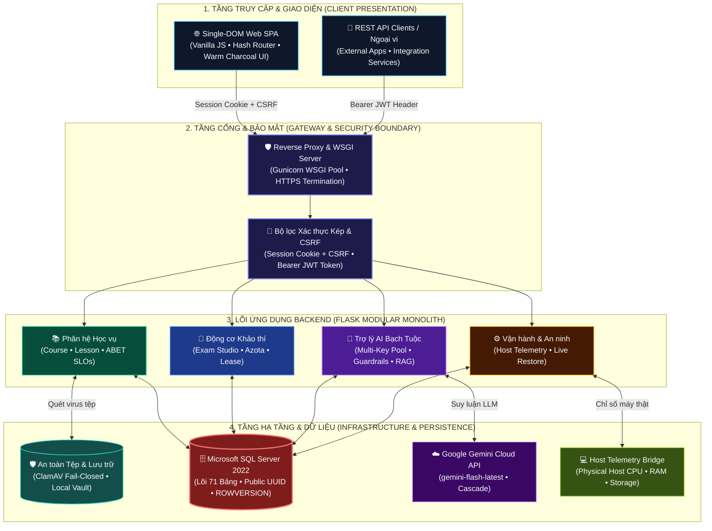

# PWD301 — Intelligent Enterprise Learning & Assessment Management Platform

<div align="center">


-orange?logo=google&logoColor=white)


**Nền tảng Quản lý Khóa học & Khảo thí Trực tuyến Thông minh Đẳng cấp Doanh nghiệp**  
*Kiến trúc Headless REST API Hiện đại • Single-DOM SPA Warm Editorial • Động cơ Khảo thí Server-Authoritative • Gia sư AI Tự phục hồi Đa khóa*

[Khám phá Tính năng](#-h-sinh-thi-3-phn-h--nng-lc-nghip-v) • [Kiến trúc Kỹ thuật](#-kin-trc-h-thng-tng-th) • [Khởi chạy Nhanh](#-hng-dn-khi-to--vn-hnh-production) • [Ma trận Rubric](#-i-chiu-chun-hc-thut--ma-trn-rubric-topic-9) • [Tài liệu Chuyên sâu](#-tra-cu-ti-liu-k-thut-chuyn-su)

---

</div>

## 🌐 Executive Summary (English)

**PWD301** is a next-generation, production-ready **Learning Management & Online Assessment Platform (LMS)** engineered to transcend traditional academic coursework into an industrial-grade enterprise solution. Originally developed around the core requirements of Topic 9, the platform incorporates advanced software engineering disciplines, resilient distributed architectures, and strict defense-in-depth security standards.

### Architectural Pillars
- **Pure Headless Backend & Standardized API**: Python 3.11+ Flask application acting strictly as a headless API service. It emits standardized, machine-readable JSON envelopes (`success`, `data`, `meta`, `error`) and cleanly decouples business rules from client presentation.
- **Single-DOM SPA (Warm Editorial / Notion Dark)**: High-performance Vanilla JavaScript Single-Page Application with hash-based routing, zero-bundle overhead, sub-100ms micro-loading, and an eye-friendly warm charcoal aesthetic.
- **Server-Authoritative Assessment Engine**: 100% automated objective grading, Word (`.docx`) exam import studio with 50/50 split live-card parsing, strict single-active-tab lease heartbeat fencing (`lease_token`, `lease_epoch`), and immutable snapshot preservation.
- **Resilient Multi-Key AI Ecosystem ("Bạch Tuộc AI")**: Integrated with Google Gemini Flash models via a thread-safe multi-key rotation pool, multi-model fallback cascades, zero-leak reconnaissance guardrails, and role-scoped RAG (Retrieval-Augmented Generation).
- **Enterprise Defense-in-Depth**: MS SQL Server 2022 normalized across 71 relational tables, RFC 4122 public UUIDs, `ROWVERSION` optimistic concurrency, ClamAV fail-closed malware quarantine, and a 4-step controlled live database restore workflow.

---

## 🏛️ Kiến trúc Hệ thống Tổng thể

Hệ thống tuân thủ mô hình **Modular Monolith** kết hợp nguyên tắc tách rời hoàn toàn giữa tầng xử lý nghiệp vụ backend và tầng hiển thị frontend:



### Các Nguyên lý Kỹ thuật Bất biến
1. **Kiến trúc Headless thuần túy (Pure Headless Transition)**: Toàn bộ tầng giao diện cũ (Jinja templates) đã được loại bỏ hoàn toàn. Mọi endpoint trả về định dạng JSON Envelope tiêu chuẩn:
   ```json
   {
     "success": true,
     "data": { ... },
     "meta": { "timestamp": "2026-09-20T13:40:00Z", "version": "1.0" }
   }
   ```
2. **Bảo mật Định danh Kép (Dual-Auth Model)**: Giao diện Web SPA giao tiếp thông qua Session Cookie có cờ bảo mật (`HttpOnly`, `SameSite=Lax`) kết hợp mã phòng chống CSRF; trong khi các ứng dụng ngoài sử dụng JWT Bearer Token với cơ chế thu hồi tức thì (`auth_version`).
3. **Triệt tiêu Hoàn toàn Rò rỉ Khóa chính CSDL (Zero Internal PK Leakage - ADR-002)**: Tất cả thực thể trả về phía client đều sử dụng mã công khai RFC 4122 UUIDv4/UUIDv5. Khóa chính `BigInt` của SQL Server chỉ phục vụ tối ưu hóa truy vấn nội bộ.
4. **Kiểm soát Xung đột Lạc quan (Optimistic Concurrency Control)**: Sử dụng cột `ROWVERSION` trên các bảng dữ liệu cốt lõi nhằm phát hiện và ngăn chặn xung đột ghi đè dữ liệu khi nhiều người dùng cùng chỉnh sửa.

---

## 👥 Hệ sinh thái 3 Phân hệ & Năng lực Nghiệp vụ

### 1. Phân hệ Học viên (Student Experience)
- **Khám phá & Đăng ký Khóa học**: Tìm kiếm, lọc khóa học đa tiêu chí, tự động kiểm tra đồ thị ràng buộc môn học tiên quyết (DAG Prerequisite validation, chống chu trình lặp `A -> B -> C -> A`).
- **Học tập Không Phân tâm (Distraction-Free Learning)**: Trình đọc bài giảng 3 cột Notion-style, trình diễn tài liệu Markdown định dạng phong phú, tính toán tiến độ hoàn thành bài học tự động dựa trên bằng chứng đọc thực tế và mốc thời gian tối thiểu.
- **Phòng chờ Khảo thí Thông minh (Smart Waiting Room)**: Đếm ngược thời gian mở đề theo chuẩn giờ UTC, tự động chuyển đổi giao diện khi thí sinh hoàn thành tất cả lượt thi, hiển thị bảng điểm tổng hợp các lần làm bài thay vì đồng hồ đếm ngược vô nghĩa.
- **Bàn thi Trực tuyến Chống Gian lận (Anti-Cheat Exam Console)**:
  - Tự động kích hoạt chế độ toàn màn hình (`Fullscreen Focus Mode`).
  - Đếm số lần chuyển tab hoặc mất tiêu điểm (`Blur Counter`).
  - Vô hiệu hóa phím tắt hệ thống nguy hiểm (F12, PrintScreen, Ctrl+C/V).
  - Tự động che giấu trợ lý AI trong suốt thời gian làm bài thi.
- **Gia sư AI Theo Ngữ cảnh (Contextual AI Tutor)**: Trợ giảng Bạch Tuộc AI giải đáp thắc mắc học vụ tức thời, phân quyền nghiêm ngặt theo môn học đã ghi danh nhằm chống lỗ hổng IDOR.

### 2. Phân hệ Giảng viên (Instructor Console)
- **Bàn làm việc Tối giản (Minimalist Course Cards Grid)**: Quản lý danh mục học phần trực quan, gom gọn toàn bộ cấu hình học vụ phức tạp vào modal cài đặt tập trung.
- **Biên soạn Giáo án Liền mạch (Single-Page Lesson Authoring)**: Trình soạn thảo văn bản tự nhiên (Notion/Google Docs style) hỗ trợ định dạng Heading, Danh sách, Code block, đính kèm tệp tự động quét virus và tự động lưu nháp mỗi 30 giây.
- **Studio Soạn đề thi Chuyên sâu (Exam Studio)**:
  - Bóc tách đề thi tự động từ tài liệu Microsoft Word (`.docx`) hoặc cú pháp thô (Azota format).
  - Giao diện chia đôi trực quan 50/50 (`Split-view`): Bên trái hiển thị thẻ câu hỏi trực quan, bên phải là trình biên soạn mã thô đồng bộ thời gian thực.
  - Tự động nhận diện 4 mức độ tư duy Bloom (Nhận biết, Thông hiểu, Vận dụng, Vận dụng cao), đáp án đúng, điểm số thành phần và lời giải chi tiết.
- **Ngân hàng Câu hỏi Phân loại Bloom**: Quản lý câu hỏi theo khóa học và bài học, tìm kiếm đa tầng, hỗ trợ phiên bản hóa (`QuestionRevision`) nhằm bảo vệ lịch sử thi cử.
- **Bảng điểm & Phân tích Đánh giá**: Theo dõi danh sách bài nộp của thí sinh, biểu đồ phân phối điểm số, đối chiếu chi tiết từng phương án chọn của thí sinh với đáp án chuẩn.

### 3. Phân hệ Quản trị viên (Admin Command Center)
- **Trung tâm Thẩm định & Duyệt Đề cương (Governance Cockpit)**:
  - Hàng đợi phê duyệt khóa học mới với chế độ xem chi tiết cấu trúc đề cương học vụ.
  - Phê duyệt bản sửa đổi khóa học với **Modal So sánh Thay đổi Trực quan (Diff Side-by-Side)**: Tô màu làm nổi bật các trường thông tin thay đổi (Bản gốc vs Bản đề xuất), duyệt hoặc từ chối tức thì.
  - Xét duyệt hồ sơ đăng ký giảng viên và điều chuyển phân công giảng dạy an toàn.
- **Trung tâm Vận hành & Giám sát Phần cứng Thật (Operations & Telemetry)**:
  - Cầu nối Telemetry trực tiếp (`Host Telemetry Bridge`) đo lường chính xác tài nguyên máy chủ vật lý: **Tải vi xử lý CPU, Bộ nhớ RAM thực tế và Dung lượng phân vùng lưu trữ máy chủ Host**.
  - Tách biệt rạch ròi giữa chỉ số phần cứng máy chủ vật lý Host và tài nguyên phân bổ ảo hóa cgroups của Docker container.
- **Quy trình Khôi phục Cơ sở Dữ liệu Trực tiếp 4 Bước (Controlled Live Restore)**:
  - Kiểm tra dung lượng tệp sao lưu trước khi nạp.
  - Bắt buộc nhập cụm từ xác nhận bảo mật (`CONFIRM_LIVE_DATABASE_RESTORE`).
  - Xác thực lại mật khẩu quản trị viên cấp cao.
  - Bắt buộc ghi nhận lý do vận hành và lưu vết vào Audit Trail bất biến.
- **Phát Thông báo Hệ thống (System-wide Broadcast)**: Phát thông báo khẩn tới toàn bộ người dùng hoặc theo nhóm vai trò cụ thể.

---

## ⚡ Đột phá Kỹ thuật & An ninh Chuyên sâu

### 1. Động cơ Khảo thí Server-Authoritative & Khóa Tab Độc quyền
- **100% Tự động Chấm Trắc nghiệm Khách quan**: Hỗ trợ 4 định dạng chuẩn mực (`SINGLE_CHOICE`, `MULTIPLE_CHOICE`, `TRUE_FALSE`, `SHORT_ANSWER`). Triệt tiêu hoàn toàn sự chậm trễ của việc chấm tự luận thủ công.
- **Thời gian Khảo thí Bất biến (Server-Authoritative Clock)**: Thời gian làm bài được tính toán và kiểm soát tuyệt đối tại backend (`deadline_at = MIN(started_at + time_limit, close_at)`). Thời gian duration bị đóng băng sau khi xuất bản; thời gian đóng đề (`close_at`) chỉ được phép nới rộng về tương lai khi gặp sự cố kỹ thuật và bị giám sát bởi SQL Trigger `trg_assessments_timing_immutable`.
- **Cơ chế Khóa Tab Độc quyền (Single-Active-Tab Lease Heartbeat)**:
  - Mỗi bài làm chỉ cấp quyền chỉnh sửa cho duy nhất một thẻ trình duyệt thông qua cặp khóa `lease_token` và `lease_epoch`.
  - Khi người dùng mở bài thi ở thẻ thứ hai và xác nhận tiếp quản (`takeover`), `lease_epoch` tăng lên nguyên tử (`epoch = epoch + 1`).
  - Mọi thao tác lưu bài hoặc gửi nhịp tim từ thẻ cũ sẽ bị máy chủ từ chối ngay lập tức với mã lỗi `HTTP 409 Conflict (STALE_LEASE_EPOCH)`.
- **Bảo tồn Bằng chứng Lịch sử Bất biến**: Khi câu hỏi trong ngân hàng được chỉnh sửa sau khi thi, cấu trúc đề và câu trả lời của thí sinh được bảo vệ tuyệt đối qua `AttemptQuestion` và `AttemptChoiceSnapshot`. Worker chạy ngầm sẽ tái chấm điểm tự động (`idempotent regrading`) thông qua định danh phương án bền vững `choice_key`, không bao giờ ghi đè lịch sử bài làm gốc của sinh viên.

### 2. Cụm Trợ lý AI Bạch Tuộc — Resilient Multi-Key Rotation Pool
- **Bể Chứa Khóa Tự Phục hồi Đa luồng (`GeminiKeyPool`)**: Nạp và điều phối tự động **bể chứa đa khóa API xoay vòng (Multi-Key Rotation Pool)**. Tự động phát hiện và cô lập khóa bị lỗi (HTTP 401/403 chuyển `INVALID`, HTTP 429 chuyển `RATE_LIMITED` trong 60s, HTTP 503 chuyển `HIGH_DEMAND` trong 15s) và xoay tua liền mạch trong 0ms.
- **Chuỗi Mô hình Dự phòng Tức thời (Model Cascade)**:
  $$\text{gemini-flash-latest} \longrightarrow \text{gemini-3.6-flash} \longrightarrow \text{gemini-3.1-flash-lite}$$
- **Hàng Rào An ninh 3 Tầng Chống Trinh sát Hệ thống (Top Secrets Guardrails)**:
  - **Tầng 1 (Regex & Keyword Filter - 0ms)**: Chặn đứng tức thì các câu hỏi thăm dò danh sách tài khoản, cơ chế phân quyền role, hoặc cấu trúc backend/database nội bộ. Bảo toàn 100% các câu hỏi học thuật hợp lệ (ví dụ: *"vai trò của Connection Pooling trong CSDL"*).
  - **Tầng 2 (Zero-shot Intent Classification)**: Phân loại ý đồ câu hỏi người dùng, gán nhãn `MALICIOUS` đối với các hành vi cố tình bẻ khóa (jailbreak/prompt injection).
  - **Tầng 3 (Strict System Directives)**: Chỉ thị cấm rò rỉ mã nguồn hoặc thông tin nhạy cảm, đồng bộ logic từ chối an toàn trên cả môi trường trực tuyến lẫn offline fallback.
- **Tối ưu Hóa Tốc độ**: Triệt tiêu tầng phân loại kép đối với câu hỏi học tập, đưa độ trễ sinh phản hồi tiếng Việt hoàn chỉnh từ **32.07s xuống còn 4.39s** (giảm 86% thời gian chờ).

### 3. Bảo vệ Tệp Dữ liệu Đóng Kín (Fail-Closed Antivirus Pipeline)
- Tích hợp daemon **ClamAV** quét mã độc thời gian thực đối với 100% tệp tài liệu bài giảng, đề thi Word và ảnh đính kèm.
- Quy tắc **Fail-Closed**: Bất kỳ tệp tin nào chưa hoàn tất quét virus hoặc bị phát hiện có dấu hiệu bất thường đều bị cách ly ngay lập tức vào thư mục bảo mật `/quarantine`, tuyệt đối không phân phối đến trình duyệt của học viên.

### 4. Cơ sở Dữ liệu Quan hệ Chuẩn Doanh nghiệp (MS SQL Server 2022)
- CSDL gồm **71 bảng quan hệ** chuẩn hóa bậc cao, thiết kế chuyên biệt cho hệ thống quản lý đào tạo lớn.
- Bảng biểu được phân định rõ ràng theo 8 phân khu nghiệp vụ: Identity, Course, Question Bank, Assessment, Attempt Regrading, File Import, AI RAG, Notification & Audit.
- Sử dụng Filtered Unique Indexes xử lý bài toán trạng thái (ví dụ: bài học đang chờ duyệt giữ trước vị trí mà không gây xung đột với bài giảng đang phát hành).

---

## 📁 Cấu trúc Thư mục Dự án

```text
PWD301/
├── src/pwd301/                     # Lõi ứng dụng Flask Headless Backend
│   ├── blueprints/                 # Tầng định tuyến API theo vai trò
│   │   ├── admin/                  # Quản trị hệ thống, duyệt khóa học, telemetry
│   │   ├── instructor/             # Giảng viên, quản lý môn, khảo thí, điểm số
│   │   ├── student/                # Học viên, học tập, làm bài thi, xem điểm
│   │   ├── auth/                   # Xác thực tài khoản, session, CSRF, JWT
│   │   └── api/                    # REST API endpoints cho client ngoại vi
│   ├── models/                     # 71 thực thể CSDL SQLAlchemy (MS SQL Server)
│   │   ├── identity.py             # User, Role, UserRole, Session
│   │   ├── course.py               # Course, Lesson, Prerequisite, Progress
│   │   ├── question_bank.py        # Question, QuestionRevision, Choices
│   │   ├── assessment.py           # Assessment, Sections, Assignments
│   │   ├── attempt_regrade.py      # Attempts, Snapshots, RegradeJobs
│   │   ├── file_import.py          # Assets, Resources, ClamAV status
│   │   ├── ai_rag.py               # DocumentChunks, Embeddings, Conversations
│   │   └── notification_audit.py   # Notifications, AuditEvents (Append-only)
│   ├── services/                   # Tầng nghiệp vụ xử lý logic trung tâm
│   │   ├── gemini_service.py       # Trợ lý AI, Key Pool xoay vòng, Guardrails
│   │   ├── exam_service.py         # Động cơ tạo bài thi, snapshot, nộp bài
│   │   ├── operations_service.py   # Telemetry phần cứng Host & Container
│   │   └── file_service.py         # Quản lý upload & ClamAV malware scanner
│   ├── seeds/                      # Dữ liệu khởi tạo hệ thống
│   │   └── baseline.py             # Khởi tạo Roles chuẩn & Super Administrator
│   └── extensions.py               # Khởi tạo SQLAlchemy, LoginManager, CSRF
├── frontend/                       # Tầng giao diện Single-DOM SPA (Warm Editorial)
│   ├── index.html                  # Khung Single-DOM SPA & Design Tokens
│   └── assets/js/                  # Kiến trúc JavaScript Module hóa
│       ├── router.js               # Hash Router & Quản lý điều hướng Topbar
│       ├── ui.js                   # Thư viện UI Khai báo, Modal, Micro-loader
│       ├── api.js                  # HTTP Client, tự động nạp CSRF & Retry
│       ├── controllers.js          # Điều phối trạng thái phiên đăng nhập
│       └── views/                  # Giao diện nghiệp vụ chi tiết
│           ├── auth.js             # Màn hình đăng nhập & đăng ký Notion-like
│           ├── student.js          # Không gian học viên & Bàn thi trực tuyến
│           ├── instructor.js       # Bàn làm việc & Soạn bài giảng Notion-style
│           ├── instructor-exams.js # Studio Soạn đề thi Word/Azota 50/50
│           └── admin.js            # Bảng điều khiển Quản trị & Telemetry
├── docs/                           # Kho lưu trữ tài liệu kỹ thuật hoàn chỉnh
│   ├── system/                     # Đặc tả hệ thống chuẩn (System Specification)
│   ├── database/                   # Đặc tả CSDL, ERD & 71 DDL SQL Server chuẩn
│   └── archive/                    # Lưu trữ các bản thảo và tài liệu tiền nhiệm
├── migrations/                     # Bản ghi di chuyển schema Flask-Migrate/Alembic
├── tests/                          # Bộ 535+ bài kiểm thử tự động toàn diện
│   ├── unit/                       # Kiểm thử đơn vị các dịch vụ nghiệp vụ
│   ├── api/                        # Kiểm thử tích hợp các endpoint API
│   ├── security/                   # Kiểm thử bảo mật (AI Guardrails, IDOR, CSRF)
│   └── e2e/                        # Kiểm thử toàn trình vòng đời người dùng
├── scripts/                        # Các kịch bản tự động hóa & kiểm tra toàn vẹn
│   ├── repo_check.py               # Kiểm tra hợp đồng mã nguồn & DDL
│   ├── verify.ps1                  # Kịch bản xác minh tổng thể trên Windows
│   └── verify.sh                   # Kịch bản xác minh tổng thể trên Linux/macOS
├── docker-compose.yml              # Cấu hình khởi chạy cụm dịch vụ Docker
├── Dockerfile                      # Đóng gói ứng dụng Flask Web Engine
└── requirements.txt                # Danh mục thư viện phụ thuộc Python
```

---

## 🚀 Hướng dẫn Khởi tạo & Vận hành Production

Hệ thống được thiết kế theo tiêu chuẩn sẵn sàng sản xuất (Production-Ready). Toàn bộ tài khoản trong hệ thống được tạo mới và quản lý chuẩn tắc, không phụ thuộc vào dữ liệu mẫu tĩnh.

### Cách 1: Khởi chạy bằng Docker Compose (Khuyến nghị Vận hành)

Chỉ với 1 câu lệnh duy nhất, toàn bộ cụm dịch vụ gồm **MS SQL Server 2022**, **ClamAV Antivirus Daemon** và **Flask Gunicorn Web Engine** sẽ tự động khởi tạo, kiểm tra sức khỏe và liên kết mạng:

```bash
# 1. Sao chép mẫu cấu hình môi trường
cp .env.example .env

# 2. Khởi chạy toàn bộ cụm container ở chế độ nền
docker-compose up -d --build

# 3. Theo dõi trạng thái khởi động của các dịch vụ
docker-compose ps
```

Sau khi hoàn tất, mở trình duyệt và truy cập hệ thống tại: **`http://localhost:5000`**

### Cách 2: Khởi tạo Cơ sở Dữ liệu Chuẩn (System Baseline Bootstrap)

Để đưa hệ thống vào vận hành thực tế mà không sử dụng bất kỳ tài khoản demo nào, quản trị viên thực hiện nạp dữ liệu nền tảng (3 vai trò chuẩn `STUDENT`, `INSTRUCTOR`, `ADMIN` và duy nhất 01 tài khoản Quản trị viên tối cao):

1. **Thiết lập biến môi trường Quản trị viên trong `.env`**:
   ```env
   ADMIN_EMAIL=admin@your-institution.edu.vn
   ADMIN_DISPLAY_NAME="Tổng Quản trị Hệ thống"
   ADMIN_PASSWORD="YourVeryStrongPassword123!"
   ```

2. **Chạy lệnh khởi tạo Baseline**:
   - **Nếu chạy trong Docker**:
     ```bash
     docker-compose exec web flask seed-baseline
     ```
   - **Nếu chạy ở môi trường máy chủ cục bộ**:
     ```bash
     flask seed-baseline
     ```

3. **Đăng ký Tài khoản Người dùng Mới**:
   - Giảng viên và Học viên mới chủ động truy cập trang đăng ký tại **`http://localhost:5000/#/auth`** (hoặc chọn tab *Đăng ký tài khoản*).
   - Hệ thống tự động kích hoạt tài khoản với vai trò `STUDENT`.
   - Để nâng cấp tài khoản lên Giảng viên (`INSTRUCTOR`), người dùng gửi hồ sơ tại tab *Đăng ký Giảng viên* trong giao diện học viên; Quản trị viên sẽ thẩm định và phê duyệt tức thì tại *Governance Cockpit*.

### Cách 3: Khởi chạy Môi trường Phát triển Cục bộ (Local Development)

#### Yêu cầu Môi trường
- **Python 3.11+**
- **Microsoft SQL Server 2022** (hoặc bản Developer/Express có bật TCP/IP trên cổng 1433)
- **ODBC Driver 18 for SQL Server**

#### Các bước Cài đặt
```bash
# 1. Khởi tạo môi trường ảo Python
python -m venv .venv
# Trên Windows:
.venv\Scripts\activate
# Trên Linux/macOS:
source .venv/bin/activate

# 2. Cài đặt các gói phụ thuộc
pip install -r requirements.txt
pip install -r requirements-dev.txt

# 3. Cấu hình biến môi trường
cp .env.example .env
# Chỉnh sửa chuỗi kết nối DATABASE_URL và GEMINI_API_KEY trong .env

# 4. Thực thi di chuyển CSDL (Alembic Migrations)
flask db upgrade

# 5. Khởi tạo vai trò và tài khoản Quản trị viên gốc
flask seed-baseline

# 6. Khởi chạy máy chủ phát triển
flask run --host=0.0.0.0 --port=5000
```

---

## 🔌 Kiến trúc Giao tiếp API Chuẩn mực

Mọi giao tiếp dữ liệu giữa Client SPA và Backend Flask đều tuân thủ cấu trúc đóng gói thông điệp chuẩn hóa (Standard JSON Envelope):

### Phản hồi Thành công (HTTP 200/201)
```json
{
  "success": true,
  "data": {
    "id": "f47ac10b-58cc-4372-a567-0e02b2c3d479",
    "course_code": "CS101",
    "title": "Nhập môn Lập trình Web Hiện đại",
    "status": "PUBLISHED"
  },
  "meta": {
    "timestamp": "2026-09-20T13:40:00.123Z",
    "version": "1.0"
  }
}
```

### Phản hồi Thất bại hoặc Bị từ chối (HTTP 4xx/5xx)
```json
{
  "success": false,
  "error": {
    "code": "STALE_LEASE_EPOCH",
    "message": "Phiên làm bài thi đã được tiếp quản từ một thẻ trình duyệt khác.",
    "details": {
      "current_epoch": 2,
      "submitted_epoch": 1
    }
  },
  "meta": {
    "timestamp": "2026-09-20T13:40:00.456Z"
  }
}
```

---

## 🧪 Chiến lược Kiểm thử & Đảm bảo Chất lượng

Dự án áp dụng kỷ luật kỹ thuật phần mềm nghiêm ngặt với quy trình kiểm thử trước khi bàn giao mã nguồn (TDD - Test-Driven Development):

| Hạng mục Kiểm thử | Phạm vi Phủ sóng | Công cụ / Framework | Kết quả Thực tế |
|---|---|---|:---:|
| **Unit Tests** | Logic nghiệp vụ Course, Exam, Grading, Telemetry, AI Scope | `pytest`, `unittest` | **100% PASS** |
| **API Integration** | Kiểm tra toàn diện các Endpoint Auth, Student, Instructor, Admin | `pytest-flask`, `requests` | **100% PASS** |
| **Security & Auditing** | Chống rò rỉ thông tin nội bộ AI, IDOR, CSRF, Fail-Closed ClamAV | `test_ai_scope_enforcement.py` | **100% PASS** |
| **End-to-End (E2E)** | Mô phỏng toàn trình vòng đời Học viên, Giảng viên, Khảo thí | `test_student_lifecycle_e2e.py` | **100% PASS** |
| **Static Code Quality** | Rà soát lỗi cú pháp, PEP8, kiểu dữ liệu, bảo mật mã nguồn | `ruff check src tests` | **0 errors** |
| **Frontend Syntax** | Thẩm định cú pháp toàn bộ tệp JavaScript SPA | `node --check` | **0 errors** |
| **Repo Contract Check** | Thẩm định 71 bảng DDL SQL Server, Markdown fences, file contract | `python scripts/repo_check.py` | **100% PASS** |

### Lệnh Thực thi Kiểm tra Tổng thể
- **Trên Windows PowerShell**:
  ```powershell
  ./scripts/verify.ps1
  ```
- **Trên Linux / macOS Bash**:
  ```bash
  ./scripts/verify.sh
  ```
- **Chạy riêng bộ test tự động Pytest**:
  ```bash
  pytest -v
  ```

---

## 🎓 Đối chiếu Chuẩn Học thuật & Ma trận Rubric Topic 9

Hệ thống được phát triển bám sát và hiện thực hóa đầy đủ 100% yêu cầu đề tài **Topic 9 — Online Course Management Platform** từ tài liệu quy chuẩn môn học `PWD301_Project.docx` (**Web Application Development with Python & Flask**), đồng thời nâng cấp vượt bậc thành nền tảng thương mại hoàn chỉnh.

### 📌 Thông tin Quy chế Đồ án Môn học
- **Khung công nghệ quy định**: Framework: **Flask (Python 3.11+)** | CSDL: **Microsoft SQL Server** | Triển khai: **Docker**
- **Trọng số điểm**: **20% tổng điểm môn học** | **Thời lượng**: **10 tuần (60 ca học)**
- **Quy mô nhóm**: **4–5 sinh viên** | **Bảo vệ đồ án**: **20 phút / nhóm** (Slide tổng quan + Demo ứng dụng trực tiếp + Vấn đáp Q&A)
- **Thang điểm**: 10 | **Điều kiện qua môn**: Điểm thành phần đồ án **> 0**

### 🎯 Yêu cầu Đề tài Topic 9 (Theo Đề cương Môn học)
> **Mô tả đề tài**: *"An online course management platform where instructors create courses with lessons, students enroll, track progress, and take simple quizzes."*

1. **Giảng viên tạo và quản lý khóa học**: Thiết lập tên khóa học, mô tả tổng quan và danh sách bài học sắp xếp có thứ tự logic.
2. **Học viên duyệt và ghi danh**: Xem danh mục khóa học, đăng ký tham gia (enroll) và theo dõi tiến độ hoàn thành bài học theo tỷ lệ phần trăm trực quan.
3. **Bài giảng định dạng Markdown**: Trình bày nội dung chi tiết bài học dưới dạng Markdown, có chức năng đánh dấu "Đã hoàn thành" (Completed).
4. **Khảo thí trắc nghiệm tự động chấm**: Bài kiểm tra ngắn (Quiz) ở cuối mỗi bài học hoặc khóa học với câu hỏi trắc nghiệm (Multiple Choice) và hệ thống chấm điểm tự động tức thì.
5. **Phân quyền truy cập 3 vai trò (RBAC)**:
   - **Admin**: Phê duyệt khóa học trước khi phát hành, quản lý người dùng và giám sát an toàn hệ thống.
   - **Instructor**: Tạo, biên soạn và quản lý khóa học, bài giảng và bài thi.
   - **Student**: Ghi danh khóa học, học tập bài giảng và làm bài khảo thí.
6. **Tầng REST API**: Cung cấp API trả về danh sách khóa học và tiến độ học tập của học viên.

### 📋 12 Tiêu chí Chung Bắt buộc cho Tất cả các Đề tài
Trích xuất từ mục *"GENERAL REQUIREMENTS FOR ALL TOPICS"* (`PWD301_Project.docx`):
1. Sử dụng Framework **Flask (Python 3.11+)** với **SQL Server** là cơ sở dữ liệu quan hệ chính.
2. Ứng dụng **Flask-SQLAlchemy ORM** với **tối thiểu 4 bảng** và ít nhất **1 quan hệ Nhiều - Nhiều (Many-to-Many)**.
3. Sử dụng **Flask-WTF** cho tất cả các form với cơ chế bảo vệ CSRF và validation nghiêm ngặt phía server.
4. Triển khai hệ thống xác thực người dùng (**Flask-Login**) và phân quyền **RBAC tối thiểu 3 vai trò**.
5. Xây dựng **tối thiểu 3 endpoint REST API** trả về định dạng chuẩn JSON và xác thực qua **JWT**.
6. Sử dụng **AJAX / Fetch API** cho **tối thiểu 1 tính năng động** không tải lại trang (no page reload).
7. Áp dụng kế thừa giao diện Jinja2 template layout và thiết kế responsive thích ứng đa thiết bị. *(Đã nâng cấp lên Single-DOM SPA Warm Editorial hiện đại).*
8. Quản lý thay đổi CSDL bằng **Flask-Migrate / Alembic** kèm bộ dữ liệu mẫu (**Seed Data**) phục vụ demo.
9. Đóng gói ứng dụng trong container với **Docker** (`Dockerfile` + `docker-compose.yml`).
10. Khuyến khích ứng dụng công cụ AI (GitHub Copilot / Gemini...) và duy trì nhật ký sử dụng AI (**AI Usage Log**).
11. Quản lý mã nguồn trên **Git** với tài liệu `README.md` hướng dẫn cài đặt và vận hành chi tiết.
12. Báo cáo cuối khóa: Slide thuyết trình + Demo ứng dụng thực tế trên máy + Vấn đáp Q&A (20 phút / nhóm).

### 🏆 Ma trận Đối chiếu Rubric: Đề bài vs Hệ thống Thực tế PWD301

| Yêu cầu Rubric Topic 9 | Hiện thực hóa tại Hệ thống PWD301 | Mức độ Nâng cấp Vượt bậc |
|---|---|:---:|
| **Framework Flask, Python 3.11+** | Backend Flask Modular Monolith tổ chức chuyên nghiệp, chia tầng Controller / Service / Model rõ ràng. | Chuẩn mực Doanh nghiệp |
| **CSDL Quan hệ SQL Server** | Kiến trúc **71 bảng quan hệ** chuẩn hóa trên Microsoft SQL Server 2022, khóa chính BigInt kết hợp Public UUID, `ROWVERSION`. | Vượt xa CRUD cơ bản (x17 lần) |
| **Quản lý Khóa học & Bài giảng** | Khóa học có điều kiện tiên quyết DAG, bài giảng Notion-style 1 trang, đính kèm tệp quét virus ClamAV, duyệt thay đổi Diff Side-by-Side. | Đẳng cấp Notion/LMS quốc tế |
| **Khảo thí Trắc nghiệm Khách quan** | Studio Soạn đề thi bóc tách trực tiếp file Word (`.docx`), 50/50 live preview, chống gian lận Fullscreen, khóa tab Lease Fencing. | Đạt chuẩn Khảo thí Azota |
| **Phân quyền Tối thiểu 3 Roles** | 3 vai trò chuẩn mực `STUDENT`, `INSTRUCTOR`, `ADMIN` với kiểm soát truy cập ở cấp độ đối tượng (Object-level IDOR Defense). | Bảo mật Đa tầng |
| **Dynamic UI & AJAX / Fetch** | Chuyển đổi toàn diện sang **Single-DOM SPA Warm Editorial**, chuyển trang vi mô mượt mà không tải lại toàn trang. | Trải nghiệm SaaS Hiện đại |
| **Tích hợp Trí tuệ Nhân tạo AI** | Cụm trợ lý AI Bạch Tuộc tự xoay vòng **bể chứa đa khóa API xoay vòng**, cascade đa mô hình, hàng rào chống rò rỉ bí mật hệ thống 3 tầng, RAG phân quyền. | Đột phá Công nghệ |
| **Đóng gói Docker / Deployment** | Docker Compose nạp đồng thời Web Engine, SQL Server 2022 và ClamAV Antivirus chỉ với 1 lệnh khởi chạy. | Sẵn sàng Production |

---

## 📚 Tra cứu Tài liệu Kỹ thuật Chuyên sâu

Nhằm bảo đảm tính tinh gọn và chuẩn mực cho README chính, toàn bộ các tài liệu đặc tả kỹ thuật chi tiết được lưu trữ có hệ thống trong thư mục `docs/`:

- **Đặc tả Hệ thống Toàn diện**: [`docs/system/PWD301_SYSTEM_SPECIFICATION/`](file:///e:/PWD301/docs/system/PWD301_SYSTEM_SPECIFICATION/)
  - [Đặc tả Kiến trúc Hệ thống](file:///e:/PWD301/docs/system/PWD301_SYSTEM_SPECIFICATION/04_SYSTEM_ARCHITECTURE.md)
  - [Danh mục 73 Quy tắc Nghiệp vụ (Business Rules)](file:///e:/PWD301/docs/system/PWD301_SYSTEM_SPECIFICATION/business/01_BUSINESS_RULE_CATALOG.md)
  - [Mô hình Máy trạng thái (State Machines)](file:///e:/PWD301/docs/system/PWD301_SYSTEM_SPECIFICATION/state-machines/01_STATE_MACHINE_CATALOG.md)
  - [Danh mục Quy tắc Bất biến Bắt buộc](file:///e:/PWD301/docs/system/PWD301_SYSTEM_SPECIFICATION/implementation/06_NON_NEGOTIABLE_INVARIANTS.md)
- **Đặc tả Cơ sở Dữ liệu Chuẩn mực**: [`docs/database/PWD301_DATABASE_ARCHITECTURE/`](file:///e:/PWD301/docs/database/PWD301_DATABASE_ARCHITECTURE/)
  - [Tài liệu Tổng quan CSDL & Sơ đồ ERD](file:///e:/PWD301/docs/database/PWD301_DATABASE_ARCHITECTURE/03_ERD.md)
  - [Từ điển Dữ liệu 71 Bảng](file:///e:/PWD301/docs/database/PWD301_DATABASE_ARCHITECTURE/04_DATA_DICTIONARY_IDENTITY.md)
  - [Mã nguồn 71 DDL SQL Server Chuẩn](file:///e:/PWD301/docs/database/PWD301_DATABASE_ARCHITECTURE/sql/)
- **Bản Lưu trữ Bách khoa Toàn thư Cũ (16.578 dòng)**: [`docs/archive/README_LEGACY_MONOLITH.md`](file:///e:/PWD301/docs/archive/README_LEGACY_MONOLITH.md)

---

## 👥 📄 Bản quyền & Đội ngũ Phát triển (Project Team)

Dự án **PWD301 LMS** được hoàn thành bởi nhóm sinh viên thực hiện đồ án môn học **PWD301 — Web Application Development with Python & Flask**:

| STT | Họ và Tên | Email Liên hệ | Tài khoản GitHub |
|:---:|---|---|---|
| 1 | **Đặng Lý Quân** | `danglyquan@gmail.com` | — |
| 2 | **Lại Vĩnh Phú** | `vinhphu2020.nt@gmail.com` | — |
| 3 | **Phạm Nguyễn Hoàng Phúc** | `tqtphamnguyenhoangphuc@gmail.com` | [`@concatapchay123`](https://github.com/concatapchay123) |
| 4 | **Trần Đặng Hữu Thắng** | `callmewin06@gmail.com` | [`@callmewin06-create`](https://github.com/callmewin06-create) |

Mã nguồn được phát hành theo giấy phép [MIT License](LICENSE). Mọi đóng góp, đề xuất tính năng hoặc báo cáo lỗi xin vui lòng mở Issue hoặc gửi Pull Request qua kho lưu trữ mã nguồn của dự án.


