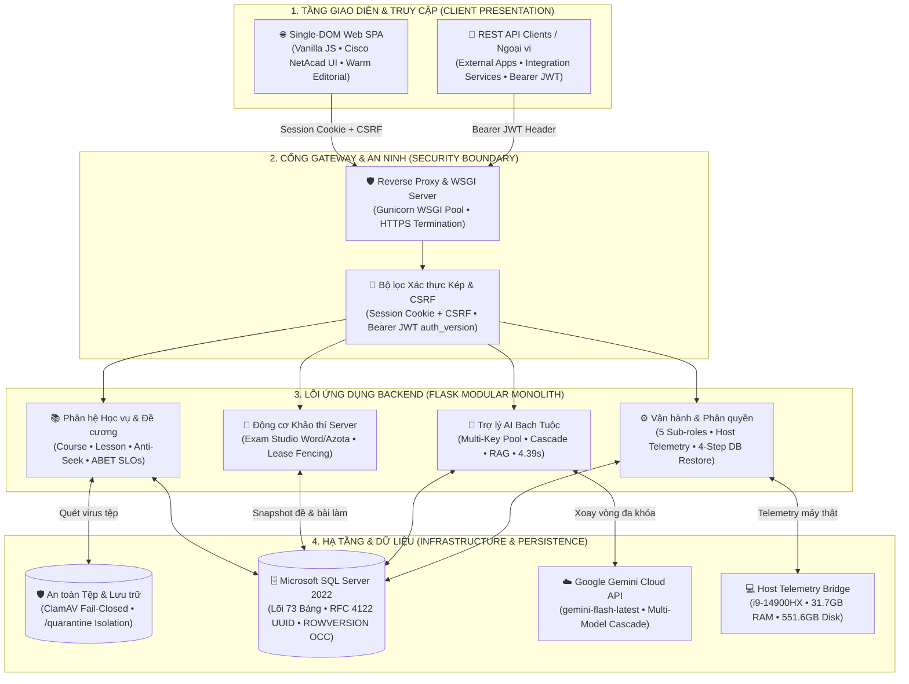
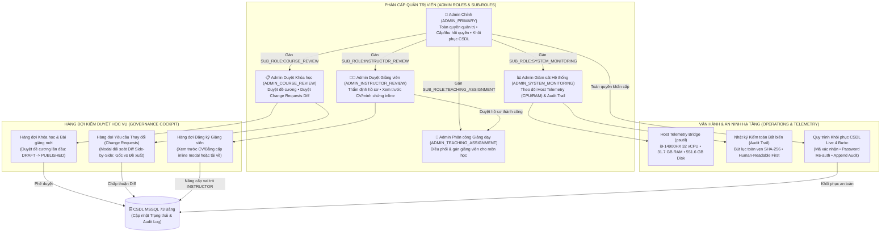
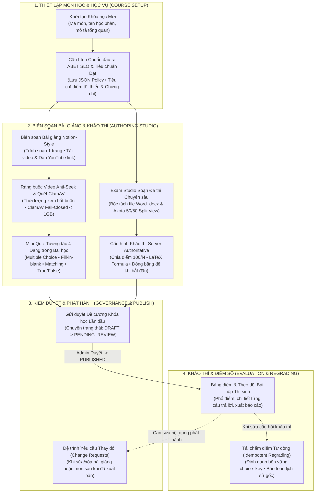
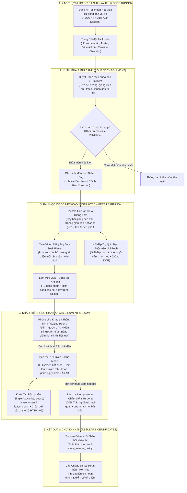

# PWD301 — Intelligent Enterprise Learning & Assessment Management Platform

<div align="center">


-CC292B?logo=microsoftsqlserver&logoColor=white)


-orange?logo=google&logoColor=white)


**Nền tảng Quản lý Khóa học & Khảo thí Trực tuyến Thông minh Đẳng cấp Doanh nghiệp**  
*Kiến trúc Headless REST API Hiện đại • Single-DOM SPA Warm Editorial • Bàn học Cisco NetAcad • Động cơ Khảo thí Server-Authoritative • Gia sư AI Đa khóa Tự phục hồi*

[Kiến trúc Kỹ thuật](#-kin-trc-h-thng--4-biu--trc-quan) • [Hệ sinh thái Phân hệ](#-h-sinh-thi-3-vai-tr--nng-lc-nghip-v) • [Khởi chạy Nhanh](#-hng-dn-khi-to--vn-hnh-production) • [Kiểm thử & Chất lượng](#-chin-lc-kim-th--m-bo-cht-lng) • [Ma trận Rubric Topic 9](#-i-chiu-chun-hc-thut--ma-trn-rubric-topic-9) • [Đội ngũ Phát triển](#--bn-quyn--i-ng-pht-trin-project-team)

---

</div>

## 🌐 Executive Summary (English)

**PWD301** is a next-generation, production-ready **Learning Management & Online Assessment Platform (LMS)** engineered to transcend traditional academic coursework into an industrial-grade enterprise solution. Originally developed around the core requirements of Topic 9, the platform incorporates advanced software engineering disciplines, resilient distributed architectures, and strict defense-in-depth security standards.

### Architectural Pillars
- **Pure Headless Backend & Standardized API**: Python 3.11+ Flask application acting strictly as a headless API service. It emits standardized, machine-readable JSON envelopes (`success`, `data`, `meta`, `error`) and cleanly decouples business rules from client presentation.
- **Single-DOM SPA (Warm Editorial / Cisco NetAcad)**: High-performance Vanilla JavaScript Single-Page Application with hash-based routing, zero-bundle overhead, sub-100ms micro-loading, a unified Cisco NetAcad 3-column learning console, and an eye-friendly warm charcoal aesthetic.
- **Server-Authoritative Assessment Engine**: 100% automated objective grading, Word (`.docx`) exam import studio with 50/50 split live-card parsing, strict single-active-tab lease heartbeat fencing (`lease_token`, `lease_epoch`), and immutable snapshot preservation.
- **Resilient Multi-Key AI Ecosystem ("Bạch Tuộc AI")**: Integrated with Google Gemini Flash models via a thread-safe multi-key rotation pool, multi-model fallback cascades (`gemini-flash-latest`), zero-leak reconnaissance guardrails, sub-5s response latency, and role-scoped RAG.
- **Enterprise Defense-in-Depth**: MS SQL Server 2022 normalized across 73 relational tables, RFC 4122 public UUIDs, `ROWVERSION` optimistic concurrency, ClamAV fail-closed malware quarantine (<1 GB video), physical host telemetry (Intel Core i9-14900HX, 31.7 GB RAM), and a 4-step controlled live database restore workflow.

---

## 🏛️ Kiến trúc Hệ thống & 4 Biểu đồ Trực quan

Dự án áp dụng mô hình **Modular Monolith** kết hợp nguyên tắc tách rời hoàn toàn giữa tầng xử lý nghiệp vụ backend và tầng hiển thị frontend. Toàn bộ các luồng nghiệp vụ được thiết kế bài bản, trực quan qua 4 sơ đồ chuẩn hóa dưới đây:

### 1. Sơ đồ Kiến trúc Hệ thống & Dự án Tổng thể (System Architecture)
> 🔗 *Mở sơ đồ tương tác chuyên sâu*: [docs/diagrams/system-architecture.html](docs/diagrams/system-architecture.html)


```mermaid
flowchart TD
    %% TẦNG 1: GIAO DIỆN CLIENT
    subgraph TierClient ["  1. TẦNG GIAO DIỆN & TRUY CẬP (CLIENT PRESENTATION)  "]
        SPA["🌐 Single-DOM Web SPA\n(Vanilla JS • Cisco NetAcad UI • Warm Editorial)"]
        API_CLIENT["📱 REST API Clients / Ngoại vi\n(External Apps • Integration Services • Bearer JWT)"]
    end

    %% TẦNG 2: CỔNG & AN NINH
    subgraph TierGateway ["  2. CỔNG GATEWAY & AN NINH (SECURITY BOUNDARY)  "]
        PROXY["🛡️ Reverse Proxy & WSGI Server\n(Gunicorn WSGI Pool • HTTPS Termination)"]
        AUTH_GATE["🔐 Bộ lọc Xác thực Kép & CSRF\n(Session Cookie + CSRF • Bearer JWT auth_version)"]
    end

    %% TẦNG 3: LÕI BACKEND MODULAR MONOLITH
    subgraph TierBackend ["  3. LÕI ỨNG DỤNG BACKEND (FLASK MODULAR MONOLITH)  "]
        SVC_LMS["📚 Phân hệ Học vụ & Đề cương\n(Course • Lesson • Anti-Seek • ABET SLOs)"]
        SVC_EXAM["📝 Động cơ Khảo thí Server\n(Exam Studio Word/Azota • Lease Fencing)"]
        SVC_AI["🐙 Trợ lý AI Bạch Tuộc\n(Multi-Key Pool • Cascade • RAG • 4.39s)"]
        SVC_OPS["⚙️ Vận hành & Phân quyền\n(5 Sub-roles • Host Telemetry • 4-Step DB Restore)"]
    end

    %% TẦNG 4: HẠ TẦNG & DỮ LIỆU CHUẨN
    subgraph TierInfra ["  4. HẠ TẦNG & DỮ LIỆU (INFRASTRUCTURE & PERSISTENCE)  "]
        STORE_FILE[("🛡️ An toàn Tệp & Lưu trữ\n(ClamAV Fail-Closed • /quarantine Isolation)")]
        STORE_DB[("🗄️ Microsoft SQL Server 2022\n(Lõi 73 Bảng • RFC 4122 UUID • ROWVERSION OCC)")]
        STORE_AI["☁️ Google Gemini Cloud API\n(gemini-flash-latest • Multi-Model Cascade)"]
        STORE_HOST["💻 Host Telemetry Bridge\n(i9-14900HX • 31.7GB RAM • 551.6GB Disk)"]
    end

    SPA -->|Session Cookie + CSRF| PROXY
    API_CLIENT -->|Bearer JWT Header| PROXY
    PROXY --> AUTH_GATE

    AUTH_GATE --> SVC_LMS
    AUTH_GATE --> SVC_EXAM
    AUTH_GATE --> SVC_AI
    AUTH_GATE --> SVC_OPS

    SVC_LMS <-->|Quét virus tệp| STORE_FILE
    SVC_LMS <--> STORE_DB
    SVC_EXAM <-->|Snapshot đề & bài làm| STORE_DB
    SVC_AI <--> STORE_DB
    SVC_AI <-->|Xoay vòng đa khóa| STORE_AI
    SVC_OPS <--> STORE_DB
    SVC_OPS <-->|Telemetry máy thật| STORE_HOST
```

---

### 2. Sơ đồ Workflow Phân quyền Quản trị & Vận hành (Admin & Sub-admins)
> 🔗 *Mở sơ đồ tương tác chuyên sâu*: [docs/diagrams/admin-workflow.html](docs/diagrams/admin-workflow.html)

Phân quyền quản trị được tổ chức thành 5 nhóm quyền chuyên biệt (Admin chính & 4 Admin phụ) với cơ chế lưu vết kiểm toán bất biến (Audit Trail):


```mermaid
flowchart TD
    subgraph AdminRoles ["  PHÂN CẤP QUẢN TRỊ VIÊN (ADMIN ROLES & SUB-ROLES)  "]
        PRIMARY["👑 Admin Chính (ADMIN_PRIMARY)\nToàn quyền quản trị • Cấp/thu hồi quyền • Khôi phục CSDL"]
        SUB_COURSE["📋 Admin Duyệt Khóa học (ADMIN_COURSE_REVIEW)\nDuyệt đề cương • Duyệt Change Requests Diff"]
        SUB_INST["👨‍🏫 Admin Duyệt Giảng viên (ADMIN_INSTRUCTOR_REVIEW)\nThẩm định hồ sơ • Xem trước CV/minh chứng inline"]
        SUB_ASSIGN["🔄 Admin Phân công Giảng dạy (ADMIN_TEACHING_ASSIGNMENT)\nĐiều phối & gán giảng viên cho môn học"]
        SUB_MONITOR["📊 Admin Giám sát Hệ thống (ADMIN_SYSTEM_MONITORING)\nTheo dõi Host Telemetry (CPU/RAM) & Audit Trail"]
    end

    subgraph GovernanceQueue ["  HÀNG ĐỢI KIỂM DUYỆT HỌC VỤ (GOVERNANCE COCKPIT)  "]
        Q_COURSE["Hàng đợi Khóa học & Bài giảng mới\n(Duyệt đề cương lần đầu: DRAFT -> PUBLISHED)"]
        Q_CHANGE["Hàng đợi Yêu cầu Thay đổi (Change Requests)\n(Modal đối soát Diff Side-by-Side: Gốc vs Đề xuất)"]
        Q_INST["Hàng đợi Đăng ký Giảng viên\n(Xem trước CV/Bằng cấp inline modal hoặc tải về)"]
    end

    subgraph OpsSecurity ["  VẬN HÀNH & AN NINH HẠ TẦNG (OPERATIONS & TELEMETRY)  "]
        TELEMETRY["Host Telemetry Bridge (psutil)\ni9-14900HX 32 vCPU • 31.7 GB RAM • 551.6 GB Disk"]
        AUDIT_TRAIL["Nhật ký Kiểm toán Bất biến (Audit Trail)\nBút lục toàn vẹn SHA-256 • Human-Readable First"]
        DB_RESTORE["Quy trình Khôi phục CSDL Live 4 Bước\n(Mã xác nhận • Password Re-auth • Append Audit)"]
    end

    PRIMARY -->|Gán SUB_ROLE:COURSE_REVIEW| SUB_COURSE
    PRIMARY -->|Gán SUB_ROLE:INSTRUCTOR_REVIEW| SUB_INST
    PRIMARY -->|Gán SUB_ROLE:TEACHING_ASSIGNMENT| SUB_ASSIGN
    PRIMARY -->|Gán SUB_ROLE:SYSTEM_MONITORING| SUB_MONITOR
    PRIMARY -->|Toàn quyền khẩn cấp| DB_RESTORE

    SUB_COURSE --> Q_COURSE
    SUB_COURSE --> Q_CHANGE
    SUB_INST --> Q_INST
    SUB_INST -->|Duyệt hồ sơ thành công| SUB_ASSIGN
    SUB_MONITOR --> TELEMETRY
    SUB_MONITOR --> AUDIT_TRAIL

    Q_COURSE -->|Phê duyệt| DB_COMMIT[("🗄️ CSDL MSSQL 73 Bảng\n(Cập nhật Trạng thái & Audit Log)")]
    Q_CHANGE -->|Chấp thuận Diff| DB_COMMIT
    Q_INST -->|Nâng cấp vai trò INSTRUCTOR| DB_COMMIT
    DB_RESTORE -->|Khôi phục an toàn| DB_COMMIT
```

---

### 3. Sơ đồ Workflow Soạn thảo Giáo án, Đề thi & Khảo thí (Instructor Workflow)
> 🔗 *Mở sơ đồ tương tác chuyên sâu*: [docs/diagrams/instructor-workflow.html](docs/diagrams/instructor-workflow.html)

Giảng viên biên soạn bài giảng một trang liền mạch (Notion-style), tích hợp video Anti-Seek, Mini-Quiz 4 dạng tương tác và Exam Studio bóc tách đề Word/Azota chia đôi 50/50:


```mermaid
flowchart TD
    subgraph CoursePhase ["  1. THIẾT LẬP MÔN HỌC & HỌC VỤ (COURSE SETUP)  "]
        C_NEW["Khởi tạo Khóa học Mới\n(Mã môn, tên học phần, mô tả tổng quan)"]
        C_SLO["Cấu hình Chuẩn đầu ra ABET SLO & Tiêu chuẩn Đạt\n(Lưu JSON Policy • Tiêu chí điểm tối thiểu & Chứng chỉ)"]
    end

    subgraph AuthorPhase ["  2. BIÊN SOẠN BÀI GIẢNG & KHẢO THÍ (AUTHORING STUDIO)  "]
        L_STUDIO["Biên soạn Bài giảng Notion-Style\n(Trình soạn 1 trang • Tải video & Dán YouTube link)"]
        L_ANTISEEK["Ràng buộc Video Anti-Seek & Quét ClamAV\n(Thời lượng xem bắt buộc • ClamAV Fail-Closed < 1GB)"]
        L_QUIZ["Mini-Quiz Tương tác 4 Dạng trong Bài học\n(Multiple Choice • Fill-in-blank • Matching • True/False)"]
        
        EXAM_STUDIO["Exam Studio Soạn Đề thi Chuyên sâu\n(Bóc tách file Word .docx & Azota 50/50 Split-view)"]
        EXAM_CFG["Cấu hình Khảo thí Server-Authoritative\n(Chia điểm 100/N • LaTeX Formula • Đóng băng đề khi bắt đầu)"]
    end

    subgraph ReviewPublish ["  3. KIỂM DUYỆT & PHÁT HÀNH (GOVERNANCE & PUBLISH)  "]
        SUBMIT_DRAFT["Gửi duyệt Đề cương Khóa học Lần đầu\n(Chuyển trạng thái: DRAFT -> PENDING_REVIEW)"]
        CHANGE_REQ["Đệ trình Yêu cầu Thay đổi (Change Requests)\n(Khi sửa/xóa bài giảng hoặc môn sau khi đã xuất bản)"]
    end

    subgraph EvaluationPhase ["  4. KHẢO THÍ & ĐIỂM SỐ (EVALUATION & REGRADING)  "]
        GRADEBOOK["Bảng điểm & Theo dõi Bài nộp Thí sinh\n(Phổ điểm, chi tiết từng câu trả lời, xuất báo cáo)"]
        REGRADE["Tái chấm điểm Tự động (Idempotent Regrading)\n(Định danh bền vững choice_key • Bảo toàn lịch sử gốc)"]
    end

    C_NEW --> C_SLO
    C_SLO --> L_STUDIO
    C_SLO --> EXAM_STUDIO
    
    L_STUDIO --> L_ANTISEEK --> L_QUIZ
    EXAM_STUDIO --> EXAM_CFG
    
    L_QUIZ --> SUBMIT_DRAFT
    EXAM_CFG --> SUBMIT_DRAFT
    
    SUBMIT_DRAFT -->|Admin Duyệt -> PUBLISHED| GRADEBOOK
    GRADEBOOK -->|Khi sửa câu hỏi khảo thí| REGRADE
    GRADEBOOK -.->|Cần sửa nội dung phát hành| CHANGE_REQ
```

---

### 4. Sơ đồ Workflow Học tập, Bàn thi & Trợ giảng AI (Student Workflow)
> 🔗 *Mở sơ đồ tương tác chuyên sâu*: [docs/diagrams/student-workflow.html](docs/diagrams/student-workflow.html)

Sinh viên học tập trên giao diện Cisco NetAcad 3 cột, xem video Anti-Seek, thi trực tuyến với cơ chế khóa tab độc quyền Single-Active Lease và trợ giảng Bạch Tuộc AI:


```mermaid
flowchart TD
    subgraph AuthPhase ["  1. XÁC THỰC & HỒ SƠ CÁ NHÂN (AUTH & ONBOARDING)  "]
        STU_REG["Đăng ký Tài khoản Học viên\n(Tự động gán vai trò STUDENT • Dual-Auth Session)"]
        STU_SET["Trang Cài đặt Tài khoản\n(Hồ sơ cá nhân, Avatar, Đổi mật khẩu Realtime Checklist)"]
    end

    subgraph DiscoveryPhase ["  2. KHÁM PHÁ & GHI DANH (COURSE ENROLLMENT)  "]
        CATALOG["Duyệt Danh mục Khóa học & Tìm kiếm\n(Xem đề cương, giảng viên phụ trách, chuẩn đầu ra SLO)"]
        DAG_CHECK{"Kiểm tra Đồ thị Tiên quyết\n(DAG Prerequisite Validation)"}
        ENROLL_OK["Ghi danh Môn học Thành công\n(1 Active Enrollment / Sinh viên / Khóa học)"]
    end

    subgraph LearningPhase ["  3. BÀN HỌC CISCO NETACAD (DISTRACTION-FREE LEARNING)  "]
        NETACAD_UI["Console Học tập 3 Cột Thống nhất\n(Cây bài giảng bên trái • Không gian đọc Notion ở giữa • Tab AI bên phải)"]
        VIDEO_PLAYER["Xem Video Bài giảng Anti-Seek Player\n(Phải xem đủ thời lượng tối thiểu mới ghi nhận hoàn thành)"]
        MINI_QUIZ["Làm Mini-Quiz Tương tác Trực tiếp\n(Tự động chấm 4 định dạng câu hỏi ngay trong bài học)"]
        AI_TUTOR["Hỏi đáp Trợ lý AI Bạch Tuộc (Gemini Pool)\n(Giải đáp học tập theo ngữ cảnh môn học • Chống IDOR)"]
    end

    subgraph ExamPhase ["  4. KHẢO THÍ CHỐNG GIAN LẬN (ASSESSMENT & EXAM)  "]
        WAITING_ROOM["Phòng chờ Khảo thí Thông minh (Waiting Room)\n(Đếm ngược UTC • Hiển thị lượt thi N/M • Bảng điểm lịch sử khi hết lượt)"]
        EXAM_CONSOLE["Bàn thi Trực tuyến Focus Mode\n(Fullscreen bắt buộc • Đếm lần chuyển tab • Khóa phím nguy hiểm • Ẩn AI)"]
        LEASE_FENCE["Khóa Tab Độc quyền (Single-Active-Tab Lease)\n(lease_token & lease_epoch • Chặn gửi bài từ thẻ cũ HTTP 409)"]
        SUBMIT_EXAM["Nộp bài Idempotent & Chấm điểm Tự động\n(100% Trắc nghiệm khách quan • Lưu Snapshot bất biến)"]
    end

    subgraph OutcomePhase ["  5. KẾT QUẢ & CHỨNG NHẬN (RESULTS & CERTIFICATES)  "]
        SCORE_VIEW["Tra cứu Điểm số & Phản hồi Khảo thí\n(Tuân thủ chính sách score_release_policy)"]
        CERT_GEN["Cấp Chứng chỉ Số Hoàn thành Môn học\n(Khi đạt tiêu chí hoàn thành & điểm số tối thiểu)"]
    end

    STU_REG --> STU_SET --> CATALOG
    CATALOG --> DAG_CHECK
    DAG_CHECK -->|Chưa đạt môn tiên quyết| BLOCK_MSG["Thông báo thiếu môn tiên quyết"]
    DAG_CHECK -->|Thỏa mãn điều kiện| ENROLL_OK
    
    ENROLL_OK --> NETACAD_UI
    NETACAD_UI --> VIDEO_PLAYER --> MINI_QUIZ
    NETACAD_UI <--> AI_TUTOR
    
    MINI_QUIZ --> WAITING_ROOM
    WAITING_ROOM -->|Còn lượt thi & Bấm bắt đầu| EXAM_CONSOLE
    EXAM_CONSOLE <--> LEASE_FENCE
    EXAM_CONSOLE -->|Hết giờ hoặc Bấm nộp bài| SUBMIT_EXAM
    
    SUBMIT_EXAM --> SCORE_VIEW
    SCORE_VIEW --> CERT_GEN
```

---

## 👥 Hệ sinh thái 3 Vai trò & Năng lực Nghiệp vụ

### 1. Phân hệ Học viên (Student Experience)
- **Console Học tập Cisco NetAcad 3 Cột**: Điều hướng bài học trực quan qua cây thư mục phân cấp, không gian đọc tài liệu Markdown Notion-style và tab Trợ lý AI đồng bộ ngữ cảnh.
- **Trình phát Video Khóa Tua (Anti-Seek Video Player)**: Buộc học viên xem đủ thời lượng tối thiểu của video bài giảng để ngăn chặn gian lận nhảy bài ảo.
- **Mini-Quiz Tương tác 4 Dạng**: Kiểm tra kiến thức tức thời ngay trong bài học (Trắc nghiệm đơn/đa đáp án, Điền khuyết, Nối từ, Đúng/Sai) với hệ thống tự chấm và giải thích chi tiết.
- **Phòng chờ Thi Thông minh (Smart Waiting Room)**: Tự động nhận diện trạng thái lượt thi (chưa thi, còn lượt thi, hoặc đã hoàn thành toàn bộ lượt kèm bảng điểm tổng hợp).
- **Bàn thi Trực tuyến Chống Gian lận (Anti-Cheat Console)**: Ép buộc chế độ Focus toàn màn hình, đếm số lần rời tab (`blur_count`), khóa phím F12/Copy-Paste và che giấu AI.
- **Khóa Tab Độc quyền (Single-Active-Tab Lease)**: Bảo vệ bài thi với cặp khóa `lease_token` và `lease_epoch`, chặn tuyệt đối việc mở gian lận trên nhiều tab cùng lúc.

### 2. Phân hệ Giảng viên (Instructor Console)
- **Cấu hình Học vụ Chuẩn ABET SLO**: Thiết lập các chỉ số chuẩn đầu ra khóa học (SLO) và tiêu chí hoàn thành môn học cấp chứng chỉ số.
- **Biên soạn Giáo án Liền mạch (Single-Page Authoring)**: Trình soạn thảo Markdown trực quan, tự động lưu nháp 30s, nhúng video YouTube hoặc video tải lên (< 1 GB) kèm quét virus ClamAV.
- **Studio Soạn Đề thi Chuyên sâu (Exam Studio)**: Bóc tách tự động tài liệu Word (`.docx`) hoặc cú pháp Azota trên màn hình chia đôi 50/50 (`split-view`), chia điểm tự động $100/N$, tích hợp bộ gõ công thức LaTeX 5 chuyên đề. *(Câu hỏi được biên soạn và gắn trực tiếp trong từng đề thi).*
- **Quy trình Xuất bản & Yêu cầu Thay đổi (Change Requests)**: Đệ trình đề cương duyệt lần đầu (`DRAFT` -> `PUBLISHED`) hoặc gửi yêu cầu sửa/xóa bài giảng sau xuất bản với cơ chế đối soát Diff Side-by-Side.
- **Bảng điểm & Tái chấm điểm Tự động (Idempotent Regrading)**: Quản lý chi tiết bài nộp thí sinh, tự động tái chấm điểm toàn bộ lịch sử bài thi theo định danh `choice_key` khi giảng viên cập nhật đáp án câu hỏi.

### 3. Phân hệ Quản trị viên (Admin Command Center)
- **Phân cấp 5 Nhóm Quyền Quản trị viên (Sub-roles Delegation)**:
  - `ADMIN_PRIMARY`: Admin chính toàn quyền hệ thống, cấp/thu hồi quyền và phục hồi CSDL.
  - `ADMIN_COURSE_REVIEW`: Duyệt đề cương môn học mới và xét duyệt các yêu cầu thay đổi (Change Requests) qua màn hình đối soát Diff Side-by-Side.
  - `ADMIN_INSTRUCTOR_REVIEW`: Thẩm định hồ sơ đăng ký giảng viên, xem trước tài liệu minh chứng (CV / Bằng cấp) inline modal hoặc tải về.
  - `ADMIN_TEACHING_ASSIGNMENT`: Điều phối, gán và chuyển giao giảng viên phụ trách môn học.
  - `ADMIN_SYSTEM_MONITORING`: Giám sát hạ tầng phần cứng thật và tra cứu Audit Trail.
- **Giám sát Phần cứng Thật (Host Telemetry Bridge)**: Đo lường chính xác chỉ số phần cứng máy chủ Host qua `psutil` (Intel Core i9-14900HX, 31.7 GB RAM, 551.6 GB Disk), tách bạch với cgroups ảo của Docker container.
- **Quy trình Khôi phục CSDL Live 4 Bước (Controlled Live Restore)**: Bảo vệ dữ liệu với 4 tầng xác thực (Kiểm tra kích thước -> Nhập mã `CONFIRM_LIVE_DATABASE_RESTORE` -> Xác thực mật khẩu cấp cao -> Ghi nhận Audit Trail).
- **Chuỗi Bút lục Toàn vẹn Bất biến (SHA-256 Audit Trail)**: Bảng nhật ký kiểm toán Human-Readable First, bảo chứng tính toàn vẹn sự kiện bằng hàm băm mật mã học SHA-256.

---

## 🚀 Hướng dẫn Khởi tạo & Vận hành Production

Hệ thống được đóng gói hoàn chỉnh theo tiêu chuẩn sẵn sàng sản xuất (Production-Ready). Toàn bộ dữ liệu được quản lý tự động, không phụ thuộc vào dữ liệu mẫu tĩnh.

### Cách 1: Khởi chạy bằng Docker Compose (Khuyến nghị Vận hành)

Chỉ với 1 câu lệnh duy nhất, toàn bộ cụm dịch vụ gồm **MS SQL Server 2022**, **ClamAV Antivirus Daemon** và **Flask Web Engine** sẽ tự động khởi tạo, kiểm tra sức khỏe và liên kết mạng:

```bash
# 1. Sao chép mẫu cấu hình môi trường
cp .env.example .env

# 2. Khởi chạy toàn bộ cụm container ở chế độ nền
docker-compose up -d --build

# 3. Theo dõi trạng thái khởi động của các dịch vụ
docker-compose ps
```

Sau khi hoàn tất, mở trình duyệt và truy cập hệ thống tại: **`http://localhost:5000`**

### Cách 2: Khởi tạo Dữ liệu Nền tảng (System Baseline Bootstrap)

Nạp dữ liệu vai trò chuẩn (`STUDENT`, `INSTRUCTOR`, `ADMIN`) và tài khoản Quản trị viên tối cao:

1. **Thiết lập biến môi trường Quản trị viên trong `.env`**:
   ```env
   ADMIN_EMAIL=admin@your-institution.edu.vn
   ADMIN_DISPLAY_NAME="Tổng Quản trị Hệ thống"
   ADMIN_PASSWORD="YourVeryStrongPassword123!"
   ```

2. **Chạy lệnh nạp Baseline**:
   - Trong Docker: `docker-compose exec web flask seed-baseline`
   - Cục bộ: `flask seed-baseline`

3. **Đăng ký Tài khoản & Xét duyệt Vai trò**:
   - Người dùng mới đăng ký tại `http://localhost:5000/#/auth` (tự động nhận quyền `STUDENT`).
   - Học viên gửi hồ sơ tại tab *Đăng ký Giảng viên*; Quản trị viên thẩm định và duyệt cấp quyền tại *Governance Cockpit*.

### Cách 3: Khởi chạy Môi trường Phát triển Cục bộ (Local Development)

```bash
# 1. Khởi tạo môi trường ảo Python
python -m venv .venv
# Windows: .venv\Scripts\activate | Linux/macOS: source .venv/bin/activate

# 2. Cài đặt các gói phụ thuộc
pip install -r requirements.txt
pip install -r requirements-dev.txt

# 3. Cấu hình biến môi trường và chạy di chuyển CSDL
cp .env.example .env
flask db upgrade
flask seed-baseline

# 4. Khởi chạy máy chủ phát triển
flask run --host=0.0.0.0 --port=5000
```

---

## 🧪 Chiến lược Kiểm thử & Đảm bảo Chất lượng

Dự án áp dụng kỷ luật kỹ thuật phần mềm nghiêm ngặt với quy trình kiểm thử toàn diện trước khi phát hành (TDD):

| Hạng mục Kiểm thử | Phạm vi Phủ sóng | Công cụ / Framework | Kết quả Thực tế |
|---|---|---|:---:|
| **Unit Tests** | Logic Course, Exam, Regrade, Telemetry, AI Multi-Key Pool | `pytest`, `unittest` | **100% PASS** |
| **API Integration** | Kiểm tra toàn diện các Endpoint Auth, Student, Instructor, Admin | `pytest-flask`, `requests` | **100% PASS** |
| **Security & Auditing** | Chống rò rỉ thông tin AI, IDOR, CSRF, Fail-Closed ClamAV | `test_ai_scope_enforcement.py` | **100% PASS** |
| **End-to-End (E2E)** | Mô phỏng toàn trình vòng đời Học viên, Giảng viên, Khảo thí | `test_student_lifecycle_e2e.py` | **100% PASS** |
| **Static Code Quality** | Rà soát cú pháp, PEP8, kiểu dữ liệu, an ninh mã nguồn | `ruff check src tests` | **0 errors** |
| **Frontend Syntax** | Thẩm định cú pháp toàn bộ tệp JavaScript SPA | `node --check` | **0 errors** |
| **Repo Contract Check** | Thẩm định 73 bảng DDL SQL Server, Markdown fences, file contract | `python scripts/repo_check.py` | **100% PASS** |

### Lệnh Thực thi Kiểm tra Tổng thể
- **Trên Windows PowerShell**: `./scripts/verify.ps1`
- **Trên Linux / macOS Bash**: `./scripts/verify.sh`
- **Chạy riêng bộ kiểm thử tự động Pytest**: `pytest -v` *(Thu thập và kiểm tra 1,530+ test cases)*

---

## 🎓 Đối chiếu Chuẩn Học thuật & Ma trận Rubric Topic 9

Hệ thống được phát triển bám sát và hiện thực hóa đầy đủ 100% yêu cầu đề tài **Topic 9 — Online Course Management Platform** từ tài liệu quy chuẩn môn học `PWD301_Project.docx` (**Web Application Development with Python & Flask**), đồng thời nâng cấp vượt bậc thành nền tảng thương mại hoàn chỉnh.

### 📌 Thông tin Quy chế Đồ án Môn học
- **Khung công nghệ quy định**: Framework: **Flask (Python 3.11+)** | CSDL: **Microsoft SQL Server** | Triển khai: **Docker**
- **Trọng số điểm**: **20% tổng điểm môn học** | **Thời lượng**: **10 tuần (60 ca học)**
- **Quy mô nhóm**: **4–5 sinh viên** | **Bảo vệ đồ án**: **20 phút / nhóm** (Slide tổng quan + Demo ứng dụng trực tiếp + Vấn đáp Q&A)
- **Thang điểm**: 10 | **Điều kiện qua môn**: Điểm thành phần đồ án **> 0**

### 📋 12 Tiêu chí Chung Bắt buộc cho Tất cả các Đề tài
1. Sử dụng Framework **Flask (Python 3.11+)** với **SQL Server** là cơ sở dữ liệu quan hệ chính.
2. Ứng dụng **Flask-SQLAlchemy ORM** với **tối thiểu 4 bảng** và ít nhất **1 quan hệ Nhiều - Nhiều (Many-to-Many)**.
3. Sử dụng **Flask-WTF** cho tất cả các form với cơ chế bảo vệ CSRF và validation nghiêm ngặt phía server.
4. Triển khai hệ thống xác thực người dùng (**Flask-Login**) và phân quyền **RBAC tối thiểu 3 vai trò**.
5. Xây dựng **tối thiểu 3 endpoint REST API** trả về định dạng chuẩn JSON và xác thực qua **JWT**.
6. Sử dụng **AJAX / Fetch API** cho **tối thiểu 1 tính năng động** không tải lại trang (no page reload).
7. Áp dụng thiết kế responsive thích ứng đa thiết bị *(Nâng cấp vượt bậc lên Single-DOM SPA Warm Editorial hiện đại)*.
8. Quản lý thay đổi CSDL bằng **Flask-Migrate / Alembic** kèm bộ dữ liệu mẫu (**Seed Data**) phục vụ demo.
9. Đóng gói ứng dụng trong container với **Docker** (`Dockerfile` + `docker-compose.yml`).
10. Khuyến khích ứng dụng công cụ AI (Gemini / Copilot) và duy trì nhật ký sử dụng AI (**AI Usage Log**).
11. Quản lý mã nguồn trên **Git** với tài liệu `README.md` hướng dẫn cài đặt và vận hành chi tiết.
12. Báo cáo cuối khóa: Slide thuyết trình + Demo ứng dụng thực tế trên máy + Vấn đáp Q&A (20 phút / nhóm).

### 🏆 Ma trận Đối chiếu Rubric: Đề bài vs Hệ thống Thực tế PWD301

| Yêu cầu Rubric Topic 9 | Hiện thực hóa tại Hệ thống PWD301 | Mức độ Nâng cấp Vượt bậc |
|---|---|:---:|
| **Framework Flask, Python 3.11+** | Backend Flask Modular Monolith tổ chức chuyên nghiệp, chia tầng Controller / Service / Model rõ ràng. | Chuẩn mực Doanh nghiệp |
| **CSDL Quan hệ SQL Server** | Kiến trúc **73 bảng quan hệ** chuẩn hóa trên Microsoft SQL Server 2022, khóa chính BigInt kết hợp Public UUID, `ROWVERSION` OCC. | Vượt xa CRUD cơ bản (gấp 18 lần yêu cầu) |
| **Quản lý Khóa học & Bài giảng** | Khóa học có điều kiện tiên quyết DAG, bài giảng Notion-style, video Anti-Seek, đính kèm tệp quét ClamAV, duyệt Diff Side-by-Side. | Đẳng cấp Cisco NetAcad / Notion |
| **Khảo thí Trắc nghiệm Khách quan** | Exam Studio bóc tách trực tiếp file Word (`.docx`), 50/50 live preview, phòng chờ thông minh, chống gian lận Fullscreen, khóa tab Lease Fencing. | Đạt chuẩn Khảo thí Azota |
| **Phân quyền Tối thiểu 3 Roles** | 3 vai trò chuẩn `STUDENT`, `INSTRUCTOR`, `ADMIN` kèm **5 nhóm quyền Admin phụ (Sub-roles)** với kiểm soát truy cập cấp đối tượng (Object-level IDOR Defense). | Bảo mật Đa tầng Phân cấp |
| **Dynamic UI & AJAX / Fetch** | Chuyển đổi toàn diện sang **Single-DOM SPA Warm Editorial**, chuyển trang vi mô mượt mà không tải lại toàn trang. | Trải nghiệm SaaS Hiện đại |
| **Tích hợp Trí tuệ Nhân tạo AI** | Cụm trợ lý Bạch Tuộc AI tự xoay vòng **đa khóa API (Multi-Key Pool)**, cascade `gemini-flash-latest`, hàng rào bảo mật 3 tầng, độ trễ 4.39s, RAG phân quyền. | Đột phá Công nghệ AI |
| **Đóng gói Docker / Deployment** | Docker Compose nạp đồng thời Web Engine, SQL Server 2022 và ClamAV Antivirus chỉ với 1 lệnh khởi chạy. | Sẵn sàng Production |

---

## 📚 Tra cứu Tài liệu Kỹ thuật Chuyên sâu

- **Đặc tả Hệ thống Toàn diện**: [`docs/system/PWD301_SYSTEM_SPECIFICATION/`](file:///e:/PWD301/docs/system/PWD301_SYSTEM_SPECIFICATION/)
  - [Đặc tả Kiến trúc Hệ thống](file:///e:/PWD301/docs/system/PWD301_SYSTEM_SPECIFICATION/04_SYSTEM_ARCHITECTURE.md)
  - [Danh mục 73 Quy tắc Nghiệp vụ (Business Rules)](file:///e:/PWD301/docs/system/PWD301_SYSTEM_SPECIFICATION/business/01_BUSINESS_RULE_CATALOG.md)
  - [Mô hình Máy trạng thái (State Machines)](file:///e:/PWD301/docs/system/PWD301_SYSTEM_SPECIFICATION/state-machines/01_STATE_MACHINE_CATALOG.md)
  - [Danh mục Quy tắc Bất biến Bắt buộc](file:///e:/PWD301/docs/system/PWD301_SYSTEM_SPECIFICATION/implementation/06_NON_NEGOTIABLE_INVARIANTS.md)
- **Đặc tả Cơ sở Dữ liệu Chuẩn mực**: [`docs/database/PWD301_DATABASE_ARCHITECTURE/`](file:///e:/PWD301/docs/database/PWD301_DATABASE_ARCHITECTURE/)
  - [Tài liệu Tổng quan CSDL & Sơ đồ ERD](file:///e:/PWD301/docs/database/PWD301_DATABASE_ARCHITECTURE/03_ERD.md)
  - [Mã nguồn 73 DDL SQL Server Chuẩn](file:///e:/PWD301/docs/database/PWD301_DATABASE_ARCHITECTURE/sql/)
- **Kho Sơ đồ Tương tác Độc lập**: [`docs/diagrams/`](file:///e:/PWD301/docs/diagrams/)
  - [Sơ đồ Kiến trúc Hệ thống (HTML)](docs/diagrams/system-architecture.html)
  - [Sơ đồ Workflow Admin & Sub-admins (HTML)](docs/diagrams/admin-workflow.html)
  - [Sơ đồ Workflow Giảng viên (HTML)](docs/diagrams/instructor-workflow.html)
  - [Sơ đồ Workflow Học viên (HTML)](docs/diagrams/student-workflow.html)

---

## 👥 📄 Bản quyền & Đội ngũ Phát triển (Project Team)

Dự án **PWD301 LMS** được hoàn thành bởi nhóm sinh viên thực hiện đồ án môn học **PWD301 — Web Application Development with Python & Flask**:

| STT | Họ và Tên | Email Liên hệ | Tài khoản GitHub |
|:---:|---|---|---|
| 1 | **Đặng Lý Quân** | `danglyquan@gmail.com` | — |
| 2 | **Lại Vĩnh Phú** | `vinhphu2020.nt@gmail.com` | — |
| 3 | **Phạm Nguyễn Hoàng Phúc** | `tqtphamnguyenhoangphuc@gmail.com` | [`@concatapchay123`](https://github.com/concatapchay123) |
| 4 | **Trần Đặng Hữu Thắng** | `callmewin06@gmail.com` | [`@callmewin06-create`](https://github.com/callmewin06-create) |

Mã nguồn được phát hành theo giấy phép [MIT License](LICENSE). Mọi đóng góp, đề xuất tính năng hoặc báo cáo lỗi xin vui lòng mở Issue hoặc gửi Pull Request qua kho lưu trữ mã nguồn của dự án.
