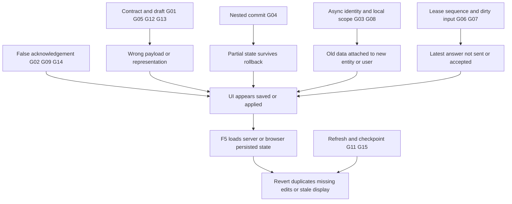

# System Data Synchronization Audit

**Date:** 2026-10-07 (Asia/Bangkok)  
**Workspace:** E:\PWD301  
**Snapshot HEAD:** 926fce6727c5dbdcf428b37ac143e8b46ac305e6  
**Mode:** READ → TRACE → VERIFY READ-ONLY → REPORT. No fixes/commit/migrations/live data writes.  
**Only deliverable:** SYSTEM_DATA_SYNCHRONIZATION_AUDIT.md

## 1. Executive Summary

Phát hiện **57 nhóm finding: 9 P0, 27 P1, 21 P2, 0 P3**, quy về **15 root categories**, trong đó 6 pattern xuyên module là G01/G02/G03/G04/G05/G08. Đây là số finding có evidence, không phải số runtime incidents, phần trăm CRUD hỏng hoặc số người bị ảnh hưởng.

“F5 mới thấy” thường do UI không refetch/reconcile authoritative state, đọc live version thay working draft, hoặc partial commit đã xảy ra nhưng error path giữ UI cũ. “F5 thì mất” có thể do input/browser draft chưa durable, request fail nhưng UI giữ success, serialization xóa URL/order, autosave sequence reset hoặc proposal bị supersede. Không có evidence SQL Server tự mất mọi write đã commit khi reload.

Ưu tiên: backup không chứa dữ liệu DB; nested commit phá atomicity; partial publish xóa draft; lesson response race/save nhầm ID; YouTube roundtrip mất URL; text/sequence sau F5; notification/ExamStore cross-account scope. P0 biểu thị rủi ro dữ liệu/privacy/recovery từ confirmed source/VM, không phải production corruption đã quan sát.

109 frontend tests hiện có pass, 0 fail/skipped; 10 JS syntax checks và 102 Python source/migration AST parses không lỗi. Những kết quả này không chứng minh toàn hệ thống persistence. Configured SQL Server đang migration b3c4d5e6f7a9, repo head d5e6f7a8b0c1, thiếu cột prerequisite approval và revision CHECK mới. Actual web-process DB target chưa xác minh.

## 2. Audit Scope

Đọc/scan 10 JS application files, 89 Python source files và 13 migrations; map 252 mutation route decorators trong 15 blueprints, 94 ApiClient mutation definitions /91 effective names (3 definitions shadowed). Aliases/session/JWT mirrors không phải 252 business features độc lập. Full source được syntactic/pattern scan; manual data-flow review theo action groups/high-risk paths, không claim mọi statement đã deep-review.

Evidence: **SOURCE** current source trace; **VM** actual code chạy trong bộ nhớ với fake dependencies, không HTTP/DB/filesystem writes; **LIVE SELECT** DB metadata/aggregates; **BROWSER READ** existing page/console. CONFIRMED SOURCE/VM khác với live workflow reproduced. NOT_REPRODUCED được dùng cho lifecycle mutation, SQL concurrency, F5/relogin/cross-role chưa chạy. React/query-library checks NOT_APPLICABLE.

Sources: AGENTS.md; tasks/CURRENT.md TASK-084/TASK-083; tasks/templates/TASK_TEMPLATE.md; README architecture/roles/testing; System Specification CODING_AGENT_START_HERE.md, business rule catalog, non-negotiable invariants, business03/04/05/07/08/09/10/11/13/14/15, relevant role UI flows, algorithms07/08/09/13; canonical Database Architecture README + SQL learning/question/assessment/attempt DDL. Docs hierarchy precedes code/CURRENT.

Graph report2026-10-05 from commit4b6c33f0 differs current HEAD; no wiki. Used navigation hints only, source rechecked; no graph regeneration/observer files. Memory/historical audits only guide inspection, not fresh bug/test/latency proof.

Out of scope execution: live mutation/F5/relogin, real SQL race, migration upgrade/downgrade, restore/drill, worker/ClamAV workload, Strix pentest, backend pytest/aggregate not proven side-effect-free. Only this requested report created; no product/config/dependency/env/DB changes.

## 3. System Architecture Overview

Flask headless API + SQLAlchemy + SQL Server; browser session/CSRF, REST JWT. Actual client is Vanilla JavaScript Single-DOM hash SPA under frontend/, not React/Next/Vue. Backend legacy template/static folders disabled; no Jinja assets added.

AppRouter owns auth role and notification caches; view closures own forms/active lesson/blocks/answer queues; ExamStore owns memory/localStorage draft; URL and DOM hold selection/inputs. No Redux/Zustand/TanStack Query/SWR/Apollo found. DB authoritative for domain data; persisted working draft/proposal and live published content deliberately differ.

Private storage holds file bytes; DB stores FileAsset/revision/blob/scan/resource references. Worker handles email/scans/import/regrade/jobs. Email delivery failure is distinct from primary mutation failure.

## 4. Current Data Flow

User action → DOM handler/closure draft → ApiClient → JSON/FormData + same-origin/CSRF → Flask auth/object/lifecycle validation → service/SQLAlchemy → DB commit/rollback → serializer → response handling → local patch/refetch/render → F5 restores server/browser persisted representation.

Breakpoints: shape/identity G01; acknowledgement G02; async identity G03; transaction G04; unified manifest G05; lease G06; sequence/debounce/events G07; browser durability/scope G08; operational truth G09; server authority G10; refetch/cache G11; routing scope G12; schema G13; read failure G14; checkpoint/dirty state G15. Detailed findings identify where each flow breaks.

| Feature | Frontend/API | Backend/DB | Cache/UI Result |
| --- | --- | --- | --- |
| Lesson Save | parse→serialize→PATCH | direct/clone Lesson | Video/type/draftID/races009–012 |
| Exam Publish | ExamStore→batch/fallback→publish | Question/Assignment inner commits | Partial/duplicate/draftclear004–008 |
| Answer submit | change→orderedPOST→submit | Sequence/lease/terminal+grades | Reload/input gaps027–029 |
| Admin review | approve→refetch | domain helper commit then decision | Partial state004 |
| Notifications | optimistic+fetch | owned-user service commits | Swallowed failure/identity040–041 |
| Preferences | hydrate→PUT | list/map serializer + commit | wrong defaults032 |
| Backup/restore | modal/API/status | JSON metadata vs physicalRESTORE | No recoverable database002–003 |

## 5. Critical Findings

### BUG-ID: SYNC-001 — Runtime schema chậm hai migration

- **Severity:** P1
- **Status:** CONFIRMED; LIVE SELECT + SOURCE; chưa xác nhận DB của tiến trình web. Source/VM confirmation is not live mutation proof.
- **Role:** All
- **Module:** Runtime schema chậm hai migration
- **Feature:** Runtime schema chậm hai migration
- **Action:** saveAcademicSettings
- **Symptom:** SELECT live: head=b3c4d5e6f7a9; table prerequisite chỉ có 4 cột cũ; CHECK change_type chỉ nhận INITIAL/EDIT/ANSWER_ONLY/CONTENT_OR_CHOICES. Repository head=d5e6f7a8b0c1. ORM đọc approval_status và các cột review không tồn tại; CONTENT_CHANGE có thể bị constraint từ chối.
- **Expected Behavior:** Head/columns/check enums phù hợp deployed models/services
- **Actual Behavior:** SELECT live: head=b3c4d5e6f7a9; table prerequisite chỉ có 4 cột cũ; CHECK change_type chỉ nhận INITIAL/EDIT/ANSWER_ONLY/CONTENT_OR_CHOICES. Repository head=d5e6f7a8b0c1. ORM đọc approval_status và các cột review không tồn tại; CONTENT_CHANGE có thể bị constraint từ chối.
- **Frontend File:** frontend/assets/js/views/instructor.js:5336
- **Frontend Function:** saveAcademicSettings
- **API Endpoint:** /instructor/courses/{c}/prerequisites; question revision APIs
- **Backend File:** src/pwd301/models/course.py:294; migrations/versions/d5e6f7a8b0c1_0013_add_course_prerequisite_approval_columns.py:18; migrations/versions/c4d5e6f7a8b0_0012_question_revision_change_types.py:31; src/pwd301/services/question_bank_service.py:1207
- **Backend Function:** src/pwd301/models/course.py :: CoursePrerequisite; migrations/versions/d5e6f7a8b0c1_0013_add_course_prerequisite_approval_columns.py :: upgrade; migrations/versions/c4d5e6f7a8b0_0012_question_revision_change_types.py :: upgrade; src/pwd301/services/question_bank_service.py :: create_question_revision
- **Database Entity/Table:** course_prerequisites; question_revisions; alembic_version
- **Technical Cause:** SELECT live: head=b3c4d5e6f7a9; table prerequisite chỉ có 4 cột cũ; CHECK change_type chỉ nhận INITIAL/EDIT/ANSWER_ONLY/CONTENT_OR_CHOICES. Repository head=d5e6f7a8b0c1. ORM đọc approval_status và các cột review không tồn tại; CONTENT_CHANGE có thể bị constraint từ chối.
- **Root Cause:** G13 — Runtime schema không compatible code
- **Evidence:** LIVE SELECT + SOURCE; chưa xác nhận DB của tiến trình web; exact current source anchors above. No toast/historical pass treated as durable SQL proof.
- **Why F5 affects this issue:** F5 không sửa schema; luồng phụ thuộc cột/enum mới vẫn lỗi.
- **Data Loss Risk:** YES: thao tác mới không persist; chưa chứng minh dữ liệu đã lưu bị mất
- **Affected Features:** All → Runtime schema chậm hai migration → saveAcademicSettings
- **Recommended Fix:** Sau khi duyệt kế hoạch triển khai, kiểm thử migration trên bản sao SQL Server, đối chiếu head/schema rồi nâng runtime có backup thật; không chạy migration trong audit.
- **Regression Risk:** Migration rehearsal/backfill/history; SQLite không thay SQL proof

### BUG-ID: SYNC-002 — Backup thành công nhưng không chứa dữ liệu database

- **Severity:** P0
- **Status:** CONFIRMED; SOURCE. Source/VM confirmation is not live mutation proof.
- **Role:** Admin
- **Module:** Backup thành công nhưng không chứa dữ liệu database
- **Feature:** Backup thành công nhưng không chứa dữ liệu database
- **Action:** backup create / restore
- **Symptom:** Snapshot chỉ ghi metadata và tables={backup_timestamp,schema_verified:true}; không export row/không BACKUP DATABASE. BackupRun vẫn SUCCEEDED. Restore MSSQL đưa file JSON vào RESTORE DATABASE; nhánh không MSSQL không phục hồi nhưng trả RESTORED.
- **Expected Behavior:** Backup/restore/drill thành công chỉ sau artifact/data recovery thật
- **Actual Behavior:** Snapshot chỉ ghi metadata và tables={backup_timestamp,schema_verified:true}; không export row/không BACKUP DATABASE. BackupRun vẫn SUCCEEDED. Restore MSSQL đưa file JSON vào RESTORE DATABASE; nhánh không MSSQL không phục hồi nhưng trả RESTORED.
- **Frontend File:** frontend/assets/js/views/admin.js:5061
- **Frontend Function:** backup create / restore
- **API Endpoint:** POST /admin/backups; POST /admin/backups/{id}/restore
- **Backend File:** src/pwd301/services/operations_service.py:1181; :1200; :1217; :1268; :1790; :1840
- **Backend Function:** src/pwd301/services/operations_service.py :: create_database_backup; src/pwd301/services/operations_service.py :: restore_database_snapshot
- **Database Entity/Table:** backup_runs; toàn bộ database
- **Technical Cause:** Snapshot chỉ ghi metadata và tables={backup_timestamp,schema_verified:true}; không export row/không BACKUP DATABASE. BackupRun vẫn SUCCEEDED. Restore MSSQL đưa file JSON vào RESTORE DATABASE; nhánh không MSSQL không phục hồi nhưng trả RESTORED.
- **Root Cause:** G09 — Operational success thiếu evidence thực thi
- **Evidence:** SOURCE; exact current source anchors above. No toast/historical pass treated as durable SQL proof.
- **Why F5 affects this issue:** F5 vẫn thấy BackupRun SUCCEEDED; không tạo ra backup restorable.
- **Data Loss Risk:** YES: rủi ro không phục hồi được khi sự cố; không chạy restore live
- **Affected Features:** Admin → Backup thành công nhưng không chứa dữ liệu database → backup create / restore
- **Recommended Fix:** Tạo backup SQL Server thật, kiểm tra bằng engine và restore drill vào DB riêng; từ chối dialect không hỗ trợ; trạng thái chỉ thành công sau xác minh.
- **Regression Risk:** Explicit Admin restore confirmation, engine/path permissions, audit

### BUG-ID: SYNC-003 — Dry-run báo tương thích chưa hề thử restore

- **Severity:** P1
- **Status:** CONFIRMED; SOURCE. Source/VM confirmation is not live mutation proof.
- **Role:** Admin
- **Module:** Dry-run báo tương thích chưa hề thử restore
- **Feature:** Dry-run báo tương thích chưa hề thử restore
- **Action:** restore dry-run
- **Symptom:** Chỉ đọc keys JSON rồi trả COMPATIBLE/schema_compatible=true; UI thêm Tương thích Cấu trúc 100%, không đối chiếu schema hoặc restore bản sao.
- **Expected Behavior:** Backup/restore/drill thành công chỉ sau artifact/data recovery thật
- **Actual Behavior:** Chỉ đọc keys JSON rồi trả COMPATIBLE/schema_compatible=true; UI thêm Tương thích Cấu trúc 100%, không đối chiếu schema hoặc restore bản sao.
- **Frontend File:** frontend/assets/js/views/admin.js:4738
- **Frontend Function:** restore dry-run
- **API Endpoint:** POST /admin/backups/{id}/restore/dry-run
- **Backend File:** src/pwd301/services/operations_service.py:1487; :1518
- **Backend Function:** src/pwd301/services/operations_service.py :: execute_dry_run_restore
- **Database Entity/Table:** backup_runs
- **Technical Cause:** Chỉ đọc keys JSON rồi trả COMPATIBLE/schema_compatible=true; UI thêm Tương thích Cấu trúc 100%, không đối chiếu schema hoặc restore bản sao.
- **Root Cause:** G09 — Operational success thiếu evidence thực thi
- **Evidence:** SOURCE; exact current source anchors above. No toast/historical pass treated as durable SQL proof.
- **Why F5 affects this issue:** Reload giữ metadata drill nhưng không chứng minh khả năng restore.
- **Data Loss Risk:** YES: assurance giả có thể khiến phục hồi thất bại
- **Affected Features:** Admin → Dry-run báo tương thích chưa hề thử restore → restore dry-run
- **Recommended Fix:** Phân biệt checksum/artifact validation với restore drill; chỉ báo compatibility sau kiểm tra engine/schema trên target riêng.
- **Regression Risk:** Explicit Admin restore confirmation, engine/path permissions, audit

### BUG-ID: SYNC-004 — Commit bên trong helper phá atomicity của hành động lớn

- **Severity:** P0
- **Status:** CONFIRMED; SOURCE. Source/VM confirmation is not live mutation proof.
- **Role:** Admin / Instructor
- **Module:** Commit bên trong helper phá atomicity của hành động lớn
- **Feature:** Commit bên trong helper phá atomicity của hành động lớn
- **Action:** approve application / approve change / batch create
- **Symptom:** Role/content/question helpers commit trước khi quyết định review hoặc item cuối hoàn tất. Ngoại lệ sau đó rollback không hoàn tác commit trước: role được cấp nhưng đơn PENDING, content đã đổi nhưng request PENDING, batch thất bại nhưng một phần câu đã lưu.
- **Expected Behavior:** Composite action commit all-or-nothing domain+decision+required audit/outbox
- **Actual Behavior:** Role/content/question helpers commit trước khi quyết định review hoặc item cuối hoàn tất. Ngoại lệ sau đó rollback không hoàn tác commit trước: role được cấp nhưng đơn PENDING, content đã đổi nhưng request PENDING, batch thất bại nhưng một phần câu đã lưu.
- **Frontend File:** frontend/assets/js/views/admin.js:2937; frontend/assets/js/views/instructor-exams.js:4002
- **Frontend Function:** approve application / approve change / batch create
- **API Endpoint:** POST /admin/instructor-applications/{id}/review; POST /admin/change-requests/{id}/review; POST /instructor/assessments/{a}/questions/batch
- **Backend File:** src/pwd301/services/user_service.py:1633; :1042; :1742; src/pwd301/blueprints/admin/routes.py:2018; :2084; :2103; :2115; :2182; src/pwd301/blueprints/instructor/routes.py:3591; :3624; :3654; src/pwd301/services/question_bank_service.py:754; src/pwd301/services/assessment_service.py:1476
- **Backend Function:** src/pwd301/services/user_service.py :: review_instructor_application; src/pwd301/services/user_service.py :: assign_role_to_user; src/pwd301/blueprints/admin/routes.py :: admin_review_change_request; src/pwd301/blueprints/instructor/routes.py :: batch_create_instructor_assessment_questions_route; src/pwd301/services/question_bank_service.py :: create_question; src/pwd301/services/assessment_service.py :: assign_question
- **Database Entity/Table:** user_roles; instructor_applications; course_change_requests; course_completion_rules; questions; assessment_question_assignments
- **Technical Cause:** Role/content/question helpers commit trước khi quyết định review hoặc item cuối hoàn tất. Ngoại lệ sau đó rollback không hoàn tác commit trước: role được cấp nhưng đơn PENDING, content đã đổi nhưng request PENDING, batch thất bại nhưng một phần câu đã lưu.
- **Root Cause:** G04 — Transaction ownership bị chia nhỏ
- **Evidence:** SOURCE; exact current source anchors above. No toast/historical pass treated as durable SQL proof.
- **Why F5 affects this issue:** F5 đọc phần đã commit, khác kỳ vọng thao tác thất bại hoàn toàn.
- **Data Loss Risk:** YES: partial state và sai tính toàn vẹn nghiệp vụ; fault injection chưa chạy
- **Affected Features:** Admin / Instructor → Commit bên trong helper phá atomicity của hành động lớn → approve application / approve change / batch create
- **Recommended Fix:** Một transaction owner cho mỗi hành động; helper nhận session chỉ flush, ngoài cùng commit decision+domain+audit+outbox. Reuse cách helper lesson/unit đang hỗ trợ session.
- **Regression Risk:** Caller-owned session, SQL locks, outbox delivery failure không rollback primary action

### BUG-ID: SYNC-005 — Fallback tạo từng câu rồi publish một phần và xóa toàn draft

- **Severity:** P0
- **Status:** CONFIRMED; SOURCE. Source/VM confirmation is not live mutation proof.
- **Role:** Instructor
- **Module:** Fallback tạo từng câu rồi publish một phần và xóa toàn draft
- **Feature:** Fallback tạo từng câu rồi publish một phần và xóa toàn draft
- **Action:** publish handler
- **Symptom:** Batch lỗi được retry toàn bộ từng item; mỗi lỗi single chỉ console.warn. createdQuestionsCount>0 đủ publish, sau đó clearDraft cả các câu chưa lưu. Các item batch đã commit trước lỗi còn có thể bị nhân đôi.
- **Expected Behavior:** Applied/pending/error/partial được phân biệt, UI reconcile sau acknowledgement
- **Actual Behavior:** Batch lỗi được retry toàn bộ từng item; mỗi lỗi single chỉ console.warn. createdQuestionsCount>0 đủ publish, sau đó clearDraft cả các câu chưa lưu. Các item batch đã commit trước lỗi còn có thể bị nhân đôi.
- **Frontend File:** frontend/assets/js/views/instructor-exams.js:4002; :4008; :4011; :4018; :4021
- **Frontend Function:** publish handler
- **API Endpoint:** POST batch; POST questions/create; POST /instructor/assessments/{a}/publish
- **Backend File:** src/pwd301/blueprints/instructor/routes.py:3591; :3624; :3654
- **Backend Function:** src/pwd301/blueprints/instructor/routes.py :: batch_create_instructor_assessment_questions_route
- **Database Entity/Table:** assessments; questions; assignments
- **Technical Cause:** Batch lỗi được retry toàn bộ từng item; mỗi lỗi single chỉ console.warn. createdQuestionsCount>0 đủ publish, sau đó clearDraft cả các câu chưa lưu. Các item batch đã commit trước lỗi còn có thể bị nhân đôi.
- **Root Cause:** G02 — Acknowledgement không gắn authoritative state
- **Evidence:** SOURCE; exact current source anchors above. No toast/historical pass treated as durable SQL proof.
- **Why F5 affects this issue:** F5 có thể thấy đề thiếu/trùng câu và local draft đã bị xóa.
- **Data Loss Risk:** YES: nội dung câu chưa persist bị xóa khỏi draft
- **Affected Features:** Instructor → Fallback tạo từng câu rồi publish một phần và xóa toàn draft → publish handler
- **Recommended Fix:** Bỏ blind fallback; yêu cầu kết quả đầy đủ/idempotent; giữ câu thất bại và draft, chặn publish nếu chưa lưu đủ tập câu đã xác nhận.
- **Regression Risk:** 202 workflow, CSRF retry, idempotency, input chưa lưu

### BUG-ID: SYNC-006 — Edit đề hiện có lại CREATE toàn bộ câu thay vì diff

- **Severity:** P1
- **Status:** CONFIRMED; SOURCE. Source/VM confirmation is not live mutation proof.
- **Role:** Instructor
- **Module:** Edit đề hiện có lại CREATE toàn bộ câu thay vì diff
- **Feature:** Edit đề hiện có lại CREATE toàn bộ câu thay vì diff
- **Action:** Open in Studio → Publish
- **Symptom:** isEditingExisting/assessmentId được đặt nhưng Publish chỉ update config rồi CREATE tất cả câu. Không update theo question_id và không xóa assignment bị bỏ trong editor.
- **Expected Behavior:** Đọc-sửa-lưu giữ identity/type/values/references/cấu trúc canonical
- **Actual Behavior:** isEditingExisting/assessmentId được đặt nhưng Publish chỉ update config rồi CREATE tất cả câu. Không update theo question_id và không xóa assignment bị bỏ trong editor.
- **Frontend File:** frontend/assets/js/views/instructor-exams.js:4687; :3945; :3956; :4002
- **Frontend Function:** Open in Studio → Publish
- **API Endpoint:** PATCH assessment + POST questions batch
- **Backend File:** src/pwd301/blueprints/instructor/routes.py:3462; :3591
- **Backend Function:** src/pwd301/blueprints/instructor/routes.py :: batch_create_instructor_assessment_questions_route
- **Database Entity/Table:** assessments; assessment_question_assignments; questions
- **Technical Cause:** isEditingExisting/assessmentId được đặt nhưng Publish chỉ update config rồi CREATE tất cả câu. Không update theo question_id và không xóa assignment bị bỏ trong editor.
- **Root Cause:** G01 — Representation / API contract không roundtrip
- **Evidence:** SOURCE; exact current source anchors above. No toast/historical pass treated as durable SQL proof.
- **Why F5 affects this issue:** F5 thấy câu cũ vẫn tồn tại và câu mới trùng.
- **Data Loss Risk:** YES: cấu trúc/đáp án chỉnh sửa không được phản ánh đúng
- **Affected Features:** Instructor → Edit đề hiện có lại CREATE toàn bộ câu thay vì diff → Open in Studio → Publish
- **Recommended Fix:** Áp dụng diff theo assignment/question identity trong transaction; giữ snapshot đã dùng và các freeze hiện có.
- **Regression Risk:** Draft IDs, explicit null, immutable revisions, fail-closed resources

### BUG-ID: SYNC-007 — Assignment.question bị đọc như object câu hỏi phẳng

- **Severity:** P1
- **Status:** CONFIRMED; SOURCE. Source/VM confirmation is not live mutation proof.
- **Role:** Instructor
- **Module:** Assignment.question bị đọc như object câu hỏi phẳng
- **Feature:** Assignment.question bị đọc như object câu hỏi phẳng
- **Action:** renderExamEdit / Open in Studio
- **Symptom:** Backend trả authored fields trong assignment.question; editor đọc stem/content/type/choices/answers/resources ở assignment root, tạo blank/default. Gửi lại có thể dùng Câu hỏi và key mặc định.
- **Expected Behavior:** Đọc-sửa-lưu giữ identity/type/values/references/cấu trúc canonical
- **Actual Behavior:** Backend trả authored fields trong assignment.question; editor đọc stem/content/type/choices/answers/resources ở assignment root, tạo blank/default. Gửi lại có thể dùng Câu hỏi và key mặc định.
- **Frontend File:** frontend/assets/js/views/instructor-exams.js:4090; :4366; :4663; :4682
- **Frontend Function:** renderExamEdit / Open in Studio
- **API Endpoint:** GET /instructor/assessments/{a}
- **Backend File:** src/pwd301/services/assessment_service.py:240; :258; src/pwd301/blueprints/instructor/routes.py:3088
- **Backend Function:** src/pwd301/services/assessment_service.py :: _serialize_assignment; src/pwd301/blueprints/instructor/routes.py :: get_instructor_assessment_detail_route
- **Database Entity/Table:** questions; question_revisions; assignments
- **Technical Cause:** Backend trả authored fields trong assignment.question; editor đọc stem/content/type/choices/answers/resources ở assignment root, tạo blank/default. Gửi lại có thể dùng Câu hỏi và key mặc định.
- **Root Cause:** G01 — Representation / API contract không roundtrip
- **Evidence:** SOURCE; exact current source anchors above. No toast/historical pass treated as durable SQL proof.
- **Why F5 affects this issue:** Dữ liệu server còn nhưng form đọc sai sau F5; lưu lại gây dữ liệu lệch.
- **Data Loss Risk:** YES: rủi ro lưu nội dung/key mặc định đè ý định
- **Affected Features:** Instructor → Assignment.question bị đọc như object câu hỏi phẳng → renderExamEdit / Open in Studio
- **Recommended Fix:** Normalize shape tại API boundary, giữ assignment ID/points riêng; roundtrip toàn loại câu và resources.
- **Regression Risk:** Draft IDs, explicit null, immutable revisions, fail-closed resources

### BUG-ID: SYNC-008 — attempt_limit bị đọc thành max_attempts và default 1

- **Severity:** P2
- **Status:** CONFIRMED; SOURCE. Source/VM confirmation is not live mutation proof.
- **Role:** Instructor
- **Module:** attempt_limit bị đọc thành max_attempts và default 1
- **Feature:** attempt_limit bị đọc thành max_attempts và default 1
- **Action:** exam settings/edit
- **Symptom:** Serializer dùng attempt_limit; editor/Studio đọc max_attempts||1, mất giá trị 3 hoặc null unlimited.
- **Expected Behavior:** Đọc-sửa-lưu giữ identity/type/values/references/cấu trúc canonical
- **Actual Behavior:** Serializer dùng attempt_limit; editor/Studio đọc max_attempts||1, mất giá trị 3 hoặc null unlimited.
- **Frontend File:** frontend/assets/js/views/instructor-exams.js:4221; :4697; :4615
- **Frontend Function:** exam settings/edit
- **API Endpoint:** GET/PATCH /instructor/assessments/{a}
- **Backend File:** src/pwd301/services/assessment_service.py:364
- **Backend Function:** src/pwd301/services/assessment_service.py :: _serialize_assessment
- **Database Entity/Table:** assessments
- **Technical Cause:** Serializer dùng attempt_limit; editor/Studio đọc max_attempts||1, mất giá trị 3 hoặc null unlimited.
- **Root Cause:** G01 — Representation / API contract không roundtrip
- **Evidence:** SOURCE; exact current source anchors above. No toast/historical pass treated as durable SQL proof.
- **Why F5 affects this issue:** F5/edit hiển thị 1 rồi draft Save có thể ghi 1.
- **Data Loss Risk:** YES: cấu hình giới hạn bị sửa ngoài ý định
- **Affected Features:** Instructor → attempt_limit bị đọc thành max_attempts và default 1 → exam settings/edit
- **Recommended Fix:** Đọc field canonical và giữ explicit null; không đổi timing đã publish.
- **Regression Risk:** Draft IDs, explicit null, immutable revisions, fail-closed resources

### BUG-ID: SYNC-009 — Roundtrip lesson loại bỏ link YouTube đã lưu

- **Severity:** P0
- **Status:** CONFIRMED; SOURCE + VM actual video_urls roundtrip → []. Source/VM confirmation is not live mutation proof.
- **Role:** Instructor
- **Module:** Roundtrip lesson loại bỏ link YouTube đã lưu
- **Feature:** Roundtrip lesson loại bỏ link YouTube đã lưu
- **Action:** parseLessonToBlocks / serializeBlocksToPayload
- **Symptom:** Parser tạo video block có url nhưng thiếu videoType; serializer chỉ nhận videoType=YOUTUBE, gửi video_urls:[]; backend strip marker cũ. Scrape DOM không bổ sung videoType.
- **Expected Behavior:** Đọc-sửa-lưu giữ identity/type/values/references/cấu trúc canonical
- **Actual Behavior:** Parser tạo video block có url nhưng thiếu videoType; serializer chỉ nhận videoType=YOUTUBE, gửi video_urls:[]; backend strip marker cũ. Scrape DOM không bổ sung videoType.
- **Frontend File:** frontend/assets/js/views/instructor.js:695; :706; :770; :815
- **Frontend Function:** parseLessonToBlocks / serializeBlocksToPayload
- **API Endpoint:** PATCH /instructor/lessons/{l}
- **Backend File:** src/pwd301/blueprints/instructor/routes.py:1920; :1927
- **Backend Function:** src/pwd301/blueprints/instructor/routes.py :: update_lesson_route
- **Database Entity/Table:** lessons.markdown_content
- **Technical Cause:** Parser tạo video block có url nhưng thiếu videoType; serializer chỉ nhận videoType=YOUTUBE, gửi video_urls:[]; backend strip marker cũ. Scrape DOM không bổ sung videoType.
- **Root Cause:** G01 — Representation / API contract không roundtrip
- **Evidence:** SOURCE + VM actual video_urls roundtrip → []; exact current source anchors above. No toast/historical pass treated as durable SQL proof.
- **Why F5 affects this issue:** F5 đọc lesson/draft đã lưu không còn links.
- **Data Loss Risk:** YES: xóa persisted URL trong draft/direct lesson
- **Affected Features:** Instructor → Roundtrip lesson loại bỏ link YouTube đã lưu → parseLessonToBlocks / serializeBlocksToPayload
- **Recommended Fix:** Parse đúng type hoặc serialize URL hợp lệ không lệ thuộc UI-only flag; test parse→scrape→serialize giữ links.
- **Regression Risk:** Draft IDs, explicit null, immutable revisions, fail-closed resources

### BUG-ID: SYNC-010 — Response lesson đến muộn ghép nội dung A với ID B

- **Severity:** P0
- **Status:** CONFIRMED; SOURCE + VM Instructor A/B inversion; Student source-only. Source/VM confirmation is not live mutation proof.
- **Role:** Instructor / Student
- **Module:** Response lesson đến muộn ghép nội dung A với ID B
- **Feature:** Response lesson đến muộn ghép nội dung A với ID B
- **Action:** selectLesson / renderActiveContent / save/progress callbacks
- **Symptom:** Shared activeLessonId/activeItem đổi sang B trước await A. Không generation check sau response. Nội dung A render dưới B; Save hoặc progress/quiz callbacks dùng ID mutable B.
- **Expected Behavior:** Response/callback chỉ apply đúng user/role/entity/generation đã khởi tạo
- **Actual Behavior:** Shared activeLessonId/activeItem đổi sang B trước await A. Không generation check sau response. Nội dung A render dưới B; Save hoặc progress/quiz callbacks dùng ID mutable B.
- **Frontend File:** frontend/assets/js/views/instructor.js:1868; :1881; :1893; :2742; frontend/assets/js/views/student.js:2593; :2607; :2989; :3657; :4137
- **Frontend Function:** selectLesson / renderActiveContent / save/progress callbacks
- **API Endpoint:** GET lesson A/B; PATCH lesson; POST progress/quiz-completion
- **Backend File:** src/pwd301/blueprints/instructor/routes.py:1904; src/pwd301/blueprints/student/routes.py:471; :519
- **Backend Function:** src/pwd301/blueprints/instructor/routes.py :: update_lesson_route; src/pwd301/blueprints/student/routes.py :: record_student_progress_route; src/pwd301/blueprints/student/routes.py :: complete_student_lesson_quiz
- **Database Entity/Table:** lessons; lesson_progress
- **Technical Cause:** Shared activeLessonId/activeItem đổi sang B trước await A. Không generation check sau response. Nội dung A render dưới B; Save hoặc progress/quiz callbacks dùng ID mutable B.
- **Root Cause:** G03 — Async response/callback không fence identity
- **Evidence:** SOURCE + VM Instructor A/B inversion; Student source-only; exact current source anchors above. No toast/historical pass treated as durable SQL proof.
- **Why F5 affects this issue:** F5 quay về server B; trước đó có thể đã ghi nhầm content/progress.
- **Data Loss Risk:** YES: ghi nhầm entity
- **Affected Features:** Instructor / Student → Response lesson đến muộn ghép nội dung A với ID B → selectLesson / renderActiveContent / save/progress callbacks
- **Recommended Fix:** Capture immutable ID + request generation; bỏ obsolete response; bind mọi handler với ID đã load, không current shared ID.
- **Regression Risk:** Navigation/history, lesson cleanup, account switch, upload/AI context

### BUG-ID: SYNC-011 — Save clone published lesson bỏ qua draft identity trả về

- **Severity:** P1
- **Status:** CONFIRMED; SOURCE. Source/VM confirmation is not live mutation proof.
- **Role:** Instructor
- **Module:** Save clone published lesson bỏ qua draft identity trả về
- **Feature:** Save clone published lesson bỏ qua draft identity trả về
- **Action:** handleSave
- **Symptom:** Save đầu tạo draft ID mới nhưng client discard response, giữ ID live cũ. Chọn lại đọc bản live cũ; save nội dung cũ có thể làm draft hiện có bị đánh dấu bỏ.
- **Expected Behavior:** Đọc-sửa-lưu giữ identity/type/values/references/cấu trúc canonical
- **Actual Behavior:** Save đầu tạo draft ID mới nhưng client discard response, giữ ID live cũ. Chọn lại đọc bản live cũ; save nội dung cũ có thể làm draft hiện có bị đánh dấu bỏ.
- **Frontend File:** frontend/assets/js/views/instructor.js:2742; :2745
- **Frontend Function:** handleSave
- **API Endpoint:** PATCH /instructor/lessons/{l}; GET lesson original
- **Backend File:** src/pwd301/blueprints/instructor/routes.py:2000; :2064; :2089; :2136; src/pwd301/services/lesson_service.py:2669; :2723
- **Backend Function:** src/pwd301/blueprints/instructor/routes.py :: update_lesson_route; src/pwd301/services/lesson_service.py :: get_lesson_detail_with_draft
- **Database Entity/Table:** lessons previous_lesson_id; course_change_requests
- **Technical Cause:** Save đầu tạo draft ID mới nhưng client discard response, giữ ID live cũ. Chọn lại đọc bản live cũ; save nội dung cũ có thể làm draft hiện có bị đánh dấu bỏ.
- **Root Cause:** G01 — Representation / API contract không roundtrip
- **Evidence:** SOURCE; exact current source anchors above. No toast/historical pass treated as durable SQL proof.
- **Why F5 affects this issue:** F5/chọn lại có thể thấy live content cũ dù draft đã persist.
- **Data Loss Risk:** YES: rủi ro bỏ draft qua subsequent stale save
- **Affected Features:** Instructor → Save clone published lesson bỏ qua draft identity trả về → handleSave
- **Recommended Fix:** Reconcile draft ID/tree/URL từ response hoặc consistent working-draft resolution server-side.
- **Regression Risk:** Draft IDs, explicit null, immutable revisions, fail-closed resources

### BUG-ID: SYNC-012 — Move lesson published bị backend ép về chapter cũ

- **Severity:** P1
- **Status:** CONFIRMED; SOURCE. Source/VM confirmation is not live mutation proof.
- **Role:** Instructor
- **Module:** Move lesson published bị backend ép về chapter cũ
- **Feature:** Move lesson published bị backend ép về chapter cũ
- **Action:** cross-chapter move
- **Symptom:** Clone đầu unconditionally đặt learning_unit_id từ original, override incoming target. UI đã di chuyển local.
- **Expected Behavior:** Đọc-sửa-lưu giữ identity/type/values/references/cấu trúc canonical
- **Actual Behavior:** Clone đầu unconditionally đặt learning_unit_id từ original, override incoming target. UI đã di chuyển local.
- **Frontend File:** frontend/assets/js/views/instructor.js:1658; :1753
- **Frontend Function:** cross-chapter move
- **API Endpoint:** PATCH /instructor/lessons/{l}
- **Backend File:** src/pwd301/blueprints/instructor/routes.py:2125
- **Backend Function:** src/pwd301/blueprints/instructor/routes.py :: update_lesson_route
- **Database Entity/Table:** lessons.learning_unit_id
- **Technical Cause:** Clone đầu unconditionally đặt learning_unit_id từ original, override incoming target. UI đã di chuyển local.
- **Root Cause:** G01 — Representation / API contract không roundtrip
- **Evidence:** SOURCE; exact current source anchors above. No toast/historical pass treated as durable SQL proof.
- **Why F5 affects this issue:** F5 cho lesson/draft ở chapter cũ.
- **Data Loss Risk:** NO: sai vị trí, dữ liệu còn
- **Affected Features:** Instructor → Move lesson published bị backend ép về chapter cũ → cross-chapter move
- **Recommended Fix:** Giữ target đã authorize/validate khi clone; dùng location returned cho UI.
- **Regression Risk:** Draft IDs, explicit null, immutable revisions, fail-closed resources

### BUG-ID: SYNC-013 — Changeset mới hủy proposal cũ mà không merge intent

- **Severity:** P1
- **Status:** CONFIRMED; SOURCE. Source/VM confirmation is not live mutation proof.
- **Role:** Instructor / Admin
- **Module:** Changeset mới hủy proposal cũ mà không merge intent
- **Feature:** Changeset mới hủy proposal cũ mà không merge intent
- **Action:** submit consolidated update
- **Symptom:** Manifest mới chỉ có modified/added/deleted lessons nhưng chuyển mọi request PENDING của course thành CANCELLED. Pending rename/reorder/resource/metadata/governance proposal không được merge. Canonical course rule line7 yêu cầu single consolidated draft.
- **Expected Behavior:** Unified draft giữ additions/edits/moves/deletions; approval promotes final representation
- **Actual Behavior:** Manifest mới chỉ có modified/added/deleted lessons nhưng chuyển mọi request PENDING của course thành CANCELLED. Pending rename/reorder/resource/metadata/governance proposal không được merge. Canonical course rule line7 yêu cầu single consolidated draft.
- **Frontend File:** frontend/assets/js/views/instructor.js:3966
- **Frontend Function:** submit consolidated update
- **API Endpoint:** POST /instructor/courses/{c}/changeset/submit
- **Backend File:** src/pwd301/services/lesson_service.py:3083; :3092; :3110; src/pwd301/blueprints/instructor/routes.py:960; :1090; :1168; :1510
- **Backend Function:** src/pwd301/services/lesson_service.py :: submit_course_changeset; src/pwd301/blueprints/instructor/routes.py :: reorder_learning_units_route; src/pwd301/blueprints/instructor/routes.py :: delete_learning_unit_route; src/pwd301/blueprints/instructor/routes.py :: update_learning_unit_route; src/pwd301/blueprints/instructor/routes.py :: attach_lesson_resource_route
- **Database Entity/Table:** course_change_requests; lessons; learning_units; lesson_resources
- **Technical Cause:** Manifest mới chỉ có modified/added/deleted lessons nhưng chuyển mọi request PENDING của course thành CANCELLED. Pending rename/reorder/resource/metadata/governance proposal không được merge. Canonical course rule line7 yêu cầu single consolidated draft.
- **Root Cause:** G05 — Draft manifest không giữ toàn intent
- **Evidence:** SOURCE; exact current source anchors above. No toast/historical pass treated as durable SQL proof.
- **Why F5 affects this issue:** F5 mất proposal khỏi queue actionable; JSON CANCELLED còn recoverable.
- **Data Loss Risk:** YES: mất ý định khỏi workflow; không xóa vật lý JSON
- **Affected Features:** Instructor / Admin → Changeset mới hủy proposal cũ mà không merge intent → submit consolidated update
- **Recommended Fix:** Stage toàn category vào manifest; chỉ supersede intent đã được đưa vào phiên mới; preserve recovery history.
- **Regression Risk:** Lesson/progress history, cancelled request recovery, pending lock409

### BUG-ID: SYNC-014 — Attachment đã xóa trong draft sống lại khi approve

- **Severity:** P1
- **Status:** CONFIRMED; SOURCE. Source/VM confirmation is not live mutation proof.
- **Role:** Instructor / Admin
- **Module:** Attachment đã xóa trong draft sống lại khi approve
- **Feature:** Attachment đã xóa trong draft sống lại khi approve
- **Action:** detach draft resource / Admin approve
- **Symptom:** Promotion gọi _copy_lesson_resources(original,draft) lần nữa, thêm links source đang thiếu do deletion đã commit trong draft.
- **Expected Behavior:** Unified draft giữ additions/edits/moves/deletions; approval promotes final representation
- **Actual Behavior:** Promotion gọi _copy_lesson_resources(original,draft) lần nữa, thêm links source đang thiếu do deletion đã commit trong draft.
- **Frontend File:** frontend/assets/js/views/instructor.js:2950; :3080
- **Frontend Function:** detach draft resource / Admin approve
- **API Endpoint:** DELETE lesson resource; POST /admin/course-changes/{id}/approve
- **Backend File:** src/pwd301/services/lesson_service.py:4110; :2049; :2087; src/pwd301/services/file_service.py:1318
- **Backend Function:** src/pwd301/services/lesson_service.py :: apply_course_version_changeset; src/pwd301/services/lesson_service.py :: _copy_lesson_resources; src/pwd301/services/file_service.py :: detach_resource_from_lesson
- **Database Entity/Table:** lesson_resources; lessons
- **Technical Cause:** Promotion gọi _copy_lesson_resources(original,draft) lần nữa, thêm links source đang thiếu do deletion đã commit trong draft.
- **Root Cause:** G05 — Draft manifest không giữ toàn intent
- **Evidence:** SOURCE; exact current source anchors above. No toast/historical pass treated as durable SQL proof.
- **Why F5 affects this issue:** F5 sau approval thấy tài liệu vừa xóa quay lại.
- **Data Loss Risk:** NO: resurrection/sai deletion; reference cũ không mất
- **Affected Features:** Instructor / Admin → Attachment đã xóa trong draft sống lại khi approve → detach draft resource / Admin approve
- **Recommended Fix:** Chỉ copy khi tạo clone; promotion dùng resource set/tombstones của draft.
- **Regression Risk:** Lesson/progress history, cancelled request recovery, pending lock409

### BUG-ID: SYNC-015 — HTTP202 pending_approval bị hiển thị như mutation đã áp dụng

- **Severity:** P1
- **Status:** CONFIRMED; SOURCE. Source/VM confirmation is not live mutation proof.
- **Role:** Instructor
- **Module:** HTTP202 pending_approval bị hiển thị như mutation đã áp dụng
- **Feature:** HTTP202 pending_approval bị hiển thị như mutation đã áp dụng
- **Action:** unit rename/delete/reorder; resource attach/detach; course metadata
- **Symptom:** Các handler coi mọi fulfilled 2xx là applied, sửa local nodes/files. 202 attach không trả resource_id/URL nhưng vẫn push phantom resource.
- **Expected Behavior:** Applied/pending/error/partial được phân biệt, UI reconcile sau acknowledgement
- **Actual Behavior:** Các handler coi mọi fulfilled 2xx là applied, sửa local nodes/files. 202 attach không trả resource_id/URL nhưng vẫn push phantom resource.
- **Frontend File:** frontend/assets/js/views/instructor.js:1427; :1450; :1475; :1510; :2931; :3015; :6507
- **Frontend Function:** unit rename/delete/reorder; resource attach/detach; course metadata
- **API Endpoint:** PATCH/DELETE learning unit; POST/DELETE resources; POST course update
- **Backend File:** src/pwd301/blueprints/instructor/routes.py:983; :1129; :1229; :1514; :1557; :790
- **Backend Function:** src/pwd301/blueprints/instructor/routes.py :: reorder_learning_units_route; src/pwd301/blueprints/instructor/routes.py :: delete_learning_unit_route; src/pwd301/blueprints/instructor/routes.py :: update_learning_unit_route; src/pwd301/blueprints/instructor/routes.py :: attach_lesson_resource_route; src/pwd301/blueprints/instructor/routes.py :: detach_lesson_resource_route; src/pwd301/blueprints/instructor/routes.py :: update_course_route
- **Database Entity/Table:** course_change_requests; learning_units; lesson_resources; courses
- **Technical Cause:** Các handler coi mọi fulfilled 2xx là applied, sửa local nodes/files. 202 attach không trả resource_id/URL nhưng vẫn push phantom resource.
- **Root Cause:** G02 — Acknowledgement không gắn authoritative state
- **Evidence:** SOURCE; exact current source anchors above. No toast/historical pass treated as durable SQL proof.
- **Why F5 affects this issue:** F5 lấy live state cũ cho tới approval; đây có persist proposal, không phải DB mất row.
- **Data Loss Risk:** NO: UI/server split
- **Affected Features:** Instructor → HTTP202 pending_approval bị hiển thị như mutation đã áp dụng → unit rename/delete/reorder; resource attach/detach; course metadata
- **Recommended Fix:** Branch applied vs pending; render proposal/draft authoritative và trạng thái chờ duyệt, không claim live change.
- **Regression Risk:** 202 workflow, CSRF retry, idempotency, input chưa lưu

### BUG-ID: SYNC-016 — Academic Save nuốt lỗi prerequisite rồi báo tất cả đã lưu

- **Severity:** P1
- **Status:** CONFIRMED; SOURCE. Source/VM confirmation is not live mutation proof.
- **Role:** Instructor
- **Module:** Academic Save nuốt lỗi prerequisite rồi báo tất cả đã lưu
- **Feature:** Academic Save nuốt lỗi prerequisite rồi báo tất cả đã lưu
- **Action:** Save academic settings
- **Symptom:** Mỗi add/delete prerequisite catch bị suppress; Save vẫn success/refetch. Các submutation đã commit riêng, unsuccessful staging mất sau re-render.
- **Expected Behavior:** Applied/pending/error/partial được phân biệt, UI reconcile sau acknowledgement
- **Actual Behavior:** Mỗi add/delete prerequisite catch bị suppress; Save vẫn success/refetch. Các submutation đã commit riêng, unsuccessful staging mất sau re-render.
- **Frontend File:** frontend/assets/js/views/instructor.js:5323; :5336; :5346; :5361
- **Frontend Function:** Save academic settings
- **API Endpoint:** course update; completion-rules; prerequisites add/delete
- **Backend File:** src/pwd301/blueprints/instructor/routes.py:2536; :2737; :3015
- **Backend Function:** src/pwd301/blueprints/instructor/routes.py :: add_course_prerequisite_route; src/pwd301/blueprints/instructor/routes.py :: remove_course_prerequisite_route; src/pwd301/blueprints/instructor/routes.py :: set_course_completion_rules_route
- **Database Entity/Table:** courses; course_completion_rules; course_prerequisites
- **Technical Cause:** Mỗi add/delete prerequisite catch bị suppress; Save vẫn success/refetch. Các submutation đã commit riêng, unsuccessful staging mất sau re-render.
- **Root Cause:** G02 — Acknowledgement không gắn authoritative state
- **Evidence:** SOURCE; exact current source anchors above. No toast/historical pass treated as durable SQL proof.
- **Why F5 affects this issue:** F5 giữ phần đã commit và bỏ phần fail.
- **Data Loss Risk:** YES: local intent chưa lưu bị bỏ
- **Affected Features:** Instructor → Academic Save nuốt lỗi prerequisite rồi báo tất cả đã lưu → Save academic settings
- **Recommended Fix:** Aggregate partial errors; giữ các thay đổi chưa lưu, reconcile từng authoritative response; cân nhắc outer transaction cho action composite.
- **Regression Risk:** 202 workflow, CSRF retry, idempotency, input chưa lưu

### BUG-ID: SYNC-017 — Xóa whole resource block không detach database links

- **Severity:** P1
- **Status:** CONFIRMED; SOURCE. Source/VM confirmation is not live mutation proof.
- **Role:** Instructor
- **Module:** Xóa whole resource block không detach database links
- **Feature:** Xóa whole resource block không detach database links
- **Action:** remove document/video block → Save
- **Symptom:** Block removal chỉ splice local; serializer resources nhưng lesson update không reconcile resource set. Links chỉ đổi bằng attach/detach riêng.
- **Expected Behavior:** Đọc-sửa-lưu giữ identity/type/values/references/cấu trúc canonical
- **Actual Behavior:** Block removal chỉ splice local; serializer resources nhưng lesson update không reconcile resource set. Links chỉ đổi bằng attach/detach riêng.
- **Frontend File:** frontend/assets/js/views/instructor.js:2905; :2911; :774; :810
- **Frontend Function:** remove document/video block → Save
- **API Endpoint:** PATCH /instructor/lessons/{l}
- **Backend File:** src/pwd301/services/lesson_service.py:756; src/pwd301/blueprints/instructor/routes.py:1904
- **Backend Function:** src/pwd301/services/lesson_service.py :: update_lesson; src/pwd301/blueprints/instructor/routes.py :: update_lesson_route
- **Database Entity/Table:** lesson_resources
- **Technical Cause:** Block removal chỉ splice local; serializer resources nhưng lesson update không reconcile resource set. Links chỉ đổi bằng attach/detach riêng.
- **Root Cause:** G01 — Representation / API contract không roundtrip
- **Evidence:** SOURCE; exact current source anchors above. No toast/historical pass treated as durable SQL proof.
- **Why F5 affects this issue:** F5 tái hiện attachments còn trong DB.
- **Data Loss Risk:** NO: deletion không persist
- **Affected Features:** Instructor → Xóa whole resource block không detach database links → remove document/video block → Save
- **Recommended Fix:** Detach contained persisted links explicitly hoặc backend applies intended resource set with authorization; giữ fail-closed file lifecycle.
- **Regression Risk:** Draft IDs, explicit null, immutable revisions, fail-closed resources

### BUG-ID: SYNC-018 — Thứ tự block tự do không có representation persist

- **Severity:** P2
- **Status:** CONFIRMED; SOURCE. Source/VM confirmation is not live mutation proof.
- **Role:** Instructor
- **Module:** Thứ tự block tự do không có representation persist
- **Feature:** Thứ tự block tự do không có representation persist
- **Action:** reorder text/video/document/quiz → Save
- **Symptom:** Serializer flatten text rồi gom theo type; parser rebuild text→videos→documents→quizzes. Order xen kẽ và separate text blocks bị mất.
- **Expected Behavior:** Đọc-sửa-lưu giữ identity/type/values/references/cấu trúc canonical
- **Actual Behavior:** Serializer flatten text rồi gom theo type; parser rebuild text→videos→documents→quizzes. Order xen kẽ và separate text blocks bị mất.
- **Frontend File:** frontend/assets/js/views/instructor.js:695; :722; :760; :804
- **Frontend Function:** reorder text/video/document/quiz → Save
- **API Endpoint:** PATCH lesson
- **Backend File:** src/pwd301/blueprints/instructor/routes.py:1904
- **Backend Function:** src/pwd301/blueprints/instructor/routes.py :: update_lesson_route
- **Database Entity/Table:** lessons.markdown_content; lesson_resources
- **Technical Cause:** Serializer flatten text rồi gom theo type; parser rebuild text→videos→documents→quizzes. Order xen kẽ và separate text blocks bị mất.
- **Root Cause:** G01 — Representation / API contract không roundtrip
- **Evidence:** SOURCE; exact current source anchors above. No toast/historical pass treated as durable SQL proof.
- **Why F5 affects this issue:** F5 trở về thứ tự theo type.
- **Data Loss Risk:** YES: mất cấu trúc sắp xếp, không nhất thiết mất text
- **Affected Features:** Instructor → Thứ tự block tự do không có representation persist → reorder text/video/document/quiz → Save
- **Recommended Fix:** Chốt canonical ordered content representation; test roundtrip; không thêm framework/rewrites.
- **Regression Risk:** Draft IDs, explicit null, immutable revisions, fail-closed resources

### BUG-ID: SYNC-019 — Chọn bài khác bỏ input chưa Save

- **Severity:** P2
- **Status:** CONFIRMED; SOURCE. Source/VM confirmation is not live mutation proof.
- **Role:** Instructor
- **Module:** Chọn bài khác bỏ input chưa Save
- **Feature:** Chọn bài khác bỏ input chưa Save
- **Action:** lesson selection
- **Symptom:** Editor bị thay ngay, không dirty warning, không lưu lại draft form local. Submit consolidated changeset cũng không flush editor đang chưa Save.
- **Expected Behavior:** Unsaved input có warning/recovery; created backend ID checkpoint cho retry
- **Actual Behavior:** Editor bị thay ngay, không dirty warning, không lưu lại draft form local. Submit consolidated changeset cũng không flush editor đang chưa Save.
- **Frontend File:** frontend/assets/js/views/instructor.js:1868; :1877
- **Frontend Function:** lesson selection
- **API Endpoint:** GET lesson; không gửi Save
- **Backend File:** Không có backend mutation trước navigation
- **Backend Function:** Local-only client action; no backend mutation invoked. Storage context and endpoint inventory are documented separately.
- **Database Entity/Table:** local activeBlocks/form
- **Technical Cause:** Editor bị thay ngay, không dirty warning, không lưu lại draft form local. Submit consolidated changeset cũng không flush editor đang chưa Save.
- **Root Cause:** G15 — Dirty workflow thiếu checkpoint/recovery
- **Evidence:** SOURCE; exact current source anchors above. No toast/historical pass treated as durable SQL proof.
- **Why F5 affects this issue:** F5/navigation bỏ unsaved input; không phải committed DB loss.
- **Data Loss Risk:** YES: unsaved input
- **Affected Features:** Instructor → Chọn bài khác bỏ input chưa Save → lesson selection
- **Recommended Fix:** Dirty tracking + lựa chọn Lưu/Bỏ thay đổi/Ở lại; chỉ Save bằng hành động rõ ràng.
- **Regression Risk:** Lazy explicit create, clean history, không save nhầm entity

### BUG-ID: SYNC-020 — Reorder/move optimistic memory không rollback khi API lỗi

- **Severity:** P2
- **Status:** CONFIRMED; SOURCE. Source/VM confirmation is not live mutation proof.
- **Role:** Instructor
- **Module:** Reorder/move optimistic memory không rollback khi API lỗi
- **Feature:** Reorder/move optimistic memory không rollback khi API lỗi
- **Action:** curriculum up/down/drag/move
- **Symptom:** Arrays đổi trước await; lỗi chỉ toast, không restore/refetch. Hành động sau xây payload từ memory đã lệch.
- **Expected Behavior:** Applied/pending/error/partial được phân biệt, UI reconcile sau acknowledgement
- **Actual Behavior:** Arrays đổi trước await; lỗi chỉ toast, không restore/refetch. Hành động sau xây payload từ memory đã lệch.
- **Frontend File:** frontend/assets/js/views/instructor.js:1470; :1489; :1533; :1554; :1625; :1746
- **Frontend Function:** curriculum up/down/drag/move
- **API Endpoint:** unit/lesson reorder; lesson PATCH
- **Backend File:** src/pwd301/blueprints/instructor/routes.py:946; :2167
- **Backend Function:** src/pwd301/blueprints/instructor/routes.py :: reorder_learning_units_route; src/pwd301/blueprints/instructor/routes.py :: reorder_lessons_route
- **Database Entity/Table:** learning_units; lessons
- **Technical Cause:** Arrays đổi trước await; lỗi chỉ toast, không restore/refetch. Hành động sau xây payload từ memory đã lệch.
- **Root Cause:** G02 — Acknowledgement không gắn authoritative state
- **Evidence:** SOURCE; exact current source anchors above. No toast/historical pass treated as durable SQL proof.
- **Why F5 affects this issue:** F5 trả server order đúng nhưng UI trước đó sai.
- **Data Loss Risk:** NO: stale UI; subsequent mutation risk
- **Affected Features:** Instructor → Reorder/move optimistic memory không rollback khi API lỗi → curriculum up/down/drag/move
- **Recommended Fix:** Snapshot local state hoặc refetch authoritative sau error; serialize pending order actions.
- **Regression Risk:** 202 workflow, CSRF retry, idempotency, input chưa lưu

### BUG-ID: SYNC-021 — Retry publish tạo assessment backend mới do không checkpoint ID

- **Severity:** P2
- **Status:** CONFIRMED; SOURCE. Source/VM confirmation is not live mutation proof.
- **Role:** Instructor
- **Module:** Retry publish tạo assessment backend mới do không checkpoint ID
- **Feature:** Retry publish tạo assessment backend mới do không checkpoint ID
- **Action:** publish retry after create succeeded
- **Symptom:** Created asmId chỉ variable local, không saveDraft. Publication lỗi giữ local draft không có backend ID; retry lại create.
- **Expected Behavior:** Unsaved input có warning/recovery; created backend ID checkpoint cho retry
- **Actual Behavior:** Created asmId chỉ variable local, không saveDraft. Publication lỗi giữ local draft không có backend ID; retry lại create.
- **Frontend File:** frontend/assets/js/views/instructor-exams.js:3947; :3948; :4028
- **Frontend Function:** publish retry after create succeeded
- **API Endpoint:** POST /instructor/courses/{c}/assessments
- **Backend File:** src/pwd301/services/assessment_service.py:625
- **Backend Function:** src/pwd301/services/assessment_service.py :: create_assessment
- **Database Entity/Table:** assessments; local ExamStore
- **Technical Cause:** Created asmId chỉ variable local, không saveDraft. Publication lỗi giữ local draft không có backend ID; retry lại create.
- **Root Cause:** G15 — Dirty workflow thiếu checkpoint/recovery
- **Evidence:** SOURCE; exact current source anchors above. No toast/historical pass treated as durable SQL proof.
- **Why F5 affects this issue:** F5/retry có thể tạo duplicate assessment drafts.
- **Data Loss Risk:** NO: duplicate/orphan records
- **Affected Features:** Instructor → Retry publish tạo assessment backend mới do không checkpoint ID → publish retry after create succeeded
- **Recommended Fix:** Persist returned assessment ID/checkpoint vào scoped draft trước bước câu hỏi; submission guard/idempotency.
- **Regression Risk:** Lazy explicit create, clean history, không save nhầm entity

### BUG-ID: SYNC-022 — Curriculum exam deep-link không khởi tạo đúng editor/scope

- **Severity:** P1
- **Status:** CONFIRMED; SOURCE. Source/VM confirmation is not live mutation proof.
- **Role:** Instructor
- **Module:** Curriculum exam deep-link không khởi tạo đúng editor/scope
- **Feature:** Curriculum exam deep-link không khởi tạo đúng editor/scope
- **Action:** Sửa đề / Tạo kiểm tra chapter / Final Test
- **Symptom:** Hub chỉ consumes course ID; assessment_id/unit_id/is_final từ CTA không được đọc để edit/scoped create.
- **Expected Behavior:** Deep-link tải đúng object; chapter/final relation canonical
- **Actual Behavior:** Hub chỉ consumes course ID; assessment_id/unit_id/is_final từ CTA không được đọc để edit/scoped create.
- **Frontend File:** frontend/assets/js/views/instructor.js:1280; :1317; :1360; frontend/assets/js/views/instructor-exams.js:450
- **Frontend Function:** Sửa đề / Tạo kiểm tra chapter / Final Test
- **API Endpoint:** hash /instructor/exams?assessment_id|unit_id|is_final
- **Backend File:** frontend/assets/js/router.js:534; :561; src/pwd301/blueprints/instructor/routes.py:674
- **Backend Function:** src/pwd301/blueprints/instructor/routes.py :: create_course_route
- **Database Entity/Table:** local ExamStore; assessments khi publish
- **Technical Cause:** Hub chỉ consumes course ID; assessment_id/unit_id/is_final từ CTA không được đọc để edit/scoped create.
- **Root Cause:** G12 — Routing/scope không gắn persisted identity
- **Evidence:** SOURCE; exact current source anchors above. No toast/historical pass treated as durable SQL proof.
- **Why F5 affects this issue:** F5 giữ URL nhưng không hydrate assessment/chapter intended.
- **Data Loss Risk:** NO: sai workflow và có thể tạo nhầm scope
- **Affected Features:** Instructor → Curriculum exam deep-link không khởi tạo đúng editor/scope → Sửa đề / Tạo kiểm tra chapter / Final Test
- **Recommended Fix:** Định tuyến edit đúng /exams/edit và explicitly initialize scope trước authoring; capture canonical identity.
- **Regression Risk:** Hash replaceState, object auth, timing locks, schema changes

### BUG-ID: SYNC-023 — Chapter assessment association không persist, UI suy đoán từ title

- **Severity:** P1
- **Status:** CONFIRMED; SOURCE. Source/VM confirmation is not live mutation proof.
- **Role:** Instructor / Student
- **Module:** Chapter assessment association không persist, UI suy đoán từ title
- **Feature:** Chapter assessment association không persist, UI suy đoán từ title
- **Action:** chapter test / final setup
- **Symptom:** learning_unit_id input bị bỏ; Assessment/serializer không có association. Tree dùng title heuristic, unlinked assessment bị coi Final Test; rename/order có thể đổi mapping.
- **Expected Behavior:** Deep-link tải đúng object; chapter/final relation canonical
- **Actual Behavior:** learning_unit_id input bị bỏ; Assessment/serializer không có association. Tree dùng title heuristic, unlinked assessment bị coi Final Test; rename/order có thể đổi mapping.
- **Frontend File:** frontend/assets/js/views/instructor.js:1173; :1348; frontend/assets/js/views/instructor-exams.js:3940
- **Frontend Function:** chapter test / final setup
- **API Endpoint:** POST/PATCH assessment
- **Backend File:** src/pwd301/services/assessment_service.py:625; :352; src/pwd301/models/assessment.py
- **Backend Function:** src/pwd301/services/assessment_service.py :: create_assessment; src/pwd301/services/assessment_service.py :: _serialize_assessment
- **Database Entity/Table:** assessments; learning_units
- **Technical Cause:** learning_unit_id input bị bỏ; Assessment/serializer không có association. Tree dùng title heuristic, unlinked assessment bị coi Final Test; rename/order có thể đổi mapping.
- **Root Cause:** G12 — Routing/scope không gắn persisted identity
- **Evidence:** SOURCE; exact current source anchors above. No toast/historical pass treated as durable SQL proof.
- **Why F5 affects this issue:** F5 dựng lại association theo heuristic, không phải FK đã lưu.
- **Data Loss Risk:** NO: sai association/eligibility
- **Affected Features:** Instructor / Student → Chapter assessment association không persist, UI suy đoán từ title → chapter test / final setup
- **Recommended Fix:** Chốt relationship theo canonical spec, migrate trên bản sao và return persisted scope; không thêm title heuristics.
- **Regression Risk:** Hash replaceState, object auth, timing locks, schema changes

### BUG-ID: SYNC-024 — Bloom ANALYZE/EVALUATE/CREATE silently chuyển UNDERSTAND

- **Severity:** P2
- **Status:** CONFIRMED; SOURCE. Source/VM confirmation is not live mutation proof.
- **Role:** Instructor
- **Module:** Bloom ANALYZE/EVALUATE/CREATE silently chuyển UNDERSTAND
- **Feature:** Bloom ANALYZE/EVALUATE/CREATE silently chuyển UNDERSTAND
- **Action:** save question taxonomy
- **Symptom:** UI có 6 levels; routes chỉ nhận 3 và silently coerce value ngoài set.
- **Expected Behavior:** Đọc-sửa-lưu giữ identity/type/values/references/cấu trúc canonical
- **Actual Behavior:** UI có 6 levels; routes chỉ nhận 3 và silently coerce value ngoài set.
- **Frontend File:** frontend/assets/js/views/instructor-exams.js:3961; :3969
- **Frontend Function:** save question taxonomy
- **API Endpoint:** POST questions/create / batch / edit
- **Backend File:** src/pwd301/blueprints/instructor/routes.py:3322; :3514; :3734
- **Backend Function:** src/pwd301/blueprints/instructor/routes.py :: create_instructor_assessment_question_route; src/pwd301/blueprints/instructor/routes.py :: batch_create_instructor_assessment_questions_route; src/pwd301/blueprints/instructor/routes.py :: edit_instructor_assessment_question_route
- **Database Entity/Table:** questions/question_revisions difficulty
- **Technical Cause:** UI có 6 levels; routes chỉ nhận 3 và silently coerce value ngoài set.
- **Root Cause:** G01 — Representation / API contract không roundtrip
- **Evidence:** SOURCE; exact current source anchors above. No toast/historical pass treated as durable SQL proof.
- **Why F5 affects this issue:** F5 thấy taxonomy khác selection.
- **Data Loss Risk:** YES: mất giá trị đã chọn
- **Affected Features:** Instructor → Bloom ANALYZE/EVALUATE/CREATE silently chuyển UNDERSTAND → save question taxonomy
- **Recommended Fix:** Đối chiếu canonical supported levels; hỗ trợ hoặc reject explicitly; giữ authored value khi roundtrip.
- **Regression Risk:** Draft IDs, explicit null, immutable revisions, fail-closed resources

### BUG-ID: SYNC-025 — Quick Add short answer lưu literal key Đáp án

- **Severity:** P1
- **Status:** CONFIRMED; SOURCE. Source/VM confirmation is not live mutation proof.
- **Role:** Instructor
- **Module:** Quick Add short answer lưu literal key Đáp án
- **Feature:** Quick Add short answer lưu literal key Đáp án
- **Action:** Quick Add SHORT_ANSWER
- **Symptom:** Form không collect accepted answer, gửi ['Đáp án']; API success nhưng grading key không do instructor nhập.
- **Expected Behavior:** Backend enforce owner/lifecycle/reauth/scoring/evidence/retry status
- **Actual Behavior:** Form không collect accepted answer, gửi ['Đáp án']; API success nhưng grading key không do instructor nhập.
- **Frontend File:** frontend/assets/js/views/instructor-exams.js:4867; :4490
- **Frontend Function:** Quick Add SHORT_ANSWER
- **API Endpoint:** POST questions/create
- **Backend File:** src/pwd301/blueprints/instructor/routes.py:3269
- **Backend Function:** src/pwd301/blueprints/instructor/routes.py :: create_instructor_assessment_question_route
- **Database Entity/Table:** question_revision_accepted_answers
- **Technical Cause:** Form không collect accepted answer, gửi ['Đáp án']; API success nhưng grading key không do instructor nhập.
- **Root Cause:** G10 — Authority còn dựa frontend
- **Evidence:** SOURCE; exact current source anchors above. No toast/historical pass treated as durable SQL proof.
- **Why F5 affects this issue:** F5 giữ key literal sai.
- **Data Loss Risk:** NO: sai grading key được persist
- **Affected Features:** Instructor → Quick Add short answer lưu literal key Đáp án → Quick Add SHORT_ANSWER
- **Recommended Fix:** Collect/validate accepted answers trước create, return canonical authored key.
- **Regression Risk:** RBAC/CSRF, immutable audit, FileAsset scan, concurrency

### BUG-ID: SYNC-026 — Save/upload callback dùng lesson/block mutable sau await

- **Severity:** P1
- **Status:** CONFIRMED; SOURCE. Source/VM confirmation is not live mutation proof.
- **Role:** Instructor
- **Module:** Save/upload callback dùng lesson/block mutable sau await
- **Feature:** Save/upload callback dùng lesson/block mutable sau await
- **Action:** save completion / multi-file upload / paste image
- **Symptom:** Switch bài trong request: completion cập nhật tree B thay A; multi-file loop có thể gửi các file sau cho B. Block index async paste cũng có thể thay đổi.
- **Expected Behavior:** Response/callback chỉ apply đúng user/role/entity/generation đã khởi tạo
- **Actual Behavior:** Switch bài trong request: completion cập nhật tree B thay A; multi-file loop có thể gửi các file sau cho B. Block index async paste cũng có thể thay đổi.
- **Frontend File:** frontend/assets/js/views/instructor.js:2742; :2745; :2931; :3015; :3016
- **Frontend Function:** save completion / multi-file upload / paste image
- **API Endpoint:** PATCH lesson; POST resources
- **Backend File:** src/pwd301/blueprints/instructor/routes.py:1462; :1904
- **Backend Function:** src/pwd301/blueprints/instructor/routes.py :: attach_lesson_resource_route; src/pwd301/blueprints/instructor/routes.py :: update_lesson_route
- **Database Entity/Table:** lessons; lesson_resources; file_assets
- **Technical Cause:** Switch bài trong request: completion cập nhật tree B thay A; multi-file loop có thể gửi các file sau cho B. Block index async paste cũng có thể thay đổi.
- **Root Cause:** G03 — Async response/callback không fence identity
- **Evidence:** SOURCE; exact current source anchors above. No toast/historical pass treated as durable SQL proof.
- **Why F5 affects this issue:** F5 bộc lộ reference/UI khác nội dung vừa upload.
- **Data Loss Risk:** YES: ghi file/reference nhầm entity
- **Affected Features:** Instructor → Save/upload callback dùng lesson/block mutable sau await → save completion / multi-file upload / paste image
- **Recommended Fix:** Capture lesson/block IDs once, reconcile chỉ editor generation còn hợp lệ; guard mutation ownership.
- **Regression Risk:** Navigation/history, lesson cleanup, account switch, upload/AI context

### BUG-ID: SYNC-027 — F5 reset autosave sequence, backend từ chối sửa đáp án đã lưu

- **Severity:** P0
- **Status:** CONFIRMED; SOURCE. Source/VM confirmation is not live mutation proof.
- **Role:** Student
- **Module:** F5 reset autosave sequence, backend từ chối sửa đáp án đã lưu
- **Feature:** F5 reset autosave sequence, backend từ chối sửa đáp án đã lưu
- **Action:** renderAttemptConsole / saveAnswerInOrder
- **Symptom:** Counter browser reset0; delivery có answer nhưng không có last_client_sequence/version. Ví dụ saved sequence7 → F5 → new sequence1 bị reject <=7.
- **Expected Behavior:** Autosave monotonic/idempotent qua retry/F5; dirty input flush trước deadline
- **Actual Behavior:** Counter browser reset0; delivery có answer nhưng không có last_client_sequence/version. Ví dụ saved sequence7 → F5 → new sequence1 bị reject <=7.
- **Frontend File:** frontend/assets/js/views/student.js:4974; :4979
- **Frontend Function:** renderAttemptConsole / saveAnswerInOrder
- **API Endpoint:** GET /student/attempt/{a}; POST answers/{q}
- **Backend File:** src/pwd301/services/attempt_service.py:953; :1526; :1545
- **Backend Function:** src/pwd301/services/attempt_service.py :: get_attempt_delivery; src/pwd301/services/attempt_service.py :: save_attempt_answer
- **Database Entity/Table:** attempt_answers.last_client_sequence; attempt_answer_events
- **Technical Cause:** Counter browser reset0; delivery có answer nhưng không có last_client_sequence/version. Ví dụ saved sequence7 → F5 → new sequence1 bị reject <=7.
- **Root Cause:** G07 — Local sequence/event không nối durable sequence
- **Evidence:** SOURCE; exact current source anchors above. No toast/historical pass treated as durable SQL proof.
- **Why F5 affects this issue:** F5 khôi phục old answer; new local answer không persist.
- **Data Loss Risk:** YES: sửa đáp án không lưu; chưa live recreate
- **Affected Features:** Student → F5 reset autosave sequence, backend từ chối sửa đáp án đã lưu → renderAttemptConsole / saveAnswerInOrder
- **Recommended Fix:** Return persisted per-question sequence/version; initialize counter từ authoritative delivery; giữ ordered queue/change IDs.
- **Regression Risk:** Per-question queues, UUID dedupe, stale/offline rejection

### BUG-ID: SYNC-028 — Editing lease không enforce owner/expiry ở mọi đường vào

- **Severity:** P1
- **Status:** CONFIRMED; SOURCE. Source/VM confirmation is not live mutation proof.
- **Role:** Student
- **Module:** Editing lease không enforce owner/expiry ở mọi đường vào
- **Feature:** Editing lease không enforce owner/expiry ở mọi đường vào
- **Action:** delivery/takeover/submit
- **Symptom:** Cùng Flask session chia sẻ raw token cho nhiều tab; takeover không đòi expiry/loss; ordinary submit kiểm token chỉ khi token supplied. Session khác cùng Student omit token có thể finalize trước owner. Frontend không heartbeat short lease; lease thường theo exam duration.
- **Expected Behavior:** Một tab owner hợp lệ edit/submit, takeover chỉ lost/expired
- **Actual Behavior:** Cùng Flask session chia sẻ raw token cho nhiều tab; takeover không đòi expiry/loss; ordinary submit kiểm token chỉ khi token supplied. Session khác cùng Student omit token có thể finalize trước owner. Frontend không heartbeat short lease; lease thường theo exam duration.
- **Frontend File:** frontend/assets/js/views/student.js:4955; frontend/assets/js/api.js:453
- **Frontend Function:** delivery/takeover/submit
- **API Endpoint:** GET attempt; POST lease/takeover; POST submit
- **Backend File:** src/pwd301/blueprints/student/routes.py:120; :150; :931; src/pwd301/services/attempt_service.py:1176; :1199; :2006; :2015
- **Backend Function:** src/pwd301/blueprints/student/routes.py :: attempt_view; src/pwd301/blueprints/student/routes.py :: submit_student_attempt; src/pwd301/services/attempt_service.py :: takeover_attempt_lease; src/pwd301/services/attempt_service.py :: submit_assessment_attempt
- **Database Entity/Table:** assessment_attempts lease fields; auth session
- **Technical Cause:** Cùng Flask session chia sẻ raw token cho nhiều tab; takeover không đòi expiry/loss; ordinary submit kiểm token chỉ khi token supplied. Session khác cùng Student omit token có thể finalize trước owner. Frontend không heartbeat short lease; lease thường theo exam duration.
- **Root Cause:** G06 — Editing lease chưa enforce mọi boundary
- **Evidence:** SOURCE; exact current source anchors above. No toast/historical pass treated as durable SQL proof.
- **Why F5 affects this issue:** F5 renew/takeover và đổi fencing state; không proof multi-tab runtime.
- **Data Loss Risk:** YES: có thể finalize khi owner còn unsaved answers
- **Affected Features:** Student → Editing lease không enforce owner/expiry ở mọi đường vào → delivery/takeover/submit
- **Recommended Fix:** Per-tab identity và conditional acquire/renew/takeover; require valid current owner token với submit thường; tách authorized server-expiry finalizer.
- **Regression Risk:** Server expiry finalizer, stable attempt/deadline, idempotent submit

### BUG-ID: SYNC-029 — Text/fill chỉ save change, deadline/F5 không flush input đang gõ

- **Severity:** P0
- **Status:** CONFIRMED; SOURCE. Source/VM confirmation is not live mutation proof.
- **Role:** Student
- **Module:** Text/fill chỉ save change, deadline/F5 không flush input đang gõ
- **Feature:** Text/fill chỉ save change, deadline/F5 không flush input đang gõ
- **Action:** text input / handleSubmit(forced)
- **Symptom:** Không input debounce 1–2s; submit chỉ chờ promises đã tạo, không serialize focused input. Timer forced submit không blur/flush.
- **Expected Behavior:** Autosave monotonic/idempotent qua retry/F5; dirty input flush trước deadline
- **Actual Behavior:** Không input debounce 1–2s; submit chỉ chờ promises đã tạo, không serialize focused input. Timer forced submit không blur/flush.
- **Frontend File:** frontend/assets/js/views/student.js:5667; :5698; :5823; :5907
- **Frontend Function:** text input / handleSubmit(forced)
- **API Endpoint:** POST answers / POST submit
- **Backend File:** src/pwd301/blueprints/student/routes.py:829; :929; src/pwd301/services/attempt_service.py:1648
- **Backend Function:** src/pwd301/blueprints/student/routes.py :: save_student_attempt_answer; src/pwd301/blueprints/student/routes.py :: submit_student_attempt; src/pwd301/services/attempt_service.py :: save_attempt_answer
- **Database Entity/Table:** attempt_answers; assessment_results
- **Technical Cause:** Không input debounce 1–2s; submit chỉ chờ promises đã tạo, không serialize focused input. Timer forced submit không blur/flush.
- **Root Cause:** G07 — Local sequence/event không nối durable sequence
- **Evidence:** SOURCE; exact current source anchors above. No toast/historical pass treated as durable SQL proof.
- **Why F5 affects this issue:** F5/timer bỏ text chưa có request; DB giữ bản trước.
- **Data Loss Risk:** YES: unsent answer input
- **Affected Features:** Student → Text/fill chỉ save change, deadline/F5 không flush input đang gõ → text input / handleSubmit(forced)
- **Recommended Fix:** Input debounce + dirty state; explicit ordered flush trước manual/deadline submit/navigation, bounded server deadline handling.
- **Regression Risk:** Per-question queues, UUID dedupe, stale/offline rejection

### BUG-ID: SYNC-030 — Mini-quiz pass threshold chỉ kiểm browser

- **Severity:** P1
- **Status:** CONFIRMED; SOURCE. Source/VM confirmation is not live mutation proof.
- **Role:** Student
- **Module:** Mini-quiz pass threshold chỉ kiểm browser
- **Feature:** Mini-quiz pass threshold chỉ kiểm browser
- **Action:** quiz submit / lesson completion
- **Symptom:** Server validates complete shape/nonempty, không chấm đúng/sai/threshold, vẫn marks completed nếu các điều kiện khác đạt. Client scoring không phải authority.
- **Expected Behavior:** Backend enforce owner/lifecycle/reauth/scoring/evidence/retry status
- **Actual Behavior:** Server validates complete shape/nonempty, không chấm đúng/sai/threshold, vẫn marks completed nếu các điều kiện khác đạt. Client scoring không phải authority.
- **Frontend File:** frontend/assets/js/views/student.js:4036; :4042
- **Frontend Function:** quiz submit / lesson completion
- **API Endpoint:** POST /student/lessons/{l}/quiz-completion
- **Backend File:** src/pwd301/services/lesson_service.py:370; :431; :1739; :1771; :1786
- **Backend Function:** src/pwd301/services/lesson_service.py :: _lesson_quiz_answers_complete; src/pwd301/services/lesson_service.py :: complete_lesson_mini_quiz
- **Database Entity/Table:** lesson_progress.quiz_answer_snapshot; completed_at; enrollments
- **Technical Cause:** Server validates complete shape/nonempty, không chấm đúng/sai/threshold, vẫn marks completed nếu các điều kiện khác đạt. Client scoring không phải authority.
- **Root Cause:** G10 — Authority còn dựa frontend
- **Evidence:** SOURCE; exact current source anchors above. No toast/historical pass treated as durable SQL proof.
- **Why F5 affects this issue:** Wrong-but-complete answers có thể persist completion; F5 không sửa.
- **Data Loss Risk:** NO: integrity/authorization of progress
- **Affected Features:** Student → Mini-quiz pass threshold chỉ kiểm browser → quiz submit / lesson completion
- **Recommended Fix:** Server score mọi current quiz types và passing percent; return score/pass/feedback, giữ timing/video gates.
- **Regression Risk:** RBAC/CSRF, immutable audit, FileAsset scan, concurrency

### BUG-ID: SYNC-031 — Mini-quiz UI Passed trước acknowledgement và không restore retry

- **Severity:** P1
- **Status:** CONFIRMED; SOURCE. Source/VM confirmation is not live mutation proof.
- **Role:** Student
- **Module:** Mini-quiz UI Passed trước acknowledgement và không restore retry
- **Feature:** Mini-quiz UI Passed trước acknowledgement và không restore retry
- **Action:** mini-quiz pass presentation
- **Symptom:** Client shows congratulations/hides submit+retry trước await. Lỗi POST chỉ toast, passed UI vẫn còn.
- **Expected Behavior:** Applied/pending/error/partial được phân biệt, UI reconcile sau acknowledgement
- **Actual Behavior:** Client shows congratulations/hides submit+retry trước await. Lỗi POST chỉ toast, passed UI vẫn còn.
- **Frontend File:** frontend/assets/js/views/student.js:4042; :4120; :4133; :4135; :4148
- **Frontend Function:** mini-quiz pass presentation
- **API Endpoint:** POST quiz-completion
- **Backend File:** src/pwd301/blueprints/student/routes.py:519
- **Backend Function:** src/pwd301/blueprints/student/routes.py :: complete_student_lesson_quiz
- **Database Entity/Table:** lesson_progress
- **Technical Cause:** Client shows congratulations/hides submit+retry trước await. Lỗi POST chỉ toast, passed UI vẫn còn.
- **Root Cause:** G02 — Acknowledgement không gắn authoritative state
- **Evidence:** SOURCE; exact current source anchors above. No toast/historical pass treated as durable SQL proof.
- **Why F5 affects this issue:** F5 bỏ apparent pass nếu DB chưa lưu.
- **Data Loss Risk:** NO: false UI success, draft retry inaccessible
- **Affected Features:** Student → Mini-quiz UI Passed trước acknowledgement và không restore retry → mini-quiz pass presentation
- **Recommended Fix:** Commit pass UI sau authoritative successful response; giữ draft/retry trên error.
- **Regression Risk:** 202 workflow, CSRF retry, idempotency, input chưa lưu

### BUG-ID: SYNC-032 — Notification preference array hydrate như flag map

- **Severity:** P1
- **Status:** CONFIRMED; SOURCE. Source/VM confirmation is not live mutation proof.
- **Role:** All
- **Module:** Notification preference array hydrate như flag map
- **Feature:** Notification preference array hydrate như flag map
- **Action:** renderSettings / Save preferences
- **Symptom:** preferences là list; map đúng ở preferences_map/top-level. UI đọc array.email_course → defaulttrue; marketing defaultfalse. Next Save overwrites persisted opt-outs.
- **Expected Behavior:** Đọc-sửa-lưu giữ identity/type/values/references/cấu trúc canonical
- **Actual Behavior:** preferences là list; map đúng ở preferences_map/top-level. UI đọc array.email_course → defaulttrue; marketing defaultfalse. Next Save overwrites persisted opt-outs.
- **Frontend File:** frontend/assets/js/views/student.js:7972; :8203; :8215; :8227; :8239
- **Frontend Function:** renderSettings / Save preferences
- **API Endpoint:** GET/PUT /auth/preferences
- **Backend File:** src/pwd301/blueprints/auth/routes.py:1095; :1099; src/pwd301/services/notification_service.py:653
- **Backend Function:** src/pwd301/blueprints/auth/routes.py :: auth_preferences; src/pwd301/services/notification_service.py :: update_user_preferences
- **Database Entity/Table:** notification_preferences
- **Technical Cause:** preferences là list; map đúng ở preferences_map/top-level. UI đọc array.email_course → defaulttrue; marketing defaultfalse. Next Save overwrites persisted opt-outs.
- **Root Cause:** G01 — Representation / API contract không roundtrip
- **Evidence:** SOURCE; exact current source anchors above. No toast/historical pass treated as durable SQL proof.
- **Why F5 affects this issue:** F5 defaults sai, subsequent Save có thể ghi sai DB.
- **Data Loss Risk:** YES: overwrite preferences ngoài ý định
- **Affected Features:** All → Notification preference array hydrate như flag map → renderSettings / Save preferences
- **Recommended Fix:** Consume preferences_map hoặc normalize một lần; render returned canonical flags after Save.
- **Regression Risk:** Draft IDs, explicit null, immutable revisions, fail-closed resources

### BUG-ID: SYNC-033 — Progress heartbeat background và read-modify-write race

- **Severity:** P2
- **Status:** CONFIRMED; SOURCE; concurrency occurrence NOT REPRODUCED. Source/VM confirmation is not live mutation proof.
- **Role:** Student
- **Module:** Progress heartbeat background và read-modify-write race
- **Feature:** Progress heartbeat background và read-modify-write race
- **Action:** 15-second heartbeat
- **Symptom:** Sends fixed15 không activity/visibility gate. Concurrent requests cộng từ loaded value trên row không CAS/version mapping/lock, có thể lost increment. Client view_fraction>=.90 còn được bump minimum time. iframe listener tính origin nhưng không verify event.origin/source tại student.js:3728–3781.
- **Expected Behavior:** Backend enforce owner/lifecycle/reauth/scoring/evidence/retry status
- **Actual Behavior:** Sends fixed15 không activity/visibility gate. Concurrent requests cộng từ loaded value trên row không CAS/version mapping/lock, có thể lost increment. Client view_fraction>=.90 còn được bump minimum time. iframe listener tính origin nhưng không verify event.origin/source tại student.js:3728–3781.
- **Frontend File:** frontend/assets/js/views/student.js:3817; :3826
- **Frontend Function:** 15-second heartbeat
- **API Endpoint:** POST /student/lessons/{l}/progress
- **Backend File:** src/pwd301/services/lesson_service.py:1632; :1647; :1656; src/pwd301/models/course.py:945
- **Backend Function:** src/pwd301/services/lesson_service.py :: record_lesson_progress; src/pwd301/models/course.py :: LessonProgress
- **Database Entity/Table:** lesson_progress.seconds_spent/viewed_fraction
- **Technical Cause:** Sends fixed15 không activity/visibility gate. Concurrent requests cộng từ loaded value trên row không CAS/version mapping/lock, có thể lost increment. Client view_fraction>=.90 còn được bump minimum time. iframe listener tính origin nhưng không verify event.origin/source tại student.js:3728–3781.
- **Root Cause:** G10 — Authority còn dựa frontend
- **Evidence:** SOURCE; concurrency occurrence NOT REPRODUCED; exact current source anchors above. No toast/historical pass treated as durable SQL proof.
- **Why F5 affects this issue:** F5 đọc overcount/lost increments persisted; xảy ra concurrency chưa tái hiện.
- **Data Loss Risk:** YES: lost progress update có điều kiện
- **Affected Features:** Student → Progress heartbeat background và read-modify-write race → 15-second heartbeat
- **Recommended Fix:** Measure active viewing, validate player origin/source, atomic increment/max/dedup; không substitute client fraction cho wall-clock minimum.
- **Regression Risk:** RBAC/CSRF, immutable audit, FileAsset scan, concurrency

### BUG-ID: SYNC-034 — Progress retry không có durable event idempotency

- **Severity:** P2
- **Status:** CONFIRMED; SOURCE. Source/VM confirmation is not live mutation proof.
- **Role:** Student
- **Module:** Progress retry không có durable event idempotency
- **Feature:** Progress retry không có durable event idempotency
- **Action:** recordLessonProgress
- **Symptom:** Client không stable client_event_id, route không forward; optional service dedupe chỉ memory và insert trước commit. Retry có thể double count; failed transaction retry có thể bị memory marker suppress.
- **Expected Behavior:** Autosave monotonic/idempotent qua retry/F5; dirty input flush trước deadline
- **Actual Behavior:** Client không stable client_event_id, route không forward; optional service dedupe chỉ memory và insert trước commit. Retry có thể double count; failed transaction retry có thể bị memory marker suppress.
- **Frontend File:** frontend/assets/js/api.js:376; frontend/assets/js/views/student.js:3824
- **Frontend Function:** recordLessonProgress
- **API Endpoint:** POST lesson progress
- **Backend File:** src/pwd301/blueprints/student/routes.py:498; src/pwd301/services/lesson_service.py:1618; :1631
- **Backend Function:** src/pwd301/blueprints/student/routes.py :: record_student_progress_route; src/pwd301/services/lesson_service.py :: record_lesson_progress
- **Database Entity/Table:** lesson_progress; process-memory recent event cache
- **Technical Cause:** Client không stable client_event_id, route không forward; optional service dedupe chỉ memory và insert trước commit. Retry có thể double count; failed transaction retry có thể bị memory marker suppress.
- **Root Cause:** G07 — Local sequence/event không nối durable sequence
- **Evidence:** SOURCE; exact current source anchors above. No toast/historical pass treated as durable SQL proof.
- **Why F5 affects this issue:** F5 không reset DB double count, process restart bỏ dedupe.
- **Data Loss Risk:** YES: loss/suppression hoặc duplicate evidence
- **Affected Features:** Student → Progress retry không có durable event idempotency → recordLessonProgress
- **Recommended Fix:** Pass stable event IDs và persist uniqueness/accepted observation cùng transaction.
- **Regression Risk:** Per-question queues, UUID dedupe, stale/offline rejection

### BUG-ID: SYNC-035 — AI new-chat/context reset bị response cũ đảo lại

- **Severity:** P2
- **Status:** CONFIRMED; SOURCE. Source/VM confirmation is not live mutation proof.
- **Role:** All
- **Module:** AI new-chat/context reset bị response cũ đảo lại
- **Feature:** AI new-chat/context reset bị response cũ đảo lại
- **Action:** sendAIChat / new chat / context switch
- **Symptom:** Reset conversationId không invalidate pending response; old ID/reply repopulates new chat. Separate assistant Enter handler bypasses disabled button, permits concurrent sends.
- **Expected Behavior:** Response/callback chỉ apply đúng user/role/entity/generation đã khởi tạo
- **Actual Behavior:** Reset conversationId không invalidate pending response; old ID/reply repopulates new chat. Separate assistant Enter handler bypasses disabled button, permits concurrent sends.
- **Frontend File:** frontend/assets/js/views/student.js:2034; :2072; :7313; :7349; :7374; :7391; frontend/assets/js/ui.js:2529
- **Frontend Function:** sendAIChat / new chat / context switch
- **API Endpoint:** POST /student/ai/chat
- **Backend File:** src/pwd301/blueprints/student/routes.py:1418; :1600
- **Backend Function:** src/pwd301/blueprints/student/routes.py :: student_ai_chat
- **Database Entity/Table:** ai_conversations; ai_messages
- **Technical Cause:** Reset conversationId không invalidate pending response; old ID/reply repopulates new chat. Separate assistant Enter handler bypasses disabled button, permits concurrent sends.
- **Root Cause:** G03 — Async response/callback không fence identity
- **Evidence:** SOURCE; exact current source anchors above. No toast/historical pass treated as durable SQL proof.
- **Why F5 affects this issue:** F5 clears local transcript; DB retention policy khác local chat UI.
- **Data Loss Risk:** NO: context/message mismatch, không proof cross-user API access
- **Affected Features:** All → AI new-chat/context reset bị response cũ đảo lại → sendAIChat / new chat / context switch
- **Recommended Fix:** Generation/context identity + serial send guard, ignore obsolete responses; preserve five-minute raw-chat retention.
- **Regression Risk:** Navigation/history, lesson cleanup, account switch, upload/AI context

### BUG-ID: SYNC-036 — Terminal attempt shortcut return trước owning-user check

- **Severity:** P1
- **Status:** CONFIRMED; SOURCE. Source/VM confirmation is not live mutation proof.
- **Role:** Student
- **Module:** Terminal attempt shortcut return trước owning-user check
- **Feature:** Terminal attempt shortcut return trước owning-user check
- **Action:** completed attempt delivery
- **Symptom:** Shortcut trả status/is_completed/redirect trước get_attempt_delivery ownership. Peer Student biết UUID có thể nhận terminal metadata; không có answer/score trong shortcut.
- **Expected Behavior:** Backend enforce owner/lifecycle/reauth/scoring/evidence/retry status
- **Actual Behavior:** Shortcut trả status/is_completed/redirect trước get_attempt_delivery ownership. Peer Student biết UUID có thể nhận terminal metadata; không có answer/score trong shortcut.
- **Frontend File:** frontend/assets/js/views/student.js:4955
- **Frontend Function:** completed attempt delivery
- **API Endpoint:** GET /student/attempt/{a}
- **Backend File:** src/pwd301/blueprints/student/routes.py:105; :117; src/pwd301/services/attempt_service.py:804
- **Backend Function:** src/pwd301/blueprints/student/routes.py :: attempt_view; src/pwd301/services/attempt_service.py :: get_attempt_delivery
- **Database Entity/Table:** assessment_attempts
- **Technical Cause:** Shortcut trả status/is_completed/redirect trước get_attempt_delivery ownership. Peer Student biết UUID có thể nhận terminal metadata; không có answer/score trong shortcut.
- **Root Cause:** G10 — Authority còn dựa frontend
- **Evidence:** SOURCE; exact current source anchors above. No toast/historical pass treated as durable SQL proof.
- **Why F5 affects this issue:** F5/GET vẫn disclose metadata; không chạy cross-user live.
- **Data Loss Risk:** NO: privacy leak metadata
- **Affected Features:** Student → Terminal attempt shortcut return trước owning-user check → completed attempt delivery
- **Recommended Fix:** Authorize owner immediately after resolve, trước mọi terminal shortcut.
- **Regression Risk:** RBAC/CSRF, immutable audit, FileAsset scan, concurrency

### BUG-ID: SYNC-037 — Appeal chỉ UI chặn repeat, server thiếu lifecycle/idempotency

- **Severity:** P2
- **Status:** CONFIRMED; SOURCE. Source/VM confirmation is not live mutation proof.
- **Role:** Student / Instructor
- **Module:** Appeal chỉ UI chặn repeat, server thiếu lifecycle/idempotency
- **Feature:** Appeal chỉ UI chặn repeat, server thiếu lifecycle/idempotency
- **Action:** appeal submit
- **Symptom:** Owner check có nhưng không check terminal/released state, nonempty reason và existing pending appeal. Repeated calls append multiple pending entries; GET newest masks prior.
- **Expected Behavior:** Backend enforce owner/lifecycle/reauth/scoring/evidence/retry status
- **Actual Behavior:** Owner check có nhưng không check terminal/released state, nonempty reason và existing pending appeal. Repeated calls append multiple pending entries; GET newest masks prior.
- **Frontend File:** frontend/assets/js/views/student.js:6514; :6620
- **Frontend Function:** appeal submit
- **API Endpoint:** POST /student/attempts/{a}/appeal
- **Backend File:** src/pwd301/blueprints/student/routes.py:2355; :2395
- **Backend Function:** src/pwd301/blueprints/student/routes.py :: submit_attempt_appeal_route
- **Database Entity/Table:** audit_events appeal/decision
- **Technical Cause:** Owner check có nhưng không check terminal/released state, nonempty reason và existing pending appeal. Repeated calls append multiple pending entries; GET newest masks prior.
- **Root Cause:** G10 — Authority còn dựa frontend
- **Evidence:** SOURCE; exact current source anchors above. No toast/historical pass treated as durable SQL proof.
- **Why F5 affects this issue:** F5 có newest record nhưng không giải quyết duplicate logical intent.
- **Data Loss Risk:** NO: duplicate/invalid workflow
- **Affected Features:** Student / Instructor → Appeal chỉ UI chặn repeat, server thiếu lifecycle/idempotency → appeal submit
- **Recommended Fix:** Validate eligible state + pending uniqueness/idempotency dưới transaction, giữ append-only audit.
- **Regression Risk:** RBAC/CSRF, immutable audit, FileAsset scan, concurrency

### BUG-ID: SYNC-038 — Header đã lưu có thể che câu khác pending/failed

- **Severity:** P2
- **Status:** CONFIRMED; SOURCE. Source/VM confirmation is not live mutation proof.
- **Role:** Student
- **Module:** Header đã lưu có thể che câu khác pending/failed
- **Feature:** Header đã lưu có thể che câu khác pending/failed
- **Action:** autosave indicator
- **Symptom:** Mỗi question promise success set indicator riêng, không dựa aggregate pending/failed/dirty sets.
- **Expected Behavior:** Applied/pending/error/partial được phân biệt, UI reconcile sau acknowledgement
- **Actual Behavior:** Mỗi question promise success set indicator riêng, không dựa aggregate pending/failed/dirty sets.
- **Frontend File:** frontend/assets/js/views/student.js:5608; :5689; :5723
- **Frontend Function:** autosave indicator
- **API Endpoint:** POST answers
- **Backend File:** src/pwd301/services/attempt_service.py:1648
- **Backend Function:** src/pwd301/services/attempt_service.py :: save_attempt_answer
- **Database Entity/Table:** attempt_answers; pendingAnswerSaves/failedAnswerSaves local
- **Technical Cause:** Mỗi question promise success set indicator riêng, không dựa aggregate pending/failed/dirty sets.
- **Root Cause:** G02 — Acknowledgement không gắn authoritative state
- **Evidence:** SOURCE; exact current source anchors above. No toast/historical pass treated as durable SQL proof.
- **Why F5 affects this issue:** F5 câu failed quay old state dù header từng nói saved.
- **Data Loss Risk:** YES: người dùng có thể rời trang khi còn unsaved answer
- **Affected Features:** Student → Header đã lưu có thể che câu khác pending/failed → autosave indicator
- **Recommended Fix:** Derive indicator từ aggregate sets/dirty inputs; per-question retry and errors.
- **Regression Risk:** 202 workflow, CSRF retry, idempotency, input chưa lưu

### BUG-ID: SYNC-039 — Avatar preset là local preview và cache ưu tiên hơn server

- **Severity:** P2
- **Status:** CONFIRMED; SOURCE. Source/VM confirmation is not live mutation proof.
- **Role:** All
- **Module:** Avatar preset là local preview và cache ưu tiên hơn server
- **Feature:** Avatar preset là local preview và cache ưu tiên hơn server
- **Action:** random avatar / subsequent profile Save
- **Symptom:** Preset cập nhật local cache/currentUser/topbar; SQL chỉ save qua nút Save profile. Local avatar chọn trước server khi hydrate. Toast nói header sync, không tuyên bố SQL thành công.
- **Expected Behavior:** Browser draft scoped account và báo storage failure truthfully
- **Actual Behavior:** Preset cập nhật local cache/currentUser/topbar; SQL chỉ save qua nút Save profile. Local avatar chọn trước server khi hydrate. Toast nói header sync, không tuyên bố SQL thành công.
- **Frontend File:** frontend/assets/js/views/student.js:8290; :8314; :7986; frontend/assets/js/router.js:907
- **Frontend Function:** random avatar / subsequent profile Save
- **API Endpoint:** Preset không gọi API; PUT /auth/profile chỉ ở Save
- **Backend File:** src/pwd301/blueprints/auth/routes.py:959; :1013
- **Backend Function:** src/pwd301/blueprints/auth/routes.py :: auth_profile
- **Database Entity/Table:** User.avatar_url; localStorage
- **Technical Cause:** Preset cập nhật local cache/currentUser/topbar; SQL chỉ save qua nút Save profile. Local avatar chọn trước server khi hydrate. Toast nói header sync, không tuyên bố SQL thành công.
- **Root Cause:** G08 — Local durability/account scope không rõ
- **Evidence:** SOURCE; exact current source anchors above. No toast/historical pass treated as durable SQL proof.
- **Why F5 affects this issue:** F5 có thể vẫn giữ local override; browser khác không nhận preset chưa Save.
- **Data Loss Risk:** NO: intentional/local capability gap, không confirmed DB-loss bug
- **Affected Features:** All → Avatar preset là local preview và cache ưu tiên hơn server → random avatar / subsequent profile Save
- **Recommended Fix:** Label preview/local scope rõ; nếu intended immediate persist thì gọi existing updateProfile; reconcile returned server avatar.
- **Regression Risk:** Logout/login, quota/security errors, recovery, private drafts

### BUG-ID: SYNC-040 — Notification mutation nuốt lỗi, optimistic state không rollback

- **Severity:** P1
- **Status:** CONFIRMED; SOURCE + VM rejected read-all retained unread_count=0. Source/VM confirmation is not live mutation proof.
- **Role:** All
- **Module:** Notification mutation nuốt lỗi, optimistic state không rollback
- **Feature:** Notification mutation nuốt lỗi, optimistic state không rollback
- **Action:** mark read / mark all / dismiss / clear
- **Symptom:** Wrappers catch return {success:false}; consumers không inspect. Read-all toast success trước API; delete removed item, swallowed failure; no rollback/refetch immediately.
- **Expected Behavior:** Applied/pending/error/partial được phân biệt, UI reconcile sau acknowledgement
- **Actual Behavior:** Wrappers catch return {success:false}; consumers không inspect. Read-all toast success trước API; delete removed item, swallowed failure; no rollback/refetch immediately.
- **Frontend File:** frontend/assets/js/api.js:1273; :1284; :1300; :1312; frontend/assets/js/router.js:1606; :1631; :1742
- **Frontend Function:** mark read / mark all / dismiss / clear
- **API Endpoint:** POST/DELETE /auth/notifications
- **Backend File:** src/pwd301/blueprints/auth/routes.py:851; src/pwd301/services/notification_service.py:407; :447; :486; :524
- **Backend Function:** src/pwd301/blueprints/auth/routes.py :: auth_mark_notification_read; src/pwd301/services/notification_service.py :: mark_notification_as_read; src/pwd301/services/notification_service.py :: mark_all_as_read; src/pwd301/services/notification_service.py :: dismiss_notification; src/pwd301/services/notification_service.py :: delete_all_notifications
- **Database Entity/Table:** notifications.read_at/dismissed_at; sessionStorage
- **Technical Cause:** Wrappers catch return {success:false}; consumers không inspect. Read-all toast success trước API; delete removed item, swallowed failure; no rollback/refetch immediately.
- **Root Cause:** G02 — Acknowledgement không gắn authoritative state
- **Evidence:** SOURCE + VM rejected read-all retained unread_count=0; exact current source anchors above. No toast/historical pass treated as durable SQL proof.
- **Why F5 affects this issue:** 8s polling/F5 có thể trả unread/item cũ; không phải DB tự mất change đã commit.
- **Data Loss Risk:** NO: UI-only apparent mutation
- **Affected Features:** All → Notification mutation nuốt lỗi, optimistic state không rollback → mark read / mark all / dismiss / clear
- **Recommended Fix:** Propagate failure or inspect result; await acknowledgement hoặc snapshot rollback+revalidation.
- **Regression Risk:** 202 workflow, CSRF retry, idempotency, input chưa lưu

### BUG-ID: SYNC-041 — Notification response cũ được gán/cache cho user mới

- **Severity:** P0
- **Status:** CONFIRMED; VM: cache user B chứa A-private-notification, role stale. Source/VM confirmation is not live mutation proof.
- **Role:** All
- **Module:** Notification response cũ được gán/cache cho user mới
- **Feature:** Notification response cũ được gán/cache cho user mới
- **Action:** fetchNotifications
- **Symptom:** Role captured trước await, nhưng response gắn user_id=this.currentUser.id sau await. Logout/login hoặc switch role trong request không identity/generation fence; A items bị attributed/cache B. Backend own-user filtering vẫn đúng.
- **Expected Behavior:** Response/callback chỉ apply đúng user/role/entity/generation đã khởi tạo
- **Actual Behavior:** Role captured trước await, nhưng response gắn user_id=this.currentUser.id sau await. Logout/login hoặc switch role trong request không identity/generation fence; A items bị attributed/cache B. Backend own-user filtering vẫn đúng.
- **Frontend File:** frontend/assets/js/router.js:1771; :1781; :1796; :1803
- **Frontend Function:** fetchNotifications
- **API Endpoint:** GET /auth/notifications?role=...
- **Backend File:** src/pwd301/services/notification_service.py:319; :347
- **Backend Function:** src/pwd301/services/notification_service.py :: _visible_notification_query; src/pwd301/services/notification_service.py :: list_user_notifications
- **Database Entity/Table:** notifications; sessionStorage scoped key
- **Technical Cause:** Role captured trước await, nhưng response gắn user_id=this.currentUser.id sau await. Logout/login hoặc switch role trong request không identity/generation fence; A items bị attributed/cache B. Backend own-user filtering vẫn đúng.
- **Root Cause:** G03 — Async response/callback không fence identity
- **Evidence:** VM: cache user B chứa A-private-notification, role stale; exact current source anchors above. No toast/historical pass treated as durable SQL proof.
- **Why F5 affects this issue:** F5/cache revalidation sửa display nhưng private data đã có thể hiện/lưu cache sai.
- **Data Loss Risk:** YES: client-side cross-account notification leakage
- **Affected Features:** All → Notification response cũ được gán/cache cho user mới → fetchNotifications
- **Recommended Fix:** Capture user+role generation trước request; discard nếu đã thay đổi, clear on logout, single-flight cancellation.
- **Regression Risk:** Navigation/history, lesson cleanup, account switch, upload/AI context

### BUG-ID: SYNC-042 — ExamStore key toàn trình duyệt không gắn account

- **Severity:** P0
- **Status:** CONFIRMED; VM second context reads Account A draft. Source/VM confirmation is not live mutation proof.
- **Role:** Instructor / shared browser accounts
- **Module:** ExamStore key toàn trình duyệt không gắn account
- **Feature:** ExamStore key toàn trình duyệt không gắn account
- **Action:** exam draft hydrate / logout/login
- **Symptom:** Single key chứa authored questions/config/examPassword; memory/local draft không reset khi đổi account, B context hydrate A draft.
- **Expected Behavior:** Browser draft scoped account và báo storage failure truthfully
- **Actual Behavior:** Single key chứa authored questions/config/examPassword; memory/local draft không reset khi đổi account, B context hydrate A draft.
- **Frontend File:** frontend/assets/js/exam-store.js:14; :51; :92; frontend/assets/js/api.js:220
- **Frontend Function:** exam draft hydrate / logout/login
- **API Endpoint:** Local only, không backend request
- **Backend File:** Không backend mutation; auth logout không clear ExamStore
- **Backend Function:** Local-only client action; no backend mutation invoked. Storage context and endpoint inventory are documented separately.
- **Database Entity/Table:** localStorage pwd301_azota_exam_draft
- **Technical Cause:** Single key chứa authored questions/config/examPassword; memory/local draft không reset khi đổi account, B context hydrate A draft.
- **Root Cause:** G08 — Local durability/account scope không rõ
- **Evidence:** VM second context reads Account A draft; exact current source anchors above. No toast/historical pass treated as durable SQL proof.
- **Why F5 affects this issue:** F5 account B đọc draft A nếu storage còn.
- **Data Loss Risk:** YES: local private exam draft leakage
- **Affected Features:** Instructor / shared browser accounts → ExamStore key toàn trình duyệt không gắn account → exam draft hydrate / logout/login
- **Recommended Fix:** User-scoped draft key+schema version, explicit logout/account transition reset; không persist sensitive config vô điều kiện.
- **Regression Risk:** Logout/login, quota/security errors, recovery, private drafts

### BUG-ID: SYNC-043 — Storage failure vẫn trả lastSaved như lưu thành công

- **Severity:** P1
- **Status:** CONFIRMED; VM setItem throws → lastSaved present → reload default title. Source/VM confirmation is not live mutation proof.
- **Role:** Instructor
- **Module:** Storage failure vẫn trả lastSaved như lưu thành công
- **Feature:** Storage failure vẫn trả lastSaved như lưu thành công
- **Action:** saveDraft
- **Symptom:** Quota/security error caught warn, vẫn return draft lastSaved timestamp; no acknowledgement persisted. Memory clear/new context trả default.
- **Expected Behavior:** Browser draft scoped account và báo storage failure truthfully
- **Actual Behavior:** Quota/security error caught warn, vẫn return draft lastSaved timestamp; no acknowledgement persisted. Memory clear/new context trả default.
- **Frontend File:** frontend/assets/js/exam-store.js:85; :92; :94
- **Frontend Function:** saveDraft
- **API Endpoint:** LocalStorage only
- **Backend File:** Không backend persistence
- **Backend Function:** Local-only client action; no backend mutation invoked. Storage context and endpoint inventory are documented separately.
- **Database Entity/Table:** local exam draft
- **Technical Cause:** Quota/security error caught warn, vẫn return draft lastSaved timestamp; no acknowledgement persisted. Memory clear/new context trả default.
- **Root Cause:** G08 — Local durability/account scope không rõ
- **Evidence:** VM setItem throws → lastSaved present → reload default title; exact current source anchors above. No toast/historical pass treated as durable SQL proof.
- **Why F5 affects this issue:** F5 mất memory-only draft.
- **Data Loss Risk:** YES: local draft not persisted
- **Affected Features:** Instructor → Storage failure vẫn trả lastSaved như lưu thành công → saveDraft
- **Recommended Fix:** Expose durable-save result/error, distinguish memory from storage, retain draft and recovery/export option.
- **Regression Risk:** Logout/login, quota/security errors, recovery, private drafts

### BUG-ID: SYNC-044 — Auto role switch fail vẫn đổi local perspective

- **Severity:** P1
- **Status:** CONFIRMED; VM rejected switch leaves local INSTRUCTOR. Source/VM confirmation is not live mutation proof.
- **Role:** All
- **Module:** Auto role switch fail vẫn đổi local perspective
- **Feature:** Auto role switch fail vẫn đổi local perspective
- **Action:** renderRoute automatic role switch
- **Symptom:** catch chỉ warn, vẫn currentRole/active_role=target và reset notification cache; server session có thể vẫn role cũ. Explicit topbar path có catch hợp lý hơn.
- **Expected Behavior:** Applied/pending/error/partial được phân biệt, UI reconcile sau acknowledgement
- **Actual Behavior:** catch chỉ warn, vẫn currentRole/active_role=target và reset notification cache; server session có thể vẫn role cũ. Explicit topbar path có catch hợp lý hơn.
- **Frontend File:** frontend/assets/js/router.js:325; :344; :358
- **Frontend Function:** renderRoute automatic role switch
- **API Endpoint:** POST /auth/switch-role
- **Backend File:** src/pwd301/blueprints/auth/routes.py role switch
- **Backend Function:** Local-only client action; no backend mutation invoked. Storage context and endpoint inventory are documented separately.
- **Database Entity/Table:** Flask session.active_role; currentUser/currentRole
- **Technical Cause:** catch chỉ warn, vẫn currentRole/active_role=target và reset notification cache; server session có thể vẫn role cũ. Explicit topbar path có catch hợp lý hơn.
- **Root Cause:** G02 — Acknowledgement không gắn authoritative state
- **Evidence:** VM rejected switch leaves local INSTRUCTOR; exact current source anchors above. No toast/historical pass treated as durable SQL proof.
- **Why F5 affects this issue:** F5 refreshCurrentUser khôi phục server role.
- **Data Loss Risk:** NO: local/session split
- **Affected Features:** All → Auto role switch fail vẫn đổi local perspective → renderRoute automatic role switch
- **Recommended Fix:** Chỉ commit local role từ successful response; on failure keep/re-read authoritative session state.
- **Regression Risk:** 202 workflow, CSRF retry, idempotency, input chưa lưu

### BUG-ID: SYNC-045 — Logout network failure bị coi đã đăng xuất an toàn

- **Severity:** P1
- **Status:** CONFIRMED; VM rejection resolved + local user cleared. Source/VM confirmation is not live mutation proof.
- **Role:** All
- **Module:** Logout network failure bị coi đã đăng xuất an toàn
- **Feature:** Logout network failure bị coi đã đăng xuất an toàn
- **Action:** logout
- **Symptom:** ApiClient logout catches warning rồi clears local và resolves. Router already clears user, toast safe logout; server revocation chưa được xác nhận.
- **Expected Behavior:** Applied/pending/error/partial được phân biệt, UI reconcile sau acknowledgement
- **Actual Behavior:** ApiClient logout catches warning rồi clears local và resolves. Router already clears user, toast safe logout; server revocation chưa được xác nhận.
- **Frontend File:** frontend/assets/js/api.js:220; :224; frontend/assets/js/router.js:1027; :1054
- **Frontend Function:** logout
- **API Endpoint:** POST /auth/logout
- **Backend File:** src/pwd301/blueprints/auth/routes.py:360
- **Backend Function:** src/pwd301/blueprints/auth/routes.py :: switch_role
- **Database Entity/Table:** auth_sessions; Flask login session
- **Technical Cause:** ApiClient logout catches warning rồi clears local và resolves. Router already clears user, toast safe logout; server revocation chưa được xác nhận.
- **Root Cause:** G02 — Acknowledgement không gắn authoritative state
- **Evidence:** VM rejection resolved + local user cleared; exact current source anchors above. No toast/historical pass treated as durable SQL proof.
- **Why F5 affects this issue:** F5 có thể authenticated lại vì server cookie/session chưa revoke.
- **Data Loss Risk:** NO: failed security persistence
- **Affected Features:** All → Logout network failure bị coi đã đăng xuất an toàn → logout
- **Recommended Fix:** Expose logout failure, retry or explicit unconfirmed state; invalidate identity-scoped caches only coordinated with session transition.
- **Regression Risk:** 202 workflow, CSRF retry, idempotency, input chưa lưu

### BUG-ID: SYNC-046 — API wrapper không reject business-failure HTTP200 hoặc unexpected HTML

- **Severity:** P2
- **Status:** CONFIRMED; VM HTTP200 false resolves; HTML resolves string. Source/VM confirmation is not live mutation proof.
- **Role:** All
- **Module:** API wrapper không reject business-failure HTTP200 hoặc unexpected HTML
- **Feature:** API wrapper không reject business-failure HTTP200 hoặc unexpected HTML
- **Action:** request
- **Symptom:** Chỉ !res.ok throws; HTTP200 success:false hoặc HTML resolves. Không phải mọi handler sai: Excel handler checks success. Notification wrappers còn tự tạo fulfilled success:false ở lỗi transport.
- **Expected Behavior:** Applied/pending/error/partial được phân biệt, UI reconcile sau acknowledgement
- **Actual Behavior:** Chỉ !res.ok throws; HTTP200 success:false hoặc HTML resolves. Không phải mọi handler sai: Excel handler checks success. Notification wrappers còn tự tạo fulfilled success:false ở lỗi transport.
- **Frontend File:** frontend/assets/js/api.js:149; :174
- **Frontend Function:** request
- **API Endpoint:** All requests; parse Excel có HTTP200 success:false
- **Backend File:** src/pwd301/blueprints/instructor/routes.py:4587; src/pwd301/services/excel_exam_service.py:246
- **Backend Function:** src/pwd301/blueprints/instructor/routes.py :: instructor_parse_excel_exam_route; src/pwd301/services/excel_exam_service.py :: parse_excel_exam
- **Database Entity/Table:** API response contracts
- **Technical Cause:** Chỉ !res.ok throws; HTTP200 success:false hoặc HTML resolves. Không phải mọi handler sai: Excel handler checks success. Notification wrappers còn tự tạo fulfilled success:false ở lỗi transport.
- **Root Cause:** G02 — Acknowledgement không gắn authoritative state
- **Evidence:** VM HTTP200 false resolves; HTML resolves string; exact current source anchors above. No toast/historical pass treated as durable SQL proof.
- **Why F5 affects this issue:** Reload không giải quyết false fulfilment; affected unchecked consumers cần trace.
- **Data Loss Risk:** NO: contract guard gap; không chứng minh toàn bộ API success giả
- **Affected Features:** All → API wrapper không reject business-failure HTTP200 hoặc unexpected HTML → request
- **Recommended Fix:** Validate expected envelope/content type theo endpoint contract; không unwrap blindly legacy flat payload, preserve compatible normalized boundary.
- **Regression Risk:** 202 workflow, CSRF retry, idempotency, input chưa lưu

### BUG-ID: SYNC-047 — Session sensitive routes thiếu reauthentication như JWT mirror

- **Severity:** P1
- **Status:** CONFIRMED; SOURCE. Source/VM confirmation is not live mutation proof.
- **Role:** Admin
- **Module:** Session sensitive routes thiếu reauthentication như JWT mirror
- **Feature:** Session sensitive routes thiếu reauthentication như JWT mirror
- **Action:** suspend / revoke sessions / quarantine override / maintenance / trash
- **Symptom:** /admin routes không gọi verify_sensitive_action_reauth, services không password. JWT routes enforce helper. UI password fields không enforce server session path.
- **Expected Behavior:** Backend enforce owner/lifecycle/reauth/scoring/evidence/retry status
- **Actual Behavior:** /admin routes không gọi verify_sensitive_action_reauth, services không password. JWT routes enforce helper. UI password fields không enforce server session path.
- **Frontend File:** frontend/assets/js/views/admin.js:1097; :1134; :4138; :4852
- **Frontend Function:** suspend / revoke sessions / quarantine override / maintenance / trash
- **API Endpoint:** POST /admin/users/{u}/suspend|revoke-sessions; files override; maintenance/start; course trash
- **Backend File:** src/pwd301/blueprints/admin/routes.py:550; :585; :727; :788; :922; src/pwd301/blueprints/api_admin/routes.py:519; :553; :711; :775; :914; src/pwd301/services/authorization_service.py:203
- **Backend Function:** src/pwd301/blueprints/admin/routes.py :: trash_course_route; src/pwd301/blueprints/admin/routes.py :: override_file_quarantine; src/pwd301/blueprints/admin/routes.py :: admin_suspend_user; src/pwd301/blueprints/admin/routes.py :: admin_force_revoke_sessions; src/pwd301/blueprints/admin/routes.py :: admin_start_maintenance; src/pwd301/blueprints/api_admin/routes.py :: api_trash_course; src/pwd301/blueprints/api_admin/routes.py :: api_override_file_quarantine; src/pwd301/blueprints/api_admin/routes.py :: api_admin_suspend_user; src/pwd301/blueprints/api_admin/routes.py :: api_admin_force_revoke_sessions; src/pwd301/blueprints/api_admin/routes.py :: api_admin_start_maintenance; src/pwd301/services/authorization_service.py :: admin_required
- **Database Entity/Table:** users; auth_sessions; file_assets; system_alerts
- **Technical Cause:** /admin routes không gọi verify_sensitive_action_reauth, services không password. JWT routes enforce helper. UI password fields không enforce server session path.
- **Root Cause:** G10 — Authority còn dựa frontend
- **Evidence:** SOURCE; exact current source anchors above. No toast/historical pass treated as durable SQL proof.
- **Why F5 affects this issue:** F5 giữ mutation dù reauth input sai/không validate.
- **Data Loss Risk:** NO: security guard missing
- **Affected Features:** Admin → Session sensitive routes thiếu reauthentication như JWT mirror → suspend / revoke sessions / quarantine override / maintenance / trash
- **Recommended Fix:** Reuse shared verify helper/service authoritative boundary cho cả session/JWT; giữ CSRF/RBAC/object permissions.
- **Regression Risk:** RBAC/CSRF, immutable audit, FileAsset scan, concurrency

### BUG-ID: SYNC-048 — Restore reason nhập trong modal bị loại khỏi request/audit

- **Severity:** P1
- **Status:** CONFIRMED; SOURCE + isolated Admin VM reasonForwarded=false. Source/VM confirmation is not live mutation proof.
- **Role:** Admin
- **Module:** Restore reason nhập trong modal bị loại khỏi request/audit
- **Feature:** Restore reason nhập trong modal bị loại khỏi request/audit
- **Action:** restore confirmation
- **Symptom:** Modal validates reason nhưng API gửi only phrase/password; server không reason parameter, audit fixed Administrative disaster recovery procedure confirmed. Signed checkbox UI-only không phải chữ ký.
- **Expected Behavior:** Đọc-sửa-lưu giữ identity/type/values/references/cấu trúc canonical
- **Actual Behavior:** Modal validates reason nhưng API gửi only phrase/password; server không reason parameter, audit fixed Administrative disaster recovery procedure confirmed. Signed checkbox UI-only không phải chữ ký.
- **Frontend File:** frontend/assets/js/views/admin.js:5128; :5150; frontend/assets/js/api.js:1145
- **Frontend Function:** restore confirmation
- **API Endpoint:** POST /admin/backups/{id}/restore
- **Backend File:** src/pwd301/blueprints/admin/routes.py:903; src/pwd301/services/operations_service.py:1677; :1744
- **Backend Function:** src/pwd301/blueprints/admin/routes.py :: admin_restore_database; src/pwd301/services/operations_service.py :: restore_database_snapshot
- **Database Entity/Table:** audit_events; backup_runs
- **Technical Cause:** Modal validates reason nhưng API gửi only phrase/password; server không reason parameter, audit fixed Administrative disaster recovery procedure confirmed. Signed checkbox UI-only không phải chữ ký.
- **Root Cause:** G01 — Representation / API contract không roundtrip
- **Evidence:** SOURCE + isolated Admin VM reasonForwarded=false; exact current source anchors above. No toast/historical pass treated as durable SQL proof.
- **Why F5 affects this issue:** F5/audit không có reason người vận hành nhập.
- **Data Loss Risk:** YES: mất audit intent/context
- **Affected Features:** Admin → Restore reason nhập trong modal bị loại khỏi request/audit → restore confirmation
- **Recommended Fix:** Forward/server-validate reason và store true operator reason, label acknowledgement accurately; restore phải explicit Admin confirmation.
- **Regression Risk:** Draft IDs, explicit null, immutable revisions, fail-closed resources

### BUG-ID: SYNC-049 — Multi-role removal partially commit và UI không refetch sau error

- **Severity:** P2
- **Status:** CONFIRMED; SOURCE. Source/VM confirmation is not live mutation proof.
- **Role:** Admin
- **Module:** Multi-role removal partially commit và UI không refetch sau error
- **Feature:** Multi-role removal partially commit và UI không refetch sau error
- **Action:** revoke multiple roles
- **Symptom:** Sequential requests commit từng role; later error only toast, skips reload dù earlier role đã đổi.
- **Expected Behavior:** Composite action commit all-or-nothing domain+decision+required audit/outbox
- **Actual Behavior:** Sequential requests commit từng role; later error only toast, skips reload dù earlier role đã đổi.
- **Frontend File:** frontend/assets/js/views/admin.js:1036; :1042
- **Frontend Function:** revoke multiple roles
- **API Endpoint:** POST /admin/users/{u}/roles per role
- **Backend File:** src/pwd301/services/user_service.py:1199
- **Backend Function:** src/pwd301/services/user_service.py :: remove_role_from_user
- **Database Entity/Table:** user_roles; users.auth_version
- **Technical Cause:** Sequential requests commit từng role; later error only toast, skips reload dù earlier role đã đổi.
- **Root Cause:** G04 — Transaction ownership bị chia nhỏ
- **Evidence:** SOURCE; exact current source anchors above. No toast/historical pass treated as durable SQL proof.
- **Why F5 affects this issue:** F5 thấy phần đã commit khác UI stale.
- **Data Loss Risk:** NO: partial persistence visible later
- **Affected Features:** Admin → Multi-role removal partially commit và UI không refetch sau error → revoke multiple roles
- **Recommended Fix:** Server transaction cho intended role set hoặc expose per-role outcome và always refetch after partial result.
- **Regression Risk:** Caller-owned session, SQL locks, outbox delivery failure không rollback primary action

### BUG-ID: SYNC-050 — Rejected dependent GET bị biến thành empty dataset

- **Severity:** P2
- **Status:** CONFIRMED; SOURCE. Source/VM confirmation is not live mutation proof.
- **Role:** Admin / Student
- **Module:** Rejected dependent GET bị biến thành empty dataset
- **Feature:** Rejected dependent GET bị biến thành empty dataset
- **Action:** course/change queues / reassign / catalog enroll badges
- **Symptom:** allSettled rejected branch substitute []/zero. Lỗi đọc thành không có pending/not-enrolled, che dependency failure.
- **Expected Behavior:** Rejected/unknown reads khác authoritative empty/zero
- **Actual Behavior:** allSettled rejected branch substitute []/zero. Lỗi đọc thành không có pending/not-enrolled, che dependency failure.
- **Frontend File:** frontend/assets/js/views/admin.js:1263; :1268; :3589; frontend/assets/js/views/student.js:921
- **Frontend Function:** course/change queues / reassign / catalog enroll badges
- **API Endpoint:** GET admin queues/users; GET student/my-learning
- **Backend File:** src/pwd301/blueprints/admin/routes.py:1338; src/pwd301/blueprints/student/routes.py:965
- **Backend Function:** src/pwd301/blueprints/admin/routes.py :: admin_list_change_requests; src/pwd301/blueprints/student/routes.py :: my_learning
- **Database Entity/Table:** courses; course_change_requests; enrollments
- **Technical Cause:** allSettled rejected branch substitute []/zero. Lỗi đọc thành không có pending/not-enrolled, che dependency failure.
- **Root Cause:** G14 — Read failure bị coi empty dataset
- **Evidence:** SOURCE; exact current source anchors above. No toast/historical pass treated as durable SQL proof.
- **Why F5 affects this issue:** F5 có thể thấy lại rows/badges khi read thành công.
- **Data Loss Risk:** NO: read-state mismatch
- **Affected Features:** Admin / Student → Rejected dependent GET bị biến thành empty dataset → course/change queues / reassign / catalog enroll badges
- **Recommended Fix:** Render degraded/unknown cho source bị reject, retry; không manufacture empty state/count.
- **Regression Risk:** Partial dashboard/degraded retry, object permissions

### BUG-ID: SYNC-051 — User search old response overwrite filter mới

- **Severity:** P2
- **Status:** CONFIRMED; SOURCE. Source/VM confirmation is not live mutation proof.
- **Role:** Admin
- **Module:** User search old response overwrite filter mới
- **Feature:** User search old response overwrite filter mới
- **Action:** search/filter users
- **Symptom:** Debounce không fence in-flight response; fallback original snapshot không mark stale.
- **Expected Behavior:** Response/callback chỉ apply đúng user/role/entity/generation đã khởi tạo
- **Actual Behavior:** Debounce không fence in-flight response; fallback original snapshot không mark stale.
- **Frontend File:** frontend/assets/js/views/admin.js:698; :703; :710
- **Frontend Function:** search/filter users
- **API Endpoint:** GET /admin/users
- **Backend File:** src/pwd301/blueprints/admin/routes.py users list
- **Backend Function:** Local-only client action; no backend mutation invoked. Storage context and endpoint inventory are documented separately.
- **Database Entity/Table:** users
- **Technical Cause:** Debounce không fence in-flight response; fallback original snapshot không mark stale.
- **Root Cause:** G03 — Async response/callback không fence identity
- **Evidence:** SOURCE; exact current source anchors above. No toast/historical pass treated as durable SQL proof.
- **Why F5 affects this issue:** F5/new search có thể đúng; response order vẫn risk.
- **Data Loss Risk:** NO: stale list
- **Affected Features:** Admin → User search old response overwrite filter mới → search/filter users
- **Recommended Fix:** Latest request/filter identity hoặc AbortController; explicit stale/error state.
- **Regression Risk:** Navigation/history, lesson cleanup, account switch, upload/AI context

### BUG-ID: SYNC-052 — Sync toast chạy trước route refresh hoàn tất

- **Severity:** P2
- **Status:** CONFIRMED; SOURCE. Source/VM confirmation is not live mutation proof.
- **Role:** Admin
- **Module:** Sync toast chạy trước route refresh hoàn tất
- **Feature:** Sync toast chạy trước route refresh hoàn tất
- **Action:** sync users
- **Symptom:** UI.refreshCurrentRoute trả Promise nhưng caller không await; success toast trước fresh data/route error.
- **Expected Behavior:** Applied/pending/error/partial được phân biệt, UI reconcile sau acknowledgement
- **Actual Behavior:** UI.refreshCurrentRoute trả Promise nhưng caller không await; success toast trước fresh data/route error.
- **Frontend File:** frontend/assets/js/views/admin.js:736; :738; frontend/assets/js/ui.js:15
- **Frontend Function:** sync users
- **API Endpoint:** GET current route
- **Backend File:** frontend/assets/js/router.js:178
- **Backend Function:** Local-only client action; no backend mutation invoked. Storage context and endpoint inventory are documented separately.
- **Database Entity/Table:** users / view state
- **Technical Cause:** UI.refreshCurrentRoute trả Promise nhưng caller không await; success toast trước fresh data/route error.
- **Root Cause:** G02 — Acknowledgement không gắn authoritative state
- **Evidence:** SOURCE; exact current source anchors above. No toast/historical pass treated as durable SQL proof.
- **Why F5 affects this issue:** F5/new route fetch mới có data; toast không proof.
- **Data Loss Risk:** NO: misleading acknowledgement
- **Affected Features:** Admin → Sync toast chạy trước route refresh hoàn tất → sync users
- **Recommended Fix:** Await fresh accepted render result; report failed refresh truthfully.
- **Regression Risk:** 202 workflow, CSRF retry, idempotency, input chưa lưu

### BUG-ID: SYNC-053 — Backup verify commit metadata nhưng list row không cập nhật

- **Severity:** P2
- **Status:** CONFIRMED; SOURCE. Source/VM confirmation is not live mutation proof.
- **Role:** Admin
- **Module:** Backup verify commit metadata nhưng list row không cập nhật
- **Feature:** Backup verify commit metadata nhưng list row không cập nhật
- **Action:** verify backup
- **Symptom:** Handler chỉ toast, không replace/refetch record sau backend commit.
- **Expected Behavior:** Sau mutation replace/refetch authoritative state; multi-worker cache semantics rõ
- **Actual Behavior:** Handler chỉ toast, không replace/refetch record sau backend commit.
- **Frontend File:** frontend/assets/js/views/admin.js:4715; :4723
- **Frontend Function:** verify backup
- **API Endpoint:** POST /admin/backups/{id}/verify
- **Backend File:** src/pwd301/services/operations_service.py:1410; :1436
- **Backend Function:** src/pwd301/services/operations_service.py :: verify_backup_integrity
- **Database Entity/Table:** backup_runs.verified_at
- **Technical Cause:** Handler chỉ toast, không replace/refetch record sau backend commit.
- **Root Cause:** G11 — Cache/refetch không invalidate đúng
- **Evidence:** SOURCE; exact current source anchors above. No toast/historical pass treated as durable SQL proof.
- **Why F5 affects this issue:** F5/manual refresh mới hiện verified_at mới.
- **Data Loss Risk:** NO: stale UI after real commit path
- **Affected Features:** Admin → Backup verify commit metadata nhưng list row không cập nhật → verify backup
- **Recommended Fix:** Apply returned authoritative backup row hoặc reload list.
- **Regression Risk:** Không phá active route bằng polling; unknown không giả inactive

### BUG-ID: SYNC-054 — PRE_MAINTENANCE silently thành MANUAL

- **Severity:** P2
- **Status:** CONFIRMED; SOURCE. Source/VM confirmation is not live mutation proof.
- **Role:** Admin
- **Module:** PRE_MAINTENANCE silently thành MANUAL
- **Feature:** PRE_MAINTENANCE silently thành MANUAL
- **Action:** create backup type selection
- **Symptom:** UI offers PRE_MAINTENANCE; backend allowed set không có nên coerces MANUAL.
- **Expected Behavior:** Đọc-sửa-lưu giữ identity/type/values/references/cấu trúc canonical
- **Actual Behavior:** UI offers PRE_MAINTENANCE; backend allowed set không có nên coerces MANUAL.
- **Frontend File:** frontend/assets/js/views/admin.js:5032
- **Frontend Function:** create backup type selection
- **API Endpoint:** POST /admin/backups
- **Backend File:** src/pwd301/services/operations_service.py:1168
- **Backend Function:** src/pwd301/services/operations_service.py :: create_database_backup
- **Database Entity/Table:** backup_runs.backup_type
- **Technical Cause:** UI offers PRE_MAINTENANCE; backend allowed set không có nên coerces MANUAL.
- **Root Cause:** G01 — Representation / API contract không roundtrip
- **Evidence:** SOURCE; exact current source anchors above. No toast/historical pass treated as durable SQL proof.
- **Why F5 affects this issue:** F5 ghi nhận MANUAL khác lựa chọn.
- **Data Loss Risk:** YES: mất selected enum intent
- **Affected Features:** Admin → PRE_MAINTENANCE silently thành MANUAL → create backup type selection
- **Recommended Fix:** Align type contract, reject unsupported enum hoặc support canonical type explicitly.
- **Regression Risk:** Draft IDs, explicit null, immutable revisions, fail-closed resources

### BUG-ID: SYNC-055 — Change detail deep-link chỉ tìm trong pending consolidated list

- **Severity:** P2
- **Status:** CONFIRMED; SOURCE. Source/VM confirmation is not live mutation proof.
- **Role:** Admin
- **Module:** Change detail deep-link chỉ tìm trong pending consolidated list
- **Feature:** Change detail deep-link chỉ tìm trong pending consolidated list
- **Action:** open/revisit change request
- **Symptom:** ALL vẫn pending-only, một selected record/course; direct resolved hoặc secondary pending ID không có trong response. Queue remove approved là đúng, detail lookup qua queue mới sai.
- **Expected Behavior:** Deep-link tải đúng object; chapter/final relation canonical
- **Actual Behavior:** ALL vẫn pending-only, một selected record/course; direct resolved hoặc secondary pending ID không có trong response. Queue remove approved là đúng, detail lookup qua queue mới sai.
- **Frontend File:** frontend/assets/js/views/admin.js:1614; :1617; :1618
- **Frontend Function:** open/revisit change request
- **API Endpoint:** GET /admin/change-requests?status=ALL
- **Backend File:** src/pwd301/blueprints/admin/routes.py:1338; :1348; :1373
- **Backend Function:** src/pwd301/blueprints/admin/routes.py :: admin_list_change_requests
- **Database Entity/Table:** course_change_requests
- **Technical Cause:** ALL vẫn pending-only, một selected record/course; direct resolved hoặc secondary pending ID không có trong response. Queue remove approved là đúng, detail lookup qua queue mới sai.
- **Root Cause:** G12 — Routing/scope không gắn persisted identity
- **Evidence:** SOURCE; exact current source anchors above. No toast/historical pass treated as durable SQL proof.
- **Why F5 affects this issue:** F5 link đã resolved báo not-found dù DB record còn.
- **Data Loss Risk:** NO: inaccessible history/deep-link
- **Affected Features:** Admin → Change detail deep-link chỉ tìm trong pending consolidated list → open/revisit change request
- **Recommended Fix:** Authorized GET-by-ID/detail children thay tìm từ filtered list; giữ pending-only queue semantics.
- **Regression Risk:** Hash replaceState, object auth, timing locks, schema changes

### BUG-ID: SYNC-056 — Retry job có thể overwrite RUNNING lease/state

- **Severity:** P1
- **Status:** HIGHLY LIKELY; SOURCE guard absence; concurrency NOT REPRODUCED. Source/VM confirmation is not live mutation proof.
- **Role:** Admin
- **Module:** Retry job có thể overwrite RUNNING lease/state
- **Feature:** Retry job có thể overwrite RUNNING lease/state
- **Action:** retry failed job
- **Symptom:** Server load rồi unconditional QUEUED/clear lease, không status predicate/CAS/lock; UI-only disable nonFAILED không chống job đổi trạng thái giữa GET/POST.
- **Expected Behavior:** Backend enforce owner/lifecycle/reauth/scoring/evidence/retry status
- **Actual Behavior:** Server load rồi unconditional QUEUED/clear lease, không status predicate/CAS/lock; UI-only disable nonFAILED không chống job đổi trạng thái giữa GET/POST.
- **Frontend File:** frontend/assets/js/views/admin.js:5270; :5308
- **Frontend Function:** retry failed job
- **API Endpoint:** POST /admin/operations/jobs/{id}/retry
- **Backend File:** src/pwd301/services/operations_service.py:2207; :2225; :2245
- **Backend Function:** src/pwd301/services/operations_service.py :: retry_background_job
- **Database Entity/Table:** background_jobs claim/lease/status
- **Technical Cause:** Server load rồi unconditional QUEUED/clear lease, không status predicate/CAS/lock; UI-only disable nonFAILED không chống job đổi trạng thái giữa GET/POST.
- **Root Cause:** G10 — Authority còn dựa frontend
- **Evidence:** SOURCE guard absence; concurrency NOT REPRODUCED; exact current source anchors above. No toast/historical pass treated as durable SQL proof.
- **Why F5 affects this issue:** F5 thấy requeued job; race workload chưa execute.
- **Data Loss Risk:** YES: duplicate/lost worker progress risk
- **Affected Features:** Admin → Retry job có thể overwrite RUNNING lease/state → retry failed job
- **Recommended Fix:** Atomic require retryable state/expired lease and reject RUNNING/SUCCEEDED; worker side idempotency vẫn giữ.
- **Regression Risk:** RBAC/CSRF, immutable audit, FileAsset scan, concurrency

### BUG-ID: SYNC-057 — Maintenance invalidation chỉ trong process với TTL15s

- **Severity:** P2
- **Status:** CONFIRMED; SOURCE. Source/VM confirmation is not live mutation proof.
- **Role:** All
- **Module:** Maintenance invalidation chỉ trong process với TTL15s
- **Feature:** Maintenance invalidation chỉ trong process với TTL15s
- **Action:** maintenance access after start/end
- **Symptom:** In-memory cache shared threads only; invalidation không broadcast qua Gunicorn workers. Query exception bị catch và cached inactive. Docker defaults nhiều web workers.
- **Expected Behavior:** Sau mutation replace/refetch authoritative state; multi-worker cache semantics rõ
- **Actual Behavior:** In-memory cache shared threads only; invalidation không broadcast qua Gunicorn workers. Query exception bị catch và cached inactive. Docker defaults nhiều web workers.
- **Frontend File:** frontend/assets/js/router.js:1273
- **Frontend Function:** maintenance access after start/end
- **API Endpoint:** POST /admin/maintenance/start|end; all incoming access checks
- **Backend File:** src/pwd301/services/operations_service.py:1959; :2037; :2041; :2100; src/pwd301/__init__.py:707
- **Backend Function:** src/pwd301/services/operations_service.py :: start_maintenance_window; src/pwd301/services/operations_service.py :: end_maintenance_window; src/pwd301/services/operations_service.py :: is_maintenance_active_cached; src/pwd301/__init__.py :: before_request
- **Database Entity/Table:** system_alerts; process-local maintenance cache
- **Technical Cause:** In-memory cache shared threads only; invalidation không broadcast qua Gunicorn workers. Query exception bị catch và cached inactive. Docker defaults nhiều web workers.
- **Root Cause:** G11 — Cache/refetch không invalidate đúng
- **Evidence:** SOURCE; exact current source anchors above. No toast/historical pass treated as durable SQL proof.
- **Why F5 affects this issue:** F5 sang worker khác có thể still cached status trong TTL.
- **Data Loss Risk:** NO: delayed maintenance authorization / unknown treated inactive
- **Affected Features:** All → Maintenance invalidation chỉ trong process với TTL15s → maintenance access after start/end
- **Recommended Fix:** Giữ bounded cache nhưng validate shared authoritative state/version đối với sensitive gates; fail closed khi state unknown; không mặc định thêm Redis.
- **Regression Risk:** Không phá active route bằng polling; unknown không giả inactive

## 6. Global Root Causes

These are shared patterns, not 57 independent architectural defects. Fixes can reuse serializers/API normalization, immutable captured IDs + request generations, caller-owned transactions and canonical draft manifest. Domain lease/autosave/backup/schema gates need server/database work, not a reload/toast workaround.

| Root | Cause category | Related findings |
| --- | --- | --- |
| G01 | Representation / API contract không roundtrip | SYNC-006, SYNC-007, SYNC-008, SYNC-009, SYNC-011, SYNC-012, SYNC-017, SYNC-018, SYNC-024, SYNC-032, SYNC-048, SYNC-054 |
| G02 | Acknowledgement không gắn authoritative state | SYNC-005, SYNC-015, SYNC-016, SYNC-020, SYNC-031, SYNC-038, SYNC-040, SYNC-044, SYNC-045, SYNC-046, SYNC-052 |
| G03 | Async response/callback không fence identity | SYNC-010, SYNC-026, SYNC-035, SYNC-041, SYNC-051 |
| G04 | Transaction ownership bị chia nhỏ | SYNC-004, SYNC-049 |
| G05 | Draft manifest không giữ toàn intent | SYNC-013, SYNC-014 |
| G06 | Editing lease chưa enforce mọi boundary | SYNC-028 |
| G07 | Local sequence/event không nối durable sequence | SYNC-027, SYNC-029, SYNC-034 |
| G08 | Local durability/account scope không rõ | SYNC-039, SYNC-042, SYNC-043 |
| G09 | Operational success thiếu evidence thực thi | SYNC-002, SYNC-003 |
| G10 | Authority còn dựa frontend | SYNC-025, SYNC-030, SYNC-033, SYNC-036, SYNC-037, SYNC-047, SYNC-056 |
| G11 | Cache/refetch không invalidate đúng | SYNC-053, SYNC-057 |
| G12 | Routing/scope không gắn persisted identity | SYNC-022, SYNC-023, SYNC-055 |
| G13 | Runtime schema không compatible code | SYNC-001 |
| G14 | Read failure bị coi empty dataset | SYNC-050 |
| G15 | Dirty workflow thiếu checkpoint/recovery | SYNC-019, SYNC-021 |

## 7. Admin Audit

Source commit paths only, not live persistence passes. Pending-only queue intentionally removes approved/rejected rows. SYNC-055 concerns deep-link detail lookup through that filtered list, not queue removal. All Admin role controls are mapped below; API-only controls remain unverified.

| Page | Feature/Action | Frontend Handler | API | Backend/Database Operation | UI Update / F5 source expectation | Status/Bugs |
| --- | --- | --- | --- | --- | --- | --- |
| Governance | Grant/revoke roles | admin.js:1020/1036 | POST /admin/users/{u}/roles | user_service commits1042/1199; user_roles/auth_version | Refetch if full success; partial stale | 004,049 |
| Governance | Suspend/unsuspend/revoke sessions | admin.js:1097/1116/1134/4991 | POST suspend/unsuspend/revoke-sessions | audit_service commits777/862/965; User/AuthSession | Suspend refetch; revoke toast | 047,045 |
| Governance | Broadcast | admin.js:1225 | POST /admin/notifications/broadcast | notification_service commit762; events/deliveries | Modal closes; notification polling | 040,041 |
| Course review | Approve/reject initial; flag lesson | admin.js:3291/3313/3274 | POST course/review; lesson/flag | course_service commit1305/302; courses/lessons/audit | Return queue/detail refetch | SOURCE_WIRED |
| Change requests | Approve/reject quick/detail | admin.js:1517/2738/2756 | course-changes approve/reject; change-requests review | Request+lesson/unit/resource/rules/prereq; nested commits | Remove pending row/refetch badges | 004,013,014,055 |
| Applications | Approve/reject list/modal | admin.js:2937/2961/3466/3489 | POST instructor-applications/{r}/review | user_service commit1742 after role1042 | Route refetch; approval partial | 004 |
| Faculty | Reassign owner | admin.js:3736 | POST course/reassign | course_service commit1453; Course | Workload/course refetch | 050 |
| Security | Quarantine override | admin.js:4138 | POST files/{f}/quarantine-override | file_service commit1714; FileAsset/audit | Refetch security | 047 |
| Operations | Create/verify backup | admin.js:5059/4715 | POST backups; backup/verify | BackupRun commits1268/1436; metadata JSON | Create reload; verify toast only | 002,053,054 |
| Operations | Dry-run/live restore | admin.js:4732/5150 | POST backup/restore/dry-run\|restore | BackupRun/audit; conditional SQL restore | Modal/toast; no live test | 002,003,048 |
| Operations | Start/end maintenance | admin.js:4852/4795 | POST maintenance/start\|end | SystemAlert commits1955/2033 | Refetch status | 047,057 |
| Operations | Retry job | admin.js:5308 | POST operations/jobs/{j}/retry | BackgroundJob commit2245 | Reload jobs modal | 056 |
| API-only | Publish/trash/restore course; retry emails | api.js:1060/1067/1076/1099 | POST course status; emails/retry-failed | Course1305; Email445 | NO_CURRENT_UI_CALLER_FOUND | NOT_REPRODUCED |
| Shared | Settings/notifications/session | StudentView settings + router | auth profile/password/preferences/notifications | User/Preferences/Notifications | Shared defects all perspectives | 032,039–046 |

## 8. Instructor Audit

Published working draft can persist while Student still sees live content until approval. This is intentional isolation; bugs concern wrong identity/representation, ignored pending acknowledgement, lossy roundtrip and lost manifest intent. Uploaded asset success alone does not establish entity/reference attachment success. Endpoint-only surfaces are additionally inventoried in §14.

| Page | Feature/Action | Frontend Handler | API | Backend/Database Operation | UI Update / F5 source expectation | Status/Bugs |
| --- | --- | --- | --- | --- | --- | --- |
| Courses | Create, metadata/objectives/thumbnail Save | instructor.js:575/6481/5291/3821 | POST courses/course/files | Course512/748 or CR787/935; FileAsset | New ID used; pending semantics ignored | 001,015 |
| Courses | Submit/cancel initial review/publish/trash | instructor.js:3856/3881/3901/6539 | POST course lifecycle | Course/audit/outbox commit1305 | Route refetch/navigation | SOURCE_WIRED |
| Chapters | Create/rename/delete/reorder/submit | instructor.js:1766/1419/1438/1466/4138 | LearningUnit endpoints | Unit166/210/991 or fragmented CR | Local nodes/arrays;202 ignored | 013,015,020 |
| Lessons | Create/Save text/title/quiz/video URLs | instructor.js:1791/2726 | POST course/lessons; PATCH lesson | Lesson1444/2081/2136/2151; clone/history | Original ID retained; mutable editor | 009–011,018,019,026 |
| Lessons | Move/delete | instructor.js:1527/1607/1504/4632 | Reorder/PATCH/delete lesson | Position/FK/staged deletion/history | Optimistic tree update | 012,015,020 |
| Resources | Upload/attach/detach/whole block delete | instructor.js:2920/2986/2950/3080/2905 | POST/DELETE resources; PATCH lesson | FileAsset/revision/blob/scan; LessonResource1256/1321 or CR | Files push/splice; pending phantom refs | 014,015,017,026 |
| Blocks | Reorder/remove/paste image/Save question | instructor.js:2870–2912/3170/2726 | Local until full lesson PATCH | Markdown text/quiz comments; FileReader dataURL | No persisted ordered-block model | 018,019,026 |
| Changeset | Submit/retract/discard | instructor.js:3966/4048/4068 | POST changeset action | CR/draft route2264/2283/2301 | Refetch/relock; unsaved editor not flushed | 013,019 |
| Academic | Completion rules/prerequisite add/delete | instructor.js:5316/5323/5336 | Rules/prerequisite endpoints | CompletionRule3035; Prereq805/859 or CR2641/2766 | Partial errors suppressed | 001,016 |
| Prerequisite | Peer approve/reject | instructor.js:6966/6990 | POST incoming request/review | Prereq/audit1103 | Refetch requests | 001 |
| Exam local Studio | Raw/interactive/Excel/Moodle/matrix/settings | instructor-exams.js:647/1608/2361/2624/2973 | ExamStore local; parse POSTs | No Assessment SQL until Publish; scoped parser may create images | F5 browser draft if durable | 042,043 |
| Exam images | Upload prompt/choice image | instructor-exams.js:1144/1520/2079 | POST course/files | Asset immediate, question link later | Asset can outlive failed entity save | 004,005,026 |
| New exam | Create→batch→publish | instructor-exams.js:3868/3947/4002/4021 | Assessment create/questions batch/publish | Assessment/Question/Assignment nested commits | Blind fallback, partial publish clears draft | 004,005,021,024 |
| Existing exam | Open Studio/config Save/publish/trash | instructor-exams.js:4659/4580/4643; instructor.js:4262 | GET/PATCH/publish/trash assessment | Nested assignment serializer;903/1117/1206 | Wrong hydration/edit/scoping | 006–008,022,023 |
| Questions | Quick Add/points/unassign/reorder | instructor-exams.js:4824/4758/4785/4712 | Question create/edit/delete/reorder | Question754/Assignment1476;1615/1529/1698 | Local push/splice/refetch; order rollback | 004,024,025 |
| Results | Manual essay/appeal approve/reject | instructor.js:6083/6195/6266 | POST grade/appeal review | Grade+result histories2774; appeal4175, row_version | Modal close/detail refetch | SOURCE_WIRED; SQL race NOT_REPRODUCED |
| API-only | Draft discard, status/trash/rescan/video scan | instructor/routes.py:1893/2318/2354/1814/4769 | Exact inventory below | Lesson/File/video services | No current controls found for several endpoints | NOT_REPRODUCED |
| API-only | Cancel/restore/sections/bank assignment/blueprint/regrade | instructor/routes.py:3123/3165/3183/3208/3930/4188/4207 | Exact inventory below | Assessment/Regrade/history/jobs | Not all wired current SPA | NOT_REPRODUCED |
| API-only | Import correction/decision/commit/cancel; AI draft | instructor/routes.py:4253/4344/4376/4399/4410/4782 | Exact inventory below | Import/promotion; AI draft | No current SPA wiring proven | NOT_REPRODUCED |

## 9. Student Audit

Enrollment/leave/re-enroll, lesson progress, answer save, grade histories and notification mutations have commit paths. No evidence all Student mutations are only memory. Manual submit already waits queued saves, retries failed answers and warns if submitting server-saved answers only; preserve that. Missing text request/sequence handshake is still material.

Dedicated Student re-enroll UI caller not found although backend implemented. Result/PDF release policy gates exist. Do not label API-only capability as backend-not-implemented.

| Page | Feature/Action | Frontend Handler | API | Backend/Database Operation | UI Update / F5 source expectation | Status/Bugs |
| --- | --- | --- | --- | --- | --- | --- |
| Courses | Catalog/filter/enrollment badges | student.js:726/921 | GET courses/my-learning | Course/Enrollment reads | Rejected enrollment GET becomes empty | 050 |
| Courses | Enroll/leave/re-enroll | student.js:1105/2747/1299; routes616 | POST enroll/leave/re-enroll | Enrollment/Period/Event420/516/688; capacity lock | Toast/route reload; dedicated re-enroll caller not found | SOURCE_WIRED; schema001 |
| Console | Select lesson/exam; opt-in revision | student.js:2579/3542 | GET course/lesson/progress; POST opt-in | Lesson/Progress revision lineage | replaceState; mutable async rendering | 010 |
| Learning | Heartbeat/button/video watched | student.js:3817/3641/3688 | POST lesson/progress | Progress/cache1713 | Button honors completed; video local unlock ahead save | 033,034 |
| Mini-quiz | Submit/pass/retry | student.js:3903–4150/4177 | POST quiz completion; local retry | Snapshot/completed/cache1814 | Pass beforeAPI; drafts/retry local | 030,031 |
| Assessment | List/wait/start/resume/F5 delivery | student.js:6749/4537/4882/4955 | GET assessment/attempt; POST start | Frozen snapshots765; GET mutates lease | Eligibility checks,sequence/lease/owner gaps | 027,028,036 |
| Answers | MCQ/group/text/fill | student.js:5566/5667/5698 | POST answer | Answer/choices/events1648 | Ordered queues; text onlychange; header can lie | 027,029,038 |
| Lease/monitoring | Renew/takeover/focus | student.js:5522; backend lease routes | Lease/focus POSTs | Attempt lease; focus route920 commit | No short frontendheartbeat; counters local | 028 |
| Submission | Manual/deadline/retry/result lookup | student.js:5823–5907 | POST submit; GET result | Terminal2105; grade2114; replay exists | Wait queued saves/manualretry; typed input unflushed | 028,029,038 |
| Results/history | Released score/detail/PDF | student.js:5940/6449 | GET result/PDF | Result/history release gates | Pending/unknown explicit | SOURCE_WIRED |
| Appeals | Submit | student.js:6620 | POST attempts/{a}/appeal | Append Audit2395 | Re-read appeal; no duplicate lifecycle rule | 037 |
| AI | Send/newchat/context | student.js:1997/7349; ui.js:2529 | POST student/ai/chat | Conversation/Message/Request commits; inactivity retention | Transcript/conv local; pendingcontext race | 035 |
| Become Instructor | Apply/cancel/evidence | student.js:7935/7491 | POST application/cancel | Application/File commits1490/1534 | Refresh application view | 004 approval-side |
| Settings | Profile Save/avatar preset/password/preferences | student.js:8290/8320/8458/8510 | auth profile/password/preferences | User/Preferences commits; preset localonly | Cache override/preferences defaults | 032,039 |
| Notifications | Read/readall/dismiss/clear/poll | router.js handlers | auth notification routes | Read/dismiss commit paths | 8s/focus; no rollback; identityrace | 040,041 |

## 10. Feature Mutation Matrix

Every ApiClient mutation definition and all current JS call-sites are listed below. Definitions shadowed by later class methods are marked. No caller means no current UI wiring proven, not no backend. POST parsing/YouTube validation does not imply authored entity DB write. Every row live DB/F5 NOT_REPRODUCED; business action/database/refetch matrix is in role sections and all backend decorators in §14.

| Role inferred | Feature/Action | ApiClient anchor | HTTP | Endpoint expression | Frontend call-sites | Status |
| --- | --- | --- | --- | --- | --- | --- |
| Shared / REST | login | api.js:202 | POST | '/auth/login' | frontend/assets/js/controllers.js:58; frontend/assets/js/views/auth.js:722 | SOURCE_MAPPED; DB/F5 NOT_REPRODUCED |
| Shared / REST | register | api.js:213 | POST | '/auth/register' | frontend/assets/js/views/auth.js:848 | SOURCE_MAPPED; DB/F5 NOT_REPRODUCED |
| Shared / REST | logout | api.js:220 | POST | '/auth/logout' | frontend/assets/js/router.js:1049 | SOURCE_MAPPED; DB/F5 NOT_REPRODUCED |
| Shared / REST | switchRole | api.js:252 | POST | '/auth/switch-role' | frontend/assets/js/router.js:320; frontend/assets/js/router.js:340; frontend/assets/js/router.js:354; frontend/assets/js/router.js:1009; frontend/assets/js/views/student.js:7455 | SOURCE_MAPPED; DB/F5 NOT_REPRODUCED |
| Shared / REST | updateProfile | api.js:263 | PUT | '/auth/profile' | frontend/assets/js/views/student.js:8345 | SOURCE_MAPPED; DB/F5 NOT_REPRODUCED |
| Shared / REST | changePassword | api.js:270 | POST | '/auth/change-password' | frontend/assets/js/views/student.js:8492 | SOURCE_MAPPED; DB/F5 NOT_REPRODUCED |
| Shared / REST | updatePreferences | api.js:285 | PUT | '/auth/preferences' | frontend/assets/js/views/student.js:8520 | SOURCE_MAPPED; DB/F5 NOT_REPRODUCED |
| Student | enrollCourse | api.js:358 | POST | `/student/courses/${courseId}/enroll` | frontend/assets/js/views/student.js:1109; frontend/assets/js/views/student.js:2751 | SOURCE_MAPPED; DB/F5 NOT_REPRODUCED |
| Student | recordLessonProgress | api.js:376 | POST | `/student/lessons/${lessonId}/progress` | frontend/assets/js/views/student.js:3657; frontend/assets/js/views/student.js:3710; frontend/assets/js/views/student.js:3824; frontend/assets/js/views/student.js:4137 | SOURCE_MAPPED; DB/F5 NOT_REPRODUCED |
| Student | completeLessonMiniQuiz | api.js:387 | POST | `/student/lessons/${lessonId}/quiz-completion` | frontend/assets/js/views/student.js:4139 | SOURCE_MAPPED; DB/F5 NOT_REPRODUCED |
| Student | optInLessonRevision | api.js:394 | POST | `/student/lessons/${lessonId}/opt-in` | frontend/assets/js/views/student.js:3546 | SOURCE_MAPPED; DB/F5 NOT_REPRODUCED |
| Student | startAssessmentAttempt | api.js:412 | POST | `/student/assessments/${assessmentId}/start` | frontend/assets/js/views/student.js:4902 | SOURCE_MAPPED; DB/F5 NOT_REPRODUCED |
| Student | recordAttemptFocusEvent | api.js:422 | POST | `/student/attempt/${attemptId}/focus-events` | frontend/assets/js/views/student.js:5522; frontend/assets/js/views/student.js:5527 | SOURCE_MAPPED; DB/F5 NOT_REPRODUCED |
| Student | saveAttemptAnswer | api.js:430 | POST | `/student/attempt/${attemptId}/answers/${questionId}` | frontend/assets/js/views/student.js:4988 | SOURCE_MAPPED; DB/F5 NOT_REPRODUCED |
| Student | submitAttempt | api.js:438 | POST | `/student/attempt/${attemptId}/submit` | frontend/assets/js/views/student.js:5855 | SOURCE_MAPPED; DB/F5 NOT_REPRODUCED |
| Student | submitAttemptAppeal | api.js:453 | POST | `/student/attempts/${attemptId}/appeal` | frontend/assets/js/views/student.js:6635 | SOURCE_MAPPED; DB/F5 NOT_REPRODUCED |
| Instructor | reviewAttemptAppeal | api.js:468 | POST | `/instructor/attempts/${attemptId}/appeal/review` | frontend/assets/js/views/instructor.js:6195; frontend/assets/js/views/instructor.js:6266 | SOURCE_MAPPED; DB/F5 NOT_REPRODUCED |
| Student | sendAIChat | api.js:475 | POST | '/student/ai/chat' | frontend/assets/js/controllers.js:377; frontend/assets/js/ui.js:2529; frontend/assets/js/views/student.js:2030; frontend/assets/js/views/student.js:7371 | SOURCE_MAPPED; DB/F5 NOT_REPRODUCED |
| Student | submitInstructorApplication | api.js:504 | POST | '/student/become-instructor' | frontend/assets/js/views/student.js:7935 | SOURCE_MAPPED; DB/F5 NOT_REPRODUCED |
| Student | cancelInstructorApplication | api.js:511 | POST | '/student/become-instructor/cancel' | frontend/assets/js/views/student.js:7495 | SOURCE_MAPPED; DB/F5 NOT_REPRODUCED |
| Student | markNotificationRead | api.js:521 | POST | `/auth/notifications/${notificationId}/read`; `/student/notifications/${notificationId}/read` | frontend/assets/js/router.js:1655 | SHADOWED by api.js:1273 |
| Student | markAllNotificationsRead | api.js:533 | POST | '/auth/notifications/mark-all-read'; '/student/notifications/mark-all-read' | frontend/assets/js/router.js:1761 | SHADOWED by api.js:1285 |
| Student | leaveCourse | api.js:550 | POST | `/student/courses/${courseId}/leave` | frontend/assets/js/views/student.js:1312 | SOURCE_MAPPED; DB/F5 NOT_REPRODUCED |
| Instructor | createCourse | api.js:583 | POST | '/instructor/courses' | frontend/assets/js/views/instructor.js:594 | SOURCE_MAPPED; DB/F5 NOT_REPRODUCED |
| Instructor | updateCourse | api.js:594 | POST | `/instructor/courses/${courseId}` | frontend/assets/js/views/instructor.js:3837; frontend/assets/js/views/instructor.js:5300; frontend/assets/js/views/instructor.js:6507 | SOURCE_MAPPED; DB/F5 NOT_REPRODUCED |
| Instructor | submitCourseForReview | api.js:601 | POST | `/instructor/courses/${courseId}/submit` | frontend/assets/js/views/instructor.js:3869 | SOURCE_MAPPED; DB/F5 NOT_REPRODUCED |
| Instructor | cancelSubmitCourse | api.js:608 | POST | `/instructor/courses/${courseId}/cancel-submit` | frontend/assets/js/views/instructor.js:3889 | SOURCE_MAPPED; DB/F5 NOT_REPRODUCED |
| Instructor | publishCourse | api.js:614 | POST | `/instructor/courses/${courseId}/publish` | frontend/assets/js/views/instructor.js:3909 | SOURCE_MAPPED; DB/F5 NOT_REPRODUCED |
| Instructor | trashCourse | api.js:620 | POST | `/instructor/courses/${courseId}/trash` | frontend/assets/js/views/instructor.js:6540 | SOURCE_MAPPED; DB/F5 NOT_REPRODUCED |
| Instructor | createLesson | api.js:627 | POST | `/instructor/courses/${courseId}/lessons` | frontend/assets/js/views/instructor.js:1804 | SOURCE_MAPPED; DB/F5 NOT_REPRODUCED |
| Instructor | createLearningUnit | api.js:638 | POST | `/instructor/courses/${courseId}/learning-units` | frontend/assets/js/views/instructor.js:1774; frontend/assets/js/views/instructor.js:3783 | SOURCE_MAPPED; DB/F5 NOT_REPRODUCED |
| Instructor | updateLearningUnit | api.js:644 | PATCH | `/instructor/learning-units/${unitId}` | frontend/assets/js/views/instructor.js:1427; frontend/assets/js/views/instructor.js:3802 | SOURCE_MAPPED; DB/F5 NOT_REPRODUCED |
| Instructor | deleteLearningUnit | api.js:650 | DELETE | `/instructor/learning-units/${unitId}` | frontend/assets/js/views/instructor.js:1450; frontend/assets/js/views/instructor.js:4127 | SOURCE_MAPPED; DB/F5 NOT_REPRODUCED |
| Instructor | reorderLearningUnits | api.js:656 | PUT | `/instructor/courses/${courseId}/learning-units/reorder` | frontend/assets/js/views/instructor.js:1475; frontend/assets/js/views/instructor.js:1494; frontend/assets/js/views/instructor.js:1629; frontend/assets/js/views/instructor.js:4170; frontend/assets/js/views/instructor.js:4191; frontend/assets/js/views/instructor.js:4228 | SOURCE_MAPPED; DB/F5 NOT_REPRODUCED |
| Shared / REST | submitLearningUnit | api.js:663 | POST | url | frontend/assets/js/views/instructor.js:4149 | SOURCE_MAPPED; DB/F5 NOT_REPRODUCED |
| Instructor | updateLesson | api.js:674 | PATCH | `/instructor/lessons/${lessonId}` | frontend/assets/js/views/instructor.js:1658; frontend/assets/js/views/instructor.js:1753; frontend/assets/js/views/instructor.js:2742 | SOURCE_MAPPED; DB/F5 NOT_REPRODUCED |
| Instructor | discardLessonDraft | api.js:681 | POST | `/instructor/lessons/${lessonId}/draft/discard` | NO_CURRENT_CALLER_FOUND | SOURCE_MAPPED; DB/F5 NOT_REPRODUCED |
| Instructor | deleteLesson | api.js:687 | POST | `/instructor/courses/${courseId}/lessons/${lessonId}/delete` | frontend/assets/js/views/instructor.js:1510; frontend/assets/js/views/instructor.js:4638 | SOURCE_MAPPED; DB/F5 NOT_REPRODUCED |
| Instructor | reorderLessons | api.js:693 | POST | `/instructor/courses/${courseId}/lessons/reorder` | frontend/assets/js/views/instructor.js:1538; frontend/assets/js/views/instructor.js:1559; frontend/assets/js/views/instructor.js:1730; frontend/assets/js/views/instructor.js:1755 | SOURCE_MAPPED; DB/F5 NOT_REPRODUCED |
| Instructor | submitCourseChangeset | api.js:704 | POST | `/instructor/courses/${courseId}/changeset/submit` | frontend/assets/js/views/instructor.js:3979 | SOURCE_MAPPED; DB/F5 NOT_REPRODUCED |
| Instructor | retractCourseChangeset | api.js:711 | POST | `/instructor/courses/${courseId}/changeset/retract` | frontend/assets/js/views/instructor.js:4056 | SOURCE_MAPPED; DB/F5 NOT_REPRODUCED |
| Instructor | discardCourseChangeset | api.js:717 | POST | `/instructor/courses/${courseId}/changeset/discard` | frontend/assets/js/views/instructor.js:4076 | SOURCE_MAPPED; DB/F5 NOT_REPRODUCED |
| Instructor | changeLessonStatus | api.js:730 | POST | `/instructor/lessons/${lessonId}/status` | NO_CURRENT_CALLER_FOUND | SOURCE_MAPPED; DB/F5 NOT_REPRODUCED |
| Instructor | attachLessonResource | api.js:737 | POST | `/instructor/courses/${courseId}/lessons/${lessonId}/resources` | frontend/assets/js/views/instructor.js:2931; frontend/assets/js/views/instructor.js:3015 | SOURCE_MAPPED; DB/F5 NOT_REPRODUCED |
| Instructor | checkYouTubeLink | api.js:744 | POST | '/instructor/check-youtube-link' | NO_CURRENT_CALLER_FOUND | SOURCE_MAPPED; DB/F5 NOT_REPRODUCED |
| Instructor | scanCourseVideos | api.js:751 | POST | `/instructor/courses/${courseId}/scan-videos` | NO_CURRENT_CALLER_FOUND | SOURCE_MAPPED; DB/F5 NOT_REPRODUCED |
| Instructor | detachLessonResource | api.js:757 | DELETE | `/instructor/courses/${courseId}/lessons/${lessonId}/resources/${resourceId}` | frontend/assets/js/views/instructor.js:2956; frontend/assets/js/views/instructor.js:3088 | SOURCE_MAPPED; DB/F5 NOT_REPRODUCED |
| Instructor | addCoursePrerequisite | api.js:776 | POST | `/instructor/courses/${courseId}/prerequisites` | frontend/assets/js/views/instructor.js:5336 | SOURCE_MAPPED; DB/F5 NOT_REPRODUCED |
| Instructor | deleteCoursePrerequisite | api.js:783 | DELETE | `/instructor/courses/${courseId}/prerequisites/${prereqId}` | frontend/assets/js/views/instructor.js:5323 | SOURCE_MAPPED; DB/F5 NOT_REPRODUCED |
| Instructor | reviewInstructorIncomingPrerequisiteRequest | api.js:801 | POST | `/instructor/prerequisites/incoming-requests/${courseId}/${prereqId}/review` | frontend/assets/js/views/instructor.js:6966; frontend/assets/js/views/instructor.js:6990 | SOURCE_MAPPED; DB/F5 NOT_REPRODUCED |
| Instructor | reviewInstructorPrerequisiteRequest | api.js:808 | POST | `/instructor/prerequisite-requests/${requestId}/review` | NO_CURRENT_CALLER_FOUND | SOURCE_MAPPED; DB/F5 NOT_REPRODUCED |
| Instructor | updateCourseCompletionRules | api.js:820 | POST | `/instructor/courses/${courseId}/completion-rules` | frontend/assets/js/views/instructor.js:5316 | SOURCE_MAPPED; DB/F5 NOT_REPRODUCED |
| Instructor | createAssessment | api.js:833 | POST | `/instructor/courses/${courseId}/assessments` | frontend/assets/js/views/instructor-exams.js:3947 | SOURCE_MAPPED; DB/F5 NOT_REPRODUCED |
| Instructor | updateAssessment | api.js:844 | PATCH | `/instructor/assessments/${assessmentId}` | frontend/assets/js/views/instructor-exams.js:3945; frontend/assets/js/views/instructor-exams.js:4626 | SOURCE_MAPPED; DB/F5 NOT_REPRODUCED |
| Instructor | publishAssessment | api.js:851 | POST | `/instructor/assessments/${assessmentId}/publish` | frontend/assets/js/views/instructor-exams.js:4020; frontend/assets/js/views/instructor-exams.js:4649; frontend/assets/js/views/instructor.js:4252; frontend/assets/js/views/instructor.js:5553 | SOURCE_MAPPED; DB/F5 NOT_REPRODUCED |
| Instructor | trashAssessment | api.js:857 | POST | `/instructor/assessments/${assessmentId}/trash` | frontend/assets/js/views/instructor.js:4273 | SOURCE_MAPPED; DB/F5 NOT_REPRODUCED |
| Instructor | reorderAssessmentQuestions | api.js:864 | POST | `/instructor/assessments/${assessmentId}/questions/reorder` | frontend/assets/js/views/instructor-exams.js:4723; frontend/assets/js/views/instructor-exams.js:4746 | SOURCE_MAPPED; DB/F5 NOT_REPRODUCED |
| Instructor | createAssessmentQuestion | api.js:871 | POST | `/instructor/assessments/${assessmentId}/questions/create` | frontend/assets/js/views/instructor-exams.js:4008; frontend/assets/js/views/instructor-exams.js:4872 | SOURCE_MAPPED; DB/F5 NOT_REPRODUCED |
| Instructor | createAssessmentQuestionsBatch | api.js:878 | POST | `/instructor/assessments/${assessmentId}/questions/batch` | frontend/assets/js/views/instructor-exams.js:4002 | SOURCE_MAPPED; DB/F5 NOT_REPRODUCED |
| Instructor | uploadCourseFile | api.js:885 | POST | `/instructor/courses/${courseId}/files` | frontend/assets/js/views/instructor-exams.js:1144; frontend/assets/js/views/instructor-exams.js:1520; frontend/assets/js/views/instructor-exams.js:2079; frontend/assets/js/views/instructor.js:3836 | SOURCE_MAPPED; DB/F5 NOT_REPRODUCED |
| Instructor | gradeInstructorAttemptQuestion | api.js:910 | POST | `/instructor/attempts/${attemptId}/grades/${attemptQuestionId}` | frontend/assets/js/views/instructor.js:6103 | SOURCE_MAPPED; DB/F5 NOT_REPRODUCED |
| Admin | manageUserRole | api.js:944 | POST | `/admin/users/${userId}/roles` | NO_CURRENT_CALLER_FOUND | SOURCE_MAPPED; DB/F5 NOT_REPRODUCED |
| Admin | suspendUser | api.js:961 | POST | `/admin/users/${userId}/suspend` | frontend/assets/js/views/admin.js:1097 | SOURCE_MAPPED; DB/F5 NOT_REPRODUCED |
| Admin | unsuspendUser | api.js:970 | POST | `/admin/users/${userId}/unsuspend` | frontend/assets/js/views/admin.js:1116 | SOURCE_MAPPED; DB/F5 NOT_REPRODUCED |
| Admin | revokeUserSessions | api.js:977 | POST | `/admin/users/${userId}/revoke-sessions` | frontend/assets/js/views/admin.js:1134; frontend/assets/js/views/admin.js:4991 | SOURCE_MAPPED; DB/F5 NOT_REPRODUCED |
| Admin | reviewCourse | api.js:1010 | POST | `/admin/courses/${courseId}/review` | frontend/assets/js/views/admin.js:3291; frontend/assets/js/views/admin.js:3313 | SOURCE_MAPPED; DB/F5 NOT_REPRODUCED |
| Admin | flagLessonContent | api.js:1017 | POST | `/admin/courses/${courseId}/lessons/${lessonId}/flag` | frontend/assets/js/views/admin.js:3274 | SOURCE_MAPPED; DB/F5 NOT_REPRODUCED |
| Admin | reviewAdminChangeRequest | api.js:1028 | POST | `/admin/change-requests/${requestId}/review` | frontend/assets/js/views/admin.js:1519; frontend/assets/js/views/admin.js:2743; frontend/assets/js/views/admin.js:2770 | SHADOWED by api.js:1211 |
| Admin | approveCourseChangeset | api.js:1039 | POST | `/admin/course-changes/${changeRequestId}/approve` | frontend/assets/js/views/admin.js:1517; frontend/assets/js/views/admin.js:2741 | SOURCE_MAPPED; DB/F5 NOT_REPRODUCED |
| Admin | rejectCourseChangeset | api.js:1046 | POST | `/admin/course-changes/${changeRequestId}/reject` | frontend/assets/js/views/admin.js:2768 | SOURCE_MAPPED; DB/F5 NOT_REPRODUCED |
| Admin | reassignCourse | api.js:1053 | POST | `/admin/courses/${courseId}/reassign` | frontend/assets/js/views/admin.js:3736 | SOURCE_MAPPED; DB/F5 NOT_REPRODUCED |
| Admin | publishCourseAdmin | api.js:1060 | POST | `/admin/courses/${courseId}/publish` | NO_CURRENT_CALLER_FOUND | SOURCE_MAPPED; DB/F5 NOT_REPRODUCED |
| Admin | trashCourseAdmin | api.js:1067 | POST | `/admin/courses/${courseId}/trash` | NO_CURRENT_CALLER_FOUND | SOURCE_MAPPED; DB/F5 NOT_REPRODUCED |
| Admin | restoreCourseAdmin | api.js:1076 | POST | `/admin/courses/${courseId}/restore` | NO_CURRENT_CALLER_FOUND | SOURCE_MAPPED; DB/F5 NOT_REPRODUCED |
| Admin | quarantineOverride | api.js:1083 | POST | `/admin/files/${assetId}/quarantine-override` | frontend/assets/js/views/admin.js:4138 | SOURCE_MAPPED; DB/F5 NOT_REPRODUCED |
| Admin | broadcastNotification | api.js:1092 | POST | '/admin/notifications/broadcast' | frontend/assets/js/views/admin.js:1225 | SOURCE_MAPPED; DB/F5 NOT_REPRODUCED |
| Admin | retryFailedEmails | api.js:1101 | POST | '/admin/emails/retry-failed' | NO_CURRENT_CALLER_FOUND | SOURCE_MAPPED; DB/F5 NOT_REPRODUCED |
| Admin | createAdminBackup | api.js:1122 | POST | '/admin/backups' | frontend/assets/js/views/admin.js:5059 | SOURCE_MAPPED; DB/F5 NOT_REPRODUCED |
| Admin | verifyAdminBackup | api.js:1133 | POST | `/admin/backups/${backupId}/verify` | frontend/assets/js/views/admin.js:4715 | SOURCE_MAPPED; DB/F5 NOT_REPRODUCED |
| Admin | restoreAdminBackupDryRun | api.js:1139 | POST | `/admin/backups/${backupId}/restore/dry-run` | frontend/assets/js/views/admin.js:4732 | SOURCE_MAPPED; DB/F5 NOT_REPRODUCED |
| Admin | restoreAdminBackup | api.js:1145 | POST | `/admin/backups/${backupId}/restore` | frontend/assets/js/views/admin.js:5150 | SOURCE_MAPPED; DB/F5 NOT_REPRODUCED |
| Admin | startMaintenance | api.js:1159 | POST | '/admin/maintenance/start' | frontend/assets/js/views/admin.js:4852 | SOURCE_MAPPED; DB/F5 NOT_REPRODUCED |
| Admin | endMaintenance | api.js:1171 | POST | '/admin/maintenance/end' | frontend/assets/js/views/admin.js:4795 | SOURCE_MAPPED; DB/F5 NOT_REPRODUCED |
| Admin | retryAdminBackgroundJob | api.js:1184 | POST | `/admin/operations/jobs/${jobId}/retry` | frontend/assets/js/views/admin.js:5308 | SOURCE_MAPPED; DB/F5 NOT_REPRODUCED |
| Admin | reviewInstructorApplication | api.js:1199 | POST | `/admin/instructor-applications/${appId}/review` | frontend/assets/js/views/admin.js:2937; frontend/assets/js/views/admin.js:2961; frontend/assets/js/views/admin.js:3466; frontend/assets/js/views/admin.js:3489 | SOURCE_MAPPED; DB/F5 NOT_REPRODUCED |
| Admin | reviewAdminChangeRequest | api.js:1211 | POST | `/admin/change-requests/${requestId}/review` | frontend/assets/js/views/admin.js:1519; frontend/assets/js/views/admin.js:2743; frontend/assets/js/views/admin.js:2770 | SOURCE_MAPPED; DB/F5 NOT_REPRODUCED |
| Shared / REST | markNotificationRead | api.js:1273 | POST | `/auth/notifications/${notificationId}/read` | frontend/assets/js/router.js:1655 | SOURCE_MAPPED; DB/F5 NOT_REPRODUCED |
| Shared / REST | markAllNotificationsRead | api.js:1285 | POST | '/auth/notifications/mark-all-read' | frontend/assets/js/router.js:1761 | SOURCE_MAPPED; DB/F5 NOT_REPRODUCED |
| Shared / REST | deleteNotification | api.js:1300 | DELETE | `/auth/notifications/${notificationId}` | frontend/assets/js/router.js:1631 | SOURCE_MAPPED; DB/F5 NOT_REPRODUCED |
| Shared / REST | clearNotifications | api.js:1312 | POST | '/auth/notifications/clear' | NO_CURRENT_CALLER_FOUND | SOURCE_MAPPED; DB/F5 NOT_REPRODUCED |
| Instructor | parseExamFile | api.js:1324 | POST | '/instructor/exams/parse-file' | frontend/assets/js/views/instructor-exams.js:572 | SOURCE_MAPPED; DB/F5 NOT_REPRODUCED |
| Instructor | parseExcelExam | api.js:1340 | POST | '/instructor/exams/parse-excel' | frontend/assets/js/views/instructor-exams.js:558; frontend/assets/js/views/instructor-exams.js:2507 | SOURCE_MAPPED; DB/F5 NOT_REPRODUCED |
| Instructor | parseMoodleXml | api.js:1352 | POST | '/instructor/exams/parse-moodle-xml'; '/instructor/exams/parse-moodle-xml' | frontend/assets/js/views/instructor-exams.js:2891 | SOURCE_MAPPED; DB/F5 NOT_REPRODUCED |
| Instructor | parseMoodleJson | api.js:1370 | POST | '/instructor/exams/parse-json'; '/instructor/exams/parse-json' | frontend/assets/js/views/instructor-exams.js:2893 | SOURCE_MAPPED; DB/F5 NOT_REPRODUCED |

## 11. Frontend State Audit

Re-render is DOM replacement, not framework reactivity. Mutable active lesson/block/user/role state used after await is dangerous. Router staging has current hash check at router.js:388 before DOM commit; do not falsely claim all obsolete routes are committed. In-view requests/callbacks require their own identity fence.

Local-only state: ExamStore before Publish; blocks before Save; quiz retry/draft answers; flags/display mode; AI transcript/conv; avatar preset; theme/AI position/sidebar width/syntax-guide preference. Not every local preference is SQL data loss. Durable Save/pending/applied acknowledgements must remain truthful.

Shared settings use StudentView.renderSettings across perspectives. Preferences shape and avatar override can affect all roles.

## 12. Server State / Query Audit

React Query/TanStack/SWR/Apollo query keys, mutation invalidation, React hooks/hydration are NOT_APPLICABLE. Equivalent server-state synchronization uses explicit GET/refetch/returned patch, UI.refreshCurrentRoute, route render and notification polling.

Missing equivalents occur at backup verification, partial-role failures, failed optimistic operations and original-live/working-draft identity. UI.refreshCurrentRoute returns Promise at ui.js:15, but Admin sync does not await. No new query framework is necessary to fix these paths.

## 13. API Layer Audit

ApiClient.request handles JSON/FormData, same-origin credentials and CSRF headers for state changes. Non2xx throws code/status/data; one retry specifically for CSRF400. It does not blanket retry arbitrary writes.

Weaknesses: business-false HTTP200/unexpected HTML fulfil; notification write wrappers catch→success:false but callers ignore; logout catches and resolves; nested/flat/enveloped responses mapped inconsistently. Excel parser HTTP200 false is checked by some callers, so do not conclude every API returns false success. Operational backup/drill assurance and notification/logout propagation are specific confirmed gaps.

Mismatch inventory: videoType/video_urls; resources set ignored; assignment.question nesting; attempt_limit/max_attempts; learning_unit_id scope/move; preferences list/map; PRE_MAINTENANCE; Bloom coercion; restore reason. Keep server object authorization/CSRF and historical snapshots while normalizing.

## 14. Backend Audit

Commit/rollback paths exist in services. A helper that only flushes is not automatically missing persistence: outer transaction may own it. Syntactic .update/.add matches can also be Python dict/set operations. No finding relies solely on that heuristic.

Actual G04 defect is helper committing too early inside a composite action, so later rollback cannot restore prior domain/role/question state. Required audit is present in many paths; transaction ownership determines whether it is fail-closed for the whole operation.

Full inventory: 252 mutation route decorators including aliases/JWT/session. Direct route commit/service flags are syntactic and may be conditional. Model constructor names are incomplete ORM clues, not complete table-access proof. Dynamic/import aliases may not resolve; unknown mappings explicitly marked. Every row SOURCE_MAPPED /live NOT_REPRODUCED; endpoint presence does not mean runtime stable.

| Blueprint | Mutation decorators |
| --- | --- |
| admin | 26 |
| api_admin | 21 |
| api_ai | 13 |
| api_assessments | 16 |
| api_attempts | 10 |
| api_auth | 7 |
| api_courses | 18 |
| api_files | 6 |
| api_import | 6 |
| api_lessons | 11 |
| api_notifications | 7 |
| api_student | 2 |
| auth | 17 |
| instructor | 73 |
| student | 19 |

| Surface | HTTP | Full endpoint | Backend handler | Service/ORM evidence | Transaction evidence | Status |
| --- | --- | --- | --- | --- | --- | --- |
| admin | POST | /admin/users/<user_id>/roles | src/pwd301/blueprints/admin/routes.py:342 / manage_user_roles | _resolve_user (src/pwd301/services/authorization_service.py:363; no direct commit; model constructors=not inferred); assign_role_to_user (src/pwd301/services/user_service.py:820; commit path, flush; model constructors=AdminActionForbiddenError,AuditEvent,InvalidRoleAssignmentError,Role,UserNotFoundError,ValidationError); remove_role_from_user (src/pwd301/services/user_service.py:1050; commit path; model constructors=AdminActionForbiddenError,AuditEvent,InvalidRoleAssignmentError,UserNotFoundError,ValidationError); require_authenticated_actor (src/pwd301/services/authorization_service.py:121; no direct commit; model constructors=UnauthorizedError) | No direct route commit; check service/outer owner | SOURCE_MAPPED; DB/F5 NOT_REPRODUCED |
| admin | POST | /admin/courses/<course_id>/review | src/pwd301/blueprints/admin/routes.py:449 / review_course | _resolve_course (src/pwd301/services/import_service.py:1062; no direct commit; model constructors=CourseNotFoundError); change_course_status (src/pwd301/services/course_service.py:975; commit path, flush; model constructors=CourseStateViolationError,CourseValidationError,ForbiddenError,ResourceNotFoundError); require_authenticated_actor (src/pwd301/services/authorization_service.py:121; no direct commit; model constructors=UnauthorizedError) | No direct route commit; check service/outer owner | SOURCE_MAPPED; DB/F5 NOT_REPRODUCED |
| admin | POST | /admin/courses/<course_id>/reassign | src/pwd301/blueprints/admin/routes.py:509 / reassign_course | reassign_course_owner (src/pwd301/services/course_service.py:1313; commit path, flush; model constructors=ForbiddenError,InvalidRoleAssignmentError,ResourceNotFoundError,UserNotFoundError); require_authenticated_actor (src/pwd301/services/authorization_service.py:121; no direct commit; model constructors=UnauthorizedError) | No direct route commit; check service/outer owner | SOURCE_MAPPED; DB/F5 NOT_REPRODUCED |
| admin | POST | /admin/courses/<course_id>/publish | src/pwd301/blueprints/admin/routes.py:530 / publish_course | change_course_status (src/pwd301/services/course_service.py:975; commit path, flush; model constructors=CourseStateViolationError,CourseValidationError,ForbiddenError,ResourceNotFoundError); require_authenticated_actor (src/pwd301/services/authorization_service.py:121; no direct commit; model constructors=UnauthorizedError) | No direct route commit; check service/outer owner | SOURCE_MAPPED; DB/F5 NOT_REPRODUCED |
| admin | POST/DELETE | /admin/courses/<course_id>/trash | src/pwd301/blueprints/admin/routes.py:550 / trash_course_route | require_authenticated_actor (src/pwd301/services/authorization_service.py:121; no direct commit; model constructors=UnauthorizedError); trash_course (src/pwd301/services/course_service.py:1461; no direct commit; model constructors=not inferred) | No direct route commit; check service/outer owner | SOURCE_MAPPED; DB/F5 NOT_REPRODUCED |
| admin | POST | /admin/courses/<course_id>/restore | src/pwd301/blueprints/admin/routes.py:565 / restore_course | change_course_status (src/pwd301/services/course_service.py:975; commit path, flush; model constructors=CourseStateViolationError,CourseValidationError,ForbiddenError,ResourceNotFoundError); require_authenticated_actor (src/pwd301/services/authorization_service.py:121; no direct commit; model constructors=UnauthorizedError) | No direct route commit; check service/outer owner | SOURCE_MAPPED; DB/F5 NOT_REPRODUCED |
| admin | POST | /admin/files/<asset_id>/quarantine-override | src/pwd301/blueprints/admin/routes.py:585 / override_file_quarantine | _serialize_file_asset (src/pwd301/services/file_service.py:1726; no direct commit; model constructors=not inferred); quarantine_override (src/pwd301/services/file_service.py:1571; commit path, flush; model constructors=AuditEvent,FileAccessDeniedError,FileAssetNotFoundError,FileBlob,FileScanResult,FileStorageError,FileValidationError,Path); require_authenticated_actor (src/pwd301/services/authorization_service.py:121; no direct commit; model constructors=UnauthorizedError) | No direct route commit; check service/outer owner | SOURCE_MAPPED; DB/F5 NOT_REPRODUCED |
| admin | POST | /admin/notifications/broadcast | src/pwd301/blueprints/admin/routes.py:598 / admin_broadcast_notifications | broadcast_system_notification (src/pwd301/services/notification_service.py:660; commit path; model constructors=ConflictError,ForbiddenError,Notification,ValidationError); require_authenticated_actor (src/pwd301/services/authorization_service.py:121; no direct commit; model constructors=UnauthorizedError) | No direct route commit; check service/outer owner | SOURCE_MAPPED; DB/F5 NOT_REPRODUCED |
| admin | POST | /admin/emails/retry-failed | src/pwd301/blueprints/admin/routes.py:630 / admin_retry_failed_emails | require_authenticated_actor (src/pwd301/services/authorization_service.py:121; no direct commit; model constructors=UnauthorizedError); retry_failed_emails (src/pwd301/services/email_service.py:415; commit path, flush; model constructors=ForbiddenError) | No direct route commit; check service/outer owner | SOURCE_MAPPED; DB/F5 NOT_REPRODUCED |
| admin | POST | /admin/users/<user_id>/suspend | src/pwd301/blueprints/admin/routes.py:727 / admin_suspend_user | require_authenticated_actor (src/pwd301/services/authorization_service.py:121; no direct commit; model constructors=UnauthorizedError); suspend_user_account (src/pwd301/services/audit_service.py:636; commit path; model constructors=AdminActionForbiddenError,AuditPersistenceError,ResourceNotFoundError,ValidationError) | No direct route commit; check service/outer owner | SOURCE_MAPPED; DB/F5 NOT_REPRODUCED |
| admin | POST | /admin/users/<user_id>/unsuspend | src/pwd301/blueprints/admin/routes.py:758 / admin_unsuspend_user | require_authenticated_actor (src/pwd301/services/authorization_service.py:121; no direct commit; model constructors=UnauthorizedError); unsuspend_user_account (src/pwd301/services/audit_service.py:787; commit path; model constructors=AdminActionForbiddenError,AuditPersistenceError,ResourceNotFoundError) | No direct route commit; check service/outer owner | SOURCE_MAPPED; DB/F5 NOT_REPRODUCED |
| admin | POST | /admin/users/<user_id>/revoke-sessions | src/pwd301/blueprints/admin/routes.py:788 / admin_force_revoke_sessions | force_revoke_user_sessions (src/pwd301/services/audit_service.py:872; commit path; model constructors=AdminActionForbiddenError,AuditPersistenceError,ResourceNotFoundError); require_authenticated_actor (src/pwd301/services/authorization_service.py:121; no direct commit; model constructors=UnauthorizedError) | No direct route commit; check service/outer owner | SOURCE_MAPPED; DB/F5 NOT_REPRODUCED |
| admin | POST | /admin/backups | src/pwd301/blueprints/admin/routes.py:850 / admin_create_backup | create_database_backup (src/pwd301/services/operations_service.py:1141; commit path, flush; model constructors=AuditPersistenceError,BackupRun); require_authenticated_actor (src/pwd301/services/authorization_service.py:121; no direct commit; model constructors=UnauthorizedError) | No direct route commit; check service/outer owner | SOURCE_MAPPED; DB/F5 NOT_REPRODUCED |
| admin | POST | /admin/backups/<backup_id>/verify | src/pwd301/blueprints/admin/routes.py:885 / admin_verify_backup | require_authenticated_actor (src/pwd301/services/authorization_service.py:121; no direct commit; model constructors=UnauthorizedError); verify_backup_integrity (src/pwd301/services/operations_service.py:1317; commit path; model constructors=AuditPersistenceError,BackupIntegrityError,Path) | No direct route commit; check service/outer owner | SOURCE_MAPPED; DB/F5 NOT_REPRODUCED |
| admin | POST | /admin/backups/<backup_id>/restore/dry-run | src/pwd301/blueprints/admin/routes.py:894 / admin_dry_run_restore | execute_dry_run_restore (src/pwd301/services/operations_service.py:1456; commit path; model constructors=AuditPersistenceError,Path); require_authenticated_actor (src/pwd301/services/authorization_service.py:121; no direct commit; model constructors=UnauthorizedError) | No direct route commit; check service/outer owner | SOURCE_MAPPED; DB/F5 NOT_REPRODUCED |
| admin | POST | /admin/backups/<backup_id>/restore | src/pwd301/blueprints/admin/routes.py:903 / admin_restore_database | require_authenticated_actor (src/pwd301/services/authorization_service.py:121; no direct commit; model constructors=UnauthorizedError); restore_database_snapshot (src/pwd301/services/operations_service.py:1677; commit path; model constructors=AuditPersistenceError,ConflictError,RestoreForbiddenError) | No direct route commit; check service/outer owner | SOURCE_MAPPED; DB/F5 NOT_REPRODUCED |
| admin | POST | /admin/maintenance/start | src/pwd301/blueprints/admin/routes.py:922 / admin_start_maintenance | require_authenticated_actor (src/pwd301/services/authorization_service.py:121; no direct commit; model constructors=UnauthorizedError); start_maintenance_window (src/pwd301/services/operations_service.py:1856; commit path, flush; model constructors=AuditPersistenceError,MaintenanceWindow,SystemAlert,ValidationError) | No direct route commit; check service/outer owner | SOURCE_MAPPED; DB/F5 NOT_REPRODUCED |
| admin | POST | /admin/maintenance/end | src/pwd301/blueprints/admin/routes.py:948 / admin_end_maintenance | end_maintenance_window (src/pwd301/services/operations_service.py:1963; commit path; model constructors=AuditPersistenceError,MaintenanceWindow,ResourceNotFoundError); require_authenticated_actor (src/pwd301/services/authorization_service.py:121; no direct commit; model constructors=UnauthorizedError) | No direct route commit; check service/outer owner | SOURCE_MAPPED; DB/F5 NOT_REPRODUCED |
| admin | POST | /admin/operations/jobs/<job_id>/retry | src/pwd301/blueprints/admin/routes.py:1017 / admin_retry_job | require_authenticated_actor (src/pwd301/services/authorization_service.py:121; no direct commit; model constructors=UnauthorizedError); retry_background_job (src/pwd301/services/operations_service.py:2190; commit path; model constructors=AuditPersistenceError,ResourceNotFoundError) | No direct route commit; check service/outer owner | SOURCE_MAPPED; DB/F5 NOT_REPRODUCED |
| admin | POST | /admin/instructor-applications/<app_id>/review | src/pwd301/blueprints/admin/routes.py:1133 / admin_review_instructor_application | require_authenticated_actor (src/pwd301/services/authorization_service.py:121; no direct commit; model constructors=UnauthorizedError); review_instructor_application (src/pwd301/services/user_service.py:1598; commit path; model constructors=AuditEvent,ResourceNotFoundError,ValidationError) | No direct route commit; check service/outer owner | SOURCE_MAPPED; DB/F5 NOT_REPRODUCED |
| admin | POST | /admin/change-requests/<int:req_id>/review | src/pwd301/blueprints/admin/routes.py:1764 / admin_review_change_request | add_course_prerequisite (src/pwd301/services/enrollment_service.py:696; commit path, flush; model constructors=CourseNotFoundError,CoursePrerequisite,CourseValidationError,PrerequisiteCycleError); approve_course_change_request (src/pwd301/services/lesson_service.py:2200; commit path, flush; model constructors=ForbiddenError,Lesson,LessonStateViolationError,ResourceNotFoundError); attach_resource_to_lesson (src/pwd301/services/file_service.py:1147; commit path, flush; model constructors=ConflictError,FileAssetNotFoundError,FileValidationError,LessonResource,ResourceNotFoundError); create_learning_unit (src/pwd301/services/lesson_service.py:137; commit path, flush; model constructors=LearningUnit,LessonStateViolationError,LessonValidationError); delete_learning_unit (src/pwd301/services/lesson_service.py:214; commit path, flush; model constructors=LessonStateViolationError,LessonValidationError,ResourceNotFoundError); detach_resource_from_lesson (src/pwd301/services/file_service.py:1266; commit path, flush; model constructors=ConflictError,ResourceNotFoundError); dispatch_notification (src/pwd301/services/notification_service.py:184; no direct commit, flush; model constructors=Notification,UserNotFoundError,ValidationError); reject_course_change_request (src/pwd301/services/lesson_service.py:2570; commit path, flush; model constructors=ForbiddenError,LessonStateViolationError,ResourceNotFoundError); remove_course_prerequisite (src/pwd301/services/enrollment_service.py:813; commit path, flush; model constructors=CourseNotFoundError); reorder_learning_units (src/pwd301/services/lesson_service.py:272; commit path; model constructors=LessonStateViolationError); reorder_lessons (src/pwd301/services/lesson_service.py:951; commit path, flush; model constructors=LessonPositionConflictError,LessonStateViolationError); require_authenticated_actor (src/pwd301/services/authorization_service.py:121; no direct commit; model constructors=UnauthorizedError); set_course_completion_rule (src/pwd301/services/completion_service.py:132; commit path, flush; model constructors=AuditEvent,CompletionRuleValidationError,Decimal); trash_lesson (src/pwd301/services/lesson_service.py:1065; commit path, flush; model constructors=LessonNotFoundError,LessonStateViolationError); update_course (src/pwd301/services/course_service.py:520; commit path, flush; model constructors=ConflictError,CourseAlreadyExistsError,CourseStateViolationError,CourseValidationError,ForbiddenError,ResourceNotFoundError); update_learning_unit (src/pwd301/services/lesson_service.py:185; commit path; model constructors=LessonStateViolationError,LessonValidationError,ResourceNotFoundError); update_lesson (src/pwd301/services/lesson_service.py:756; commit path, flush; model constructors=LessonNotFoundError,LessonStateViolationError,LessonValidationError) | Direct route commit present | SOURCE_MAPPED; DB/F5 NOT_REPRODUCED |
| admin | POST | /admin/course-changes/<int:req_id>/approve | src/pwd301/blueprints/admin/routes.py:2209 / approve_course_changeset_route | _resolve_course (src/pwd301/services/import_service.py:1062; no direct commit; model constructors=CourseNotFoundError); approve_course_change_request (src/pwd301/services/lesson_service.py:2200; commit path, flush; model constructors=ForbiddenError,Lesson,LessonStateViolationError,ResourceNotFoundError); require_authenticated_actor (src/pwd301/services/authorization_service.py:121; no direct commit; model constructors=UnauthorizedError) | No direct route commit; check service/outer owner | SOURCE_MAPPED; DB/F5 NOT_REPRODUCED |
| admin | POST | /admin/courses/<course_id>/changeset/approve | src/pwd301/blueprints/admin/routes.py:2209 / approve_course_changeset_route | _resolve_course (src/pwd301/services/import_service.py:1062; no direct commit; model constructors=CourseNotFoundError); approve_course_change_request (src/pwd301/services/lesson_service.py:2200; commit path, flush; model constructors=ForbiddenError,Lesson,LessonStateViolationError,ResourceNotFoundError); require_authenticated_actor (src/pwd301/services/authorization_service.py:121; no direct commit; model constructors=UnauthorizedError) | No direct route commit; check service/outer owner | SOURCE_MAPPED; DB/F5 NOT_REPRODUCED |
| admin | POST | /admin/course-changes/<int:req_id>/reject | src/pwd301/blueprints/admin/routes.py:2274 / reject_course_changeset_route | _resolve_course (src/pwd301/services/import_service.py:1062; no direct commit; model constructors=CourseNotFoundError); dispatch_notification (src/pwd301/services/notification_service.py:184; no direct commit, flush; model constructors=Notification,UserNotFoundError,ValidationError); require_authenticated_actor (src/pwd301/services/authorization_service.py:121; no direct commit; model constructors=UnauthorizedError) | Direct route commit present | SOURCE_MAPPED; DB/F5 NOT_REPRODUCED |
| admin | POST | /admin/courses/<course_id>/changeset/reject | src/pwd301/blueprints/admin/routes.py:2274 / reject_course_changeset_route | _resolve_course (src/pwd301/services/import_service.py:1062; no direct commit; model constructors=CourseNotFoundError); dispatch_notification (src/pwd301/services/notification_service.py:184; no direct commit, flush; model constructors=Notification,UserNotFoundError,ValidationError); require_authenticated_actor (src/pwd301/services/authorization_service.py:121; no direct commit; model constructors=UnauthorizedError) | Direct route commit present | SOURCE_MAPPED; DB/F5 NOT_REPRODUCED |
| admin | POST | /admin/courses/<course_id>/lessons/<lesson_id>/flag | src/pwd301/blueprints/admin/routes.py:2381 / flag_course_lesson | _resolve_course (src/pwd301/services/import_service.py:1062; no direct commit; model constructors=CourseNotFoundError); _resolve_lesson (src/pwd301/services/authorization_service.py:390; no direct commit; model constructors=not inferred); flag_lesson_content (src/pwd301/services/course_service.py:171; commit path; model constructors=ConflictError,ValidationError); require_authenticated_actor (src/pwd301/services/authorization_service.py:121; no direct commit; model constructors=UnauthorizedError) | No direct route commit; check service/outer owner | SOURCE_MAPPED; DB/F5 NOT_REPRODUCED |
| api_admin | POST | /api/admin/users/<user_id>/roles | src/pwd301/blueprints/api_admin/routes.py:290 / api_manage_user_roles | _resolve_user (src/pwd301/services/authorization_service.py:363; no direct commit; model constructors=not inferred); assign_role_to_user (src/pwd301/services/user_service.py:820; commit path, flush; model constructors=AdminActionForbiddenError,AuditEvent,InvalidRoleAssignmentError,Role,UserNotFoundError,ValidationError); remove_role_from_user (src/pwd301/services/user_service.py:1050; commit path; model constructors=AdminActionForbiddenError,AuditEvent,InvalidRoleAssignmentError,UserNotFoundError,ValidationError); require_authenticated_actor (src/pwd301/services/authorization_service.py:121; no direct commit; model constructors=UnauthorizedError) | No direct route commit; check service/outer owner | SOURCE_MAPPED; DB/F5 NOT_REPRODUCED |
| api_admin | POST | /api/admin/courses/<course_id>/review | src/pwd301/blueprints/api_admin/routes.py:421 / api_review_course | change_course_status (src/pwd301/services/course_service.py:975; commit path, flush; model constructors=CourseStateViolationError,CourseValidationError,ForbiddenError,ResourceNotFoundError); require_admin_permission (src/pwd301/services/authorization_service.py:252; no direct commit; model constructors=not inferred); require_authenticated_actor (src/pwd301/services/authorization_service.py:121; no direct commit; model constructors=UnauthorizedError) | No direct route commit; check service/outer owner | SOURCE_MAPPED; DB/F5 NOT_REPRODUCED |
| api_admin | POST | /api/admin/courses/<course_id>/reassign | src/pwd301/blueprints/api_admin/routes.py:473 / api_reassign_course | reassign_course_owner (src/pwd301/services/course_service.py:1313; commit path, flush; model constructors=ForbiddenError,InvalidRoleAssignmentError,ResourceNotFoundError,UserNotFoundError); require_admin_permission (src/pwd301/services/authorization_service.py:252; no direct commit; model constructors=not inferred); require_authenticated_actor (src/pwd301/services/authorization_service.py:121; no direct commit; model constructors=UnauthorizedError) | No direct route commit; check service/outer owner | SOURCE_MAPPED; DB/F5 NOT_REPRODUCED |
| api_admin | POST | /api/admin/courses/<course_id>/publish | src/pwd301/blueprints/api_admin/routes.py:494 / api_publish_course | change_course_status (src/pwd301/services/course_service.py:975; commit path, flush; model constructors=CourseStateViolationError,CourseValidationError,ForbiddenError,ResourceNotFoundError); require_admin_permission (src/pwd301/services/authorization_service.py:252; no direct commit; model constructors=not inferred); require_authenticated_actor (src/pwd301/services/authorization_service.py:121; no direct commit; model constructors=UnauthorizedError) | No direct route commit; check service/outer owner | SOURCE_MAPPED; DB/F5 NOT_REPRODUCED |
| api_admin | POST/DELETE | /api/admin/courses/<course_id>/trash | src/pwd301/blueprints/api_admin/routes.py:514 / api_trash_course | require_admin_permission (src/pwd301/services/authorization_service.py:252; no direct commit; model constructors=not inferred); require_authenticated_actor (src/pwd301/services/authorization_service.py:121; no direct commit; model constructors=UnauthorizedError); trash_course (src/pwd301/services/course_service.py:1461; no direct commit; model constructors=not inferred); verify_sensitive_action_reauth (src/pwd301/services/authorization_service.py:1226; no direct commit; model constructors=InvalidCredentialsError,ValidationError) | No direct route commit; check service/outer owner | SOURCE_MAPPED; DB/F5 NOT_REPRODUCED |
| api_admin | POST | /api/admin/courses/<course_id>/restore | src/pwd301/blueprints/api_admin/routes.py:530 / api_restore_course | change_course_status (src/pwd301/services/course_service.py:975; commit path, flush; model constructors=CourseStateViolationError,CourseValidationError,ForbiddenError,ResourceNotFoundError); require_admin_permission (src/pwd301/services/authorization_service.py:252; no direct commit; model constructors=not inferred); require_authenticated_actor (src/pwd301/services/authorization_service.py:121; no direct commit; model constructors=UnauthorizedError) | No direct route commit; check service/outer owner | SOURCE_MAPPED; DB/F5 NOT_REPRODUCED |
| api_admin | POST | /api/admin/files/<asset_id>/quarantine-override | src/pwd301/blueprints/api_admin/routes.py:549 / api_override_file_quarantine | _serialize_file_asset (src/pwd301/services/file_service.py:1726; no direct commit; model constructors=not inferred); quarantine_override (src/pwd301/services/file_service.py:1571; commit path, flush; model constructors=AuditEvent,FileAccessDeniedError,FileAssetNotFoundError,FileBlob,FileScanResult,FileStorageError,FileValidationError,Path); require_authenticated_actor (src/pwd301/services/authorization_service.py:121; no direct commit; model constructors=UnauthorizedError); verify_sensitive_action_reauth (src/pwd301/services/authorization_service.py:1226; no direct commit; model constructors=InvalidCredentialsError,ValidationError) | No direct route commit; check service/outer owner | SOURCE_MAPPED; DB/F5 NOT_REPRODUCED |
| api_admin | POST | /api/admin/notifications/broadcast | src/pwd301/blueprints/api_admin/routes.py:564 / api_admin_broadcast_notifications | broadcast_system_notification (src/pwd301/services/notification_service.py:660; commit path; model constructors=ConflictError,ForbiddenError,Notification,ValidationError); require_authenticated_actor (src/pwd301/services/authorization_service.py:121; no direct commit; model constructors=UnauthorizedError) | No direct route commit; check service/outer owner | SOURCE_MAPPED; DB/F5 NOT_REPRODUCED |
| api_admin | POST | /api/admin/emails/retry-failed | src/pwd301/blueprints/api_admin/routes.py:601 / api_admin_retry_failed_emails | require_admin_permission (src/pwd301/services/authorization_service.py:252; no direct commit; model constructors=not inferred); require_authenticated_actor (src/pwd301/services/authorization_service.py:121; no direct commit; model constructors=UnauthorizedError); retry_failed_emails (src/pwd301/services/email_service.py:415; commit path, flush; model constructors=ForbiddenError) | No direct route commit; check service/outer owner | SOURCE_MAPPED; DB/F5 NOT_REPRODUCED |
| api_admin | POST | /api/admin/users/<user_id>/suspend | src/pwd301/blueprints/api_admin/routes.py:705 / api_admin_suspend_user | require_authenticated_actor (src/pwd301/services/authorization_service.py:121; no direct commit; model constructors=UnauthorizedError); suspend_user_account (src/pwd301/services/audit_service.py:636; commit path; model constructors=AdminActionForbiddenError,AuditPersistenceError,ResourceNotFoundError,ValidationError); verify_sensitive_action_reauth (src/pwd301/services/authorization_service.py:1226; no direct commit; model constructors=InvalidCredentialsError,ValidationError) | No direct route commit; check service/outer owner | SOURCE_MAPPED; DB/F5 NOT_REPRODUCED |
| api_admin | POST | /api/admin/users/<user_id>/unsuspend | src/pwd301/blueprints/api_admin/routes.py:738 / api_admin_unsuspend_user | require_authenticated_actor (src/pwd301/services/authorization_service.py:121; no direct commit; model constructors=UnauthorizedError); unsuspend_user_account (src/pwd301/services/audit_service.py:787; commit path; model constructors=AdminActionForbiddenError,AuditPersistenceError,ResourceNotFoundError) | No direct route commit; check service/outer owner | SOURCE_MAPPED; DB/F5 NOT_REPRODUCED |
| api_admin | POST | /api/admin/users/<user_id>/revoke-sessions | src/pwd301/blueprints/api_admin/routes.py:769 / api_admin_force_revoke_sessions | force_revoke_user_sessions (src/pwd301/services/audit_service.py:872; commit path; model constructors=AdminActionForbiddenError,AuditPersistenceError,ResourceNotFoundError); require_authenticated_actor (src/pwd301/services/authorization_service.py:121; no direct commit; model constructors=UnauthorizedError); verify_sensitive_action_reauth (src/pwd301/services/authorization_service.py:1226; no direct commit; model constructors=InvalidCredentialsError,ValidationError) | No direct route commit; check service/outer owner | SOURCE_MAPPED; DB/F5 NOT_REPRODUCED |
| api_admin | POST | /api/admin/backups | src/pwd301/blueprints/api_admin/routes.py:833 / api_admin_create_backup | create_database_backup (src/pwd301/services/operations_service.py:1141; commit path, flush; model constructors=AuditPersistenceError,BackupRun); require_authenticated_actor (src/pwd301/services/authorization_service.py:121; no direct commit; model constructors=UnauthorizedError) | No direct route commit; check service/outer owner | SOURCE_MAPPED; DB/F5 NOT_REPRODUCED |
| api_admin | POST | /api/admin/backups/<backup_id>/verify | src/pwd301/blueprints/api_admin/routes.py:870 / api_admin_verify_backup | require_authenticated_actor (src/pwd301/services/authorization_service.py:121; no direct commit; model constructors=UnauthorizedError); verify_backup_integrity (src/pwd301/services/operations_service.py:1317; commit path; model constructors=AuditPersistenceError,BackupIntegrityError,Path) | No direct route commit; check service/outer owner | SOURCE_MAPPED; DB/F5 NOT_REPRODUCED |
| api_admin | POST | /api/admin/backups/<backup_id>/restore/dry-run | src/pwd301/blueprints/api_admin/routes.py:880 / api_admin_dry_run_restore | execute_dry_run_restore (src/pwd301/services/operations_service.py:1456; commit path; model constructors=AuditPersistenceError,Path); require_authenticated_actor (src/pwd301/services/authorization_service.py:121; no direct commit; model constructors=UnauthorizedError) | No direct route commit; check service/outer owner | SOURCE_MAPPED; DB/F5 NOT_REPRODUCED |
| api_admin | POST | /api/admin/backups/<backup_id>/restore | src/pwd301/blueprints/api_admin/routes.py:890 / api_admin_restore_database | require_authenticated_actor (src/pwd301/services/authorization_service.py:121; no direct commit; model constructors=UnauthorizedError); restore_database_snapshot (src/pwd301/services/operations_service.py:1677; commit path; model constructors=AuditPersistenceError,ConflictError,RestoreForbiddenError) | No direct route commit; check service/outer owner | SOURCE_MAPPED; DB/F5 NOT_REPRODUCED |
| api_admin | POST | /api/admin/maintenance/start | src/pwd301/blueprints/api_admin/routes.py:910 / api_admin_start_maintenance | require_authenticated_actor (src/pwd301/services/authorization_service.py:121; no direct commit; model constructors=UnauthorizedError); start_maintenance_window (src/pwd301/services/operations_service.py:1856; commit path, flush; model constructors=AuditPersistenceError,MaintenanceWindow,SystemAlert,ValidationError); verify_sensitive_action_reauth (src/pwd301/services/authorization_service.py:1226; no direct commit; model constructors=InvalidCredentialsError,ValidationError) | No direct route commit; check service/outer owner | SOURCE_MAPPED; DB/F5 NOT_REPRODUCED |
| api_admin | POST | /api/admin/maintenance/end | src/pwd301/blueprints/api_admin/routes.py:938 / api_admin_end_maintenance | end_maintenance_window (src/pwd301/services/operations_service.py:1963; commit path; model constructors=AuditPersistenceError,MaintenanceWindow,ResourceNotFoundError); require_authenticated_actor (src/pwd301/services/authorization_service.py:121; no direct commit; model constructors=UnauthorizedError) | No direct route commit; check service/outer owner | SOURCE_MAPPED; DB/F5 NOT_REPRODUCED |
| api_admin | POST | /api/admin/operations/jobs/<job_id>/retry | src/pwd301/blueprints/api_admin/routes.py:1010 / api_admin_retry_job | require_authenticated_actor (src/pwd301/services/authorization_service.py:121; no direct commit; model constructors=UnauthorizedError); retry_background_job (src/pwd301/services/operations_service.py:2190; commit path; model constructors=AuditPersistenceError,ResourceNotFoundError) | No direct route commit; check service/outer owner | SOURCE_MAPPED; DB/F5 NOT_REPRODUCED |
| api_admin | POST | /api/admin/instructor-applications/<app_id>/review | src/pwd301/blueprints/api_admin/routes.py:1122 / api_admin_review_instructor_application | require_admin_permission (src/pwd301/services/authorization_service.py:252; no direct commit; model constructors=not inferred); require_authenticated_actor (src/pwd301/services/authorization_service.py:121; no direct commit; model constructors=UnauthorizedError); review_instructor_application (src/pwd301/services/user_service.py:1598; commit path; model constructors=AuditEvent,ResourceNotFoundError,ValidationError) | No direct route commit; check service/outer owner | SOURCE_MAPPED; DB/F5 NOT_REPRODUCED |
| api_admin | POST | /api/admin/courses/<course_id>/lessons/<lesson_id>/flag | src/pwd301/blueprints/api_admin/routes.py:1257 / api_flag_course_lesson | _resolve_course (src/pwd301/services/import_service.py:1062; no direct commit; model constructors=CourseNotFoundError); _resolve_lesson (src/pwd301/services/authorization_service.py:390; no direct commit; model constructors=not inferred); flag_lesson_content (src/pwd301/services/course_service.py:171; commit path; model constructors=ConflictError,ValidationError); require_admin_permission (src/pwd301/services/authorization_service.py:252; no direct commit; model constructors=not inferred); require_authenticated_actor (src/pwd301/services/authorization_service.py:121; no direct commit; model constructors=UnauthorizedError) | No direct route commit; check service/outer owner | SOURCE_MAPPED; DB/F5 NOT_REPRODUCED |
| api_ai | POST | /api/ai/questions/draft | src/pwd301/blueprints/api_ai/routes.py:62 / draft_questions_api | check_ai_rate_limit (src/pwd301/services/rate_limit_service.py:206; no direct commit; model constructors=AIQuotaExceededError); draft_course_questions (src/pwd301/services/ai_service.py:112; commit path, flush; model constructors=AIGeneratedQuestionDraft,AIValidationError,ForbiddenError,ResourceNotFoundError); require_authenticated_actor (src/pwd301/services/authorization_service.py:121; no direct commit; model constructors=UnauthorizedError) | No direct route commit; check service/outer owner | SOURCE_MAPPED; DB/F5 NOT_REPRODUCED |
| api_ai | POST | /api/ai/questions/generate | src/pwd301/blueprints/api_ai/routes.py:62 / draft_questions_api | check_ai_rate_limit (src/pwd301/services/rate_limit_service.py:206; no direct commit; model constructors=AIQuotaExceededError); draft_course_questions (src/pwd301/services/ai_service.py:112; commit path, flush; model constructors=AIGeneratedQuestionDraft,AIValidationError,ForbiddenError,ResourceNotFoundError); require_authenticated_actor (src/pwd301/services/authorization_service.py:121; no direct commit; model constructors=UnauthorizedError) | No direct route commit; check service/outer owner | SOURCE_MAPPED; DB/F5 NOT_REPRODUCED |
| api_ai | POST | /api/ai/questions/drafts/<draft_id>/approve | src/pwd301/blueprints/api_ai/routes.py:136 / approve_draft_api | approve_question_draft (src/pwd301/services/ai_service.py:322; commit path; model constructors=AIValidationError); require_authenticated_actor (src/pwd301/services/authorization_service.py:121; no direct commit; model constructors=UnauthorizedError) | No direct route commit; check service/outer owner | SOURCE_MAPPED; DB/F5 NOT_REPRODUCED |
| api_ai | POST | /api/ai/questions/drafts/<draft_id>/reject | src/pwd301/blueprints/api_ai/routes.py:162 / reject_draft_api | reject_question_draft (src/pwd301/services/ai_service.py:486; commit path; model constructors=AIValidationError); require_authenticated_actor (src/pwd301/services/authorization_service.py:121; no direct commit; model constructors=UnauthorizedError) | No direct route commit; check service/outer owner | SOURCE_MAPPED; DB/F5 NOT_REPRODUCED |
| api_ai | POST | /api/ai/conversations | src/pwd301/blueprints/api_ai/routes.py:183 / create_conversation_api | create_conversation (src/pwd301/services/ai_service.py:524; commit path; model constructors=AIConversation,AIValidationError,ForbiddenError,ResourceNotFoundError); require_authenticated_actor (src/pwd301/services/authorization_service.py:121; no direct commit; model constructors=UnauthorizedError) | No direct route commit; check service/outer owner | SOURCE_MAPPED; DB/F5 NOT_REPRODUCED |
| api_ai | POST | /api/ai/conversations/<conversation_id>/messages | src/pwd301/blueprints/api_ai/routes.py:217 / send_message_api | check_ai_rate_limit (src/pwd301/services/rate_limit_service.py:206; no direct commit; model constructors=AIQuotaExceededError); get_conversation (src/pwd301/services/ai_service.py:609; commit path; model constructors=AIConversationNotFoundError,ForbiddenError); require_authenticated_actor (src/pwd301/services/authorization_service.py:121; no direct commit; model constructors=UnauthorizedError); send_chat_message (src/pwd301/services/ai_service.py:712; commit path, flush; model constructors=AIConversationExpiredError,AIMessage,AIOutOfScopeError,AIPromptInjectionError,AISourceUsage,AIValidationError) | No direct route commit; check service/outer owner | SOURCE_MAPPED; DB/F5 NOT_REPRODUCED |
| api_ai | POST | /api/ai/chat | src/pwd301/blueprints/api_ai/routes.py:250 / unified_chat_api | check_ai_rate_limit (src/pwd301/services/rate_limit_service.py:206; no direct commit; model constructors=AIQuotaExceededError); create_conversation (src/pwd301/services/ai_service.py:524; commit path; model constructors=AIConversation,AIValidationError,ForbiddenError,ResourceNotFoundError); get_conversation (src/pwd301/services/ai_service.py:609; commit path; model constructors=AIConversationNotFoundError,ForbiddenError); require_authenticated_actor (src/pwd301/services/authorization_service.py:121; no direct commit; model constructors=UnauthorizedError); send_chat_message (src/pwd301/services/ai_service.py:712; commit path, flush; model constructors=AIConversationExpiredError,AIMessage,AIOutOfScopeError,AIPromptInjectionError,AISourceUsage,AIValidationError) | No direct route commit; check service/outer owner | SOURCE_MAPPED; DB/F5 NOT_REPRODUCED |
| api_ai | POST | /api/ai/conversations/cleanup | src/pwd301/blueprints/api_ai/routes.py:298 / cleanup_conversations_api | purge_expired_ai_conversations (src/pwd301/services/ai_service.py:1067; commit path; model constructors=not inferred); require_authenticated_actor (src/pwd301/services/authorization_service.py:121; no direct commit; model constructors=UnauthorizedError) | No direct route commit; check service/outer owner | SOURCE_MAPPED; DB/F5 NOT_REPRODUCED |
| api_ai | POST | /api/ai/cleanup | src/pwd301/blueprints/api_ai/routes.py:298 / cleanup_conversations_api | purge_expired_ai_conversations (src/pwd301/services/ai_service.py:1067; commit path; model constructors=not inferred); require_authenticated_actor (src/pwd301/services/authorization_service.py:121; no direct commit; model constructors=UnauthorizedError) | No direct route commit; check service/outer owner | SOURCE_MAPPED; DB/F5 NOT_REPRODUCED |
| api_ai | POST | /api/ai/courses/<course_id>/ingest | src/pwd301/blueprints/api_ai/routes.py:316 / ingest_course_knowledge_api | ingest_course_knowledge (src/pwd301/services/rag_service.py:681; no direct commit; model constructors=ForbiddenError,ResourceNotFoundError); require_authenticated_actor (src/pwd301/services/authorization_service.py:121; no direct commit; model constructors=UnauthorizedError) | No direct route commit; check service/outer owner | SOURCE_MAPPED; DB/F5 NOT_REPRODUCED |
| api_ai | POST | /api/ai/lessons/<lesson_id>/ingest | src/pwd301/blueprints/api_ai/routes.py:326 / ingest_lesson_knowledge_api | ingest_lesson_content (src/pwd301/services/rag_service.py:188; commit path, flush; model constructors=AIValidationError,ForbiddenError,KnowledgeChunk,KnowledgeDocument,KnowledgeVersion,ResourceNotFoundError); require_authenticated_actor (src/pwd301/services/authorization_service.py:121; no direct commit; model constructors=UnauthorizedError) | No direct route commit; check service/outer owner | SOURCE_MAPPED; DB/F5 NOT_REPRODUCED |
| api_ai | POST | /api/ai/courses/<course_id>/query | src/pwd301/blueprints/api_ai/routes.py:345 / query_course_rag_api | ask_course_rag (src/pwd301/services/rag_service.py:1193; commit path, flush; model constructors=AISourceUsage,AIValidationError); check_ai_rate_limit (src/pwd301/services/rate_limit_service.py:206; no direct commit; model constructors=AIQuotaExceededError); require_authenticated_actor (src/pwd301/services/authorization_service.py:121; no direct commit; model constructors=UnauthorizedError) | No direct route commit; check service/outer owner | SOURCE_MAPPED; DB/F5 NOT_REPRODUCED |
| api_ai | DELETE | /api/ai/sources/<source_id> | src/pwd301/blueprints/api_ai/routes.py:392 / delete_source_api | delete_knowledge_source (src/pwd301/services/rag_service.py:1071; commit path; model constructors=ForbiddenError,ResourceNotFoundError); require_authenticated_actor (src/pwd301/services/authorization_service.py:121; no direct commit; model constructors=UnauthorizedError) | No direct route commit; check service/outer owner | SOURCE_MAPPED; DB/F5 NOT_REPRODUCED |
| api_assessments | POST | /api/assessments | src/pwd301/blueprints/api_assessments/routes.py:47 / create_assessment_route | _serialize_assessment (src/pwd301/services/assessment_service.py:337; no direct commit; model constructors=not inferred); create_assessment (src/pwd301/services/assessment_service.py:525; commit path, flush; model constructors=Assessment,AssessmentValidationError,Decimal); require_authenticated_actor (src/pwd301/services/authorization_service.py:121; no direct commit; model constructors=UnauthorizedError) | No direct route commit; check service/outer owner | SOURCE_MAPPED; DB/F5 NOT_REPRODUCED |
| api_assessments | PATCH | /api/assessments/<assessment_id> | src/pwd301/blueprints/api_assessments/routes.py:80 / patch_assessment_route | _serialize_assessment (src/pwd301/services/assessment_service.py:337; no direct commit; model constructors=not inferred); require_authenticated_actor (src/pwd301/services/authorization_service.py:121; no direct commit; model constructors=UnauthorizedError); update_assessment (src/pwd301/services/assessment_service.py:661; commit path, flush; model constructors=AssessmentLockedError,AssessmentNotFoundError,AssessmentStateViolationError,AssessmentValidationError,ConflictError,Decimal) | No direct route commit; check service/outer owner | SOURCE_MAPPED; DB/F5 NOT_REPRODUCED |
| api_assessments | POST | /api/assessments/<assessment_id>/publish | src/pwd301/blueprints/api_assessments/routes.py:98 / publish_assessment_route | _serialize_assessment (src/pwd301/services/assessment_service.py:337; no direct commit; model constructors=not inferred); publish_assessment (src/pwd301/services/assessment_service.py:991; commit path, flush; model constructors=AssessmentNotFoundError,AssessmentStateViolationError,AssessmentValidationError,BlueprintValidationError); require_authenticated_actor (src/pwd301/services/authorization_service.py:121; no direct commit; model constructors=UnauthorizedError) | No direct route commit; check service/outer owner | SOURCE_MAPPED; DB/F5 NOT_REPRODUCED |
| api_assessments | POST | /api/assessments/<assessment_id>/cancel | src/pwd301/blueprints/api_assessments/routes.py:113 / cancel_assessment_route | _serialize_assessment (src/pwd301/services/assessment_service.py:337; no direct commit; model constructors=not inferred); cancel_assessment (src/pwd301/services/assessment_service.py:1125; commit path, flush; model constructors=AssessmentNotFoundError,AssessmentStateViolationError); require_authenticated_actor (src/pwd301/services/authorization_service.py:121; no direct commit; model constructors=UnauthorizedError) | No direct route commit; check service/outer owner | SOURCE_MAPPED; DB/F5 NOT_REPRODUCED |
| api_assessments | POST | /api/assessments/<assessment_id>/trash | src/pwd301/blueprints/api_assessments/routes.py:136 / trash_assessment_route | _serialize_assessment (src/pwd301/services/assessment_service.py:337; no direct commit; model constructors=not inferred); require_authenticated_actor (src/pwd301/services/authorization_service.py:121; no direct commit; model constructors=UnauthorizedError); trash_assessment (src/pwd301/services/assessment_service.py:1171; commit path, flush; model constructors=AssessmentNotFoundError,AssessmentStateViolationError) | No direct route commit; check service/outer owner | SOURCE_MAPPED; DB/F5 NOT_REPRODUCED |
| api_assessments | POST | /api/assessments/<assessment_id>/restore | src/pwd301/blueprints/api_assessments/routes.py:159 / restore_assessment_route | _serialize_assessment (src/pwd301/services/assessment_service.py:337; no direct commit; model constructors=not inferred); require_authenticated_actor (src/pwd301/services/authorization_service.py:121; no direct commit; model constructors=UnauthorizedError); restore_assessment (src/pwd301/services/assessment_service.py:1214; commit path, flush; model constructors=AssessmentNotFoundError,AssessmentStateViolationError,AssessmentValidationError) | No direct route commit; check service/outer owner | SOURCE_MAPPED; DB/F5 NOT_REPRODUCED |
| api_assessments | POST | /api/assessments/<assessment_id>/sections | src/pwd301/blueprints/api_assessments/routes.py:179 / create_section_route | _serialize_section (src/pwd301/services/assessment_service.py:219; no direct commit; model constructors=not inferred); create_section (src/pwd301/services/assessment_service.py:1271; commit path, flush; model constructors=AssessmentLockedError,AssessmentNotFoundError,AssessmentSection,AssessmentValidationError); require_authenticated_actor (src/pwd301/services/authorization_service.py:121; no direct commit; model constructors=UnauthorizedError) | No direct route commit; check service/outer owner | SOURCE_MAPPED; DB/F5 NOT_REPRODUCED |
| api_assessments | DELETE | /api/assessments/<assessment_id>/sections/<section_id> | src/pwd301/blueprints/api_assessments/routes.py:195 / delete_section_route | delete_section (src/pwd301/services/assessment_service.py:1326; commit path, flush; model constructors=AssessmentLockedError,AssessmentNotFoundError,AssessmentSectionNotFoundError); require_authenticated_actor (src/pwd301/services/authorization_service.py:121; no direct commit; model constructors=UnauthorizedError) | No direct route commit; check service/outer owner | SOURCE_MAPPED; DB/F5 NOT_REPRODUCED |
| api_assessments | POST | /api/assessments/<assessment_id>/questions | src/pwd301/blueprints/api_assessments/routes.py:210 / assign_question_route | _serialize_assignment (src/pwd301/services/assessment_service.py:230; no direct commit; model constructors=not inferred); assign_question (src/pwd301/services/assessment_service.py:1374; commit path, flush; model constructors=AssessmentLockedError,AssessmentNotFoundError,AssessmentQuestionAssignment,AssessmentSectionNotFoundError,AssessmentValidationError,Decimal,QuestionNotFoundError); require_authenticated_actor (src/pwd301/services/authorization_service.py:121; no direct commit; model constructors=UnauthorizedError) | No direct route commit; check service/outer owner | SOURCE_MAPPED; DB/F5 NOT_REPRODUCED |
| api_assessments | DELETE | /api/assessments/<assessment_id>/questions/<question_id> | src/pwd301/blueprints/api_assessments/routes.py:226 / remove_question_route | remove_question_assignment (src/pwd301/services/assessment_service.py:1483; commit path, flush; model constructors=AssessmentLockedError,AssessmentNotFoundError,AssessmentValidationError,QuestionNotFoundError); require_authenticated_actor (src/pwd301/services/authorization_service.py:121; no direct commit; model constructors=UnauthorizedError) | No direct route commit; check service/outer owner | SOURCE_MAPPED; DB/F5 NOT_REPRODUCED |
| api_assessments | PATCH | /api/assessments/<assessment_id>/questions/<question_id> | src/pwd301/blueprints/api_assessments/routes.py:241 / update_question_assignment_route | _serialize_assignment (src/pwd301/services/assessment_service.py:230; no direct commit; model constructors=not inferred); require_authenticated_actor (src/pwd301/services/authorization_service.py:121; no direct commit; model constructors=UnauthorizedError); update_question_assignment (src/pwd301/services/assessment_service.py:1536; commit path, flush; model constructors=AssessmentLockedError,AssessmentNotFoundError,AssessmentSectionNotFoundError,AssessmentValidationError,Decimal,QuestionNotFoundError) | No direct route commit; check service/outer owner | SOURCE_MAPPED; DB/F5 NOT_REPRODUCED |
| api_assessments | POST | /api/assessments/<assessment_id>/blueprint | src/pwd301/blueprints/api_assessments/routes.py:261 / configure_blueprint_route | _serialize_blueprint (src/pwd301/services/assessment_service.py:282; no direct commit; model constructors=not inferred); configure_blueprint (src/pwd301/services/assessment_service.py:1714; commit path, flush; model constructors=AssessmentBlueprint,AssessmentBlueprintRule,AssessmentLockedError,AssessmentNotFoundError,AssessmentSectionNotFoundError,BlueprintValidationError,Decimal); require_authenticated_actor (src/pwd301/services/authorization_service.py:121; no direct commit; model constructors=UnauthorizedError) | No direct route commit; check service/outer owner | SOURCE_MAPPED; DB/F5 NOT_REPRODUCED |
| api_assessments | POST | /api/assessments/<assessment_id>/blueprint/materialize | src/pwd301/blueprints/api_assessments/routes.py:277 / materialize_blueprint_route | materialize_blueprint_pool (src/pwd301/services/assessment_service.py:1855; commit path, flush; model constructors=AssessmentLockedError,AssessmentNotFoundError,AssessmentQuestionPool,BlueprintValidationError); require_authenticated_actor (src/pwd301/services/authorization_service.py:121; no direct commit; model constructors=UnauthorizedError) | No direct route commit; check service/outer owner | SOURCE_MAPPED; DB/F5 NOT_REPRODUCED |
| api_assessments | POST | /api/assessments/<assessment_id>/release-scores | src/pwd301/blueprints/api_assessments/routes.py:297 / release_scores_route | release_assessment_scores (src/pwd301/services/assessment_service.py:1965; commit path, flush; model constructors=AssessmentNotFoundError); require_authenticated_actor (src/pwd301/services/authorization_service.py:121; no direct commit; model constructors=UnauthorizedError) | No direct route commit; check service/outer owner | SOURCE_MAPPED; DB/F5 NOT_REPRODUCED |
| api_assessments | POST | /api/assessments/<assessment_id>/regrade | src/pwd301/blueprints/api_assessments/routes.py:310 / regrade_assessment_route | require_authenticated_actor (src/pwd301/services/authorization_service.py:121; no direct commit; model constructors=UnauthorizedError); trigger_assessment_regrade (src/pwd301/services/assessment_service.py:2026; no direct commit; model constructors=AssessmentNotFoundError,QuestionCorrectionNotFoundError) | No direct route commit; check service/outer owner | SOURCE_MAPPED; DB/F5 NOT_REPRODUCED |
| api_assessments | POST | /api/assessments/<assessment_id>/attempts | src/pwd301/blueprints/api_assessments/routes.py:323 / start_assessment_attempt_route | get_attempt_delivery (src/pwd301/services/attempt_service.py:782; no direct commit, flush; model constructors=AttemptNotFoundError,AttemptValidationError,Decimal,ForbiddenError); require_authenticated_actor (src/pwd301/services/authorization_service.py:121; no direct commit; model constructors=UnauthorizedError); start_assessment_attempt (src/pwd301/services/attempt_service.py:457; commit path, flush; model constructors=ActiveAttemptExistsError,AssessmentAttempt,AssessmentClosedError,AssessmentNotFoundError,AssessmentNotOpenError,AttemptChoiceSnapshot,AttemptLimitExceededError,AttemptQuestion,AttemptValidationError) | No direct route commit; check service/outer owner | SOURCE_MAPPED; DB/F5 NOT_REPRODUCED |
| api_attempts | POST | /api/regrade-jobs/<attempt_id>/lease/heartbeat | src/pwd301/blueprints/api_attempts/routes.py:68 / renew_attempt_lease_route | renew_attempt_lease (src/pwd301/services/attempt_service.py:1049; commit path, flush; model constructors=AttemptLeaseConflictError,AttemptLeaseExpiredError,AttemptNotFoundError,ForbiddenError); require_authenticated_actor (src/pwd301/services/authorization_service.py:121; no direct commit; model constructors=UnauthorizedError) | No direct route commit; check service/outer owner | SOURCE_MAPPED; DB/F5 NOT_REPRODUCED |
| api_attempts | POST | /api/regrade-jobs/<attempt_id>/heartbeat | src/pwd301/blueprints/api_attempts/routes.py:68 / renew_attempt_lease_route | renew_attempt_lease (src/pwd301/services/attempt_service.py:1049; commit path, flush; model constructors=AttemptLeaseConflictError,AttemptLeaseExpiredError,AttemptNotFoundError,ForbiddenError); require_authenticated_actor (src/pwd301/services/authorization_service.py:121; no direct commit; model constructors=UnauthorizedError) | No direct route commit; check service/outer owner | SOURCE_MAPPED; DB/F5 NOT_REPRODUCED |
| api_attempts | POST | /api/regrade-jobs/<attempt_id>/lease/takeover | src/pwd301/blueprints/api_attempts/routes.py:88 / takeover_attempt_lease_route | _normalize_dt (src/pwd301/services/regrade_worker.py:75; no direct commit; model constructors=not inferred); require_authenticated_actor (src/pwd301/services/authorization_service.py:121; no direct commit; model constructors=UnauthorizedError); takeover_attempt_lease (src/pwd301/services/attempt_service.py:1146; commit path, flush; model constructors=AttemptNotFoundError,ForbiddenError) | No direct route commit; check service/outer owner | SOURCE_MAPPED; DB/F5 NOT_REPRODUCED |
| api_attempts | POST | /api/regrade-jobs/<attempt_id>/lease | src/pwd301/blueprints/api_attempts/routes.py:88 / takeover_attempt_lease_route | _normalize_dt (src/pwd301/services/regrade_worker.py:75; no direct commit; model constructors=not inferred); require_authenticated_actor (src/pwd301/services/authorization_service.py:121; no direct commit; model constructors=UnauthorizedError); takeover_attempt_lease (src/pwd301/services/attempt_service.py:1146; commit path, flush; model constructors=AttemptNotFoundError,ForbiddenError) | No direct route commit; check service/outer owner | SOURCE_MAPPED; DB/F5 NOT_REPRODUCED |
| api_attempts | PUT | /api/regrade-jobs/<attempt_id>/answers/<attempt_question_id> | src/pwd301/blueprints/api_attempts/routes.py:126 / save_attempt_answer_route | require_authenticated_actor (src/pwd301/services/authorization_service.py:121; no direct commit; model constructors=UnauthorizedError); save_attempt_answer (src/pwd301/services/attempt_service.py:1384; commit path, flush; model constructors=AttemptAlreadySubmittedError,AttemptAnswer,AttemptAnswerChoice,AttemptAnswerEvent,AttemptLeaseConflictError,AttemptLeaseExpiredError,AttemptNotFoundError,AttemptValidationError,ForbiddenError,StaleAnswerSequenceError,StaleLeaseEpochError) | No direct route commit; check service/outer owner | SOURCE_MAPPED; DB/F5 NOT_REPRODUCED |
| api_attempts | POST | /api/regrade-jobs/<attempt_id>/answers/sync | src/pwd301/blueprints/api_attempts/routes.py:150 / sync_offline_answers_route | require_authenticated_actor (src/pwd301/services/authorization_service.py:121; no direct commit; model constructors=UnauthorizedError); sync_offline_answers (src/pwd301/services/attempt_service.py:1669; commit path, flush; model constructors=AttemptAlreadySubmittedError,AttemptAnswer,AttemptAnswerChoice,AttemptAnswerEvent,AttemptLeaseConflictError,AttemptLeaseExpiredError,AttemptNotFoundError,AttemptValidationError,ForbiddenError,StaleLeaseEpochError) | No direct route commit; check service/outer owner | SOURCE_MAPPED; DB/F5 NOT_REPRODUCED |
| api_attempts | POST | /api/regrade-jobs/<attempt_id>/submit | src/pwd301/blueprints/api_attempts/routes.py:177 / submit_assessment_attempt_route | require_authenticated_actor (src/pwd301/services/authorization_service.py:121; no direct commit; model constructors=UnauthorizedError); submit_assessment_attempt (src/pwd301/services/attempt_service.py:1914; commit path; model constructors=AttemptExpiredError,AttemptLeaseConflictError,AttemptNotFoundError,AttemptValidationError,ForbiddenError,SubmissionIdempotencyConflictError) | No direct route commit; check service/outer owner | SOURCE_MAPPED; DB/F5 NOT_REPRODUCED |
| api_attempts | POST | /api/regrade-jobs/<attempt_id>/lease/release | src/pwd301/blueprints/api_attempts/routes.py:204 / release_attempt_lease_route | release_attempt_lease (src/pwd301/services/attempt_service.py:1221; commit path, flush; model constructors=AttemptLeaseConflictError,AttemptNotFoundError,ForbiddenError); require_authenticated_actor (src/pwd301/services/authorization_service.py:121; no direct commit; model constructors=UnauthorizedError) | No direct route commit; check service/outer owner | SOURCE_MAPPED; DB/F5 NOT_REPRODUCED |
| api_attempts | POST | /api/regrade-jobs/<attempt_id>/grades/<attempt_question_id> | src/pwd301/blueprints/api_attempts/routes.py:239 / grade_attempt_question_route | grade_essay_question (src/pwd301/services/attempt_service.py:2582; commit path, flush; model constructors=AssessmentNotFoundError,AttemptNotFoundError,AttemptNotSubmittedError,AttemptQuestionGrade,AttemptQuestionGradeHistory,AttemptValidationError,ConflictError,Decimal,MaxPointsExceededError); require_authenticated_actor (src/pwd301/services/authorization_service.py:121; no direct commit; model constructors=UnauthorizedError) | No direct route commit; check service/outer owner | SOURCE_MAPPED; DB/F5 NOT_REPRODUCED |
| api_attempts | POST | /api/regrade-jobs/<job_id>/retry | src/pwd301/blueprints/api_attempts/routes.py:296 / retry_regrade_job_route | require_authenticated_actor (src/pwd301/services/authorization_service.py:121; no direct commit; model constructors=UnauthorizedError); retry_regrade_job (src/pwd301/services/regrade_worker.py:802; no direct commit, flush; model constructors=ForbiddenError,RegradeJobNotFoundError) | No direct route commit; check service/outer owner | SOURCE_MAPPED; DB/F5 NOT_REPRODUCED |
| api_auth | POST | /api/v1/auth/token | src/pwd301/blueprints/api_auth/routes.py:33 / login_for_token | clear_login_attempts (src/pwd301/services/rate_limit_service.py:180; no direct commit; model constructors=not inferred); create_token_pair (src/pwd301/services/jwt_auth_service.py:58; commit path; model constructors=AccountNotActiveError,JwtTokenGrant); get_user_by_email (src/pwd301/services/user_service.py:252; no direct commit; model constructors=not inferred); is_login_locked (src/pwd301/services/rate_limit_service.py:130; no direct commit; model constructors=not inferred); record_failed_login (src/pwd301/services/rate_limit_service.py:108; no direct commit; model constructors=not inferred); verify_password (src/pwd301/services/user_service.py:270; no direct commit; model constructors=not inferred) | No direct route commit; check service/outer owner | SOURCE_MAPPED; DB/F5 NOT_REPRODUCED |
| api_auth | POST | /api/v1/auth/login | src/pwd301/blueprints/api_auth/routes.py:33 / login_for_token | clear_login_attempts (src/pwd301/services/rate_limit_service.py:180; no direct commit; model constructors=not inferred); create_token_pair (src/pwd301/services/jwt_auth_service.py:58; commit path; model constructors=AccountNotActiveError,JwtTokenGrant); get_user_by_email (src/pwd301/services/user_service.py:252; no direct commit; model constructors=not inferred); is_login_locked (src/pwd301/services/rate_limit_service.py:130; no direct commit; model constructors=not inferred); record_failed_login (src/pwd301/services/rate_limit_service.py:108; no direct commit; model constructors=not inferred); verify_password (src/pwd301/services/user_service.py:270; no direct commit; model constructors=not inferred) | No direct route commit; check service/outer owner | SOURCE_MAPPED; DB/F5 NOT_REPRODUCED |
| api_auth | POST | /api/v1/auth/refresh | src/pwd301/blueprints/api_auth/routes.py:108 / refresh | refresh_tokens (src/pwd301/services/jwt_auth_service.py:162; commit path; model constructors=AccountNotActiveError,AuthVersionMismatchError,JwtTokenExpiredError,JwtTokenGrant,JwtTokenInvalidError,JwtTokenRevokedError) | No direct route commit; check service/outer owner | SOURCE_MAPPED; DB/F5 NOT_REPRODUCED |
| api_auth | POST | /api/v1/auth/revoke | src/pwd301/blueprints/api_auth/routes.py:199 / revoke | revoke_token (src/pwd301/services/jwt_auth_service.py:406; commit path; model constructors=not inferred) | No direct route commit; check service/outer owner | SOURCE_MAPPED; DB/F5 NOT_REPRODUCED |
| api_auth | POST | /api/v1/auth/logout | src/pwd301/blueprints/api_auth/routes.py:265 / logout_api | revoke_token (src/pwd301/services/jwt_auth_service.py:406; commit path; model constructors=not inferred) | No direct route commit; check service/outer owner | SOURCE_MAPPED; DB/F5 NOT_REPRODUCED |
| api_auth | POST | /api/v1/auth/email-change | src/pwd301/blueprints/api_auth/routes.py:304 / request_email_change_api | create_security_token (src/pwd301/services/auth_token_service.py:79; commit path; model constructors=AccountNotActiveError,UserNotFoundError,UserSecurityToken,ValueError); validate_email_syntax (src/pwd301/services/email_service.py:204; no direct commit; model constructors=InvalidEmailError) | Direct route commit present | SOURCE_MAPPED; DB/F5 NOT_REPRODUCED |
| api_auth | POST | /api/v1/auth/email-change/verify | src/pwd301/blueprints/api_auth/routes.py:397 / verify_email_change_api | apply_email_change_with_token (src/pwd301/services/auth_token_service.py:366; commit path; model constructors=InvalidTokenError,UserAlreadyExistsError,UserNotFoundError) | Direct route commit present | SOURCE_MAPPED; DB/F5 NOT_REPRODUCED |
| api_courses | POST | /api/courses | src/pwd301/blueprints/api_courses/routes.py:138 / create_course_api | create_course (src/pwd301/services/course_service.py:343; commit path, flush; model constructors=Course,CourseAlreadyExistsError,CourseCompletionRule,CourseValidationError,Decimal,ForbiddenError,InvalidRoleAssignmentError,UserNotFoundError); require_authenticated_actor (src/pwd301/services/authorization_service.py:121; no direct commit; model constructors=UnauthorizedError) | No direct route commit; check service/outer owner | SOURCE_MAPPED; DB/F5 NOT_REPRODUCED |
| api_courses | PATCH | /api/courses/<course_id> | src/pwd301/blueprints/api_courses/routes.py:179 / update_course_api | _resolve_course (src/pwd301/services/import_service.py:1062; no direct commit; model constructors=CourseNotFoundError); require_authenticated_actor (src/pwd301/services/authorization_service.py:121; no direct commit; model constructors=UnauthorizedError); update_course (src/pwd301/services/course_service.py:520; commit path, flush; model constructors=ConflictError,CourseAlreadyExistsError,CourseStateViolationError,CourseValidationError,ForbiddenError,ResourceNotFoundError) | No direct route commit; check service/outer owner | SOURCE_MAPPED; DB/F5 NOT_REPRODUCED |
| api_courses | POST | /api/courses/<course_id>/publish-request | src/pwd301/blueprints/api_courses/routes.py:210 / publish_request_api | change_course_status (src/pwd301/services/course_service.py:975; commit path, flush; model constructors=CourseStateViolationError,CourseValidationError,ForbiddenError,ResourceNotFoundError); require_authenticated_actor (src/pwd301/services/authorization_service.py:121; no direct commit; model constructors=UnauthorizedError) | No direct route commit; check service/outer owner | SOURCE_MAPPED; DB/F5 NOT_REPRODUCED |
| api_courses | POST | /api/courses/<course_id>/submit | src/pwd301/blueprints/api_courses/routes.py:210 / publish_request_api | change_course_status (src/pwd301/services/course_service.py:975; commit path, flush; model constructors=CourseStateViolationError,CourseValidationError,ForbiddenError,ResourceNotFoundError); require_authenticated_actor (src/pwd301/services/authorization_service.py:121; no direct commit; model constructors=UnauthorizedError) | No direct route commit; check service/outer owner | SOURCE_MAPPED; DB/F5 NOT_REPRODUCED |
| api_courses | POST | /api/courses/<course_id>/archive | src/pwd301/blueprints/api_courses/routes.py:228 / archive_course_api | change_course_status (src/pwd301/services/course_service.py:975; commit path, flush; model constructors=CourseStateViolationError,CourseValidationError,ForbiddenError,ResourceNotFoundError); require_authenticated_actor (src/pwd301/services/authorization_service.py:121; no direct commit; model constructors=UnauthorizedError) | No direct route commit; check service/outer owner | SOURCE_MAPPED; DB/F5 NOT_REPRODUCED |
| api_courses | POST | /api/courses/<course_id>/enroll | src/pwd301/blueprints/api_courses/routes.py:299 / enroll_course_api | enroll_student (src/pwd301/services/enrollment_service.py:217; commit path, flush; model constructors=AccountNotActiveError,CourseNotAvailableError,CourseNotFoundError,Enrollment,EnrollmentCapacityExceededError,EnrollmentPeriod,EnrollmentPrerequisiteError,EnrollmentStateViolationError,ForbiddenError,UserNotFoundError); get_authenticated_actor (src/pwd301/services/authorization_service.py:55; no direct commit; model constructors=not inferred) | No direct route commit; check service/outer owner | SOURCE_MAPPED; DB/F5 NOT_REPRODUCED |
| api_courses | POST | /api/courses/<course_id>/leave | src/pwd301/blueprints/api_courses/routes.py:322 / leave_course_api | get_authenticated_actor (src/pwd301/services/authorization_service.py:55; no direct commit; model constructors=not inferred); leave_course (src/pwd301/services/enrollment_service.py:429; commit path, flush; model constructors=CourseNotFoundError,EnrollmentNotFoundError,EnrollmentStateViolationError,ForbiddenError,UserNotFoundError) | No direct route commit; check service/outer owner | SOURCE_MAPPED; DB/F5 NOT_REPRODUCED |
| api_courses | POST | /api/courses/<course_id>/re-enroll | src/pwd301/blueprints/api_courses/routes.py:349 / re_enroll_course_api | get_authenticated_actor (src/pwd301/services/authorization_service.py:55; no direct commit; model constructors=not inferred); re_enroll_student (src/pwd301/services/enrollment_service.py:524; commit path, flush; model constructors=AccountNotActiveError,CourseNotAvailableError,CourseNotFoundError,EnrollmentCapacityExceededError,EnrollmentPeriod,EnrollmentPrerequisiteError,EnrollmentStateViolationError,ForbiddenError,UserNotFoundError) | No direct route commit; check service/outer owner | SOURCE_MAPPED; DB/F5 NOT_REPRODUCED |
| api_courses | POST | /api/courses/<course_id>/prerequisites | src/pwd301/blueprints/api_courses/routes.py:381 / add_course_prerequisite_api | _resolve_course (src/pwd301/services/import_service.py:1062; no direct commit; model constructors=CourseNotFoundError); add_course_prerequisite (src/pwd301/services/enrollment_service.py:696; commit path, flush; model constructors=CourseNotFoundError,CoursePrerequisite,CourseValidationError,PrerequisiteCycleError); require_authenticated_actor (src/pwd301/services/authorization_service.py:121; no direct commit; model constructors=UnauthorizedError) | No direct route commit; check service/outer owner | SOURCE_MAPPED; DB/F5 NOT_REPRODUCED |
| api_courses | DELETE | /api/courses/<course_id>/prerequisites/<prereq_id> | src/pwd301/blueprints/api_courses/routes.py:417 / remove_course_prerequisite_api | remove_course_prerequisite (src/pwd301/services/enrollment_service.py:813; commit path, flush; model constructors=CourseNotFoundError); require_authenticated_actor (src/pwd301/services/authorization_service.py:121; no direct commit; model constructors=UnauthorizedError) | No direct route commit; check service/outer owner | SOURCE_MAPPED; DB/F5 NOT_REPRODUCED |
| api_courses | PUT | /api/courses/<course_id>/completion-rules | src/pwd301/blueprints/api_courses/routes.py:498 / set_course_completion_rules_api | require_authenticated_actor (src/pwd301/services/authorization_service.py:121; no direct commit; model constructors=UnauthorizedError); require_course_manager (src/pwd301/services/authorization_service.py:757; no direct commit; model constructors=ForbiddenError,ResourceNotFoundError); set_course_completion_rule (src/pwd301/services/completion_service.py:132; commit path, flush; model constructors=AuditEvent,CompletionRuleValidationError,Decimal) | No direct route commit; check service/outer owner | SOURCE_MAPPED; DB/F5 NOT_REPRODUCED |
| api_courses | POST | /api/courses/<course_id>/assessments | src/pwd301/blueprints/api_courses/routes.py:567 / create_course_assessment_route | _serialize_assessment (src/pwd301/services/assessment_service.py:337; no direct commit; model constructors=not inferred); create_assessment (src/pwd301/services/assessment_service.py:525; commit path, flush; model constructors=Assessment,AssessmentValidationError,Decimal); require_authenticated_actor (src/pwd301/services/authorization_service.py:121; no direct commit; model constructors=UnauthorizedError) | No direct route commit; check service/outer owner | SOURCE_MAPPED; DB/F5 NOT_REPRODUCED |
| api_courses | POST | /api/courses/<course_id>/files | src/pwd301/blueprints/api_courses/routes.py:629 / upload_course_file_api | _serialize_file_asset (src/pwd301/services/file_service.py:1726; no direct commit; model constructors=not inferred); require_authenticated_actor (src/pwd301/services/authorization_service.py:121; no direct commit; model constructors=UnauthorizedError); store_file_stream (src/pwd301/services/file_service.py:331; commit path, flush; model constructors=FileAsset,FileBlob,FileRevision,FileScanResult,FileSizeLimitExceededError,LimitingStream) | No direct route commit; check service/outer owner | SOURCE_MAPPED; DB/F5 NOT_REPRODUCED |
| api_courses | POST | /api/courses/<course_id>/imports | src/pwd301/blueprints/api_courses/routes.py:703 / create_course_import_api | create_import_job (src/pwd301/services/import_service.py:1110; commit path; model constructors=AssessmentLockedError,DocumentImportError,DocumentImportJob,DocumentParsingError,FileSecurityQuarantineError); get_import_job_detail (src/pwd301/services/import_service.py:1679; no direct commit; model constructors=not inferred); process_import_job (src/pwd301/services/import_service.py:1227; commit path, flush; model constructors=Decimal,DocumentImportStateViolationError,DocumentParsingError,ImportDuplicateCandidate,ImportQuestion); require_authenticated_actor (src/pwd301/services/authorization_service.py:121; no direct commit; model constructors=UnauthorizedError); store_file_stream (src/pwd301/services/file_service.py:331; commit path, flush; model constructors=FileAsset,FileBlob,FileRevision,FileScanResult,FileSizeLimitExceededError,LimitingStream) | No direct route commit; check service/outer owner | SOURCE_MAPPED; DB/F5 NOT_REPRODUCED |
| api_courses | POST | /api/courses/<course_id>/trash | src/pwd301/blueprints/api_courses/routes.py:802 / trash_course_api | require_authenticated_actor (src/pwd301/services/authorization_service.py:121; no direct commit; model constructors=UnauthorizedError); trash_course (src/pwd301/services/course_service.py:1461; no direct commit; model constructors=not inferred) | No direct route commit; check service/outer owner | SOURCE_MAPPED; DB/F5 NOT_REPRODUCED |
| api_courses | DELETE | /api/courses/<course_id> | src/pwd301/blueprints/api_courses/routes.py:802 / trash_course_api | require_authenticated_actor (src/pwd301/services/authorization_service.py:121; no direct commit; model constructors=UnauthorizedError); trash_course (src/pwd301/services/course_service.py:1461; no direct commit; model constructors=not inferred) | No direct route commit; check service/outer owner | SOURCE_MAPPED; DB/F5 NOT_REPRODUCED |
| api_courses | POST | /api/courses/<course_id>/lessons | src/pwd301/blueprints/api_courses/routes.py:822 / create_course_lesson_api | create_lesson (src/pwd301/services/lesson_service.py:498; commit path, flush; model constructors=Lesson,LessonStateViolationError,LessonValidationError); require_authenticated_actor (src/pwd301/services/authorization_service.py:121; no direct commit; model constructors=UnauthorizedError) | No direct route commit; check service/outer owner | SOURCE_MAPPED; DB/F5 NOT_REPRODUCED |
| api_courses | POST | /api/courses/<course_id>/lessons/reorder | src/pwd301/blueprints/api_courses/routes.py:835 / reorder_course_lessons_api | reorder_lessons (src/pwd301/services/lesson_service.py:951; commit path, flush; model constructors=LessonPositionConflictError,LessonStateViolationError); require_authenticated_actor (src/pwd301/services/authorization_service.py:121; no direct commit; model constructors=UnauthorizedError) | No direct route commit; check service/outer owner | SOURCE_MAPPED; DB/F5 NOT_REPRODUCED |
| api_files | POST | /api/files/<asset_id>/revisions | src/pwd301/blueprints/api_files/routes.py:146 / add_file_revision_api | _serialize_file_asset (src/pwd301/services/file_service.py:1726; no direct commit; model constructors=not inferred); add_file_revision (src/pwd301/services/file_service.py:662; commit path, flush; model constructors=FileAssetNotFoundError,FileBlob,FileRevision,FileScanResult,FileSizeLimitExceededError,FileValidationError,LimitingStream); require_authenticated_actor (src/pwd301/services/authorization_service.py:121; no direct commit; model constructors=UnauthorizedError) | No direct route commit; check service/outer owner | SOURCE_MAPPED; DB/F5 NOT_REPRODUCED |
| api_files | DELETE | /api/files/<asset_id> | src/pwd301/blueprints/api_files/routes.py:166 / delete_file_asset_api | _serialize_file_asset (src/pwd301/services/file_service.py:1726; no direct commit; model constructors=not inferred); require_authenticated_actor (src/pwd301/services/authorization_service.py:121; no direct commit; model constructors=UnauthorizedError); trash_file_asset (src/pwd301/services/file_service.py:941; commit path; model constructors=FileAssetNotFoundError) | No direct route commit; check service/outer owner | SOURCE_MAPPED; DB/F5 NOT_REPRODUCED |
| api_files | POST | /api/files/<asset_id>/restore | src/pwd301/blueprints/api_files/routes.py:178 / restore_file_asset_api | _serialize_file_asset (src/pwd301/services/file_service.py:1726; no direct commit; model constructors=not inferred); require_authenticated_actor (src/pwd301/services/authorization_service.py:121; no direct commit; model constructors=UnauthorizedError); restore_file_asset (src/pwd301/services/file_service.py:970; commit path; model constructors=FileAssetNotFoundError) | No direct route commit; check service/outer owner | SOURCE_MAPPED; DB/F5 NOT_REPRODUCED |
| api_files | POST | /api/files | src/pwd301/blueprints/api_files/routes.py:187 / upload_file_generic_api | _serialize_file_asset (src/pwd301/services/file_service.py:1726; no direct commit; model constructors=not inferred); require_authenticated_actor (src/pwd301/services/authorization_service.py:121; no direct commit; model constructors=UnauthorizedError); store_file_stream (src/pwd301/services/file_service.py:331; commit path, flush; model constructors=FileAsset,FileBlob,FileRevision,FileScanResult,FileSizeLimitExceededError,LimitingStream) | No direct route commit; check service/outer owner | SOURCE_MAPPED; DB/F5 NOT_REPRODUCED |
| api_files | POST | /api/files/<asset_id>/rescan | src/pwd301/blueprints/api_files/routes.py:246 / rescan_file_api | _serialize_file_asset (src/pwd301/services/file_service.py:1726; no direct commit; model constructors=not inferred); require_authenticated_actor (src/pwd301/services/authorization_service.py:121; no direct commit; model constructors=UnauthorizedError); rescan_file_asset (src/pwd301/services/file_service.py:1407; commit path, flush; model constructors=FileAssetNotFoundError,FileBlob,FileScanResult,FileStorageError,FileValidationError,Path) | No direct route commit; check service/outer owner | SOURCE_MAPPED; DB/F5 NOT_REPRODUCED |
| api_files | POST | /api/files/<asset_id>/quarantine-override | src/pwd301/blueprints/api_files/routes.py:256 / quarantine_override_api | _serialize_file_asset (src/pwd301/services/file_service.py:1726; no direct commit; model constructors=not inferred); quarantine_override (src/pwd301/services/file_service.py:1571; commit path, flush; model constructors=AuditEvent,FileAccessDeniedError,FileAssetNotFoundError,FileBlob,FileScanResult,FileStorageError,FileValidationError,Path); require_authenticated_actor (src/pwd301/services/authorization_service.py:121; no direct commit; model constructors=UnauthorizedError) | No direct route commit; check service/outer owner | SOURCE_MAPPED; DB/F5 NOT_REPRODUCED |
| api_import | POST | /api/imports | src/pwd301/blueprints/api_import/routes.py:29 / create_import_api | create_import_job (src/pwd301/services/import_service.py:1110; commit path; model constructors=AssessmentLockedError,DocumentImportError,DocumentImportJob,DocumentParsingError,FileSecurityQuarantineError); get_import_job_detail (src/pwd301/services/import_service.py:1679; no direct commit; model constructors=not inferred); process_import_job (src/pwd301/services/import_service.py:1227; commit path, flush; model constructors=Decimal,DocumentImportStateViolationError,DocumentParsingError,ImportDuplicateCandidate,ImportQuestion); require_authenticated_actor (src/pwd301/services/authorization_service.py:121; no direct commit; model constructors=UnauthorizedError) | No direct route commit; check service/outer owner | SOURCE_MAPPED; DB/F5 NOT_REPRODUCED |
| api_import | POST | /api/imports/<job_id>/process | src/pwd301/blueprints/api_import/routes.py:83 / process_import_api | get_import_job_detail (src/pwd301/services/import_service.py:1679; no direct commit; model constructors=not inferred); process_import_job (src/pwd301/services/import_service.py:1227; commit path, flush; model constructors=Decimal,DocumentImportStateViolationError,DocumentParsingError,ImportDuplicateCandidate,ImportQuestion); require_authenticated_actor (src/pwd301/services/authorization_service.py:121; no direct commit; model constructors=UnauthorizedError) | No direct route commit; check service/outer owner | SOURCE_MAPPED; DB/F5 NOT_REPRODUCED |
| api_import | PATCH | /api/imports/<job_id>/questions/<temp_id> | src/pwd301/blueprints/api_import/routes.py:94 / update_question_api | require_authenticated_actor (src/pwd301/services/authorization_service.py:121; no direct commit; model constructors=UnauthorizedError); set_import_question_decision (src/pwd301/services/import_service.py:1478; commit path; model constructors=DocumentImportStateViolationError,ValidationError); update_import_question (src/pwd301/services/import_service.py:1419; commit path; model constructors=DocumentImportStateViolationError,ValidationError) | No direct route commit; check service/outer owner | SOURCE_MAPPED; DB/F5 NOT_REPRODUCED |
| api_import | POST | /api/imports/<job_id>/questions/<temp_id>/decision | src/pwd301/blueprints/api_import/routes.py:123 / set_question_decision_api | require_authenticated_actor (src/pwd301/services/authorization_service.py:121; no direct commit; model constructors=UnauthorizedError); set_import_question_decision (src/pwd301/services/import_service.py:1478; commit path; model constructors=DocumentImportStateViolationError,ValidationError) | No direct route commit; check service/outer owner | SOURCE_MAPPED; DB/F5 NOT_REPRODUCED |
| api_import | POST | /api/imports/<job_id>/commit | src/pwd301/blueprints/api_import/routes.py:144 / commit_import_api | commit_import_job (src/pwd301/services/import_service.py:1519; commit path; model constructors=DocumentImportStateViolationError,ValidationError); require_authenticated_actor (src/pwd301/services/authorization_service.py:121; no direct commit; model constructors=UnauthorizedError) | No direct route commit; check service/outer owner | SOURCE_MAPPED; DB/F5 NOT_REPRODUCED |
| api_import | POST | /api/imports/<job_id>/cancel | src/pwd301/blueprints/api_import/routes.py:154 / cancel_import_api | cancel_import_job (src/pwd301/services/import_service.py:1651; commit path; model constructors=DocumentImportStateViolationError); get_import_job_detail (src/pwd301/services/import_service.py:1679; no direct commit; model constructors=not inferred); require_authenticated_actor (src/pwd301/services/authorization_service.py:121; no direct commit; model constructors=UnauthorizedError) | No direct route commit; check service/outer owner | SOURCE_MAPPED; DB/F5 NOT_REPRODUCED |
| api_lessons | POST | /api/lessons/<lesson_id>/progress | src/pwd301/blueprints/api_lessons/routes.py:112 / record_progress_api | get_authenticated_actor (src/pwd301/services/authorization_service.py:55; no direct commit; model constructors=not inferred); record_lesson_progress (src/pwd301/services/lesson_service.py:1484; commit path, flush; model constructors=EnrollmentPeriod,ForbiddenError,LessonNotFoundError,LessonProgress,LessonStateViolationError,LessonValidationError) | No direct route commit; check service/outer owner | SOURCE_MAPPED; DB/F5 NOT_REPRODUCED |
| api_lessons | POST | /api/lessons/<lesson_id>/activity | src/pwd301/blueprints/api_lessons/routes.py:168 / record_activity_api | No resolved direct helper; route/dynamic path needs manual trace | No direct route commit; check service/outer owner | SOURCE_MAPPED; DB/F5 NOT_REPRODUCED |
| api_lessons | POST | /api/lessons/<lesson_id>/resources | src/pwd301/blueprints/api_lessons/routes.py:176 / attach_lesson_resource_api | _resolve_file_asset (src/pwd301/services/question_bank_service.py:153; no direct commit; model constructors=not inferred); _serialize_lesson_resource (src/pwd301/services/file_service.py:1786; no direct commit; model constructors=not inferred); attach_resource_to_lesson (src/pwd301/services/file_service.py:1147; commit path, flush; model constructors=ConflictError,FileAssetNotFoundError,FileValidationError,LessonResource,ResourceNotFoundError); get_lesson_detail (src/pwd301/services/lesson_service.py:1298; no direct commit; model constructors=ForbiddenError,LessonNotFoundError,LessonStateViolationError); queue_lesson_resource_change (src/pwd301/services/lesson_service.py:1994; no direct commit; model constructors=LessonValidationError,ResourceNotFoundError); require_authenticated_actor (src/pwd301/services/authorization_service.py:121; no direct commit; model constructors=UnauthorizedError) | No direct route commit; check service/outer owner | SOURCE_MAPPED; DB/F5 NOT_REPRODUCED |
| api_lessons | DELETE | /api/lessons/<lesson_id>/resources/<resource_id> | src/pwd301/blueprints/api_lessons/routes.py:228 / detach_lesson_resource_api | detach_resource_from_lesson (src/pwd301/services/file_service.py:1266; commit path, flush; model constructors=ConflictError,ResourceNotFoundError); get_lesson_detail (src/pwd301/services/lesson_service.py:1298; no direct commit; model constructors=ForbiddenError,LessonNotFoundError,LessonStateViolationError); queue_lesson_resource_change (src/pwd301/services/lesson_service.py:1994; no direct commit; model constructors=LessonValidationError,ResourceNotFoundError); require_authenticated_actor (src/pwd301/services/authorization_service.py:121; no direct commit; model constructors=UnauthorizedError) | No direct route commit; check service/outer owner | SOURCE_MAPPED; DB/F5 NOT_REPRODUCED |
| api_lessons | POST | /api/lessons | src/pwd301/blueprints/api_lessons/routes.py:263 / create_lesson_api | _resolve_course (src/pwd301/services/import_service.py:1062; no direct commit; model constructors=CourseNotFoundError); create_lesson (src/pwd301/services/lesson_service.py:498; commit path, flush; model constructors=Lesson,LessonStateViolationError,LessonValidationError); create_lesson_change_request (src/pwd301/services/lesson_service.py:2105; commit path, flush; model constructors=CourseChangeRequest); require_authenticated_actor (src/pwd301/services/authorization_service.py:121; no direct commit; model constructors=UnauthorizedError) | No direct route commit; check service/outer owner | SOURCE_MAPPED; DB/F5 NOT_REPRODUCED |
| api_lessons | PUT/PATCH | /api/lessons/<lesson_id> | src/pwd301/blueprints/api_lessons/routes.py:300 / update_lesson_api | get_lesson_detail (src/pwd301/services/lesson_service.py:1298; no direct commit; model constructors=ForbiddenError,LessonNotFoundError,LessonStateViolationError); queue_lesson_review (src/pwd301/services/lesson_service.py:1863; commit path, flush; model constructors=CourseChangeRequest,ResourceNotFoundError); require_authenticated_actor (src/pwd301/services/authorization_service.py:121; no direct commit; model constructors=UnauthorizedError); update_lesson (src/pwd301/services/lesson_service.py:756; commit path, flush; model constructors=LessonNotFoundError,LessonStateViolationError,LessonValidationError) | No direct route commit; check service/outer owner | SOURCE_MAPPED; DB/F5 NOT_REPRODUCED |
| api_lessons | DELETE | /api/lessons/<lesson_id> | src/pwd301/blueprints/api_lessons/routes.py:351 / trash_lesson_api | get_lesson_detail (src/pwd301/services/lesson_service.py:1298; no direct commit; model constructors=ForbiddenError,LessonNotFoundError,LessonStateViolationError); queue_lesson_review (src/pwd301/services/lesson_service.py:1863; commit path, flush; model constructors=CourseChangeRequest,ResourceNotFoundError); require_authenticated_actor (src/pwd301/services/authorization_service.py:121; no direct commit; model constructors=UnauthorizedError); trash_lesson (src/pwd301/services/lesson_service.py:1065; commit path, flush; model constructors=LessonNotFoundError,LessonStateViolationError) | No direct route commit; check service/outer owner | SOURCE_MAPPED; DB/F5 NOT_REPRODUCED |
| api_lessons | POST | /api/lessons/<lesson_id>/trash | src/pwd301/blueprints/api_lessons/routes.py:351 / trash_lesson_api | get_lesson_detail (src/pwd301/services/lesson_service.py:1298; no direct commit; model constructors=ForbiddenError,LessonNotFoundError,LessonStateViolationError); queue_lesson_review (src/pwd301/services/lesson_service.py:1863; commit path, flush; model constructors=CourseChangeRequest,ResourceNotFoundError); require_authenticated_actor (src/pwd301/services/authorization_service.py:121; no direct commit; model constructors=UnauthorizedError); trash_lesson (src/pwd301/services/lesson_service.py:1065; commit path, flush; model constructors=LessonNotFoundError,LessonStateViolationError) | No direct route commit; check service/outer owner | SOURCE_MAPPED; DB/F5 NOT_REPRODUCED |
| api_lessons | POST | /api/lessons/<lesson_id>/status | src/pwd301/blueprints/api_lessons/routes.py:398 / change_lesson_status_api | change_lesson_status (src/pwd301/services/lesson_service.py:1156; commit path, flush; model constructors=LessonNotFoundError,LessonStateViolationError,LessonValidationError); get_lesson_detail (src/pwd301/services/lesson_service.py:1298; no direct commit; model constructors=ForbiddenError,LessonNotFoundError,LessonStateViolationError); queue_lesson_review (src/pwd301/services/lesson_service.py:1863; commit path, flush; model constructors=CourseChangeRequest,ResourceNotFoundError); require_authenticated_actor (src/pwd301/services/authorization_service.py:121; no direct commit; model constructors=UnauthorizedError) | No direct route commit; check service/outer owner | SOURCE_MAPPED; DB/F5 NOT_REPRODUCED |
| api_lessons | POST | /api/lessons/<lesson_id>/draft/discard | src/pwd301/blueprints/api_lessons/routes.py:427 / discard_lesson_draft_api | discard_lesson_working_draft (src/pwd301/services/lesson_service.py:2725; commit path, flush; model constructors=LessonNotFoundError); require_authenticated_actor (src/pwd301/services/authorization_service.py:121; no direct commit; model constructors=UnauthorizedError) | No direct route commit; check service/outer owner | SOURCE_MAPPED; DB/F5 NOT_REPRODUCED |
| api_lessons | POST | /api/lessons/<lesson_id>/opt-in | src/pwd301/blueprints/api_lessons/routes.py:439 / opt_in_lesson_revision_api | opt_in_newer_lesson_revision (src/pwd301/services/lesson_service.py:2791; commit path, flush; model constructors=ForbiddenError,LessonNotFoundError,LessonProgress,LessonProgressError); require_authenticated_actor (src/pwd301/services/authorization_service.py:121; no direct commit; model constructors=UnauthorizedError) | No direct route commit; check service/outer owner | SOURCE_MAPPED; DB/F5 NOT_REPRODUCED |
| api_notifications | PATCH/POST | /api/notifications/<notification_id>/read | src/pwd301/blueprints/api_notifications/routes.py:109 / mark_read_api | mark_notification_as_read (src/pwd301/services/notification_service.py:407; commit path; model constructors=ForbiddenError,NotificationNotFoundError); require_authenticated_actor (src/pwd301/services/authorization_service.py:121; no direct commit; model constructors=UnauthorizedError) | No direct route commit; check service/outer owner | SOURCE_MAPPED; DB/F5 NOT_REPRODUCED |
| api_notifications | POST | /api/notifications/mark-all-read | src/pwd301/blueprints/api_notifications/routes.py:122 / mark_all_read_api | mark_all_as_read (src/pwd301/services/notification_service.py:447; commit path; model constructors=ForbiddenError); require_authenticated_actor (src/pwd301/services/authorization_service.py:121; no direct commit; model constructors=UnauthorizedError) | No direct route commit; check service/outer owner | SOURCE_MAPPED; DB/F5 NOT_REPRODUCED |
| api_notifications | PATCH/POST | /api/notifications/<notification_id>/dismiss | src/pwd301/blueprints/api_notifications/routes.py:152 / dismiss_notification_api | dismiss_notification (src/pwd301/services/notification_service.py:486; commit path; model constructors=ForbiddenError,NotificationNotFoundError); require_authenticated_actor (src/pwd301/services/authorization_service.py:121; no direct commit; model constructors=UnauthorizedError) | No direct route commit; check service/outer owner | SOURCE_MAPPED; DB/F5 NOT_REPRODUCED |
| api_notifications | DELETE | /api/notifications/<notification_id> | src/pwd301/blueprints/api_notifications/routes.py:152 / dismiss_notification_api | dismiss_notification (src/pwd301/services/notification_service.py:486; commit path; model constructors=ForbiddenError,NotificationNotFoundError); require_authenticated_actor (src/pwd301/services/authorization_service.py:121; no direct commit; model constructors=UnauthorizedError) | No direct route commit; check service/outer owner | SOURCE_MAPPED; DB/F5 NOT_REPRODUCED |
| api_notifications | PUT/PATCH | /api/notifications/preferences | src/pwd301/blueprints/api_notifications/routes.py:175 / update_preferences_api | require_authenticated_actor (src/pwd301/services/authorization_service.py:121; no direct commit; model constructors=UnauthorizedError); update_user_preferences (src/pwd301/services/notification_service.py:589; commit path; model constructors=ForbiddenError,MandatoryNotificationOptOutError,NotificationPreference,NotificationPreferenceError) | No direct route commit; check service/outer owner | SOURCE_MAPPED; DB/F5 NOT_REPRODUCED |
| api_notifications | POST | /api/notifications/broadcast | src/pwd301/blueprints/api_notifications/routes.py:196 / broadcast_notification_api | broadcast_system_notification (src/pwd301/services/notification_service.py:660; commit path; model constructors=ConflictError,ForbiddenError,Notification,ValidationError); require_authenticated_actor (src/pwd301/services/authorization_service.py:121; no direct commit; model constructors=UnauthorizedError) | No direct route commit; check service/outer owner | SOURCE_MAPPED; DB/F5 NOT_REPRODUCED |
| api_notifications | POST | /api/notifications/emails/retry-failed | src/pwd301/blueprints/api_notifications/routes.py:235 / retry_failed_emails_api | require_authenticated_actor (src/pwd301/services/authorization_service.py:121; no direct commit; model constructors=UnauthorizedError); retry_failed_emails (src/pwd301/services/email_service.py:415; commit path, flush; model constructors=ForbiddenError) | No direct route commit; check service/outer owner | SOURCE_MAPPED; DB/F5 NOT_REPRODUCED |
| api_student | POST | /api/student/instructor-application | src/pwd301/blueprints/api_student/routes.py:155 / submit_instructor_application_api | require_authenticated_actor (src/pwd301/services/authorization_service.py:121; no direct commit; model constructors=UnauthorizedError); submit_instructor_application (src/pwd301/services/user_service.py:1281; commit path, flush; model constructors=AuditEvent,InstructorApplication,UserNotFoundError,ValidationError) | No direct route commit; check service/outer owner | SOURCE_MAPPED; DB/F5 NOT_REPRODUCED |
| api_student | POST | /api/student/instructor-application/cancel | src/pwd301/blueprints/api_student/routes.py:187 / cancel_instructor_application_api | cancel_instructor_application (src/pwd301/services/user_service.py:1498; commit path; model constructors=AuditEvent,ResourceNotFoundError,ValidationError); get_user_active_application (src/pwd301/services/user_service.py:1542; no direct commit; model constructors=not inferred); require_authenticated_actor (src/pwd301/services/authorization_service.py:121; no direct commit; model constructors=UnauthorizedError) | No direct route commit; check service/outer owner | SOURCE_MAPPED; DB/F5 NOT_REPRODUCED |
| auth | POST | /auth/login | src/pwd301/blueprints/auth/routes.py:70 / login | clear_login_attempts (src/pwd301/services/rate_limit_service.py:180; no direct commit; model constructors=not inferred); create_auth_session (src/pwd301/services/session_auth_service.py:71; commit path; model constructors=AccountNotActiveError,AuthSession); get_user_by_email (src/pwd301/services/user_service.py:252; no direct commit; model constructors=not inferred); is_login_locked (src/pwd301/services/rate_limit_service.py:130; no direct commit; model constructors=not inferred); record_failed_login (src/pwd301/services/rate_limit_service.py:108; no direct commit; model constructors=not inferred); verify_password (src/pwd301/services/user_service.py:270; no direct commit; model constructors=not inferred) | No direct route commit; check service/outer owner | SOURCE_MAPPED; DB/F5 NOT_REPRODUCED |
| auth | POST | /auth/switch-role | src/pwd301/blueprints/auth/routes.py:274 / switch_role | No resolved direct helper; route/dynamic path needs manual trace | No direct route commit; check service/outer owner | SOURCE_MAPPED; DB/F5 NOT_REPRODUCED |
| auth | POST | /auth/logout | src/pwd301/blueprints/auth/routes.py:373 / logout | revoke_auth_session (src/pwd301/services/session_auth_service.py:254; commit path; model constructors=not inferred) | No direct route commit; check service/outer owner | SOURCE_MAPPED; DB/F5 NOT_REPRODUCED |
| auth | POST | /auth/register | src/pwd301/blueprints/auth/routes.py:394 / register | register_user (src/pwd301/services/user_service.py:152; commit path; model constructors=User,UserAlreadyExistsError,ValueError) | No direct route commit; check service/outer owner | SOURCE_MAPPED; DB/F5 NOT_REPRODUCED |
| auth | POST | /auth/change-password | src/pwd301/blueprints/auth/routes.py:469 / change_password_view | change_password (src/pwd301/services/user_service.py:287; commit path; model constructors=AccountNotActiveError,InvalidPasswordError,UserNotFoundError); create_auth_session (src/pwd301/services/session_auth_service.py:71; commit path; model constructors=AccountNotActiveError,AuthSession) | No direct route commit; check service/outer owner | SOURCE_MAPPED; DB/F5 NOT_REPRODUCED |
| auth | POST | /auth/forgot-password | src/pwd301/blueprints/auth/routes.py:522 / forgot_password | enqueue_email (src/pwd301/services/email_service.py:214; no direct commit, flush; model constructors=EmailDelivery,EmailDeliveryError); generate_password_reset_token (src/pwd301/services/user_service.py:1247; no direct commit; model constructors=not inferred); get_user_by_email (src/pwd301/services/user_service.py:252; no direct commit; model constructors=not inferred) | No direct route commit; check service/outer owner | SOURCE_MAPPED; DB/F5 NOT_REPRODUCED |
| auth | POST | /auth/reset-password/<token> | src/pwd301/blueprints/auth/routes.py:585 / reset_password | reset_password_with_token (src/pwd301/services/auth_token_service.py:290; commit path; model constructors=UserNotFoundError); set_password (src/pwd301/services/user_service.py:366; commit path; model constructors=UserNotFoundError); verify_password_reset_token (src/pwd301/services/user_service.py:1255; no direct commit; model constructors=not inferred); verify_security_token (src/pwd301/services/auth_token_service.py:170; no direct commit; model constructors=InvalidTokenError,TokenAlreadyConsumedError,TokenExpiredError,TokenPurposeMismatchError) | No direct route commit; check service/outer owner | SOURCE_MAPPED; DB/F5 NOT_REPRODUCED |
| auth | POST | /auth/set-language | src/pwd301/blueprints/auth/routes.py:676 / set_language | No resolved direct helper; route/dynamic path needs manual trace | No direct route commit; check service/outer owner | SOURCE_MAPPED; DB/F5 NOT_REPRODUCED |
| auth | POST | /auth/set-timezone | src/pwd301/blueprints/auth/routes.py:709 / set_timezone | format_tz_offset_label (src/pwd301/services/i18n_service.py:110; no direct commit; model constructors=not inferred); parse_tz_offset (src/pwd301/services/i18n_service.py:79; no direct commit; model constructors=not inferred) | No direct route commit; check service/outer owner | SOURCE_MAPPED; DB/F5 NOT_REPRODUCED |
| auth | POST | /auth/notifications/<notification_id>/read | src/pwd301/blueprints/auth/routes.py:837 / auth_mark_notification_read | mark_notification_as_read (src/pwd301/services/notification_service.py:407; commit path; model constructors=ForbiddenError,NotificationNotFoundError) | No direct route commit; check service/outer owner | SOURCE_MAPPED; DB/F5 NOT_REPRODUCED |
| auth | POST | /auth/notifications/mark-all-read | src/pwd301/blueprints/auth/routes.py:864 / auth_mark_all_notifications_read | mark_all_as_read (src/pwd301/services/notification_service.py:447; commit path; model constructors=ForbiddenError) | No direct route commit; check service/outer owner | SOURCE_MAPPED; DB/F5 NOT_REPRODUCED |
| auth | DELETE/POST | /auth/notifications/<notification_id> | src/pwd301/blueprints/auth/routes.py:899 / auth_delete_notification | dismiss_notification (src/pwd301/services/notification_service.py:486; commit path; model constructors=ForbiddenError,NotificationNotFoundError) | No direct route commit; check service/outer owner | SOURCE_MAPPED; DB/F5 NOT_REPRODUCED |
| auth | POST | /auth/notifications/<notification_id>/delete | src/pwd301/blueprints/auth/routes.py:899 / auth_delete_notification | dismiss_notification (src/pwd301/services/notification_service.py:486; commit path; model constructors=ForbiddenError,NotificationNotFoundError) | No direct route commit; check service/outer owner | SOURCE_MAPPED; DB/F5 NOT_REPRODUCED |
| auth | DELETE | /auth/notifications | src/pwd301/blueprints/auth/routes.py:927 / auth_clear_all_notifications | delete_all_notifications (src/pwd301/services/notification_service.py:524; commit path; model constructors=ForbiddenError) | No direct route commit; check service/outer owner | SOURCE_MAPPED; DB/F5 NOT_REPRODUCED |
| auth | POST | /auth/notifications/clear | src/pwd301/blueprints/auth/routes.py:927 / auth_clear_all_notifications | delete_all_notifications (src/pwd301/services/notification_service.py:524; commit path; model constructors=ForbiddenError) | No direct route commit; check service/outer owner | SOURCE_MAPPED; DB/F5 NOT_REPRODUCED |
| auth | PUT/POST | /auth/profile | src/pwd301/blueprints/auth/routes.py:960 / auth_profile | validate_avatar_url (src/pwd301/services/user_service.py:507; no direct commit; model constructors=ValueError) | Direct route commit present | SOURCE_MAPPED; DB/F5 NOT_REPRODUCED |
| auth | PUT/PATCH | /auth/preferences | src/pwd301/blueprints/auth/routes.py:1045 / auth_preferences | get_user_preferences (src/pwd301/services/notification_service.py:558; no direct commit; model constructors=ForbiddenError); update_user_preferences (src/pwd301/services/notification_service.py:589; commit path; model constructors=ForbiddenError,MandatoryNotificationOptOutError,NotificationPreference,NotificationPreferenceError) | No direct route commit; check service/outer owner | SOURCE_MAPPED; DB/F5 NOT_REPRODUCED |
| instructor | POST | /instructor/courses | src/pwd301/blueprints/instructor/routes.py:674 / create_course_route | create_course (src/pwd301/services/course_service.py:343; commit path, flush; model constructors=Course,CourseAlreadyExistsError,CourseCompletionRule,CourseValidationError,Decimal,ForbiddenError,InvalidRoleAssignmentError,UserNotFoundError); require_authenticated_actor (src/pwd301/services/authorization_service.py:121; no direct commit; model constructors=UnauthorizedError) | No direct route commit; check service/outer owner | SOURCE_MAPPED; DB/F5 NOT_REPRODUCED |
| instructor | POST/PATCH/PUT | /instructor/courses/<course_id> | src/pwd301/blueprints/instructor/routes.py:745 / update_course_route | _resolve_course (src/pwd301/services/import_service.py:1062; no direct commit; model constructors=CourseNotFoundError); require_authenticated_actor (src/pwd301/services/authorization_service.py:121; no direct commit; model constructors=UnauthorizedError); update_course (src/pwd301/services/course_service.py:520; commit path, flush; model constructors=ConflictError,CourseAlreadyExistsError,CourseStateViolationError,CourseValidationError,ForbiddenError,ResourceNotFoundError) | Direct route commit present | SOURCE_MAPPED; DB/F5 NOT_REPRODUCED |
| instructor | POST | /instructor/courses/<course_id>/submit | src/pwd301/blueprints/instructor/routes.py:808 / submit_course_route | _resolve_course (src/pwd301/services/import_service.py:1062; no direct commit; model constructors=CourseNotFoundError); change_course_status (src/pwd301/services/course_service.py:975; commit path, flush; model constructors=CourseStateViolationError,CourseValidationError,ForbiddenError,ResourceNotFoundError); require_authenticated_actor (src/pwd301/services/authorization_service.py:121; no direct commit; model constructors=UnauthorizedError); require_course_manager (src/pwd301/services/authorization_service.py:757; no direct commit; model constructors=ForbiddenError,ResourceNotFoundError) | No direct route commit; check service/outer owner | SOURCE_MAPPED; DB/F5 NOT_REPRODUCED |
| instructor | POST | /instructor/courses/<course_id>/publish-request | src/pwd301/blueprints/instructor/routes.py:808 / submit_course_route | _resolve_course (src/pwd301/services/import_service.py:1062; no direct commit; model constructors=CourseNotFoundError); change_course_status (src/pwd301/services/course_service.py:975; commit path, flush; model constructors=CourseStateViolationError,CourseValidationError,ForbiddenError,ResourceNotFoundError); require_authenticated_actor (src/pwd301/services/authorization_service.py:121; no direct commit; model constructors=UnauthorizedError); require_course_manager (src/pwd301/services/authorization_service.py:757; no direct commit; model constructors=ForbiddenError,ResourceNotFoundError) | No direct route commit; check service/outer owner | SOURCE_MAPPED; DB/F5 NOT_REPRODUCED |
| instructor | POST | /instructor/courses/<course_id>/cancel-submit | src/pwd301/blueprints/instructor/routes.py:850 / cancel_submit_course_route | change_course_status (src/pwd301/services/course_service.py:975; commit path, flush; model constructors=CourseStateViolationError,CourseValidationError,ForbiddenError,ResourceNotFoundError); require_authenticated_actor (src/pwd301/services/authorization_service.py:121; no direct commit; model constructors=UnauthorizedError) | No direct route commit; check service/outer owner | SOURCE_MAPPED; DB/F5 NOT_REPRODUCED |
| instructor | POST | /instructor/courses/<course_id>/publish | src/pwd301/blueprints/instructor/routes.py:867 / publish_course_route | _resolve_course (src/pwd301/services/import_service.py:1062; no direct commit; model constructors=CourseNotFoundError); change_course_status (src/pwd301/services/course_service.py:975; commit path, flush; model constructors=CourseStateViolationError,CourseValidationError,ForbiddenError,ResourceNotFoundError); require_authenticated_actor (src/pwd301/services/authorization_service.py:121; no direct commit; model constructors=UnauthorizedError) | No direct route commit; check service/outer owner | SOURCE_MAPPED; DB/F5 NOT_REPRODUCED |
| instructor | POST/DELETE | /instructor/courses/<course_id>/trash | src/pwd301/blueprints/instructor/routes.py:912 / trash_course_route | require_authenticated_actor (src/pwd301/services/authorization_service.py:121; no direct commit; model constructors=UnauthorizedError); trash_course (src/pwd301/services/course_service.py:1461; no direct commit; model constructors=not inferred) | No direct route commit; check service/outer owner | SOURCE_MAPPED; DB/F5 NOT_REPRODUCED |
| instructor | POST | /instructor/courses/<course_id>/learning-units | src/pwd301/blueprints/instructor/routes.py:924 / learning_units_route | _resolve_course (src/pwd301/services/import_service.py:1062; no direct commit; model constructors=CourseNotFoundError); create_learning_unit (src/pwd301/services/lesson_service.py:137; commit path, flush; model constructors=LearningUnit,LessonStateViolationError,LessonValidationError); list_learning_units (src/pwd301/services/lesson_service.py:170; no direct commit; model constructors=not inferred); require_authenticated_actor (src/pwd301/services/authorization_service.py:121; no direct commit; model constructors=UnauthorizedError); require_course_manager (src/pwd301/services/authorization_service.py:757; no direct commit; model constructors=ForbiddenError,ResourceNotFoundError) | No direct route commit; check service/outer owner | SOURCE_MAPPED; DB/F5 NOT_REPRODUCED |
| instructor | PUT/POST | /instructor/courses/<course_id>/learning-units/reorder | src/pwd301/blueprints/instructor/routes.py:946 / reorder_learning_units_route | _resolve_course (src/pwd301/services/import_service.py:1062; no direct commit; model constructors=CourseNotFoundError); check_curriculum_mutation_rate_limit (src/pwd301/services/rate_limit_service.py:292; no direct commit; model constructors=CurriculumRateLimitExceededError); reorder_learning_units (src/pwd301/services/lesson_service.py:272; commit path; model constructors=LessonStateViolationError); require_authenticated_actor (src/pwd301/services/authorization_service.py:121; no direct commit; model constructors=UnauthorizedError); require_course_manager (src/pwd301/services/authorization_service.py:757; no direct commit; model constructors=ForbiddenError,ResourceNotFoundError) | Direct route commit present | SOURCE_MAPPED; DB/F5 NOT_REPRODUCED |
| instructor | POST | /instructor/courses/<course_id>/learning-units/<unit_id>/submit | src/pwd301/blueprints/instructor/routes.py:1000 / submit_learning_unit_route | require_authenticated_actor (src/pwd301/services/authorization_service.py:121; no direct commit; model constructors=UnauthorizedError); require_course_manager (src/pwd301/services/authorization_service.py:757; no direct commit; model constructors=ForbiddenError,ResourceNotFoundError) | Direct route commit present | SOURCE_MAPPED; DB/F5 NOT_REPRODUCED |
| instructor | POST | /instructor/learning-units/<unit_id>/submit | src/pwd301/blueprints/instructor/routes.py:1000 / submit_learning_unit_route | require_authenticated_actor (src/pwd301/services/authorization_service.py:121; no direct commit; model constructors=UnauthorizedError); require_course_manager (src/pwd301/services/authorization_service.py:757; no direct commit; model constructors=ForbiddenError,ResourceNotFoundError) | Direct route commit present | SOURCE_MAPPED; DB/F5 NOT_REPRODUCED |
| instructor | DELETE | /instructor/learning-units/<unit_id> | src/pwd301/blueprints/instructor/routes.py:1069 / delete_learning_unit_route | delete_learning_unit (src/pwd301/services/lesson_service.py:214; commit path, flush; model constructors=LessonStateViolationError,LessonValidationError,ResourceNotFoundError); require_authenticated_actor (src/pwd301/services/authorization_service.py:121; no direct commit; model constructors=UnauthorizedError); require_course_manager (src/pwd301/services/authorization_service.py:757; no direct commit; model constructors=ForbiddenError,ResourceNotFoundError) | Direct route commit present | SOURCE_MAPPED; DB/F5 NOT_REPRODUCED |
| instructor | PATCH | /instructor/learning-units/<unit_id> | src/pwd301/blueprints/instructor/routes.py:1148 / update_learning_unit_route | dispatch_notification (src/pwd301/services/notification_service.py:184; no direct commit, flush; model constructors=Notification,UserNotFoundError,ValidationError); require_authenticated_actor (src/pwd301/services/authorization_service.py:121; no direct commit; model constructors=UnauthorizedError); require_course_manager (src/pwd301/services/authorization_service.py:757; no direct commit; model constructors=ForbiddenError,ResourceNotFoundError); update_learning_unit (src/pwd301/services/lesson_service.py:185; commit path; model constructors=LessonStateViolationError,LessonValidationError,ResourceNotFoundError) | Direct route commit present | SOURCE_MAPPED; DB/F5 NOT_REPRODUCED |
| instructor | POST | /instructor/courses/<course_id>/lessons | src/pwd301/blueprints/instructor/routes.py:1238 / create_lesson_route | _resolve_learning_unit (src/pwd301/services/lesson_service.py:114; no direct commit; model constructors=not inferred); attach_resource_to_lesson (src/pwd301/services/file_service.py:1147; commit path, flush; model constructors=ConflictError,FileAssetNotFoundError,FileValidationError,LessonResource,ResourceNotFoundError); check_curriculum_mutation_rate_limit (src/pwd301/services/rate_limit_service.py:292; no direct commit; model constructors=CurriculumRateLimitExceededError); create_lesson (src/pwd301/services/lesson_service.py:498; commit path, flush; model constructors=Lesson,LessonStateViolationError,LessonValidationError); require_authenticated_actor (src/pwd301/services/authorization_service.py:121; no direct commit; model constructors=UnauthorizedError); require_course_manager (src/pwd301/services/authorization_service.py:757; no direct commit; model constructors=ForbiddenError,ResourceNotFoundError); sanitize_filename (src/pwd301/services/file_service.py:140; no direct commit; model constructors=not inferred); store_file_stream (src/pwd301/services/file_service.py:331; commit path, flush; model constructors=FileAsset,FileBlob,FileRevision,FileScanResult,FileSizeLimitExceededError,LimitingStream); validate_file_metadata (src/pwd301/services/file_service.py:187; no direct commit; model constructors=FileValidationError,Path) | Direct route commit present | SOURCE_MAPPED; DB/F5 NOT_REPRODUCED |
| instructor | POST | /instructor/courses/<course_id>/lessons/<lesson_id>/resources | src/pwd301/blueprints/instructor/routes.py:1462 / attach_lesson_resource_route | _resolve_lesson (src/pwd301/services/authorization_service.py:390; no direct commit; model constructors=not inferred); _serialize_lesson_resource (src/pwd301/services/file_service.py:1786; no direct commit; model constructors=not inferred); attach_resource_to_lesson (src/pwd301/services/file_service.py:1147; commit path, flush; model constructors=ConflictError,FileAssetNotFoundError,FileValidationError,LessonResource,ResourceNotFoundError); queue_lesson_resource_change (src/pwd301/services/lesson_service.py:1994; no direct commit; model constructors=LessonValidationError,ResourceNotFoundError); require_authenticated_actor (src/pwd301/services/authorization_service.py:121; no direct commit; model constructors=UnauthorizedError); require_course_manager (src/pwd301/services/authorization_service.py:757; no direct commit; model constructors=ForbiddenError,ResourceNotFoundError); store_file_stream (src/pwd301/services/file_service.py:331; commit path, flush; model constructors=FileAsset,FileBlob,FileRevision,FileScanResult,FileSizeLimitExceededError,LimitingStream) | No direct route commit; check service/outer owner | SOURCE_MAPPED; DB/F5 NOT_REPRODUCED |
| instructor | POST | /instructor/courses/<course_id>/lessons/<lesson_id>/resources/<resource_id>/delete | src/pwd301/blueprints/instructor/routes.py:1543 / detach_lesson_resource_route | _resolve_lesson (src/pwd301/services/authorization_service.py:390; no direct commit; model constructors=not inferred); detach_resource_from_lesson (src/pwd301/services/file_service.py:1266; commit path, flush; model constructors=ConflictError,ResourceNotFoundError); queue_lesson_resource_change (src/pwd301/services/lesson_service.py:1994; no direct commit; model constructors=LessonValidationError,ResourceNotFoundError); require_authenticated_actor (src/pwd301/services/authorization_service.py:121; no direct commit; model constructors=UnauthorizedError); require_course_manager (src/pwd301/services/authorization_service.py:757; no direct commit; model constructors=ForbiddenError,ResourceNotFoundError) | Direct route commit present | SOURCE_MAPPED; DB/F5 NOT_REPRODUCED |
| instructor | DELETE | /instructor/courses/<course_id>/lessons/<lesson_id>/resources/<resource_id> | src/pwd301/blueprints/instructor/routes.py:1543 / detach_lesson_resource_route | _resolve_lesson (src/pwd301/services/authorization_service.py:390; no direct commit; model constructors=not inferred); detach_resource_from_lesson (src/pwd301/services/file_service.py:1266; commit path, flush; model constructors=ConflictError,ResourceNotFoundError); queue_lesson_resource_change (src/pwd301/services/lesson_service.py:1994; no direct commit; model constructors=LessonValidationError,ResourceNotFoundError); require_authenticated_actor (src/pwd301/services/authorization_service.py:121; no direct commit; model constructors=UnauthorizedError); require_course_manager (src/pwd301/services/authorization_service.py:757; no direct commit; model constructors=ForbiddenError,ResourceNotFoundError) | Direct route commit present | SOURCE_MAPPED; DB/F5 NOT_REPRODUCED |
| instructor | POST | /instructor/courses/<course_id>/lessons/<lesson_id>/delete | src/pwd301/blueprints/instructor/routes.py:1574 / delete_lesson_from_hub_route | _resolve_lesson (src/pwd301/services/authorization_service.py:390; no direct commit; model constructors=not inferred); require_authenticated_actor (src/pwd301/services/authorization_service.py:121; no direct commit; model constructors=UnauthorizedError); require_course_manager (src/pwd301/services/authorization_service.py:757; no direct commit; model constructors=ForbiddenError,ResourceNotFoundError); trash_lesson (src/pwd301/services/lesson_service.py:1065; commit path, flush; model constructors=LessonNotFoundError,LessonStateViolationError) | Direct route commit present | SOURCE_MAPPED; DB/F5 NOT_REPRODUCED |
| instructor | POST | /instructor/courses/<course_id>/files | src/pwd301/blueprints/instructor/routes.py:1658 / upload_course_file_route | _resolve_lesson (src/pwd301/services/authorization_service.py:390; no direct commit; model constructors=not inferred); _serialize_file_asset (src/pwd301/services/file_service.py:1726; no direct commit; model constructors=not inferred); attach_resource_to_lesson (src/pwd301/services/file_service.py:1147; commit path, flush; model constructors=ConflictError,FileAssetNotFoundError,FileValidationError,LessonResource,ResourceNotFoundError); queue_lesson_resource_change (src/pwd301/services/lesson_service.py:1994; no direct commit; model constructors=LessonValidationError,ResourceNotFoundError); require_authenticated_actor (src/pwd301/services/authorization_service.py:121; no direct commit; model constructors=UnauthorizedError); require_course_manager (src/pwd301/services/authorization_service.py:757; no direct commit; model constructors=ForbiddenError,ResourceNotFoundError); store_file_stream (src/pwd301/services/file_service.py:331; commit path, flush; model constructors=FileAsset,FileBlob,FileRevision,FileScanResult,FileSizeLimitExceededError,LimitingStream) | Direct route commit present | SOURCE_MAPPED; DB/F5 NOT_REPRODUCED |
| instructor | POST | /instructor/courses/<course_id>/files/<asset_id>/rescan | src/pwd301/blueprints/instructor/routes.py:1814 / rescan_course_file_route | require_authenticated_actor (src/pwd301/services/authorization_service.py:121; no direct commit; model constructors=UnauthorizedError); require_course_manager (src/pwd301/services/authorization_service.py:757; no direct commit; model constructors=ForbiddenError,ResourceNotFoundError); rescan_file_asset (src/pwd301/services/file_service.py:1407; commit path, flush; model constructors=FileAssetNotFoundError,FileBlob,FileScanResult,FileStorageError,FileValidationError,Path) | Direct route commit present | SOURCE_MAPPED; DB/F5 NOT_REPRODUCED |
| instructor | POST | /instructor/courses/<course_id>/assessments | src/pwd301/blueprints/instructor/routes.py:1850 / create_course_assessment_route | _serialize_assessment (src/pwd301/services/assessment_service.py:337; no direct commit; model constructors=not inferred); create_assessment (src/pwd301/services/assessment_service.py:525; commit path, flush; model constructors=Assessment,AssessmentValidationError,Decimal); require_authenticated_actor (src/pwd301/services/authorization_service.py:121; no direct commit; model constructors=UnauthorizedError); require_course_manager (src/pwd301/services/authorization_service.py:757; no direct commit; model constructors=ForbiddenError,ResourceNotFoundError) | No direct route commit; check service/outer owner | SOURCE_MAPPED; DB/F5 NOT_REPRODUCED |
| instructor | POST | /instructor/lessons/<lesson_id>/draft/discard | src/pwd301/blueprints/instructor/routes.py:1893 / discard_lesson_draft_route | discard_lesson_working_draft (src/pwd301/services/lesson_service.py:2725; commit path, flush; model constructors=LessonNotFoundError); require_authenticated_actor (src/pwd301/services/authorization_service.py:121; no direct commit; model constructors=UnauthorizedError) | No direct route commit; check service/outer owner | SOURCE_MAPPED; DB/F5 NOT_REPRODUCED |
| instructor | PATCH/PUT | /instructor/lessons/<lesson_id> | src/pwd301/blueprints/instructor/routes.py:1904 / update_lesson_route | _copy_lesson_resources (src/pwd301/services/lesson_service.py:2049; no direct commit, flush; model constructors=LessonResource); _resolve_lesson (src/pwd301/services/authorization_service.py:390; no direct commit; model constructors=not inferred); check_curriculum_mutation_rate_limit (src/pwd301/services/rate_limit_service.py:292; no direct commit; model constructors=CurriculumRateLimitExceededError); create_lesson (src/pwd301/services/lesson_service.py:498; commit path, flush; model constructors=Lesson,LessonStateViolationError,LessonValidationError); require_authenticated_actor (src/pwd301/services/authorization_service.py:121; no direct commit; model constructors=UnauthorizedError); require_course_manager (src/pwd301/services/authorization_service.py:757; no direct commit; model constructors=ForbiddenError,ResourceNotFoundError); update_lesson (src/pwd301/services/lesson_service.py:756; commit path, flush; model constructors=LessonNotFoundError,LessonStateViolationError,LessonValidationError) | Direct route commit present | SOURCE_MAPPED; DB/F5 NOT_REPRODUCED |
| instructor | POST | /instructor/courses/<course_id>/lessons/reorder | src/pwd301/blueprints/instructor/routes.py:2167 / reorder_lessons_route | _resolve_course (src/pwd301/services/import_service.py:1062; no direct commit; model constructors=CourseNotFoundError); check_curriculum_mutation_rate_limit (src/pwd301/services/rate_limit_service.py:292; no direct commit; model constructors=CurriculumRateLimitExceededError); reorder_lessons (src/pwd301/services/lesson_service.py:951; commit path, flush; model constructors=LessonPositionConflictError,LessonStateViolationError); require_authenticated_actor (src/pwd301/services/authorization_service.py:121; no direct commit; model constructors=UnauthorizedError); require_course_manager (src/pwd301/services/authorization_service.py:757; no direct commit; model constructors=ForbiddenError,ResourceNotFoundError) | Direct route commit present | SOURCE_MAPPED; DB/F5 NOT_REPRODUCED |
| instructor | POST | /instructor/courses/<course_id>/changeset/submit | src/pwd301/blueprints/instructor/routes.py:2256 / submit_course_changeset_route | require_authenticated_actor (src/pwd301/services/authorization_service.py:121; no direct commit; model constructors=UnauthorizedError); submit_course_changeset (src/pwd301/services/lesson_service.py:2898; commit path, flush; model constructors=ConflictError,CourseChangeRequest,ForbiddenError,LessonValidationError,ResourceNotFoundError) | Direct route commit present | SOURCE_MAPPED; DB/F5 NOT_REPRODUCED |
| instructor | POST | /instructor/courses/<course_id>/changeset/retract | src/pwd301/blueprints/instructor/routes.py:2277 / retract_course_changeset_route | require_authenticated_actor (src/pwd301/services/authorization_service.py:121; no direct commit; model constructors=UnauthorizedError); retract_course_changeset (src/pwd301/services/lesson_service.py:3333; commit path, flush; model constructors=ConflictError,ForbiddenError,ResourceNotFoundError) | Direct route commit present | SOURCE_MAPPED; DB/F5 NOT_REPRODUCED |
| instructor | POST | /instructor/courses/<course_id>/changeset/discard | src/pwd301/blueprints/instructor/routes.py:2295 / discard_course_changeset_route | discard_course_changeset (src/pwd301/services/lesson_service.py:3395; commit path, flush; model constructors=ForbiddenError,ResourceNotFoundError); require_authenticated_actor (src/pwd301/services/authorization_service.py:121; no direct commit; model constructors=UnauthorizedError) | Direct route commit present | SOURCE_MAPPED; DB/F5 NOT_REPRODUCED |
| instructor | POST | /instructor/lessons/<lesson_id>/status | src/pwd301/blueprints/instructor/routes.py:2318 / change_lesson_status_route | change_lesson_status (src/pwd301/services/lesson_service.py:1156; commit path, flush; model constructors=LessonNotFoundError,LessonStateViolationError,LessonValidationError); get_lesson_detail (src/pwd301/services/lesson_service.py:1298; no direct commit; model constructors=ForbiddenError,LessonNotFoundError,LessonStateViolationError); queue_lesson_review (src/pwd301/services/lesson_service.py:1863; commit path, flush; model constructors=CourseChangeRequest,ResourceNotFoundError); require_authenticated_actor (src/pwd301/services/authorization_service.py:121; no direct commit; model constructors=UnauthorizedError) | No direct route commit; check service/outer owner | SOURCE_MAPPED; DB/F5 NOT_REPRODUCED |
| instructor | DELETE | /instructor/lessons/<lesson_id> | src/pwd301/blueprints/instructor/routes.py:2354 / trash_lesson_route | _resolve_lesson (src/pwd301/services/authorization_service.py:390; no direct commit; model constructors=not inferred); require_authenticated_actor (src/pwd301/services/authorization_service.py:121; no direct commit; model constructors=UnauthorizedError); require_course_manager (src/pwd301/services/authorization_service.py:757; no direct commit; model constructors=ForbiddenError,ResourceNotFoundError); trash_lesson (src/pwd301/services/lesson_service.py:1065; commit path, flush; model constructors=LessonNotFoundError,LessonStateViolationError) | Direct route commit present | SOURCE_MAPPED; DB/F5 NOT_REPRODUCED |
| instructor | POST/DELETE | /instructor/lessons/<lesson_id>/trash | src/pwd301/blueprints/instructor/routes.py:2354 / trash_lesson_route | _resolve_lesson (src/pwd301/services/authorization_service.py:390; no direct commit; model constructors=not inferred); require_authenticated_actor (src/pwd301/services/authorization_service.py:121; no direct commit; model constructors=UnauthorizedError); require_course_manager (src/pwd301/services/authorization_service.py:757; no direct commit; model constructors=ForbiddenError,ResourceNotFoundError); trash_lesson (src/pwd301/services/lesson_service.py:1065; commit path, flush; model constructors=LessonNotFoundError,LessonStateViolationError) | Direct route commit present | SOURCE_MAPPED; DB/F5 NOT_REPRODUCED |
| instructor | POST | /instructor/courses/<course_id>/prerequisites | src/pwd301/blueprints/instructor/routes.py:2536 / add_course_prerequisite_route | _resolve_course (src/pwd301/services/import_service.py:1062; no direct commit; model constructors=CourseNotFoundError); add_course_prerequisite (src/pwd301/services/enrollment_service.py:696; commit path, flush; model constructors=CourseNotFoundError,CoursePrerequisite,CourseValidationError,PrerequisiteCycleError); dispatch_notification (src/pwd301/services/notification_service.py:184; no direct commit, flush; model constructors=Notification,UserNotFoundError,ValidationError); require_authenticated_actor (src/pwd301/services/authorization_service.py:121; no direct commit; model constructors=UnauthorizedError); require_course_manager (src/pwd301/services/authorization_service.py:757; no direct commit; model constructors=ForbiddenError,ResourceNotFoundError) | Direct route commit present | SOURCE_MAPPED; DB/F5 NOT_REPRODUCED |
| instructor | POST | /instructor/prerequisites/incoming-requests/<course_id>/<prereq_id>/review | src/pwd301/blueprints/instructor/routes.py:2704 / review_incoming_prerequisite_request_route | require_authenticated_actor (src/pwd301/services/authorization_service.py:121; no direct commit; model constructors=UnauthorizedError); review_prerequisite_request (src/pwd301/services/enrollment_service.py:998; commit path, flush; model constructors=CourseNotFoundError,CoursePrerequisite,CourseValidationError,ForbiddenError) | No direct route commit; check service/outer owner | SOURCE_MAPPED; DB/F5 NOT_REPRODUCED |
| instructor | DELETE | /instructor/courses/<course_id>/prerequisites/<prereq_id> | src/pwd301/blueprints/instructor/routes.py:2737 / remove_course_prerequisite_route | _resolve_course (src/pwd301/services/import_service.py:1062; no direct commit; model constructors=CourseNotFoundError); remove_course_prerequisite (src/pwd301/services/enrollment_service.py:813; commit path, flush; model constructors=CourseNotFoundError); require_authenticated_actor (src/pwd301/services/authorization_service.py:121; no direct commit; model constructors=UnauthorizedError); require_course_manager (src/pwd301/services/authorization_service.py:757; no direct commit; model constructors=ForbiddenError,ResourceNotFoundError) | Direct route commit present | SOURCE_MAPPED; DB/F5 NOT_REPRODUCED |
| instructor | POST/DELETE | /instructor/courses/<course_id>/prerequisites/<prereq_id>/delete | src/pwd301/blueprints/instructor/routes.py:2737 / remove_course_prerequisite_route | _resolve_course (src/pwd301/services/import_service.py:1062; no direct commit; model constructors=CourseNotFoundError); remove_course_prerequisite (src/pwd301/services/enrollment_service.py:813; commit path, flush; model constructors=CourseNotFoundError); require_authenticated_actor (src/pwd301/services/authorization_service.py:121; no direct commit; model constructors=UnauthorizedError); require_course_manager (src/pwd301/services/authorization_service.py:757; no direct commit; model constructors=ForbiddenError,ResourceNotFoundError) | Direct route commit present | SOURCE_MAPPED; DB/F5 NOT_REPRODUCED |
| instructor | POST | /instructor/prerequisite-requests/<int:req_id>/review | src/pwd301/blueprints/instructor/routes.py:2870 / review_instructor_prerequisite_request_route | dispatch_notification (src/pwd301/services/notification_service.py:184; no direct commit, flush; model constructors=Notification,UserNotFoundError,ValidationError); require_authenticated_actor (src/pwd301/services/authorization_service.py:121; no direct commit; model constructors=UnauthorizedError) | Direct route commit present | SOURCE_MAPPED; DB/F5 NOT_REPRODUCED |
| instructor | POST/PUT | /instructor/courses/<course_id>/completion-rules | src/pwd301/blueprints/instructor/routes.py:3015 / set_course_completion_rules_route | require_authenticated_actor (src/pwd301/services/authorization_service.py:121; no direct commit; model constructors=UnauthorizedError); require_course_manager (src/pwd301/services/authorization_service.py:757; no direct commit; model constructors=ForbiddenError,ResourceNotFoundError); set_course_completion_rule (src/pwd301/services/completion_service.py:132; commit path, flush; model constructors=AuditEvent,CompletionRuleValidationError,Decimal) | Direct route commit present | SOURCE_MAPPED; DB/F5 NOT_REPRODUCED |
| instructor | PATCH/PUT/POST | /instructor/assessments/<assessment_id> | src/pwd301/blueprints/instructor/routes.py:3095 / update_instructor_assessment_route | _serialize_assessment (src/pwd301/services/assessment_service.py:337; no direct commit; model constructors=not inferred); require_authenticated_actor (src/pwd301/services/authorization_service.py:121; no direct commit; model constructors=UnauthorizedError); update_assessment (src/pwd301/services/assessment_service.py:661; commit path, flush; model constructors=AssessmentLockedError,AssessmentNotFoundError,AssessmentStateViolationError,AssessmentValidationError,ConflictError,Decimal) | No direct route commit; check service/outer owner | SOURCE_MAPPED; DB/F5 NOT_REPRODUCED |
| instructor | POST | /instructor/assessments/<assessment_id>/publish | src/pwd301/blueprints/instructor/routes.py:3110 / publish_instructor_assessment_route | _serialize_assessment (src/pwd301/services/assessment_service.py:337; no direct commit; model constructors=not inferred); publish_assessment (src/pwd301/services/assessment_service.py:991; commit path, flush; model constructors=AssessmentNotFoundError,AssessmentStateViolationError,AssessmentValidationError,BlueprintValidationError); require_authenticated_actor (src/pwd301/services/authorization_service.py:121; no direct commit; model constructors=UnauthorizedError) | No direct route commit; check service/outer owner | SOURCE_MAPPED; DB/F5 NOT_REPRODUCED |
| instructor | POST | /instructor/courses/<course_id>/assessments/<assessment_id>/publish | src/pwd301/blueprints/instructor/routes.py:3110 / publish_instructor_assessment_route | _serialize_assessment (src/pwd301/services/assessment_service.py:337; no direct commit; model constructors=not inferred); publish_assessment (src/pwd301/services/assessment_service.py:991; commit path, flush; model constructors=AssessmentNotFoundError,AssessmentStateViolationError,AssessmentValidationError,BlueprintValidationError); require_authenticated_actor (src/pwd301/services/authorization_service.py:121; no direct commit; model constructors=UnauthorizedError) | No direct route commit; check service/outer owner | SOURCE_MAPPED; DB/F5 NOT_REPRODUCED |
| instructor | POST | /instructor/assessments/<assessment_id>/cancel | src/pwd301/blueprints/instructor/routes.py:3123 / cancel_instructor_assessment_route | _serialize_assessment (src/pwd301/services/assessment_service.py:337; no direct commit; model constructors=not inferred); cancel_assessment (src/pwd301/services/assessment_service.py:1125; commit path, flush; model constructors=AssessmentNotFoundError,AssessmentStateViolationError); require_authenticated_actor (src/pwd301/services/authorization_service.py:121; no direct commit; model constructors=UnauthorizedError) | No direct route commit; check service/outer owner | SOURCE_MAPPED; DB/F5 NOT_REPRODUCED |
| instructor | POST | /instructor/assessments/<assessment_id>/trash | src/pwd301/blueprints/instructor/routes.py:3144 / trash_instructor_assessment_route | _serialize_assessment (src/pwd301/services/assessment_service.py:337; no direct commit; model constructors=not inferred); require_authenticated_actor (src/pwd301/services/authorization_service.py:121; no direct commit; model constructors=UnauthorizedError); trash_assessment (src/pwd301/services/assessment_service.py:1171; commit path, flush; model constructors=AssessmentNotFoundError,AssessmentStateViolationError) | No direct route commit; check service/outer owner | SOURCE_MAPPED; DB/F5 NOT_REPRODUCED |
| instructor | POST | /instructor/assessments/<assessment_id>/restore | src/pwd301/blueprints/instructor/routes.py:3165 / restore_instructor_assessment_route | _serialize_assessment (src/pwd301/services/assessment_service.py:337; no direct commit; model constructors=not inferred); require_authenticated_actor (src/pwd301/services/authorization_service.py:121; no direct commit; model constructors=UnauthorizedError); restore_assessment (src/pwd301/services/assessment_service.py:1214; commit path, flush; model constructors=AssessmentNotFoundError,AssessmentStateViolationError,AssessmentValidationError) | No direct route commit; check service/outer owner | SOURCE_MAPPED; DB/F5 NOT_REPRODUCED |
| instructor | POST | /instructor/assessments/<assessment_id>/sections | src/pwd301/blueprints/instructor/routes.py:3183 / create_instructor_section_route | _serialize_section (src/pwd301/services/assessment_service.py:219; no direct commit; model constructors=not inferred); create_section (src/pwd301/services/assessment_service.py:1271; commit path, flush; model constructors=AssessmentLockedError,AssessmentNotFoundError,AssessmentSection,AssessmentValidationError); require_authenticated_actor (src/pwd301/services/authorization_service.py:121; no direct commit; model constructors=UnauthorizedError) | No direct route commit; check service/outer owner | SOURCE_MAPPED; DB/F5 NOT_REPRODUCED |
| instructor | DELETE | /instructor/assessments/<assessment_id>/sections/<section_id> | src/pwd301/blueprints/instructor/routes.py:3195 / delete_instructor_section_route | delete_section (src/pwd301/services/assessment_service.py:1326; commit path, flush; model constructors=AssessmentLockedError,AssessmentNotFoundError,AssessmentSectionNotFoundError); require_authenticated_actor (src/pwd301/services/authorization_service.py:121; no direct commit; model constructors=UnauthorizedError) | No direct route commit; check service/outer owner | SOURCE_MAPPED; DB/F5 NOT_REPRODUCED |
| instructor | POST | /instructor/assessments/<assessment_id>/questions | src/pwd301/blueprints/instructor/routes.py:3208 / assign_instructor_question_route | _serialize_assignment (src/pwd301/services/assessment_service.py:230; no direct commit; model constructors=not inferred); assign_question (src/pwd301/services/assessment_service.py:1374; commit path, flush; model constructors=AssessmentLockedError,AssessmentNotFoundError,AssessmentQuestionAssignment,AssessmentSectionNotFoundError,AssessmentValidationError,Decimal,QuestionNotFoundError); require_authenticated_actor (src/pwd301/services/authorization_service.py:121; no direct commit; model constructors=UnauthorizedError) | No direct route commit; check service/outer owner | SOURCE_MAPPED; DB/F5 NOT_REPRODUCED |
| instructor | DELETE | /instructor/assessments/<assessment_id>/questions/<question_id> | src/pwd301/blueprints/instructor/routes.py:3225 / remove_instructor_question_route | remove_question_assignment (src/pwd301/services/assessment_service.py:1483; commit path, flush; model constructors=AssessmentLockedError,AssessmentNotFoundError,AssessmentValidationError,QuestionNotFoundError); require_authenticated_actor (src/pwd301/services/authorization_service.py:121; no direct commit; model constructors=UnauthorizedError) | No direct route commit; check service/outer owner | SOURCE_MAPPED; DB/F5 NOT_REPRODUCED |
| instructor | POST | /instructor/assessments/<assessment_id>/questions/<question_id>/remove | src/pwd301/blueprints/instructor/routes.py:3225 / remove_instructor_question_route | remove_question_assignment (src/pwd301/services/assessment_service.py:1483; commit path, flush; model constructors=AssessmentLockedError,AssessmentNotFoundError,AssessmentValidationError,QuestionNotFoundError); require_authenticated_actor (src/pwd301/services/authorization_service.py:121; no direct commit; model constructors=UnauthorizedError) | No direct route commit; check service/outer owner | SOURCE_MAPPED; DB/F5 NOT_REPRODUCED |
| instructor | POST/PUT | /instructor/assessments/<assessment_id>/questions/reorder | src/pwd301/blueprints/instructor/routes.py:3238 / reorder_instructor_assessment_questions_route | reorder_assessment_questions (src/pwd301/services/assessment_service.py:1623; commit path, flush; model constructors=AssessmentLockedError,AssessmentNotFoundError,AssessmentValidationError); require_authenticated_actor (src/pwd301/services/authorization_service.py:121; no direct commit; model constructors=UnauthorizedError) | No direct route commit; check service/outer owner | SOURCE_MAPPED; DB/F5 NOT_REPRODUCED |
| instructor | POST | /instructor/assessments/<assessment_id>/questions/create | src/pwd301/blueprints/instructor/routes.py:3269 / create_instructor_assessment_question_route | _resolve_assessment (src/pwd301/services/authorization_service.py:444; no direct commit; model constructors=not inferred); _serialize_assignment (src/pwd301/services/assessment_service.py:230; no direct commit; model constructors=not inferred); _serialize_question (src/pwd301/services/question_bank_service.py:282; no direct commit; model constructors=not inferred); assign_question (src/pwd301/services/assessment_service.py:1374; commit path, flush; model constructors=AssessmentLockedError,AssessmentNotFoundError,AssessmentQuestionAssignment,AssessmentSectionNotFoundError,AssessmentValidationError,Decimal,QuestionNotFoundError); create_question (src/pwd301/services/question_bank_service.py:381; commit path, flush; model constructors=LessonNotFoundError,Question,QuestionProvenance,QuestionRevision,QuestionRevisionAcceptedAnswer,QuestionRevisionChoice,QuestionRevisionResource,QuestionValidationError); require_authenticated_actor (src/pwd301/services/authorization_service.py:121; no direct commit; model constructors=UnauthorizedError); require_course_manager (src/pwd301/services/authorization_service.py:757; no direct commit; model constructors=ForbiddenError,ResourceNotFoundError) | No direct route commit; check service/outer owner | SOURCE_MAPPED; DB/F5 NOT_REPRODUCED |
| instructor | POST | /instructor/assessments/<assessment_id>/questions/batch | src/pwd301/blueprints/instructor/routes.py:3461 / batch_create_instructor_assessment_questions_route | _resolve_assessment (src/pwd301/services/authorization_service.py:444; no direct commit; model constructors=not inferred); _resolve_lesson (src/pwd301/services/authorization_service.py:390; no direct commit; model constructors=not inferred); _serialize_assignment (src/pwd301/services/assessment_service.py:230; no direct commit; model constructors=not inferred); assign_question (src/pwd301/services/assessment_service.py:1374; commit path, flush; model constructors=AssessmentLockedError,AssessmentNotFoundError,AssessmentQuestionAssignment,AssessmentSectionNotFoundError,AssessmentValidationError,Decimal,QuestionNotFoundError); create_question (src/pwd301/services/question_bank_service.py:381; commit path, flush; model constructors=LessonNotFoundError,Question,QuestionProvenance,QuestionRevision,QuestionRevisionAcceptedAnswer,QuestionRevisionChoice,QuestionRevisionResource,QuestionValidationError); require_authenticated_actor (src/pwd301/services/authorization_service.py:121; no direct commit; model constructors=UnauthorizedError); require_course_manager (src/pwd301/services/authorization_service.py:757; no direct commit; model constructors=ForbiddenError,ResourceNotFoundError) | Direct route commit present | SOURCE_MAPPED; DB/F5 NOT_REPRODUCED |
| instructor | POST | /instructor/assessments/<assessment_id>/questions/<question_id>/edit | src/pwd301/blueprints/instructor/routes.py:3660 / edit_instructor_assessment_question_route | _resolve_assessment (src/pwd301/services/authorization_service.py:444; no direct commit; model constructors=not inferred); _resolve_question (src/pwd301/services/authorization_service.py:417; no direct commit; model constructors=not inferred); require_authenticated_actor (src/pwd301/services/authorization_service.py:121; no direct commit; model constructors=UnauthorizedError); require_course_manager (src/pwd301/services/authorization_service.py:757; no direct commit; model constructors=ForbiddenError,ResourceNotFoundError); update_question (src/pwd301/services/question_bank_service.py:1629; commit path, flush; model constructors=LessonNotFoundError,QuestionImmutableError,QuestionRevisionAcceptedAnswer,QuestionRevisionChoice,QuestionRevisionResource,QuestionStateViolationError,QuestionValidationError); update_question_assignment (src/pwd301/services/assessment_service.py:1536; commit path, flush; model constructors=AssessmentLockedError,AssessmentNotFoundError,AssessmentSectionNotFoundError,AssessmentValidationError,Decimal,QuestionNotFoundError) | No direct route commit; check service/outer owner | SOURCE_MAPPED; DB/F5 NOT_REPRODUCED |
| instructor | POST | /instructor/assessments/<assessment_id>/import | src/pwd301/blueprints/instructor/routes.py:3848 / import_assessment_document_route | _resolve_assessment (src/pwd301/services/authorization_service.py:444; no direct commit; model constructors=not inferred); commit_import_job (src/pwd301/services/import_service.py:1519; commit path; model constructors=DocumentImportStateViolationError,ValidationError); create_import_job (src/pwd301/services/import_service.py:1110; commit path; model constructors=AssessmentLockedError,DocumentImportError,DocumentImportJob,DocumentParsingError,FileSecurityQuarantineError); process_import_job (src/pwd301/services/import_service.py:1227; commit path, flush; model constructors=Decimal,DocumentImportStateViolationError,DocumentParsingError,ImportDuplicateCandidate,ImportQuestion); require_authenticated_actor (src/pwd301/services/authorization_service.py:121; no direct commit; model constructors=UnauthorizedError); require_course_manager (src/pwd301/services/authorization_service.py:757; no direct commit; model constructors=ForbiddenError,ResourceNotFoundError); store_file_stream (src/pwd301/services/file_service.py:331; commit path, flush; model constructors=FileAsset,FileBlob,FileRevision,FileScanResult,FileSizeLimitExceededError,LimitingStream) | Direct route commit present | SOURCE_MAPPED; DB/F5 NOT_REPRODUCED |
| instructor | POST | /instructor/assessments/<assessment_id>/blueprint | src/pwd301/blueprints/instructor/routes.py:3930 / configure_instructor_blueprint_route | _serialize_blueprint (src/pwd301/services/assessment_service.py:282; no direct commit; model constructors=not inferred); configure_blueprint (src/pwd301/services/assessment_service.py:1714; commit path, flush; model constructors=AssessmentBlueprint,AssessmentBlueprintRule,AssessmentLockedError,AssessmentNotFoundError,AssessmentSectionNotFoundError,BlueprintValidationError,Decimal); require_authenticated_actor (src/pwd301/services/authorization_service.py:121; no direct commit; model constructors=UnauthorizedError) | No direct route commit; check service/outer owner | SOURCE_MAPPED; DB/F5 NOT_REPRODUCED |
| instructor | POST | /instructor/assessments/<assessment_id>/blueprint/materialize | src/pwd301/blueprints/instructor/routes.py:3942 / materialize_instructor_blueprint_route | materialize_blueprint_pool (src/pwd301/services/assessment_service.py:1855; commit path, flush; model constructors=AssessmentLockedError,AssessmentNotFoundError,AssessmentQuestionPool,BlueprintValidationError); require_authenticated_actor (src/pwd301/services/authorization_service.py:121; no direct commit; model constructors=UnauthorizedError) | No direct route commit; check service/outer owner | SOURCE_MAPPED; DB/F5 NOT_REPRODUCED |
| instructor | POST | /instructor/attempts/<attempt_id>/grades/<attempt_question_id> | src/pwd301/blueprints/instructor/routes.py:4053 / grade_instructor_essay_route | grade_essay_question (src/pwd301/services/attempt_service.py:2582; commit path, flush; model constructors=AssessmentNotFoundError,AttemptNotFoundError,AttemptNotSubmittedError,AttemptQuestionGrade,AttemptQuestionGradeHistory,AttemptValidationError,ConflictError,Decimal,MaxPointsExceededError); require_authenticated_actor (src/pwd301/services/authorization_service.py:121; no direct commit; model constructors=UnauthorizedError) | No direct route commit; check service/outer owner | SOURCE_MAPPED; DB/F5 NOT_REPRODUCED |
| instructor | POST | /instructor/attempts/<attempt_id>/appeal/review | src/pwd301/blueprints/instructor/routes.py:4081 / review_instructor_attempt_appeal_route | _resolve_attempt (src/pwd301/services/authorization_service.py:471; no direct commit; model constructors=not inferred); require_authenticated_actor (src/pwd301/services/authorization_service.py:121; no direct commit; model constructors=UnauthorizedError); require_course_manager (src/pwd301/services/authorization_service.py:757; no direct commit; model constructors=ForbiddenError,ResourceNotFoundError) | Direct route commit present | SOURCE_MAPPED; DB/F5 NOT_REPRODUCED |
| instructor | POST | /instructor/assessments/<assessment_id>/regrade | src/pwd301/blueprints/instructor/routes.py:4188 / trigger_instructor_regrade_route | require_authenticated_actor (src/pwd301/services/authorization_service.py:121; no direct commit; model constructors=UnauthorizedError); trigger_assessment_regrade (src/pwd301/services/assessment_service.py:2026; no direct commit; model constructors=AssessmentNotFoundError,QuestionCorrectionNotFoundError) | No direct route commit; check service/outer owner | SOURCE_MAPPED; DB/F5 NOT_REPRODUCED |
| instructor | POST | /instructor/regrade-jobs/<job_id>/retry | src/pwd301/blueprints/instructor/routes.py:4207 / retry_instructor_regrade_job_route | require_authenticated_actor (src/pwd301/services/authorization_service.py:121; no direct commit; model constructors=UnauthorizedError); retry_regrade_job (src/pwd301/services/regrade_worker.py:802; no direct commit, flush; model constructors=ForbiddenError,RegradeJobNotFoundError) | No direct route commit; check service/outer owner | SOURCE_MAPPED; DB/F5 NOT_REPRODUCED |
| instructor | DELETE | /instructor/files/<asset_id> | src/pwd301/blueprints/instructor/routes.py:4229 / instructor_trash_file | _serialize_file_asset (src/pwd301/services/file_service.py:1726; no direct commit; model constructors=not inferred); require_authenticated_actor (src/pwd301/services/authorization_service.py:121; no direct commit; model constructors=UnauthorizedError); trash_file_asset (src/pwd301/services/file_service.py:941; commit path; model constructors=FileAssetNotFoundError) | No direct route commit; check service/outer owner | SOURCE_MAPPED; DB/F5 NOT_REPRODUCED |
| instructor | POST | /instructor/files/<asset_id>/trash | src/pwd301/blueprints/instructor/routes.py:4229 / instructor_trash_file | _serialize_file_asset (src/pwd301/services/file_service.py:1726; no direct commit; model constructors=not inferred); require_authenticated_actor (src/pwd301/services/authorization_service.py:121; no direct commit; model constructors=UnauthorizedError); trash_file_asset (src/pwd301/services/file_service.py:941; commit path; model constructors=FileAssetNotFoundError) | No direct route commit; check service/outer owner | SOURCE_MAPPED; DB/F5 NOT_REPRODUCED |
| instructor | POST | /instructor/files/<asset_id>/restore | src/pwd301/blueprints/instructor/routes.py:4242 / instructor_restore_file | _serialize_file_asset (src/pwd301/services/file_service.py:1726; no direct commit; model constructors=not inferred); require_authenticated_actor (src/pwd301/services/authorization_service.py:121; no direct commit; model constructors=UnauthorizedError); restore_file_asset (src/pwd301/services/file_service.py:970; commit path; model constructors=FileAssetNotFoundError) | No direct route commit; check service/outer owner | SOURCE_MAPPED; DB/F5 NOT_REPRODUCED |
| instructor | POST | /instructor/courses/<course_id>/imports | src/pwd301/blueprints/instructor/routes.py:4253 / instructor_create_course_import | create_import_job (src/pwd301/services/import_service.py:1110; commit path; model constructors=AssessmentLockedError,DocumentImportError,DocumentImportJob,DocumentParsingError,FileSecurityQuarantineError); get_import_job_detail (src/pwd301/services/import_service.py:1679; no direct commit; model constructors=not inferred); process_import_job (src/pwd301/services/import_service.py:1227; commit path, flush; model constructors=Decimal,DocumentImportStateViolationError,DocumentParsingError,ImportDuplicateCandidate,ImportQuestion); require_authenticated_actor (src/pwd301/services/authorization_service.py:121; no direct commit; model constructors=UnauthorizedError); store_file_stream (src/pwd301/services/file_service.py:331; commit path, flush; model constructors=FileAsset,FileBlob,FileRevision,FileScanResult,FileSizeLimitExceededError,LimitingStream) | No direct route commit; check service/outer owner | SOURCE_MAPPED; DB/F5 NOT_REPRODUCED |
| instructor | PATCH | /instructor/imports/<job_id>/questions/<temp_id> | src/pwd301/blueprints/instructor/routes.py:4344 / instructor_update_import_question | require_authenticated_actor (src/pwd301/services/authorization_service.py:121; no direct commit; model constructors=UnauthorizedError); set_import_question_decision (src/pwd301/services/import_service.py:1478; commit path; model constructors=DocumentImportStateViolationError,ValidationError); update_import_question (src/pwd301/services/import_service.py:1419; commit path; model constructors=DocumentImportStateViolationError,ValidationError) | No direct route commit; check service/outer owner | SOURCE_MAPPED; DB/F5 NOT_REPRODUCED |
| instructor | POST | /instructor/imports/<job_id>/questions/<temp_id>/decision | src/pwd301/blueprints/instructor/routes.py:4376 / instructor_set_import_decision | require_authenticated_actor (src/pwd301/services/authorization_service.py:121; no direct commit; model constructors=UnauthorizedError); set_import_question_decision (src/pwd301/services/import_service.py:1478; commit path; model constructors=DocumentImportStateViolationError,ValidationError) | No direct route commit; check service/outer owner | SOURCE_MAPPED; DB/F5 NOT_REPRODUCED |
| instructor | POST | /instructor/imports/<job_id>/commit | src/pwd301/blueprints/instructor/routes.py:4399 / instructor_commit_import | commit_import_job (src/pwd301/services/import_service.py:1519; commit path; model constructors=DocumentImportStateViolationError,ValidationError); require_authenticated_actor (src/pwd301/services/authorization_service.py:121; no direct commit; model constructors=UnauthorizedError) | No direct route commit; check service/outer owner | SOURCE_MAPPED; DB/F5 NOT_REPRODUCED |
| instructor | POST | /instructor/imports/<job_id>/cancel | src/pwd301/blueprints/instructor/routes.py:4410 / instructor_cancel_import | cancel_import_job (src/pwd301/services/import_service.py:1651; commit path; model constructors=DocumentImportStateViolationError); get_import_job_detail (src/pwd301/services/import_service.py:1679; no direct commit; model constructors=not inferred); require_authenticated_actor (src/pwd301/services/authorization_service.py:121; no direct commit; model constructors=UnauthorizedError) | No direct route commit; check service/outer owner | SOURCE_MAPPED; DB/F5 NOT_REPRODUCED |
| instructor | POST | /instructor/exams/parse-file | src/pwd301/blueprints/instructor/routes.py:4424 / instructor_parse_exam_file_route | extract_docx_with_resources (src/pwd301/services/import_service.py:109; no direct commit; model constructors=DocumentParsingError); extract_text_from_pdf (src/pwd301/services/import_service.py:494; no direct commit; model constructors=DocumentParsingError); require_authenticated_actor (src/pwd301/services/authorization_service.py:121; no direct commit; model constructors=UnauthorizedError); require_course_manager (src/pwd301/services/authorization_service.py:757; no direct commit; model constructors=ForbiddenError,ResourceNotFoundError); store_file_stream (src/pwd301/services/file_service.py:331; commit path, flush; model constructors=FileAsset,FileBlob,FileRevision,FileScanResult,FileSizeLimitExceededError,LimitingStream) | Direct route commit present | SOURCE_MAPPED; DB/F5 NOT_REPRODUCED |
| instructor | POST | /instructor/exams/parse-excel | src/pwd301/blueprints/instructor/routes.py:4573 / instructor_parse_excel_exam_route | parse_excel_exam (src/pwd301/services/excel_exam_service.py:226; no direct commit; model constructors=not inferred) | No direct route commit; check service/outer owner | SOURCE_MAPPED; DB/F5 NOT_REPRODUCED |
| instructor | POST | /instructor/exams/parse-moodle-xml | src/pwd301/blueprints/instructor/routes.py:4596 / instructor_parse_moodle_xml_route | parse_moodle_xml (src/pwd301/services/moodle_exam_service.py:214; no direct commit; model constructors=not inferred); require_authenticated_actor (src/pwd301/services/authorization_service.py:121; no direct commit; model constructors=UnauthorizedError); require_course_manager (src/pwd301/services/authorization_service.py:757; no direct commit; model constructors=ForbiddenError,ResourceNotFoundError); store_file_stream (src/pwd301/services/file_service.py:331; commit path, flush; model constructors=FileAsset,FileBlob,FileRevision,FileScanResult,FileSizeLimitExceededError,LimitingStream) | Direct route commit present | SOURCE_MAPPED; DB/F5 NOT_REPRODUCED |
| instructor | POST | /instructor/exams/parse-json | src/pwd301/blueprints/instructor/routes.py:4693 / instructor_parse_exam_json_route | parse_moodle_json (src/pwd301/services/moodle_exam_service.py:476; no direct commit; model constructors=not inferred) | No direct route commit; check service/outer owner | SOURCE_MAPPED; DB/F5 NOT_REPRODUCED |
| instructor | POST | /instructor/check-youtube-link | src/pwd301/blueprints/instructor/routes.py:4754 / check_youtube_link_route | verify_youtube_embeddability (src/pwd301/services/youtube_validator_service.py:52; no direct commit; model constructors=not inferred) | No direct route commit; check service/outer owner | SOURCE_MAPPED; DB/F5 NOT_REPRODUCED |
| instructor | POST | /instructor/courses/<course_id>/scan-videos | src/pwd301/blueprints/instructor/routes.py:4769 / scan_course_videos_route | require_authenticated_actor (src/pwd301/services/authorization_service.py:121; no direct commit; model constructors=UnauthorizedError); require_course_manager (src/pwd301/services/authorization_service.py:757; no direct commit; model constructors=ForbiddenError,ResourceNotFoundError); scan_and_notify_broken_youtube_videos (src/pwd301/services/youtube_validator_service.py:132; commit path; model constructors=not inferred) | No direct route commit; check service/outer owner | SOURCE_MAPPED; DB/F5 NOT_REPRODUCED |
| instructor | POST | /instructor/ai/questions/draft | src/pwd301/blueprints/instructor/routes.py:4782 / instructor_ai_draft_questions | draft_course_questions (src/pwd301/services/ai_service.py:112; commit path, flush; model constructors=AIGeneratedQuestionDraft,AIValidationError,ForbiddenError,ResourceNotFoundError); require_authenticated_actor (src/pwd301/services/authorization_service.py:121; no direct commit; model constructors=UnauthorizedError) | No direct route commit; check service/outer owner | SOURCE_MAPPED; DB/F5 NOT_REPRODUCED |
| student | POST | /student/assessments/<assessment_id>/start | src/pwd301/blueprints/student/routes.py:156 / student_start_assessment | _resolve_assessment (src/pwd301/services/authorization_service.py:444; no direct commit; model constructors=not inferred); require_authenticated_actor (src/pwd301/services/authorization_service.py:121; no direct commit; model constructors=UnauthorizedError); start_assessment_attempt (src/pwd301/services/attempt_service.py:457; commit path, flush; model constructors=ActiveAttemptExistsError,AssessmentAttempt,AssessmentClosedError,AssessmentNotFoundError,AssessmentNotOpenError,AttemptChoiceSnapshot,AttemptLimitExceededError,AttemptQuestion,AttemptValidationError) | Direct route commit present | SOURCE_MAPPED; DB/F5 NOT_REPRODUCED |
| student | POST | /student/lessons/<lesson_id>/opt-in | src/pwd301/blueprints/student/routes.py:455 / opt_in_student_lesson_revision | opt_in_newer_lesson_revision (src/pwd301/services/lesson_service.py:2791; commit path, flush; model constructors=ForbiddenError,LessonNotFoundError,LessonProgress,LessonProgressError); require_authenticated_actor (src/pwd301/services/authorization_service.py:121; no direct commit; model constructors=UnauthorizedError) | No direct route commit; check service/outer owner | SOURCE_MAPPED; DB/F5 NOT_REPRODUCED |
| student | POST | /student/lessons/<lesson_id>/progress | src/pwd301/blueprints/student/routes.py:471 / record_student_progress_route | record_lesson_progress (src/pwd301/services/lesson_service.py:1484; commit path, flush; model constructors=EnrollmentPeriod,ForbiddenError,LessonNotFoundError,LessonProgress,LessonStateViolationError,LessonValidationError); require_authenticated_actor (src/pwd301/services/authorization_service.py:121; no direct commit; model constructors=UnauthorizedError) | No direct route commit; check service/outer owner | SOURCE_MAPPED; DB/F5 NOT_REPRODUCED |
| student | POST | /student/lessons/<lesson_id>/quiz-completion | src/pwd301/blueprints/student/routes.py:518 / complete_student_lesson_quiz | complete_lesson_mini_quiz (src/pwd301/services/lesson_service.py:1721; commit path, flush; model constructors=LessonNotFoundError,LessonStateViolationError,LessonValidationError); require_authenticated_actor (src/pwd301/services/authorization_service.py:121; no direct commit; model constructors=UnauthorizedError) | No direct route commit; check service/outer owner | SOURCE_MAPPED; DB/F5 NOT_REPRODUCED |
| student | POST | /student/courses/<course_id>/enroll | src/pwd301/blueprints/student/routes.py:570 / student_enroll_course | enroll_student (src/pwd301/services/enrollment_service.py:217; commit path, flush; model constructors=AccountNotActiveError,CourseNotAvailableError,CourseNotFoundError,Enrollment,EnrollmentCapacityExceededError,EnrollmentPeriod,EnrollmentPrerequisiteError,EnrollmentStateViolationError,ForbiddenError,UserNotFoundError); require_authenticated_actor (src/pwd301/services/authorization_service.py:121; no direct commit; model constructors=UnauthorizedError) | No direct route commit; check service/outer owner | SOURCE_MAPPED; DB/F5 NOT_REPRODUCED |
| student | POST | /student/courses/<course_id>/leave | src/pwd301/blueprints/student/routes.py:603 / student_leave_course | leave_course (src/pwd301/services/enrollment_service.py:429; commit path, flush; model constructors=CourseNotFoundError,EnrollmentNotFoundError,EnrollmentStateViolationError,ForbiddenError,UserNotFoundError); require_authenticated_actor (src/pwd301/services/authorization_service.py:121; no direct commit; model constructors=UnauthorizedError) | No direct route commit; check service/outer owner | SOURCE_MAPPED; DB/F5 NOT_REPRODUCED |
| student | POST | /student/courses/<course_id>/re-enroll | src/pwd301/blueprints/student/routes.py:618 / student_re_enroll_course | re_enroll_student (src/pwd301/services/enrollment_service.py:524; commit path, flush; model constructors=AccountNotActiveError,CourseNotAvailableError,CourseNotFoundError,EnrollmentCapacityExceededError,EnrollmentPeriod,EnrollmentPrerequisiteError,EnrollmentStateViolationError,ForbiddenError,UserNotFoundError); require_authenticated_actor (src/pwd301/services/authorization_service.py:121; no direct commit; model constructors=UnauthorizedError) | No direct route commit; check service/outer owner | SOURCE_MAPPED; DB/F5 NOT_REPRODUCED |
| student | POST | /student/notifications/<notification_id>/read | src/pwd301/blueprints/student/routes.py:788 / student_mark_notification_read | mark_notification_as_read (src/pwd301/services/notification_service.py:407; commit path; model constructors=ForbiddenError,NotificationNotFoundError); require_authenticated_actor (src/pwd301/services/authorization_service.py:121; no direct commit; model constructors=UnauthorizedError) | No direct route commit; check service/outer owner | SOURCE_MAPPED; DB/F5 NOT_REPRODUCED |
| student | POST | /student/notifications/mark-all-read | src/pwd301/blueprints/student/routes.py:803 / student_mark_all_read | mark_all_as_read (src/pwd301/services/notification_service.py:447; commit path; model constructors=ForbiddenError); require_authenticated_actor (src/pwd301/services/authorization_service.py:121; no direct commit; model constructors=UnauthorizedError) | No direct route commit; check service/outer owner | SOURCE_MAPPED; DB/F5 NOT_REPRODUCED |
| student | POST/PUT | /student/attempt/<attempt_id>/answers/<attempt_question_id> | src/pwd301/blueprints/student/routes.py:829 / save_student_attempt_answer | require_authenticated_actor (src/pwd301/services/authorization_service.py:121; no direct commit; model constructors=UnauthorizedError); save_attempt_answer (src/pwd301/services/attempt_service.py:1384; commit path, flush; model constructors=AttemptAlreadySubmittedError,AttemptAnswer,AttemptAnswerChoice,AttemptAnswerEvent,AttemptLeaseConflictError,AttemptLeaseExpiredError,AttemptNotFoundError,AttemptValidationError,ForbiddenError,StaleAnswerSequenceError,StaleLeaseEpochError) | No direct route commit; check service/outer owner | SOURCE_MAPPED; DB/F5 NOT_REPRODUCED |
| student | POST | /student/attempt/<attempt_id>/lease/renew | src/pwd301/blueprints/student/routes.py:859 / renew_student_attempt_lease | renew_attempt_lease (src/pwd301/services/attempt_service.py:1049; commit path, flush; model constructors=AttemptLeaseConflictError,AttemptLeaseExpiredError,AttemptNotFoundError,ForbiddenError); require_authenticated_actor (src/pwd301/services/authorization_service.py:121; no direct commit; model constructors=UnauthorizedError) | No direct route commit; check service/outer owner | SOURCE_MAPPED; DB/F5 NOT_REPRODUCED |
| student | POST | /student/attempt/<attempt_id>/lease/takeover | src/pwd301/blueprints/student/routes.py:883 / takeover_student_attempt_lease | require_authenticated_actor (src/pwd301/services/authorization_service.py:121; no direct commit; model constructors=UnauthorizedError); takeover_attempt_lease (src/pwd301/services/attempt_service.py:1146; commit path, flush; model constructors=AttemptNotFoundError,ForbiddenError) | No direct route commit; check service/outer owner | SOURCE_MAPPED; DB/F5 NOT_REPRODUCED |
| student | POST | /student/attempt/<attempt_id>/focus-events | src/pwd301/blueprints/student/routes.py:909 / record_student_attempt_focus_event | record_attempt_focus_event (src/pwd301/services/attempt_service.py:111; no direct commit, flush; model constructors=AttemptFocusEvent,AttemptNotFoundError,AttemptValidationError,ForbiddenError); require_authenticated_actor (src/pwd301/services/authorization_service.py:121; no direct commit; model constructors=UnauthorizedError) | Direct route commit present | SOURCE_MAPPED; DB/F5 NOT_REPRODUCED |
| student | POST | /student/attempt/<attempt_id>/submit | src/pwd301/blueprints/student/routes.py:925 / submit_student_attempt | require_authenticated_actor (src/pwd301/services/authorization_service.py:121; no direct commit; model constructors=UnauthorizedError); submit_assessment_attempt (src/pwd301/services/attempt_service.py:1914; commit path; model constructors=AttemptExpiredError,AttemptLeaseConflictError,AttemptNotFoundError,AttemptValidationError,ForbiddenError,SubmissionIdempotencyConflictError) | No direct route commit; check service/outer owner | SOURCE_MAPPED; DB/F5 NOT_REPRODUCED |
| student | POST | /student/ai/chat | src/pwd301/blueprints/student/routes.py:1418 / student_ai_chat | _resolve_course (src/pwd301/services/import_service.py:1062; no direct commit; model constructors=CourseNotFoundError); can_manage_course (src/pwd301/services/authorization_service.py:542; no direct commit; model constructors=not inferred); check_ai_rate_limit (src/pwd301/services/rate_limit_service.py:206; no direct commit; model constructors=AIQuotaExceededError); create_conversation (src/pwd301/services/ai_service.py:524; commit path; model constructors=AIConversation,AIValidationError,ForbiddenError,ResourceNotFoundError); get_conversation (src/pwd301/services/ai_service.py:609; commit path; model constructors=AIConversationNotFoundError,ForbiddenError); require_authenticated_actor (src/pwd301/services/authorization_service.py:121; no direct commit; model constructors=UnauthorizedError); send_chat_message (src/pwd301/services/ai_service.py:712; commit path, flush; model constructors=AIConversationExpiredError,AIMessage,AIOutOfScopeError,AIPromptInjectionError,AISourceUsage,AIValidationError) | Direct route commit present | SOURCE_MAPPED; DB/F5 NOT_REPRODUCED |
| student | POST | /student/become-instructor | src/pwd301/blueprints/student/routes.py:2111 / submit_become_instructor | get_file_quarantine_root (src/pwd301/services/file_service.py:172; no direct commit; model constructors=Path); require_authenticated_actor (src/pwd301/services/authorization_service.py:121; no direct commit; model constructors=UnauthorizedError); sanitize_filename (src/pwd301/services/file_service.py:140; no direct commit; model constructors=not inferred); scan_file_all_engines (src/pwd301/services/scanner_service.py:608; no direct commit; model constructors=BuiltinHeuristicScanner,ClamAVScanner); submit_instructor_application (src/pwd301/services/user_service.py:1281; commit path, flush; model constructors=AuditEvent,InstructorApplication,UserNotFoundError,ValidationError) | No direct route commit; check service/outer owner | SOURCE_MAPPED; DB/F5 NOT_REPRODUCED |
| student | POST | /student/attempts/<attempt_id>/appeal | src/pwd301/blueprints/student/routes.py:2346 / submit_attempt_appeal_route | _resolve_attempt (src/pwd301/services/authorization_service.py:471; no direct commit; model constructors=not inferred); require_authenticated_actor (src/pwd301/services/authorization_service.py:121; no direct commit; model constructors=UnauthorizedError) | Direct route commit present | SOURCE_MAPPED; DB/F5 NOT_REPRODUCED |
| student | POST | /student/become-instructor/cancel | src/pwd301/blueprints/student/routes.py:2474 / cancel_become_instructor | cancel_instructor_application (src/pwd301/services/user_service.py:1498; commit path; model constructors=AuditEvent,ResourceNotFoundError,ValidationError); get_user_active_application (src/pwd301/services/user_service.py:1542; no direct commit; model constructors=not inferred); require_authenticated_actor (src/pwd301/services/authorization_service.py:121; no direct commit; model constructors=UnauthorizedError) | No direct route commit; check service/outer owner | SOURCE_MAPPED; DB/F5 NOT_REPRODUCED |
| student | POST | /student/become-instructor/cancel | src/pwd301/blueprints/student/routes.py:2474 / cancel_become_instructor | cancel_instructor_application (src/pwd301/services/user_service.py:1498; commit path; model constructors=AuditEvent,ResourceNotFoundError,ValidationError); get_user_active_application (src/pwd301/services/user_service.py:1542; no direct commit; model constructors=not inferred); require_authenticated_actor (src/pwd301/services/authorization_service.py:121; no direct commit; model constructors=UnauthorizedError) | No direct route commit; check service/outer owner | SOURCE_MAPPED; DB/F5 NOT_REPRODUCED |

## 15. Database Persistence Audit

SELECT-only SQL Server connection using existing config without printing password/URL/host/IP; ApplicationIntent=ReadOnly plus explicit rollback/close. ApplicationIntent is connection intent, not blanket write prevention; safety here is inspected SELECT-only queries. No app import/create_app/seed/migration.

Current results:
- alembic_version: b3c4d5e6f7a9, repository head d5e6f7a8b0c1.
- 74 tables. course_prerequisites has only course_id, prerequisite_course_id, created_by_user_id, created_at. Approval/request/review columns missing.
- question_revisions CHECK allows INITIAL/EDIT/ANSWER_ONLY/CONTENT_OR_CHOICES, excludes new enum values.
- lessons public_id=uniqueidentifier, row_version=timestamp, learning_unit_id=bigint.
- Existing aggregate rows: courses4, lessons11, attempts2, results2, lesson_progress4. This proves existing persistent data, not this turn write durability.
- Core attempt/result/answer-event/change-request/enrollment/progress/revision tables exist.
- Compatibility170; RCSI false; snapshot isolation0. Context only, not defect/concurrency proof.
- Revision immutability/type-lock and audit append-only triggers selected are enabled; enforcement execution not tested.

Probe errors honestly recorded: first assumed SQL credentials incorrectly →SQLSTATE28000; second used integrated auth but diagnostic Cursor.timeout unsupported before SELECT; corrected Connection.timeout connection succeeded. Diagnostic missing-column projection →42S22; exact full column inventory is stronger absence proof. These diagnostic errors are not app incidents.

Case A source: backup verify writes metadata but UI stale; partial role/content commits; working draft/proposals not reflected by live view. Case B VM/source: rejected optimistic notification, localStorage failure, unsent/rejected sequence answer, ignored resource/scope payload. No paired live write→freshSQL→F5 performed.

No explicit read-replica split found. Configured target/schema mismatch confirmed, but actual web-process target UNKNOWN. Read-A/write-B remains SUSPECTED/NOT_REPRODUCED. Separate .env/Docker/test DB configurations can be intentional.

## 16. Cache & Invalidation Audit

Browser HTTP: frontend send_file conditional caching + index JS v=3.1.1; no specific stale HTTP cache incident reproduced. Constant asset version alone is not proof of a persistence defect.

View server state is closure/DOM + explicit GET. ExamStore has one local key; notifications have sessionStorage plus8s/focus polling; maintenance process cache TTL15s. Derived Enrollment.current_progress_percent has recalculation write paths; LessonProgress/results authoritative. Do not claim all derived caches lack invalidation.

No Service Worker/IndexedDB/Next/Redis use found in shipped pattern scan; external infrastructure not fully inventoried. Notification polling refreshes badges/admin counts, not every course/results/editor page. Use returned-state patch/refetch and identity fence before proposing new infrastructure.

## 17. Authentication / Authorization Audit

Browser same-origin/CSRF and REST JWT paths exist. Enrollment capacity/prerequisite locks and grading manager/ROWVERSION controls have source evidence. Core files remain clean/active-authorized gates; no live ClamAV upload/override test.

Confirmed gaps: terminal attempt shortcut owner; editing lease/token conditions; session sensitive reauth compared JWT mirror; local switch/logout acknowledgements; browser identity cache leakage; client quiz/evidence scoring authority; retry job server status predicate. Notification backend own-user filtering is correct, so local cache attribution is not an unproven SQL IDOR.

Authenticated GET may mutate: session_auth_service.py:184–192 commits last_seen heartbeat; attempt_view GET renews/takes over lease. Browser audit therefore only read existing page/console, with no navigation/F5/login/role switch.

## 18. Environment & Configuration Audit

Config APP_ENV development; existing .env read via dotenv_values without altering process environment; DB dialect mssql+pyodbc, integrated authentication. Test config isolates TEST_DATABASE_URL/in-memory SQLite. wsgi.py calls create_app; Docker web/worker use explicit shared target pattern, named SQL/storage volumes. Actual process target and SQL Server file-path portability remain unverified.

Worktree already dirty; baseline records 849 Git-listed tracked/untracked files excluding report, HEAD926fce6727c5dbdcf428b37ac143e8b46ac305e6. No dependencies/config/env/source/database modified. RTK not available in Get-Command probe; native rg/git/node/Python used without installation.

Secrets not copied into report. README pass badges and stale graph/memory do not substitute current results.

## 19. Why Changes Require F5

Specific locations:
- SYNC-053 verify updates DB metadata path, no row refresh.
- SYNC-004/049 partial role/content commits, error path lacks authoritative refetch.
- SYNC-020/040 optimistic arrays/badges stay divergent until revalidation.
- SYNC-011/015 working draft/proposal may be saved, but original live representation fetched.
- SYNC-044/045/052 role/session/refresh promise acknowledgement mismatch.
- Cross-user full pages usually fetch on navigation; automatic realtime freshness needs a documented requirement.

No paired live CRUD→F5 reproduction; F5 can show committed subset/current representation. Existing instructor.js:4311 reload is retry UI, not proof system-wide persistence relies on reload. Do not propose reload as universal fix.

## 20. Why Changes Disappear After F5

Specific causes:
- 009 URL stripped by accepted roundtrip.
- 010/026 stale lesson identity/callback writes wrong target.
- 027/029/038 input unsent/stale sequence rejected/misleading saved indicator.
- 031/040/043 local success without durable acknowledgement.
- 017/018 resource deletion/order absent from persisted representation.
- 007/008/032 wrong hydration shows default state; actual server data can still exist until subsequent wrong Save.
- 013/014 superseded unmerged proposal or resources recopied during approve.
- 012/015 backend persists original chapter/proposal but UI pretends applied.
- 019/039 editor/avatar preview local input not yet explicit server Save.

No evidence browser reload itself undoes already-committed SQL transactions.

## 21. Race Conditions

VM reproduced Instructor A/B response inversion and Notification A→B cache attribution. Source races: Student lesson fetch/current activeItem; uploads/save mutable lesson/block; AI newchat/context old response; Admin search; concurrent LessonProgress read-modify-write; retry job vs worker; same-session tabs/unconditional lease takeover/optional submit token.

SQL lost-update/job/multi-tab concurrent outcomes NOT_REPRODUCED. Router-level hash/staging guard already exists and is distinct from in-view lifetime. Earlier historical latency/FIFO numbers are not reused as fresh measurements.

## 22. Error Handling Problems

Confirmed failure propagation exceptions: notification fulfilled false, swallowed logout, swallowed academic prerequisite and exam single-create failures, rejected GETs mapped empty, localStorage warn-only, quiz pass before await, partial-role failure skips reload.

Required semantics: pending≠applied; partial outcome must be structured or atomic; success after accepted authoritative result. Correlation header exists at __init__.py:752 and domain audits are present, but end-to-end browser request→DB commit-ID tracing was not verified. Never add raw answers/credentials/session/JWT/private AI transcript logs simply for debugging. No logging was added.

## 23. API Contract Mismatches

Contract mismatch findings are SYNC-007/008/009/012/015/017/018/023/024/032/048/054 plus sequence handshake027. Each finding names exact front/backend anchors, payload, storage and F5 effect.

Canonical revision DDL contains expanded enums but queried CHECK is old. Canonical base course DDL has base prerequisite columns while model/migration0013 adds peer tracking; reconcile docs in later authorized work, not maintain a second schema here.

## 24. Cross-role Synchronization

Instructor draft→Admin should read consolidated CR/diff (013/015); Admin approve→Student should read promoted published content (009/014); Student quiz/progress→Instructor should use authoritative LessonProgress/results/cache (030/033/034); submit→grading→student should preserve snapshots/history/release (027–029).

Admin role/suspension→session/JWT uses persisted roles/auth_version/revocation (004/049 + local044/045); notification producer→recipient uses user/role server filter and polling (040/041). Shared profile/preferences should use canonical User/Preference state (032/039).

Same-user successful mutation must reconcile immediately. Cross-user browser realtime is separate; no evidence justifies mandatory WebSocket. No live cross-role mutation/F5 flow executed.

## 25. Root Cause Dependency Map



57 finding groups,15 unique root categories,6 cross-module root categories. Counts do not mean57 real runtime incidents or independent failures per affected CRUD.

## 26. Severity Matrix

P0 Critical:9; P1 High:27; P2 Medium:21; P3 Low:0. P0 is confirmed source/VM serious risk, not proof of an observed live data-loss incident. Schema/domain integrity and privacy risks warrant gates before release. Severity/status/evidence matrix follows.

| Bug | Severity | Status | Role | Root | Evidence |
| --- | --- | --- | --- | --- | --- |
| SYNC-001 | P1 | CONFIRMED | All | G13 | LIVE SELECT + SOURCE; chưa xác nhận DB của tiến trình web |
| SYNC-002 | P0 | CONFIRMED | Admin | G09 | SOURCE |
| SYNC-003 | P1 | CONFIRMED | Admin | G09 | SOURCE |
| SYNC-004 | P0 | CONFIRMED | Admin / Instructor | G04 | SOURCE |
| SYNC-005 | P0 | CONFIRMED | Instructor | G02 | SOURCE |
| SYNC-006 | P1 | CONFIRMED | Instructor | G01 | SOURCE |
| SYNC-007 | P1 | CONFIRMED | Instructor | G01 | SOURCE |
| SYNC-008 | P2 | CONFIRMED | Instructor | G01 | SOURCE |
| SYNC-009 | P0 | CONFIRMED | Instructor | G01 | SOURCE + VM actual video_urls roundtrip → [] |
| SYNC-010 | P0 | CONFIRMED | Instructor / Student | G03 | SOURCE + VM Instructor A/B inversion; Student source-only |
| SYNC-011 | P1 | CONFIRMED | Instructor | G01 | SOURCE |
| SYNC-012 | P1 | CONFIRMED | Instructor | G01 | SOURCE |
| SYNC-013 | P1 | CONFIRMED | Instructor / Admin | G05 | SOURCE |
| SYNC-014 | P1 | CONFIRMED | Instructor / Admin | G05 | SOURCE |
| SYNC-015 | P1 | CONFIRMED | Instructor | G02 | SOURCE |
| SYNC-016 | P1 | CONFIRMED | Instructor | G02 | SOURCE |
| SYNC-017 | P1 | CONFIRMED | Instructor | G01 | SOURCE |
| SYNC-018 | P2 | CONFIRMED | Instructor | G01 | SOURCE |
| SYNC-019 | P2 | CONFIRMED | Instructor | G15 | SOURCE |
| SYNC-020 | P2 | CONFIRMED | Instructor | G02 | SOURCE |
| SYNC-021 | P2 | CONFIRMED | Instructor | G15 | SOURCE |
| SYNC-022 | P1 | CONFIRMED | Instructor | G12 | SOURCE |
| SYNC-023 | P1 | CONFIRMED | Instructor / Student | G12 | SOURCE |
| SYNC-024 | P2 | CONFIRMED | Instructor | G01 | SOURCE |
| SYNC-025 | P1 | CONFIRMED | Instructor | G10 | SOURCE |
| SYNC-026 | P1 | CONFIRMED | Instructor | G03 | SOURCE |
| SYNC-027 | P0 | CONFIRMED | Student | G07 | SOURCE |
| SYNC-028 | P1 | CONFIRMED | Student | G06 | SOURCE |
| SYNC-029 | P0 | CONFIRMED | Student | G07 | SOURCE |
| SYNC-030 | P1 | CONFIRMED | Student | G10 | SOURCE |
| SYNC-031 | P1 | CONFIRMED | Student | G02 | SOURCE |
| SYNC-032 | P1 | CONFIRMED | All | G01 | SOURCE |
| SYNC-033 | P2 | CONFIRMED | Student | G10 | SOURCE; concurrency occurrence NOT REPRODUCED |
| SYNC-034 | P2 | CONFIRMED | Student | G07 | SOURCE |
| SYNC-035 | P2 | CONFIRMED | All | G03 | SOURCE |
| SYNC-036 | P1 | CONFIRMED | Student | G10 | SOURCE |
| SYNC-037 | P2 | CONFIRMED | Student / Instructor | G10 | SOURCE |
| SYNC-038 | P2 | CONFIRMED | Student | G02 | SOURCE |
| SYNC-039 | P2 | CONFIRMED | All | G08 | SOURCE |
| SYNC-040 | P1 | CONFIRMED | All | G02 | SOURCE + VM rejected read-all retained unread_count=0 |
| SYNC-041 | P0 | CONFIRMED | All | G03 | VM: cache user B chứa A-private-notification, role stale |
| SYNC-042 | P0 | CONFIRMED | Instructor / shared browser accounts | G08 | VM second context reads Account A draft |
| SYNC-043 | P1 | CONFIRMED | Instructor | G08 | VM setItem throws → lastSaved present → reload default title |
| SYNC-044 | P1 | CONFIRMED | All | G02 | VM rejected switch leaves local INSTRUCTOR |
| SYNC-045 | P1 | CONFIRMED | All | G02 | VM rejection resolved + local user cleared |
| SYNC-046 | P2 | CONFIRMED | All | G02 | VM HTTP200 false resolves; HTML resolves string |
| SYNC-047 | P1 | CONFIRMED | Admin | G10 | SOURCE |
| SYNC-048 | P1 | CONFIRMED | Admin | G01 | SOURCE + isolated Admin VM reasonForwarded=false |
| SYNC-049 | P2 | CONFIRMED | Admin | G04 | SOURCE |
| SYNC-050 | P2 | CONFIRMED | Admin / Student | G14 | SOURCE |
| SYNC-051 | P2 | CONFIRMED | Admin | G03 | SOURCE |
| SYNC-052 | P2 | CONFIRMED | Admin | G02 | SOURCE |
| SYNC-053 | P2 | CONFIRMED | Admin | G11 | SOURCE |
| SYNC-054 | P2 | CONFIRMED | Admin | G01 | SOURCE |
| SYNC-055 | P2 | CONFIRMED | Admin | G12 | SOURCE |
| SYNC-056 | P1 | HIGHLY LIKELY | Admin | G10 | SOURCE guard absence; concurrency NOT REPRODUCED |
| SYNC-057 | P2 | CONFIRMED | All | G11 | SOURCE |

## 27. File-level Findings

Line-level evidence is listed below. OCR delegate preview/rules ran read-only without external LLM/auto-fix:212 workspace entries,136 reviewable,76 excluded. Reviewable includes94 generated stale graph files and7 historical evidence files. Focused reviewed entries mean current mutation/control paths traced, not every changed statement audited. Every reviewable preview entry is accounted for, including explicit deep-review skips. Static all-source mapping is separate from focused diff review coverage.

| File | Function | Problem | Impact | Severity | Related Bug |
| --- | --- | --- | --- | --- | --- |
| frontend/assets/js/views/instructor.js:5336; src/pwd301/models/course.py:294; migrations/versions/d5e6f7a8b0c1_0013_add_course_prerequisite_approval_columns.py:18; migrations/versions/c4d5e6f7a8b0_0012_question_revision_change_types.py:31; src/pwd301/services/question_bank_service.py:1207 | saveAcademicSettings | Runtime schema chậm hai migration | YES: thao tác mới không persist; chưa chứng minh dữ liệu đã lưu bị mất | P1 | SYNC-001 |
| frontend/assets/js/views/admin.js:5061; src/pwd301/services/operations_service.py:1181; :1200; :1217; :1268; :1790; :1840 | backup create / restore | Backup thành công nhưng không chứa dữ liệu database | YES: rủi ro không phục hồi được khi sự cố; không chạy restore live | P0 | SYNC-002 |
| frontend/assets/js/views/admin.js:4738; src/pwd301/services/operations_service.py:1487; :1518 | restore dry-run | Dry-run báo tương thích chưa hề thử restore | YES: assurance giả có thể khiến phục hồi thất bại | P1 | SYNC-003 |
| frontend/assets/js/views/admin.js:2937; frontend/assets/js/views/instructor-exams.js:4002; src/pwd301/services/user_service.py:1633; :1042; :1742; src/pwd301/blueprints/admin/routes.py:2018; :2084; :2103; :2115; :2182; src/pwd301/blueprints/instructor/routes.py:3591; :3624; :3654; src/pwd301/services/question_bank_service.py:754; src/pwd301/services/assessment_service.py:1476 | approve application / approve change / batch create | Commit bên trong helper phá atomicity của hành động lớn | YES: partial state và sai tính toàn vẹn nghiệp vụ; fault injection chưa chạy | P0 | SYNC-004 |
| frontend/assets/js/views/instructor-exams.js:4002; :4008; :4011; :4018; :4021; src/pwd301/blueprints/instructor/routes.py:3591; :3624; :3654 | publish handler | Fallback tạo từng câu rồi publish một phần và xóa toàn draft | YES: nội dung câu chưa persist bị xóa khỏi draft | P0 | SYNC-005 |
| frontend/assets/js/views/instructor-exams.js:4687; :3945; :3956; :4002; src/pwd301/blueprints/instructor/routes.py:3462; :3591 | Open in Studio → Publish | Edit đề hiện có lại CREATE toàn bộ câu thay vì diff | YES: cấu trúc/đáp án chỉnh sửa không được phản ánh đúng | P1 | SYNC-006 |
| frontend/assets/js/views/instructor-exams.js:4090; :4366; :4663; :4682; src/pwd301/services/assessment_service.py:240; :258; src/pwd301/blueprints/instructor/routes.py:3088 | renderExamEdit / Open in Studio | Assignment.question bị đọc như object câu hỏi phẳng | YES: rủi ro lưu nội dung/key mặc định đè ý định | P1 | SYNC-007 |
| frontend/assets/js/views/instructor-exams.js:4221; :4697; :4615; src/pwd301/services/assessment_service.py:364 | exam settings/edit | attempt_limit bị đọc thành max_attempts và default 1 | YES: cấu hình giới hạn bị sửa ngoài ý định | P2 | SYNC-008 |
| frontend/assets/js/views/instructor.js:695; :706; :770; :815; src/pwd301/blueprints/instructor/routes.py:1920; :1927 | parseLessonToBlocks / serializeBlocksToPayload | Roundtrip lesson loại bỏ link YouTube đã lưu | YES: xóa persisted URL trong draft/direct lesson | P0 | SYNC-009 |
| frontend/assets/js/views/instructor.js:1868; :1881; :1893; :2742; frontend/assets/js/views/student.js:2593; :2607; :2989; :3657; :4137; src/pwd301/blueprints/instructor/routes.py:1904; src/pwd301/blueprints/student/routes.py:471; :519 | selectLesson / renderActiveContent / save/progress callbacks | Response lesson đến muộn ghép nội dung A với ID B | YES: ghi nhầm entity | P0 | SYNC-010 |
| frontend/assets/js/views/instructor.js:2742; :2745; src/pwd301/blueprints/instructor/routes.py:2000; :2064; :2089; :2136; src/pwd301/services/lesson_service.py:2669; :2723 | handleSave | Save clone published lesson bỏ qua draft identity trả về | YES: rủi ro bỏ draft qua subsequent stale save | P1 | SYNC-011 |
| frontend/assets/js/views/instructor.js:1658; :1753; src/pwd301/blueprints/instructor/routes.py:2125 | cross-chapter move | Move lesson published bị backend ép về chapter cũ | NO: sai vị trí, dữ liệu còn | P1 | SYNC-012 |
| frontend/assets/js/views/instructor.js:3966; src/pwd301/services/lesson_service.py:3083; :3092; :3110; src/pwd301/blueprints/instructor/routes.py:960; :1090; :1168; :1510 | submit consolidated update | Changeset mới hủy proposal cũ mà không merge intent | YES: mất ý định khỏi workflow; không xóa vật lý JSON | P1 | SYNC-013 |
| frontend/assets/js/views/instructor.js:2950; :3080; src/pwd301/services/lesson_service.py:4110; :2049; :2087; src/pwd301/services/file_service.py:1318 | detach draft resource / Admin approve | Attachment đã xóa trong draft sống lại khi approve | NO: resurrection/sai deletion; reference cũ không mất | P1 | SYNC-014 |
| frontend/assets/js/views/instructor.js:1427; :1450; :1475; :1510; :2931; :3015; :6507; src/pwd301/blueprints/instructor/routes.py:983; :1129; :1229; :1514; :1557; :790 | unit rename/delete/reorder; resource attach/detach; course metadata | HTTP202 pending_approval bị hiển thị như mutation đã áp dụng | NO: UI/server split | P1 | SYNC-015 |
| frontend/assets/js/views/instructor.js:5323; :5336; :5346; :5361; src/pwd301/blueprints/instructor/routes.py:2536; :2737; :3015 | Save academic settings | Academic Save nuốt lỗi prerequisite rồi báo tất cả đã lưu | YES: local intent chưa lưu bị bỏ | P1 | SYNC-016 |
| frontend/assets/js/views/instructor.js:2905; :2911; :774; :810; src/pwd301/services/lesson_service.py:756; src/pwd301/blueprints/instructor/routes.py:1904 | remove document/video block → Save | Xóa whole resource block không detach database links | NO: deletion không persist | P1 | SYNC-017 |
| frontend/assets/js/views/instructor.js:695; :722; :760; :804; src/pwd301/blueprints/instructor/routes.py:1904 | reorder text/video/document/quiz → Save | Thứ tự block tự do không có representation persist | YES: mất cấu trúc sắp xếp, không nhất thiết mất text | P2 | SYNC-018 |
| frontend/assets/js/views/instructor.js:1868; :1877; Không có backend mutation trước navigation | lesson selection | Chọn bài khác bỏ input chưa Save | YES: unsaved input | P2 | SYNC-019 |
| frontend/assets/js/views/instructor.js:1470; :1489; :1533; :1554; :1625; :1746; src/pwd301/blueprints/instructor/routes.py:946; :2167 | curriculum up/down/drag/move | Reorder/move optimistic memory không rollback khi API lỗi | NO: stale UI; subsequent mutation risk | P2 | SYNC-020 |
| frontend/assets/js/views/instructor-exams.js:3947; :3948; :4028; src/pwd301/services/assessment_service.py:625 | publish retry after create succeeded | Retry publish tạo assessment backend mới do không checkpoint ID | NO: duplicate/orphan records | P2 | SYNC-021 |
| frontend/assets/js/views/instructor.js:1280; :1317; :1360; frontend/assets/js/views/instructor-exams.js:450; frontend/assets/js/router.js:534; :561; src/pwd301/blueprints/instructor/routes.py:674 | Sửa đề / Tạo kiểm tra chapter / Final Test | Curriculum exam deep-link không khởi tạo đúng editor/scope | NO: sai workflow và có thể tạo nhầm scope | P1 | SYNC-022 |
| frontend/assets/js/views/instructor.js:1173; :1348; frontend/assets/js/views/instructor-exams.js:3940; src/pwd301/services/assessment_service.py:625; :352; src/pwd301/models/assessment.py | chapter test / final setup | Chapter assessment association không persist, UI suy đoán từ title | NO: sai association/eligibility | P1 | SYNC-023 |
| frontend/assets/js/views/instructor-exams.js:3961; :3969; src/pwd301/blueprints/instructor/routes.py:3322; :3514; :3734 | save question taxonomy | Bloom ANALYZE/EVALUATE/CREATE silently chuyển UNDERSTAND | YES: mất giá trị đã chọn | P2 | SYNC-024 |
| frontend/assets/js/views/instructor-exams.js:4867; :4490; src/pwd301/blueprints/instructor/routes.py:3269 | Quick Add SHORT_ANSWER | Quick Add short answer lưu literal key Đáp án | NO: sai grading key được persist | P1 | SYNC-025 |
| frontend/assets/js/views/instructor.js:2742; :2745; :2931; :3015; :3016; src/pwd301/blueprints/instructor/routes.py:1462; :1904 | save completion / multi-file upload / paste image | Save/upload callback dùng lesson/block mutable sau await | YES: ghi file/reference nhầm entity | P1 | SYNC-026 |
| frontend/assets/js/views/student.js:4974; :4979; src/pwd301/services/attempt_service.py:953; :1526; :1545 | renderAttemptConsole / saveAnswerInOrder | F5 reset autosave sequence, backend từ chối sửa đáp án đã lưu | YES: sửa đáp án không lưu; chưa live recreate | P0 | SYNC-027 |
| frontend/assets/js/views/student.js:4955; frontend/assets/js/api.js:453; src/pwd301/blueprints/student/routes.py:120; :150; :931; src/pwd301/services/attempt_service.py:1176; :1199; :2006; :2015 | delivery/takeover/submit | Editing lease không enforce owner/expiry ở mọi đường vào | YES: có thể finalize khi owner còn unsaved answers | P1 | SYNC-028 |
| frontend/assets/js/views/student.js:5667; :5698; :5823; :5907; src/pwd301/blueprints/student/routes.py:829; :929; src/pwd301/services/attempt_service.py:1648 | text input / handleSubmit(forced) | Text/fill chỉ save change, deadline/F5 không flush input đang gõ | YES: unsent answer input | P0 | SYNC-029 |
| frontend/assets/js/views/student.js:4036; :4042; src/pwd301/services/lesson_service.py:370; :431; :1739; :1771; :1786 | quiz submit / lesson completion | Mini-quiz pass threshold chỉ kiểm browser | NO: integrity/authorization of progress | P1 | SYNC-030 |
| frontend/assets/js/views/student.js:4042; :4120; :4133; :4135; :4148; src/pwd301/blueprints/student/routes.py:519 | mini-quiz pass presentation | Mini-quiz UI Passed trước acknowledgement và không restore retry | NO: false UI success, draft retry inaccessible | P1 | SYNC-031 |
| frontend/assets/js/views/student.js:7972; :8203; :8215; :8227; :8239; src/pwd301/blueprints/auth/routes.py:1095; :1099; src/pwd301/services/notification_service.py:653 | renderSettings / Save preferences | Notification preference array hydrate như flag map | YES: overwrite preferences ngoài ý định | P1 | SYNC-032 |
| frontend/assets/js/views/student.js:3817; :3826; src/pwd301/services/lesson_service.py:1632; :1647; :1656; src/pwd301/models/course.py:945 | 15-second heartbeat | Progress heartbeat background và read-modify-write race | YES: lost progress update có điều kiện | P2 | SYNC-033 |
| frontend/assets/js/api.js:376; frontend/assets/js/views/student.js:3824; src/pwd301/blueprints/student/routes.py:498; src/pwd301/services/lesson_service.py:1618; :1631 | recordLessonProgress | Progress retry không có durable event idempotency | YES: loss/suppression hoặc duplicate evidence | P2 | SYNC-034 |
| frontend/assets/js/views/student.js:2034; :2072; :7313; :7349; :7374; :7391; frontend/assets/js/ui.js:2529; src/pwd301/blueprints/student/routes.py:1418; :1600 | sendAIChat / new chat / context switch | AI new-chat/context reset bị response cũ đảo lại | NO: context/message mismatch, không proof cross-user API access | P2 | SYNC-035 |
| frontend/assets/js/views/student.js:4955; src/pwd301/blueprints/student/routes.py:105; :117; src/pwd301/services/attempt_service.py:804 | completed attempt delivery | Terminal attempt shortcut return trước owning-user check | NO: privacy leak metadata | P1 | SYNC-036 |
| frontend/assets/js/views/student.js:6514; :6620; src/pwd301/blueprints/student/routes.py:2355; :2395 | appeal submit | Appeal chỉ UI chặn repeat, server thiếu lifecycle/idempotency | NO: duplicate/invalid workflow | P2 | SYNC-037 |
| frontend/assets/js/views/student.js:5608; :5689; :5723; src/pwd301/services/attempt_service.py:1648 | autosave indicator | Header đã lưu có thể che câu khác pending/failed | YES: người dùng có thể rời trang khi còn unsaved answer | P2 | SYNC-038 |
| frontend/assets/js/views/student.js:8290; :8314; :7986; frontend/assets/js/router.js:907; src/pwd301/blueprints/auth/routes.py:959; :1013 | random avatar / subsequent profile Save | Avatar preset là local preview và cache ưu tiên hơn server | NO: intentional/local capability gap, không confirmed DB-loss bug | P2 | SYNC-039 |
| frontend/assets/js/api.js:1273; :1284; :1300; :1312; frontend/assets/js/router.js:1606; :1631; :1742; src/pwd301/blueprints/auth/routes.py:851; src/pwd301/services/notification_service.py:407; :447; :486; :524 | mark read / mark all / dismiss / clear | Notification mutation nuốt lỗi, optimistic state không rollback | NO: UI-only apparent mutation | P1 | SYNC-040 |
| frontend/assets/js/router.js:1771; :1781; :1796; :1803; src/pwd301/services/notification_service.py:319; :347 | fetchNotifications | Notification response cũ được gán/cache cho user mới | YES: client-side cross-account notification leakage | P0 | SYNC-041 |
| frontend/assets/js/exam-store.js:14; :51; :92; frontend/assets/js/api.js:220; Không backend mutation; auth logout không clear ExamStore | exam draft hydrate / logout/login | ExamStore key toàn trình duyệt không gắn account | YES: local private exam draft leakage | P0 | SYNC-042 |
| frontend/assets/js/exam-store.js:85; :92; :94; Không backend persistence | saveDraft | Storage failure vẫn trả lastSaved như lưu thành công | YES: local draft not persisted | P1 | SYNC-043 |
| frontend/assets/js/router.js:325; :344; :358; src/pwd301/blueprints/auth/routes.py role switch | renderRoute automatic role switch | Auto role switch fail vẫn đổi local perspective | NO: local/session split | P1 | SYNC-044 |
| frontend/assets/js/api.js:220; :224; frontend/assets/js/router.js:1027; :1054; src/pwd301/blueprints/auth/routes.py:360 | logout | Logout network failure bị coi đã đăng xuất an toàn | NO: failed security persistence | P1 | SYNC-045 |
| frontend/assets/js/api.js:149; :174; src/pwd301/blueprints/instructor/routes.py:4587; src/pwd301/services/excel_exam_service.py:246 | request | API wrapper không reject business-failure HTTP200 hoặc unexpected HTML | NO: contract guard gap; không chứng minh toàn bộ API success giả | P2 | SYNC-046 |
| frontend/assets/js/views/admin.js:1097; :1134; :4138; :4852; src/pwd301/blueprints/admin/routes.py:550; :585; :727; :788; :922; src/pwd301/blueprints/api_admin/routes.py:519; :553; :711; :775; :914; src/pwd301/services/authorization_service.py:203 | suspend / revoke sessions / quarantine override / maintenance / trash | Session sensitive routes thiếu reauthentication như JWT mirror | NO: security guard missing | P1 | SYNC-047 |
| frontend/assets/js/views/admin.js:5128; :5150; frontend/assets/js/api.js:1145; src/pwd301/blueprints/admin/routes.py:903; src/pwd301/services/operations_service.py:1677; :1744 | restore confirmation | Restore reason nhập trong modal bị loại khỏi request/audit | YES: mất audit intent/context | P1 | SYNC-048 |
| frontend/assets/js/views/admin.js:1036; :1042; src/pwd301/services/user_service.py:1199 | revoke multiple roles | Multi-role removal partially commit và UI không refetch sau error | NO: partial persistence visible later | P2 | SYNC-049 |
| frontend/assets/js/views/admin.js:1263; :1268; :3589; frontend/assets/js/views/student.js:921; src/pwd301/blueprints/admin/routes.py:1338; src/pwd301/blueprints/student/routes.py:965 | course/change queues / reassign / catalog enroll badges | Rejected dependent GET bị biến thành empty dataset | NO: read-state mismatch | P2 | SYNC-050 |
| frontend/assets/js/views/admin.js:698; :703; :710; src/pwd301/blueprints/admin/routes.py users list | search/filter users | User search old response overwrite filter mới | NO: stale list | P2 | SYNC-051 |
| frontend/assets/js/views/admin.js:736; :738; frontend/assets/js/ui.js:15; frontend/assets/js/router.js:178 | sync users | Sync toast chạy trước route refresh hoàn tất | NO: misleading acknowledgement | P2 | SYNC-052 |
| frontend/assets/js/views/admin.js:4715; :4723; src/pwd301/services/operations_service.py:1410; :1436 | verify backup | Backup verify commit metadata nhưng list row không cập nhật | NO: stale UI after real commit path | P2 | SYNC-053 |
| frontend/assets/js/views/admin.js:5032; src/pwd301/services/operations_service.py:1168 | create backup type selection | PRE_MAINTENANCE silently thành MANUAL | YES: mất selected enum intent | P2 | SYNC-054 |
| frontend/assets/js/views/admin.js:1614; :1617; :1618; src/pwd301/blueprints/admin/routes.py:1338; :1348; :1373 | open/revisit change request | Change detail deep-link chỉ tìm trong pending consolidated list | NO: inaccessible history/deep-link | P2 | SYNC-055 |
| frontend/assets/js/views/admin.js:5270; :5308; src/pwd301/services/operations_service.py:2207; :2225; :2245 | retry failed job | Retry job có thể overwrite RUNNING lease/state | YES: duplicate/lost worker progress risk | P1 | SYNC-056 |
| frontend/assets/js/router.js:1273; src/pwd301/services/operations_service.py:1959; :2037; :2041; :2100; src/pwd301/__init__.py:707 | maintenance access after start/end | Maintenance invalidation chỉ trong process với TTL15s | NO: delayed maintenance authorization / unknown treated inactive | P2 | SYNC-057 |

**OCR focused reviewed_files:** 19; **skipped/not-deep-reviewed_files:** 117; **coverage_rate:** 13.97% of OCR preview reviewable list. This is not feature/runtime coverage; most preview entries are generated artifacts.

| Preview path/status | Disposition | Reason |
| --- | --- | --- |
| docker-compose.yml / modified | FOCUSED_REVIEWED | Current relevant mutation/control paths traced |
| frontend/assets/js/controllers.js / modified | FOCUSED_REVIEWED | Current relevant mutation/control paths traced |
| frontend/assets/js/views/auth.js / modified | SKIPPED_DEEP_REVIEW | Static/context mapping only; no line-complete deep review |
| frontend/assets/js/views/instructor-exams.js / modified | FOCUSED_REVIEWED | Current relevant mutation/control paths traced |
| frontend/assets/js/views/student.js / modified | FOCUSED_REVIEWED | Current relevant mutation/control paths traced |
| pyproject.toml / modified | SKIPPED_DEEP_REVIEW | Dependency declaration; no dependency audit/update |
| src/pwd301/__init__.py / modified | FOCUSED_REVIEWED | Current relevant mutation/control paths traced |
| src/pwd301/blueprints/admin/routes.py / modified | FOCUSED_REVIEWED | Current relevant mutation/control paths traced |
| src/pwd301/blueprints/api_admin/routes.py / modified | FOCUSED_REVIEWED | Current relevant mutation/control paths traced |
| src/pwd301/blueprints/api_lessons/routes.py / modified | SKIPPED_DEEP_REVIEW | Static/context mapping only; no line-complete deep review |
| src/pwd301/blueprints/api_notifications/routes.py / modified | SKIPPED_DEEP_REVIEW | Static/context mapping only; no line-complete deep review |
| src/pwd301/blueprints/auth/routes.py / modified | FOCUSED_REVIEWED | Current relevant mutation/control paths traced |
| src/pwd301/blueprints/student/routes.py / modified | FOCUSED_REVIEWED | Current relevant mutation/control paths traced |
| src/pwd301/models/notification_audit.py / modified | SKIPPED_DEEP_REVIEW | Static/context mapping only; no line-complete deep review |
| src/pwd301/seeds/baseline.py / modified | SKIPPED_DEEP_REVIEW | Static scan only; seeds not executed |
| src/pwd301/seeds/demo.py / modified | SKIPPED_DEEP_REVIEW | Static scan only; seeds not executed |
| src/pwd301/services/assessment_service.py / modified | FOCUSED_REVIEWED | Current relevant mutation/control paths traced |
| src/pwd301/services/attempt_service.py / modified | FOCUSED_REVIEWED | Current relevant mutation/control paths traced |
| src/pwd301/services/auth_token_service.py / modified | SKIPPED_DEEP_REVIEW | Static/context mapping only; no line-complete deep review |
| src/pwd301/services/authorization_service.py / modified | FOCUSED_REVIEWED | Current relevant mutation/control paths traced |
| src/pwd301/services/background_job_service.py / modified | SKIPPED_DEEP_REVIEW | Static/context mapping only; no line-complete deep review |
| src/pwd301/services/course_service.py / modified | FOCUSED_REVIEWED | Current relevant mutation/control paths traced |
| src/pwd301/services/email_service.py / modified | SKIPPED_DEEP_REVIEW | Static/context mapping only; no line-complete deep review |
| src/pwd301/services/excel_exam_service.py / modified | FOCUSED_REVIEWED | Current relevant mutation/control paths traced |
| src/pwd301/services/file_service.py / modified | FOCUSED_REVIEWED | Current relevant mutation/control paths traced |
| src/pwd301/services/notification_service.py / modified | FOCUSED_REVIEWED | Current relevant mutation/control paths traced |
| src/pwd301/services/operations_service.py / modified | FOCUSED_REVIEWED | Current relevant mutation/control paths traced |
| src/pwd301/services/question_bank_service.py / modified | FOCUSED_REVIEWED | Current relevant mutation/control paths traced |
| src/pwd301/services/regrade_worker.py / modified | SKIPPED_DEEP_REVIEW | Static/context mapping only; no line-complete deep review |
| src/pwd301/services/user_service.py / modified | FOCUSED_REVIEWED | Current relevant mutation/control paths traced |
| src/pwd301/services/youtube_validator_service.py / modified | SKIPPED_DEEP_REVIEW | Static/context mapping only; no line-complete deep review |
| tests/conftest.py / modified | SKIPPED_DEEP_REVIEW | Fixture/setup context; no backend pytest |
| docs/audits/PWD301_NOTIFICATION_AUDIT_2026-10-04_EVIDENCE/email-runtime-probe.py / added | SKIPPED_DEEP_REVIEW | Historical probe/fixture, not run |
| docs/audits/PWD301_NOTIFICATION_AUDIT_2026-10-04_EVIDENCE/file-revision-runtime-probe.py / added | SKIPPED_DEEP_REVIEW | Historical probe/fixture, not run |
| docs/audits/PWD301_NOTIFICATION_AUDIT_2026-10-04_EVIDENCE/grading-runtime-probe.py / added | SKIPPED_DEEP_REVIEW | Historical probe/fixture, not run |
| docs/audits/PWD301_NOTIFICATION_AUDIT_2026-10-04_EVIDENCE/prerequisite-rejection-runtime-probe.py / added | SKIPPED_DEEP_REVIEW | Historical probe/fixture, not run |
| docs/audits/PWD301_NOTIFICATION_AUDIT_2026-10-04_EVIDENCE/restore-interference-probe/blobs/1f/18/1f1834abee62ec9aa851c11b057dfc74629dfe224707d03bbfaf52dcae665c58 / added | SKIPPED_DEEP_REVIEW | Historical probe/fixture, not run |
| docs/audits/PWD301_NOTIFICATION_AUDIT_2026-10-04_EVIDENCE/restore-interference-probe/blobs/2c/fe/2cfee9e1bfb795d2924ea11b501a61405629b3fa090c8fdd293219fae664322b / added | SKIPPED_DEEP_REVIEW | Historical probe/fixture, not run |
| docs/audits/PWD301_NOTIFICATION_AUDIT_2026-10-04_EVIDENCE/youtube-runtime-probe.py / added | SKIPPED_DEEP_REVIEW | Historical probe/fixture, not run |
| migrations/versions/c4d5e6f7a8b0_0012_question_revision_change_types.py / added | SKIPPED_DEEP_REVIEW | Read/AST/schema comparison only; no migration execution |
| scripts/run_worker.py / added | SKIPPED_DEEP_REVIEW | Static/context mapping only; no line-complete deep review |
| src/pwd301/graphify-out/.graphify_analysis.json / added | SKIPPED_DEEP_REVIEW | Generated stale graph/cache |
| src/pwd301/graphify-out/.graphify_labels.json / added | SKIPPED_DEEP_REVIEW | Generated stale graph/cache |
| src/pwd301/graphify-out/.graphify_root / added | SKIPPED_DEEP_REVIEW | Generated stale graph/cache |
| src/pwd301/graphify-out/cache/ast/v0.9.64-s4/013e494f7b591a37d998ab897bd4e583bb934ef2a51f21d7fd88dea8360a9186.json / added | SKIPPED_DEEP_REVIEW | Generated stale graph/cache |
| src/pwd301/graphify-out/cache/ast/v0.9.64-s4/031411df2f8ef97b79562ae583821e47becd5357558f0a6a7ba9f4005b916e08.json / added | SKIPPED_DEEP_REVIEW | Generated stale graph/cache |
| src/pwd301/graphify-out/cache/ast/v0.9.64-s4/058334e30045e556376a87877c66aa481bb819b3619d5a9b8c74905ed7390adc.json / added | SKIPPED_DEEP_REVIEW | Generated stale graph/cache |
| src/pwd301/graphify-out/cache/ast/v0.9.64-s4/05c21461581a5857cdfe3f254d8f315ee63be00297f2a39abee4de6cffcd354b.json / added | SKIPPED_DEEP_REVIEW | Generated stale graph/cache |
| src/pwd301/graphify-out/cache/ast/v0.9.64-s4/06baae6cf9f3f18b95be1e1ae95e706463cb86f0097fd5e90af253f6358c2afd.json / added | SKIPPED_DEEP_REVIEW | Generated stale graph/cache |
| src/pwd301/graphify-out/cache/ast/v0.9.64-s4/082b528f1e81753a4553d90e573e68dac94090a74a4d2a780963d5e069b59785.json / added | SKIPPED_DEEP_REVIEW | Generated stale graph/cache |
| src/pwd301/graphify-out/cache/ast/v0.9.64-s4/0981c649daf3c32889ab1ec73a79ebe4d845e1018ed0e0ac643152fad3b52d3d.json / added | SKIPPED_DEEP_REVIEW | Generated stale graph/cache |
| src/pwd301/graphify-out/cache/ast/v0.9.64-s4/09ce75e76e67ed8f28f43cdbaf9fae5efc47a0421b363686ae6429ce8fe71bf9.json / added | SKIPPED_DEEP_REVIEW | Generated stale graph/cache |
| src/pwd301/graphify-out/cache/ast/v0.9.64-s4/0ee3d86ee53e505c2ff02f476a302901471f68ff154c8b6a91d38de99b94665c.json / added | SKIPPED_DEEP_REVIEW | Generated stale graph/cache |
| src/pwd301/graphify-out/cache/ast/v0.9.64-s4/1176ee7378252015a884c314b5f0c034454f7b7856563fe705dc7546995e1439.json / added | SKIPPED_DEEP_REVIEW | Generated stale graph/cache |
| src/pwd301/graphify-out/cache/ast/v0.9.64-s4/12d0374fbbd54e4853cea87a0a03fd9b971eaa66349e04d959743cc223a2214d.json / added | SKIPPED_DEEP_REVIEW | Generated stale graph/cache |
| src/pwd301/graphify-out/cache/ast/v0.9.64-s4/12e8a94eb5859eef98c5a0378787215a0fe00c7243ffe08ed9056156c95bd832.json / added | SKIPPED_DEEP_REVIEW | Generated stale graph/cache |
| src/pwd301/graphify-out/cache/ast/v0.9.64-s4/13826833b7bd5fa47c7622034b8fd67b12a5f5efa35963ac0b1769c610252c0b.json / added | SKIPPED_DEEP_REVIEW | Generated stale graph/cache |
| src/pwd301/graphify-out/cache/ast/v0.9.64-s4/138c79f69d3359415a4451682eab91dab96090b9a474e3df3d5f7cf9d52e1e29.json / added | SKIPPED_DEEP_REVIEW | Generated stale graph/cache |
| src/pwd301/graphify-out/cache/ast/v0.9.64-s4/152a1e4d63ebbf10d8cc8eaf5857d8656336eea5429124443212b55057626c15.json / added | SKIPPED_DEEP_REVIEW | Generated stale graph/cache |
| src/pwd301/graphify-out/cache/ast/v0.9.64-s4/1a3a88d05888781a722099624dd7574c17864c48e74cc10957347d9d28237719.json / added | SKIPPED_DEEP_REVIEW | Generated stale graph/cache |
| src/pwd301/graphify-out/cache/ast/v0.9.64-s4/1c70d39c059a1ae027cdcc082734773f3ea60f8b12daab25af817ad3287cf3e0.json / added | SKIPPED_DEEP_REVIEW | Generated stale graph/cache |
| src/pwd301/graphify-out/cache/ast/v0.9.64-s4/245e59d490ca79d396e9a1f48df86fe528dd3516b25cc391a83704e34772bab8.json / added | SKIPPED_DEEP_REVIEW | Generated stale graph/cache |
| src/pwd301/graphify-out/cache/ast/v0.9.64-s4/2792e668ddbc6a7f9831951f9a34b1a0264df7be848536845d67ea290b9842f1.json / added | SKIPPED_DEEP_REVIEW | Generated stale graph/cache |
| src/pwd301/graphify-out/cache/ast/v0.9.64-s4/2a7bfbe37349231a6b19112301c450505b20339be32a99bc5c78a094172d4f64.json / added | SKIPPED_DEEP_REVIEW | Generated stale graph/cache |
| src/pwd301/graphify-out/cache/ast/v0.9.64-s4/2ae26315eb3818b68b5831a2cf8f5c11110aa6e785718e5f48a0961c2e22859f.json / added | SKIPPED_DEEP_REVIEW | Generated stale graph/cache |
| src/pwd301/graphify-out/cache/ast/v0.9.64-s4/2dc1329a05f610e3a33f946c82cfdeb1c5ed87eb2edf32b7379c25bc67601d89.json / added | SKIPPED_DEEP_REVIEW | Generated stale graph/cache |
| src/pwd301/graphify-out/cache/ast/v0.9.64-s4/2f43799a932f58778bb0cdeb308f5534e48b4e67da711374a7f35440d35070d4.json / added | SKIPPED_DEEP_REVIEW | Generated stale graph/cache |
| src/pwd301/graphify-out/cache/ast/v0.9.64-s4/418a7e3458a660d65ac59de4d93cdde576a757f10c06154518347dc6b98d6a3e.json / added | SKIPPED_DEEP_REVIEW | Generated stale graph/cache |
| src/pwd301/graphify-out/cache/ast/v0.9.64-s4/450a3d500400b489ae56e5c0bc1752f8eb23d2ec63ed113ea0c938719ea61688.json / added | SKIPPED_DEEP_REVIEW | Generated stale graph/cache |
| src/pwd301/graphify-out/cache/ast/v0.9.64-s4/4c3a36139300adb176ca1954412abd952f28b00e5556e2c6c3b8d094781ac8c2.json / added | SKIPPED_DEEP_REVIEW | Generated stale graph/cache |
| src/pwd301/graphify-out/cache/ast/v0.9.64-s4/4e99082b37178ba393986d7ea26debc2f39a36451f76babf9ed095ec0205c6e9.json / added | SKIPPED_DEEP_REVIEW | Generated stale graph/cache |
| src/pwd301/graphify-out/cache/ast/v0.9.64-s4/51549e5082c4d5e7bc04b1e4908b58c82a9761df6db7a2ad31d7586822018a71.json / added | SKIPPED_DEEP_REVIEW | Generated stale graph/cache |
| src/pwd301/graphify-out/cache/ast/v0.9.64-s4/5bd44143dbc6c6374b73cfc6ed003376a8b761eff4a6f76ccdd399eae34e554d.json / added | SKIPPED_DEEP_REVIEW | Generated stale graph/cache |
| src/pwd301/graphify-out/cache/ast/v0.9.64-s4/5d68c5d97b403e42bad8ec1e76ac2c27f3d85b592c96ad1282163388bb8d75d6.json / added | SKIPPED_DEEP_REVIEW | Generated stale graph/cache |
| src/pwd301/graphify-out/cache/ast/v0.9.64-s4/61eed3d9dc259f0b8eca010b30099c6ce3028495ce96441d58d82d8ac1849727.json / added | SKIPPED_DEEP_REVIEW | Generated stale graph/cache |
| src/pwd301/graphify-out/cache/ast/v0.9.64-s4/64c4b8079030340e92da2c6d700c810bfe380302344627d0c6dc50300e006542.json / added | SKIPPED_DEEP_REVIEW | Generated stale graph/cache |
| src/pwd301/graphify-out/cache/ast/v0.9.64-s4/68458bca5097379cbe55e2b4956d398aee9fe3493731f45f7dcccde91dbf6d9b.json / added | SKIPPED_DEEP_REVIEW | Generated stale graph/cache |
| src/pwd301/graphify-out/cache/ast/v0.9.64-s4/6c9ee1d3eea11f76a7d42d4c58ba91e9d7a7d2a6c0642ecea9e06c6cc7c08b5e.json / added | SKIPPED_DEEP_REVIEW | Generated stale graph/cache |
| src/pwd301/graphify-out/cache/ast/v0.9.64-s4/782ca4cadab92fed2d6551d66cb0240bcf6b67fd3d0a66c5722782c6da4bd1a6.json / added | SKIPPED_DEEP_REVIEW | Generated stale graph/cache |
| src/pwd301/graphify-out/cache/ast/v0.9.64-s4/7bc84f922c2de94c29e0ae8e995081b9fc9074fa9e4795d9636f09cbc2adba3e.json / added | SKIPPED_DEEP_REVIEW | Generated stale graph/cache |
| src/pwd301/graphify-out/cache/ast/v0.9.64-s4/7ed55e59e73f1d76d2cb4ddcb76b0fbf119c8bb2686eabff4d289713524f84ab.json / added | SKIPPED_DEEP_REVIEW | Generated stale graph/cache |
| src/pwd301/graphify-out/cache/ast/v0.9.64-s4/7efaba3e0b8a46930fe2d5df91b3cd05c9cb886d3c690b7a56904b658912f32a.json / added | SKIPPED_DEEP_REVIEW | Generated stale graph/cache |
| src/pwd301/graphify-out/cache/ast/v0.9.64-s4/7fe541c7f7d9a15f550add310df7dc6d8fb52f98927b29e8b10374fe056c98a3.json / added | SKIPPED_DEEP_REVIEW | Generated stale graph/cache |
| src/pwd301/graphify-out/cache/ast/v0.9.64-s4/80047237d3169571fa8c3505e7525ffd1c4e5e8847b0ecb2da3525455496ebcc.json / added | SKIPPED_DEEP_REVIEW | Generated stale graph/cache |
| src/pwd301/graphify-out/cache/ast/v0.9.64-s4/834cf4a16ded7d75f98b45736f36f6c4de39acca23bd502f7b9c3c9733c4486f.json / added | SKIPPED_DEEP_REVIEW | Generated stale graph/cache |
| src/pwd301/graphify-out/cache/ast/v0.9.64-s4/8387e108d6fe654d328dc18690fbc7c522cc5f938db15e9b085c93e723f43721.json / added | SKIPPED_DEEP_REVIEW | Generated stale graph/cache |
| src/pwd301/graphify-out/cache/ast/v0.9.64-s4/83bb7454d6f99e8fbaa6875c99c7cafd0694812722a47665fb2dfc4fb626f76d.json / added | SKIPPED_DEEP_REVIEW | Generated stale graph/cache |
| src/pwd301/graphify-out/cache/ast/v0.9.64-s4/841eaaac8a1f82c92c71c6e4f023617296fb8dfa20586534b4d93d8554793367.json / added | SKIPPED_DEEP_REVIEW | Generated stale graph/cache |
| src/pwd301/graphify-out/cache/ast/v0.9.64-s4/85b16e3aad74afa5b351c8ed3bab46b502260daf7661d72aff542e04c496277f.json / added | SKIPPED_DEEP_REVIEW | Generated stale graph/cache |
| src/pwd301/graphify-out/cache/ast/v0.9.64-s4/85ddc7ac4e3c7ba30cd0acd138f2226cfc17e6430e08cf3194ebd737bec6fd90.json / added | SKIPPED_DEEP_REVIEW | Generated stale graph/cache |
| src/pwd301/graphify-out/cache/ast/v0.9.64-s4/88a37affbbc738a63f0e4780ae81f00df9f7bd4237df2ce49d6e177623e1834c.json / added | SKIPPED_DEEP_REVIEW | Generated stale graph/cache |
| src/pwd301/graphify-out/cache/ast/v0.9.64-s4/911243dbbb37fb97488b9bf9826650795e5d74e0cb957a4280d8de48e95f24de.json / added | SKIPPED_DEEP_REVIEW | Generated stale graph/cache |
| src/pwd301/graphify-out/cache/ast/v0.9.64-s4/9209fb8f5a4f8faaf59f271ad69c6fa57870570fcf61e1c8adca45ef0169f02b.json / added | SKIPPED_DEEP_REVIEW | Generated stale graph/cache |
| src/pwd301/graphify-out/cache/ast/v0.9.64-s4/96d9dfa58ffc0bd8d92c9bac9d3203e2619f0740082e205d38711db2fcc309c1.json / added | SKIPPED_DEEP_REVIEW | Generated stale graph/cache |
| src/pwd301/graphify-out/cache/ast/v0.9.64-s4/a0295e75fee9410247af519e3f41fabacc4cc85eadcb2f5f53222f539a7f37e9.json / added | SKIPPED_DEEP_REVIEW | Generated stale graph/cache |
| src/pwd301/graphify-out/cache/ast/v0.9.64-s4/a7529a2c0bb0cc28eb3e0bc43175b409c502526277a2edc09ae3525b8d4292eb.json / added | SKIPPED_DEEP_REVIEW | Generated stale graph/cache |
| src/pwd301/graphify-out/cache/ast/v0.9.64-s4/a8393e043976ebd0a13520ddd5b625566e3d8063e01521ea9a71e067184f5e2a.json / added | SKIPPED_DEEP_REVIEW | Generated stale graph/cache |
| src/pwd301/graphify-out/cache/ast/v0.9.64-s4/a870183bdfa997e73c89017814e9264ffd4075aad3502285912f8f8c91f4a32f.json / added | SKIPPED_DEEP_REVIEW | Generated stale graph/cache |
| src/pwd301/graphify-out/cache/ast/v0.9.64-s4/ac27a844bea23b85c6acf26912ecc071c5cf116fc208fbe693c8b835a6460463.json / added | SKIPPED_DEEP_REVIEW | Generated stale graph/cache |
| src/pwd301/graphify-out/cache/ast/v0.9.64-s4/ae4833a6eb63cd39a44e252523f3f01535b545742a1eed55520a3eda185392ff.json / added | SKIPPED_DEEP_REVIEW | Generated stale graph/cache |
| src/pwd301/graphify-out/cache/ast/v0.9.64-s4/b4bdc452e07fa775e88dc24faab4e2e2c285f36796df509308523f18cf5a55b6.json / added | SKIPPED_DEEP_REVIEW | Generated stale graph/cache |
| src/pwd301/graphify-out/cache/ast/v0.9.64-s4/b5462ab2623082e5a0f937d7e1895a86508fc0ea2a1736a5799a0a5116323952.json / added | SKIPPED_DEEP_REVIEW | Generated stale graph/cache |
| src/pwd301/graphify-out/cache/ast/v0.9.64-s4/b6b1061e7f1c80640789969e92ba5293c768e338df9fc1bce945d17f33b192b2.json / added | SKIPPED_DEEP_REVIEW | Generated stale graph/cache |
| src/pwd301/graphify-out/cache/ast/v0.9.64-s4/b6d7b929c3521cf1d9c6a56e71e4dbb5b525836b4af9a30de5bc8a0b6b3afe20.json / added | SKIPPED_DEEP_REVIEW | Generated stale graph/cache |
| src/pwd301/graphify-out/cache/ast/v0.9.64-s4/b78f65ff8ae6735a6f3d1f478969658cb32fcf9117c477d912e13a396c7b84cd.json / added | SKIPPED_DEEP_REVIEW | Generated stale graph/cache |
| src/pwd301/graphify-out/cache/ast/v0.9.64-s4/b807f376b4039e087a8999321905497d4d837c0fffb27092cc04587a5df0873e.json / added | SKIPPED_DEEP_REVIEW | Generated stale graph/cache |
| src/pwd301/graphify-out/cache/ast/v0.9.64-s4/bba7e51fc026635a8f75ccf2f6cb1bd5fb497501c28437181339824e68a746ae.json / added | SKIPPED_DEEP_REVIEW | Generated stale graph/cache |
| src/pwd301/graphify-out/cache/ast/v0.9.64-s4/bc46a3c231d31bfbe7cbe86528259bbac13ef594b65bbca6a6e594e159cfdd98.json / added | SKIPPED_DEEP_REVIEW | Generated stale graph/cache |
| src/pwd301/graphify-out/cache/ast/v0.9.64-s4/be282c853d3dbfbeaf4bdb1d7c0f6d12b1155184dbd6f38a50c330f6427abfbe.json / added | SKIPPED_DEEP_REVIEW | Generated stale graph/cache |
| src/pwd301/graphify-out/cache/ast/v0.9.64-s4/c090968b1c0a3a196450c190de25dfb48049746cc716376fdb93c9b3b7f01f80.json / added | SKIPPED_DEEP_REVIEW | Generated stale graph/cache |
| src/pwd301/graphify-out/cache/ast/v0.9.64-s4/c0ea0af3b85f74a410ccad91d74a7181fec2bf90a68f37d32ed7e43c0bd73da1.json / added | SKIPPED_DEEP_REVIEW | Generated stale graph/cache |
| src/pwd301/graphify-out/cache/ast/v0.9.64-s4/c51055f0f93488379eaae97ffd1c002a996edfe8c67a75f5f2744ce3a09d43fc.json / added | SKIPPED_DEEP_REVIEW | Generated stale graph/cache |
| src/pwd301/graphify-out/cache/ast/v0.9.64-s4/c60f8f7c7e38a29d609938dbd047ac7712956aeae3b6a778c32fd08bda03514a.json / added | SKIPPED_DEEP_REVIEW | Generated stale graph/cache |
| src/pwd301/graphify-out/cache/ast/v0.9.64-s4/c6cd91d6172f8755b1676ca38a12df459e67d63fb73be938beb9c33986c4ffba.json / added | SKIPPED_DEEP_REVIEW | Generated stale graph/cache |
| src/pwd301/graphify-out/cache/ast/v0.9.64-s4/c9631cfed6a937c68c8fd932c394607b0893b4cb841152fa16b45d0d66d7f4e7.json / added | SKIPPED_DEEP_REVIEW | Generated stale graph/cache |
| src/pwd301/graphify-out/cache/ast/v0.9.64-s4/cd438bc7d473b3665fa393ac2118e9ef2db9932b8d39e06c35e59c4643d14dae.json / added | SKIPPED_DEEP_REVIEW | Generated stale graph/cache |
| src/pwd301/graphify-out/cache/ast/v0.9.64-s4/d4c51a9a841766a3ba4e032d6b757cb7752277f2af72eb0ffd706587df88d799.json / added | SKIPPED_DEEP_REVIEW | Generated stale graph/cache |
| src/pwd301/graphify-out/cache/ast/v0.9.64-s4/d55d30a6cc24f57fb1c9b31250c5bb1729ec45de279929a79681a61f84230cc7.json / added | SKIPPED_DEEP_REVIEW | Generated stale graph/cache |
| src/pwd301/graphify-out/cache/ast/v0.9.64-s4/da5a0bdc992e6dd05a7eb95003b2ce307d8d9804b980dd3684af2ceddc9643f6.json / added | SKIPPED_DEEP_REVIEW | Generated stale graph/cache |
| src/pwd301/graphify-out/cache/ast/v0.9.64-s4/daa1bc7ae93cf09e2358fd592c4d12999f8dbda38feed9e254d9788d684e6f52.json / added | SKIPPED_DEEP_REVIEW | Generated stale graph/cache |
| src/pwd301/graphify-out/cache/ast/v0.9.64-s4/dc99ebc2e7bafe4e5fc4c3fca615c1e947c0934ac10151cab29d3477d2ac5e1a.json / added | SKIPPED_DEEP_REVIEW | Generated stale graph/cache |
| src/pwd301/graphify-out/cache/ast/v0.9.64-s4/e2924b0f1a6eade989ab65ae0d48a518e5fc3ab2d3dc92a090b788587c2eed7c.json / added | SKIPPED_DEEP_REVIEW | Generated stale graph/cache |
| src/pwd301/graphify-out/cache/ast/v0.9.64-s4/e3db97ee0cc8c8937a3ce46807627cf0cf6c1b31ce073769a396de5bb8599419.json / added | SKIPPED_DEEP_REVIEW | Generated stale graph/cache |
| src/pwd301/graphify-out/cache/ast/v0.9.64-s4/e4789c42b17875a88b3c2e6777ade50fac35c1c45368834905e12d6c1f1080fc.json / added | SKIPPED_DEEP_REVIEW | Generated stale graph/cache |
| src/pwd301/graphify-out/cache/ast/v0.9.64-s4/ea424b4bc85e072937b22104069563760c6f1cd1f88bd7992c0edb6a40c6f010.json / added | SKIPPED_DEEP_REVIEW | Generated stale graph/cache |
| src/pwd301/graphify-out/cache/ast/v0.9.64-s4/eca78d12c7be9bf58cadba91d32167e70ff69ed2f65373ada77c8801a9097c9f.json / added | SKIPPED_DEEP_REVIEW | Generated stale graph/cache |
| src/pwd301/graphify-out/cache/ast/v0.9.64-s4/efd01ce74a24e5415c2082feb8f5e8f2d636ae2af437f02f9cc0a3427db5268e.json / added | SKIPPED_DEEP_REVIEW | Generated stale graph/cache |
| src/pwd301/graphify-out/cache/ast/v0.9.64-s4/efe8b43738cff1abbc8de134be79906f83c896cfa8b1c5003f008038a29c9a46.json / added | SKIPPED_DEEP_REVIEW | Generated stale graph/cache |
| src/pwd301/graphify-out/cache/ast/v0.9.64-s4/f0044326cc14163966cbc3f4debd4c6fc5c481ad012422c5794e80601a978061.json / added | SKIPPED_DEEP_REVIEW | Generated stale graph/cache |
| src/pwd301/graphify-out/cache/ast/v0.9.64-s4/f6f75ee7717a397dbac1ff3dcf4628a2f4c01ae9146e519c2416f833d9f9d89d.json / added | SKIPPED_DEEP_REVIEW | Generated stale graph/cache |
| src/pwd301/graphify-out/cache/ast/v0.9.64-s4/fa177a1ede49106fefee7cd3bfe5117e0b9190f9ca856222297af8b936f9a98f.json / added | SKIPPED_DEEP_REVIEW | Generated stale graph/cache |
| src/pwd301/graphify-out/cache/ast/v0.9.64-s4/fa7bae1ff98eda5132c7e06a55e40ef7ebd8322f8306367345b287f7f5dc9f11.json / added | SKIPPED_DEEP_REVIEW | Generated stale graph/cache |
| src/pwd301/graphify-out/cache/stat-index.json / added | SKIPPED_DEEP_REVIEW | Generated stale graph/cache |
| src/pwd301/graphify-out/graph.json / added | SKIPPED_DEEP_REVIEW | Generated stale graph/cache |
| src/pwd301/graphify-out/manifest.json / added | SKIPPED_DEEP_REVIEW | Generated stale graph/cache |
| src/pwd301/services/result_pdf_service.py / added | SKIPPED_DEEP_REVIEW | Static/context mapping only; no line-complete deep review |

## 28. Recommended Fix Strategy

Only proposals, no implementation. Reuse current endpoints/serializers/ordered queues/authorization/ROWVERSION/session patterns; no React/query cache/WebSocket/Redis rewrite.

Phase1 Data Loss Prevention: truthful backups/drills; keep partial exam drafts; immutable lesson/notification identity; answer sequence/input; account-scoped durable drafts. Require negative-path VM/browser tests first.
Phase2 Database Persistence: one outer transaction for approval/batch; SQL Server0012/13 rehearsal on copy, then compatible deployment only in separately authorized remediation. Require fault injection and fresh-session SQL verification.
Phase3 API Reliability: normalize nested question/preferences/enums/limits; propagate errors/pending; restore reason/reauth. Require session/JWT contract tests.
Phase4 Frontend Synchronization: request generation, draft ID response, resource/order persistence, optimistic rollback and degraded reads. Require immediate UI→F5/relogin.
Phase5 Query/Cache Invalidation: refetch verified backup/partial roles; scoped stores; bounded cache unknown/multiworker semantics.
Phase6 Cross-role Synchronization: unified five-category draft/promotion, explicit assessment scope, agreed focus/revisit freshness.
Phase7 Regression Testing: failing targeted tests before fixes, then relevant full suites/SQL/browser/concurrency/restore on disposable authorized environment. Skipped gates not pass.

Ponytail: SIMPLIFY NOW duplicate overwritten ApiClient methods after contract tests; legacy fragmented review paths only after canonical manifest replacement; title scope heuristics only after persisted relation. KEEP answer queues/UUIDs/server deadlines, ROWVERSION, historical snapshots/audit, fail-closed file checks. No changes/deletions made.

PONYTAIL deferred realtime infrastructure: trigger=canonical automatic cross-browser freshness requirement with agreed latency; owner=product owner/backend/frontend maintainer; risk=inactive pages stale until revisit; safeguard=truthful states/explicit refresh/focus/current notification polling; review=before release after remediation,date not set. No measured code/dependency/latency savings baseline, no invented Ponytail gain.

## 29. Recommended Fix Order

1. Recovery/privacy/draft/answer risk:002/004/005/009/010/027/029/041/042.
2. Runtime target identity + schema compatibility and transaction owner:001/004.
3. Server lease/scoring/evidence/owner/reauth/job predicate:028/030/033/036/047/056.
4. Canonical course manifest, clone/resource/order:011–018.
5. Contract normalization/acknowledgement:006–008/015/016/024/025/032/040/044–048/054.
6. Scope/deep-link/checkpoint/recovery:019/021–023/039/043/055.
7. Refetch/degraded read/search/indicator/cache:020/034/035/037/038/049–053/057.
8. Run authorized regression gates and assess readiness.

Do not prioritize cosmetic UI before persistence or blanket reload before root causes. Preserve full finding inventory when splitting remediation tasks.

## 30. Regression Testing Plan

Every mutation in API/route inventory needs applicability for Action→UI Update→API acknowledgement→fresh-session DB→F5→relogin→different role/browser. Validation/local preferences explicitly no authored entity DB write intended.

Required regression scenarios: all roles create/update/delete and negative401/403/400/409/500/network/timeout; lesson YouTube/resources/blocks/clone/move roundtrip; deferredA/B/navigation while upload/save; all five changeset categories submit/retract/discard/approve/reject/pending409; late batch/audit failure atomicity; existing exam edits/limits/types/Bloom/images; partial publish/uncertain responses/retry checkpoint; answer seq7→F5→edit, focused text debounce/deadline; two tabs/two sessions/takeover expiry/missingtoken; all-wrong quiz/threshold/forgedplayer/hidden/concurrent/replayed progress; notification/account/quota failures; prefs optout/marketingtrue/F5Save; sensitive reauth/worker retry; actual SQL backup→isolated restore row/history/blob comparison; migration roundtrip/schema/web-worker target fingerprints.

Actual checks and boundaries are listed below. No backend pytest/aggregate/SQL concurrency/migration upgrade/downgrade/ClamAV upload/restore/Strix/live role mutation run: user prohibits state mutation and these commands were not proven side-effect-free. No TDD source tests created; in-memory probes/inspected existing frontend suite used instead.

Excluded false findings: historical browser progressNOT_FOUND is compatible un-enrolled preview fallback at student.js1370; pending-only queue removal is intended; course diff API and BackgroundJob.public_id exist. No nonexistent-method/property issue retained.

| Actual check | Current result | Proof / limits |
| --- | --- | --- |
| node --check all application JS | 10 files,0 failures | Syntax only |
| python -B AST source+migrations | 102 files,0 syntax errors; no app import | Static syntax/mapping only |
| node --test --test-reporter=tap explicit frontend test paths | 109tests/109pass/0fail/0skipped/0cancelled,exit0 | Existing source/VM frontend suite; no live SQL/browser CRUD |
| ApiClient/ExamStore VM | 200false andHTML resolve; logoutfailure resolves; otheraccountdraft; quota timestamp | Fake memory dependencies, no network/diskwrites |
| Router VM | A items cached asB; readallfailure still0+success; roleswitchfailure localINSTRUCTOR | Actual prototype methods; deterministic counterexamples |
| Instructor roundtrip VM | correct backend video_urls input existinglink→[] | Actual parser/serializer, not real lesson save |
| Instructor lesson closure VM | selectedB/displayA/contentA/nextSaveTargetB | Actual extracted selectLesson; no live wrong-rowwrite |
| Admin modal/API VM | body onlyphrase/password; reason/signature not forwarded | Request assembly only, no HTTP/restore |
| SQL SELECT metadata/aggregates | Head/schema/rows/triggers in§15 | Configured target snapshot, no writes/concurrencyproof |
| Browser existing tab/console | Student dashboard; old progressNOT_FOUND warning | No navigation/mutations; warning not newreproduction |
| OCR delegate preview/rule + rg/AST-wide scans | 252decorators/94definitions/91names;136reviewable accounted | Deterministic scope + focused manual review, no externalLLM |

In-memory probe observations:

```json
{
  "video": {
    "before": "existing YouTube video_urls link",
    "loadedVideoType": null,
    "after": []
  },
  "lessonRace": {
    "selectedLesson": "B",
    "displayedTitle": "A",
    "displayedContent": "A",
    "nextSaveTarget": "B"
  },
  "notificationRace": {
    "cacheUser": "B",
    "itemsBelongTo": "A",
    "cacheRole": "INSTRUCTOR",
    "currentRole": "STUDENT"
  },
  "storageFailure": {
    "saveReturnsLastSaved": true,
    "afterMemoryReset": "default draft"
  },
  "logoutFailure": {
    "promiseResolved": true,
    "localUserCleared": true,
    "serverLogoutSucceeded": false
  }
}
```

## 31. Final Assessment

**SYSTEM STATUS: CRITICAL — source/VM risk assessment**, not claim every request fails or production data was corrupted. Durable commit, auth, histories/snapshots/scan gates and logical submission replay foundations exist; confirmed counterexamples prevent release confidence.

Requested scores are transparent ordinal risk bands, not measured reliability percentages:100=no detected issue in audited coverage;75=onlyP3;50=P2;25=P1;0=P0. System=min component. Unverified live gates still required.

Q1 UI does not update: missing reconcile/refetch, optimistic no rollback, pending treated applied, shape/identity races.
Q2 F5 shows changes: fresh GET reads already committed subset/metadata or correct representation; backup verify concrete source path.
Q3 F5 hides changes: local/unsent input, rejected write/sequence, serialization loss, wrong live/draft representation or cancelled intent.
Q4 Actual DB saved? Commit paths and existing persistent rows verified; no universal YES without paired live write/read/F5. Some outcomes partial/incorrect/proposed/local.
Q5 Local-only mutations? ExamStore before Publish, blocks before Save, quiz retry/drafts, avatar preset, flags/theme/layout/current AI transcript. Distinguish intended local state from false durable Save.
Q6 Fake success? Backup/drill assurance, notification wrapper/logout fulfilment, generic HTTP200 false acceptance confirmed; not every endpoint/caller.
Q7 Backend lacks intended persistence? Metadata-only backup/no-op non-MSSQL restore, ignored resource/scope payload, nested partial commits. Normal domain write paths exist.
Q8 Cache not invalidated? No query library, equivalent refetch/identity issues documented.
Q9 Races? VM lesson/notification inversion confirmed; other source races; live SQL/multitab outcomes not reproduced.
Q10 Wrong DB? Configured target schema behind confirmed; actual web target/readAwriteB not established.
Q11 Isolated or architectural?15 root categories/6 crossmodule patterns; targeted fixes, no justified rewrite.
Q12 Role effects?Admin governance/recovery/queues; Instructor draft/lesson/resources/exams; Student acceptedanswers/lease/progress/quiz; shared caches/preferences/session allroles.

Completion A–G: scope/sources§2; reuse§28; only Markdown report created; no source deletion/refactor; deferred freshness§28; fresh checks§30; remaining deployed-target/live SQL/browser/restore gates explicit. Existing user edits preserved.

| Requested metric | Provisional ordinal risk band | Basis |
| --- | --- | --- |
| SYSTEM HEALTH SCORE | 0/100 | P0 risk path, incomplete live gates |
| Frontend State Reliability | 0/100 | 009/010/029/041/042 |
| API Reliability | 25/100 | 015/040/044/045/047; backup scored persistence |
| Backend Persistence Reliability | 0/100 | 002/004/005 |
| Database Integrity | 25/100 | 001 schema mismatch; no corruption incident proven |
| Cache Synchronization | 0/100 | 041/042 identity;057processcache |
| Admin Reliability | 0/100 | 002/004 |
| Instructor Reliability | 0/100 | 004/005/009/010 |
| Student Reliability | 0/100 | 010/027/029 |

Đã dùng 8 skill gồm: superpowers (using-superpowers, systematic-debugging, writing-plans, dispatching-parallel-agents, verification-before-completion), ponytail (ponytail-audit, ponytail-review, ponytail-debt, ponytail-gain, ponytail-help), task-observer (theo dõi trong báo cáo, không ghi log riêng), full-output-enforcement, open-code-review (delegate preview/rules và review theo dòng), impeccable (audit nguồn/trạng thái UI), graphify (đọc graph cũ, kiểm lại source, không regenerate), computer-use (đọc trang/console sẵn có).

