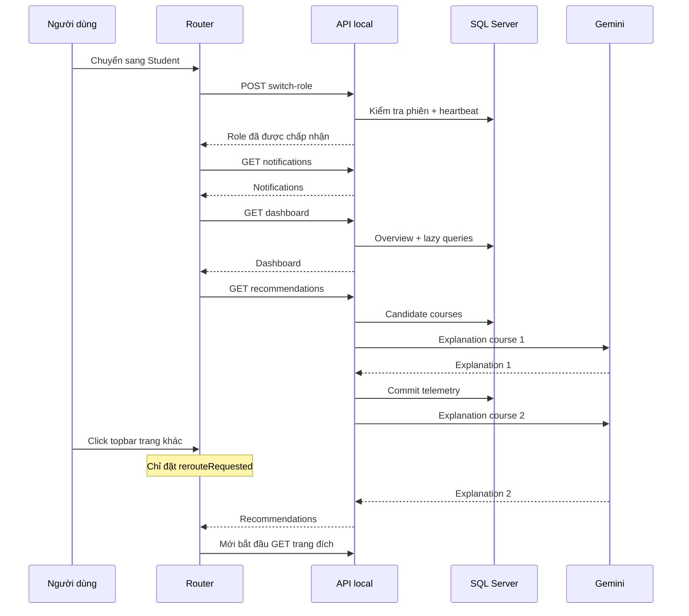

# Khảo sát hiệu năng chuyển role và điều hướng PWD301 — 01/10/2026

**Trạng thái:** Hoàn tất khảo sát và kế hoạch; chưa khắc phục sản phẩm.  
**Phạm vi:** frontend, backend, SQL Server và runtime phục vụ chuyển góc nhìn/topbar.  
**Yêu cầu:** Không sửa code. Chỉ tạo báo cáo này và [kế hoạch khắc phục](../superpowers/plans/2026-10-01-role-navigation-performance.md).  
**Snapshot:** checkout `E:\PWD301`, HEAD `a385d6e`; gồm các thay đổi chưa commit đã có trước khảo sát. Ngày ghi nhận theo Asia/Bangkok, UTC+7.

## 1. Kết luận có bằng chứng

Độ chậm nhiều giây đã được tái hiện. Nguyên nhân chính trong mẫu đo là **frontend chờ recommendation có gọi Gemini trên đường tải bắt buộc, và router giữ điều hướng mới sau request của trang cũ**. Đây là hai lỗi liên kết giữa frontend và backend. CSDL còn bị ứng dụng khai thác kém: N+1, tải dư cả đồ thị bài giảng/tệp, tính dữ liệu rồi bỏ, và ghi heartbeat phiên trên mỗi request.

Không có bằng chứng cho kết luận mọi truy vấn SQL Server đều chậm. Warm `SELECT 1` từ container web tới SQL Server mất **0,423–0,642 ms**, còn recommendation mất **8,7–16,4 giây** trong các mẫu hiện tại. API chuyển role riêng lẻ mất **24,7–46,0 ms**. Nhiều route Admin/Instructor tải trong vài trăm ms trong lần khảo sát này; vì vậy không ghi nhận sai rằng tất cả cặp role đều tái hiện mức chậm nhiều giây.

Localhost chỉ giảm độ trễ giữa trình duyệt và web server. Runtime hiện có gọi **Gemini bên ngoài máy**, tài nguyên CDN, Docker networking, xử lý JSON/DOM và nhiều lượt SQL. Các thành phần đó vẫn có thời gian chờ. Khi deploy, thêm RTT vào các chuỗi request tuần tự sẽ làm vấn đề nặng hơn; mức tăng cụ thể chưa được đo.

Danh mục dưới đây có **44 phát hiện**, gồm **26 mục frontend và 18 mục backend/CSDL**. Đây là danh mục đầy đủ trong phạm vi source và luồng được khảo sát, không phải chứng nhận không còn lỗi khác trong mọi điều kiện tải. Một số mục là hai phía của cùng một chuỗi nguyên nhân; không cộng chúng thành 44 sự cố độc lập hay 44 nguyên nhân đã đo thời gian.

## 2. Phương pháp và mức bằng chứng

| Ký hiệu | Ý nghĩa | Giới hạn |
|---|---|---|
| LIVE | Tái hiện trên tab Edge đang đăng nhập hoặc truy vấn SQL Server thật | Mẫu nhỏ trên dữ liệu local; không phải p95 hay load test |
| PROFILE | Gọi GET view hiện tại trên SQL Server thật trong tiến trình chẩn đoán tạm; có SQL event counters và chặn DML | Bỏ qua before-request/user loader; không phải thời gian HTTP đầy đủ |
| VM | Chạy mã JS hiện tại trong VM với Promise/timer kiểm soát được | Chứng minh quan hệ nhân quả, không đo tốc độ browser/SQL thật |
| SOURCE | Truy vết mã nguồn, callers và quan hệ ORM | Cơ chế đã xác định; mức ảnh hưởng runtime chưa định lượng |
| RISK | Cấu hình/điều kiện có thể gây chậm khi tải tăng | Cần thử tải hoặc plan/wait evidence trước khi thay đổi |

Thời gian API từ Resource Timing là `duration` và `responseStart - requestStart` (TTFB). Trình duyệt được gắn listener click và MutationObserver tạm để ghi thời điểm `aria-busy` được gỡ. Đây là mốc vòng đời viewport, **không phải INP, LCP hay thời điểm mọi widget đều interactive**. Admin còn tải tab data bên ngoài lifecycle này. Không dùng thời gian wall-clock của tool automation làm độ trễ ứng dụng.

Khi hủy staging cũ, `aria-busy` cũng được gỡ. Trong ca catalog → my courses có hai mốc; mốc đầu là bỏ stage cũ, không được coi là commit catalog hoặc bằng chứng flash nội dung cũ. Mốc cuối và thời điểm bắt đầu request mới chứng minh độ chờ điều hướng.

## 3. Môi trường đã kiểm tra

- URL đang mở: `http://127.0.0.1:5000/#/admin/governance`.
- Dùng phiên Admin hiện có, có cả ba quyền Admin/Instructor/Student. Đã đi qua sáu chiều chuyển góc nhìn trên **cùng tài khoản này** và các mục topbar của ba góc nhìn.
- Docker: `pwd301_web`, `pwd301_db`, `pwd301_clamav` đều healthy lúc kiểm tra.
- Web: môi trường `development`, Gunicorn **4 workers × 2 threads**, Gemini được cấu hình, timeout cấu hình **8 giây**. Timeout này không phải deadline tổng của request có nhiều lần gọi/model fallback.
- SQL Server: compatibility level 160; Query Store `READ_WRITE`; `READ_COMMITTED_SNAPSHOT` OFF; auto-update statistics ON.
- Quy mô: **9 users, 8 courses, 33 lessons, 14 enrollments, 227 auth_sessions**.
- Snapshot tài nguyên: web CPU 4,28%, RAM 351,1 MiB; DB CPU 1,75%, RAM 1,666 GiB; ClamAV RAM 959,7 MiB. Đây là một thời điểm, không loại trừ spike trước/sau đó.
- QueuePool của factory chẩn đoán: size 5, `pool_pre_ping=False`, ORM `expire_on_commit=True`. Chưa tái hiện pool exhaustion; không đề nghị tăng pool/worker dựa trên cấu hình này.
- Hash nội dung năm file then chốt trong container trùng checkout: app factory, auth routes, session service, router, API client. Đây là đối chiếu file trên volume, không chứng nhận mọi worker/module hoặc mọi script cached đều đã reload đúng phiên bản.

## 4. Số đo browser và API

### 4.1. Chuyển góc nhìn

| Chiều chuyển | API switch-role duration | Mốc click → gỡ busy của viewport | Diễn giải |
|---|---:|---:|---|
| Admin → Instructor | 46,0 ms | Không gắn listener ở ca đầu | Waterfall từ switch request tới dashboard response khoảng 230,2 ms |
| Instructor → Student | 31,6 ms | **16.603,5 ms** | Dashboard 76,0 ms; recommendation(2) **16.385,7 ms** giữ stage |
| Student → Admin | 30,8 ms | 199,6 ms | Shell sẵn; Users/tab background có thể hoàn thành sau mốc này; 12 API requests ở burst chuyển role |
| Admin → Student | 27,9 ms | **8.964,1 ms** | Dashboard 71,2 ms; recommendation(2) **8.701,7 ms** |
| Student → Instructor | 24,7 ms | 239,5 ms | Notifications 59,4 ms rồi dashboard 78,9 ms |
| Instructor → Admin | 24,8 ms | 217,4 ms | Notifications và ba nhóm queue; 12 API requests ở burst chuyển role |

Tab Resource Timing khi bắt đầu khảo sát còn có recommendation(2) **10.401,9 ms**. Nó là mẫu đã ghi trong phiên browser, không có listener click của khảo sát tại thời điểm request bắt đầu. Các ca 16,6s và 9,0s là thao tác chủ động trong khảo sát.

AI telemetry thật gần các ca đo có explanation **11.125 ms + 5.208 ms**, và một cặp khác **5.731 ms + 5.143 ms**. Điều này phù hợp với gọi explanation tuần tự; telemetry không thay thế trace từng outbound attempt hay chứng minh mọi provider call thành công theo deadline 8s.

### 4.2. Topbar

| Luồng | API đã quan sát | Bằng chứng |
|---|---|---|
| Instructor: Trang chủ → Khóa học | Courses 189,9 ms; TTFB 181,4 ms; transfer **160.940 bytes** cho 2 khóa | LIVE |
| Instructor: Khóa học → Ngân hàng câu hỏi | Courses 136,4 ms; summary course đầu **hai lần**, rồi summary course tiếp theo | LIVE; SOURCE xác nhận loop tuần tự |
| Instructor: Ngân hàng → Soạn đề | Courses 177,7 ms; TTFB 170,4 ms; 160.940 bytes | LIVE; lại dùng list full graph |
| Student: Khám phá → Khóa học của tôi, bấm khi Khám phá đang tải | Catalog 43,2 ms + enrollments 49,1 ms; recommendation(3) **10.928,5 ms**. GET my-learning của route mới chỉ bắt đầu sau recommendation cũ xong | LIVE |
| Cùng ca trên, tính từ click Khóa học của tôi | Chờ **8.191,4 ms** đến mốc cuối; GET của trang đích chỉ **40,0 ms** | LIVE; mốc bỏ stage cũ 8.026,9 ms được loại khỏi kết luận commit |
| Student: Khóa học của tôi → Bài kiểm tra | GET 75,5 ms; viewport 162,9 ms | LIVE |
| Student: Bài kiểm tra → Cài đặt | Profile 24,8 ms và preferences 28,1 ms chạy cùng nhau; viewport 166,6 ms | LIVE |
| Admin: Người dùng | Đã tải khi chuyển vào Admin; GET users 42,4–51,4 ms trong hai burst | LIVE |
| Admin: Duyệt khóa học | **8 API requests**; change-requests ALL 85,8 ms, transfer 42.499 bytes; pending courses tải lặp | LIVE |
| Admin: Duyệt giảng viên | **7 API requests**, gồm pending KPIs, list ALL, badges | LIVE |
| Admin: Phân công giảng dạy | **8 API requests**, gồm KPIs, workload, courses, badges | LIVE |
| Admin: Bảo mật & Nhật ký | **7 API requests**; audit page 50 records, 61,4 ms, transfer 53.537 bytes | LIVE |
| Admin: Vận hành | **6 API requests**; health 82,3 ms; backups và maintenance tải riêng | LIVE |

Các mốc viewport Admin đo 123,8–157,4 ms cho năm mục trên. **Không dùng những mốc này để tuyên bố tab data đã tải xong**, vì `renderGovernance` không await renderer tab. Request count loại polling 60s và thumbnail; một burst chuyển vào Admin gồm switch-role + notifications + users + **9 queue requests**.

### 4.3. SQL Server và profile view

Kết nối mới từ container web tới DB: **34,58 ms**, gồm thiết lập driver/dialect. Trên cùng connection, 10 lần SELECT 1:

`0,642; 0,581; 0,489; 0,487; 0,514; 0,512; 0,577; 0,423; 0,499; 0,464 ms`.

| GET view trực tiếp | SQL statements | Tổng thời gian cursor SQL | Thời gian view | Body bytes |
|---|---:|---:|---:|---:|
| Instructor dashboard, assigned | 8 | 7,373 ms | 28,395 ms | 3.612 |
| Instructor courses, assigned 2 khóa | **81** | **41,354 ms** | **136,533 ms** | **160.640** |
| Student dashboard | 14 | 7,243 ms | 27,589 ms | 5.586 |
| Student my-learning | **14** | 7,217 ms | 21,095 ms | 4.148 |
| Student assessments | **23** | 15,814 ms | 39,927 ms | 4.307 |
| Admin users, 9 users | **13** | 6,445 ms | 19,327 ms | 3.981 |
| Admin pending courses, queue rỗng | 3 | 1,426 ms | 4,598 ms | 42 |
| Admin pending instructor applications, rỗng | 4 | 1,756 ms | 6,447 ms | 107 |
| Admin pending change requests, rỗng | 3 | 1,381 ms | 4,361 ms | 65 |
| Auth notifications, Admin | 4 | 3,382 ms | 58,836 ms | 4.458 |

Mỗi ca dùng ORM session mới, actor hiện có được nạp trước counter. Không chạy before-request, auth user-loader hoặc maintenance cache, nên số trên **không bao gồm chi phí auth/heartbeat toàn request**. Listener chặn INSERT/UPDATE/DELETE/MERGE và DDL; không profile recommendation có telemetry writes theo phương pháp này. Rollback/remove session sau từng ca. Cursor timing không bao gồm toàn bộ ORM hydration, JSON serialization, network hay browser DOM.

81 statements cho 2 Course gồm file revisions **25**, file assets **13**, scan results **13**, lesson resources **7**, lessons **6**, learning units **6**, thêm owner/enrollment/audit/change requests. Đây là bằng chứng trực tiếp của serializer list kéo graph lớn. Admin users có **9 lần SELECT roles** cho 9 users.

Query Store đang hoạt động. Một nhóm statement đụng auth_sessions có 13.926 executions, avg khoảng 0,709 ms, max hiển thị 80 ms; nhóm khác 14.041 executions, avg 0,254 ms. Đây là lịch sử tích lũy, không đồng nhất với khoảng khảo sát hay một endpoint. Snapshot `sys.dm_exec_requests` không thấy request DB đang chạy; điều đó **không chứng minh không từng có lock wait**. Index hash auth-session, course catalog/owner, enrollment, notification recipient/role đều đã tồn tại.

## 5. Toàn bộ phát hiện frontend

Ưu tiên **P1**: gây treo/chậm rõ hoặc sai ownership/dữ liệu; **P2**: tăng request/query, lỗi lifecycle hoặc rủi ro khi mở rộng; **P3**: tối ưu sau đo. Không có kết luận incident P0 từ các phép đo này.

| ID | Ưu tiên / bằng chứng | Lỗi, vị trí hiện tại và ảnh hưởng | Hướng khắc phục |
|---|---|---|---|
| FE-01 | P1 LIVE+SOURCE | `student.js:404,594,642` chờ dashboard rồi recommendation trước khi trả renderer. Catalog `:836-840` đưa recommendation vào Promise.all bắt buộc. Stage không mount trong 8–16s. | Mount dữ liệu chính trước; recommendation có skeleton/error riêng, không giữ navigation. |
| FE-02 | P1 LIVE+VM | `router.js:175-205` khóa `_isRouting`, chỉ đặt `_rerouteRequested`; request cũ xong mới dispatch mới. LIVE my-learning chờ 8,2s dù chính GET chỉ 40ms. | Generation và route-scoped abort cho read; bắt đầu route mới ngay, chặn commit lỗi thời. |
| FE-03 | P1 VM+SOURCE | Khi renderer cũ reject tại `router.js:192`, loop thoát trước xử lý reroute; hashchange `:59` không recovery. VM cho URL B nhưng UI cũ, B không chạy. | Cô lập lỗi từng dispatch và tiếp tục route mới; retry state cho lỗi route hiện hành. |
| FE-04 | P1 SOURCE | `api.js:51-110` không deadline/AbortController; wrappers không truyền signal. GET treo kéo router/role transition vô hạn ở tầng ứng dụng. | Native signal/deadline cho read; phân biệt AbortError; bảo toàn mutation semantics. |
| FE-05 | P1 VM+SOURCE | Role dropdown `router.js:949-961` chờ switch-role rồi **await notifications** mới redirect. Loader route chưa bắt đầu trong khoảng chờ; menu còn mở. | Chỉ switch-role authoritative nằm trên đường bắt buộc; điều hướng rồi refresh notification độc lập. |
| FE-06 | P1 SOURCE | `router.js:943-966` không guard/disable trong switch POST. Bấm nhiều role có thể tạo writes cạnh tranh, response cũ áp role/redirect sau response mới. | Single in-flight role mutation và generation; dùng active_role từ server response. |
| FE-07 | P1 SOURCE | Auto-role switch `router.js:299-345` catch lỗi POST nhưng vẫn đổi currentRole và active_role local. Menu và session có thể lệch, sinh deny/fallback. | Không công nhận role chưa được server chấp nhận; reconcile profile và retry. |
| FE-08 | P1 SOURCE | Commit chỉ kiểm hash `router.js:370`. Hash A→B→A hoặc thay account/role cùng hash có thể nhận response cũ. | Ownership gồm generation, account và perspective; invalidate ở logout/login/switch. |
| FE-09 | P1 VM+SOURCE | Notifications `router.js:1594-1611` capture role nhưng đọc user sau await; persist key theo user/role hiện tại. VM chứng minh response A/Instructor lưu dưới B/Admin. | Capture identity+generation trước request; discard response cũ, persist bằng key đã capture. Đây là client-cache race, chưa chứng minh backend cấp dữ liệu trái phép. |
| FE-10 | P2 LIVE+SOURCE | `admin.js:255-356` đợi 3 KPI queues trước khởi chạy tab Users/Audit/Applications/Reassign. Tạo waterfall không liên quan trang đích. | Render tab được chọn trước; KPI summary độc lập. |
| FE-11 | P2 LIVE+SOURCE | Badge `router.js:588-616`, startup/role/route commit; Governance và tab lại tải queue. LIVE 7–8 requests mỗi Governance tab; 9 queue requests khi chuyển vào Admin. | Dedupe in-flight theo account/sub-role; authorized count summary và invalidate sau review. |
| FE-12 | P2 SOURCE | Notifications startup hai lần (`router.js:157,1182`), poll full list mỗi 60s `:1186`, bell thêm fetch `:1219`; `api.js:1122-1132` fallback ba endpoint trên mọi lỗi, giả empty success. | Coalesce; count API khi bell đóng; pause hidden tab; fallback chỉ đúng lỗi tương thích, giữ error state. |
| FE-13 | P2 LIVE+SOURCE | Stage `router.js:209-223` hidden/inert nên loading state của trang đích cũng hidden. Người dùng vẫn thấy màn hình cũ trong lúc click đã đổi URL/role. | Destination shell/skeleton xuất hiện ngay; giữ chống nháy màn hình nhưng chỉ gate phần dữ liệu cần thiết. |
| FE-14 | P1 SOURCE | `router.js:226-232` bỏ stage rồi chuyển childNodes sang viewport; callbacks còn giữ `container` đã rỗng/detached. Hỏng nhiều thao tác sau mount, khiến cảm giác click không phản hồi. | Giữ view root thực trong DOM, hoặc truyền mounted root ổn định; có dispose lifecycle. Chi tiết ở bảng dưới. |
| FE-15 | P1 SOURCE | Tab async tại `admin.js:334-343` không được await/return. Các callback query ID toàn cục sau fetch (`:373,1099,1894,2532,2742`) có thể ghi vào tab mới cùng ID; loader kết thúc quá sớm. | Root/generation thuộc tab; completion semantics rõ, discard/cancel response cũ. |
| FE-16 | P2 SOURCE | Studio `instructor.js:3636,3657,5886` learning units → course detail → lesson detail tuần tự; phần đọc độc lập không được khởi chạy sớm. | Tái dùng data hoặc parallel các read độc lập; giữ lazy draft và save guard. |
| FE-17 | P2 LIVE+SOURCE | Question hub `instructor.js:6716,6747,6911-6923` courses rồi summary đầu rồi N summary tuần tự; summary đầu lặp. LIVE thấy 2 requests cùng course. | Reuse summary đầu; batch/bounded concurrency hoặc summary endpoint; chỉ tải phần cần hiển thị. |
| FE-18 | P2 SOURCE | Empty/offline hub giữ roster 8 môn giả `instructor.js:6704-6718`, vì chỉ thay khi live list nonempty. Sinh summary requests vào ID giả. | Empty/error trung thực; không gọi summary khi danh sách authorized rỗng. |
| FE-19 | P2 SOURCE | Inspector `instructor.js:6740-6747,6901`, scope dashboard/courses `:136,522`, admin search `admin.js:562-587` thiếu latest-response guard. Clear debounce không hủy request đã chạy. | Token mới nhất và optional read cancellation cho từng control; giữ filter/selection. |
| FE-20 | P1 SOURCE | Lesson console `student.js:2345-2360,2710,2737` fetch A nhưng đọc lại activeItem mutable B sau await; callbacks progress/quiz dùng ID mutable. Có thể ghép nội dung A với ID B. | Capture item/generation; bind timers/progress/quiz vào item đó; discard/cancel read cũ. |
| FE-21 | P2 SOURCE | Iframe cleanup `student.js:1747-1759` chỉ gọi khi bắt đầu render content, không ở route exit. Poll `:3305-3313` mỗi giây không tự clear khi detached; message listener `:3293` còn giữ view. | Dispose polling/listeners lúc thay/bỏ route/logout; test lặp vào/ra. |
| FE-22 | P2 VM+SOURCE | `ui.js:24-47` stop timer cũ không cancel/token-check; VM start→stop→start→old stop làm loader mới opacity-0. | Cancel timer cũ hoặc generation guard; loader ownership nhất quán. |
| FE-23 | P3 SOURCE | `index.html:729-737` load eager 9 scripts của mọi role: **1.614.304 raw bytes**; instructor 457.053, student 408.722, admin 260.635, exams 243.269. | Đo cold parse/network rồi lazy-load role/studio với cached promise và thứ tự dependency; không rewrite framework. |
| FE-24 | P3 SOURCE | Tailwind CDN runtime `index.html:24`, DOMPurify CDN `:728`, fonts `:20-21`; script parser-blocking và phụ thuộc mạng ngoài. | Đo boot; compiled styling của frontend hiện có, local/pinned sanitizer, font fallback; giữ sanitize/CSP. |
| FE-25 | P2 SOURCE | Lists Courses/Question Bank/catalog/my-learning/assessments rebuild toàn mảng trên client (`instructor.js:399-547,6830,6938`; `student.js:731,1128,5531`). Nhiều API chưa paginate. | Server pagination/filter/sort và DOM page bounded; không thêm virtualization khi chưa đo. |
| FE-26 | P2 SOURCE | Course fallback `api.js:227-255` dùng live hash làm context, có thể lặp endpoint denied/missing; `student.js:1266` lặp student detail; recommendations `api.js:391-402` thử endpoint thứ hai với mọi lỗi. | Caller chọn endpoint/perspective rõ; fallback giới hạn; không fallback trên abort/401/403. |

Mọi đường dẫn JS trong bảng nằm dưới `frontend/assets/js/`, trừ `index.html` dưới `frontend/`. Line numbers là snapshot hiện tại và có thể đổi khi sửa sau này.

### 5.1. Hậu quả của container bị detached — FE-14

| Luồng | Vị trí trong views | Hậu quả từ ownership hiện tại |
|---|---|---|
| Waiting room countdown | `student.js:3999-4006` | Query container rỗng, clear tick; refresh vào stage đã tháo |
| Attempt question navigation | `student.js:4336-4345` | Không tìm cards/buttons; `.disabled` có thể dereference null |
| Attempt fullscreen | `student.js:4357` | Fullscreen vào element detached |
| Result filters | `student.js:5456` | Không tìm question items nên filter không tác dụng |
| AI clear | `student.js:5784` | Re-render vào detached container |
| Leave course / enrollment / revision refresh | `student.js:1211,2510,3095` | Refresh UI vào container cũ |
| Shared Settings password toggle | `student.js:6764` | Lookup input null |
| Shared Settings password submit | `student.js:6829-6832` | Đọc current password thành empty do lookup null |
| Shared Settings notification preferences | `student.js:6878-6881` | Đọc null rồi dùng defaults `[true,true,true,false]` thay lựa chọn |
| Interactive exam validation cleanup | `instructor-exams.js:2108` | Không tìm/xóa inline validation cũ |

Các tác vụ submit exam, đổi password hoặc ghi preferences **không được thực hiện trong khảo sát**. Đây là phát hiện source/DOM ownership, cần real-DOM regression để xác nhận từng symptom. FakeElement hiện có không mô phỏng đầy đủ việc DOM adoption rút children khỏi parent cũ.

## 6. Toàn bộ phát hiện backend và CSDL

Mọi đường dẫn trong bảng là tương đối với `src/pwd301/`.

| ID | Ưu tiên / bằng chứng | Lỗi và vị trí | Hướng khắc phục |
|---|---|---|---|
| BE-01 | P2 SOURCE+RISK | `__init__.py:597-610` gọi session validation mặc định ghi last_seen; `services/session_auth_service.py:162-187` UPDATE+COMMIT trên mỗi authenticated request. ORM expire làm thêm reload; burst cùng session cạnh tranh một hàng. | Giữ revoke/status/version/expiry check tươi; throttle conditional heartbeat và tách commit khỏi read session. Chưa đo lock wait do heartbeat trong ca live. |
| BE-02 | P2 SOURCE | Fast path `__init__.py:637-668` chỉ `/static/`, nhưng assets thật là `/frontend/` (`blueprints/frontend/routes.py:251`). Resolve current_user `:642` trước admin/auth bypass; public assets mang cookie vẫn chạy auth DB. | Explicit public asset/screen bypass trước actor resolution, theo maintenance/header/access contract. |
| BE-03 | P1 PROFILE+LIVE | `blueprints/instructor/routes.py:543-560` list all rồi serializer `:374-472` kéo full lessons/markdown/resources/units/enrollments, flat+unit lesson lặp; file serializer `services/file_service.py:1662-1707` đọc revision history. **81 SQL/2 Course, body160KB**. | Summary projection + grouped counts cho list, detail khi mở; pagination. Eager full graph chỉ giảm query nhưng không giải quyết payload. |
| BE-04 | P2 PROFILE+SOURCE | `services/analytics_service.py:802-855` lazy course/owner/lessons mỗi enrollment; `:871-881` attempts mỗi assessment; `:895-908,958-983` lazy result/assessment/course. Dashboard 14 SQL ở dataset nhỏ. | Bounded eager/projection và batch attempts/results; giữ enrollment/release policy. |
| BE-05 | P2 PROFILE+SOURCE | `/student/my-learning` `blueprints/student/routes.py:935-944` gọi full overview rồi bỏ upcoming/recent; assessments `:960-994` lại lấy enrollment, assessments và attempts. **14 SQL cho cards,23 SQL cho assessments**. | Chọn phần overview cần tính trong service, reuse query results; budget riêng từng view. |
| BE-06 | P1 LIVE+SOURCE | `services/recommendation_service.py:122` full candidates; `:207-224` Gemini tuần tự; `:260-272` commit telemetry mỗi candidate. `gemini_service.py:742-776` model/key loop và blocking future; request giữ worker, có thể giữ transaction/connection đọc trong chờ mạng. Limit `student/routes.py:71-74` không clamp. | Ranking và heuristic có sẵn trả nhanh, AI enrich độc lập; deadline tổng + cap limit; không giữ DB connection lúc chờ provider; telemetry batch. Pool exhaustion chưa được đo. |
| BE-07 | P2 PROFILE+SOURCE | Instructor dashboard với actor Admin `analytics_service.py:321-328` tải toàn bộ platform Course chỉ để len dù scope assigned; scope all `:516-523` owner lazy. | COUNT khi chỉ cần count; projection/page và eager owner. |
| BE-08 | P3 SOURCE | Admin dashboard `analytics_service.py:77-190` 9 aggregate queries tuần tự; `:193-197` thêm telemetry. `operations_service.py:560-563` CPU sample có thể block20ms. | Đo caller trước; kết hợp aggregate hoặc snapshot có generated_at khi cần; tách telemetry khỏi critical data, giữ health/telemetry thật. Topbar Admin hiện không dùng dashboard này làm home. |
| BE-09 | P2 PROFILE+SOURCE | Admin users `blueprints/admin/routes.py:237-255` COUNT rồi ALL và lazy roles/links. LIVE profiler 13 SQL/9users, roles SELECT9 lần. Admin courses/pending `:81-120` ALL, owner lazy. | Page/filter ổn định; eager roles/links/owner chỉ trong page; SQL counts. |
| BE-10 | P2 SOURCE | Instructor applications `admin/routes.py:1008-1034` filtered list rồi ALL lần nữa để counters, applicant/reviewer lazy; `services/user_service.py:1489-1494` unbounded. | Grouped status counts, page summaries, eager applicant/reviewer; parsed details ở detail view. |
| BE-11 | P2 SOURCE+LIVE | Change requests `admin/routes.py:1299-1327` ALL history, JSON parse/dedupe Python; staged lookup mỗi record `:1462` và lesson branch lặp `:1377`; full original/proposal/resource payload. ALL response observed42KB ở local. | Page summaries/counts, detail diff khi mở; staged lookup batch và một lần; giữ history/dedupe mới nhất. |
| BE-12 | P2 SOURCE+RISK | Visible notifications `services/notification_service.py:285-306` correlated NOT EXISTS theo title/body/role/id; list count/page/unread `:342-372`, preferences thêm query. Index **đã có**, cursor time hiện nhỏ. | Actual plan/reads theo history; bounded canonical dedupe và reuse/count refresh. Không khẳng định thiếu index hoặc query này là delay nhiều giây. |
| BE-13 | P2 SOURCE | Student course dossier `student/routes.py:1645-1655` attempts per assessment; `:1678-1683` assignments lazy; `:1705-1708` full revision list lấy latest; `:1726-1760` resource graph; `:1820-1823` lặp group lessons. | Batch attempts/counts, safe current revision/scan projection, group lessons một lần, detail lazy; giữ fail-closed. |
| BE-14 | P2 SOURCE | Assessment list đã paginate nhưng `services/assessment_service.py:303-345` tính aggregates bằng materialize assignments/pools/blueprints mỗi assessment; rules và sections lazy `:328,364`. | Giữ pagination; grouped COUNT/SUM cho page IDs, batch section/rules. |
| BE-15 | P2 SOURCE | Faculty workload `services/course_service.py:1359-1396` all instructors rồi query Courses và Enrollment COUNT riêng mỗi instructor. | Batch course projection + grouped student counts; page khi cần. URL live: `/admin/faculty/workload`. |
| BE-16 | P3 SOURCE | Bearer auth `services/authorization_service.py:69-93` verify token trước g.current_user; decorator/view có thể verify lại; `jwt_auth_service.py:383` SELECT grant mỗi lần. | Memoize verified actor trong cùng request/token; không cache giữa request. Không quy đây là nguyên nhân của session browser đang đo. |
| BE-17 | P2 SOURCE+RISK | Health `services/operations_service.py:321-328` probes tuần tự; ClamAV timeout1s `:173-181`; worker/mail nhiều queries. Storage check `:129` mkdir, include_details=False vẫn probes. LIVE healthy82ms, chưa đo ClamAV down. | UI core không chờ health; probe deadline/snapshot timestamp/TTL ngắn, kết hợp queries; giữ số liệu thật. |
| BE-18 | P3 SOURCE | `/api/ui/screen` `blueprints/frontend/routes.py:311-315` đọc full HTML mỗi lần, không conditional send_file như assets; thêm BE-02 auth cost. Route đang đo không dùng endpoint này trong warm path. | Conditional ETag/file semantics cho public screens nếu cần; không cache user data vào public screen. |

## 7. Bản đồ đường tải và phạm vi kiểm tra



| Route family | Dependency chính trong implementation | Kiểm tra hiện tại |
|---|---|---|
| Login/init | Current user → notifications; bootstrap notifications lặp; login uses primary_role thay active_role `auth.js:631-641` | SOURCE + Resource Timing đã có trong tab; không logout/relogin |
| Student dashboard | Dashboard → recommendation2 → commit | LIVE |
| Student catalog | Catalog + enrollments + recommendation3 cùng gate | LIVE rapid exit |
| Student courses | My-learning GET; whole-array rendering | LIVE + PROFILE |
| Student course/lesson console | Detail+progress rồi selected item; per-item lifecycle | SOURCE, không submit progress/quiz |
| Student assessments | Assessments GET | LIVE + PROFILE |
| Waiting room/attempt/results | Delivery/detail/result; leases/timers/filter callbacks | SOURCE, không bắt đầu/submit attempt |
| AI assistant | Shell local, send POST khi chủ động | SOURCE, không gửi chat |
| Become Instructor | Application GET; POST khi chủ động | SOURCE |
| Shared Settings | Profile+preferences | LIVE GET, không ghi settings/password |
| Instructor dashboard/courses | Summary GET / full course-list graph | LIVE + PROFILE |
| Instructor Course Manage | Course detail+assessments song song | SOURCE |
| Instructor Lesson new/edit | Units → course → existing lesson nếu có | SOURCE, giữ lazy creation |
| Question hub/studio | Courses → summaries; extended studio questions100+summary | LIVE hub, SOURCE studio |
| Exam hub | Courses và local draft/store; mutation khi chủ động | LIVE GET, không xóa local draft |
| Admin Governance six destinations | KPI queues → tab API → badge queue refresh | LIVE primary Admin |
| Admin detail review | Course detail hoặc ALL change requests rồi find | SOURCE, không approve/reject |
| Admin Operations | Backups/maintenance/health tải ngoài core shell | LIVE GET |
| Bearer REST clients | JWT grant verification; serializers chung | SOURCE; không đo JWT client |

Chưa có live login cho tài khoản Instructor-only, Student-only, các Admin sub-role, account switch A→B, mobile, nhiều tab exam, DB contention/load lớn. Sáu chiều đã đo trên Admin có đủ ba role **không đại diện đầy đủ** cho tất cả tài khoản/sub-role. Common router/API flaws ảnh hưởng các góc nhìn dùng chung code, nhưng quyền và dữ liệu khác vẫn cần matrix test riêng.

## 8. Những kết luận đã loại và rủi ro chưa xác minh

- Không phát hiện AI cleanup trong middleware toàn cục; không quy purge conversations vào mọi click topbar. Explicit cleanup endpoint tồn tại riêng.
- `controllers.js` không nằm trong scripts của index hiện tại; không gán timers của nó vào runtime đang đo.
- Router có kiểm tra captured full hash, nên **không khẳng định** stale catalog đã được commit khi hash khác. FE-08 là gap generation/account/role và hash quay lại.
- Không có bằng chứng missing mọi index. Auth-session hash, course catalog/owner, enrollment và notification indexes đã xác minh.
- RCSI OFF có thể tăng reader/writer blocking, nhưng chưa có lock wait attribution. Không đổi isolation hoặc dùng NOLOCK như giải pháp mặc định. Phải bảo toàn enrollment/lease/audit concurrency.
- Chưa có actual execution plans, rows-read/rows-returned cho workload lớn; Query Store summaries là evidence lịch sử. Index mới chỉ nên được chọn sau gate của canonical DB strategy.
- Không đo pool wait/exhaustion, CPU long tasks, INP/LCP/CLS, gzip cold transfer, WAN RTT hoặc p95. Raw bundle bytes không phải compressed download bytes hay parse duration.
- Null-progress fallback của analytics chỉ chạy khi progress None, trong khi model nullable=False/default0; không quy N×progress calculator cho dashboard thông thường.
- Không tắt `expire_on_commit` toàn hệ thống để chữa N+1. Cần sửa query/transaction ownership trước; trạng thái auth không được stale.
- Không cần Redis, Kafka, microservices, framework rewrite hay tăng phần cứng trước khi các lỗi critical path/query dư được loại và đo lại.

## 9. Kế hoạch ưu tiên và mục tiêu nghiệm thu

Kế hoạch có file/test/commands/TDD chi tiết tại [2026-10-01-role-navigation-performance.md](../superpowers/plans/2026-10-01-role-navigation-performance.md).

| Thứ tự | Kết quả cần đạt | Bao phủ |
|---|---|---|
| 1 | Khóa baseline đo thật và tests đỏ cho critical path/lifecycle | LIVE/PROFILE, gaps hiện có |
| 2 | Route mới bắt đầu ngay; renderer cũ không chặn, không làm mất route mới; stable root/dispose | FE-02/03/04/08/13/14/15/20/21/22 |
| 3 | Role switch chỉ chờ server xác nhận; notification ownership đúng | FE-05/06/07/09/12/26 |
| 4 | Dashboard/catalog không chờ Gemini; recommendation có deadline tổng, safe fallback | FE-01, BE-06 |
| 5 | Giảm query/payload list và bỏ công việc không sử dụng | BE-03/04/05/07/09/13/14/15, FE-16/17/18/19/25 |
| 6 | Admin tab độc lập KPI; counts và queues bounded/deduped | FE-10/11/15, BE-10/11/12 |
| 7 | Auth heartbeat transaction ngắn, static path hợp lý; concurrency và infrastructure evidence | BE-01/02/16/17; RCSI/pool evaluation |
| 8 | Cold boot/CDN và phụ trợ sau profiling; complete role/WAN/SQL gates | FE-23/24, BE-08/18 |

Mục tiêu đề xuất để review trước sửa, **không phải SLA đã chốt hoặc kết quả hiện tại**: latest read dispatch khởi động trong 50ms sau click dù read cũ treo; skeleton/feedback trong100ms; primary warm content local p95≤500ms, giả lập RTT100ms p95≤1s cho đường summary không gọi AI; slow Gemini10s không làm chậm primary route quá100ms so với cùng fixture không AI. Course card list page20 summary≤50KB và query count không tăng theo số lesson/file/student ngoài summary, mục tiêu≤12 SQL cho page; exact budgets cần chốt theo data contract và baseline Task1. Auth suspend/revoke/CSRF/lease correctness là gate bắt buộc.

## 10. Verification thực sự đã chạy

| Kiểm tra | Kết quả |
|---|---|
| Browser trên phiên người dùng | Sáu chiều role; topbar ba góc nhìn; Resource Timing; click/busy lifecycle; rapid catalog exit |
| SQL Server thật qua container web | SELECT1×10, counts, DB options, index inventory, DMV snapshot, Query Store summaries |
| Read-only GET-view profiler | 10 ca trong bảng; DML guard; SQL count/cursor duration/body size |
| Node frontend existing suite | **78 passed,0 failed,0 skipped**, Node v24.16.0,308,054ms, exit0 |
| VM causal probes | FIFO blocking; queued route bị mất sau old rejection; notification chặn redirect; stale notification cache; old loader stop che loader mới. Chạy stdin, không tạo test/product files |
| Python selected suite | **29 passed,1 failed**,13,58s, exit1 |
| OCR CLI | Không chạy được review LLM: `no valid LLM endpoint configured`. Có review đa file bằng source/agents; không coi OCR failure là không có findings |
| RTK | Không có executable trong PATH; dùng PowerShell/rg/Python/Node trực tiếp |
| Impeccable context | Đã chạy scoped router audit context; không có PRODUCT.md/DESIGN.md. Không tạo design docs hay chỉnh UI |
| Full verify/build/migration/load test | **Không chạy**: không có product change; không chứng nhận repository/release xanh |

Command Python đã chạy:

```powershell
.venv\Scripts\python.exe -B -m pytest tests/unit/test_session_auth_service.py tests/unit/test_recommendation_service.py tests/unit/test_analytics_service.py tests/security/test_analytics_idor.py -q -p no:cacheprovider
```

Failure: `tests/unit/test_recommendation_service.py:275`, `test_zero_internal_pk_leakage_in_recommendations` assert `"id" not in r`, trong khi service `recommendation_service.py:280-281` hiện trả alias `id` bằng **chuỗi public UUID**. Đây là mismatch test/response contract cần đối chiếu trước sửa; failure này **không chứng minh internal BIGINT bị lộ** và không phải bằng chứng nguyên nhân latency. Không sửa test để biến báo cáo thành pass.

Các lệnh source/reuse: `rg`, line-numbered UTF-8 reads, mapper inspection. Graph hiện có được query/traverse chỉ đọc; source locations của graph có drift (ví dụ renderRoute graph L243 so với source hiện tại), nên mọi finding được đối chiếu lại file. Không rebuild graph hoặc sửa GRAPH_TREE.html.

## 11. Completion report theo TASK_TEMPLATE

### A. Scope và source-of-truth

Đọc AGENTS.md, tasks/CURRENT.md (TASK-077 DONE và lịch sử), tasks/templates/TASK_TEMPLATE.md, README phần kiến trúc/runtime, CODING_AGENT_START_HERE, business/01_BUSINESS_RULE_CATALOG, implementation/06_NON_NEGOTIABLE_INVARIANTS. Đối chiếu canonical Database Architecture README/14_INDEX_AND_PERFORMANCE_STRATEGY và domain auth/notification/frontend flow guidance. Source/test hiện tại là evidence; không lấy DONE của task cũ hoặc memory pass counts làm runtime proof.

### B. Quyết định reuse

Tái dùng API summary/query grouped đã có, AbortController nền tảng, request-local g, pagination hiện có, heuristic recommendation hiện có, UI loading helpers và tests harness. Giữ course detail/editor contracts; thêm summary list có version/contract rõ nếu cần. Không tự thêm infrastructure.

### C. Per-file changes của khảo sát

- Tạo `docs/audits/PERFORMANCE_ROLE_NAVIGATION_AUDIT_2026-10-01.md`: inventory44, measurements, limits, verification.
- Tạo `docs/superpowers/plans/2026-10-01-role-navigation-performance.md`: kế hoạch khắc phục có TDD và gates.
- Không sửa mã sản phẩm, tests, migrations, task status hoặc graph artifacts. Workspace đã dirty trước khảo sát; đối chiếu SHA-256 **1.052 tracked files** với baseline trong lượt này cho kết quả **0 file thay đổi**.
- Temporary baseline hashes nằm ngoài repo trong `%TEMP%/pwd301-performance-audit-20261001`. Browser diagnostic listeners đã tháo; Network observation đã tắt. Tab trả lại Admin/governance.
- Ordinary GET/switch-perspective đã chạy như user flow; backend có thể cập nhật heartbeat/AI telemetry hoặc health storage-check theo code sẵn có. **Không tuyên bố DB hoàn toàn bất biến**, không đổi quyền, tạo course/attempt hoặc ghi settings trong khảo sát.

### D. Simplification được đề xuất, chưa thực hiện

| Candidate | Classification | Lý do |
|---|---|---|
| Optional AI nằm trên route gate | SIMPLIFY NOW | Không cần giữ toàn màn hình cho explanation |
| Full nested course graph ở card list | SIMPLIFY NOW | 81 queries/2cards,160KB |
| Full overview bị bỏ ở my-learning | SIMPLIFY NOW | Đo14queries dù chỉ cần cards |
| Pending queues tải lặp, summary đầu lặp | SIMPLIFY NOW | LIVE duplicate requests |
| Duplicate API method definitions: notification read/all, admin change request get/review | SIMPLIFY NOW | Debt tại api.js:426/1152,438/1164,923/1085,927/1090; chưa chứng minh latency riêng |
| Fake empty question-bank roster | REMOVE NOW khi triển khai | Không phản ánh course authorization, tạo request dư |
| RBAC/object auth, CSRF, session revocation, file scan gates | KEEP | Không tối giản bằng bỏ security |
| Lease/autosave ordering/submit idempotency, historical snapshots | KEEP | Không đổi correctness để đạt latency |
| Studio active/save guards, lazy creation và replaceState | KEEP | Bảo toàn dữ liệu, side-effect-free navigation |
| Server pagination và grouped analytics queries đã có | KEEP | Reuse pattern thay abstraction mới |
| New cache/infrastructure/virtualization | PONYTAIL | Chỉ xét nếu số đo sau sửa còn vượt budget |

### E. Deferred debt

| Trigger | Owner đề xuất | Risk | Temporary safeguard | Review point |
|---|---|---|---|---|
| Warm budgets vẫn fail sau critical-path/query fixes | Backend/DB maintainer | Cache staleness hoặc queueing | Giữ auth tươi, versioned summary contracts, Query Store | Cuối Task7/8 của plan |
| Cold parse/CDN vẫn là bottleneck | Frontend maintainer | Lazy-script ordering/CSP regression | Giữ sanitizer và script dependencies | Cold baseline rồi Task8 |
| Dataset lớn bộc lộ wait/scan | DB maintainer | Index write tax, isolation/concurrency regression | Không NOLOCK, không tự bật RCSI | Actual plans/waits và SQL concurrency gate |

### F. Verification

Chi tiết tại mục10. Không có skipped được tính là passed. One-off profile số nhỏ không thay load test. OCR chưa có LLM endpoint nên independent CLI review còn thiếu.

### G. Giới hạn và bước tiếp theo

Triển khai phải bắt đầu từ tests đỏ và đo cùng conditions trước/sau; giữ exhaustive inventory này để không mất các lỗi khi chữa nguyên nhân dễ thấy nhất. Báo cáo/plan là deliverables hiện tại, **không task sửa code đã hoàn thành**. Khi được yêu cầu triển khai, đọc plan và canonical contracts, chốt auth transaction design trước phần thay đổi substantial authentication.

## 12. Tài liệu kỹ thuật đối chiếu

SQLAlchemy mô tả lazy relationship loading tạo N+1 và `selectinload` giải quyết collection loading theo batch: [ORM related objects](https://docs.sqlalchemy.org/en/20/tutorial/orm_related_objects.html). Commit expiration được mô tả trong [Session API](https://docs.sqlalchemy.org/en/20/orm/session_api.html). Việc chọn projection/batch trong plan là đề xuất từ profile/source của PWD301; không phải kết luận rằng chỉ thêm selectinload mọi nơi sẽ đủ.

Microsoft mô tả lock-based READ COMMITTED khi RCSI OFF và row-versioning alternatives trong [Transaction locking and row versioning guide](https://learn.microsoft.com/en-us/sql/relational-databases/sql-server-transaction-locking-and-row-versioning-guide?view=sql-server-ver17). RCSI OFF ở môi trường này là fact đo được, **tác động blocking cụ thể vẫn là giả thuyết cần wait/plan/concurrency evidence**.

Đã dùng 10 skill gồm: superpowers (using-superpowers, systematic-debugging, writing-plans, verification-before-completion, dispatching-parallel-agents), ponytail, task-observer, full-output-enforcement, open-code-review, graphify, performance-optimization, impeccable, computer-use, doubt-driven-development.
