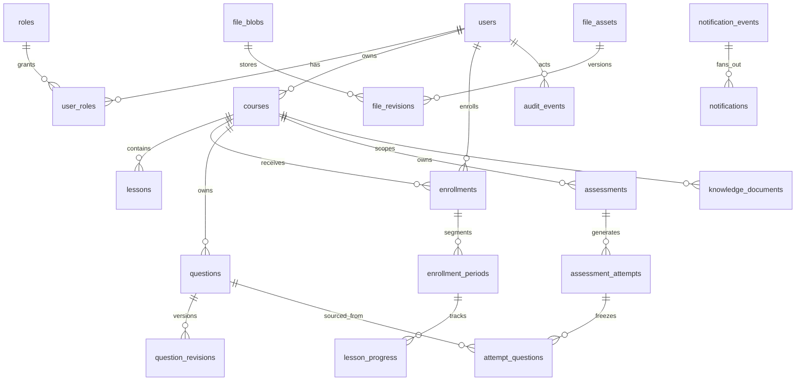
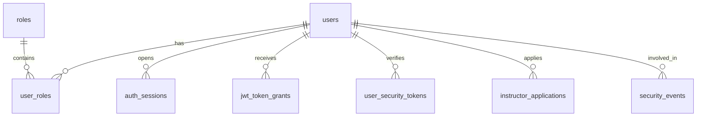
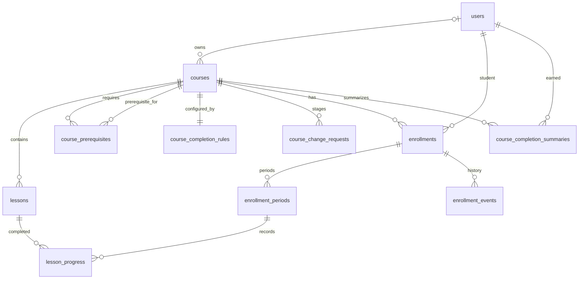
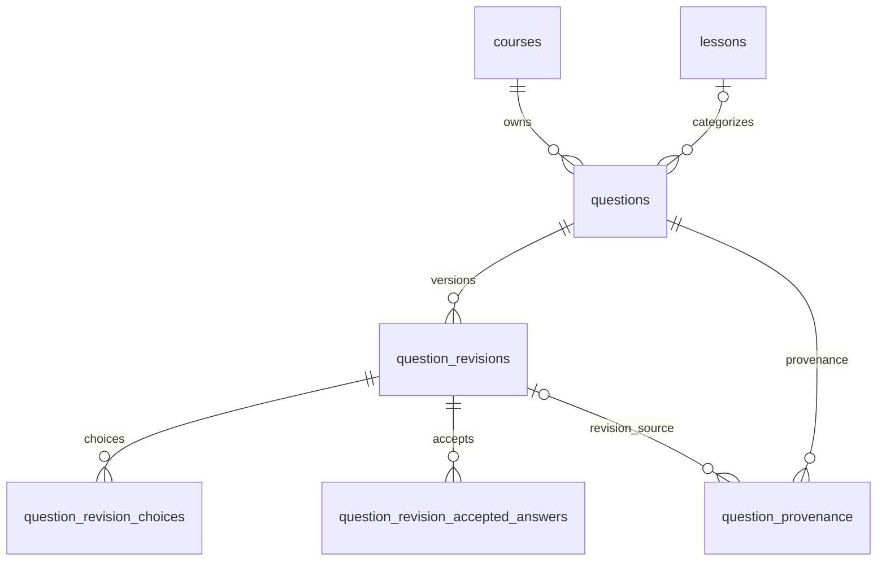
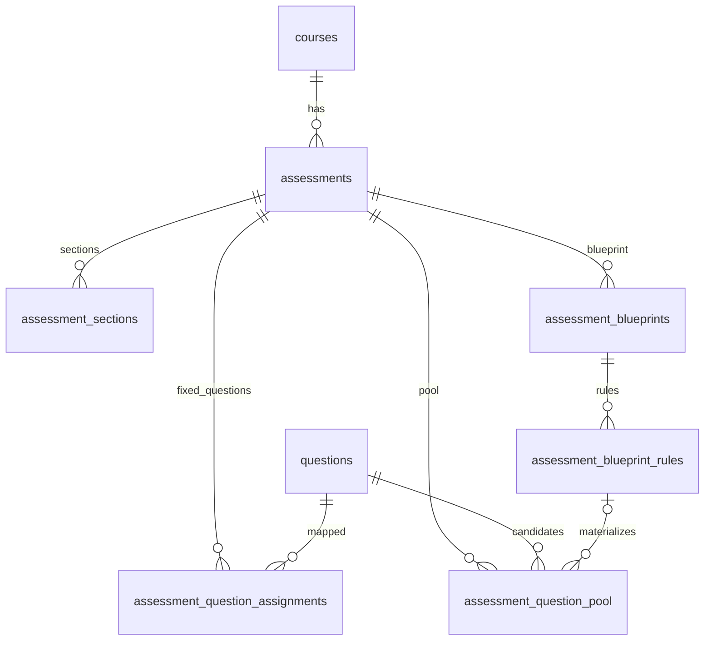
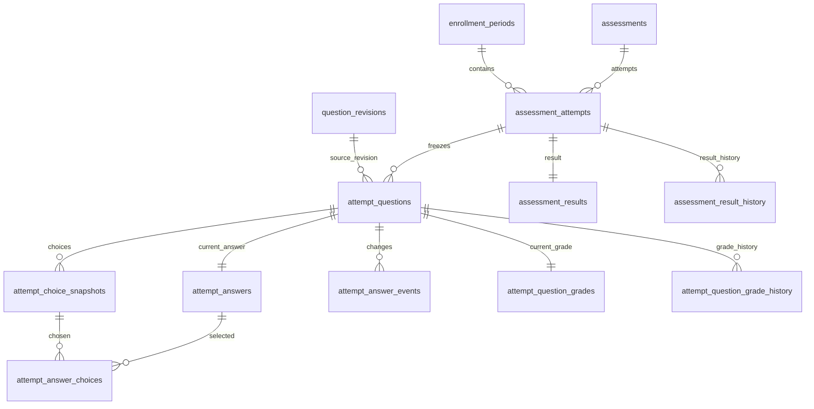
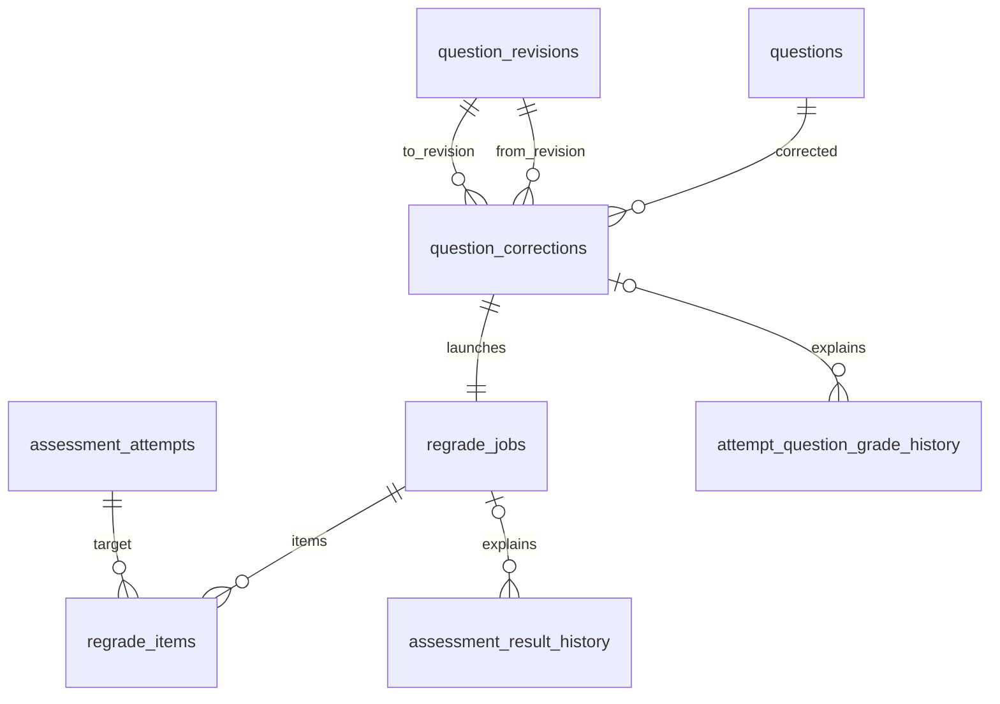
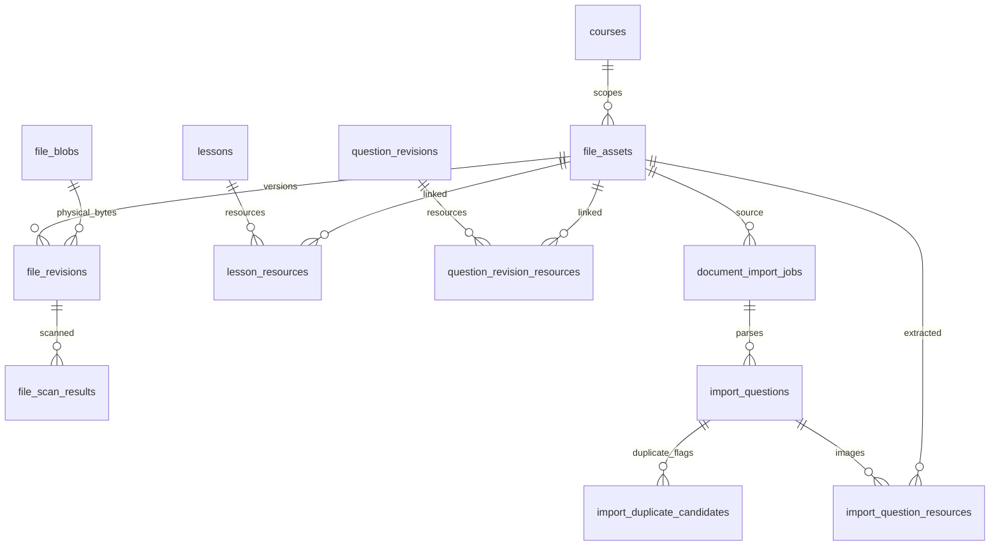
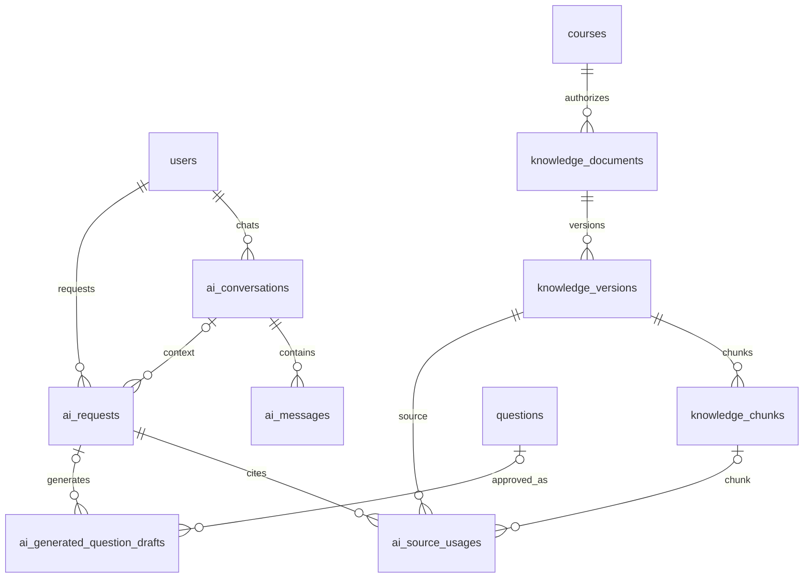
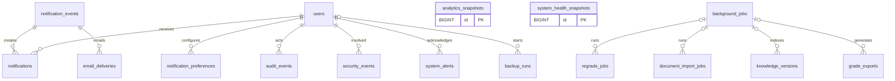

# ERD

The diagrams intentionally omit most columns. Full columns and constraints are in the Data Dictionary.

## 1. High-level domain ERD

## 2. Identity / Auth ERD

## 3. Course / Learning ERD

## 4. Question Bank ERD

## 5. Assessment Structure ERD

## 6. Assessment Attempt / Grading ERD

## 7. Correction / Regrade ERD

## 8. File / Import ERD

## 9. AI / RAG ERD

## 10. Notification / Audit / Operations ERD

## 11. Physical relationship notes

- `users.avatar_file_asset_id`, `courses.thumbnail_file_asset_id`, current revision pointers and background-job pointers are deferred FKs to break DDL cycles.
- `audit_events.target_type/target_id` and `notification_events.target_type/target_id` are deliberately weak/polymorphic references because audit/notification history must survive target deletion. They are the exception, not the modeling default.
- Vector store `vector_key` is not an FK because embeddings are not stored in the primary SQL Server schema.
