# State Machines

The state column is not used when the state can be safely derived. Assessment `OPEN/CLOSED` is the main example: it is derived from `status='PUBLISHED'`, server time and `open_at/close_at`.

## User

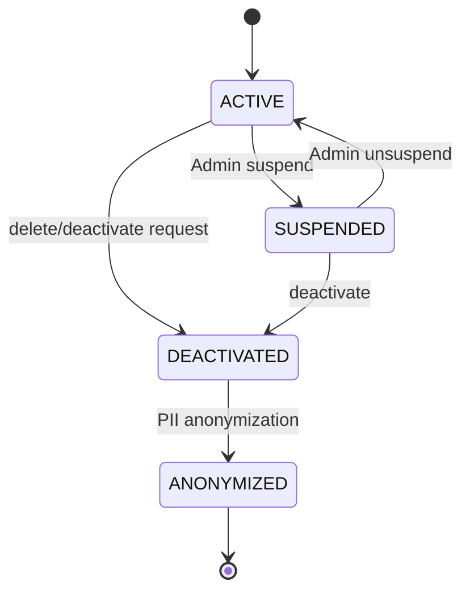

Rules:
- SUSPENDED/DEACTIVATED/ANONYMIZED cannot authenticate.
- Suspend increments `auth_version` and revokes current session/JWT grants.
- Role state is independent of User status.

## Course

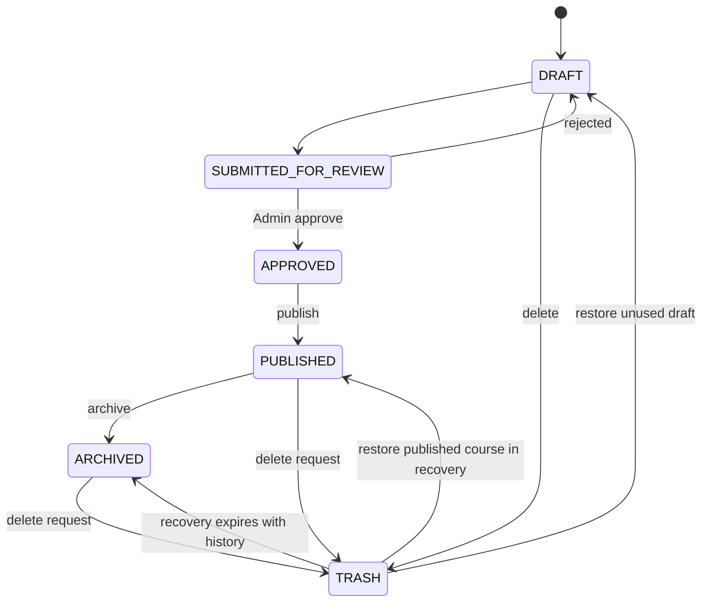

Notes:
- A Course with Student history is not hard-deleted after trash; it becomes historical/archived.
- Course cannot archive/delete while it is an active prerequisite for another Course.
- Material published changes stage in `course_change_requests`.

## Lesson

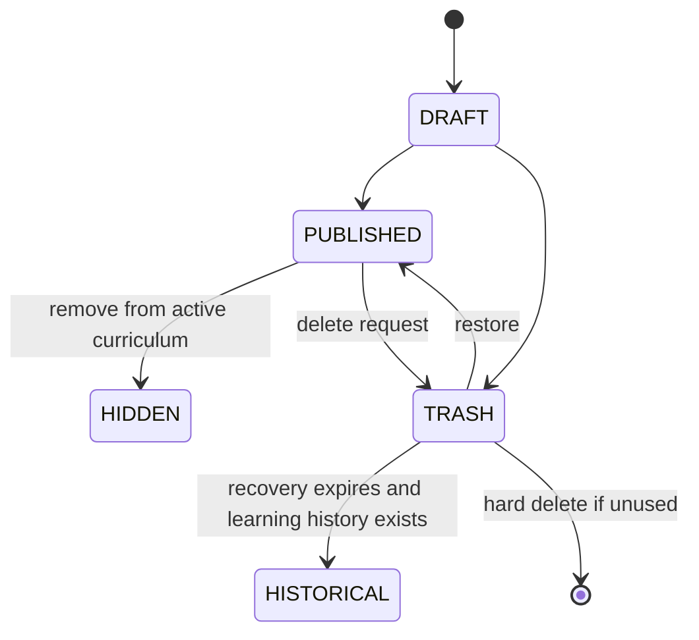

A material rewrite does not clear existing `lesson_progress.completed_at`.

## Enrollment / EnrollmentPeriod

Logical Enrollment:

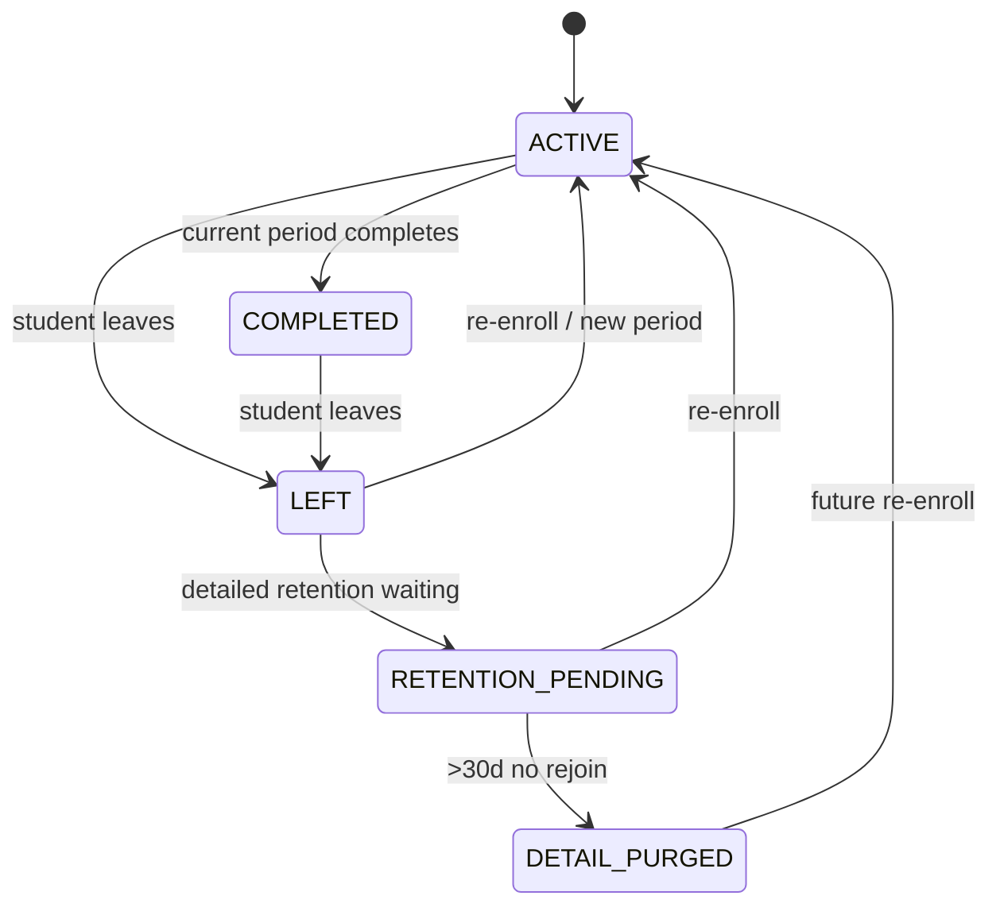

Period:

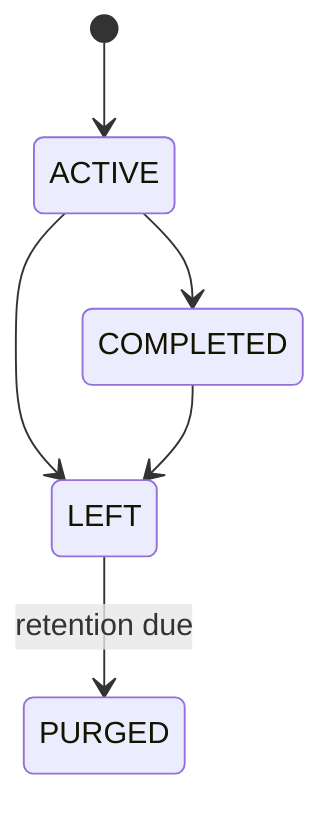

Important:
- re-enroll opens a **new `enrollment_periods` row**, but keeps the same `enrollments` identity;
- new period starts progress from zero;
- `course_completion_summaries.ever_completed` does not reset;
- purged period is excluded from later regrade jobs.

## Question

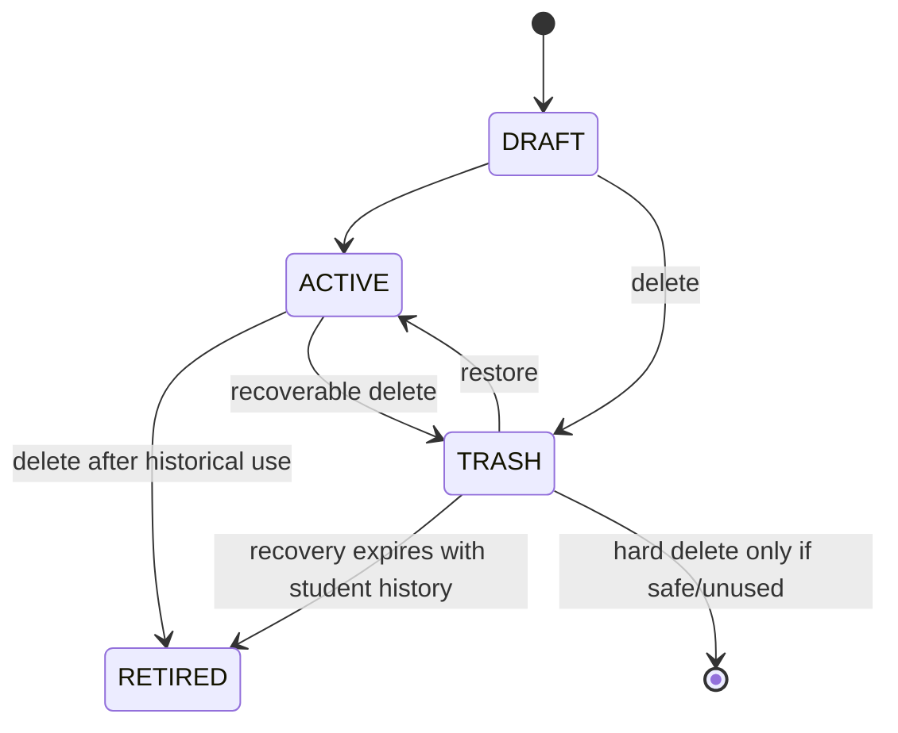

QuestionRevision does not need a status enum. Exposure/grading flags determine historical retention.

## Assessment

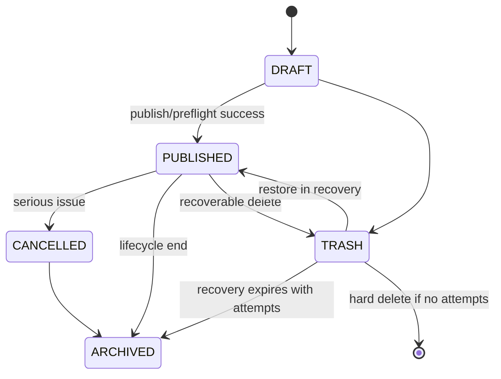

Derived availability:
- **Not yet open**: PUBLISHED and `server_now < open_at`.
- **Open**: PUBLISHED, `open_at IS NULL OR server_now >= open_at`, and `close_at IS NULL OR server_now < close_at`.
- **Closed**: PUBLISHED and `server_now >= close_at`.
- `open_at`, `close_at`, `time_limit_minutes` are immutable after publish.

## AssessmentAttempt

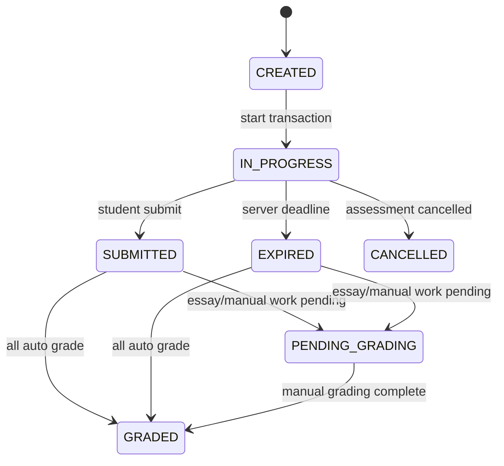

- Deadline = minimum of `started_at + time_limit` and Assessment `close_at`.
- Submit/expire finalizes only server-ACKed answers.
- `GRADED` does not mean score has been released to Student; release is `assessment_results.released_at`.

## FileRevision / FileAsset

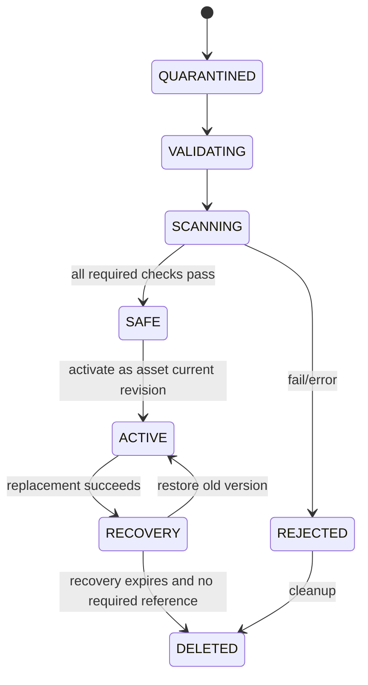

Scanner unavailable/error is fail-closed.

## DocumentImportJob

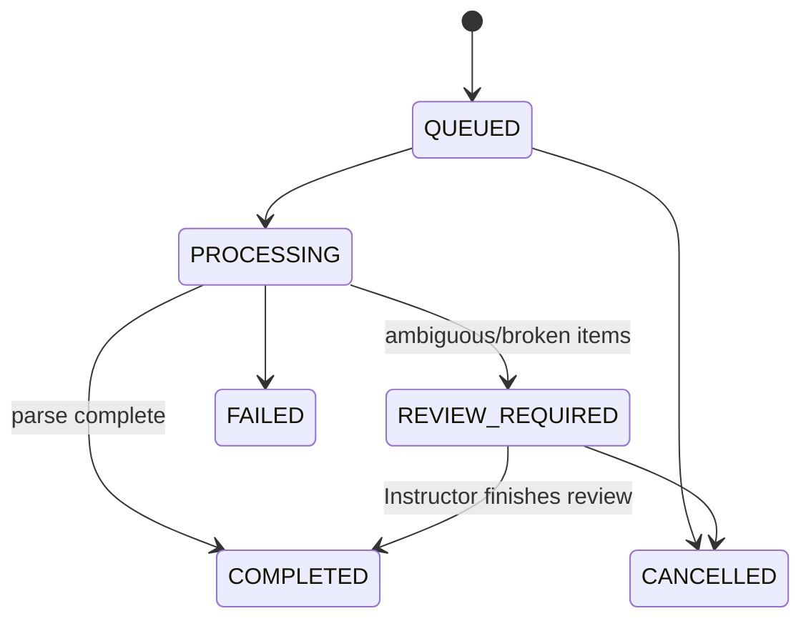

`COMPLETED` means import processing/review is complete, not that an Assessment was automatically published.

## KnowledgeVersion

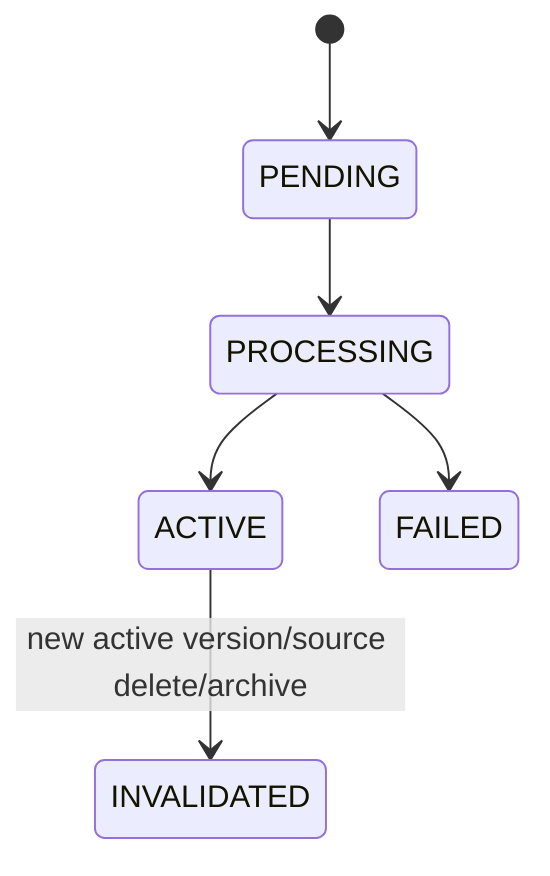

Activation is atomic: set new version ACTIVE, set Document current pointer, invalidate prior active version. A FAILED candidate never becomes current.

## RegradeJob

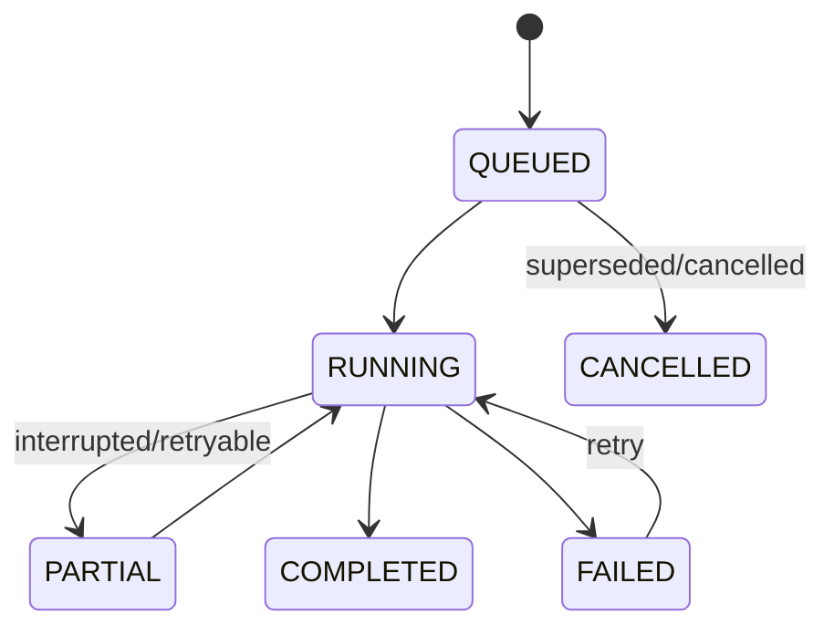

Per-attempt `regrade_items` provide idempotent completion tracking.

## BackgroundJob

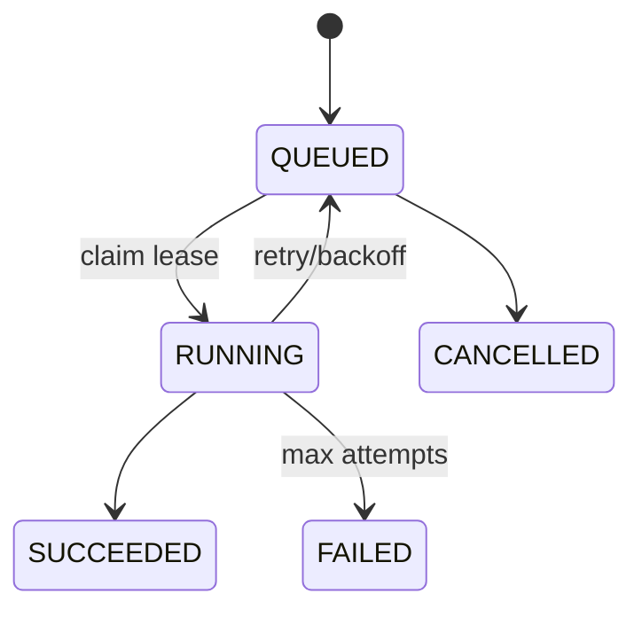

A crashed worker leaves an expiring claim; the job may be reclaimed only when the domain handler is idempotent.

## Notification / Email

Notification:
- created unread;
- `read_at` set once/read idempotently;
- low-value notification may be deleted after `expires_at`.

Email delivery:

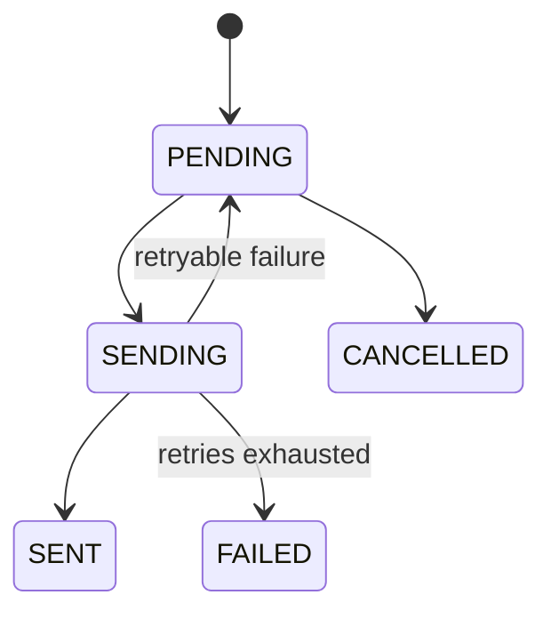

A unique delivery key prevents retry duplication.
