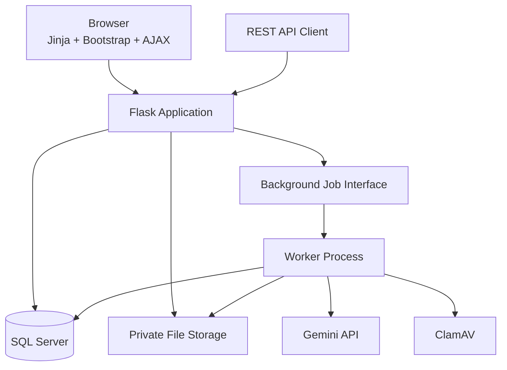

# Container / Runtime View

```mermaid
flowchart TB
    Browser[Browser\nJinja + Bootstrap + AJAX] --> Flask[Flask Application]
    ApiClient[REST API Client] --> Flask
    Flask --> SQL[(SQL Server)]
    Flask --> Files[Private File Storage]
    Flask --> Jobs[Background Job Interface]
    Jobs --> Worker[Worker Process]
    Worker --> SQL
    Worker --> Files
    Worker --> Gemini[Gemini API]
    Worker --> ClamAV[ClamAV]
```

The exact queue technology is intentionally not fixed by this bootstrap. See canonical backend/operations documentation before selecting it.
