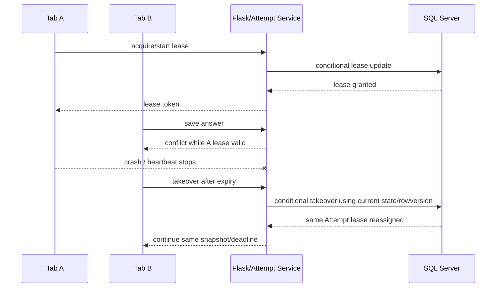

# Key Sequence Diagram Index

Detailed algorithms/workflows are canonical under `docs/system/PWD301_SYSTEM_SPECIFICATION/algorithms/` and `workflows/`.

## Attempt lease takeover

```mermaid
sequenceDiagram
    participant A as Tab A
    participant B as Tab B
    participant S as Flask/Attempt Service
    participant D as SQL Server
    A->>S: acquire/start lease
    S->>D: conditional lease update
    D-->>S: lease granted
    S-->>A: lease token
    B->>S: save answer
    S-->>B: conflict while A lease valid
    A--xS: crash / heartbeat stops
    B->>S: takeover after expiry
    S->>D: conditional takeover using current state/rowversion
    D-->>S: same Attempt lease reassigned
    S-->>B: continue same snapshot/deadline
```
