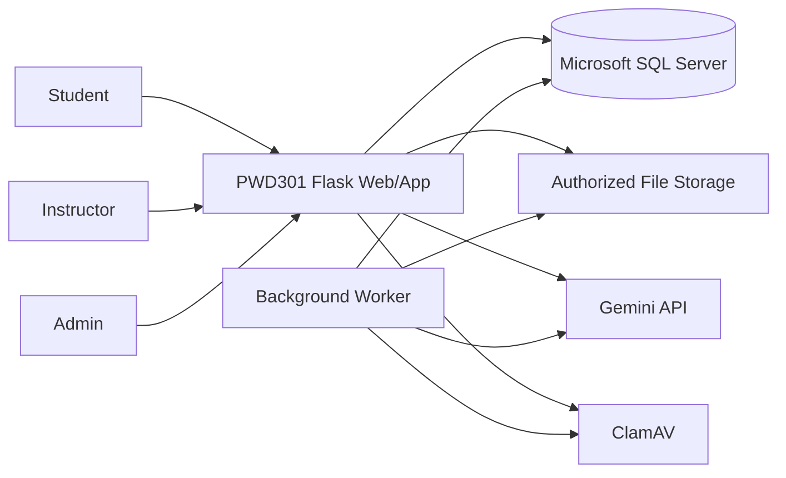

# System Context

```mermaid
flowchart LR
    Student[Student] --> Web[PWD301 Flask Web/App]
    Instructor[Instructor] --> Web
    Admin[Admin] --> Web
    Web --> DB[(Microsoft SQL Server)]
    Web --> Storage[Authorized File Storage]
    Web --> Gemini[Gemini API]
    Web --> ClamAV[ClamAV]
    Worker[Background Worker] --> DB
    Worker --> Storage
    Worker --> Gemini
    Worker --> ClamAV
```

Canonical architecture: [`../system/PWD301_SYSTEM_SPECIFICATION/04_SYSTEM_ARCHITECTURE.md`](../system/PWD301_SYSTEM_SPECIFICATION/04_SYSTEM_ARCHITECTURE.md).
