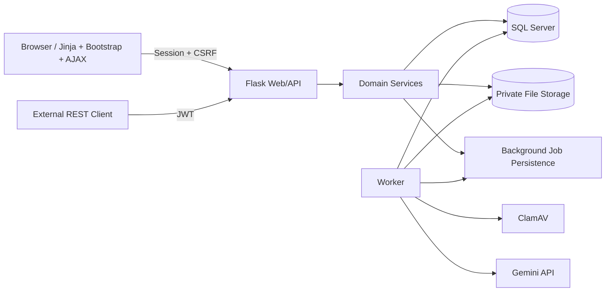

# System Architecture

## Layers
1. **Routes/controllers**: request parsing, auth context, response rendering; no business invariants hidden here.
2. **Authorization policies**: role + object relationship checks.
3. **Services**: validation, state transition, transaction boundary, audit/event creation.
4. **Models/repositories**: persistence/query contracts, optimistic concurrency.
5. **Workers**: retryable long-running jobs with idempotent domain handlers.
6. **External adapters**: file storage, scanner, Gemini, email.

## Deployment
A modular monolith is the baseline. Flask web and worker may run as separate processes/containers against the same SQL Server/private storage. Queue technology is deliberately not locked; persistent job semantics are defined by the database contract.
