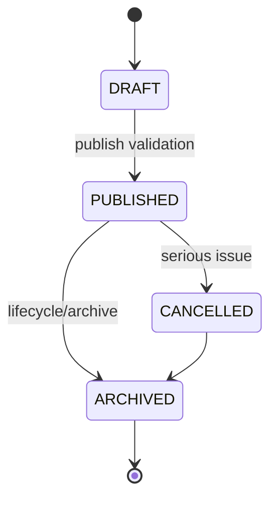

# Assessment State Machine

```mermaid
stateDiagram-v2
[*] --> DRAFT
DRAFT --> PUBLISHED: publish validation
PUBLISHED --> CANCELLED: serious issue
PUBLISHED --> ARCHIVED: lifecycle/archive
CANCELLED --> ARCHIVED
ARCHIVED --> [*]
```

## Semantics
`NOT_YET_OPEN`, `OPEN`, `CLOSED` are preferably derived from PUBLISHED + server time + open_at/close_at, not redundant stored states.
