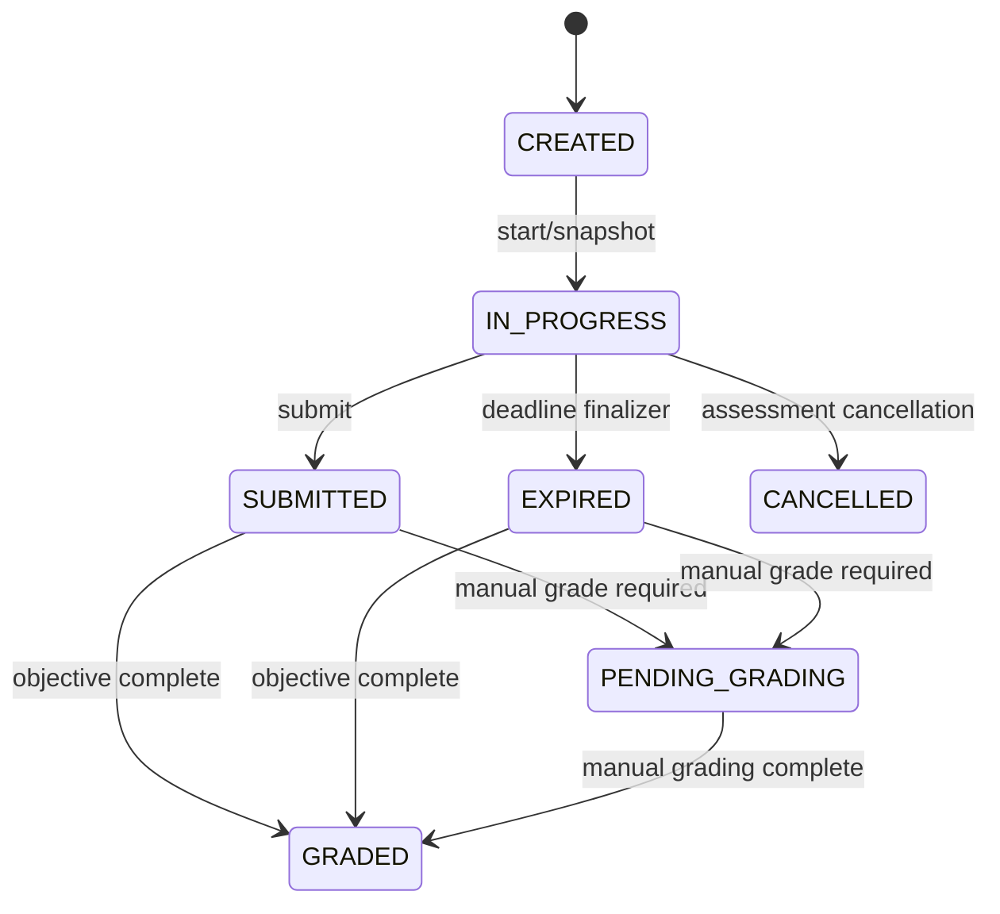

# Assessment Attempt State Machine

```mermaid
stateDiagram-v2
[*] --> CREATED
CREATED --> IN_PROGRESS: start/snapshot
IN_PROGRESS --> SUBMITTED: submit
IN_PROGRESS --> EXPIRED: deadline finalizer
IN_PROGRESS --> CANCELLED: assessment cancellation
SUBMITTED --> PENDING_GRADING: manual grade required
EXPIRED --> PENDING_GRADING: manual grade required
SUBMITTED --> GRADED: objective complete
EXPIRED --> GRADED: objective complete
PENDING_GRADING --> GRADED: manual grading complete
```

## Semantics
Terminal transitions are idempotent. Lease state is separate expiring metadata.
