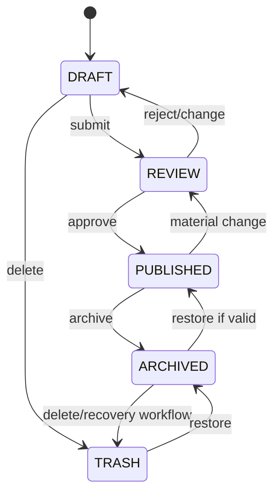

# Course State Machine

```mermaid
stateDiagram-v2
[*] --> DRAFT
DRAFT --> REVIEW: submit
REVIEW --> PUBLISHED: approve
REVIEW --> DRAFT: reject/change
PUBLISHED --> REVIEW: material change
PUBLISHED --> ARCHIVED: archive
ARCHIVED --> PUBLISHED: restore if valid
DRAFT --> TRASH: delete
ARCHIVED --> TRASH: delete/recovery workflow
TRASH --> ARCHIVED: restore
```

## Semantics
OPEN/discoverable aspects depend on stored lifecycle/status; prerequisite references can block archive/delete.
