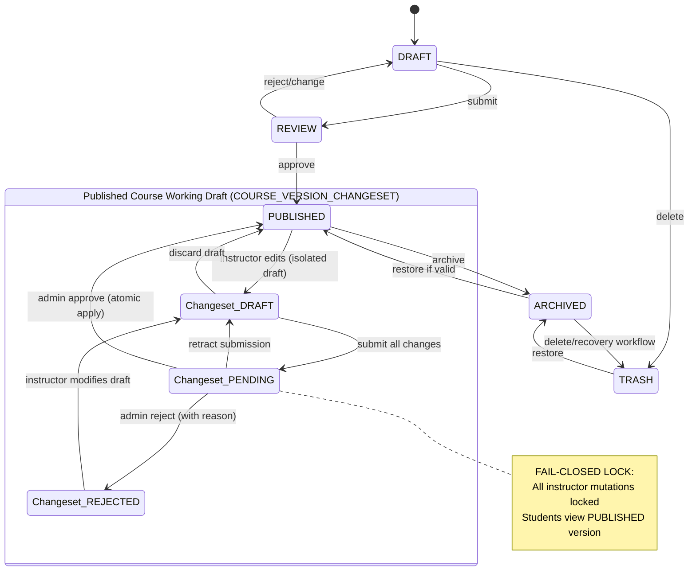

# Course State Machine

## Semantics
- Primary course lifecycle follows DRAFT → REVIEW → PUBLISHED → ARCHIVED/TRASH.
- For published courses, all updates (add/edit/delete/reorder lessons) are staged into an atomic `COURSE_VERSION_CHANGESET`.
- Fragmented or piecemeal approvals are strictly banned.
- When submitted for review (`Changeset_PENDING`), the course is locked fail-closed against instructor mutations until Admin approves or rejects, or instructor retracts.
- Active students continue learning without disruption while changes are staged.

