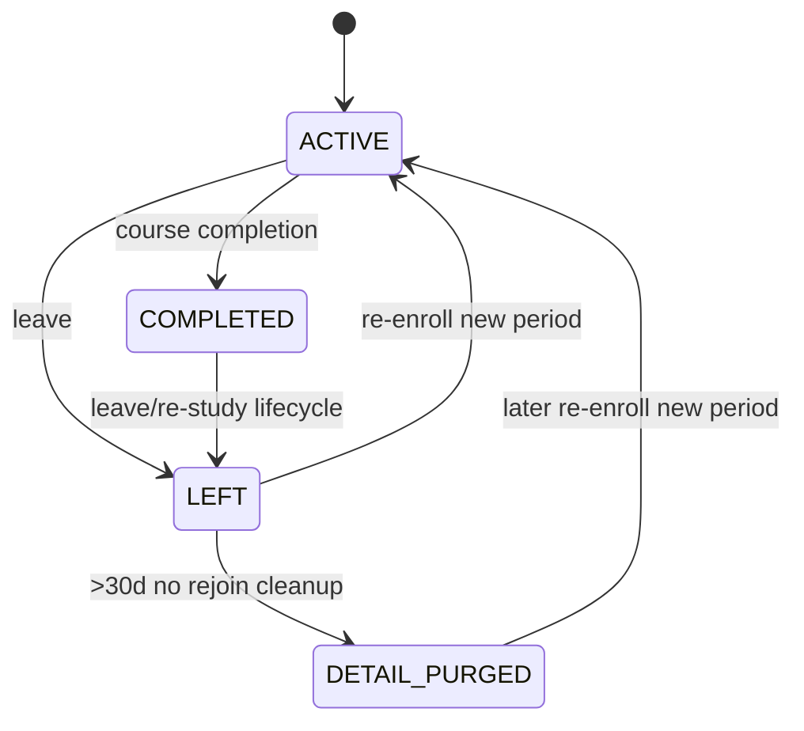

# Enrollment State Machine

```mermaid
stateDiagram-v2
[*] --> ACTIVE
ACTIVE --> LEFT: leave
ACTIVE --> COMPLETED: course completion
COMPLETED --> LEFT: leave/re-study lifecycle
LEFT --> ACTIVE: re-enroll new period
LEFT --> DETAIL_PURGED: >30d no rejoin cleanup
DETAIL_PURGED --> ACTIVE: later re-enroll new period
```

## Semantics
Logical Enrollment persists; each active/rejoin cycle is represented by EnrollmentPeriod.
