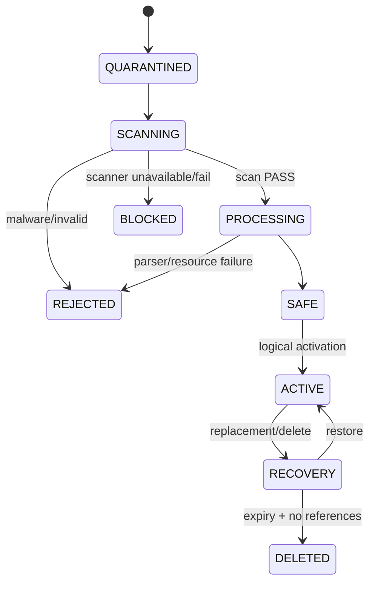

# File Revision State Machine

```mermaid
stateDiagram-v2
[*] --> QUARANTINED
QUARANTINED --> SCANNING
SCANNING --> PROCESSING: scan PASS
SCANNING --> REJECTED: malware/invalid
SCANNING --> BLOCKED: scanner unavailable/fail
PROCESSING --> SAFE
PROCESSING --> REJECTED: parser/resource failure
SAFE --> ACTIVE: logical activation
ACTIVE --> RECOVERY: replacement/delete
RECOVERY --> DELETED: expiry + no references
RECOVERY --> ACTIVE: restore
```

## Semantics
A FileAsset has at most one ACTIVE revision; direct Student access requires safe/active and object authorization.
