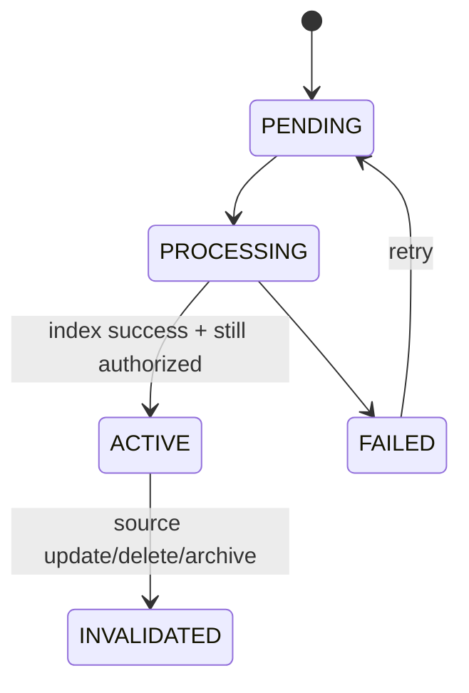

# Knowledge Version State Machine

```mermaid
stateDiagram-v2
[*] --> PENDING
PENDING --> PROCESSING
PROCESSING --> ACTIVE: index success + still authorized
PROCESSING --> FAILED
ACTIVE --> INVALIDATED: source update/delete/archive
FAILED --> PENDING: retry
```

## Semantics
Each KnowledgeDocument has at most one ACTIVE version. Deleted/archived source is immediately non-retrievable.
