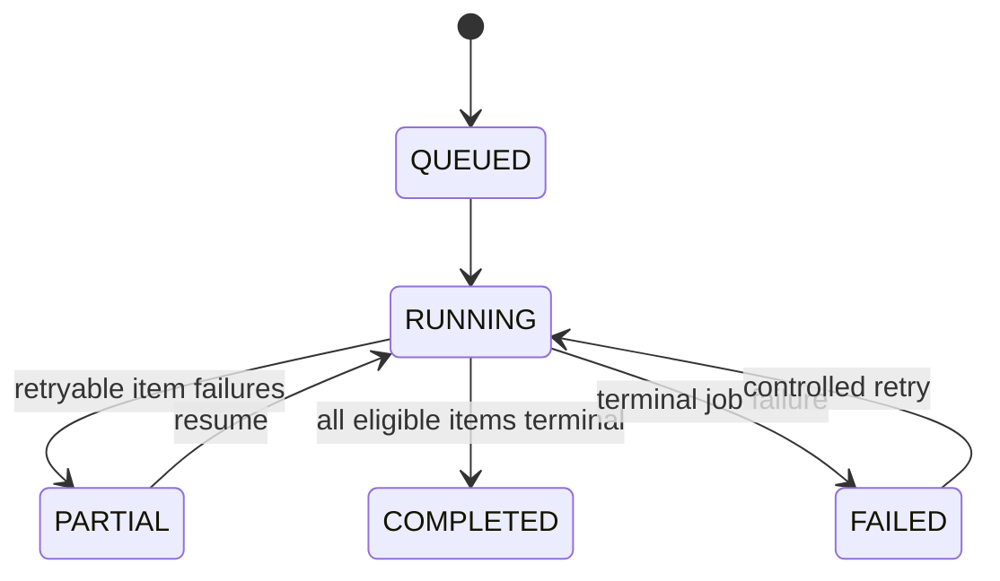

# Regrade Job State Machine

```mermaid
stateDiagram-v2
[*] --> QUEUED
QUEUED --> RUNNING
RUNNING --> PARTIAL: retryable item failures
PARTIAL --> RUNNING: resume
RUNNING --> COMPLETED: all eligible items terminal
RUNNING --> FAILED: terminal job failure
FAILED --> RUNNING: controlled retry
```

## Semantics
Per-attempt RegradeItem uniqueness makes resume idempotent.
