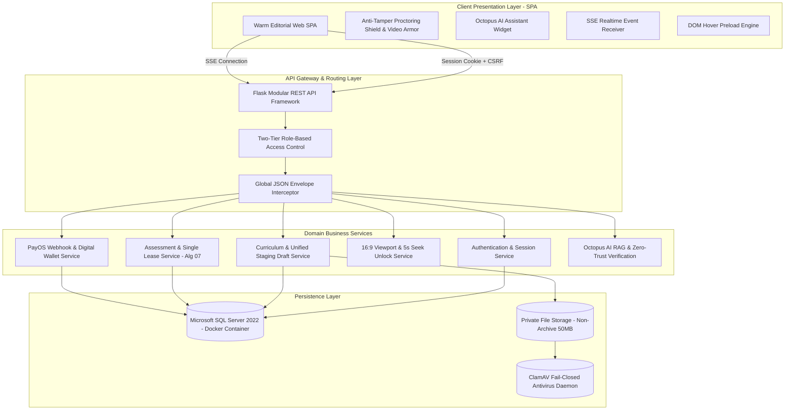

# 02. SYSTEM ARCHITECTURE & COMPONENT TOPOLOGY

```mermaid
flowchart TD
    subgraph Client_Tier [Client Presentation Layer - SPA]
        UI[Warm Editorial Web SPA]
        VA[Anti-Tamper Proctoring Shield & Video Armor]
        AI[Octopus AI Assistant Widget]
        RT[SSE Realtime Event Receiver]
        PR[DOM Hover Preload Engine]
    end

    subgraph API_Gateway [API Gateway & Routing Layer]
        Flask[Flask Modular REST API Framework]
        RBAC[Two-Tier Role-Based Access Control]
        ENV[Global JSON Envelope Interceptor]
    end

    subgraph Service_Tier [Domain Business Services]
        AuthSvc[Authentication & Session Service]
        CourseSvc[Curriculum & Unified Staging Draft Service]
        ExamSvc[Assessment & Single Lease Service - Alg 07]
        MediaSvc[16:9 Viewport & 5s Seek Unlock Service]
        PaySvc[PayOS Webhook & Digital Wallet Service]
        AISvc[Octopus AI RAG & Zero-Trust Verification]
    end

    subgraph Data_Tier [Persistence Layer]
        MSSQL[(Microsoft SQL Server 2022 - Docker Container)]
        Storage[(Private File Storage - Non-Archive 50MB)]
        ClamAV[(ClamAV Fail-Closed Antivirus Daemon)]
    end

    UI -->|Session Cookie + CSRF| Flask
    UI -->|SSE Connection| Flask
    Flask --> RBAC
    RBAC --> ENV
    ENV --> AuthSvc
    ENV --> CourseSvc
    ENV --> ExamSvc
    ENV --> MediaSvc
    ENV --> PaySvc
    ENV --> AISvc
    AuthSvc --> MSSQL
    CourseSvc --> MSSQL
    ExamSvc --> MSSQL
    PaySvc --> MSSQL
    CourseSvc --> Storage
    Storage --> ClamAV
```
